<!--
CO_OP_TRANSLATOR_METADATA:
{
  "original_hash": "1710a50a519a6e4a1b40a5638783018d",
  "translation_date": "2026-01-06T17:44:14+00:00",
  "source_file": "2-js-basics/4-arrays-loops/README.md",
  "language_code": "pt"
}
-->
# JavaScript Básico: Arrays e Loops


> Sketchnote por [Tomomi Imura](https://twitter.com/girlie_mac)

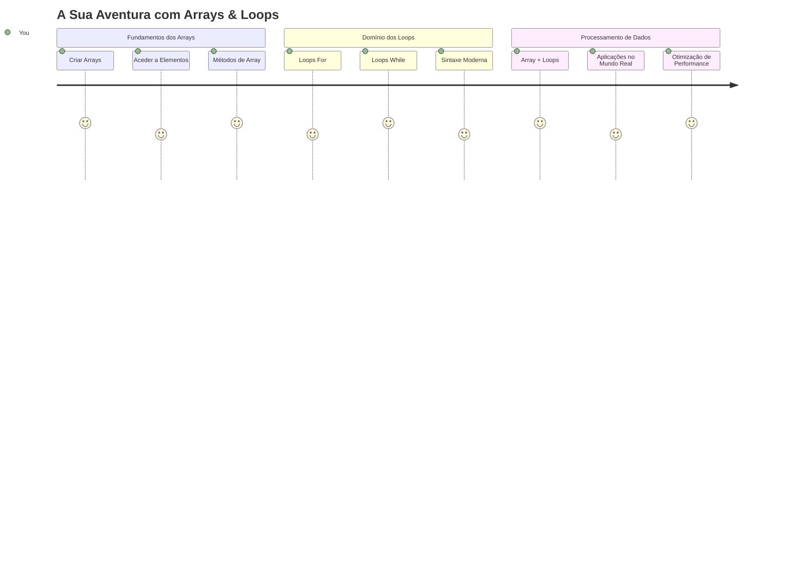
## Quiz Pré-Lição
[Quiz pré-lição](https://ff-quizzes.netlify.app/web/quiz/13)

Já alguma vez se questionou como os sites mantêm o controlo dos itens do carrinho de compras ou mostram a sua lista de amigos? É aqui que entram os arrays e os loops. Arrays são como contentores digitais que guardam múltiplas informações, enquanto loops permitem trabalhar com todos esses dados de forma eficiente sem código repetitivo.

Juntos, esses dois conceitos formam a base para lidar com informação nos seus programas. Aprenderá a passar de escrever manualmente cada passo para criar um código inteligente e eficiente que pode processar centenas ou até milhares de itens rapidamente.

No final desta lição, compreenderá como realizar tarefas complexas de dados com apenas algumas linhas de código. Vamos explorar estes conceitos essenciais de programação.

[](https://youtube.com/watch?v=1U4qTyq02Xw "Arrays")

[](https://www.youtube.com/watch?v=Eeh7pxtTZ3k "Loops")

> 🎥 Clique nas imagens acima para vídeos sobre arrays e loops.

> Pode fazer esta lição na [Microsoft Learn](https://docs.microsoft.com/learn/modules/web-development-101-arrays/?WT.mc_id=academic-77807-sagibbon)!

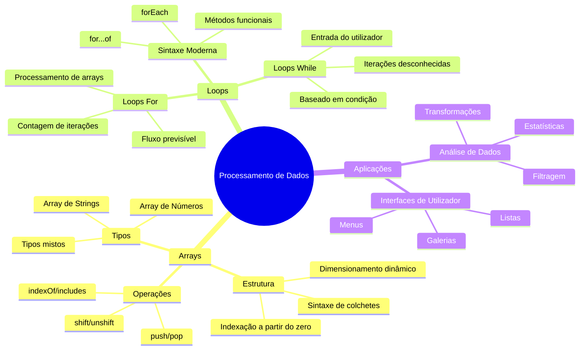
## Arrays

Pense nos arrays como um arquivo digital - em vez de armazenar um documento por gaveta, pode organizar vários itens relacionados num único contentor estruturado. Em termos de programação, arrays permitem armazenar múltiplos pedaços de informação num pacote organizado.

Quer esteja a construir uma galeria de fotos, a gerir uma lista de tarefas ou a acompanhar pontuações altas num jogo, os arrays fornecem a base para a organização dos dados. Vamos ver como funcionam.

✅ Os arrays estão por todo o lado! Consegue pensar num exemplo real de array, como um conjunto de painéis solares?

### Criar Arrays

Criar um array é super simples - basta usar colchetes!

```javascript
// Array vazio - como um carrinho de compras vazio à espera de artigos
const myArray = [];
```

**O que está a acontecer aqui?**
Acabou de criar um contentor vazio usando esses colchetes `[]`. Pense nele como uma prateleira vazia numa biblioteca - está pronta para guardar os livros que quiser organizar lá.

Também pode preencher o seu array com valores iniciais logo desde o início:

```javascript
// O menu de sabores da sua gelataria
const iceCreamFlavors = ["Chocolate", "Strawberry", "Vanilla", "Pistachio", "Rocky Road"];

// Informações do perfil de um utilizador (misturando diferentes tipos de dados)
const userData = ["John", 25, true, "developer"];

// Notas dos testes da sua disciplina favorita
const scores = [95, 87, 92, 78, 85];
```

**Coisas interessantes a notar:**
- Pode armazenar texto, números ou até valores verdadeiro/falso no mesmo array
- Basta separar cada item com uma vírgula - fácil!
- Arrays são perfeitos para manter informações relacionadas juntas

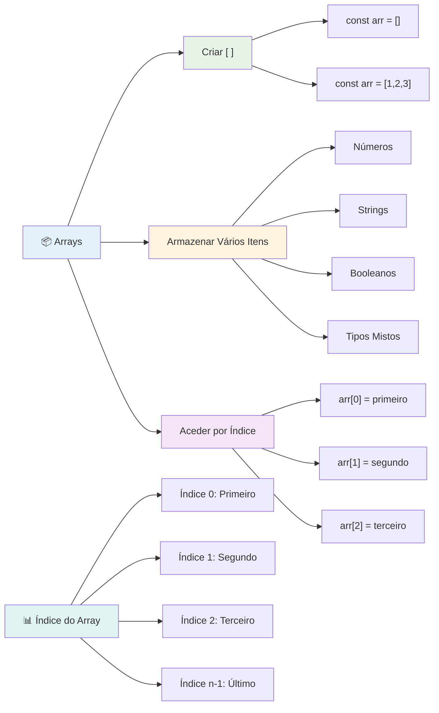
### Indexação de Arrays

Aqui está algo que pode parecer estranho à primeira vista: os arrays numeram os seus itens começando do 0, não do 1. Esta indexação baseada em zero tem origem na forma como a memória do computador funciona - é uma convenção de programação desde os primeiros dias de linguagens como C. Cada lugar no array recebe o seu próprio número de endereço chamado **índice**.

| Índice | Valor | Descrição |
|-------|-------|-------------|
| 0 | "Chocolate" | Primeiro elemento |
| 1 | "Morango" | Segundo elemento |
| 2 | "Baunilha" | Terceiro elemento |
| 3 | "Pistacho" | Quarto elemento |
| 4 | "Rocky Road" | Quinto elemento |

✅ Surpreende-o que os arrays comecem no índice zero? Em algumas linguagens de programação, os índices começam no 1. Existe uma história interessante sobre isto, que pode [ler na Wikipedia](https://en.wikipedia.org/wiki/Zero-based_numbering).

**Aceder a Elementos do Array:**

```javascript
const iceCreamFlavors = ["Chocolate", "Strawberry", "Vanilla", "Pistachio", "Rocky Road"];

// Aceda a elementos individuais usando notação de colchetes
console.log(iceCreamFlavors[0]); // "Chocolate" - primeiro elemento
console.log(iceCreamFlavors[2]); // "Baunilha" - terceiro elemento
console.log(iceCreamFlavors[4]); // "Rocky Road" - último elemento
```

**Análise do que acontece aqui:**
- **Usa** a notação de colchetes com o número do índice para aceder aos elementos
- **Retorna** o valor armazenado nessa posição específica no array
- **Começa** a contar a partir do 0, tornando o primeiro elemento o índice 0

**Modificar Elementos do Array:**

```javascript
// Alterar um valor existente
iceCreamFlavors[4] = "Butter Pecan";
console.log(iceCreamFlavors[4]); // "Pecan com Manteiga"

// Adicionar um novo elemento no fim
iceCreamFlavors[5] = "Cookie Dough";
console.log(iceCreamFlavors[5]); // "Massa de Biscoito"
```

**No exemplo acima, nós:**
- **Modificámos** o elemento no índice 4 de "Rocky Road" para "Butter Pecan"
- **Adicionámos** um novo elemento "Cookie Dough" no índice 5
- **Expandimos** automaticamente o comprimento do array ao adicionar além dos limites atuais

### Comprimento do Array e Métodos Comuns

Os arrays vêm com propriedades e métodos incorporados que tornam o trabalho com dados muito mais fácil.

**Encontrar o Comprimento do Array:**

```javascript
const iceCreamFlavors = ["Chocolate", "Strawberry", "Vanilla", "Pistachio", "Rocky Road"];
console.log(iceCreamFlavors.length); // 5

// O comprimento actualiza-se automaticamente à medida que o array muda
iceCreamFlavors.push("Mint Chip");
console.log(iceCreamFlavors.length); // 6
```

**Pontos-chave a lembrar:**
- **Retorna** o número total de elementos no array
- **Atualiza-se** automaticamente quando elementos são adicionados ou removidos
- **Fornece** uma contagem dinâmica útil para loops e validações

**Métodos Essenciais de Arrays:**

```javascript
const fruits = ["apple", "banana", "orange"];

// Adicionar elementos
fruits.push("grape");           // Adiciona no fim: ["apple", "banana", "orange", "grape"]
fruits.unshift("strawberry");   // Adiciona no início: ["strawberry", "apple", "banana", "orange", "grape"]

// Remover elementos
const lastFruit = fruits.pop();        // Remove e devolve "grape"
const firstFruit = fruits.shift();     // Remove e devolve "strawberry"

// Encontrar elementos
const index = fruits.indexOf("banana"); // Devolve 1 (posição de "banana")
const hasApple = fruits.includes("apple"); // Devolve true
```

**Compreender estes métodos:**
- **Adiciona** elementos com `push()` (final) e `unshift()` (início)
- **Remove** elementos com `pop()` (final) e `shift()` (início)
- **Localiza** elementos com `indexOf()` e verifica existência com `includes()`
- **Retorna** valores úteis como elementos removidos ou índices de posição

✅ Experimente por si próprio! Use a consola do seu navegador para criar e manipular um array à sua escolha.

### 🧠 **Verificação de Fundamentos de Arrays: Organizando os Seus Dados**

**Teste a sua compreensão de arrays:**
- Porque acha que os arrays começam a contar a partir do 0 em vez de 1?
- O que acontece se tentar aceder a um índice que não existe (como `arr[100]` num array de 5 elementos)?
- Consegue pensar em três cenários reais onde arrays seriam úteis?

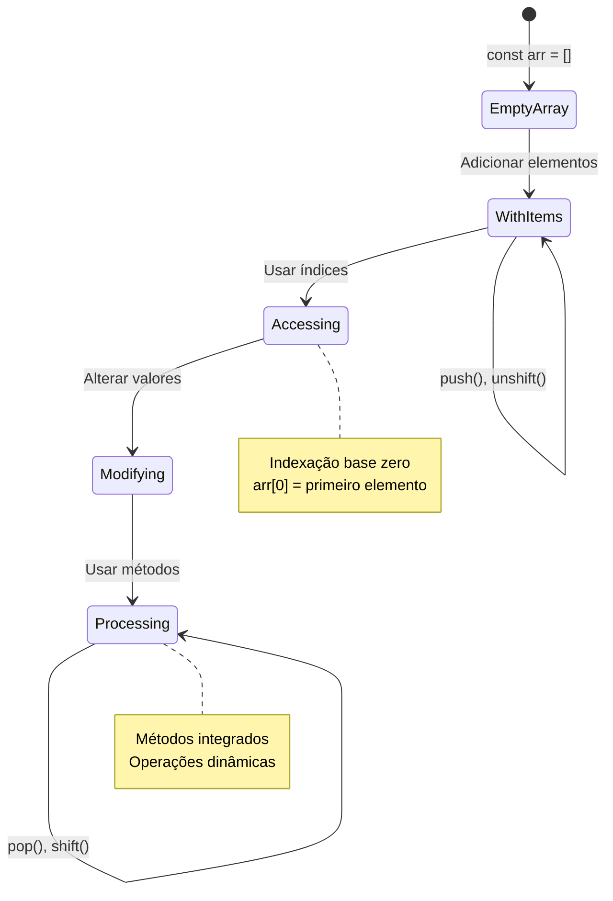
> **Perspetiva do mundo real**: Arrays estão por toda a programação! Feeds de redes sociais, carrinhos de compras, galerias de fotos, listas de reprodução de músicas - tudo é baseado em arrays por detrás da cena!

## Loops

Pense na famosa punição dos romances de Charles Dickens onde os alunos tinham de copiar frases repetidamente numa ardósia. Imagine se pudesse simplesmente instruir alguém para "escrever esta frase 100 vezes" e que isso fosse feito automaticamente. É exatamente isso que os loops fazem pelo seu código.

Loops são como ter um assistente incansável que pode repetir tarefas sem erro. Quer precise de verificar cada item num carrinho de compras ou mostrar todas as fotos num álbum, os loops tratam da repetição de forma eficiente.

JavaScript oferece vários tipos de loops para escolher. Vamos examinar cada um e entender quando usá-los.

```mermaid
flowchart TD
    A["🔄 Tipos de Loops"] --> B["Loop For"]
    A --> C["Loop While"]
    A --> D["Loop For...of"]
    A --> E["Método forEach"]
    
    B --> B1["Iterações conhecidas"]
    B --> B2["Baseado em contador"]
    B --> B3["for(init; condição; incremento)"]
    
    C --> C1["Iterações desconhecidas"]
    C --> C2["Baseado em condição"]
    C --> C3["while(condição)"]
    
    D --> D1["Moderno ES6+"]
    D --> D2["Iteração de array"]
    D --> D3["for(item do array)"]
    
    E --> E1["Estilo funcional"]
    E --> E2["Método de array"]
    E --> E3["array.forEach(callback)"]
    
    F["⏰ Quando Usar"] --> F1["For: Contagem, índices"]
    F --> F2["While: Entrada do utilizador, pesquisa"]
    F --> F3["For...of: Iteração simples"]
    F --> F4["forEach: Programação funcional"]
    
    style A fill:#e3f2fd
    style B fill:#e8f5e8
    style C fill:#fff3e0
    style D fill:#f3e5f5
    style E fill:#e0f2f1
    style F fill:#fce4ec
```
### Loop For

O `for` loop é como definir um temporizador - sabe exatamente quantas vezes quer que algo aconteça. É muito organizado e previsível, o que o torna perfeito quando trabalha com arrays ou precisa contar coisas.

**Estrutura do Loop For:**

| Componente | Finalidade | Exemplo |
|-----------|---------|----------|
| **Inicialização** | Define o ponto de partida | `let i = 0` |
| **Condição** | Quando continuar | `i < 10` |
| **Incremento** | Como atualizar | `i++` |

```javascript
// Contar de 0 a 9
for (let i = 0; i < 10; i++) {
  console.log(`Count: ${i}`);
}

// Exemplo mais prático: processamento de pontuações
const testScores = [85, 92, 78, 96, 88];
for (let i = 0; i < testScores.length; i++) {
  console.log(`Student ${i + 1}: ${testScores[i]}%`);
}
```

**Passo a passo, aqui está o que está a acontecer:**
- **Inicializa** a variável contador `i` a 0 no início
- **Verifica** a condição `i < 10` antes de cada iteração
- **Executa** o bloco de código quando a condição é verdadeira
- **Incrementa** `i` em 1 após cada iteração com `i++`
- **Para** quando a condição se torna falsa (quando `i` chega a 10)

✅ Execute este código na consola de um navegador. O que acontece quando faz pequenas alterações ao contador, condição ou expressão de iteração? Consegue fazê-lo correr para trás, criando uma contagem decrescente?

### 🗓️ **Verificação de Domínio do Loop For: Repetição Controlada**

**Avalie a sua compreensão do for loop:**
- Quais são as três partes de um loop for, e o que faz cada uma?
- Como faria para percorrer um array de trás para a frente?
- O que acontece se se esquecer da parte do incremento (`i++`)?

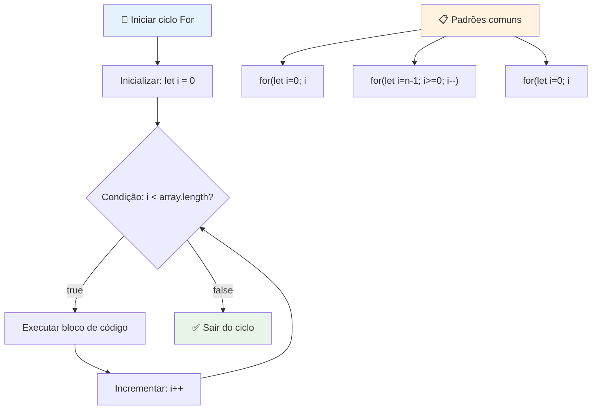
> **Sabedoria dos loops**: Os loops for são perfeitos quando sabe exatamente quantas vezes precisa repetir algo. São a escolha mais comum para processamento de arrays!

### Loop While

O `while` loop é como dizer "continue a fazer isto até..." - pode não saber exatamente quantas vezes vai correr, mas sabe quando parar. É perfeito para coisas como pedir a um utilizador uma entrada até que este forneça o que precisa, ou procurar dados até encontrar o que procura.

**Características do Loop While:**
- **Continua** a executar enquanto a condição for verdadeira
- **Requer** gestão manual de quaisquer variáveis contador
- **Verifica** a condição antes de cada iteração
- **Risco** de ciclos infinitos se a condição nunca se tornar falsa

```javascript
// Exemplo básico de contagem
let i = 0;
while (i < 10) {
  console.log(`While count: ${i}`);
  i++; // Não te esqueças de incrementar!
}

// Exemplo mais prático: processamento de entrada do utilizador
let userInput = "";
let attempts = 0;
const maxAttempts = 3;

while (userInput !== "quit" && attempts < maxAttempts) {
  userInput = prompt(`Enter 'quit' to exit (attempt ${attempts + 1}):`);
  attempts++;
}

if (attempts >= maxAttempts) {
  console.log("Maximum attempts reached!");
}
```

**Compreendendo estes exemplos:**
- **Gere** manualmente a variável contador `i` dentro do corpo do loop
- **Incrementa** o contador para evitar ciclos infinitos
- **Demonstra** caso prático com entrada do utilizador e limitação de tentativas
- **Inclui** mecanismos de segurança para impedir execução interminável

### ♾️ **Verificação de Sabedoria do Loop While: Repetição Baseada em Condição**

**Teste a sua compreensão do loop while:**
- Qual é o maior perigo ao usar loops while?
- Quando escolheria um loop while em vez de um for?
- Como pode prevenir ciclos infinitos?

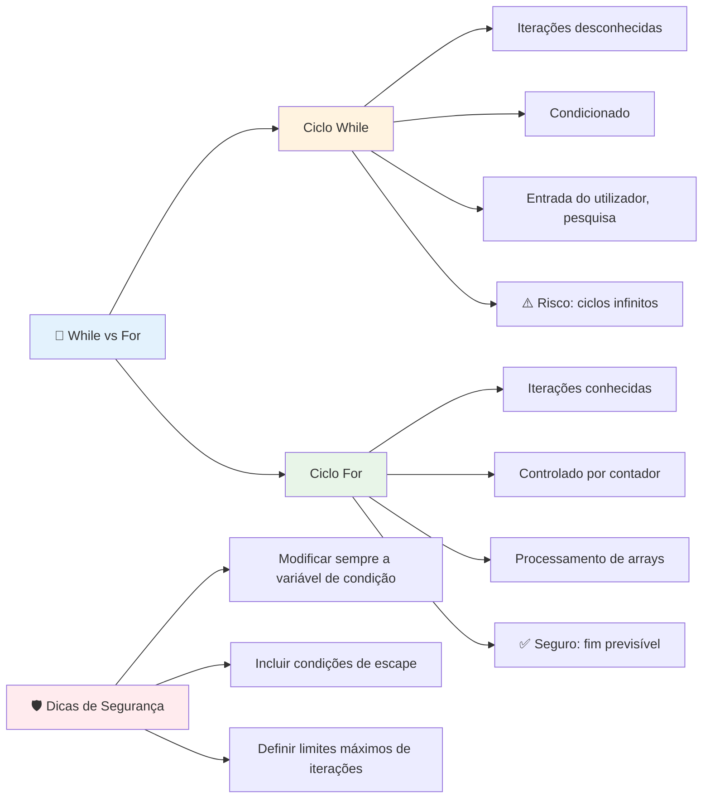
> **Segurança em primeiro lugar**: Os loops while são poderosos mas exigem uma gestão cuidadosa das condições. Garantir sempre que a condição do loop acabará por ser falsa!

### Alternativas Modernas para Loops

JavaScript oferece sintaxe moderna para loops que pode tornar o seu código mais legível e menos propenso a erros.

**For...of Loop (ES6+):**

```javascript
const colors = ["red", "green", "blue", "yellow"];

// Abordagem moderna - mais limpa e segura
for (const color of colors) {
  console.log(`Color: ${color}`);
}

// Comparar com o ciclo for tradicional
for (let i = 0; i < colors.length; i++) {
  console.log(`Color: ${colors[i]}`);
}
```

**Vantagens chave do for...of:**
- **Elimina** a gestão de índices e possíveis erros “off-by-one”
- **Fornece** acesso direto aos elementos do array
- **Melhora** a legibilidade do código e reduz a complexidade da sintaxe

**Método forEach:**

```javascript
const prices = [9.99, 15.50, 22.75, 8.25];

// Usar forEach para estilo de programação funcional
prices.forEach((price, index) => {
  console.log(`Item ${index + 1}: $${price.toFixed(2)}`);
});

// forEach com funções arrow para operações simples
prices.forEach(price => console.log(`Price: $${price}`));
```

**O que precisa saber sobre forEach:**
- **Executa** uma função para cada elemento do array
- **Fornece** tanto o valor do elemento como o índice como parâmetros
- **Não pode** ser interrompido antecipadamente (ao contrário dos loops tradicionais)
- **Retorna** undefined (não cria um novo array)

✅ Porque escolheria um loop for vs. um loop while? 17 mil visualizadores fizeram a mesma pergunta no StackOverflow, e algumas das opiniões [podem ser interessantes para si](https://stackoverflow.com/questions/39969145/while-loops-vs-for-loops-in-javascript).

### 🎨 **Verificação da Sintaxe de Loops Modernos: Abraçando ES6+**

**Avalie a sua compreensão do JavaScript moderno:**
- Quais são as vantagens do `for...of` em relação aos loops for tradicionais?
- Quando ainda pode preferir loops for tradicionais?
- Qual é a diferença entre `forEach` e `map`?

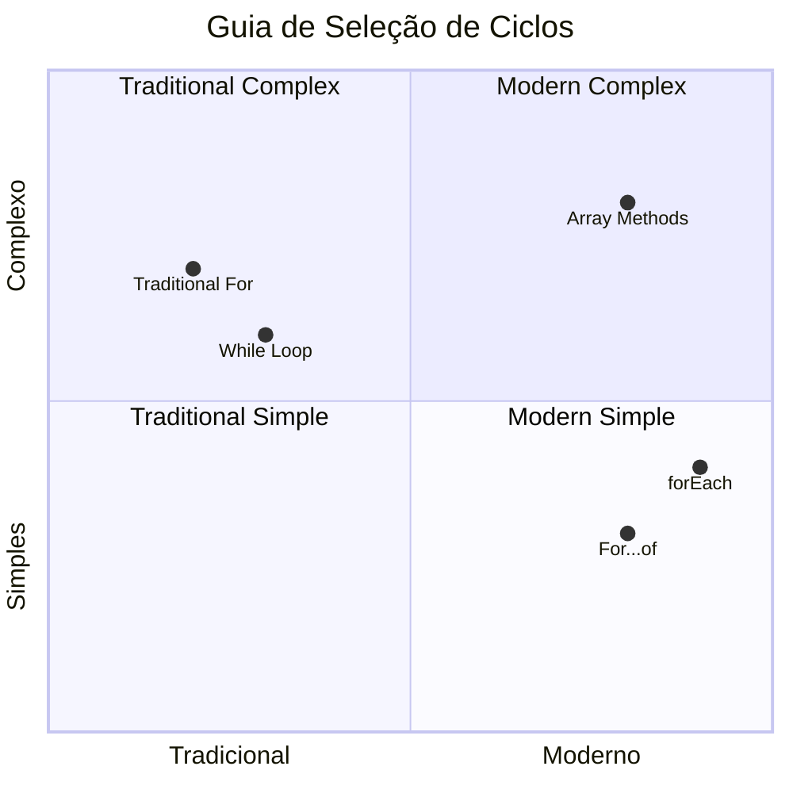
> **Tendência moderna**: A sintaxe ES6+ como `for...of` e `forEach` está a tornar-se a abordagem preferida para iterar sobre arrays porque é mais limpa e menos sujeita a erros!

## Loops e Arrays

Combinar arrays com loops cria capacidades poderosas de processamento de dados. Esta dupla é fundamental para muitas tarefas de programação, desde mostrar listas até calcular estatísticas.

**Processamento Tradicional de Arrays:**

```javascript
const iceCreamFlavors = ["Chocolate", "Strawberry", "Vanilla", "Pistachio", "Rocky Road"];

// Abordagem clássica com ciclo for
for (let i = 0; i < iceCreamFlavors.length; i++) {
  console.log(`Flavor ${i + 1}: ${iceCreamFlavors[i]}`);
}

// Abordagem moderna com for...of
for (const flavor of iceCreamFlavors) {
  console.log(`Available flavor: ${flavor}`);
}
```

**Vamos entender cada abordagem:**
- **Usa** a propriedade comprimento do array para determinar o limite do loop
- **Acede** aos elementos pelo índice nos loops for tradicionais
- **Fornece** acesso direto aos elementos nos loops for...of
- **Processa** cada elemento do array exatamente uma vez

**Exemplo Prático de Processamento de Dados:**

```javascript
const studentGrades = [85, 92, 78, 96, 88, 73, 89];
let total = 0;
let highestGrade = studentGrades[0];
let lowestGrade = studentGrades[0];

// Processar todas as notas com um único ciclo
for (let i = 0; i < studentGrades.length; i++) {
  const grade = studentGrades[i];
  total += grade;
  
  if (grade > highestGrade) {
    highestGrade = grade;
  }
  
  if (grade < lowestGrade) {
    lowestGrade = grade;
  }
}

const average = total / studentGrades.length;
console.log(`Average: ${average.toFixed(1)}`);
console.log(`Highest: ${highestGrade}`);
console.log(`Lowest: ${lowestGrade}`);
```

**Aqui está como este código funciona:**
- **Inicializa** variáveis para rastrear soma e extremos
- **Processa** cada nota com um único loop eficiente
- **Acumula** o total para cálculo da média
- **Regista** os valores mais altos e mais baixos durante a iteração
- **Calcula** estatísticas finais após o término do loop

✅ Experimente fazer um loop sobre um array criado por si na consola do seu navegador.

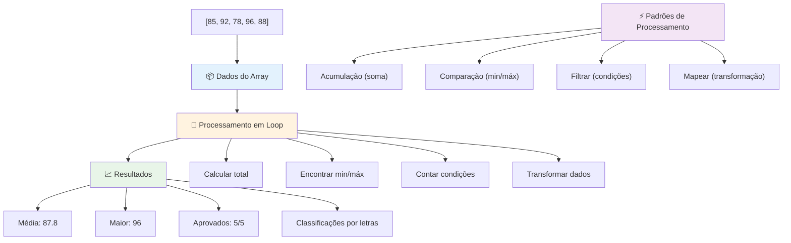
---

## Desafio do Agente GitHub Copilot 🚀

Use o modo Agente para completar o seguinte desafio:

**Descrição:** Construa uma função abrangente de processamento de dados que combine arrays e loops para analisar um conjunto de dados e gerar insights significativos.

**Enunciado:** Crie uma função chamada `analyzeGrades` que receba um array de objetos de notas de estudantes (cada um contendo propriedades de nome e pontuação) e retorne um objeto com estatísticas incluindo a maior pontuação, menor pontuação, pontuação média, número de estudantes que passaram (pontuação >= 70) e um array com os nomes dos estudantes que obtiveram acima da média. Use pelo menos dois tipos diferentes de loops na sua solução.

Saiba mais sobre o [modo agente](https://code.visualstudio.com/blogs/2025/02/24/introducing-copilot-agent-mode) aqui.

## 🚀 Desafio
JavaScript oferece vários métodos modernos para arrays que podem substituir os loops tradicionais para tarefas específicas. Explore [forEach](https://developer.mozilla.org/docs/Web/JavaScript/Reference/Global_Objects/Array/forEach), [for-of](https://developer.mozilla.org/docs/Web/JavaScript/Reference/Statements/for...of), [map](https://developer.mozilla.org/docs/Web/JavaScript/Reference/Global_Objects/Array/map), [filter](https://developer.mozilla.org/docs/Web/JavaScript/Reference/Global_Objects/Array/filter) e [reduce](https://developer.mozilla.org/docs/Web/JavaScript/Reference/Global_Objects/Array/reduce).

**O seu desafio:** Refatore o exemplo das notas dos alunos usando pelo menos três métodos diferentes de arrays. Repare como o código fica muito mais limpo e legível com a sintaxe moderna do JavaScript.

## Questionário Pós-Aula
[Questionário pós-aula](https://ff-quizzes.netlify.app/web/quiz/14)


## Revisão & Estudo Autónomo

Os arrays em JavaScript têm muitos métodos associados que são extremamente úteis para manipulação de dados. [Leia sobre estes métodos](https://developer.mozilla.org/docs/Web/JavaScript/Reference/Global_Objects/Array) e experimente alguns deles (como push, pop, slice e splice) num array criado por si.

## Tarefa

[Loopar um Array](assignment.md)

---

## 📊 **Resumo da Sua Caixa de Ferramentas de Arrays & Loops**

```mermaid
graph TD
    A["🎯 Domínio de Arrays e Loops"] --> B["📦 Fundamentos de Arrays"]
    A --> C["🔄 Tipos de Loops"]
    A --> D["🔗 Processamento de Dados"]
    A --> E["🎨 Técnicas Modernas"]
    
    B --> B1["Criação: [ ]"]
    B --> B2["Indexação: arr[0]"]
    B --> B3["Métodos: push, pop"]
    B --> B4["Propriedades: length"]
    
    C --> C1["For: Iterações conhecidas"]
    C --> C2["While: Baseado em condição"]
    C --> C3["For...of: Acesso direto"]
    C --> C4["forEach: Funcional"]
    
    D --> D1["Cálculo de estatísticas"]
    D --> D2["Transformação de dados"]
    D --> D3["Filtragem e pesquisa"]
    D --> D4["Processamento em tempo real"]
    
    E --> E1["Funções arrow"]
    E --> E2["Encadeamento de métodos"]
    E --> E3["Desestruturação"]
    E --> E4["Literais de template"]
    
    F["💡 Benefícios chave"] --> F1["Gestão eficiente de dados"]
    F --> F2["Redução da repetição de código"]
    F --> F3["Soluções escaláveis"]
    F --> F4["Sintaxe mais limpa"]
    
    style A fill:#e3f2fd
    style B fill:#e8f5e8
    style C fill:#fff3e0
    style D fill:#f3e5f5
    style E fill:#e0f2f1
    style F fill:#fce4ec
```
---

## 🚀 O Seu Cronograma de Domínio de Arrays & Loops

### ⚡ **O Que Pode Fazer Nos Próximos 5 Minutos**
- [ ] Criar um array dos seus filmes favoritos e aceder a elementos específicos
- [ ] Escrever um loop for que conte de 1 a 10
- [ ] Tentar o desafio dos métodos modernos de arrays da lição
- [ ] Praticar a indexação de arrays na consola do seu navegador

### 🎯 **O Que Pode Concluir Nesta Hora**
- [ ] Completar o questionário pós-lição e rever quaisquer conceitos difíceis
- [ ] Construir o analisador completo de notas do desafio GitHub Copilot
- [ ] Criar um carrinho de compras simples que adiciona e remove itens
- [ ] Praticar a conversão entre diferentes tipos de loop
- [ ] Experimentar métodos de array como `push`, `pop`, `slice` e `splice`

### 📅 **A Sua Jornada de Uma Semana em Processamento de Dados**
- [ ] Completar a tarefa "Loopar um Array" com melhorias criativas
- [ ] Construir uma aplicação de lista de tarefas usando arrays e loops
- [ ] Criar uma calculadora simples de estatísticas para dados numéricos
- [ ] Praticar com os [métodos MDN para arrays](https://developer.mozilla.org/docs/Web/JavaScript/Reference/Global_Objects/Array)
- [ ] Construir uma galeria de fotos ou interface de playlist de música
- [ ] Explorar programação funcional com `map`, `filter` e `reduce`

### 🌟 **A Sua Transformação de Um Mês**
- [ ] Dominar operações avançadas em arrays e otimização de desempenho
- [ ] Construir um painel completo de visualização de dados
- [ ] Contribuir para projetos open source envolvendo processamento de dados
- [ ] Ensinar outra pessoa sobre arrays e loops com exemplos práticos
- [ ] Criar uma biblioteca pessoal de funções reutilizáveis para processamento de dados
- [ ] Explorar algoritmos e estruturas de dados baseados em arrays

### 🏆 **Verificação Final do Campeão de Processamento de Dados**

**Celebre o seu domínio de arrays e loops:**
- Qual é a operação de array mais útil que aprendeu para aplicações do mundo real?
- Qual tipo de loop lhe parece mais natural e porquê?
- Como é que compreender arrays e loops mudou a sua abordagem à organização de dados?
- Que tarefa complexa de processamento de dados gostaria de enfrentar a seguir?

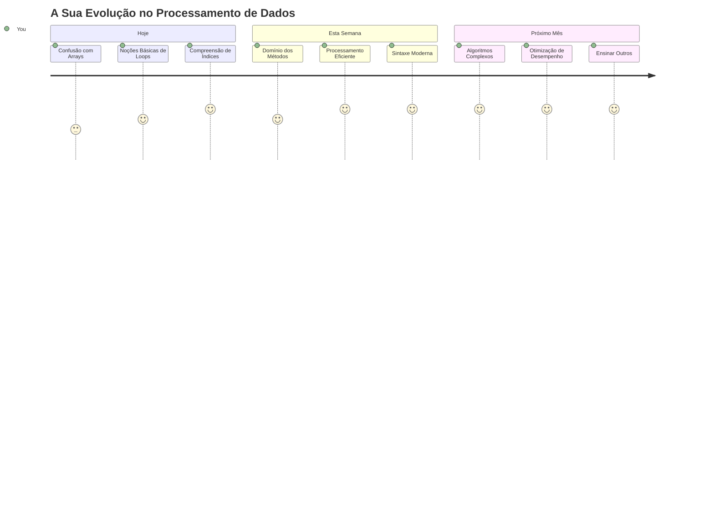
> 📦 **Desbloqueou o poder da organização e processamento de dados!** Arrays e loops são a base de quase todas as aplicações que alguma vez irá criar. Desde listas simples a análises de dados complexas, agora tem as ferramentas para gerir informação de forma eficiente e elegante. Cada website dinâmico, aplicação móvel e aplicação orientada a dados depende destes conceitos fundamentais. Bem-vindo ao mundo do processamento de dados escalável! 🎉

---

<!-- CO-OP TRANSLATOR DISCLAIMER START -->
**Aviso Legal**:
Este documento foi traduzido utilizando o serviço de tradução por IA [Co-op Translator](https://github.com/Azure/co-op-translator). Embora nos empenhemos em assegurar a precisão, por favor tenha em consideração que traduções automáticas podem conter erros ou imprecisões. O documento original no seu idioma nativo deve ser considerado a fonte autorizada. Para informações críticas, recomenda-se a tradução profissional realizada por humanos. Não nos responsabilizamos por quaisquer mal-entendidos ou interpretações erradas decorrentes da utilização desta tradução.
<!-- CO-OP TRANSLATOR DISCLAIMER END -->