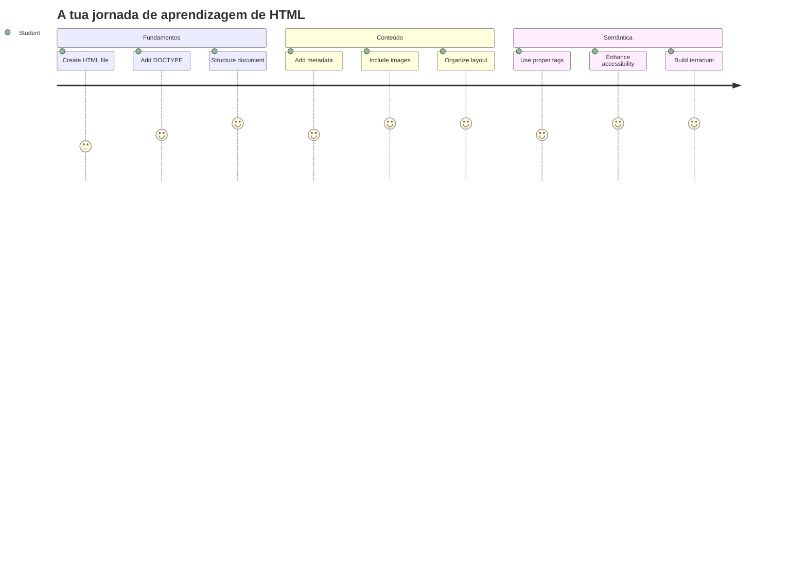
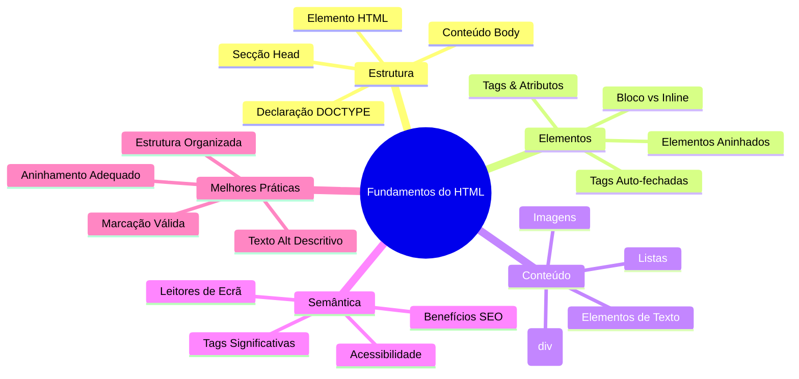
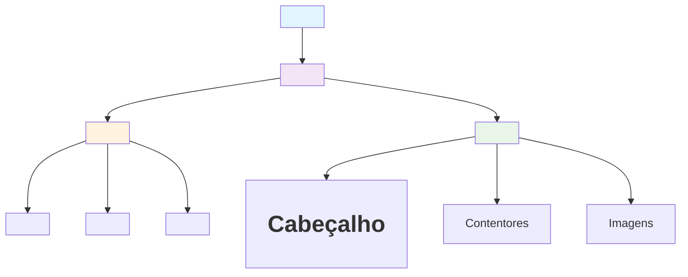
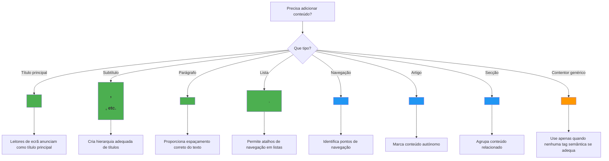
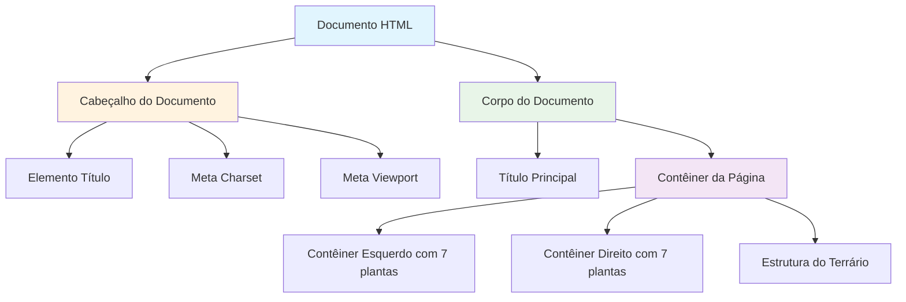
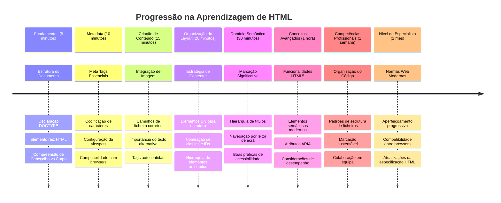

<!--
CO_OP_TRANSLATOR_METADATA:
{
  "original_hash": "3fcfa99c4897e051b558b5eaf1e8cc74",
  "translation_date": "2026-01-06T18:20:42+00:00",
  "source_file": "3-terrarium/1-intro-to-html/README.md",
  "language_code": "pt"
}
-->
# Projeto Terrário Parte 1: Introdução ao HTML



> Sketchnote por [Tomomi Imura](https://twitter.com/girlie_mac)

HTML, ou HyperText Markup Language, é a base de todos os websites que alguma vez visitou. Pense no HTML como o esqueleto que dá estrutura às páginas web – define onde o conteúdo vai, como está organizado e o que cada parte representa. Enquanto o CSS mais tarde vai "vestir" o seu HTML com cores e layouts, e o JavaScript dará vida com interatividade, o HTML fornece a estrutura essencial que torna tudo o resto possível.

Nesta lição, vai criar a estrutura HTML para uma interface virtual de terrário. Este projeto prático ensinar-lhe-á conceitos fundamentais de HTML enquanto constrói algo visualmente apelativo. Vai aprender a organizar conteúdo usando elementos semânticos, trabalhar com imagens e criar a base para uma aplicação web interativa.

No final desta lição, terá uma página HTML funcional a mostrar imagens de plantas organizadas em colunas, pronta para estilização na próxima lição. Não se preocupe se parecer básico no início – é exatamente assim que o HTML deve ser antes do CSS adicionar o polimento visual.


## Questionário Pré-Aula

[Questionário pré-aula](https://ff-quizzes.netlify.app/web/quiz/15)

> 📺 **Assista e Aprenda**: Veja este vídeo explicativo útil
> 
> [](https://www.youtube.com/watch?v=1TvxJKBzhyQ)

## Configurar o Seu Projeto

Antes de mergulharmos no código HTML, vamos configurar um ambiente de trabalho adequado para o seu projeto de terrário. Criar uma estrutura de ficheiros organizada desde o início é um hábito crucial que o ajudará durante toda a sua jornada no desenvolvimento web.

### Tarefa: Crie a Estrutura do Seu Projeto

Vai criar uma pasta dedicada para o seu projeto terrário e adicionar o seu primeiro ficheiro HTML. Aqui estão duas abordagens que pode usar:

**Opção 1: Usar o Visual Studio Code**
1. Abra o Visual Studio Code
2. Clique em "File" → "Open Folder" ou use `Ctrl+K, Ctrl+O` (Windows/Linux) ou `Cmd+K, Cmd+O` (Mac)
3. Crie uma nova pasta chamada `terrarium` e selecione-a
4. No painel Explorer, clique no ícone "New File"
5. Dê ao seu ficheiro o nome `index.html`


**Opção 2: Usar Comandos de Terminal**
```bash
mkdir terrarium
cd terrarium
touch index.html
code index.html
```

**O que estes comandos fazem:**
- **Cria** um novo diretório chamado `terrarium` para o seu projeto
- **Navega** para dentro do diretório terrarium 
- **Cria** um ficheiro vazio `index.html`
- **Abre** o ficheiro no Visual Studio Code para edição

> 💡 **Dica Profissional**: O nome do ficheiro `index.html` é especial no desenvolvimento web. Quando alguém visita um website, os browsers procuram automaticamente o `index.html` como página padrão para apresentar. Isto significa que um URL como `https://mysite.com/projects/` vai servir automaticamente o ficheiro `index.html` da pasta `projects` sem precisar de especificar o nome do ficheiro no URL.

## Compreender a Estrutura do Documento HTML

Cada documento HTML segue uma estrutura específica que os browsers precisam de entender e apresentar corretamente. Pense nesta estrutura como uma carta formal – tem elementos obrigatórios numa ordem específica que ajudam o destinatário (neste caso, o browser) a processar o conteúdo adequadamente.


Vamos começar por adicionar a fundação essencial que todo documento HTML necessita.

### A Declaração DOCTYPE e o Elemento Raiz

As primeiras duas linhas de qualquer ficheiro HTML servem como a "introdução" do documento ao browser:

```html
<!DOCTYPE html>
<html></html>
```

**Entender o que este código faz:**
- **Declara** o tipo de documento como HTML5 usando `<!DOCTYPE html>`
- **Cria** o elemento raiz `<html>` que vai conter todo o conteúdo da página
- **Estabelece** padrões web modernos para renderização correta pelo browser
- **Assegura** apresentação consistente em diferentes browsers e dispositivos

> 💡 **Dica VS Code**: Passe o cursor sobre qualquer tag HTML no VS Code para ver informações úteis da MDN Web Docs, incluindo exemplos de uso e detalhes de compatibilidade com browsers.

> 📚 **Saiba Mais**: A declaração DOCTYPE impede que os browsers entrem em "modo incompatível" (quirks mode), que era usado para suportar sites muito antigos. O desenvolvimento web moderno usa a simples declaração `<!DOCTYPE html>` para garantir [renderização conforme os padrões](https://developer.mozilla.org/docs/Web/HTML/Quirks_Mode_and_Standards_Mode).

### 🔄 **Verificação Pedagógica**
**Pause e Reflita**: Antes de continuar, certifique-se de que entende:
- ✅ Porque é que todo documento HTML precisa de uma declaração DOCTYPE
- ✅ O que o elemento raiz `<html>` contém
- ✅ Como esta estrutura ajuda os browsers a renderizar as páginas corretamente

**Auto-Teste Rápido**: Consegue explicar com as suas próprias palavras o que significa "renderização conforme os padrões"?

## Adicionar Metadados Essenciais ao Documento

A secção `<head>` de um documento HTML contém informações cruciais que os browsers e motores de busca precisam, mas que os visitantes não veem diretamente na página. Pense nela como a informação "por trás das câmaras" que ajuda a sua página web a funcionar corretamente e a aparecer bem em diferentes dispositivos e plataformas.

Estes metadados indicam aos browsers como mostrar a sua página, que codificação de caracteres usar e como lidar com diferentes tamanhos de ecrã – tudo essencial para criar páginas web profissionais e acessíveis.

### Tarefa: Adicione a Cabeça do Documento

Insira esta secção `<head>` entre as suas tags de abertura e fecho `<html>`:

```html
<head>
	<title>Welcome to my Virtual Terrarium</title>
	<meta charset="utf-8" />
	<meta http-equiv="X-UA-Compatible" content="IE=edge" />
	<meta name="viewport" content="width=device-width, initial-scale=1" />
</head>
```

**Explicação do que cada elemento faz:**
- **Define** o título da página que aparece nas abas do browser e nos resultados de pesquisa
- **Especifica** a codificação de caracteres UTF-8 para apresentação correta de texto globalmente
- **Garante** compatibilidade com versões modernas do Internet Explorer
- **Configura** design responsivo definindo o viewport para corresponder à largura do dispositivo
- **Controla** o nível inicial de zoom para mostrar o conteúdo no tamanho natural

> 🤔 **Pense Nisto**: O que aconteceria se definisse uma meta tag viewport assim: `<meta name="viewport" content="width=600">`? Isto forçaria a página a ter sempre 600 pixels de largura, quebrando o design responsivo! Saiba mais sobre [configuração correta do viewport](https://developer.mozilla.org/docs/Web/HTML/Viewport_meta_tag).

## Construir o Corpo do Documento

O elemento `<body>` contém todo o conteúdo visível da sua página web – tudo o que os utilizadores vão ver e com que vão interagir. Enquanto a secção `<head>` forneceu instruções ao browser, a secção `<body>` contém o conteúdo real: texto, imagens, botões e outros elementos que formam a sua interface.

Vamos adicionar a estrutura do corpo e entender como as tags HTML funcionam em conjunto para criar conteúdo significativo.

### Compreensão da Estrutura das Tags HTML

HTML usa tags emparelhadas para definir elementos. A maioria das tags tem uma tag de abertura como `<p>` e uma tag de fecho como `</p>`, com conteúdo pelo meio: `<p>Olá, mundo!</p>`. Isto cria um elemento de parágrafo que contém o texto "Olá, mundo!".

### Tarefa: Adicione o Elemento Body

Atualize o seu ficheiro HTML para incluir o elemento `<body>`:

```html
<!DOCTYPE html>
<html>
	<head>
		<title>Welcome to my Virtual Terrarium</title>
		<meta charset="utf-8" />
		<meta http-equiv="X-UA-Compatible" content="IE=edge" />
		<meta name="viewport" content="width=device-width, initial-scale=1" />
	</head>
	<body></body>
</html>
```

**O que esta estrutura completa provê:**
- **Estabelece** a estrutura básica do documento HTML5
- **Inclui** metadados essenciais para renderização correta pelo browser
- **Cria** um corpo vazio pronto para o seu conteúdo visível
- **Segue** as melhores práticas modernas de desenvolvimento web

Agora está pronto para adicionar os elementos visíveis do seu terrário. Usaremos elementos `<div>` como contentores para organizar diferentes secções de conteúdo e elementos `` para mostrar as imagens das plantas.

### Trabalhar com Imagens e Contentores de Layout

Imagens são especiais em HTML porque usam tags "self-closing". Ao contrário de elementos como `<p></p>` que envolvem conteúdo, a tag `` contém toda a informação dentro da própria tag usando atributos como `src` para o caminho do ficheiro da imagem e `alt` para acessibilidade.

Antes de adicionar imagens ao seu HTML, precisa de organizar os seus ficheiros de projeto corretamente criando uma pasta de imagens e adicionando os gráficos das plantas.

**Primeiro, prepare as suas imagens:**
1. Crie uma pasta chamada `images` dentro da sua pasta de projeto terrário
2. Descarregue as imagens das plantas da [pasta da solução](../../../../3-terrarium/solution/images) (14 imagens de plantas ao todo)
3. Copie todas as imagens das plantas para a sua nova pasta `images`

### Tarefa: Criar o Layout de Exibição das Plantas

Agora adicione as imagens das plantas organizadas em duas colunas entre as suas tags `<body></body>`:

```html
<div id="page">
	<div id="left-container" class="container">
		<div class="plant-holder">
			
		</div>
		<div class="plant-holder">
			
		</div>
		<div class="plant-holder">
			
		</div>
		<div class="plant-holder">
			
		</div>
		<div class="plant-holder">
			
		</div>
		<div class="plant-holder">
			
		</div>
		<div class="plant-holder">
			
		</div>
	</div>
	<div id="right-container" class="container">
		<div class="plant-holder">
			
		</div>
		<div class="plant-holder">
			
		</div>
		<div class="plant-holder">
			
		</div>
		<div class="plant-holder">
			
		</div>
		<div class="plant-holder">
			
		</div>
		<div class="plant-holder">
			
		</div>
		<div class="plant-holder">
			
		</div>
	</div>
</div>
```

**Passo a passo, isto é o que acontece neste código:**
- **Cria** um contentor principal da página com `id="page"` para conter todo o conteúdo
- **Estabelece** dois contentores de colunas: `left-container` e `right-container`
- **Organiza** 7 plantas na coluna da esquerda e 7 plantas na coluna da direita
- **Envolve** cada imagem de planta num `div` com classe `plant-holder` para posicionamento individual
- **Aplica** nomes de classes consistentes para estilização CSS na próxima lição
- **Atribui** IDs únicos a cada imagem de planta para interação com JavaScript mais tarde
- **Inclui** caminhos de ficheiros corretos apontando para a pasta de imagens

> 🤔 **Considere Isto**: Repare que todas as imagens têm atualmente o mesmo texto alternativo "plant". Isto não é ideal para acessibilidade. Utilizadores de leitores de ecrã iriam ouvir "plant" 14 vezes repetidamente sem saber qual planta específica cada imagem mostra. Consegue pensar num texto alternativo mais descritivo para cada imagem?

> 📝 **Tipos de Elementos HTML**: Os elementos `<div>` são de "bloco" e ocupam toda a largura disponível, enquanto os elementos `<span>` são "inline" e ocupam apenas a largura necessária. O que acha que aconteceria se mudasse todas estas tags `<div>` para `<span>`?

### 🔄 **Verificação Pedagógica**
**Compreensão da Estrutura**: Tire um momento para rever a sua estrutura HTML:
- ✅ Consegue identificar os contentores principais no seu layout?
- ✅ Entende porque cada imagem tem um ID único?
- ✅ Como descreveria o propósito dos `div`s `plant-holder`?

**Inspeção Visual**: Abra o seu ficheiro HTML num browser. Deve ver:
- Uma lista básica de imagens de plantas
- Imagens organizadas em duas colunas
- Layout simples, sem estilos

**Lembre-se**: Esta aparência simples é exatamente como o HTML deve parecer antes da aplicação do CSS!

Com este markup adicionado, as plantas vão aparecer no ecrã, embora ainda não estejam polidas visualmente – para isso serve o CSS na próxima lição! Por agora, tem uma base sólida de HTML que organiza corretamente o seu conteúdo e segue as melhores práticas de acessibilidade.

## Usar HTML Semântico para Acessibilidade

HTML semântico significa escolher elementos HTML com base no seu significado e propósito, não apenas na aparência. Quando usa marcação semântica, está a comunicar a estrutura e o significado do seu conteúdo aos browsers, motores de busca e tecnologias assistivas como leitores de ecrã.


Esta abordagem torna os seus websites mais acessíveis para utilizadores com deficiências e ajuda os motores de busca a compreender melhor o seu conteúdo. É um princípio fundamental do desenvolvimento web moderno que cria melhores experiências para todos.

### Adicionar um Título Semântico à Página

Vamos adicionar um cabeçalho próprio à sua página de terrário. Insira esta linha logo após a sua tag de abertura `<body>`:

```html
<h1>My Terrarium</h1>
```

**Porque é que a marcação semântica importa:**
- **Ajuda** os leitores de ecrã a navegar e entender a estrutura da página
- **Melhora** a otimização para motores de busca (SEO) ao clarificar a hierarquia do conteúdo
- **Aumenta** a acessibilidade para utilizadores com deficiências visuais ou cognitivas
- **Cria** melhores experiências para utilizadores em todos os dispositivos e plataformas
- **Segue** os padrões web e melhores práticas para desenvolvimento profissional

**Exemplos de escolhas semânticas vs. não semânticas:**

| Propósito | ✅ Escolha Semântica | ❌ Escolha Não Semântica |
|-----------|---------------------|--------------------------|
| Cabeçalho principal | `<h1>Title</h1>` | `<div class="big-text">Title</div>` |
| Navegação | `<nav><ul><li></li></ul></nav>` | `<div class="menu"><div></div></div>` |
| Botão | `<button>Click me</button>` | `<span onclick="...">Click me</span>` |
| Conteúdo de artigo | `<article><p></p></article>` | `<div class="content"><div></div></div>` |

> 🎥 **Veja em Ação**: Assista a [como os leitores de ecrã interagem com páginas web](https://www.youtube.com/watch?v=OUDV1gqs9GA) para entender porque a marcação semântica é crucial para acessibilidade. Note como a estrutura HTML adequada ajuda os utilizadores a navegar eficientemente.

## Criar o Contentor do Terrário

Agora vamos adicionar a estrutura HTML para o próprio terrário – o contentor de vidro onde as plantas eventualmente serão colocadas. Esta secção demonstra um conceito importante: o HTML fornece estrutura, mas sem estilização CSS, estes elementos ainda não serão visíveis.

O markup do terrário usa nomes de classes descritivos que tornarão a estilização CSS intuitiva e fácil de manter na próxima lição.

### Tarefa: Adicione a Estrutura do Terrário

Insira este markup acima da última tag `</div>` (antes da tag de fecho do contentor da página):

```html
<div id="terrarium">
	<div class="jar-top"></div>
	<div class="jar-walls">
		<div class="jar-glossy-long"></div>
		<div class="jar-glossy-short"></div>
	</div>
	<div class="dirt"></div>
	<div class="jar-bottom"></div>
</div>
```

**Compreender esta estrutura do terrário:**
- **Cria** um contentor principal do terrário com um ID único para estilização
- **Define** elementos separados para cada componente visual (topo, paredes, terra, fundo)
- **Inclui** elementos aninhados para efeitos de reflexão no vidro (elementos brilhantes)
- **Usa** nomes de classes descritivos que indicam claramente a função de cada elemento
- **Prepara** a estrutura para o estilo CSS que criará o aspeto do terrário de vidro

> 🤔 **Repara em Algo?**: Embora tenhas adicionado esta marcação, não vês nada de novo na página! Isto ilustra perfeitamente como o HTML fornece estrutura enquanto o CSS fornece aparência. Estes elementos `<div>` existem, mas ainda não têm estilo visual – isso vem na próxima aula!


### 🔄 **Verificação Pedagógica**
**Domínio da Estrutura HTML**: Antes de avançar, certifica-te de que sabes:
- ✅ Explicar a diferença entre estrutura HTML e aparência visual
- ✅ Identificar elementos HTML semânticos vs. não semânticos
- ✅ Descrever como uma marcação adequada beneficia a acessibilidade
- ✅ Reconhecer a estrutura completa da árvore do documento

**Testa o Teu Entendimento**: Tenta abrir o teu ficheiro HTML num navegador com o JavaScript desativado e o CSS removido. Isto mostra-te a estrutura semântica pura que criaste!

---

## Desafio do Agente GitHub Copilot

Utiliza o modo Agente para completar o seguinte desafio:

**Descrição:** Cria uma estrutura HTML semântica para uma secção de guia de cuidados de plantas que possa ser adicionada ao projeto do terrário.

**Enunciado:** Cria uma secção HTML semântica que inclui um título principal "Guia de Cuidados de Plantas", três subseções com os títulos "Rega", "Requisitos de Luz" e "Cuidados com o Solo", cada uma contendo um parágrafo de informação sobre cuidados com plantas. Usa etiquetas HTML semânticas adequadas como `<section>`, `<h2>`, `<h3>`, e `<p>` para estruturar corretamente o conteúdo.

Sabe mais sobre o [modo agente](https://code.visualstudio.com/blogs/2025/02/24/introducing-copilot-agent-mode) aqui.

## Desafio Explorar a História do HTML

**Aprender Sobre a Evolução da Web**

O HTML evoluiu significativamente desde que Tim Berners-Lee criou o primeiro navegador web no CERN em 1990. Algumas etiquetas antigas como `<marquee>` estão agora obsoletas porque não funcionam bem com os padrões modernos de acessibilidade e princípios de design responsivo.

**Tenta Este Experimento:**
1. Envolve temporariamente o teu título `<h1>` numa etiqueta `<marquee>`: `<marquee><h1>O Meu Terrário</h1></marquee>`
2. Abre a tua página num navegador e observa o efeito de deslocamento
3. Pensa por que esta etiqueta foi descontinuada (dica: considera a experiência do utilizador e acessibilidade)
4. Remove a etiqueta `<marquee>` e volta à marcação semântica

**Perguntas de Reflexão:**
- Como poderá um título em movimento afetar utilizadores com deficiência visual ou sensibilidade ao movimento?
- Que técnicas modernas de CSS poderiam alcançar efeitos visuais semelhantes de forma mais acessível?
- Porque é importante usar padrões web atuais em vez de elementos obsoletos?

Explora mais sobre [elementos HTML obsoletos e depreciados](https://developer.mozilla.org/docs/Web/HTML/Element#Obsolete_and_deprecated_elements) para entender como os padrões web evoluem para melhorar a experiência do utilizador.

## Questionário Pós-Aula

[Questionário pós-aula](https://ff-quizzes.netlify.app/web/quiz/16)

## Revisão & Autoestudo

**Aprofunda o Teu Conhecimento de HTML**

O HTML tem sido a base da web durante mais de 30 anos, evoluindo de uma simples linguagem de marcação de documentos para uma plataforma sofisticada para construir aplicações interativas. Compreender esta evolução ajuda-te a valorizar os padrões web modernos e a tomar melhores decisões de desenvolvimento.

**Caminhos de Aprendizagem Recomendados:**

1. **História e Evolução do HTML**
   - Pesquisa a linha temporal do HTML 1.0 ao HTML5
   - Explora porque certas etiquetas foram depreciadas (acessibilidade, compatibilidade móvel, manutenção)
   - Investiga funcionalidades e propostas emergentes do HTML

2. **Imersão em HTML Semântico**
   - Estuda a lista completa de [elementos semânticos do HTML5](https://developer.mozilla.org/docs/Web/HTML/Element)
   - Pratica identificar quando usar `<article>`, `<section>`, `<aside>`, e `<main>`
   - Aprende sobre atributos ARIA para maior acessibilidade

3. **Desenvolvimento Web Moderno**
   - Explora [como construir websites responsivos](https://docs.microsoft.com/learn/modules/build-simple-website/?WT.mc_id=academic-77807-sagibbon) na Microsoft Learn
   - Entende como o HTML se integra com CSS e JavaScript
   - Aprende boas práticas de desempenho web e SEO

**Perguntas de Reflexão:**
- Quais etiquetas HTML depreciadas descobriste e porquê foram removidas?
- Que novas funcionalidades HTML estão a ser propostas para futuras versões?
- Como é que o HTML semântico contribui para acessibilidade web e SEO?

### ⚡ **O Que Podes Fazer nos Próximos 5 Minutos**
- [ ] Abre as Ferramentas de Desenvolvedor (F12) e inspeciona a estrutura HTML do teu website favorito
- [ ] Cria um ficheiro HTML simples com tags básicas: `<h1>`, `<p>`, e ``
- [ ] Valida o teu HTML usando o Validador HTML da W3C online
- [ ] Tenta adicionar um comentário ao teu HTML usando `<!-- comentário -->`

### 🎯 **O Que Podes Atingir Nesta Hora**
- [ ] Completa o questionário pós-licção e revê conceitos de HTML semântico
- [ ] Constrói uma página web simples sobre ti usando estrutura HTML correta
- [ ] Experimenta diferentes níveis de cabeçalhos e etiquetas de formatação de texto
- [ ] Adiciona imagens e links para praticar integração multimédia
- [ ] Pesquisa funcionalidades HTML5 que ainda não experimentaste

### 📅 **A Tua Jornada HTML de Uma Semana**
- [ ] Completa o projeto do terrário com marcação semântica
- [ ] Cria uma página web acessível usando rótulos ARIA e roles
- [ ] Pratica a criação de formulários com vários tipos de input
- [ ] Explora APIs do HTML5 como localStorage ou geolocalização
- [ ] Estuda padrões de HTML responsivo e design mobile-first
- [ ] Revê o código HTML de outros desenvolvedores para melhores práticas

### 🌟 **A Tua Fundação Web de Um Mês**
- [ ] Constrói um website portfólio que demonstre o teu domínio de HTML
- [ ] Aprende a templatear HTML com um framework como Handlebars
- [ ] Contribui para projetos open source melhorando documentação HTML
- [ ] Domina conceitos avançados de HTML como elementos customizados
- [ ] Integra HTML com frameworks CSS e bibliotecas JavaScript
- [ ] Orienta outros que estejam a aprender os fundamentos do HTML

## 🎯 O Teu Cronograma de Domínio do HTML


### 🛠️ O Resumo da Tua Caixa de Ferramentas HTML

Após concluíres esta lição, agora tens:
- **Estrutura do Documento**: Fundação completa HTML5 com DOCTYPE correto
- **Marcação Semântica**: Etiquetas com significado que melhoram acessibilidade e SEO
- **Integração de Imagens**: Organização correta dos ficheiros e boas práticas de texto alternativo
- **Contêineres de Layout**: Uso estratégico de divs com nomes de classes descritivos
- **Consciência de Acessibilidade**: Entendimento da navegação com leitores de ecrã
- **Padrões Modernos**: Práticas atuais de HTML5 e conhecimento sobre tags depreciadas
- **Fundação para o Projeto**: Base sólida para o estilo CSS e interatividade JavaScript

**Próximos Passos**: A tua estrutura HTML está pronta para o estilo CSS! A fundação semântica que construíste tornará a próxima lição muito mais fácil de compreender.


## Trabalho de Casa

[Pratica o teu HTML: Cria um mockup de blog](assignment.md)

---

<!-- CO-OP TRANSLATOR DISCLAIMER START -->
**Aviso**:
Este documento foi traduzido utilizando o serviço de tradução por IA [Co-op Translator](https://github.com/Azure/co-op-translator). Embora nos esforcemos por garantir a precisão, por favor tenha em conta que traduções automáticas podem conter erros ou imprecisões. O documento original no seu idioma nativo deve ser considerado a fonte autorizada. Para informações críticas, recomenda-se tradução profissional humana. Não nos responsabilizamos por quaisquer mal-entendidos ou interpretações erradas decorrentes da utilização desta tradução.
<!-- CO-OP TRANSLATOR DISCLAIMER END -->