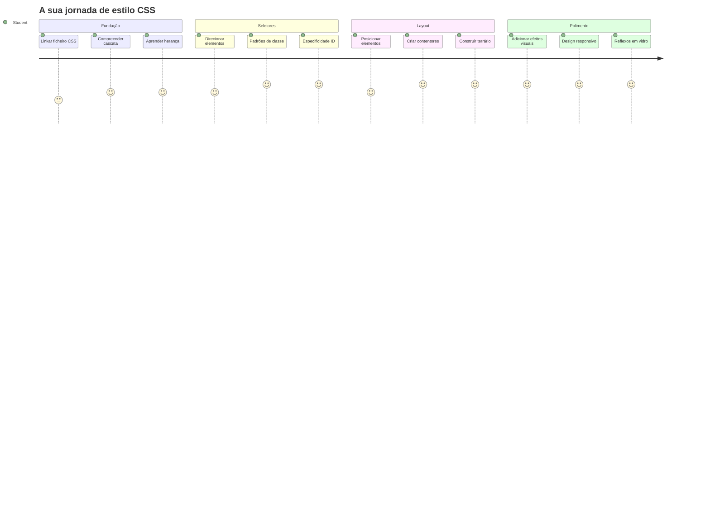
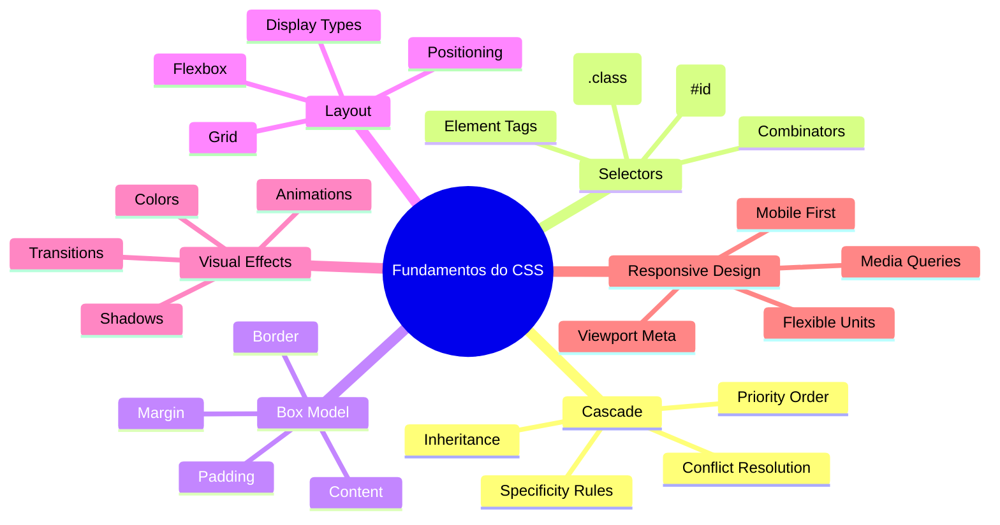
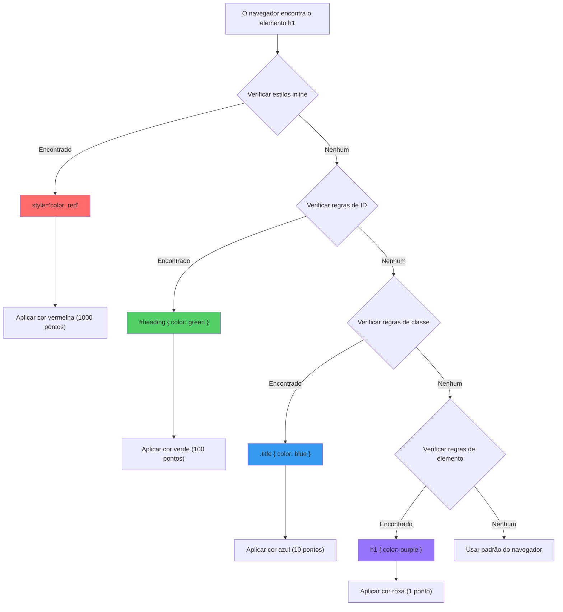
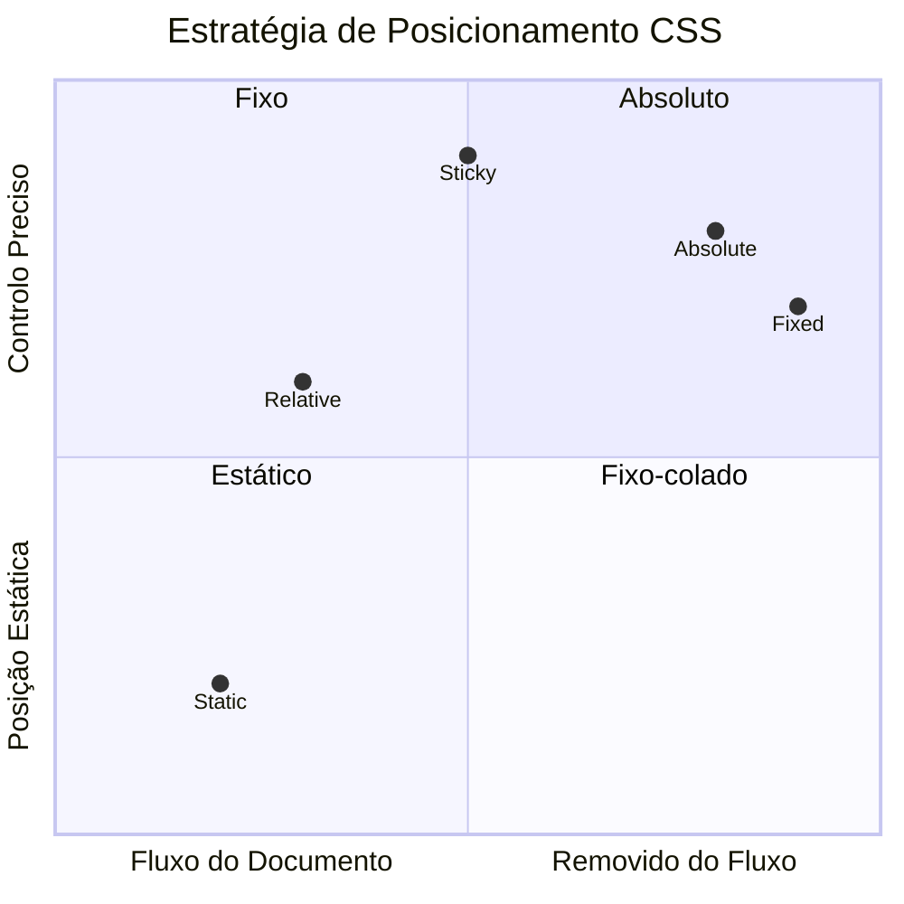
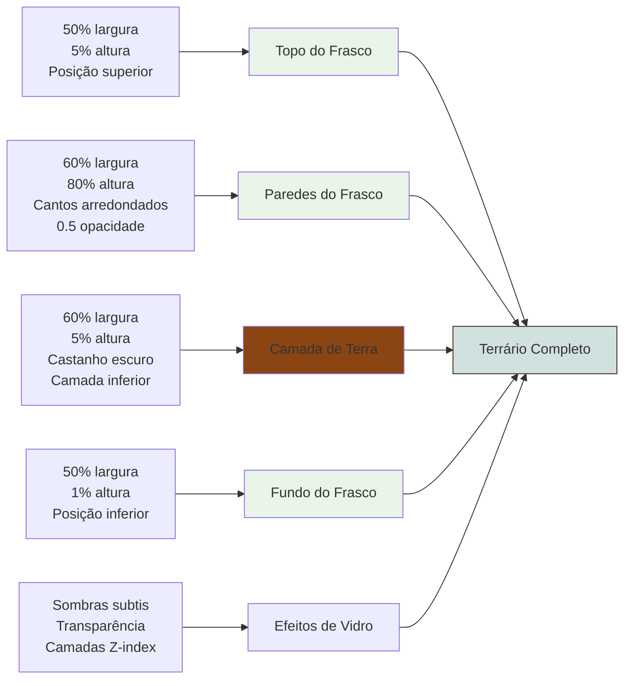
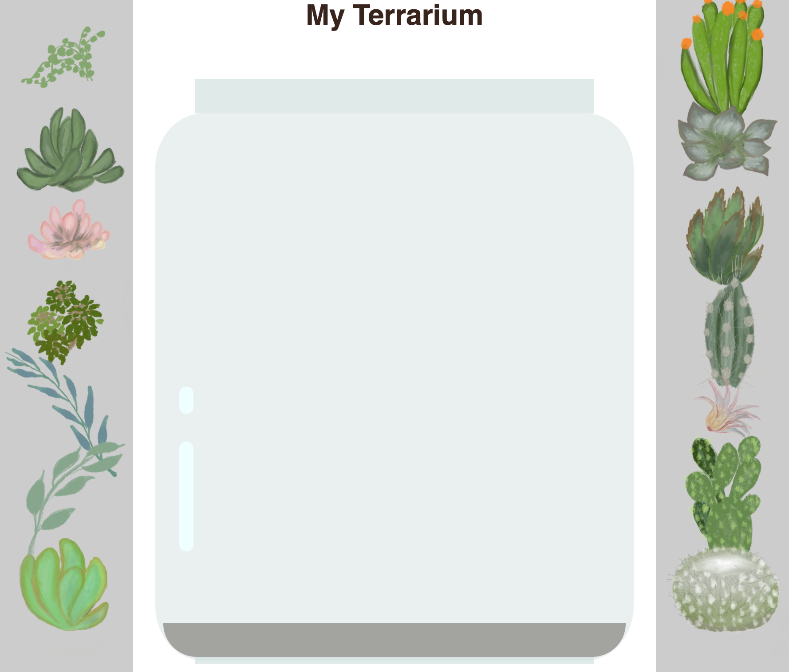
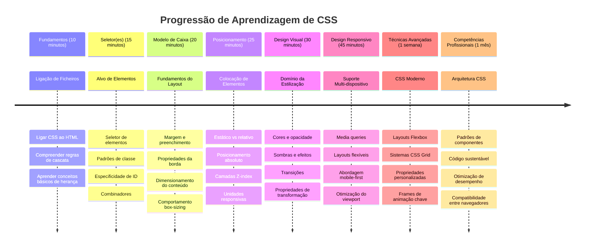

<!--
CO_OP_TRANSLATOR_METADATA:
{
  "original_hash": "e39f3a4e3bcccf94639e3af1248f8a4d",
  "translation_date": "2026-01-06T18:25:22+00:00",
  "source_file": "3-terrarium/2-intro-to-css/README.md",
  "language_code": "pt"
}
-->
# Projeto Terrário Parte 2: Introdução ao CSS



> Sketchnote por [Tomomi Imura](https://twitter.com/girlie_mac)

Lembras-te como o teu terrário HTML parecia bastante básico? O CSS é onde transformamos essa estrutura simples numa coisa visualmente apelativa.

Se o HTML é como construir a estrutura de uma casa, então o CSS é tudo o que a faz parecer um lar – as cores da pintura, a disposição dos móveis, a iluminação e como as divisões se conectam. Pensa em como o Palácio de Versalhes começou como uma simples casa de caça, mas a atenção cuidadosa à decoração e ao layout transformou-o num dos edifícios mais magníficos do mundo.

Hoje, vamos transformar o teu terrário de funcional para polido. Vais aprender como posicionar elementos com precisão, fazer layouts que respondem a diferentes tamanhos de ecrã e criar o apelo visual que torna os websites cativantes.

No final desta lição, vais ver como a aplicação estratégica do CSS pode melhorar dramaticamente o teu projeto. Vamos adicionar estilo ao teu terrário.


## Questionário Pré-Aula

[Questionário pré-aula](https://ff-quizzes.netlify.app/web/quiz/17)

## Começar com CSS

O CSS é frequentemente pensado como apenas "tornar as coisas bonitas", mas serve um propósito muito mais amplo. O CSS é como ser o realizador de um filme – controlas não apenas como tudo parece, mas como se move, responde à interação e se adapta a diferentes situações.

O CSS moderno é notavelmente capaz. Podes escrever código que ajusta automaticamente layouts para telemóveis, tablets e computadores de secretária. Podes criar animações suaves que guiam a atenção dos utilizadores para onde é necessário. Os resultados podem ser bastante impressionantes quando tudo funciona em conjunto.

> 💡 **Dica Profissional**: O CSS está em constante evolução com novas funcionalidades e capacidades. Verifica sempre [CanIUse.com](https://caniuse.com) para confirmar o suporte dos navegadores às novas funcionalidades CSS antes de as usares em projetos de produção.

**Isto é o que vamos alcançar nesta lição:**
- **Criar** um design visual completo para o teu terrário usando técnicas modernas de CSS
- **Explorar** conceitos fundamentais como a cascata, a herança e os seletores CSS
- **Implementar** estratégias responsivas de posicionamento e layout
- **Construir** o recipiente do terrário usando formas e estilos CSS

### Pré-Requisito

Deves ter concluído a estrutura HTML para o teu terrário da lição anterior e tê-la pronta para ser estilizada.

> 📺 **Recurso de Vídeo**: Confere este vídeo explicativo útil
>
> [](https://www.youtube.com/watch?v=6yIdOIV9p1I)

### Configurar o Teu Ficheiro CSS

Antes de começarmos a aplicar estilos, precisamos de ligar o CSS ao nosso HTML. Esta ligação diz ao navegador onde encontrar as instruções de estilos para o nosso terrário.

Na tua pasta do terrário, cria um novo ficheiro chamado `style.css` e liga-o na secção `<head>` do teu documento HTML:

```html
<link rel="stylesheet" href="./style.css" />
```

**Isto é o que este código faz:**
- **Cria** uma ligação entre os teus ficheiros HTML e CSS
- **Indica** ao navegador para carregar e aplicar os estilos de `style.css`
- **Usa** o atributo `rel="stylesheet"` para especificar que é um ficheiro CSS
- **Referencia** o caminho do ficheiro com `href="./style.css"`

## Compreender a Cascata do CSS

Já alguma vez te perguntaste por que razão o CSS se chama Cascading Style Sheets? Os estilos descem em cascata como uma cascata, e às vezes entram em conflito entre si.

Considera como funcionam as estruturas de comando militares – uma ordem geral pode dizer "todas as tropas vestem de verde", mas uma ordem específica para a tua unidade pode dizer "vistam uniforme azul para a cerimónia". A instrução mais específica prevalece. O CSS segue uma lógica similar, e entender esta hierarquia torna a depuração muito mais manejável.

### Experimentar a Prioridade da Cascata

Vamos ver a cascata em ação criando um conflito de estilos. Primeiro, adiciona um estilo inline à tua etiqueta `<h1>`:

```html
<h1 style="color: red">My Terrarium</h1>
```

**O que este código faz:**
- **Aplica** uma cor vermelha diretamente ao elemento `<h1>` usando estilo inline
- **Usa** o atributo `style` para embutir CSS diretamente no HTML
- **Cria** a regra de estilo com a maior prioridade para este elemento específico

De seguida, adiciona esta regra ao teu ficheiro `style.css`:

```css
h1 {
  color: blue;
}
```

**No exemplo acima, nós:**
- **Definimos** uma regra CSS que afeta todos os elementos `<h1>`
- **Definimos** a cor do texto para azul usando uma folha de estilos externa
- **Criamos** uma regra com prioridade inferior em comparação a estilos inline

✅ **Verificação de Conhecimento**: Que cor é exibida na tua aplicação web? Por que razão essa cor prevalece? Consegue pensar em cenários onde poderias querer sobrepor estilos?


> 💡 **Ordem de Prioridade do CSS (do mais alto para o mais baixo):**
> 1. **Estilos inline** (atributo style)
> 2. **IDs** (#myId)
> 3. **Classes** (.myClass) e atributos
> 4. **Seletores de elementos** (h1, div, p)
> 5. **Padrões do navegador**

## A Herança no CSS em Ação

A herança no CSS funciona como a genética – os elementos herdam certas propriedades dos seus elementos pai. Se definires a família de fontes no elemento body, todo o texto dentro usará automaticamente essa mesma fonte. É semelhante a como a mandíbula distintiva da família Habsburgo apareceu em várias gerações sem ser especificada para cada indivíduo.

No entanto, nem tudo é herdado. Estilos de texto como fontes e cores são herdados, mas propriedades de layout como margens e bordas não são. Tal como as crianças podem herdar traços físicos mas não os gostos de moda dos pais.

### Observando a Herança da Fonte

Vamos ver a herança em ação definindo uma família de fontes no elemento `<body>`:

```css
body {
  font-family: 'Segoe UI', Tahoma, Geneva, Verdana, sans-serif;
}
```

**Análise do que acontece aqui:**
- **Define** a família de fontes para toda a página ao selecionar o elemento `<body>`
- **Usa** uma pilha de fontes com opções alternativas para melhor compatibilidade nos navegadores
- **Aplica** fontes modernas do sistema que ficam bem em diferentes sistemas operativos
- **Garante** que todos os elementos filhos herdam esta fonte, a menos que seja especificamente sobreposto

Abre as ferramentas de desenvolvedor do teu navegador (F12), vai ao separador Elements (Elementos) e inspeciona o teu elemento `<h1>`. Vais ver que herda a família de fontes do body:


✅ **Hora do Experimento**: Experimenta definir outras propriedades herdáveis no `<body>` como `color`, `line-height` ou `text-align`. O que acontece ao teu título e a outros elementos?

> 📝 **Propriedades Herdáveis Incluem**: `color`, `font-family`, `font-size`, `line-height`, `text-align`, `visibility`
>
> **Propriedades Não Herdáveis Incluem**: `margin`, `padding`, `border`, `width`, `height`, `position`

### 🔄 **Verificação Pedagógica**
**Compreensão da Base do CSS**: Antes de avançar para os seletores, assegura que consegues:
- ✅ Explicar a diferença entre cascata e herança
- ✅ Prever qual estilo vai prevalecer num conflito de especificidade
- ✅ Identificar quais propriedades são herdadas dos elementos pai
- ✅ Ligar ficheiros CSS ao HTML corretamente

**Teste Rápido**: Se tens estes estilos, que cor terá um `<h1>` dentro de um `<div class="special">`?
```css
div { color: blue; }
.special { color: green; }
h1 { color: red; }
```
*Resposta: Vermelho (o seletor de elemento direciona diretamente o h1)*

## Dominar os Seletores CSS

Os seletores CSS são a tua forma de direcionar elementos específicos para estilos. Funcionam como dar indicações precisas – em vez de dizer "a casa", podes dizer "a casa azul com a porta vermelha na Maple Street".

O CSS fornece várias formas de ser específico, e escolher o seletor certo é como escolher a ferramenta apropriada para a tarefa. Por vezes precisas de estilizar cada porta na vizinhança, outras só uma porta específica.

### Seletores de Elemento (Etiquetas)

Os seletores de elemento visam elementos HTML pelo nome da etiqueta. São perfeitos para definir estilos base que se aplicam amplamente na tua página:

```css
body {
  font-family: 'Segoe UI', Tahoma, Geneva, Verdana, sans-serif;
  margin: 0;
  padding: 0;
}

h1 {
  color: #3a241d;
  text-align: center;
  font-size: 2.5rem;
  margin-bottom: 1rem;
}
```

**Compreendendo estes estilos:**
- **Define** tipografia consistente em toda a página com o seletor `body`
- **Remove** margens e preenchimentos padrão do navegador para melhor controlo
- **Estiliza** todos os elementos de cabeçalho com cor, alinhamento e espaçamento
- **Usa** unidades `rem` para dimensionamento escalável e acessível das fontes

Embora os seletores de elemento sejam bons para estilos gerais, precisarás de seletores mais específicos para estilizar componentes individuais, como as plantas no teu terrário.

### Seletores de ID para Elementos Únicos

Os seletores de ID usam o símbolo `#` e destinam-se a elementos com atributos `id` específicos. Como os IDs devem ser únicos numa página, são perfeitos para estilizar elementos individuais e especiais, como os recipientes das plantas à esquerda e à direita.

Vamos criar o estilo para os recipientes laterais do nosso terrário onde as plantas vão viver:

```css
#left-container {
  background-color: #f5f5f5;
  width: 15%;
  left: 0;
  top: 0;
  position: absolute;
  height: 100vh;
  padding: 1rem;
  box-sizing: border-box;
}

#right-container {
  background-color: #f5f5f5;
  width: 15%;
  right: 0;
  top: 0;
  position: absolute;
  height: 100vh;
  padding: 1rem;
  box-sizing: border-box;
}
```

**Aqui está o que este código realiza:**
- **Posiciona** os recipientes nas extremidades esquerda e direita usando posicionamento `absolute`
- **Usa** unidades `vh` (altura da janela de visualização) para altura responsiva que se adapta ao tamanho do ecrã
- **Aplica** `box-sizing: border-box` para que o preenchimento fique incluído na largura total
- **Remove** unidades `px` desnecessárias de valores zero para código mais limpo
- **Define** uma cor de fundo subtil, mais suave para os olhos que o cinzento forte

✅ **Desafio de Qualidade de Código**: Repara como este CSS viola o princípio DRY (Don't Repeat Yourself - Não te Repitas). Consegues refatorá-lo usando tanto um ID como uma classe?

**Abordagem Melhorada:**
```html
<div id="left-container" class="container"></div>
<div id="right-container" class="container"></div>
```

```css
.container {
  background-color: #f5f5f5;
  width: 15%;
  top: 0;
  position: absolute;
  height: 100vh;
  padding: 1rem;
  box-sizing: border-box;
}

#left-container {
  left: 0;
}

#right-container {
  right: 0;
}
```

### Seletores de Classe para Estilos Reutilizáveis

Os seletores de classe usam o símbolo `.` e são perfeitos quando queres aplicar os mesmos estilos a vários elementos. Ao contrário dos IDs, as classes podem ser reutilizadas em todo o HTML, tornando-as ideais para padrões de estilo consistentes.

No nosso terrário, cada planta precisa de um estilo semelhante mas também de posicionamento individual. Usaremos uma combinação de classes para estilos partilhados e IDs para posicionamento único.

**Aqui está a estrutura HTML para cada planta:**
```html
<div class="plant-holder">
  
</div>
```

**Elementos-chave explicados:**
- **Usa** `class="plant-holder"` para estilo consistente do recipiente em todas as plantas
- **Aplica** `class="plant"` para estilo e comportamento partilhados das imagens
- **Inclui** um `id="plant1"` único para posicionamento individual e interação via JavaScript
- **Fornece** texto alternativo descritivo para acessibilidade de leitores de ecrã

Agora adiciona estes estilos ao teu ficheiro `style.css`:

```css
.plant-holder {
  position: relative;
  height: 13%;
  left: -0.6rem;
}

.plant {
  position: absolute;
  max-width: 150%;
  max-height: 150%;
  z-index: 2;
  transition: transform 0.3s ease;
}

.plant:hover {
  transform: scale(1.05);
}
```

**Análise destes estilos:**
- **Cria** posicionamento relativo para o recipiente da planta para estabelecer contexto de posicionamento
- **Define** cada recipiente da planta com 13% de altura, garantindo que todas as plantas cabem verticalmente sem scroll
- **Desloca** ligeiramente os recipientes para a esquerda para centrar melhor as plantas nos seus recipientes
- **Permite** que as plantas reajam ao tamanho da viewport com as propriedades `max-width` e `max-height`
- **Usa** `z-index` para sobrepor as plantas acima de outros elementos no terrário
- **Adiciona** um efeito subtil ao passar o rato com transições CSS para melhor interação do utilizador

✅ **Pensamento Crítico**: Por que precisamos de ambos os seletores `.plant-holder` e `.plant`? O que aconteceria se tivéssemos usado só um deles?

> 💡 **Padrão de Design**: O recipiente (`.plant-holder`) controla o layout e o posicionamento, enquanto o conteúdo (`.plant`) controla a aparência e a escala. Esta separação torna o código mais fácil de manter e flexível.

## Compreender o Posicionamento no CSS

O posicionamento no CSS é como ser o diretor de cena numa peça de teatro – decides onde cada ator fica e como se move no palco. Alguns atores seguem a formação padrão, enquanto outros precisam de posicionamento específico para um efeito dramático.

Quando entendes posicionamento, muitos desafios de layout tornam-se manejáveis. Precisas de uma barra de navegação que fique fixa no topo enquanto os utilizadores fazem scroll? O posicionamento faz isso. Queres uma tooltip que apareça num local específico? Isso também é posicionamento.

### Os Cinco Valores de Posicionamento


| Valor de Posicionamento | Comportamento | Caso de Uso |
|------------------------|--------------|-------------|
| `static` | Fluxo padrão, ignora top/left/right/bottom | Layout normal do documento |
| `relative` | Posicionado relativamente à sua posição normal | Ajustes pequenos, criação de contexto de posicionamento |
| `absolute` | Posicionado relativamente ao antecessor posicionado mais próximo | Colocação precisa, sobreposições |
| `fixed` | Posicionado relativamente ao viewport | Barras de navegação, elementos flutuantes |
| `sticky` | Intercala entre relative e fixed conforme o scroll | Cabeçalhos que permanecem fixos ao rolar |

### Posicionamento no Nosso Terrário

O nosso terrário usa uma combinação estratégica de tipos de posicionamento para criar o layout desejado:

```css
/* Container positioning */
.container {
  position: absolute; /* Removes from normal flow */
  /* ... other styles ... */
}

/* Plant holder positioning */
.plant-holder {
  position: relative; /* Creates positioning context */
  /* ... other styles ... */
}

/* Plant positioning */
.plant {
  position: absolute; /* Allows precise placement within holder */
  /* ... other styles ... */
}
```

**Compreensão da estratégia de posicionamento:**
- **Recipientes absolutos** são removidos do fluxo normal do documento e fixados nas extremidades do ecrã
- **Recipientes das plantas relativos** criam um contexto de posicionamento enquanto permanecem no fluxo do documento
- **Plantas absolutas** podem ser posicionadas precisamente dentro dos seus recipientes relativos
- **Esta combinação** permite que as plantas se empilhem verticalmente e sejam posicionáveis individualmente

> 🎯 **Por que isto importa**: Os elementos `plant` precisam de posicionamento absoluto para se tornarem arrastáveis na próxima lição. O posicionamento absoluto remove-os do fluxo normal do layout, permitindo interações de arrastar e largar.

✅ **Hora do Experimento**: Tenta mudar os valores de posicionamento e observa os resultados:
- O que acontece se mudares `.container` de `absolute` para `relative`?
- Como é que o layout muda se `.plant-holder` usar `absolute` em vez de `relative`?
- O que acontece quando alteras a posição de `.plant` para `relative`?

### 🔄 **Verificação Pedagógica**
**Domínio do Posicionamento em CSS**: Faz uma pausa para verificar a tua compreensão:
- ✅ Consegues explicar porque é que as plantas precisam de posicionamento absoluto para drag-and-drop?
- ✅ Compreendes como os contentores relativos criam o contexto de posicionamento?
- ✅ Porque usam os contentores laterais posicionamento absoluto?
- ✅ O que aconteceria se removesses completamente as declarações de posição?

**Ligação ao Mundo Real**: Pensa em como o posicionamento CSS espelha o layout no mundo real:
- **Static**: Livros numa estante (ordem natural)
- **Relative**: Mover um livro ligeiramente mas mantendo o seu lugar
- **Absolute**: Colocar um marcador de página num número de página exato
- **Fixed**: Uma nota autocolante que permanece visível enquanto folheias as páginas

## Construir o Terrário com CSS

Agora vamos construir um frasco de vidro usando apenas CSS - sem imagens ou software gráfico.

Criar vidro realista, sombras e efeitos de profundidade usando posicionamento e transparência demonstra as capacidades visuais do CSS. Esta técnica espelha como arquitetos do movimento Bauhaus usavam formas geométricas simples para criar estruturas complexas e bonitas. Assim que entenderes estes princípios, reconhecerás as técnicas CSS por trás de muitos designs web.


### Criar os Componentes do Frasco de Vidro

Vamos construir o frasco do terrário peça a peça. Cada parte usa posicionamento absoluto e dimensões em percentagem para design responsivo:

```css
.jar-walls {
  height: 80%;
  width: 60%;
  background: #d1e1df;
  border-radius: 1rem;
  position: absolute;
  bottom: 0.5%;
  left: 20%;
  opacity: 0.5;
  z-index: 1;
  box-shadow: inset 0 0 2rem rgba(0, 0, 0, 0.1);
}

.jar-top {
  width: 50%;
  height: 5%;
  background: #d1e1df;
  position: absolute;
  bottom: 80.5%;
  left: 25%;
  opacity: 0.7;
  z-index: 1;
  border-radius: 0.5rem 0.5rem 0 0;
}

.jar-bottom {
  width: 50%;
  height: 1%;
  background: #d1e1df;
  position: absolute;
  bottom: 0;
  left: 25%;
  opacity: 0.7;
  border-radius: 0 0 0.5rem 0.5rem;
}

.dirt {
  width: 60%;
  height: 5%;
  background: #3a241d;
  position: absolute;
  border-radius: 0 0 1rem 1rem;
  bottom: 1%;
  left: 20%;
  opacity: 0.7;
  z-index: -1;
}
```

**Compreender a construção do terrário:**
- **Usa** dimensões baseadas em percentagem para escalamento responsivo em todos os tamanhos de ecrã
- **Posiciona** elementos em absoluto para empilhar e alinhar com precisão
- **Aplica** diferentes valores de opacidade para criar o efeito de transparência do vidro
- **Implementa** sobreposição com `z-index` para que as plantas apareçam dentro do frasco
- **Adiciona** sombras subtis e `border-radius` refinado para aparência mais realista

### Design Responsivo com Percentagens

Repara que todas as dimensões usam percentagens em vez de valores fixos em pixels:

**Porque é que isto importa:**
- **Garante** que o terrário escala proporcionalmente em qualquer tamanho de ecrã
- **Mantém** as relações visuais entre os componentes do frasco
- **Fornece** uma experiência consistente desde telemóveis a monitores de secretária grandes
- **Permite** que o design se adapte sem quebrar o layout visual

### Unidades CSS em Ação

Estamos a usar unidades `rem` para o border-radius, que escalam relativo ao tamanho de fonte raiz. Isto cria designs mais acessíveis que respeitam preferências do utilizador. Aprende mais sobre [unidades relativas em CSS](https://www.w3.org/TR/css-values-3/#font-relative-lengths) na especificação oficial.

✅ **Experimentação Visual**: Tenta modificar estes valores e observa os efeitos:
- Muda a opacidade do frasco de 0.5 para 0.8 – como afeta a aparência do vidro?
- Ajusta a cor da terra de `#3a241d` para `#8B4513` – qual o impacto visual?
- Modifica o `z-index` da terra para 2 – o que acontece à sobreposição?

### 🔄 **Verificação Pedagógica**
**Compreensão Visual do CSS**: Confirma o teu entendimento do visual em CSS:
- ✅ Como as dimensões em percentagem criam um design responsivo?
- ✅ Porque é que a opacidade cria o efeito de transparência do vidro?
- ✅ Que papel desempenha o z-index na sobreposição de elementos?
- ✅ Como é que os valores do border-radius criam a forma do frasco?

**Princípio do Design**: Repara como construímos visuais complexos a partir de formas simples:
1. **Retângulos** → **Retângulos arredondados** → **Componentes do frasco**
2. **Cores planas** → **Opacidade** → **Efeito vidro**
3. **Elementos individuais** → **Composição em camadas** → **Aparência 3D**

---

## Desafio do Agente GitHub Copilot 🚀

Usa o modo Agente para completar o seguinte desafio:

**Descrição:** Cria uma animação CSS que faz as plantas do terrário balançarem suavemente de um lado para o outro, simulando um efeito de brisa natural. Isto vai ajudar-te a praticar animações CSS, transformações e keyframes enquanto aumentas o apelo visual do terrário.

**Pedido:** Adiciona animações de keyframes CSS para fazer as plantas do terrário balançarem suavemente de um lado para o outro. Cria uma animação de balanço que rotacione cada planta ligeiramente (2-3 graus) para a esquerda e para a direita com duração de 3-4 segundos, e aplica-a à classe `.plant`. Garante que a animação é em loop infinito e tem uma função easing para movimento natural.

Sabe mais sobre [modo agente](https://code.visualstudio.com/blogs/2025/02/24/introducing-copilot-agent-mode) aqui.

## 🚀 Desafio: Adicionar Reflexos de Vidro

Preparado para melhorar o teu terrário com reflexos realistas de vidro? Esta técnica vai adicionar profundidade e realismo ao design.

Vais criar destaques subtis que simulam como a luz se reflete em superfícies de vidro. Esta abordagem é semelhante à utilizada por pintores renascentistas como Jan van Eyck, que usavam luz e reflexão para tornar o vidro pintado tridimensional. Eis o que queres alcançar:



**O teu desafio:**
- **Criar** formas ovais subtis brancas ou de cores claras para os reflexos no vidro
- **Posicioná-las** estrategicamente no lado esquerdo do frasco
- **Aplicar** opacidade e efeitos de desfoque adequados para reflexos realistas de luz
- **Usar** `border-radius` para criar formas orgânicas, semelhantes a bolhas
- **Experimentar** com gradientes ou sombras para mais realismo

## Quiz Pós-Aula

[Quiz pós-aula](https://ff-quizzes.netlify.app/web/quiz/18)

## Expande o Teu Conhecimento de CSS

O CSS pode parecer complexo inicialmente, mas compreender estes conceitos básicos fornece uma base sólida para técnicas mais avançadas.

**As tuas próximas áreas de aprendizagem em CSS:**
- **Flexbox** - simplifica o alinhamento e a distribuição de elementos
- **CSS Grid** - fornece ferramentas poderosas para criar layouts complexos
- **Variáveis CSS** - reduz repetição e melhora a manutenção
- **Design responsivo** - garante que sites funcionam bem em vários tamanhos de ecrã

### Recursos Interativos de Aprendizagem

Pratica estes conceitos com estes jogos práticos e envolventes:
- 🐸 [Flexbox Froggy](https://flexboxfroggy.com/) - Domina Flexbox através de desafios divertidos
- 🌱 [Grid Garden](https://codepip.com/games/grid-garden/) - Aprende CSS Grid cultivando cenouras virtuais
- 🎯 [CSS Battle](https://cssbattle.dev/) - Testa as tuas competências em CSS com desafios de código

### Aprendizagem Adicional

Para fundamentos completos de CSS, completa este módulo Microsoft Learn: [Estiliza a tua app HTML com CSS](https://docs.microsoft.com/learn/modules/build-simple-website/4-css-basics/?WT.mc_id=academic-77807-sagibbon)

### ⚡ **O Que Podes Fazer Nos Próximos 5 Minutos**
- [ ] Abre o DevTools e inspeciona estilos CSS em qualquer site através do painel Elements
- [ ] Cria um ficheiro CSS simples e liga-o a uma página HTML
- [ ] Tenta mudar cores usando diferentes métodos: hex, RGB e nomes de cores
- [ ] Pratica o modelo de caixa adicionando padding e margin a um div

### 🎯 **O Que Podes Conseguir Nesta Hora**
- [ ] Completa o quiz pós-aula e revê os fundamentos CSS
- [ ] Estiliza a tua página HTML com fontes, cores e espaçamento
- [ ] Cria um layout simples usando flexbox ou grid
- [ ] Experimenta as transições CSS para efeitos suaves
- [ ] Pratica design responsivo com media queries

### 📅 **A Tua Aventura CSS de Uma Semana**
- [ ] Completa a tarefa de estilização do terrário com criatividade
- [ ] Domina CSS Grid construindo um layout de galeria fotográfica
- [ ] Aprende animações CSS para dar vida aos teus designs
- [ ] Explora pré-processadores CSS como Sass ou Less
- [ ] Estuda princípios de design e aplica-os ao teu CSS
- [ ] Analisa e recria designs interessantes que encontrares online

### 🌟 **O Teu Domínio do Design em Um Mês**
- [ ] Constrói um sistema completo de design responsivo para websites
- [ ] Aprende CSS-in-JS ou frameworks utility-first como Tailwind
- [ ] Contribui para projetos open source com melhorias em CSS
- [ ] Domina conceitos avançados de CSS como propriedades personalizadas e containment
- [ ] Cria bibliotecas reutilizáveis de componentes com CSS modular
- [ ] Mentora outros a aprender CSS e partilha conhecimentos de design

## 🎯 A Tua Linha Temporal para Dominar CSS


### 🛠️ Resumo da Tua Caixa de Ferramentas CSS

Após completarmos esta lição, agora tens:
- **Compreensão da Cascade**: Como os estilos herdam e sobrescrevem uns aos outros
- **Domínio dos Seletores**: Alvo preciso com elementos, classes e IDs
- **Competências de Posicionamento**: Colocação estratégica e sobreposição de elementos
- **Design Visual**: Criar efeitos de vidro, sombras e transparência
- **Técnicas Responsivas**: Layouts baseados em percentagem que se adaptam a qualquer ecrã
- **Organização de Código**: Estrutura CSS limpa e sustentável
- **Práticas Modernas**: Uso de unidades relativas e padrões de design acessíveis

**Próximos Passos**: O teu terrário tem agora estrutura (HTML) e estilo (CSS). A lição final acrescentará interatividade com JavaScript!

## Tarefa

[Refatoração CSS](assignment.md)

---

<!-- CO-OP TRANSLATOR DISCLAIMER START -->
**Aviso Legal**:
Este documento foi traduzido utilizando o serviço de tradução automática [Co-op Translator](https://github.com/Azure/co-op-translator). Embora nos esforcemos pela precisão, esteja ciente de que traduções automatizadas podem conter erros ou imprecisões. O documento original na sua língua nativa deve ser considerado a fonte oficial. Para informação crítica, recomenda-se a tradução profissional humana. Não nos responsabilizamos por quaisquer mal-entendidos ou interpretações incorretas decorrentes do uso desta tradução.
<!-- CO-OP TRANSLATOR DISCLAIMER END -->