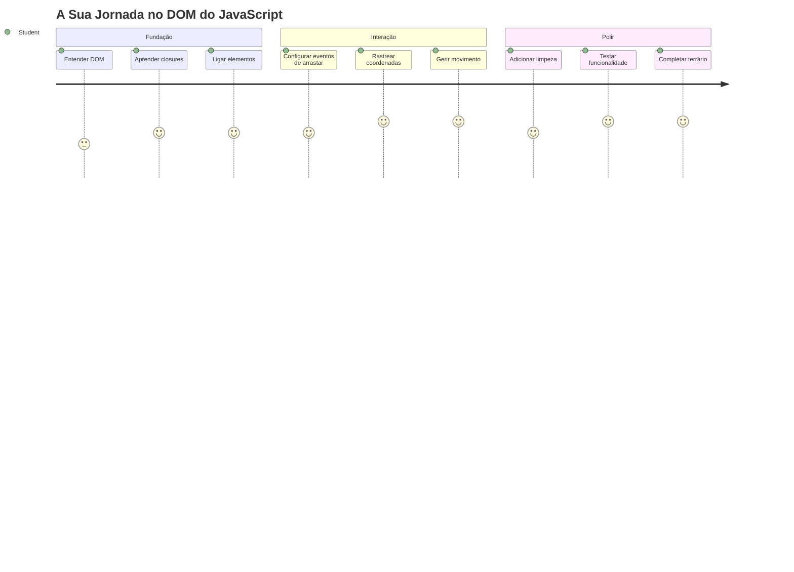
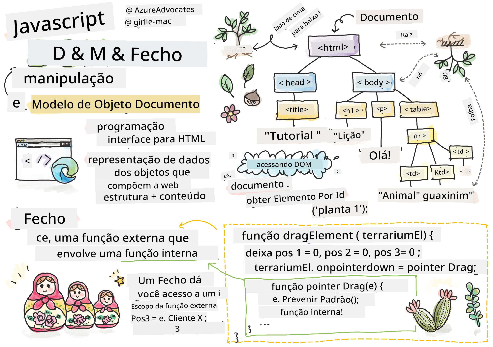
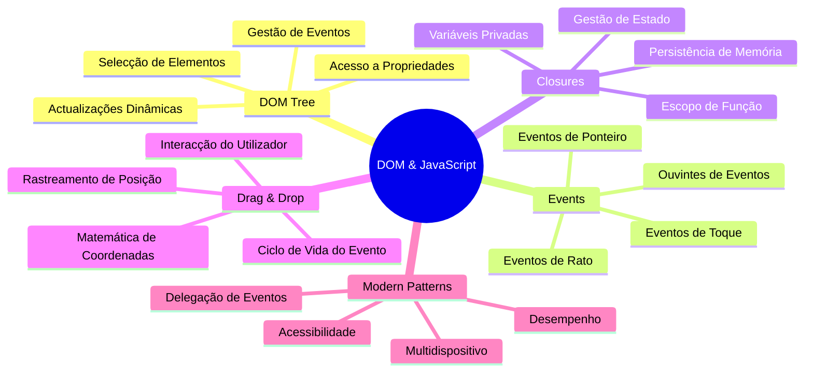
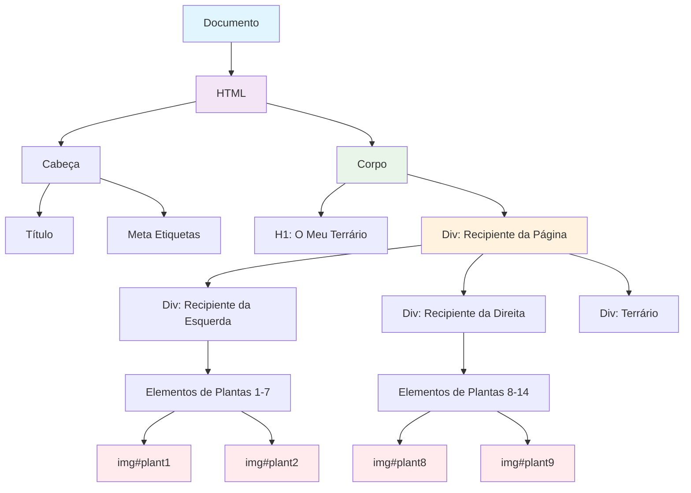
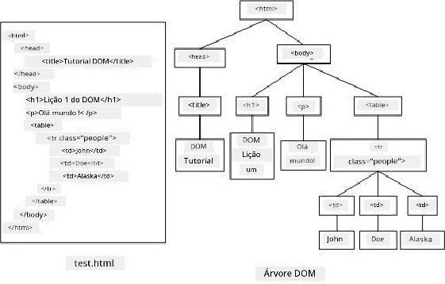
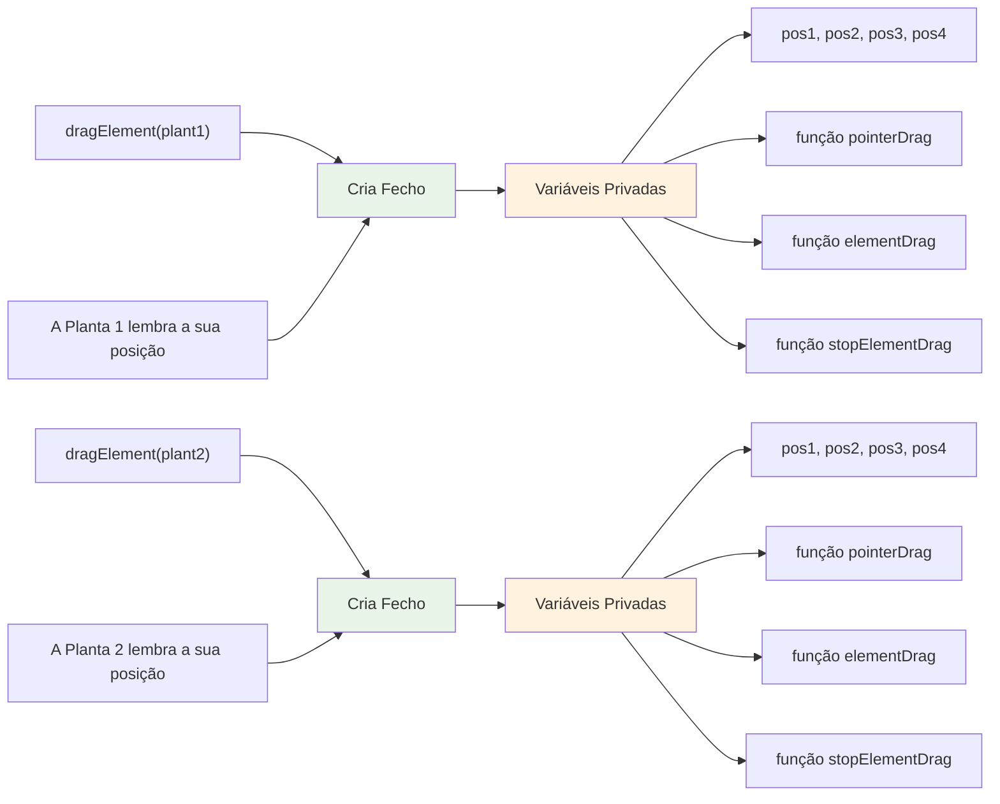
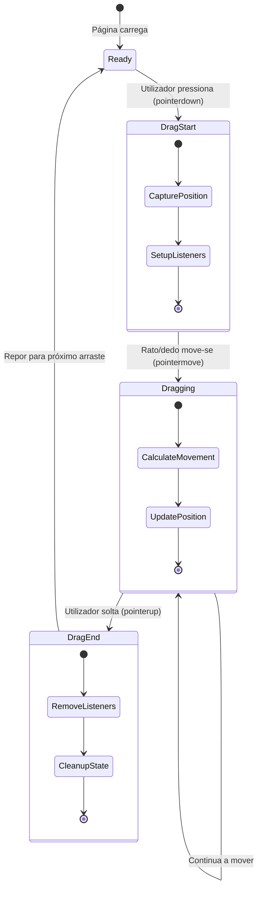
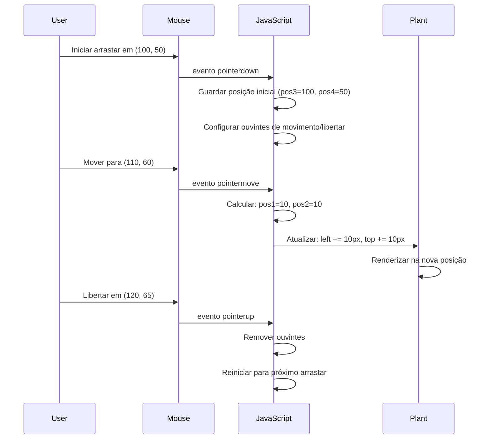
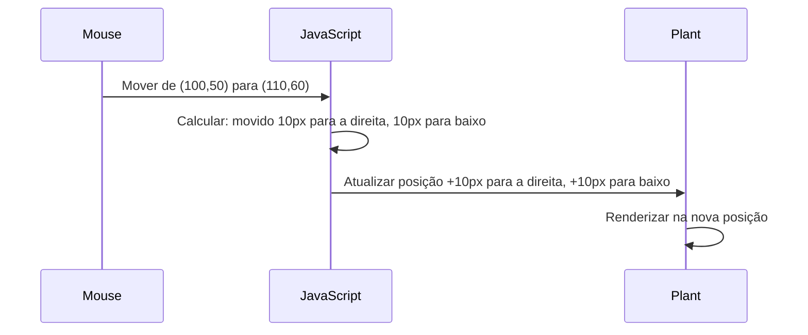
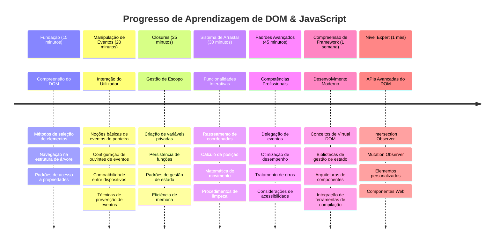

<!--
CO_OP_TRANSLATOR_METADATA:
{
  "original_hash": "973e48ad87d67bf5bb819746c9f8e302",
  "translation_date": "2026-01-06T18:22:44+00:00",
  "source_file": "3-terrarium/3-intro-to-DOM-and-closures/README.md",
  "language_code": "pt"
}
-->
# Projeto Terrário Parte 3: Manipulação do DOM e Closures em JavaScript



> Sketchnote por [Tomomi Imura](https://twitter.com/girlie_mac)

Bem-vindo a um dos aspetos mais envolventes do desenvolvimento web - tornar as coisas interativas! O Modelo de Objeto de Documento (DOM) é como uma ponte entre o seu HTML e JavaScript, e hoje iremos usá-lo para dar vida ao seu terrário. Quando Tim Berners-Lee criou o primeiro navegador web, ele imaginou uma web onde os documentos poderiam ser dinâmicos e interativos - o DOM torna essa visão possível.

Também exploraremos closures em JavaScript, que à primeira vista podem parecer intimidadoras. Pense nas closures como a criação de "bolsas de memória" onde as suas funções podem lembrar informações importantes. É como se cada planta do seu terrário tivesse o seu próprio registo de dados para acompanhar a sua posição. No final desta lição, compreenderá o quão naturais e úteis elas são.

Aqui está o que vamos construir: um terrário onde os utilizadores podem arrastar e largar plantas para qualquer lugar que desejem. Irá aprender as técnicas de manipulação do DOM que sustentam tudo, desde uploads de ficheiros com drag-and-drop até jogos interativos. Vamos dar vida ao seu terrário.


## Questionário Pré-Aula

[Questionário pré-aula](https://ff-quizzes.netlify.app/web/quiz/19)

## Compreender o DOM: A Sua Porta para Páginas Web Interativas

O Modelo de Objeto de Documento (DOM) é a forma como o JavaScript comunica com os seus elementos HTML. Quando o seu navegador carrega uma página HTML, cria uma representação estruturada dessa página na memória - isso é o DOM. Pense nisso como uma árvore genealógica onde cada elemento HTML é um membro da família que o JavaScript pode aceder, modificar ou rearranjar.

A manipulação do DOM transforma páginas estáticas em websites interativos. Sempre que vê um botão a mudar de cor ao passar o rato, conteúdo a atualizar sem recarregar a página, ou elementos que pode arrastar, isso é manipulação do DOM em ação.




> Uma representação do DOM e da marcação HTML que o referencia. De [Olfa Nasraoui](https://www.researchgate.net/publication/221417012_Profile-Based_Focused_Crawler_for_Social_Media-Sharing_Websites)

**Isto é o que torna o DOM poderoso:**
- **Fornece** uma forma estruturada de aceder a qualquer elemento na sua página
- **Permite** atualizações dinâmicas do conteúdo sem recarregamentos de página
- **Facilita** a resposta em tempo real a interações do utilizador como cliques e arrastos
- **Cria** a base para aplicações web interativas modernas

## Closures em JavaScript: Criar Código Organizado e Potente

Um [closure em JavaScript](https://developer.mozilla.org/docs/Web/JavaScript/Closures) é como dar a uma função o seu próprio espaço de trabalho privado com memória persistente. Considere como os tentilhões de Darwin nas Ilhas Galápagos desenvolveram bicos especializados com base no seu ambiente específico - as closures funcionam de forma semelhante, criando funções especializadas que "lembram" o seu contexto específico mesmo depois da função pai ter terminado.

No nosso terrário, as closures ajudam cada planta a lembrar a sua própria posição de forma independente. Este padrão aparece frequentemente no desenvolvimento profissional em JavaScript, tornando-se um conceito valioso para compreender.


> 💡 **Compreender Closures**: Closures são um tema importante em JavaScript, e muitos programadores usam-nas durante anos antes de entenderem completamente todos os aspetos teóricos. Hoje, estamos focados na aplicação prática - verá as closures surgir naturalmente enquanto construímos as funcionalidades interativas. A compreensão desenvolver-se-á à medida que perceber como resolvem problemas reais.


> Uma representação do DOM e da marcação HTML que o referencia. De [Olfa Nasraoui](https://www.researchgate.net/publication/221417012_Profile-Based_Focused_Crawler_for_Social_Media-Sharing_Websites)

Nesta lição, vamos completar o nosso projeto interativo de terrário criando o JavaScript que permitirá ao utilizador manipular as plantas na página.

## Antes de Começarmos: Preparar para o Sucesso

Vai precisar dos seus ficheiros HTML e CSS das lições anteriores do terrário – vamos tornar esse design estático interativo. Se estiver a juntar-se pela primeira vez, completar essas lições primeiro fornecerá um contexto importante.

Isto é o que vamos construir:
- **Arrastar e largar suave** para todas as plantas do terrário
- **Rastreio de coordenadas** para que as plantas lembrem as suas posições
- **Uma interface interativa completa** usando JavaScript vanilla
- **Código limpo e organizado** usando padrões de closures

## Configurar o Seu Ficheiro JavaScript

Vamos criar o ficheiro JavaScript que tornará o seu terrário interativo.

**Passo 1: Crie o seu ficheiro de script**

Na sua pasta do terrário, crie um novo ficheiro chamado `script.js`.

**Passo 2: Ligue o JavaScript ao seu HTML**

Adicione esta tag de script na secção `<head>` do seu ficheiro `index.html`:

```html
<script src="./script.js" defer></script>
```

**Porque é que o atributo `defer` é importante:**
- **Garante** que o seu JavaScript espera até todo o HTML estar carregado
- **Previne** erros onde o JavaScript procura elementos que ainda não estão prontos
- **Assegura** que todos os seus elementos de planta estão disponíveis para interação
- **Oferece** melhor desempenho do que colocar os scripts no fundo da página

> ⚠️ **Nota Importante**: O atributo `defer` evita problemas comuns de sincronização. Sem ele, o JavaScript pode tentar aceder a elementos HTML antes de serem carregados, causando erros.

---

## Ligar JavaScript aos Seus Elementos HTML

Antes de podermos tornar os elementos arrastáveis, o JavaScript precisa de os localizar no DOM. Pense nisto como um sistema de catalogação de biblioteca - uma vez que tem o número do catálogo, pode encontrar exatamente o livro que precisa e aceder a todo o seu conteúdo.

Usaremos o método `document.getElementById()` para fazer essas ligações. É como ter um sistema de arquivamento preciso - fornece um ID, e ele localiza exatamente o elemento que necessita no seu HTML.

### Ativar a Funcionalidade de Arrastar para Todas as Plantas

Adicione este código ao seu ficheiro `script.js`:

```javascript
// Ativar a funcionalidade de arrastar para todas as 14 plantas
dragElement(document.getElementById('plant1'));
dragElement(document.getElementById('plant2'));
dragElement(document.getElementById('plant3'));
dragElement(document.getElementById('plant4'));
dragElement(document.getElementById('plant5'));
dragElement(document.getElementById('plant6'));
dragElement(document.getElementById('plant7'));
dragElement(document.getElementById('plant8'));
dragElement(document.getElementById('plant9'));
dragElement(document.getElementById('plant10'));
dragElement(document.getElementById('plant11'));
dragElement(document.getElementById('plant12'));
dragElement(document.getElementById('plant13'));
dragElement(document.getElementById('plant14'));
```

**Isto é o que este código realiza:**
- **Localiza** cada elemento planta no DOM usando o seu ID único
- **Obtém** uma referência JavaScript para cada elemento HTML
- **Passa** cada elemento para uma função `dragElement` (que vamos criar a seguir)
- **Prepara** cada planta para a interação de arrastar e largar
- **Liga** a sua estrutura HTML à funcionalidade JavaScript

> 🎯 **Porque Usar IDs em Vez de Classes?** IDs fornecem identificadores únicos para elementos específicos, enquanto as classes CSS são concebidas para estilizar grupos de elementos. Quando o JavaScript precisa manipular elementos individuais, os IDs oferecem a precisão e desempenho que precisamos.

> 💡 **Dica Profissional**: Note como estamos a chamar `dragElement()` para cada planta individualmente. Esta abordagem garante que cada planta tem o seu próprio comportamento independente para arrastar, o que é essencial para uma interação suave do utilizador.

### 🔄 **Verificação Pedagógica**
**Compreensão da Ligação ao DOM**: Antes de avançar para a funcionalidade de arrastar, verifique se consegue:
- ✅ Explicar como `document.getElementById()` localiza elementos HTML
- ✅ Perceber porque usamos IDs únicos para cada planta
- ✅ Descrever o propósito do atributo `defer` nas tags de script
- ✅ Reconhecer como o JavaScript e HTML se conectam através do DOM

**Auto-Teste Rápido**: O que aconteceria se dois elementos tivessem o mesmo ID? Porque é que `getElementById()` retorna apenas um elemento?
*Resposta: Os IDs devem ser únicos; se houver duplicados, apenas o primeiro elemento é retornado*

---

## Construir o Closure dragElement

Agora vamos criar o núcleo da nossa funcionalidade de arrastar: uma closure que gere o comportamento de arrastar para cada planta. Esta closure conterá múltiplas funções internas que trabalham juntas para acompanhar os movimentos do rato e atualizar as posições dos elementos.

As closures são perfeitas para esta tarefa porque permitem criar variáveis "privadas" que persistem entre chamadas de função, dando a cada planta o seu próprio sistema independente de rastreio de coordenadas.

### Compreender Closures com um Exemplo Simples

Deixe-me demonstrar as closures com um exemplo simples que ilustra o conceito:

```javascript
function createCounter() {
    let count = 0; // Isto é como uma variável privada
    
    function increment() {
        count++; // A função interna lembra-se da variável externa
        return count;
    }
    
    return increment; // Estamos a devolver a função interna
}

const myCounter = createCounter();
console.log(myCounter()); // 1
console.log(myCounter()); // 2
```

**Isto é o que acontece neste padrão de closure:**
- **Cria** uma variável privada `count` que só existe dentro desta closure
- **A função interna** pode aceder e modificar essa variável externa (o mecanismo de closure)
- **Quando retornamos** a função interna, mantém a sua ligação a esses dados privados
- **Mesmo depois** de `createCounter()` terminar a execução, `count` persiste e lembra o seu valor

### Porque as Closures São Perfeitas para a Funcionalidade de Arrastar

Para o nosso terrário, cada planta precisa de lembrar as suas coordenadas atuais de posição. As closures fornecem a solução perfeita:

**Benefícios chave para o nosso projeto:**
- **Mantém** variáveis privadas de posição para cada planta de forma independente
- **Preserva** os dados das coordenadas entre eventos de arrastar
- **Previne** conflitos de variáveis entre diferentes elementos arrastáveis
- **Cria** uma estrutura de código limpa e organizada

> 🎯 **Objetivo de Aprendizagem**: Não precisa dominar todos os aspetos das closures agora. Foque-se em ver como elas nos ajudam a organizar o código e manter o estado para a nossa funcionalidade de arrastar.


### Criar a Função dragElement

Agora vamos construir a função principal que irá lidar com toda a lógica do arrastar. Adicione esta função abaixo das declarações dos elementos das plantas:

```javascript
function dragElement(terrariumElement) {
    // Inicializar variáveis de rastreamento de posição
    let pos1 = 0,  // Posição X anterior do rato
        pos2 = 0,  // Posição Y anterior do rato
        pos3 = 0,  // Posição X atual do rato
        pos4 = 0;  // Posição Y atual do rato
    
    // Configurar o ouvinte de evento de arrastar inicial
    terrariumElement.onpointerdown = pointerDrag;
}
```

**Compreender o sistema de rastreio de posições:**
- **`pos1` e `pos2`**: Guardam a diferença entre as antigas e novas posições do rato
- **`pos3` e `pos4`**: Acompanham as coordenadas atuais do rato
- **`terrariumElement`**: O elemento planta específico que estamos a tornar arrastável
- **`onpointerdown`**: O evento que dispara quando o utilizador começa a arrastar

**Assim funciona o padrão closure:**
- **Cria** variáveis privadas de posição para cada elemento planta
- **Mantém** essas variáveis ao longo do ciclo de vida do arrastar
- **Assegura** que cada planta acompanha as suas próprias coordenadas de forma independente
- **Fornece** uma interface limpa através da função `dragElement`

### Porque Usar Eventos Pointer?

Pode perguntar-se porque usamos `onpointerdown` em vez do mais conhecido `onclick`. Aqui está a razão:

| Tipo de Evento | Melhor Para | O Que Implica |
|----------------|-------------|---------------|
| `onclick` | Cliques simples em botões | Não consegue lidar com arrastar (apenas cliques e largar) |
| `onpointerdown` | Rato e toque | Mais recente, mas bem suportado hoje em dia |
| `onmousedown` | Apenas rato de computador | Exclui utilizadores móveis |

**Porque os eventos pointer são perfeitos para o que estamos a construir:**
- **Funciona bem** quer se use rato, dedo ou até um stylus
- **Sente-se igual** num portátil, tablet ou telemóvel
- **Lida** com o movimento real do arrastar (não apenas clicares simples)
- **Cria** uma experiência suave que os utilizadores esperam das apps web modernas

> 💡 **Preparação para o Futuro**: Eventos pointer são a forma moderna de lidar com interações do utilizador. Em vez de escrever código separado para rato e toque, obtém ambos grátis. Bastante bom, não?

### 🔄 **Verificação Pedagógica**
**Compreensão do Tratamento de Eventos**: Pare para confirmar a sua compreensão:
- ✅ Porque usamos eventos pointer em vez de eventos de rato?
- ✅ Como as variáveis da closure persistem entre chamadas de função?
- ✅ Qual é o papel de `preventDefault()` num arrastar suave?
- ✅ Porque é que ligamos os ouvintes ao documento em vez de aos elementos individuais?

**Ligação ao Mundo Real**: Pense nas interfaces de drag-and-drop que usa diariamente:
- **Uploads de ficheiros**: Arrastar ficheiros para dentro de uma janela do navegador
- **Quadros Kanban**: Mover tarefas entre colunas
- **Galerias de imagens**: Reorganizar ordem das fotos
- **Interfaces móveis**: Deslizar e arrastar em ecrãs táteis

---

## A Função pointerDrag: Capturar o Início de um Arrastar

Quando o utilizador pressiona uma planta (seja com clique do rato ou toque de dedo), a função `pointerDrag` entra em ação. Esta função captura as coordenadas iniciais e configura o sistema de arrastar.

Adicione esta função dentro da sua closure `dragElement`, logo após a linha `terrariumElement.onpointerdown = pointerDrag;`:

```javascript
function pointerDrag(e) {
    // Prevenir o comportamento padrão do navegador (como a seleção de texto)
    e.preventDefault();
    
    // Capturar a posição inicial do rato/toque
    pos3 = e.clientX;  // Coordenada X onde o arrastar começou
    pos4 = e.clientY;  // Coordenada Y onde o arrastar começou
    
    // Configurar os ouvintes de eventos para o processo de arrastar
    document.onpointermove = elementDrag;
    document.onpointerup = stopElementDrag;
}
```

**Passo a passo, isto é o que acontece:**
- **Previne** comportamentos padrão do navegador que poderiam interferir com o arrastar
- **Regista** as coordenadas exatas onde o utilizador começou o gesto de arrastar
- **Estabelece** ouvintes de eventos para o movimento contínuo do arrastar
- **Prepara** o sistema para seguir o movimento do rato/dedo por todo o documento

### Compreender a Prevenção de Eventos

A linha `e.preventDefault()` é crucial para um arrastar suave:

**Sem esta prevenção, os navegadores podem:**
- **Selecionar** texto quando se arrasta pela página
- **Ativar** menus contextuais ao clicar com o botão direito e arrastar
- **Interferir** com o nosso comportamento personalizado de arrastar
- **Criar** artefactos visuais durante a operação de arrastar

> 🔍 **Experiência**: Após esta lição, experimente remover `e.preventDefault()` e veja como isso afeta a experiência de arrastar. Vai perceber rapidamente porque é que esta linha é essencial!

### Sistema de Rastreio de Coordenadas

As propriedades `e.clientX` e `e.clientY` dão-nos coordenadas precisas do rato/toque:

| Propriedade | O Que Mede | Caso de Uso |
|-------------|-------------|-------------|
| `clientX` | Posição horizontal relativa ao viewport | Rastrear movimento esquerda-direita |
| `clientY` | Posição vertical relativa ao viewport | Rastrear movimento cima-baixo |
**Compreendendo estas coordenadas:**
- **Fornece** informações de posicionamento pixel-perfeito
- **Atualiza** em tempo real à medida que o utilizador move o cursor
- **Mantém-se** consistente em diferentes tamanhos de ecrã e níveis de zoom
- **Permite** interações de arrastar suaves e responsivas

### Configurar Listeners de Eventos ao Nível do Documento

Repare como anexamos os eventos de mover e parar ao `document` inteiro, não apenas ao elemento planta:

```javascript
document.onpointermove = elementDrag;
document.onpointerup = stopElementDrag;
```

**Por que anexar ao documento:**
- **Mantém** o rastreio mesmo quando o rato sai do elemento planta
- **Previne** a interrupção do arrastar se o utilizador se mover rapidamente
- **Fornece** arrasto suave por todo o ecrã
- **Lida** com casos limite em que o cursor sai da janela do navegador

> ⚡ **Nota de Desempenho**: Vamos limpar estes listeners a nível do documento quando o arrastar parar para evitar fugas de memória e problemas de desempenho.

## Completar o Sistema de Arrastar: Movimento e Limpeza

Agora vamos adicionar as duas funções restantes que tratam da movimentação real do arrastar e da limpeza quando o arrastar termina. Estas funções trabalham em conjunto para criar um movimento das plantas suave e responsivo no seu terrário.

### A Função elementDrag: Controlar o Movimento

Adicione a função `elementDrag` logo após a chaveta de fecho de `pointerDrag`:

```javascript
function elementDrag(e) {
    // Calcular a distância percorrida desde o último evento
    pos1 = pos3 - e.clientX;  // Distância horizontal percorrida
    pos2 = pos4 - e.clientY;  // Distância vertical percorrida
    
    // Atualizar o rastreamento da posição atual
    pos3 = e.clientX;  // Nova posição X atual
    pos4 = e.clientY;  // Nova posição Y atual
    
    // Aplicar o movimento à posição do elemento
    terrariumElement.style.top = (terrariumElement.offsetTop - pos2) + 'px';
    terrariumElement.style.left = (terrariumElement.offsetLeft - pos1) + 'px';
}
```

**Compreendendo a matemática das coordenadas:**
- **`pos1` e `pos2`**: Calculam o quanto o rato se moveu desde a última atualização
- **`pos3` e `pos4`**: Guardam a posição atual do rato para o próximo cálculo
- **`offsetTop` e `offsetLeft`**: Obtêm a posição atual do elemento na página
- **Lógica da subtração**: Move o elemento pela mesma quantidade que o rato se moveu


**Aqui está a decomposição do cálculo do movimento:**
1. **Mede** a diferença entre as posições antiga e nova do rato
2. **Calcula** quanto mover o elemento baseado no movimento do rato
3. **Atualiza** as propriedades CSS de posição do elemento em tempo real
4. **Armazena** a nova posição como base para o próximo cálculo de movimento

### Representação Visual da Matemática


### A Função stopElementDrag: Fazer a Limpeza

Adicione a função de limpeza após a chaveta de fecho de `elementDrag`:

```javascript
function stopElementDrag() {
    // Remover os ouvintes de eventos ao nível do documento
    document.onpointerup = null;
    document.onpointermove = null;
}
```

**Por que a limpeza é essencial:**
- **Previne** fugas de memória devido a listeners de evento remanescentes
- **Para** o comportamento de arrastar quando o utilizador solta a planta
- **Permite** que outros elementos possam ser arrastados independentemente
- **Reinicia** o sistema para a próxima operação de arrastar

**O que acontece sem limpeza:**
- Os listeners continuam a funcionar mesmo depois de parar o arrastar
- O desempenho degrada-se à medida que listeners não usados se acumulam
- Comportamentos inesperados ao interagir com outros elementos
- Recursos do navegador são desperdiçados com manipulação de eventos desnecessária

### Compreendendo as Propriedades CSS de Posição

Nosso sistema de arrasto manipula duas propriedades CSS chave:

| Propriedade | O Que Controla | Como Usamos |
|-------------|----------------|-------------|
| `top`       | Distância da borda superior | Posicionamento vertical durante o arrasto |
| `left`      | Distância da borda esquerda | Posicionamento horizontal durante o arrasto |

**Principais insights sobre as propriedades offset:**
- **`offsetTop`**: Distância atual do topo do elemento pai posicionado
- **`offsetLeft`**: Distância atual da esquerda do elemento pai posicionado
- **Contexto de posicionamento**: Estes valores são relativos ao ancestral posicionado mais próximo
- **Atualizações em tempo real**: Mudam imediatamente quando modificamos as propriedades CSS

> 🎯 **Filosofia de Design**: Este sistema de arrastar é intencionalmente flexível – não existem "zonas de largada" nem restrições. Os utilizadores podem colocar as plantas onde quiserem, dando-lhes controle criativo completo sobre o design do terrário.

## Juntando Tudo: O Seu Sistema Completo de Arrastar

Parabéns! Acabou de construir um sistema sofisticado de arrastar e largar usando JavaScript puro. A sua função completa `dragElement` agora contém um poderoso closure que gere:

**O que o seu closure realiza:**
- **Mantém** variáveis privadas de posição para cada planta de forma independente
- **Controla** o ciclo de vida completo do arrastar desde o início até ao fim
- **Fornece** movimento suave e responsivo por todo o ecrã
- **Limpa** recursos adequadamente para evitar fugas de memória
- **Cria** uma interface intuitiva e criativa para design de terrários

### Testando o Seu Terrário Interativo

Agora teste o seu terrário interativo! Abra o ficheiro `index.html` num browser e experimente a funcionalidade:

1. **Clique e mantenha pressionado** qualquer planta para começar a arrastar
2. **Mexa o rato ou o dedo** e veja a planta acompanhar suavemente
3. **Solte** para largar a planta na nova posição
4. **Experimente** diferentes arranjos para explorar a interface

🥇 **Conquista**: Criou uma aplicação web totalmente interativa usando conceitos fundamentais que programadores profissionais usam diariamente. Esta funcionalidade de arrastar e largar usa os mesmos princípios por trás de uploads de ficheiros, quadros kanban e muitas outras interfaces interativas.

### 🔄 **Verificação Pedagógica**
**Compreensão Completa do Sistema**: Verifique a sua mestria no sistema completo de arrastar:
- ✅ Como é que os closures mantêm estado independente para cada planta?
- ✅ Por que é necessário o cálculo das coordenadas matemáticas para um movimento suave?
- ✅ O que aconteceria se nos esquecêssemos de limpar os listeners de evento?
- ✅ Como é que este padrão escala para interações mais complexas?

**Reflexão Sobre Qualidade de Código**: Reveja a sua solução completa:
- **Design modular**: Cada planta tem a sua própria instância do closure
- **Eficiência de evento**: Configuração e limpeza apropriadas dos listeners
- **Suporte multi-dispositivo**: Funciona em desktop e móvel
- **Consciência de desempenho**: Sem fugas de memória ou cálculos redundantes


---

## Desafio do Agente GitHub Copilot 🚀

Use o modo Agente para completar o seguinte desafio:

**Descrição:** Melhore o projeto do terrário adicionando uma funcionalidade de reset que retorna todas as plantas às suas posições originais com animações suaves.

**Instrução:** Crie um botão de reset que, ao ser clicado, anime todas as plantas de volta às posições originais na barra lateral usando transições CSS. A função deve guardar as posições originais quando a página carrega e fazer a transição suave das plantas de volta a essas posições durante 1 segundo quando o botão reset for pressionado.

Saiba mais sobre [modo agente](https://code.visualstudio.com/blogs/2025/02/24/introducing-copilot-agent-mode) aqui.

## 🚀 Desafio Adicional: Expanda as Suas Competências

Quer levar o seu terrário ao próximo nível? Experimente implementar estas melhorias:

**Extensões Criativas:**
- **Duplo clique** numa planta para trazê-la para a frente (manipulação de z-index)
- **Adicionar feedback visual** como um brilho subtil ao passar o rato sobre as plantas
- **Implementar limites** para impedir que as plantas sejam arrastadas fora do terrário
- **Criar uma função de guardar** que memorize as posições das plantas usando localStorage
- **Adicionar efeitos sonoros** ao pegar e largar plantas

> 💡 **Oportunidade de Aprendizagem**: Cada um destes desafios ensinar-lhe-á novos aspetos de manipulação do DOM, gestão de eventos e design de experiência do utilizador.

## Quiz Pós-Aula

[Quiz pós-aula](https://ff-quizzes.netlify.app/web/quiz/20)

## Revisão & Auto-Estudo: Aprofundar o Seu Conhecimento

Dominou os fundamentos da manipulação do DOM e closures, mas há sempre mais para explorar! Aqui estão alguns caminhos para expandir o seu conhecimento e competências.

### Abordagens Alternativas para Arrastar e Largar

Usámos eventos pointer para máxima flexibilidade, mas o desenvolvimento web oferece várias abordagens:

| Abordagem | Ideal Para | Valor de Aprendizagem |
|-----------|------------|-----------------------|
| [API HTML Drag and Drop](https://developer.mozilla.org/docs/Web/API/HTML_Drag_and_Drop_API) | Uploads de ficheiros, zonas formais de arrastar | Compreensão das capacidades nativas do navegador |
| [Eventos Touch](https://developer.mozilla.org/docs/Web/API/Touch_events) | Interações específicas de dispositivos móveis | Padrões de desenvolvimento mobile-first |
| Propriedades CSS `transform` | Animações suaves | Técnicas de otimização de desempenho |

### Tópicos Avançados de Manipulação do DOM

**Próximos passos na sua aprendizagem:**
- **Delegação de eventos**: Lidar com eventos eficientemente para múltiplos elementos
- **Intersection Observer**: Detectar quando elementos entram/saiem da vista
- **Mutation Observer**: Monitorizar mudanças na estrutura DOM
- **Componentes Web**: Criar elementos UI reutilizáveis e encapsulados
- **Conceitos de DOM Virtual**: Compreender como frameworks otimizam atualizações DOM

### Recursos Essenciais para Aprender Continuamente

**Documentação Técnica:**
- [Guia MDN de Pointer Events](https://developer.mozilla.org/docs/Web/API/Pointer_events) - Referência abrangente de eventos pointer
- [Especificação W3C Pointer Events](https://www.w3.org/TR/pointerevents1/) - Documentação oficial de standards
- [Closures JavaScript - Mergulho Profundo](https://developer.mozilla.org/docs/Web/JavaScript/Closures) - Padrões avançados de closures

**Compatibilidade de Navegadores:**
- [CanIUse.com](https://caniuse.com/) - Verificar suporte de funcionalidades em browsers
- [MDN Browser Compatibility Data](https://github.com/mdn/browser-compat-data) - Informação detalhada de compatibilidade

**Oportunidades de Prática:**
- **Construa** um jogo de puzzle usando mecânicas semelhantes de arrastar
- **Crie** um quadro kanban com gestão de tarefas via drag-and-drop
- **Desenhe** uma galeria de imagens com arranjos fotográficos arrastáveis
- **Experimente** gestos touch para interfaces móveis

> 🎯 **Estratégia de Aprendizagem**: A melhor forma de consolidar estes conceitos é através da prática. Tente construir variações de interfaces arrastáveis – cada projeto ensinar-lhe-á algo novo sobre interação do utilizador e manipulação do DOM.

### ⚡ **O Que Pode Fazer Nos Próximos 5 Minutos**
- [ ] Abra as ferramentas de desenvolvimento do navegador e escreva `document.querySelector('body')` no console
- [ ] Tente alterar o texto de uma página usando `innerHTML` ou `textContent`
- [ ] Adicione um listener de evento de clique a qualquer botão ou link numa página web
- [ ] Inspecione a estrutura da árvore DOM usando o painel Elementos

### 🎯 **O Que Pode Realizar Nesta Hora**
- [ ] Complete o quiz pós-aula e reveja conceitos de manipulação DOM
- [ ] Crie uma página interativa que responde a cliques do utilizador
- [ ] Pratique gestão de eventos com tipos distintos (click, mouseover, keypress)
- [ ] Construa uma lista de tarefas simples ou contador usando manipulação DOM
- [ ] Explore a relação entre elementos HTML e objetos JavaScript

### 📅 **A Sua Jornada de Javascript Durante a Semana**
- [ ] Complete o projeto do terrário interativo com funcionalidades de arrastar e largar
- [ ] Domine a delegação de eventos para manipulação eficiente
- [ ] Aprenda sobre o event loop e JavaScript assíncrono
- [ ] Pratique closures construindo módulos com estado privado
- [ ] Explore APIs modernas do DOM como Intersection Observer
- [ ] Construa componentes interativos sem usar frameworks

### 🌟 **A Sua Maestria em Javascript Durante o Mês**
- [ ] Crie uma aplicação single-page complexa usando JavaScript puro
- [ ] Aprenda um framework moderno (React, Vue, ou Angular) e compare com DOM puro
- [ ] Contribua para projetos open source JavaScript
- [ ] Domine conceitos avançados como web components e elementos customizados
- [ ] Construa aplicações web performantes com padrões DOM ótimos
- [ ] Ensine outros sobre manipulação do DOM e fundamentos JavaScript

## 🎯 O Seu Cronograma de Maestria em Javascript DOM


### 🛠️ Resumo da Sua Caixa de Ferramentas JavaScript

Após completar esta lição, agora possui:
- **Domínio do DOM**: Seleção de elementos, manipulação de propriedades e navegação na árvore
- **Especialização em Eventos**: Gestão de interação cross-device com eventos pointer
- **Entendimento de Closures**: Gestão de estado privado e persistência funcional
- **Sistemas Interativos**: Implementação completa do arrastar e largar do zero
- **Consciência de Desempenho**: Limpeza correta de eventos e gestão de memória
- **Padrões Modernos**: Técnicas de organização de código usadas no desenvolvimento profissional
- **Experiência do Utilizador**: Criação de interfaces intuitivas e responsivas

**Competências Profissionais Adquiridas**: Criou funcionalidades usando as mesmas técnicas de:
- **Quadros Trello/Kanban**: Arrastar cartões entre colunas
- **Sistemas de Upload de Ficheiros**: Manipulação drag-and-drop de ficheiros
- **Galerias de Imagens**: Interfaces para arranjar fotografias
- **Apps Móveis**: Padrões de interação baseados no toque

**Próximo Nível**: Está pronto para explorar frameworks modernos como React, Vue ou Angular que se baseiam nestes conceitos fundamentais de manipulação do DOM!

## Tarefa

[Trabalhar um pouco mais com o DOM](assignment.md)

---

<!-- CO-OP TRANSLATOR DISCLAIMER START -->
**Aviso Legal**:
Este documento foi traduzido utilizando o serviço de tradução automática [Co-op Translator](https://github.com/Azure/co-op-translator). Embora nos esforcemos pela precisão, por favor tenha em conta que traduções automáticas podem conter erros ou imprecisões. O documento original na sua língua nativa deve ser considerado a fonte autorizada. Para informações críticas, recomenda-se tradução profissional humana. Não nos responsabilizamos por quaisquer mal-entendidos ou interpretações incorretas decorrentes do uso desta tradução.
<!-- CO-OP TRANSLATOR DISCLAIMER END -->