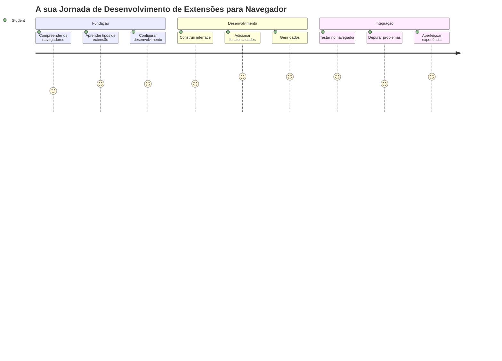
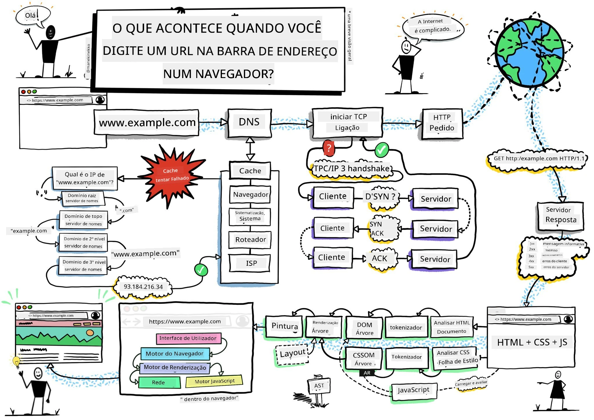
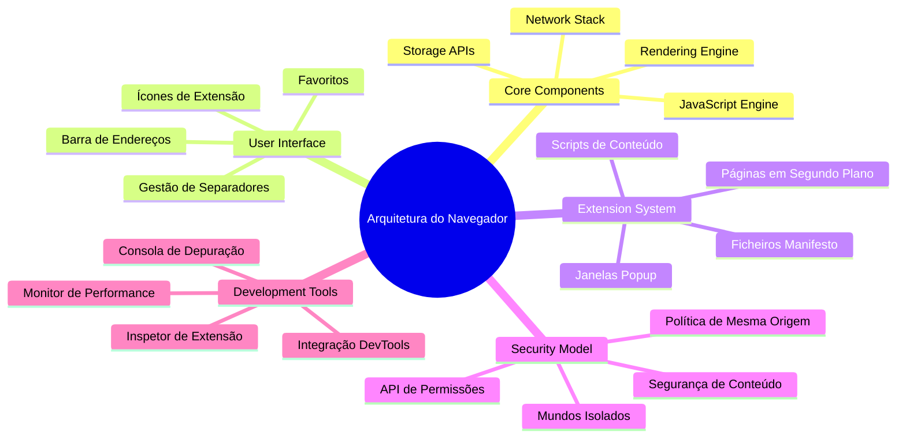
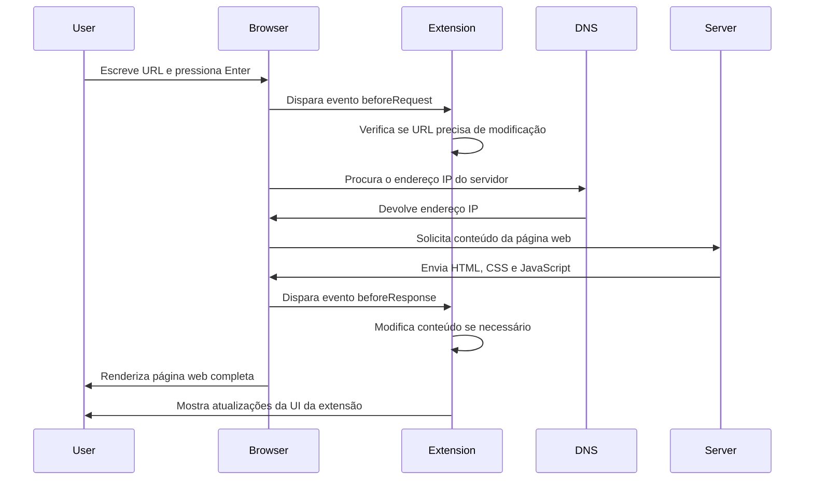
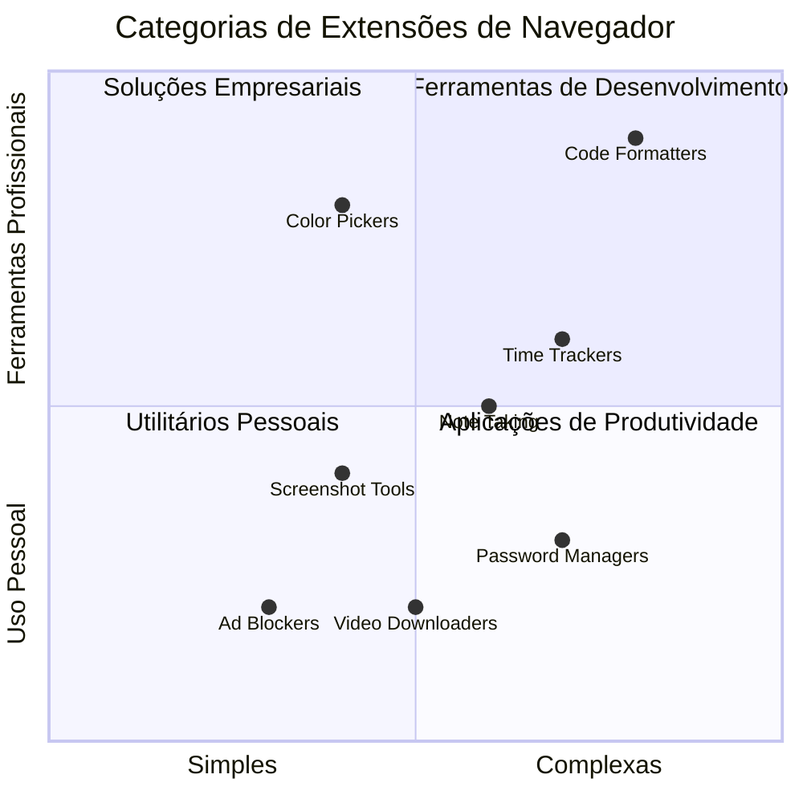
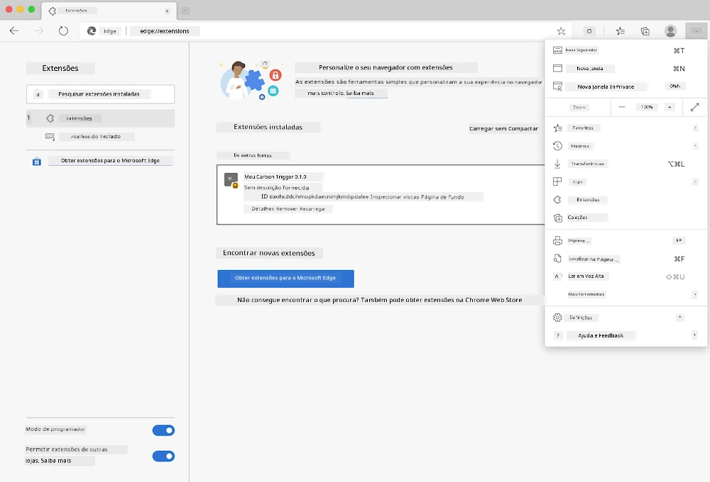
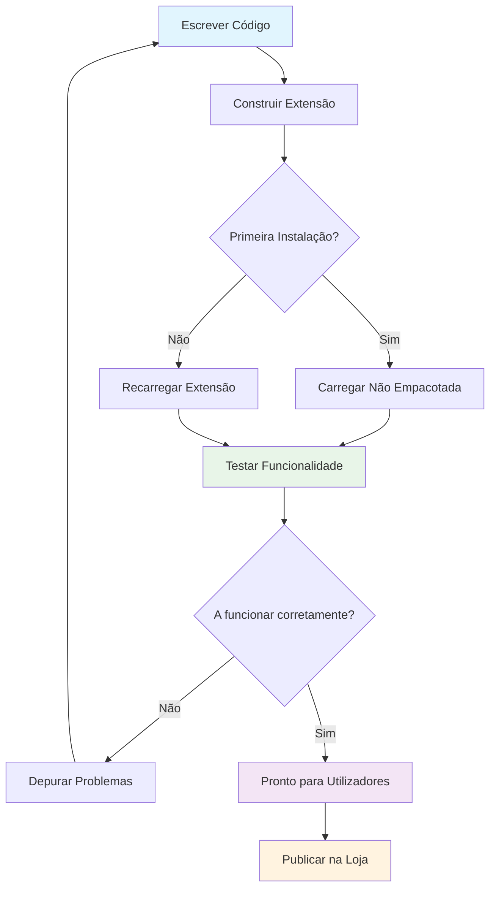
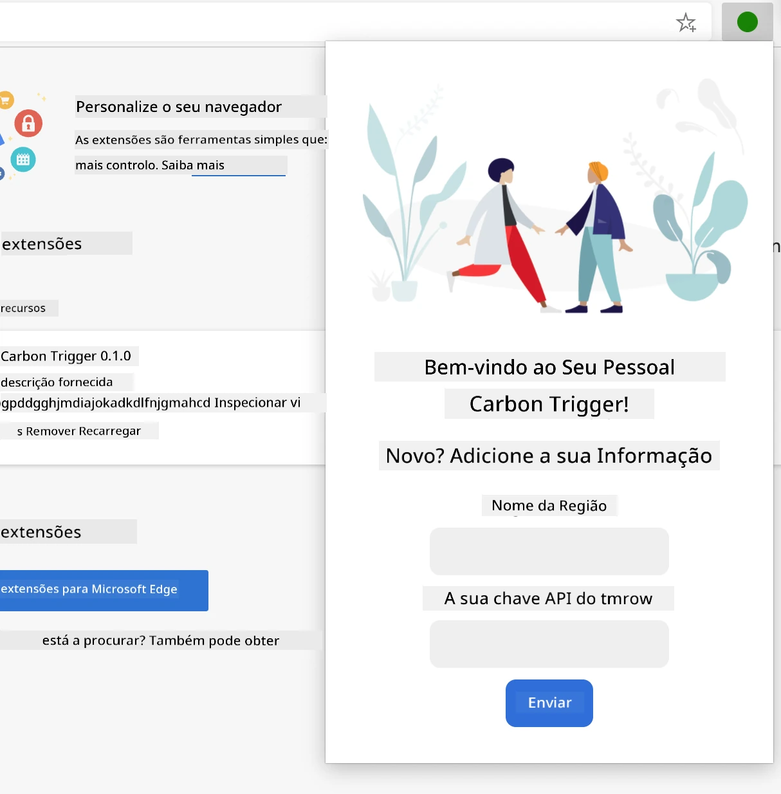
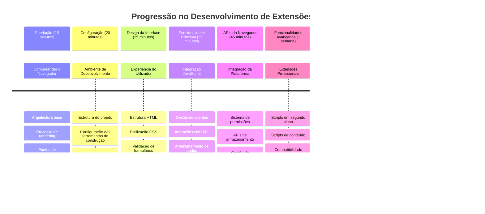

<!--
CO_OP_TRANSLATOR_METADATA:
{
  "original_hash": "00aa85715e1efd4930c17a23e3012e69",
  "translation_date": "2026-01-06T18:05:41+00:00",
  "source_file": "5-browser-extension/1-about-browsers/README.md",
  "language_code": "pt"
}
-->
# Projeto de Extensão de Navegador Parte 1: Tudo sobre Navegadores



> Sketchnote por [Wassim Chegham](https://dev.to/wassimchegham/ever-wondered-what-happens-when-you-type-in-a-url-in-an-address-bar-in-a-browser-3dob)

## Questionário Pré-Aula

[Questionário pré-aula](https://ff-quizzes.netlify.app/web/quiz/23)

### Introdução

As extensões de navegador são mini-aplicações que melhoram a sua experiência de navegação web. Tal como a visão original de Tim Berners-Lee de uma web interativa, as extensões expandem as capacidades do navegador para além da simples visualização de documentos. Desde gestores de passwords que mantêm as suas contas seguras a seletores de cores que ajudam designers a escolher tons perfeitos, as extensões resolvem desafios diários da navegação.

Antes de construirmos a sua primeira extensão, vamos compreender como os navegadores funcionam. Tal como Alexander Graham Bell precisava compreender a transmissão do som antes de inventar o telefone, conhecer os fundamentos dos navegadores ajudará a criar extensões que se integrem de forma fluida com os sistemas existentes.

No final desta lição, entenderá a arquitetura dos navegadores e terá começado a construir a sua primeira extensão.


## Compreender os Navegadores Web

Um navegador web é essencialmente um intérprete sofisticado de documentos. Quando escreve "google.com" na barra de endereço, o navegador executa uma série complexa de operações – solicitando conteúdo a servidores em todo o mundo, depois analisando e renderizando esse código nas páginas web interativas que vê.

Este processo reflete como o primeiro navegador web, WorldWideWeb, foi criado por Tim Berners-Lee em 1990 para tornar os documentos hiperligados acessíveis a todos.

✅ **Um pouco de história**: O primeiro navegador chamou-se 'WorldWideWeb' e foi criado por Sir Timothy Berners-Lee em 1990.


> Alguns navegadores iniciais, via [Karen McGrane](https://www.slideshare.net/KMcGrane/week-4-ixd-history-personal-computing)

### Como os Navegadores Processam o Conteúdo Web

O processo entre introduzir um URL e ver uma página da web envolve várias etapas coordenadas que acontecem em segundos:


**Isto é o que este processo realiza:**
- **Traduz** o URL legível para um endereço IP do servidor através da pesquisa DNS
- **Estabelece** uma ligação segura com o servidor web usando os protocolos HTTP ou HTTPS
- **Solicita** o conteúdo específico da página web ao servidor
- **Recebe** marcação HTML, estilos CSS e código JavaScript do servidor
- **Renderiza** todo o conteúdo na página web interativa que vê

### Funcionalidades Principais do Navegador

Os navegadores modernos fornecem inúmeras funcionalidades que os desenvolvedores de extensões podem aproveitar:

| Funcionalidade | Propósito | Oportunidades para Extensões |
|----------------|-----------|------------------------------|
| **Motor de Renderização** | Exibe HTML, CSS e JavaScript | Modificação de conteúdo, injeção de estilos |
| **Motor JavaScript** | Executa código JavaScript | Scripts personalizados, interações com API |
| **Armazenamento Local** | Guarda dados localmente | Preferências do utilizador, dados cacheados |
| **Pilhas de Rede** | Gere pedidos web | Monitorização de pedidos, análise de dados |
| **Modelo de Segurança** | Protege os utilizadores de conteúdos maliciosos | Filtragem de conteúdo, melhorias de segurança |

**Compreender estas funcionalidades ajuda a:**
- **Identificar** onde a sua extensão pode acrescentar mais valor
- **Escolher** as APIs do navegador corretas para a funcionalidade da sua extensão
- **Conceber** extensões que funcionam eficientemente com os sistemas do navegador
- **Garantir** que a sua extensão cumpre as melhores práticas de segurança do navegador

### Considerações para Desenvolvimento Cross-Browser

Diferentes navegadores implementam padrões com pequenas variações, tal como diferentes linguagens de programação podem tratar o mesmo algoritmo de forma distinta. Chrome, Firefox e Safari têm características únicas que os desenvolvedores devem ter em conta durante o desenvolvimento das extensões.

> 💡 **Dica Profissional**: Utilize [caniuse.com](https://www.caniuse.com) para verificar quais tecnologias web são suportadas em diferentes navegadores. Isto é inestimável ao planear as funcionalidades da sua extensão!

**Considerações chave para o desenvolvimento de extensões:**
- **Teste** a sua extensão nos navegadores Chrome, Firefox e Edge
- **Adapte-se** às diferentes APIs e formatos de manifesto das extensões dos navegadores
- **Gerencie** as diferenças de desempenho e limitações variadas
- **Forneça** alternativas para funcionalidades específicas de certos navegadores que possam não estar disponíveis

✅ **Percepção Analítica**: Pode determinar quais os navegadores preferidos dos seus utilizadores instalando pacotes de análise nos seus projetos de desenvolvimento web. Estes dados ajudam a priorizar os navegadores a suportar primeiro.

## Compreender as Extensões de Navegador

As extensões de navegador resolvem desafios comuns da navegação na web ao adicionar funcionalidades directamente à interface do navegador. Em vez de exigir aplicações separadas ou fluxos de trabalho complexos, as extensões oferecem acesso imediato a ferramentas e funcionalidades.

Este conceito reflete como pioneiros da computação como Douglas Engelbart imaginaram aumentar as capacidades humanas com tecnologia – as extensões aumentam a funcionalidade básica do seu navegador.


**Categorias populares de extensões e os seus benefícios:**
- **Ferramentas de Produtividade**: Gestores de tarefas, aplicações de tomada de notas e controladores de tempo que ajudam a manter-se organizado
- **Melhorias de Segurança**: Gestores de passwords, bloqueadores de anúncios e ferramentas de privacidade que protegem os seus dados
- **Ferramentas para Desenvolvedores**: Formatadores de código, seletores de cores e utilitários de depuração que agilizam o desenvolvimento
- **Melhoria de Conteúdo**: Modos de leitura, descarregadores de vídeo e ferramentas de captura de ecrã que melhoram a sua experiência web

✅ **Pergunta de Reflexão**: Quais são as suas extensões de navegador favoritas? Que tarefas específicas realizam e como melhoram a sua experiência de navegação?

### 🔄 **Verificação Pedagógica**
**Compreensão da Arquitetura dos Navegadores**: Antes de avançar para o desenvolvimento da extensão, assegure-se de que pode:
- ✅ Explicar como os navegadores processam pedidos web e renderizam conteúdo
- ✅ Identificar os principais componentes da arquitetura dos navegadores
- ✅ Compreender como as extensões se integram na funcionalidade do navegador
- ✅ Reconhecer o modelo de segurança que protege os utilizadores

**Auto-avaliação rápida**: Consegue traçar o percurso desde a digitação de um URL até ver uma página web?
1. **Pesquisa DNS** converte URL em endereço IP
2. **Pedido HTTP** obtém conteúdo do servidor
3. **Análise** processa HTML, CSS e JavaScript
4. **Renderização** exibe a página final
5. **Extensões** podem modificar conteúdo em múltiplas etapas

## Instalar e Gerir Extensões

Compreender o processo de instalação de extensões ajuda a antecipar a experiência do utilizador ao instalar a sua extensão. O processo de instalação está padronizado nos navegadores modernos, com pequenas variações no design da interface.



> **Importante**: Certifique-se de ativar o modo de desenvolvedor e permitir extensões de outras lojas ao testar as suas próprias extensões.

### Processo de Instalação de Extensão durante o Desenvolvimento

Quando estiver a desenvolver e testar as suas próprias extensões, siga este fluxo de trabalho:


```bash
# Passo 1: Construa a sua extensão
npm run build
```

**O que este comando realiza:**
- **Compila** o seu código-fonte em ficheiros prontos para o navegador
- **Agrupa** módulos JavaScript em pacotes otimizados
- **Gera** os ficheiros finais da extensão na pasta `/dist`
- **Prepara** a sua extensão para instalação e testes

**Passo 2: Navegue até Extensões do Navegador**
1. **Abra** a página de gestão de extensões do seu navegador
2. **Clique** no botão "Definições e mais" (ícone `...`) no canto superior direito
3. **Selecione** "Extensões" no menu dropdown

**Passo 3: Carregue a sua Extensão**
- **Para novas instalações**: Escolha `load unpacked` e selecione a sua pasta `/dist`
- **Para atualizações**: Clique em `reload` ao lado da extensão já instalada
- **Para testes**: Ative o "Modo de desenvolvedor" para aceder a funcionalidades adicionais de depuração

### Instalação de Extensões em Produção

> ✅ **Nota**: Estas instruções de desenvolvimento destinam-se especificamente às extensões que você próprio constrói. Para instalar extensões já publicadas, visite as lojas oficiais de extensões do navegador como a [Microsoft Edge Add-ons store](https://microsoftedge.microsoft.com/addons/Microsoft-Edge-Extensions-Home).

**Compreender a diferença:**
- **Instalações em desenvolvimento** permitem testar extensões não publicadas durante o desenvolvimento
- **Instalações pela loja** fornecem extensões aprovadas, publicadas com atualizações automáticas
- **Sideloading** permite instalar extensões fora das lojas oficiais (requer modo de desenvolvedor)

## Construindo a Sua Extensão de Pegada de Carbono

Vamos criar uma extensão que mostra a pegada de carbono do consumo energético da sua região. Este projeto demonstra conceitos essenciais do desenvolvimento de extensões enquanto cria uma ferramenta prática para consciência ambiental.

Esta abordagem segue o princípio de "aprender a fazer", comprovado eficaz desde as teorias educativas de John Dewey – combinar competências técnicas com aplicações reais significativas.

### Requisitos do Projeto

Antes de começar o desenvolvimento, vamos reunir os recursos e dependências necessários:

**Acesso API Necessário:**
- **[Chave API do CO2 Signal](https://www.co2signal.com/)**: Introduza o seu email para receber a sua chave API gratuita
- **[Código da região](http://api.electricitymap.org/v3/zones)**: Encontre o código da sua região usando o [Electricity Map](https://www.electricitymap.org/map) (por exemplo, Boston usa 'US-NEISO')

**Ferramentas de Desenvolvimento:**
- **[Node.js e NPM](https://www.npmjs.com)**: Ferramenta de gestão de pacotes para instalar dependências do projeto
- **[Código inicial](../../../../5-browser-extension/start)**: Faça download da pasta `start` para iniciar o desenvolvimento

✅ **Aprenda Mais**: Melhore as suas competências em gestão de pacotes com este [módulo Learn abrangente](https://docs.microsoft.com/learn/modules/create-nodejs-project-dependencies/?WT.mc_id=academic-77807-sagibbon)

### Compreender a Estrutura do Projeto

Compreender a estrutura do projeto ajuda a organizar o trabalho de desenvolvimento de forma eficiente. Tal como a Biblioteca de Alexandria foi organizada para facilitar a recuperação do conhecimento, uma base de código bem estruturada torna o desenvolvimento mais produtivo:

```
project-root/
├── dist/                    # Built extension files
│   ├── manifest.json        # Extension configuration
│   ├── index.html           # User interface markup
│   ├── background.js        # Background script functionality
│   └── main.js              # Compiled JavaScript bundle
├── src/                     # Source development files
│   └── index.js             # Your main JavaScript code
├── package.json             # Project dependencies and scripts
└── webpack.config.js        # Build configuration
```

**O que cada ficheiro realiza:**
- **`manifest.json`**: **Define** metadados da extensão, permissões e pontos de entrada
- **`index.html`**: **Cria** a interface de utilizador que aparece ao clicar na extensão
- **`background.js`**: **Gere** tarefas em segundo plano e ouvintes de eventos do navegador
- **`main.js`**: **Contém** o JavaScript final agrupado após o processo de construção
- **`src/index.js`**: **Tem** o código principal de desenvolvimento que é compilado para `main.js`

> 💡 **Dica de Organização**: Guarde a sua chave API e código da região numa nota segura para fácil referência durante o desenvolvimento. Vai precisar destes valores para testar a funcionalidade da sua extensão.

✅ **Nota de Segurança**: Nunca faça commit das chaves API ou credenciais sensíveis no seu repositório de código. Iremos mostrar como tratar isto com segurança nos próximos passos.

## Criar a Interface da Extensão

Agora vamos construir os componentes da interface de utilizador. A extensão usa uma abordagem de duas ecrãs: um ecrã de configuração para a definição inicial e um ecrã de resultados para exibir os dados.

Isto segue o princípio da divulgação progressiva utilizado no design de interfaces desde os primórdios da computação – revelar informação e opções em sequência lógica para não sobrecarregar os utilizadores.

### Visão Geral das Vistas da Extensão

**Vista de Configuração** – Configuração do utilizador pela primeira vez:


**Vista de Resultados** – Exibição dos dados da pegada de carbono:


### Construir o Formulário de Configuração

O formulário de configuração recolhe dados da configuração do utilizador durante o uso inicial. Depois de configurado, esta informação persiste no armazenamento do navegador para sessões futuras.

No ficheiro `/dist/index.html`, adicione esta estrutura de formulário:

```html
<form class="form-data" autocomplete="on">
    <div>
        <h2>New? Add your Information</h2>
    </div>
    <div>
        <label for="region">Region Name</label>
        <input type="text" id="region" required class="region-name" />
    </div>
    <div>
        <label for="api">Your API Key from tmrow</label>
        <input type="text" id="api" required class="api-key" />
    </div>
    <button class="search-btn">Submit</button>
</form>
```

**O que este formulário realiza:**
- **Cria** uma estrutura semântica de formulário com etiquetas apropriadas e associações de input
- **Habilita** a funcionalidade de preenchimento automático do navegador para melhorar a experiência do utilizador
- **Exige** que ambos os campos sejam preenchidos antes do envio usando o atributo `required`
- **Organiza** os inputs com nomes de classe descritivos para fácil estilização e targeting com JavaScript
- **Fornece** instruções claras para utilizadores que configuram a extensão pela primeira vez

### Construir a Exibição de Resultados

De seguida, crie a área de resultados que mostrará os dados da pegada de carbono. Adicione este HTML abaixo do formulário:

```html
<div class="result">
    <div class="loading">loading...</div>
    <div class="errors"></div>
    <div class="data"></div>
    <div class="result-container">
        <p><strong>Region: </strong><span class="my-region"></span></p>
        <p><strong>Carbon Usage: </strong><span class="carbon-usage"></span></p>
        <p><strong>Fossil Fuel Percentage: </strong><span class="fossil-fuel"></span></p>
    </div>
    <button class="clear-btn">Change region</button>
</div>
```

**O que esta estrutura fornece:**
- **`loading`**: **Mostra** uma mensagem de carregamento enquanto os dados da API são obtidos
- **`errors`**: **Exibe** mensagens de erro se as chamadas à API falharem ou os dados forem inválidos
- **`data`**: **Mantém** dados brutos para fins de depuração durante o desenvolvimento
- **`result-container`**: **Apresenta** informação formatada da pegada de carbono aos utilizadores
- **`clear-btn`**: **Permite** que os utilizadores alterem a sua região e reconfigurem a extensão

### Configurar o Processo de Construção

Agora vamos instalar as dependências do projeto e testar o processo de construção:

```bash
npm install
```

**O que este processo de instalação realiza:**
- **Descarrega** Webpack e outras dependências de desenvolvimento especificadas no `package.json`
- **Configura** a cadeia de ferramentas para compilar JavaScript moderno
- **Prepara** o ambiente de desenvolvimento para construção e teste da extensão
- **Permite** o agrupamento, otimização e funcionalidades de compatibilidade cross-browser do código

> 💡 **Percepção sobre o Processo de Construção**: O Webpack agrupa o seu código-fonte de `/src/index.js` para `/dist/main.js`. Este processo otimiza o seu código para produção e garante compatibilidade nos navegadores.

### Testar o Seu Progresso

Neste ponto, pode testar a sua extensão:
1. **Execute** o comando de build para compilar o seu código  
2. **Carregue** a extensão no seu navegador utilizando o modo de desenvolvedor  
3. **Verifique** que o formulário é apresentado corretamente e tem um aspeto profissional  
4. **Confirme** que todos os elementos do formulário estão devidamente alinhados e funcionais  

**O que alcançou:**  
- **Construiu** a estrutura base HTML para a sua extensão  
- **Criou** interfaces tanto de configuração como de resultados com a marcação semântica adequada  
- **Configurou** um workflow de desenvolvimento moderno usando ferramentas padrão da indústria  
- **Preparou** a base para adicionar funcionalidades interativas em JavaScript  

### 🔄 **Verificação Pedagógica**  
**Progresso no Desenvolvimento da Extensão**: Verifique a sua compreensão antes de continuar:  
- ✅ Consegue explicar o propósito de cada ficheiro na estrutura do projeto?  
- ✅ Entende como o processo de build transforma o seu código fonte?  
- ✅ Porque é que separamos a configuração e os resultados em diferentes secções da UI?  
- ✅ Como é que a estrutura do formulário suporta tanto a usabilidade como a acessibilidade?  

**Compreensão do Workflow de Desenvolvimento**: Agora deve ser capaz de:  
1. **Modificar** HTML e CSS para a interface da sua extensão  
2. **Executar** o comando de build para compilar as suas alterações  
3. **Recarregar** a extensão no seu navegador para testar as atualizações  
4. **Depurar** problemas utilizando as ferramentas de desenvolvedor do navegador  

Concluiu a primeira fase do desenvolvimento de extensões para navegador. Assim como os irmãos Wright precisaram primeiro de entender aerodinâmica antes de conseguir voar, compreender estes conceitos fundamentais prepara-o para construir funcionalidades interativas mais complexas na próxima lição.  

## Desafio do Agente GitHub Copilot 🚀  

Use o modo Agente para completar o seguinte desafio:  

**Descrição:** Aprimore a extensão do navegador adicionando validação do formulário e funcionalidades de feedback ao utilizador para melhorar a experiência ao inserir chaves API e códigos de região.  

**Prompt:** Crie funções JavaScript de validação que verifiquem se o campo da chave API contém pelo menos 20 caracteres e se o código de região segue o formato correto (como 'US-NEISO'). Adicione feedback visual ao alterar as cores da borda do input para verde quando for válido e vermelho quando inválido. Adicione também uma funcionalidade para alternar a visualização ocultar/exibir da chave API por motivos de segurança.  

Saiba mais sobre o [modo agente](https://code.visualstudio.com/blogs/2025/02/24/introducing-copilot-agent-mode) aqui.  

## 🚀 Desafio  

Dê uma vista de olhos numa loja de extensões para navegador e instale uma no seu navegador. Pode examinar os seus ficheiros de formas interessantes. O que descobre?  

## Questionário Pós-Aula  

[Questionário pós-aula](https://ff-quizzes.netlify.app/web/quiz/24)  

## Revisão & Autoestudo  

Nesta lição aprendeu um pouco sobre a história do navegador web; aproveite esta oportunidade para aprender como os inventores da World Wide Web imaginaram o seu uso lendo mais sobre a sua história. Alguns sites úteis incluem:  

[A História dos Navegadores Web](https://www.mozilla.org/firefox/browsers/browser-history/)  

[História da Web](https://webfoundation.org/about/vision/history-of-the-web/)  

[Entrevista com Tim Berners-Lee](https://www.theguardian.com/technology/2019/mar/12/tim-berners-lee-on-30-years-of-the-web-if-we-dream-a-little-we-can-get-the-web-we-want)  

### ⚡ **O Que Pode Fazer Nos Próximos 5 Minutos**  
- [ ] Abra a página de extensões do Chrome/Edge (chrome://extensions) e explore o que tem instalado  
- [ ] Observe o separador Rede (Network) das DevTools do seu navegador enquanto carrega uma página web  
- [ ] Experimente ver a origem da página (Ctrl+U) para ver a estrutura HTML  
- [ ] Inspecione qualquer elemento da página e modifique o seu CSS nas DevTools  

### 🎯 **O Que Pode Concluir Nesta Hora**  
- [ ] Complete o quiz pós-aula e compreenda os fundamentos dos navegadores  
- [ ] Crie um ficheiro manifest.json básico para uma extensão de navegador  
- [ ] Construa uma extensão simples "Hello World" que mostre um popup  
- [ ] Teste o carregamento da sua extensão em modo de desenvolvedor  
- [ ] Explore a documentação de extensões do navegador para o navegador alvo  

### 📅 **A Sua Jornada de Extensão de Uma Semana**  
- [ ] Complete uma extensão funcional com utilidade real  
- [ ] Aprenda sobre content scripts, background scripts e interações de popup  
- [ ] Domine APIs de navegador como armazenamento, separadores e mensagens  
- [ ] Projete interfaces amigáveis para o utilizador para a sua extensão  
- [ ] Teste a sua extensão em diferentes sítios web e cenários  
- [ ] Publique a sua extensão na loja de extensões do navegador  

### 🌟 **O Seu Desenvolvimento Para Navegadores Durante Um Mês**  
- [ ] Construa múltiplas extensões que resolvam diferentes problemas dos utilizadores  
- [ ] Aprenda APIs avançadas de navegador e melhores práticas de segurança  
- [ ] Contribua para projetos open source de extensões de navegador  
- [ ] Domine a compatibilidade entre navegadores e o progressive enhancement  
- [ ] Crie ferramentas e templates de desenvolvimento de extensões para outros  
- [ ] Torne-se um especialista em extensões que ajuda outros programadores  

## 🎯 O Seu Cronograma de Domínio em Extensões de Navegador  


### 🛠️ Resumo da Sua Caixa de Ferramentas para Desenvolvimento de Extensão  

Após concluir esta lição, agora tem:  
- **Conhecimento da Arquitetura de Navegadores**: Compreensão de motores de renderização, modelos de segurança e integração de extensões  
- **Ambiente de Desenvolvimento**: Cadeia de ferramentas modernas com Webpack, NPM e capacidades de depuração  
- **Fundação de UI/UX**: Estrutura HTML semântica com padrões de revelação progressiva  
- **Consciência de Segurança**: Entendimento das permissões do navegador e boas práticas de desenvolvimento seguro  
- **Conceitos Cross-Browser**: Conhecimento sobre considerações de compatibilidade e abordagens de testes  
- **Integração de API**: Base para trabalhar com fontes de dados externas  
- **Workflow Profissional**: Procedimentos de desenvolvimento e testes padrão da indústria  

**Aplicações no Mundo Real**: Estas competências aplicam-se diretamente a:  
- **Desenvolvimento Web**: Aplicações de página única e progressive web apps  
- **Aplicações Desktop**: Electron e software desktop baseado em web  
- **Desenvolvimento Mobile**: Apps híbridas e soluções móveis baseadas em web  
- **Ferramentas Empresariais**: Aplicações internas de produtividade e automação de workflows  
- **Open Source**: Contribuir para projetos de extensões de navegador e standards web  

**Próximo Nível**: Está pronto para adicionar funcionalidades interativas, trabalhar com APIs de navegador e criar extensões que resolvam problemas reais de utilizadores!  

## Tarefa  

[Reformate a sua extensão](assignment.md)

---

<!-- CO-OP TRANSLATOR DISCLAIMER START -->
**Aviso Legal**:
Este documento foi traduzido utilizando o serviço de tradução por IA [Co-op Translator](https://github.com/Azure/co-op-translator). Embora nos esforcemos para garantir a precisão, por favor, tenha em atenção que traduções automáticas podem conter erros ou imprecisões. O documento original na sua língua nativa deve ser considerado a fonte autorizada. Para informações críticas, recomenda-se tradução profissional por um humano. Não nos responsabilizamos por quaisquer mal-entendidos ou interpretações incorretas decorrentes do uso desta tradução.
<!-- CO-OP TRANSLATOR DISCLAIMER END -->