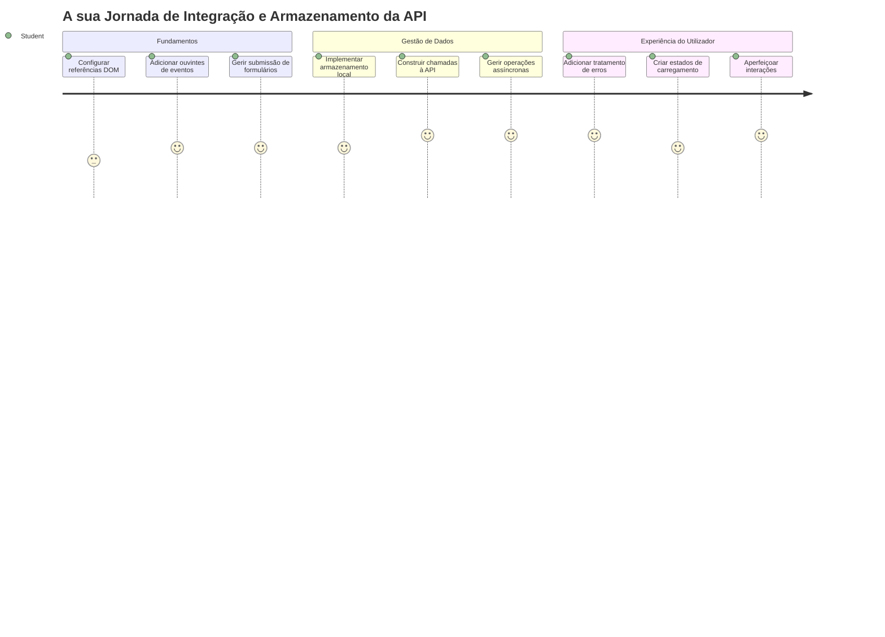
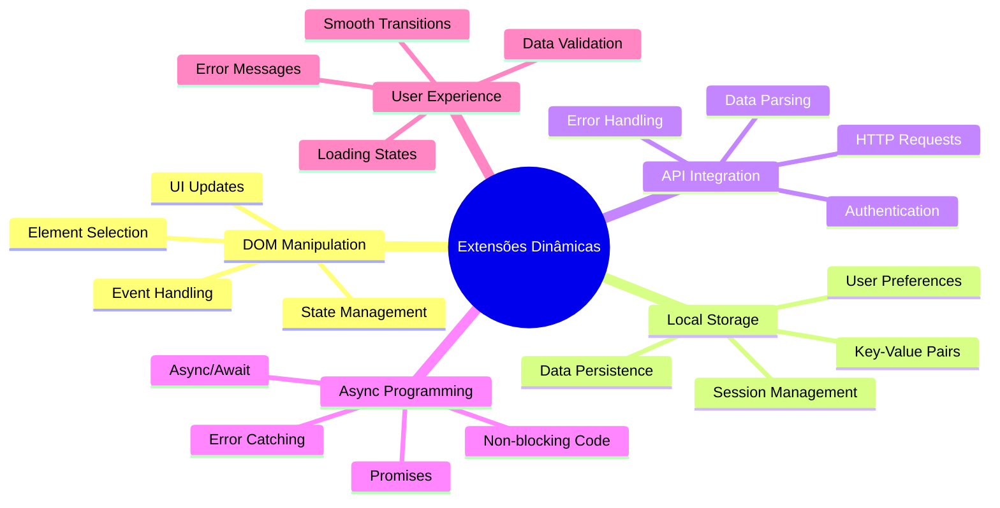
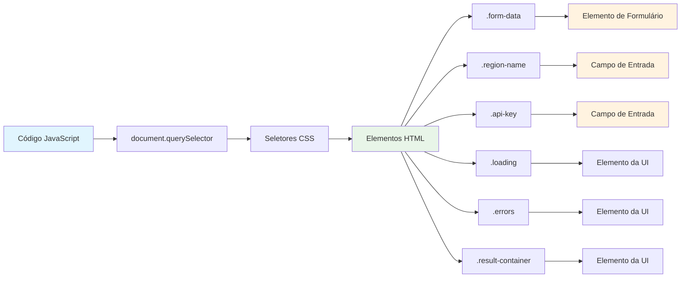
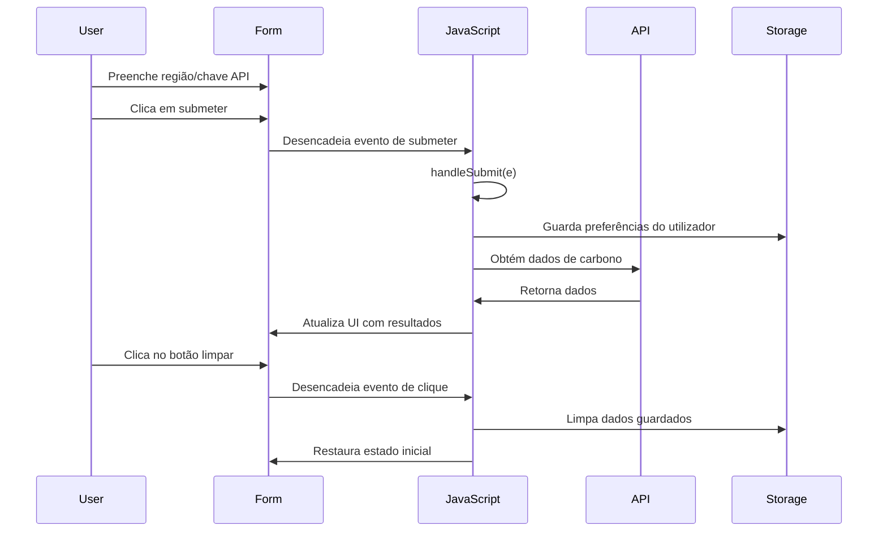
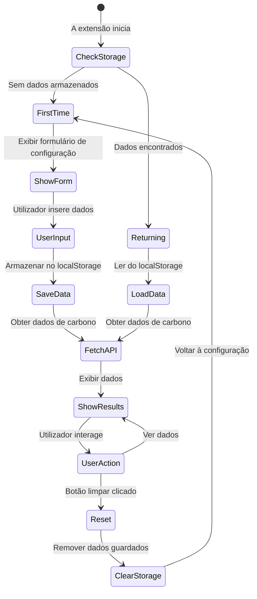
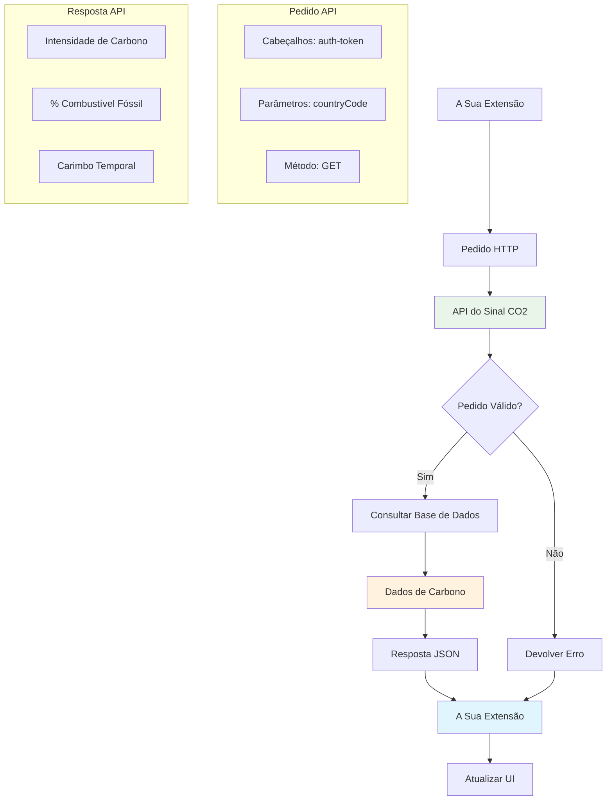
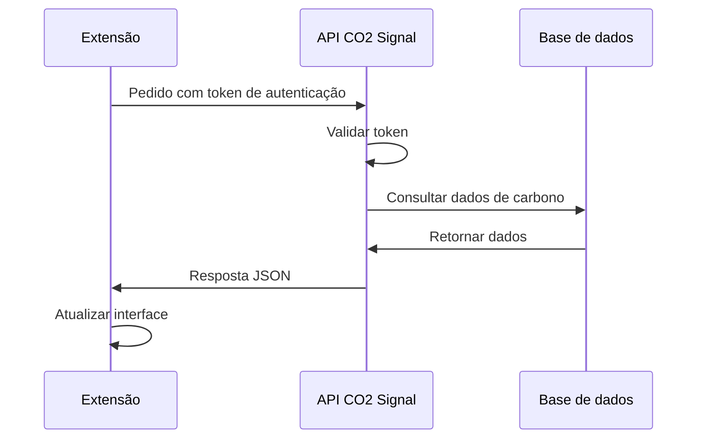
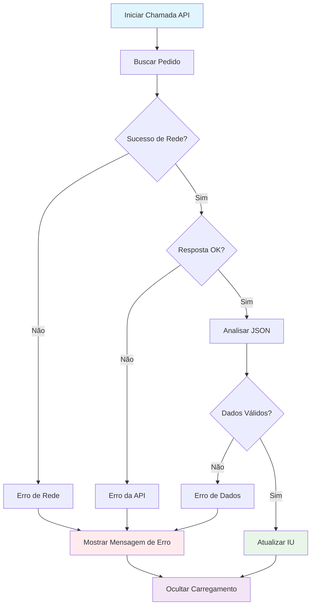
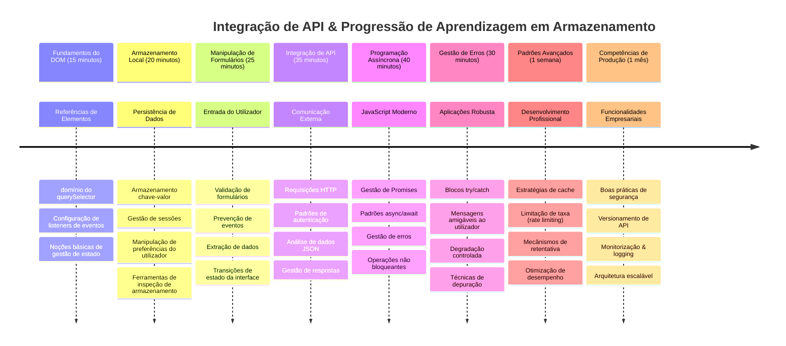

<!--
CO_OP_TRANSLATOR_METADATA:
{
  "original_hash": "2b6203a48c48d8234e0948353b47d84e",
  "translation_date": "2026-01-06T18:00:56+00:00",
  "source_file": "5-browser-extension/2-forms-browsers-local-storage/README.md",
  "language_code": "pt"
}
-->
# Browser Extension Project Parte 2: Chamar uma API, usar Armazenamento Local


## Questionário Pré-Aula

[Questionário pré-aula](https://ff-quizzes.netlify.app/web/quiz/25)

## Introdução

Lembras da extensão do navegador que começaste a construir? Neste momento tens um formulário com um aspeto agradável, mas que é essencialmente estático. Hoje vamos dar-lhe vida ligando-o a dados reais e dando-lhe memória.

Pensa nos computadores de controlo da missão Apollo — eles não mostravam apenas informação fixa. Comunicavam constantemente com as naves espaciais, atualizavam-se com dados de telemetria e guardavam parâmetros críticos da missão. É esse tipo de comportamento dinâmico que estamos a construir hoje. A tua extensão vai acessar a internet, buscar dados ambientais reais e lembrar as tuas definições para a próxima vez.

A integração com APIs pode parecer complexa, mas é basicamente ensinar o teu código a comunicar com outros serviços. Quer estejas a obter dados meteorológicos, feeds de redes sociais ou informação sobre pegada de carbono como vamos fazer hoje, trata-se de estabelecer estas ligações digitais. Vamos também explorar como os navegadores podem persistir informação — tal como as bibliotecas usavam catálogos em fichas para lembrar onde os livros pertenciam.

No fim desta lição, terás uma extensão de navegador que obtém dados reais, armazena preferências do utilizador e proporciona uma experiência fluida. Vamos começar!


✅ Segue os segmentos numerados nos ficheiros apropriados para saber onde colocar o teu código

## Configura os elementos a manipular na extensão

Antes do teu JavaScript poder manipular a interface, precisa de referências para elementos HTML específicos. Pensa nisso como um telescópio que tem de ser apontado para estrelas específicas — antes de Galileo poder estudar as luas de Júpiter, teve de localizar e focar em Júpiter propriamente dito.

No teu ficheiro `index.js`, vamos criar variáveis `const` que capturam referências a cada elemento importante do formulário. Isto é semelhante a como os cientistas etiquetam o seu equipamento — em vez de procurarem por todo o laboratório a cada vez, acessam diretamente o que precisam.


```javascript
// campos do formulário
const form = document.querySelector('.form-data');
const region = document.querySelector('.region-name');
const apiKey = document.querySelector('.api-key');

// resultados
const errors = document.querySelector('.errors');
const loading = document.querySelector('.loading');
const results = document.querySelector('.result-container');
const usage = document.querySelector('.carbon-usage');
const fossilfuel = document.querySelector('.fossil-fuel');
const myregion = document.querySelector('.my-region');
const clearBtn = document.querySelector('.clear-btn');
```

**Isto é o que este código faz:**
- **Captura** elementos do formulário usando `document.querySelector()` com seletores de classes CSS
- **Cria** referências para os campos de input do nome da região e chave da API
- **Estabelece** conexões aos elementos de resultado para dados de uso de carbono
- **Configura** acesso a elementos UI como indicadores de carregamento e mensagens de erro
- **Armazena** cada referência de elemento numa variável `const` para fácil reutilização no código

## Adiciona event listeners

Agora vamos fazer a tua extensão responder às ações do utilizador. Event listeners são a forma do teu código monitorizar interações do utilizador. Pensa neles como operadores nas antigas centrais telefónicas — ouviam chamadas que entravam e ligavam os circuitos certos quando alguém queria fazer uma chamada.


```javascript
form.addEventListener('submit', (e) => handleSubmit(e));
clearBtn.addEventListener('click', (e) => reset(e));
init();
```

**Compreendendo estes conceitos:**
- **Anexa** um listener de submit ao formulário, que dispara quando os utilizadores pressionam Enter ou clicam em submit
- **Liga** um listener de click ao botão limpar para reiniciar o formulário
- **Passa** o objeto evento `(e)` às funções manipuladoras para controlo adicional
- **Chama** a função `init()` imediatamente para configurar o estado inicial da extensão

✅ Repara na sintaxe abreviada da arrow function utilizada aqui. Esta abordagem moderna em JavaScript é mais limpa que as expressões de função tradicionais, mas ambas funcionam igualmente bem!

### 🔄 **Revisão Pedagógica**
**Compreensão de Manipulação de Eventos**: Antes de avançar para a inicialização, assegura que podes:
- ✅ Explicar como o `addEventListener` liga ações do utilizador a funções JavaScript
- ✅ Entender por que passamos o objeto evento `(e)` às funções manipuladoras
- ✅ Reconhecer a diferença entre eventos `submit` e `click`
- ✅ Descrever quando a função `init()` corre e porquê

**Auto-teste Rápido**: O que aconteceria se esquecesses `e.preventDefault()` numa submissão de formulário?
*Resposta: A página recarregaria, perdendo todo o estado JavaScript e interrompendo a experiência do utilizador*

## Cria as funções de inicialização e reinício

Vamos criar a lógica de inicialização para a tua extensão. A função `init()` é como o sistema de navegação de um navio a verificar os seus instrumentos — determina o estado atual e ajusta a interface em conformidade. Verifica se alguém já usou a tua extensão antes e carrega as definições anteriores.

A função `reset()` oferece aos utilizadores um novo começo — semelhante a como cientistas reiniciam os seus instrumentos entre experiências para garantir dados limpos.

```javascript
function init() {
	// Verificar se o utilizador já guardou credenciais da API anteriormente
	const storedApiKey = localStorage.getItem('apiKey');
	const storedRegion = localStorage.getItem('regionName');

	// Definir o ícone da extensão para verde genérico (marcador de posição para a próxima lição)
	// TODO: Implementar atualização do ícone na próxima lição

	if (storedApiKey === null || storedRegion === null) {
		// Utilizador de primeira vez: mostrar o formulário de configuração
		form.style.display = 'block';
		results.style.display = 'none';
		loading.style.display = 'none';
		clearBtn.style.display = 'none';
		errors.textContent = '';
	} else {
		// Utilizador recorrente: carregar automaticamente os seus dados guardados
		displayCarbonUsage(storedApiKey, storedRegion);
		results.style.display = 'none';
		form.style.display = 'none';
		clearBtn.style.display = 'block';
	}
}

function reset(e) {
	e.preventDefault();
	// Limpar a região armazenada para permitir que o utilizador escolha uma nova localização
	localStorage.removeItem('regionName');
	// Reiniciar o processo de inicialização
	init();
}
```

**Quebras do que acontece aqui:**
- **Recupera** a chave API armazenada e a região do armazenamento local do navegador
- **Verifica** se é a primeira utilização (sem credenciais guardadas) ou um utilizador que regressa
- **Mostra** o formulário de configuração para novos utilizadores e esconde outros elementos da interface
- **Carrega** os dados guardados automaticamente para utilizadores que regressam e exibe a opção de reinício
- **Gere** o estado da interface baseada nos dados disponíveis

**Conceitos chave sobre Armazenamento Local:**
- **Persiste** dados entre sessões do navegador (ao contrário do session storage)
- **Armazena** dados como pares chave-valor usando `getItem()` e `setItem()`
- **Devolve** `null` quando não há dados para dada chave
- **Fornece** uma forma simples de lembrar preferências e definições do utilizador

> 💡 **Compreender o Armazenamento do Navegador**: [LocalStorage](https://developer.mozilla.org/docs/Web/API/Window/localStorage) é como dar à tua extensão uma memória persistente. Considera como a antiga Biblioteca de Alexandria armazenava rolos de papiro — a informação permanecia disponível mesmo quando os estudiosos saíam e regressavam.
>
> **Características-chave:**
> - **Persiste** os dados mesmo após fechar o navegador
> - **Sobrevive** a reinícios do computador e falhas do navegador
> - **Fornece** espaço de armazenamento substancial para preferências do utilizador
> - **Oferece** acesso instantâneo sem atrasos de rede

> **Nota Importante**: A tua extensão do navegador tem o seu próprio armazenamento local isolado, separado das páginas web normais. Isto oferece segurança e evita conflitos com outros sites.

Podes ver os teus dados armazenados abrindo as Ferramentas de Desenvolvimento do navegador (F12), navegando até ao separador **Application**, e expandindo a secção **Local Storage**.




> ⚠️ **Consideração de Segurança**: Em aplicações de produção, armazenar chaves API no LocalStorage implica riscos de segurança, pois o JavaScript pode aceder a estes dados. Para fins de aprendizagem, esta abordagem funciona bem, mas aplicações reais devem usar armazenamento seguro do lado do servidor para credenciais sensíveis.

## Trata a submissão do formulário

Agora vamos tratar o que acontece quando alguém submete o teu formulário. Por padrão, os navegadores recarregam a página quando os formulários são submetidos, mas vamos interceptar este comportamento para criar uma experiência mais suave.

Esta abordagem espelha como o controlo de missão trata as comunicações com a nave espacial — em vez de reiniciar todo o sistema para cada transmissão, mantêm a operação contínua enquanto processam informação nova.

Cria uma função que captura o evento de submissão do formulário e extrai a entrada do utilizador:

```javascript
function handleSubmit(e) {
	e.preventDefault();
	setUpUser(apiKey.value, region.value);
}
```

**No código acima, fizemos:**
- **Prevenir** o comportamento padrão de submissão do formulário que recarregaria a página
- **Extrair** os valores da entrada do utilizador nos campos da chave API e região
- **Passar** os dados do formulário para a função `setUpUser()` para processamento
- **Manter** o comportamento de aplicação single-page evitando recarregamentos de página

✅ Lembra que os teus campos do formulário HTML incluem o atributo `required`, por isso o navegador valida automaticamente que os utilizadores fornecem tanto a chave API como a região antes desta função correr.

## Configura as preferências do utilizador

A função `setUpUser` é responsável por guardar as credenciais do utilizador e iniciar a primeira chamada à API. Isto cria uma transição suave desde a configuração até à apresentação dos resultados.

```javascript
function setUpUser(apiKey, regionName) {
	// Guardar credenciais do utilizador para sessões futuras
	localStorage.setItem('apiKey', apiKey);
	localStorage.setItem('regionName', regionName);
	
	// Atualizar a interface para mostrar estado de carregamento
	loading.style.display = 'block';
	errors.textContent = '';
	clearBtn.style.display = 'block';
	
	// Obter dados de uso de carbono com as credenciais do utilizador
	displayCarbonUsage(apiKey, regionName);
}
```

**Passo a passo, isto é o que acontece:**
- **Guarda** a chave API e o nome da região no armazenamento local para uso futuro
- **Mostra** um indicador de carregamento para informar os utilizadores que os dados estão a ser obtidos
- **Limpa** quaisquer mensagens de erro anteriores do ecrã
- **Revela** o botão limpar para que os utilizadores possam reiniciar as definições depois
- **Inicia** a chamada à API para obter dados reais de uso de carbono

Esta função cria uma experiência de utilizador lisa ao gerir tanto a persistência dos dados como as atualizações da interface numa ação coordenada.

## Apresenta os dados de uso de carbono

Agora vamos ligar a tua extensão a fontes de dados externas através de APIs. Isto transforma a tua extensão de uma ferramenta autónoma para algo que pode aceder a informação em tempo real de toda a internet.

**Compreendendo APIs**

[APIs](https://www.webopedia.com/TERM/A/API.html) são como diferentes aplicações comunicam entre si. Pensa nelas como o sistema de telégrafo que ligava cidades distantes no século XIX — os operadores enviavam pedidos para estações remotas e recebiam respostas com a informação solicitada. Cada vez que verificas redes sociais, perguntas algo a um assistente de voz, ou usas uma app de entregas, as APIs estão a facilitar estas trocas de dados.


**Conceitos chave sobre APIs REST:**
- **REST** significa 'Representational State Transfer'
- **Usa** métodos padrões HTTP (GET, POST, PUT, DELETE) para interagir com dados
- **Devolve** dados em formatos previsíveis, tipicamente JSON
- **Fornece** endpoints consistentes baseados em URL para diferentes tipos de pedidos

✅ A [API CO2 Signal](https://www.co2signal.com/) que usamos fornece dados em tempo real sobre intensidade de carbono das redes elétricas mundiais. Isto ajuda os utilizadores a entender o impacto ambiental do seu consumo de eletricidade!

> 💡 **Compreendendo o JavaScript Assíncrono**: A [`async` keyword](https://developer.mozilla.org/docs/Web/JavaScript/Reference/Statements/async_function) permite ao teu código tratar várias operações simultaneamente. Quando pedes dados a um servidor, não queres que toda a tua extensão congele — isso seria como o controlo de tráfego aéreo parar todas as operações à espera que um avião responda.
>
> **Benefícios principais:**
> - **Mantém** a resposta da extensão enquanto dados carregam
> - **Permite** que outro código continue a correr durante pedidos de rede
> - **Melhora** a legibilidade do código comparado com padrões tradicionais de callback
> - **Facilita** o tratamento elegante de erros de rede

Aqui está um vídeo rápido sobre `async`:

[](https://youtube.com/watch?v=YwmlRkrxvkk "Async and Await para gerir promessas")

> 🎥 Clica na imagem acima para um vídeo sobre async/await.

### 🔄 **Revisão Pedagógica**
**Compreensão de Programação Assíncrona**: Antes de mergulhar na função API, verifica que entendes:
- ✅ Por que usamos `async/await` em vez de bloquear toda a extensão
- ✅ Como blocos `try/catch` lidam graciosamente com erros de rede
- ✅ A diferença entre operações síncronas e assíncronas
- ✅ Por que chamadas API podem falhar e como tratar essas falhas

**Ligação ao Mundo Real**: Considera estes exemplos assíncronos do dia a dia:
- **Encomendar comida**: Não esperas junto da cozinha — recebes o recibo e continuas outras atividades
- **Enviar emails**: A tua app de email não congela a enviar — podes compor mais emails
- **Carregar páginas web**: As imagens carregam progressivamente enquanto já podes ler o texto

**Fluxo de Autenticação API**:

Cria a função para obter e mostrar os dados de uso de carbono:

```javascript
// Abordagem moderna da API fetch (não são necessárias dependências externas)
async function displayCarbonUsage(apiKey, region) {
	try {
		// Obter dados de intensidade de carbono da API CO2 Signal
		const response = await fetch('https://api.co2signal.com/v1/latest', {
			method: 'GET',
			headers: {
				'auth-token': apiKey,
				'Content-Type': 'application/json'
			},
			// Adicionar parâmetros de consulta para a região específica
			...new URLSearchParams({ countryCode: region }) && {
				url: `https://api.co2signal.com/v1/latest?countryCode=${region}`
			}
		});

		// Verificar se a requisição à API foi bem-sucedida
		if (!response.ok) {
			throw new Error(`API request failed: ${response.status}`);
		}

		const data = await response.json();
		const carbonData = data.data;

		// Calcular o valor arredondado da intensidade de carbono
		const carbonIntensity = Math.round(carbonData.carbonIntensity);

		// Atualizar a interface do utilizador com os dados obtidos
		loading.style.display = 'none';
		form.style.display = 'none';
		myregion.textContent = region.toUpperCase();
		usage.textContent = `${carbonIntensity} grams (grams CO₂ emitted per kilowatt hour)`;
		fossilfuel.textContent = `${carbonData.fossilFuelPercentage.toFixed(2)}% (percentage of fossil fuels used to generate electricity)`;
		results.style.display = 'block';

		// TODO: calculateColor(carbonIntensity) - implementar na próxima aula

	} catch (error) {
		console.error('Error fetching carbon data:', error);
		
		// Mostrar mensagem de erro amigável ao utilizador
		loading.style.display = 'none';
		results.style.display = 'none';
		errors.textContent = 'Sorry, we couldn\'t fetch data for that region. Please check your API key and region code.';
	}
}
```

**Análise do que acontece aqui:**
- **Usa** a API `fetch()` moderna em vez de bibliotecas externas como Axios para código mais limpo e sem dependências
- **Implementa** verificação adequada de erros com `response.ok` para capturar falhas na API cedo
- **Lida** com operações assíncronas com `async/await` para maior legibilidade do fluxo de código
- **Autentica** com a API CO2 Signal usando o cabeçalho `auth-token`
- **Analisa** os dados JSON da resposta e extrai informações sobre intensidade de carbono
- **Atualiza** múltiplos elementos da UI com dados ambientais formatados
- **Fornece** mensagens de erro amigáveis ao utilizador quando as chamadas à API falham

**Conceitos modernos de JavaScript demonstrados:**
- **Template literals** com sintaxe `${}` para formatação limpa de strings
- **Tratamento de erros** com blocos try/catch para aplicações robustas
- **Padrão async/await** para lidar elegantemente com pedidos de rede
- **Desestruturação de objetos** para extrair dados específicos das respostas API
- **Encadeamento de métodos** para múltiplas manipulações do DOM

✅ Esta função demonstra vários conceitos importantes de desenvolvimento web — comunicar com servidores externos, tratar autenticação, processar dados, atualizar interfaces e gerir erros graciosamente. São competências fundamentais usadas regularmente por desenvolvedores profissionais.


### 🔄 **Revisão Pedagógica**
**Compreensão Completa do Sistema**: Confirma a tua maestria de todo o fluxo:
- ✅ Como referências DOM permitem ao JavaScript controlar a interface
- ✅ Por que o armazenamento local cria persistência entre sessões do navegador
- ✅ Como async/await faz chamadas API sem congelar a extensão
- ✅ O que acontece quando as chamadas API falham e como os erros são tratados
- ✅ Por que a experiência do utilizador inclui estados de carregamento e mensagens de erro

🎉 **O que alcançaste:** Criaste uma extensão de navegador que:
- **Se liga** à internet e obtém dados ambientais reais
- **Persiste** definições do utilizador entre sessões
- **Lida** com erros graciosamente em vez de travar
- **Proporciona** uma experiência suave e profissional

Testa o teu trabalho executando `npm run build` e atualizando a tua extensão no navegador. Agora tens um rastreador funcional da pegada de carbono. A próxima lição vai adicionar funcionalidade dinâmica ao ícone para completar a extensão.

---

## Desafio GitHub Copilot Agent 🚀

Usa o modo Agent para completar o desafio seguinte:
**Descrição:** Melhore a extensão do navegador adicionando melhorias na gestão de erros e funcionalidades para a experiência do utilizador. Este desafio vai ajudá-lo a praticar o trabalho com APIs, armazenamento local e manipulação do DOM usando padrões modernos de JavaScript.

**Prompt:** Crie uma versão melhorada da função displayCarbonUsage que inclua: 1) Um mecanismo de repetição para chamadas API falhadas com retrocesso exponencial, 2) Validação da entrada do código da região antes de fazer a chamada API, 3) Uma animação de carregamento com indicadores de progresso, 4) Cache das respostas da API no localStorage com timestamps de expiração (cache por 30 minutos), e 5) Uma funcionalidade para mostrar dados históricos de chamadas API anteriores. Adicione também comentários JSDoc no estilo TypeScript para documentar todos os parâmetros da função e tipos de retorno.

Saiba mais sobre o [modo agente](https://code.visualstudio.com/blogs/2025/02/24/introducing-copilot-agent-mode) aqui.

## 🚀 Desafio

Expanda o seu conhecimento sobre APIs explorando a riqueza das APIs baseadas no navegador disponíveis para desenvolvimento web. Escolha uma destas APIs do navegador e construa uma pequena demonstração:

- [Geolocation API](https://developer.mozilla.org/docs/Web/API/Geolocation_API) - Obtenha a localização atual do utilizador
- [Notification API](https://developer.mozilla.org/docs/Web/API/Notifications_API) - Envie notificações para o ambiente de trabalho
- [HTML Drag and Drop API](https://developer.mozilla.org/docs/Web/API/HTML_Drag_and_Drop_API) - Crie interfaces de arrastar interativas
- [Web Storage API](https://developer.mozilla.org/docs/Web/API/Web_Storage_API) - Técnicas avançadas de armazenamento local
- [Fetch API](https://developer.mozilla.org/docs/Web/API/Fetch_API) - Alternativa moderna ao XMLHttpRequest

**Questões de pesquisa a considerar:**
- Que problemas do mundo real esta API resolve?
- Como a API lida com erros e casos extremos?
- Que considerações de segurança existem ao usar esta API?
- Quão amplamente suportada está esta API entre diferentes navegadores?

Após a sua pesquisa, identifique que características tornam uma API amiga do programador e fiável.

## Quiz Pós-Aula

[Quiz pós-aula](https://ff-quizzes.netlify.app/web/quiz/26)

## Revisão & Autoestudo

Aprendeu sobre LocalStorage e APIs nesta lição, ambos muito úteis para o programador web profissional. Pode pensar em como estas duas coisas funcionam em conjunto? Pense em como arquitetaria um site que armazenasse itens para serem usados por uma API.

### ⚡ **O que pode fazer nos próximos 5 minutos**
- [ ] Abra a aba Aplicação das Ferramentas de Desenvolvimento e explore o localStorage em qualquer site
- [ ] Crie um formulário HTML simples e teste a validação do formulário no navegador
- [ ] Experimente armazenar e recuperar dados usando localStorage na consola do navegador
- [ ] Inspecione os dados do formulário enviados usando a aba Rede

### 🎯 **O que pode concretizar nesta hora**
- [ ] Complete o quiz pós-licção e compreenda os conceitos de tratamento de formulários
- [ ] Construa um formulário de extensão do navegador que guarde preferências do utilizador
- [ ] Implemente validação de formulário do lado do cliente com mensagens de erro úteis
- [ ] Pratique o uso da API chrome.storage para persistência de dados da extensão
- [ ] Crie uma interface utilizador que responda às definições guardadas do utilizador

### 📅 **A sua construção de extensão de navegador ao longo da semana**
- [ ] Complete uma extensão de navegador com funcionalidades completas de formulário
- [ ] Domine diferentes opções de armazenamento: local, sincronizado e sessão
- [ ] Implemente funcionalidades avançadas do formulário como preenchimento automático e validação
- [ ] Adicione funcionalidades de importação/exportação para dados do utilizador
- [ ] Teste a sua extensão cuidadosamente em diferentes navegadores
- [ ] Aprimore a experiência do utilizador e gestão de erros da sua extensão

### 🌟 **O seu domínio das APIs Web ao longo do mês**
- [ ] Construa aplicações complexas usando várias APIs de armazenamento do navegador
- [ ] Aprenda padrões de desenvolvimento offline-primeiro
- [ ] Contribua para projetos open source envolvendo persistência de dados
- [ ] Domine desenvolvimento focado em privacidade e conformidade GDPR
- [ ] Crie bibliotecas reutilizáveis para tratamento de formulários e gestão de dados
- [ ] Partilhe conhecimento sobre APIs web e desenvolvimento de extensões

## 🎯 O seu cronograma para dominar o desenvolvimento de extensões


### 🛠️ Resumo da sua caixa de ferramentas de desenvolvimento Full-Stack

Após concluir esta lição, agora tem:
- **Domínio do DOM**: Precisão na seleção e manipulação de elementos
- **Especialização em Armazenamento**: Gestão persistente de dados com localStorage
- **Integração de API**: Busca de dados em tempo real e autenticação
- **Programação Assíncrona**: Operações não bloqueantes com JavaScript moderno
- **Gestão de Erros**: Aplicações robustas que tratam falhas com elegância
- **Experiência do Utilizador**: Estados de carregamento, validação e interações fluidas
- **Padrões Modernos**: fetch API, async/await e funcionalidades ES6+

**Competências Profissionais Obtidas**: Implementou padrões usados em:
- **Aplicações Web**: Apps de página única com fontes externas de dados
- **Desenvolvimento Mobile**: Apps orientadas por API com capacidades offline
- **Software Desktop**: Apps Electron com armazenamento persistente
- **Sistemas Empresariais**: Autenticação, cache e tratamento de erros
- **Frameworks Modernos**: Padrões de gestão de dados em React/Vue/Angular

**Próximo Nível**: Está pronto para explorar tópicos avançados como estratégias de cache, conexões WebSocket em tempo real, ou gestão complexa de estado!

## Trabalho

[Adotar uma API](assignment.md)

---

<!-- CO-OP TRANSLATOR DISCLAIMER START -->
**Aviso Legal**:
Este documento foi traduzido utilizando o serviço de tradução por IA [Co-op Translator](https://github.com/Azure/co-op-translator). Embora nos esforcemos pela precisão, tenha em atenção que traduções automáticas podem conter erros ou imprecisões. O documento original na sua língua nativa deve ser considerado a fonte autorizada. Para informações críticas, recomenda-se tradução profissional humana. Não nos responsabilizamos por quaisquer mal-entendidos ou interpretações erradas decorrentes do uso desta tradução.
<!-- CO-OP TRANSLATOR DISCLAIMER END -->