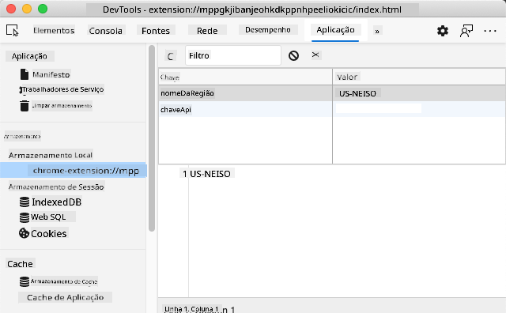

<!--
CO_OP_TRANSLATOR_METADATA:
{
  "original_hash": "a7587943d38d095de8613e1b508609f5",
  "translation_date": "2025-08-29T16:12:02+00:00",
  "source_file": "5-browser-extension/2-forms-browsers-local-storage/README.md",
  "language_code": "pt"
}
-->
# Projeto de Extensão de Navegador Parte 2: Chamar uma API, usar Local Storage

## Questionário Pré-Aula

[Questionário pré-aula](https://ff-quizzes.netlify.app/web/quiz/25)

### Introdução

Nesta lição, vais chamar uma API ao submeter o formulário da tua extensão de navegador e exibir os resultados na extensão. Além disso, vais aprender como armazenar dados no armazenamento local do navegador para referência e uso futuro.

✅ Segue os segmentos numerados nos ficheiros apropriados para saber onde colocar o teu código.

### Configurar os elementos para manipular na extensão:

Até agora, já construíste o HTML para o formulário e a `<div>` de resultados da tua extensão de navegador. A partir de agora, vais precisar trabalhar no ficheiro `/src/index.js` e construir a tua extensão passo a passo. Consulta a [lição anterior](../1-about-browsers/README.md) para configurar o teu projeto e o processo de build.

Trabalhando no ficheiro `index.js`, começa por criar algumas variáveis `const` para armazenar os valores associados a vários campos:

```JavaScript
// form fields
const form = document.querySelector('.form-data');
const region = document.querySelector('.region-name');
const apiKey = document.querySelector('.api-key');

// results
const errors = document.querySelector('.errors');
const loading = document.querySelector('.loading');
const results = document.querySelector('.result-container');
const usage = document.querySelector('.carbon-usage');
const fossilfuel = document.querySelector('.fossil-fuel');
const myregion = document.querySelector('.my-region');
const clearBtn = document.querySelector('.clear-btn');
```

Todos estes campos são referenciados pelas suas classes CSS, conforme configuraste no HTML na lição anterior.

### Adicionar listeners

A seguir, adiciona event listeners ao formulário e ao botão de limpar que reinicia o formulário, para que, se um utilizador submeter o formulário ou clicar no botão de reiniciar, algo aconteça. Adiciona também a chamada para inicializar a aplicação no final do ficheiro:

```JavaScript
form.addEventListener('submit', (e) => handleSubmit(e));
clearBtn.addEventListener('click', (e) => reset(e));
init();
```

✅ Repara na forma abreviada usada para ouvir eventos de submissão ou clique, e como o evento é passado para as funções handleSubmit ou reset. Consegues escrever o equivalente desta forma abreviada num formato mais longo? Qual preferes?

### Construir as funções init() e reset():

Agora vais construir a função que inicializa a extensão, chamada init():

```JavaScript
function init() {
	//if anything is in localStorage, pick it up
	const storedApiKey = localStorage.getItem('apiKey');
	const storedRegion = localStorage.getItem('regionName');

	//set icon to be generic green
	//todo

	if (storedApiKey === null || storedRegion === null) {
		//if we don't have the keys, show the form
		form.style.display = 'block';
		results.style.display = 'none';
		loading.style.display = 'none';
		clearBtn.style.display = 'none';
		errors.textContent = '';
	} else {
        //if we have saved keys/regions in localStorage, show results when they load
        displayCarbonUsage(storedApiKey, storedRegion);
		results.style.display = 'none';
		form.style.display = 'none';
		clearBtn.style.display = 'block';
	}
};

function reset(e) {
	e.preventDefault();
	//clear local storage for region only
	localStorage.removeItem('regionName');
	init();
}

```

Nesta função, há uma lógica interessante. Ao lê-la, consegues perceber o que acontece?

- São configuradas duas `const` para verificar se o utilizador armazenou uma APIKey e um código de região no armazenamento local.
- Se qualquer um deles for nulo, mostra o formulário alterando o seu estilo para 'block'.
- Esconde os resultados, o loading e o clearBtn, e define qualquer texto de erro como uma string vazia.
- Se existir uma chave e uma região, inicia uma rotina para:
  - chamar a API para obter dados de uso de carbono,
  - esconder a área de resultados,
  - esconder o formulário,
  - mostrar o botão de reiniciar.

Antes de avançar, é útil aprender sobre um conceito muito importante disponível nos navegadores: [LocalStorage](https://developer.mozilla.org/docs/Web/API/Window/localStorage). O LocalStorage é uma forma útil de armazenar strings no navegador como um par `key-value`. Este tipo de armazenamento web pode ser manipulado por JavaScript para gerir dados no navegador. O LocalStorage não expira, enquanto o SessionStorage, outro tipo de armazenamento web, é limpo quando o navegador é fechado. Os vários tipos de armazenamento têm prós e contras na sua utilização.

> Nota - a tua extensão de navegador tem o seu próprio armazenamento local; a janela principal do navegador é uma instância diferente e comporta-se separadamente.

Definiste a tua APIKey para ter um valor string, por exemplo, e podes ver que está configurada no Edge ao "inspecionar" uma página web (podes clicar com o botão direito no navegador para inspecionar) e ir ao separador Applications para ver o armazenamento.



✅ Pensa em situações onde NÃO seria adequado armazenar alguns dados no LocalStorage. Em geral, colocar API Keys no LocalStorage é uma má ideia! Consegues perceber porquê? No nosso caso, como a nossa aplicação é apenas para aprendizagem e não será publicada numa loja de aplicações, vamos usar este método.

Repara que usas a Web API para manipular o LocalStorage, seja com `getItem()`, `setItem()`, ou `removeItem()`. É amplamente suportado em vários navegadores.

Antes de construir a função `displayCarbonUsage()` que é chamada em `init()`, vamos construir a funcionalidade para lidar com a submissão inicial do formulário.

### Lidar com a submissão do formulário

Cria uma função chamada `handleSubmit` que aceita um argumento de evento `(e)`. Impede que o evento se propague (neste caso, queremos impedir que o navegador atualize) e chama uma nova função, `setUpUser`, passando os argumentos `apiKey.value` e `region.value`. Desta forma, usas os dois valores que são trazidos através do formulário inicial quando os campos apropriados são preenchidos.

```JavaScript
function handleSubmit(e) {
	e.preventDefault();
	setUpUser(apiKey.value, region.value);
}
```

✅ Refresca a tua memória - o HTML que configuraste na última lição tem dois campos de entrada cujos `values` são capturados através das `const` que configuraste no topo do ficheiro, e ambos são `required`, então o navegador impede os utilizadores de introduzirem valores nulos.

### Configurar o utilizador

Avançando para a função `setUpUser`, aqui é onde defines os valores de armazenamento local para apiKey e regionName. Adiciona uma nova função:

```JavaScript
function setUpUser(apiKey, regionName) {
	localStorage.setItem('apiKey', apiKey);
	localStorage.setItem('regionName', regionName);
	loading.style.display = 'block';
	errors.textContent = '';
	clearBtn.style.display = 'block';
	//make initial call
	displayCarbonUsage(apiKey, regionName);
}
```

Esta função define uma mensagem de loading para mostrar enquanto a API é chamada. Neste ponto, chegaste à criação da função mais importante desta extensão de navegador!

### Exibir Uso de Carbono

Finalmente, é hora de consultar a API!

Antes de avançar, devemos discutir APIs. APIs, ou [Interfaces de Programação de Aplicações](https://www.webopedia.com/TERM/A/API.html), são um elemento crítico na caixa de ferramentas de um programador web. Elas fornecem formas padrão para programas interagirem e se conectarem uns aos outros. Por exemplo, se estás a construir um site que precisa consultar uma base de dados, alguém pode ter criado uma API para usares. Embora existam muitos tipos de APIs, uma das mais populares é uma [API REST](https://www.smashingmagazine.com/2018/01/understanding-using-rest-api/).

✅ O termo 'REST' significa 'Transferência de Estado Representacional' e utiliza URLs configuradas de várias formas para obter dados. Faz uma pequena pesquisa sobre os vários tipos de APIs disponíveis para programadores. Que formato te parece mais interessante?

Há coisas importantes a notar sobre esta função. Primeiro, repara na palavra-chave [`async`](https://developer.mozilla.org/docs/Web/JavaScript/Reference/Statements/async_function). Escrever as tuas funções para que sejam assíncronas significa que elas esperam que uma ação, como o retorno de dados, seja concluída antes de continuar.

Aqui está um vídeo rápido sobre `async`:

[](https://youtube.com/watch?v=YwmlRkrxvkk "Async e Await para gerir promessas")

> 🎥 Clica na imagem acima para um vídeo sobre async/await.

Cria uma nova função para consultar a API C02Signal:

```JavaScript
import axios from '../node_modules/axios';

async function displayCarbonUsage(apiKey, region) {
	try {
		await axios
			.get('https://api.co2signal.com/v1/latest', {
				params: {
					countryCode: region,
				},
				headers: {
					'auth-token': apiKey,
				},
			})
			.then((response) => {
				let CO2 = Math.floor(response.data.data.carbonIntensity);

				//calculateColor(CO2);

				loading.style.display = 'none';
				form.style.display = 'none';
				myregion.textContent = region;
				usage.textContent =
					Math.round(response.data.data.carbonIntensity) + ' grams (grams C02 emitted per kilowatt hour)';
				fossilfuel.textContent =
					response.data.data.fossilFuelPercentage.toFixed(2) +
					'% (percentage of fossil fuels used to generate electricity)';
				results.style.display = 'block';
			});
	} catch (error) {
		console.log(error);
		loading.style.display = 'none';
		results.style.display = 'none';
		errors.textContent = 'Sorry, we have no data for the region you have requested.';
	}
}
```

Esta é uma função grande. O que está a acontecer aqui?

- Seguindo as melhores práticas, usas a palavra-chave `async` para fazer com que esta função se comporte de forma assíncrona. A função contém um bloco `try/catch`, pois retornará uma promessa quando a API devolver dados. Como não tens controlo sobre a velocidade com que a API responderá (ela pode nem responder!), precisas de lidar com esta incerteza chamando-a de forma assíncrona.
- Estás a consultar a API co2signal para obter os dados da tua região, usando a tua API Key. Para usar essa chave, precisas de usar um tipo de autenticação nos parâmetros do cabeçalho.
- Quando a API responde, atribuis vários elementos dos dados da resposta às partes do ecrã que configuraste para mostrar esses dados.
- Se houver um erro ou se não houver resultado, mostras uma mensagem de erro.

✅ Usar padrões de programação assíncrona é outra ferramenta muito útil na tua caixa de ferramentas. Lê [sobre as várias formas](https://developer.mozilla.org/docs/Web/JavaScript/Reference/Statements/async_function) de configurar este tipo de código.

Parabéns! Se construíres a tua extensão (`npm run build`) e a atualizares no painel de extensões, tens uma extensão funcional! A única coisa que não está a funcionar é o ícone, e vais corrigir isso na próxima lição.

---

## 🚀 Desafio

Discutimos vários tipos de API até agora nestas lições. Escolhe uma API web e pesquisa em profundidade o que ela oferece. Por exemplo, dá uma olhada nas APIs disponíveis nos navegadores, como a [HTML Drag and Drop API](https://developer.mozilla.org/docs/Web/API/HTML_Drag_and_Drop_API). O que faz uma API ser excelente na tua opinião?

## Questionário Pós-Aula

[Questionário pós-aula](https://ff-quizzes.netlify.app/web/quiz/26)

## Revisão & Autoestudo

Aprendeste sobre LocalStorage e APIs nesta lição, ambos muito úteis para o programador web profissional. Consegues pensar em como estas duas coisas funcionam juntas? Pensa em como arquitetarias um site que armazenasse itens para serem usados por uma API.

## Tarefa

[Adota uma API](assignment.md)

---

**Aviso Legal**:  
Este documento foi traduzido utilizando o serviço de tradução por IA [Co-op Translator](https://github.com/Azure/co-op-translator). Embora nos esforcemos para garantir a precisão, é importante notar que traduções automáticas podem conter erros ou imprecisões. O documento original na sua língua nativa deve ser considerado a fonte autoritária. Para informações críticas, recomenda-se a tradução profissional realizada por humanos. Não nos responsabilizamos por quaisquer mal-entendidos ou interpretações incorretas decorrentes da utilização desta tradução.