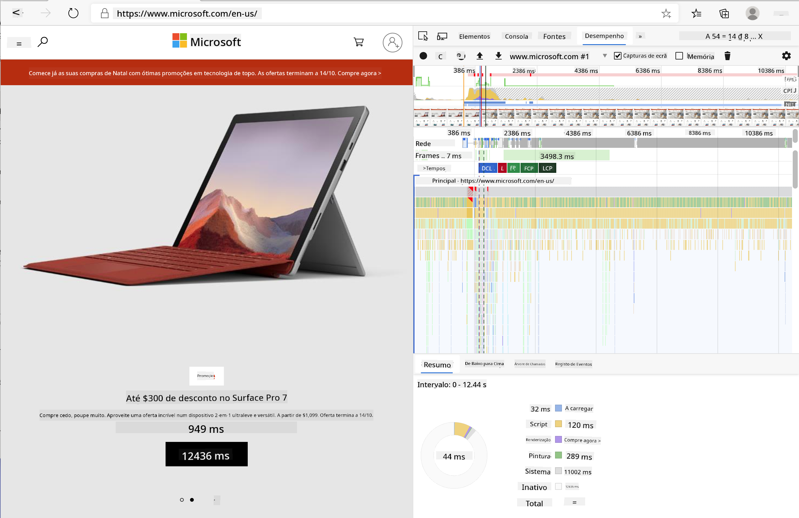
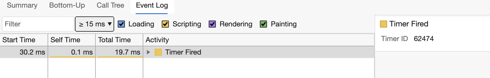

<!--
CO_OP_TRANSLATOR_METADATA:
{
  "original_hash": "49b58721a71cfda824e2f3e1f46908c6",
  "translation_date": "2025-08-29T16:11:08+00:00",
  "source_file": "5-browser-extension/3-background-tasks-and-performance/README.md",
  "language_code": "pt"
}
-->
# Projeto de Extensão de Navegador Parte 3: Aprender sobre Tarefas em Segundo Plano e Desempenho

## Questionário Pré-Aula

[Questionário pré-aula](https://ff-quizzes.netlify.app/web/quiz/27)

### Introdução

Nas duas últimas lições deste módulo, aprendeste a construir um formulário e uma área de exibição para dados obtidos de uma API. É uma forma bastante comum de criar uma presença na web. Também aprendeste a lidar com a obtenção de dados de forma assíncrona. A tua extensão de navegador está quase completa.

Resta gerir algumas tarefas em segundo plano, incluindo atualizar a cor do ícone da extensão. Este é um ótimo momento para falar sobre como o navegador gerencia este tipo de tarefa. Vamos pensar sobre estas tarefas do navegador no contexto do desempenho dos teus recursos web enquanto os desenvolves.

## Noções Básicas de Desempenho na Web

> "O desempenho de um site é sobre duas coisas: quão rápido a página carrega e quão rápido o código nela é executado." -- [Zack Grossbart](https://www.smashingmagazine.com/2012/06/javascript-profiling-chrome-developer-tools/)

O tema de como tornar os teus sites incrivelmente rápidos em todos os tipos de dispositivos, para todos os tipos de utilizadores, em todas as situações, é, sem surpresa, vasto. Aqui estão alguns pontos a ter em mente enquanto desenvolves um projeto web padrão ou uma extensão de navegador.

A primeira coisa que precisas de fazer para garantir que o teu site está a funcionar de forma eficiente é reunir dados sobre o seu desempenho. O primeiro lugar para fazer isso é nas ferramentas de desenvolvedor do teu navegador. No Edge, podes selecionar o botão "Definições e mais" (o ícone de três pontos no canto superior direito do navegador), depois navegar para Mais Ferramentas > Ferramentas de Desenvolvedor e abrir o separador de Desempenho. Também podes usar os atalhos de teclado `Ctrl` + `Shift` + `I` no Windows ou `Option` + `Command` + `I` no Mac para abrir as ferramentas de desenvolvedor.

O separador de Desempenho contém uma ferramenta de Perfil. Abre um site (experimenta, por exemplo, [https://www.microsoft.com](https://www.microsoft.com/?WT.mc_id=academic-77807-sagibbon)) e clica no botão 'Gravar', depois atualiza o site. Para a gravação a qualquer momento, e poderás ver as rotinas geradas para 'script', 'renderizar' e 'pintar' o site:



✅ Visita a [Documentação da Microsoft](https://docs.microsoft.com/microsoft-edge/devtools-guide/performance/?WT.mc_id=academic-77807-sagibbon) sobre o painel de Desempenho no Edge.

> Dica: para obter uma leitura precisa do tempo de inicialização do teu site, limpa a cache do navegador.

Seleciona elementos da linha do tempo do perfil para ampliar eventos que ocorrem enquanto a tua página carrega.

Obtém uma visão geral do desempenho da tua página ao selecionar uma parte da linha do tempo do perfil e olhar para o painel de resumo:


Verifica o painel de Registo de Eventos para ver se algum evento demorou mais de 15 ms:



✅ Familiariza-te com o teu profiler! Abre as ferramentas de desenvolvedor neste site e verifica se há algum gargalo. Qual é o recurso que carrega mais lentamente? E o mais rápido?

## Verificações de Perfil

De forma geral, há algumas "áreas problemáticas" que todo desenvolvedor web deve observar ao construir um site para evitar surpresas desagradáveis na hora de implementar em produção.

**Tamanhos de recursos**: A web tem ficado mais 'pesada' e, portanto, mais lenta nos últimos anos. Parte desse peso tem a ver com o uso de imagens.

✅ Dá uma olhada no [Internet Archive](https://httparchive.org/reports/page-weight) para uma visão histórica do peso das páginas e mais.

Uma boa prática é garantir que as tuas imagens estão otimizadas e entregues no tamanho e resolução certos para os teus utilizadores.

**Percursos no DOM**: O navegador precisa construir o seu Modelo de Objeto de Documento (DOM) com base no código que escreves, então é do interesse de um bom desempenho da página manter as tags mínimas, usando e estilizando apenas o que a página necessita. Por exemplo, estilos que precisam ser usados apenas numa página não precisam ser incluídos na folha de estilos principal.

**JavaScript**: Todo desenvolvedor de JavaScript deve observar scripts que bloqueiam a renderização e que precisam ser carregados antes que o restante do DOM possa ser percorrido e pintado no navegador. Considera usar `defer` com os teus scripts inline (como é feito no módulo Terrarium).

✅ Experimenta alguns sites num [site de teste de velocidade](https://www.webpagetest.org/) para aprender mais sobre as verificações comuns feitas para determinar o desempenho de um site.

Agora que tens uma ideia de como o navegador renderiza os recursos que envias para ele, vamos olhar para as últimas coisas que precisas fazer para completar a tua extensão:

### Criar uma função para calcular a cor

Trabalhando em `/src/index.js`, adiciona uma função chamada `calculateColor()` após a série de variáveis `const` que definiste para obter acesso ao DOM:

```JavaScript
function calculateColor(value) {
	let co2Scale = [0, 150, 600, 750, 800];
	let colors = ['#2AA364', '#F5EB4D', '#9E4229', '#381D02', '#381D02'];

	let closestNum = co2Scale.sort((a, b) => {
		return Math.abs(a - value) - Math.abs(b - value);
	})[0];
	console.log(value + ' is closest to ' + closestNum);
	let num = (element) => element > closestNum;
	let scaleIndex = co2Scale.findIndex(num);

	let closestColor = colors[scaleIndex];
	console.log(scaleIndex, closestColor);

	chrome.runtime.sendMessage({ action: 'updateIcon', value: { color: closestColor } });
}
```

O que está a acontecer aqui? Passas um valor (a intensidade de carbono) da chamada à API que completaste na última lição e, em seguida, calculas quão próximo o valor está do índice apresentado no array de cores. Depois, envias esse valor de cor mais próximo para o runtime do Chrome.

O chrome.runtime tem [uma API](https://developer.chrome.com/extensions/runtime) que lida com todos os tipos de tarefas em segundo plano, e a tua extensão está a aproveitar isso:

> "Usa a API chrome.runtime para recuperar a página de fundo, retornar detalhes sobre o manifesto e ouvir e responder a eventos no ciclo de vida da aplicação ou extensão. Também podes usar esta API para converter o caminho relativo de URLs em URLs totalmente qualificados."

✅ Se estás a desenvolver esta extensão de navegador para o Edge, pode surpreender-te que estás a usar uma API do Chrome. As versões mais recentes do navegador Edge funcionam com o motor de navegador Chromium, então podes aproveitar estas ferramentas.

> Nota: se quiseres fazer o perfil de uma extensão de navegador, abre as ferramentas de desenvolvedor dentro da própria extensão, pois ela é uma instância separada do navegador.

### Definir uma cor padrão para o ícone

Agora, na função `init()`, define o ícone para ser genericamente verde no início, chamando novamente a ação `updateIcon` do Chrome:

```JavaScript
chrome.runtime.sendMessage({
	action: 'updateIcon',
		value: {
			color: 'green',
		},
});
```

### Chamar a função e executar a chamada

Em seguida, chama a função que acabaste de criar ao adicioná-la à promessa retornada pela API C02Signal:

```JavaScript
//let CO2...
calculateColor(CO2);
```

E, finalmente, em `/dist/background.js`, adiciona o listener para estas chamadas de ações em segundo plano:

```JavaScript
chrome.runtime.onMessage.addListener(function (msg, sender, sendResponse) {
	if (msg.action === 'updateIcon') {
		chrome.browserAction.setIcon({ imageData: drawIcon(msg.value) });
	}
});
//borrowed from energy lollipop extension, nice feature!
function drawIcon(value) {
	let canvas = document.createElement('canvas');
	let context = canvas.getContext('2d');

	context.beginPath();
	context.fillStyle = value.color;
	context.arc(100, 100, 50, 0, 2 * Math.PI);
	context.fill();

	return context.getImageData(50, 50, 100, 100);
}
```

Neste código, estás a adicionar um listener para quaisquer mensagens que chegam ao gestor de tarefas em segundo plano. Se for chamado 'updateIcon', então o próximo código é executado para desenhar um ícone da cor apropriada usando a API Canvas.

✅ Vais aprender mais sobre a API Canvas nas [lições do Jogo Espacial](../../6-space-game/2-drawing-to-canvas/README.md).

Agora, reconstrói a tua extensão (`npm run build`), atualiza e lança a tua extensão, e observa a mudança de cor. É um bom momento para fazer uma pausa ou lavar a louça? Agora já sabes!

Parabéns, construíste uma extensão de navegador útil e aprendeste mais sobre como o navegador funciona e como fazer o perfil do seu desempenho.

---

## 🚀 Desafio

Investiga alguns sites de código aberto que existem há muito tempo e, com base no histórico do GitHub deles, vê se consegues determinar como foram otimizados ao longo dos anos para desempenho, se é que foram. Qual é o ponto problemático mais comum?

## Questionário Pós-Aula

[Questionário pós-aula](https://ff-quizzes.netlify.app/web/quiz/28)

## Revisão & Autoestudo

Considera inscrever-te numa [newsletter de desempenho](https://perf.email/).

Investiga algumas das formas como os navegadores avaliam o desempenho web ao explorar os separadores de desempenho nas suas ferramentas web. Encontras alguma diferença significativa?

## Tarefa

[Analisa um site para desempenho](assignment.md)

---

**Aviso Legal**:  
Este documento foi traduzido utilizando o serviço de tradução por IA [Co-op Translator](https://github.com/Azure/co-op-translator). Embora nos esforcemos para garantir a precisão, é importante ter em conta que traduções automáticas podem conter erros ou imprecisões. O documento original na sua língua nativa deve ser considerado a fonte autoritária. Para informações críticas, recomenda-se a tradução profissional realizada por humanos. Não nos responsabilizamos por quaisquer mal-entendidos ou interpretações incorretas decorrentes da utilização desta tradução.