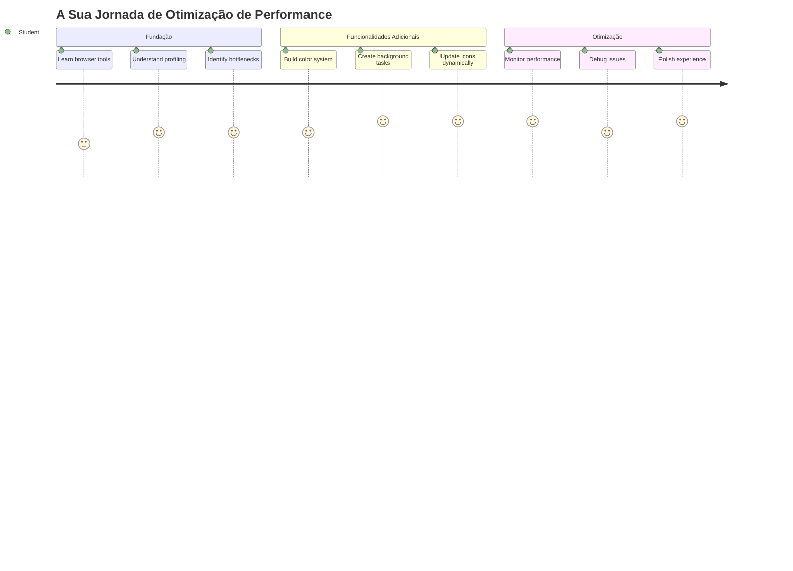
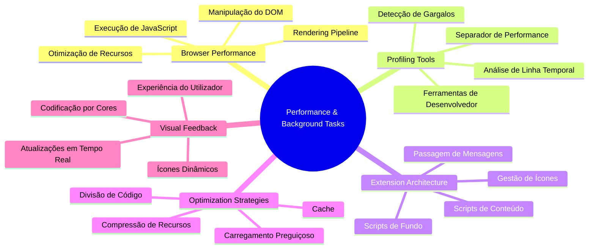
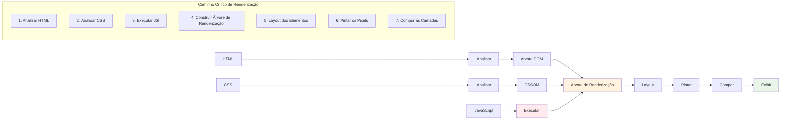
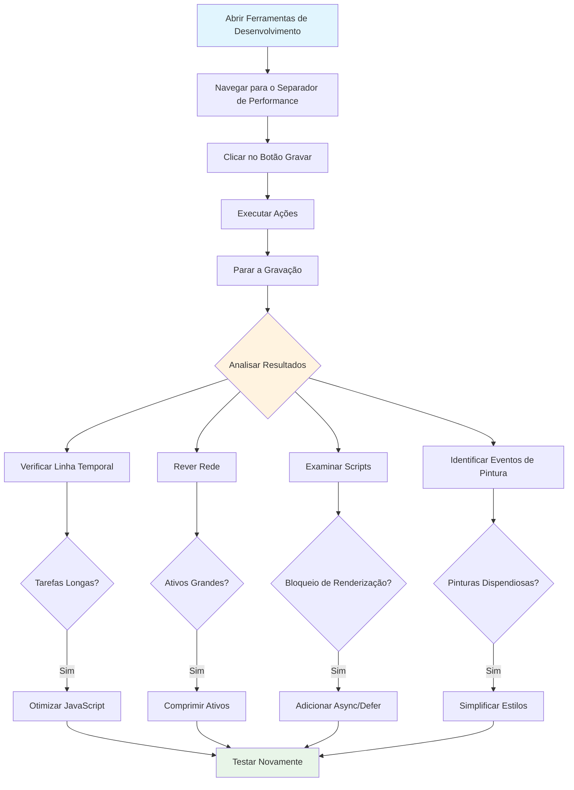
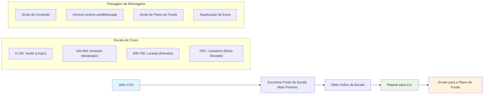
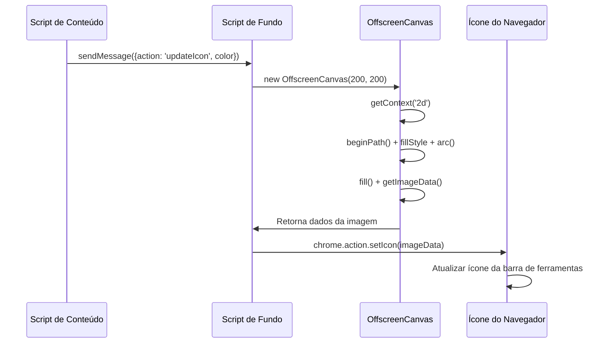
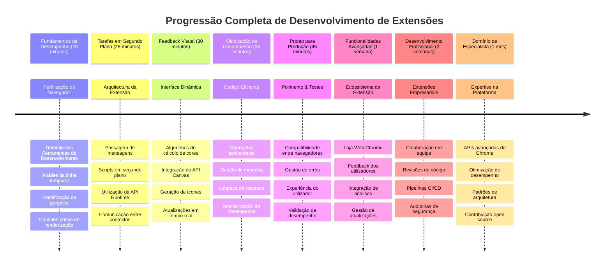

<!--
CO_OP_TRANSLATOR_METADATA:
{
  "original_hash": "b275fed2c6fc90d2b9b6661a3225faa2",
  "translation_date": "2026-01-06T18:03:12+00:00",
  "source_file": "5-browser-extension/3-background-tasks-and-performance/README.md",
  "language_code": "pt"
}
-->
# Projeto de Extensão de Navegador Parte 3: Aprenda sobre Tarefas em Segundo Plano e Performance


Já alguma vez se perguntou o que faz com que algumas extensões de navegador pareçam rápidas e responsivas enquanto outras parecem lentas? O segredo está no que acontece nos bastidores. Enquanto os utilizadores clicam na interface da sua extensão, há todo um mundo de processos em segundo plano a gerir silenciosamente a obtenção de dados, atualizações do ícone e recursos do sistema.

Esta é a nossa última lição na série de extensões de navegador, e vamos fazer com que o seu rastreador de pegada de carbono funcione sem problemas. Vai adicionar atualizações dinâmicas do ícone e aprender a identificar problemas de desempenho antes de se tornarem problemas graves. É como afinar um carro de corrida – pequenas otimizações podem fazer uma grande diferença na fluidez de tudo.

Ao terminar, terá uma extensão polida e compreenderá os princípios de desempenho que separam boas aplicações web das ótimas. Vamos mergulhar no mundo da otimização de navegadores.

## Questionário pré-lectura

[Questionário pré-lectura](https://ff-quizzes.netlify.app/web/quiz/27)

### Introdução

Nas nossas lições anteriores, construiu um formulário, ligou-o a uma API e enfrentou a obtenção assíncrona de dados. A sua extensão está a ganhar forma de forma agradável.

Agora precisamos de adicionar os retoques finais - como fazer com que o ícone da extensão mude de cor com base nos dados de carbono. Isto lembra-me de como a NASA teve de otimizar todos os sistemas na nave Apollo. Não podiam desperdiçar ciclos ou memória porque vidas dependiam do desempenho. Embora a nossa extensão de navegador não seja tão crítica, os mesmos princípios aplicam-se – código eficiente cria melhores experiências para os utilizadores.


## Noções básicas de desempenho web

Quando o seu código corre de forma eficiente, as pessoas conseguem realmente *sentir* a diferença. Sabe aquele momento em que uma página carrega instantaneamente ou uma animação corre suavemente? Isso é um bom desempenho a funcionar.

Desempenho não é apenas sobre velocidade – trata-se de criar experiências web que parecem naturais em vez de desajeitadas e frustrantes. Nos primórdios da computação, Grace Hopper mantinha um nanosegundo (um pedaço de fio com cerca de um pé de comprimento) na sua secretária para mostrar quão longe a luz viaja em um bilionésimo de segundo. Era a sua forma de explicar por que cada microssegundo é importante na computação. Vamos explorar as ferramentas de deteção que a ajudam a perceber o que está a atrasar as coisas.

> "O desempenho do website trata-se de duas coisas: quão rápido a página carrega, e quão rápido o código nela corre." -- [Zack Grossbart](https://www.smashingmagazine.com/2012/06/javascript-profiling-chrome-developer-tools/)

O tema de como tornar os seus websites incrivelmente rápidos em todo o tipo de dispositivos, para todo o tipo de utilizadores, em todo o tipo de situações, é, como esperado, vasto. Aqui estão alguns pontos a ter em conta ao construir um projeto web padrão ou uma extensão de navegador.

O primeiro passo para otimizar o seu site é compreender o que realmente se passa por trás da cortina. Felizmente, o seu navegador vem com poderosas ferramentas de deteção já incorporadas.


Para abrir as Ferramentas de Desenvolvimento no Edge, clique nos três pontos no canto superior direito, depois vá a Mais Ferramentas > Ferramentas de Desenvolvimento. Ou use o atalho de teclado: `Ctrl` + `Shift` + `I` no Windows ou `Option` + `Command` + `I` no Mac. Uma vez aí, clique no separador Performance – é aqui que fará a sua investigação.

**Aqui está o seu kit de ferramentas de deteção de desempenho:**
- **Abra** as Ferramentas de Desenvolvimento (vai usá-las constantemente como programador!)
- **Aceda** ao separador Performance – pense nele como o monitor de fitness da sua aplicação web
- **Carregue** no botão Gravar e observe a sua página em ação
- **Estude** os resultados para identificar o que está a atrasar as coisas

Vamos experimentar. Abra um website (o Microsoft.com funciona bem para isto) e clique no botão 'Gravar'. Agora recarregue a página e observe o perfilador capturar tudo o que acontece. Quando parar a gravação, verá uma descrição detalhada de como o navegador 'script', 'renderiza' e 'pinta' o site. Lembra-me de como o centro de controlo da missão monitoriza todos os sistemas durante o lançamento de um foguetão – obtém dados em tempo real exatamente sobre o que está a acontecer e quando.


✅ A [Documentação da Microsoft](https://docs.microsoft.com/microsoft-edge/devtools-guide/performance/?WT.mc_id=academic-77807-sagibbon) tem muitos mais detalhes se quiser aprofundar

> Dica profissional: Limpe a cache do navegador antes de testar para ver como o seu site funciona para visitantes pela primeira vez – normalmente é bastante diferente das visitas repetidas!

Selecione elementos da linha do tempo do perfil para ampliar eventos que acontecem enquanto a sua página carrega.

Obtenha um instantâneo do desempenho da sua página selecionando uma parte da linha do tempo do perfil e olhando para o painel de resumo:


Verifique o painel do Registo de Eventos para ver se algum evento demorou mais de 15 ms:


✅ Conheça o seu perfilador! Abra as ferramentas de desenvolvimento neste site e veja se há algum estrangulamento. Qual o recurso que demora mais a carregar? E o mais rápido?


## O que procurar ao fazer perfilagem

Executar o perfilador é só o começo – a verdadeira habilidade é saber o que esses gráficos coloridos estão realmente a dizer-lhe. Não se preocupe, vai apanhar o jeito de os ler. Programadores experientes aprenderam a identificar os sinais de aviso antes que se tornem problemas graves.

Vamos falar dos suspeitos habituais – os causadores de problemas de desempenho que tendem a infiltrar-se em projetos web. Tal como Marie Curie tinha de monitorizar cuidadosamente os níveis de radiação no seu laboratório, precisamos de observar certos padrões que indicam problemas a surgir. Apanhá-los cedo poupa-lhe (e aos seus utilizadores) muita frustração.

**Tamanhos dos recursos**: Os websites têm ficado mais "pesados" ao longo dos anos, e grande parte desse peso extra vem das imagens. É como se estivéssemos a encher cada vez mais as nossas malas digitais.

✅ Consulte o [Internet Archive](https://httparchive.org/reports/page-weight) para ver como os tamanhos das páginas cresceram ao longo do tempo – é bastante revelador.

**Aqui está como manter os seus recursos otimizados:**
- **Comprima** essas imagens! Formatos modernos como WebP podem reduzir drasticamente o tamanho dos ficheiros
- **Sirva** o tamanho certo de imagem para cada dispositivo – não há necessidade de enviar imagens enormes de desktop para telemóveis
- **Minimize** o seu CSS e JavaScript – cada byte conta
- **Use** carregamento preguiçoso para que as imagens só façam download quando os utilizadores realmente rolarem até elas

**Percursos do DOM**: O navegador tem de construir o seu Modelo de Objetos de Documento com base no código que escreve, por isso interessa o bom desempenho da página manter as suas tags mínimas, usando e estilizando apenas o que a página necessita. Neste ponto, o excesso de CSS associado a uma página poderia ser otimizado; estilos que só precisam de ser usados numa página não precisam de estar incluídos na folha de estilos principal, por exemplo.

**Estratégias-chave para otimizar o DOM:**
- **Minimizar** o número de elementos HTML e níveis de aninhamento
- **Remover** regras CSS não utilizadas e consolidar folhas de estilo eficientemente
- **Organizar** o CSS para carregar apenas o que é necessário em cada página
- **Estruturar** HTML semanticamente para melhor análise pelo navegador

**JavaScript**: Todo o programador JavaScript deve estar atento a scripts que bloqueiam a renderização e que têm de ser carregados antes do resto do DOM poder ser percorrido e pintado no navegador. Considere usar `defer` com os seus scripts inline (como é feito no módulo Terrarium).

**Técnicas modernas de otimização JavaScript:**
- **Usar** o atributo `defer` para carregar scripts depois da análise do DOM
- **Implementar** divisão de código para carregar apenas o JavaScript necessário
- **Aplicar** carregamento preguiçoso para funcionalidades não essenciais
- **Minimizar** o uso de bibliotecas e frameworks pesados sempre que possível

✅ Experimente alguns sites num [Site Speed Test website](https://www.webpagetest.org/) para aprender mais sobre as verificações comuns feitas para determinar o desempenho do site.

### 🔄 **Verificação Pedagógica**
**Compreensão de Desempenho**: Antes de construir funcionalidades da extensão, assegure-se de que pode:
- ✅ Explicar o caminho crítico de renderização desde HTML até pixels
- ✅ Identificar estrangulamentos comuns de desempenho em aplicações web
- ✅ Usar as ferramentas de desenvolvimento do navegador para perfilar o desempenho da página
- ✅ Compreender como o tamanho dos recursos e a complexidade do DOM afetam a velocidade

**Autoteste rápido**: O que acontece quando tem JavaScript que bloqueia a renderização?
*Resposta: O navegador tem de descarregar e executar o script antes de continuar a analisar o HTML e a renderizar a página*

**Impacto real no desempenho**:
- **Atraso de 100 ms**: Os utilizadores notam a lentidão
- **Atraso de 1 segundo**: Os utilizadores começam a perder foco
- **3+ segundos**: 40% dos utilizadores abandonam a página
- **Redes móveis**: O desempenho é ainda mais importante

Agora que tem uma ideia de como o navegador renderiza os recursos que envia, vejamos as últimas coisas que precisa de fazer para completar a sua extensão:

### Criar uma função para calcular a cor

Agora vamos criar uma função que converte dados numéricos em cores significativas. Pense nela como um sistema de semáforo – verde para energia limpa, vermelho para alta intensidade de carbono.

Esta função vai pegar nos dados de CO2 da nossa API e determinar qual a cor que melhor representa o impacto ambiental. É parecido com a forma como os cientistas usam codificação por cores em mapas térmicos para visualizar padrões complexos de dados – desde temperaturas oceânicas até formação estelar. Vamos adicionar isto a `/src/index.js`, logo após as variáveis `const` que definimos anteriormente:


```javascript
function calculateColor(value) {
	// Definir escala de intensidade de CO2 (gramas por kWh)
	const co2Scale = [0, 150, 600, 750, 800];
	// Cores correspondentes do verde (limpo) ao castanho escuro (alto carbono)
	const colors = ['#2AA364', '#F5EB4D', '#9E4229', '#381D02', '#381D02'];

	// Encontrar o valor da escala mais próximo da nossa entrada
	const closestNum = co2Scale.sort((a, b) => {
		return Math.abs(a - value) - Math.abs(b - value);
	})[0];
	
	console.log(`${value} is closest to ${closestNum}`);
	
	// Encontrar o índice para o mapeamento de cores
	const num = (element) => element > closestNum;
	const scaleIndex = co2Scale.findIndex(num);

	const closestColor = colors[scaleIndex];
	console.log(scaleIndex, closestColor);

	// Enviar mensagem de atualização de cor para o script de fundo
	chrome.runtime.sendMessage({ action: 'updateIcon', value: { color: closestColor } });
}
```

**Vamos analisar esta pequena função engenhosa:**
- **Define** dois arrays – um para níveis de CO2, outro para cores (verde = limpo, castanho = sujo!)
- **Encontra** a correspondência mais próxima do nosso valor real de CO2 usando uma ordenação elegante do array
- **Pega** na cor correspondente usando o método findIndex()
- **Envia** uma mensagem para o script de background do Chrome com a cor escolhida
- **Usa** template literals (essas aspas invertidas) para uma formatação de string mais limpa
- **Mantém** tudo organizado com declarações const

A [API](https://developer.chrome.com/extensions/runtime) `chrome.runtime` é como o sistema nervoso da sua extensão – gere toda a comunicação e tarefas nos bastidores:

> "Use a API chrome.runtime para recuperar a página de background, retornar detalhes sobre o manifesto e ouvir e responder a eventos no ciclo de vida da aplicação ou extensão. Também pode usar esta API para converter o caminho relativo dos URLs em URLs totalmente qualificados."

**Por que é que a Chrome Runtime API é tão útil:**
- **Permite** que diferentes partes da sua extensão comuniquem entre si
- **Gere** trabalho em segundo plano sem congelar a interface do utilizador
- **Controla** os eventos do ciclo de vida da sua extensão
- **Facilita** a passagem de mensagens entre scripts de forma muito simples

✅ Se está a desenvolver esta extensão de navegador para Edge, pode surpreender-se que está a usar uma API do chrome. As versões mais recentes do navegador Edge correm no motor Chromium, por isso pode aproveitar estas ferramentas.


> **Dica Profissional**: Se quiser perfilar uma extensão de navegador, inicie as ferramentas de desenvolvimento a partir da própria extensão, pois esta é uma instância do navegador separada. Isso dá-lhe acesso a métricas de desempenho específicas da extensão.

### Definir uma cor de ícone padrão

Antes de começarmos a obter dados reais, vamos dar à nossa extensão um ponto de partida. Ninguém gosta de olhar para um ícone vazio ou com aparência de avariado. Vamos começar com uma cor verde para que os utilizadores saibam que a extensão está a funcionar desde o momento em que a instalam.

Na sua função `init()`, vamos configurar esse ícone verde padrão:

```javascript
chrome.runtime.sendMessage({
	action: 'updateIcon',
	value: {
		color: 'green',
	},
});
```

**O que esta inicialização alcança:**
- **Define** uma cor verde neutra como estado padrão
- **Fornece** feedback visual imediato quando a extensão carrega
- **Estabelece** o padrão de comunicação com o script de background
- **Garante** que os utilizadores vejam uma extensão funcional antes dos dados carregarem
### Chamar a função, executar a chamada

Agora vamos ligar tudo para que quando dados novos de CO2 chegarem, o seu ícone se atualize automaticamente com a cor correta. É como ligar o circuito final num dispositivo eletrónico – de repente todos os componentes funcionam como um só sistema.

Adicione esta linha logo depois de obter os dados de CO2 da API:

```javascript
// Após obter os dados de CO2 da API
// deixe CO2 = data.data[0].intensity.actual;
calculateColor(CO2);
```

**Esta integração realiza:**
- **Liga** o fluxo de dados da API ao sistema de indicador visual
- **Ativa** as atualizações do ícone automaticamente quando chegam novos dados
- **Assegura** feedback visual em tempo real com base na intensidade atual de carbono
- **Mantém** a separação de responsabilidades entre obtenção dos dados e lógica de exibição

E finalmente, em `/dist/background.js`, adicione o ouvinte para essas chamadas de ação em segundo plano:

```javascript
// Escutar mensagens do script de conteúdo
chrome.runtime.onMessage.addListener(function (msg, sender, sendResponse) {
	if (msg.action === 'updateIcon') {
		chrome.action.setIcon({ imageData: drawIcon(msg.value) });
	}
});

// Desenhar ícone dinâmico usando a API Canvas
// Inspirado na extensão energy lollipop - ótima funcionalidade!
function drawIcon(value) {
	// Criar um canvas fora de ecrã para melhor desempenho
	const canvas = new OffscreenCanvas(200, 200);
	const context = canvas.getContext('2d');

	// Desenhar um círculo colorido representando a intensidade de carbono
	context.beginPath();
	context.fillStyle = value.color;
	context.arc(100, 100, 50, 0, 2 * Math.PI);
	context.fill();

	// Devolver os dados da imagem para o ícone do navegador
	return context.getImageData(50, 50, 100, 100);
}
```

**Isto é o que este script de background faz:**
- **Escuta** mensagens do seu script principal (como uma rececionista atendendo chamadas)
- **Processa** os pedidos 'updateIcon' para mudar o ícone da sua barra de ferramentas
- **Cria** novos ícones dinamicamente usando a API Canvas
- **Desenha** um círculo colorido simples que mostra a intensidade atual de carbono
- **Atualiza** a sua barra de ferramentas do navegador com o ícone novo
- **Usa** OffscreenCanvas para desempenho suave (sem bloqueio da UI)

✅ Vai aprender mais sobre a API Canvas nas [lições do Jogo Espacial](../../6-space-game/2-drawing-to-canvas/README.md).


### 🔄 **Verificação Pedagógica**
**Compreensão Completa da Extensão**: Verifique o seu domínio de todo o sistema:
- ✅ Como funciona a passagem de mensagens entre diferentes scripts da extensão?
- ✅ Por que usamos OffscreenCanvas em vez do Canvas normal em prol do desempenho?
- ✅ Que papel desempenha a API Chrome Runtime na arquitetura das extensões?
- ✅ Como é que o algoritmo de cálculo de cor mapeia dados para feedback visual?

**Considerações de desempenho**: A sua extensão agora demonstra:
- **Mensagens eficientes**: Comunicação limpa entre contextos de script
- **Renderização otimizada**: OffscreenCanvas previne bloqueios na interface
- **Atualizações em tempo real**: Alterações dinâmicas do ícone com base em dados ao vivo
- **Gestão de memória**: Limpeza e manuseamento adequado de recursos

**Hora de testar a sua extensão:**
- **Construa** tudo com `npm run build`
- **Recarregue** a sua extensão no navegador (não se esqueça deste passo)
- **Abra** a sua extensão e veja o ícone mudar de cores
- **Verifique** como responde a dados reais de carbono de todo o mundo

Agora saberá de um relance se é um bom momento para aquela carga de roupa ou se deve esperar por uma energia mais limpa. Acabou de criar algo verdadeiramente útil e aprendeu sobre desempenho de navegadores pelo caminho.

## Desafio GitHub Copilot Agent 🚀

Use o modo Agent para completar o seguinte desafio:

**Descrição:** Melhore as capacidades de monitorização de desempenho da extensão do navegador adicionando uma funcionalidade que rastreia e exibe os tempos de carregamento de diferentes componentes da extensão.

**Prompt:** Crie um sistema de monitorização de desempenho para a extensão do navegador que meça e registe o tempo que leva para obter dados de CO2 da API, calcular cores e atualizar o ícone. Adicione uma função chamada `performanceTracker` que utilize a Performance API para medir estas operações e exibir os resultados na consola do navegador com carimbos temporais e métricas de duração.

Saiba mais sobre [modo agent](https://code.visualstudio.com/blogs/2025/02/24/introducing-copilot-agent-mode) aqui.

## 🚀 Desafio

Aqui está uma missão de detetive interessante: escolha alguns sites open source que existem há vários anos (pense na Wikipedia, GitHub ou Stack Overflow) e explore a sua história de commits. Consegue identificar onde fizeram melhorias de desempenho? Que problemas se repetem?

**A sua abordagem de investigação:**
- **Procure** mensagens de commit por palavras como "optimize," "performance," ou "faster"
- **Procure** por padrões - continuam a corrigir os mesmos tipos de problemas?
- **Identifique** os culpados comuns que tornam os sites lentos
- **Partilhe** o que descobrir - outros desenvolvedores aprendem com exemplos do mundo real

## Questionário Pós-Aula

[Questionário pós-aula](https://ff-quizzes.netlify.app/web/quiz/28)

## Revisão & Autoestudo

Considere inscrever-se numa [newsletter de desempenho](https://perf.email/)

Investigue algumas das formas como os navegadores medem o desempenho web explorando as abas de desempenho nas ferramentas de desenvolvimento. Encontrou major diferenças?

### ⚡ **O que pode fazer nos próximos 5 minutos**
- [ ] Abra o Gestor de Tarefas do navegador (Shift+Esc no Chrome) para ver o uso de recursos das extensões
- [ ] Use a aba Performance do DevTools para gravar e analisar desempenho de páginas web
- [ ] Verifique a página de Extensões do navegador para ver quais extensões afetam o tempo de arranque
- [ ] Experimente desativar extensões temporariamente para observar diferenças de desempenho

### 🎯 **O que pode realizar nesta hora**
- [ ] Complete o questionário pós-aula e compreenda os conceitos de desempenho
- [ ] Implemente um script background para a sua extensão de navegador
- [ ] Aprenda a usar browser.alarms para tarefas em segundo plano eficientes
- [ ] Pratique a comunicação entre scripts de conteúdo e scripts background
- [ ] Meça e otimize o uso de recursos da sua extensão

### 📅 **A sua jornada de desempenho de uma semana**
- [ ] Complete uma extensão de navegador de alto desempenho com funcionalidade background
- [ ] Domine service workers e arquitetura moderna de extensões
- [ ] Implemente sincronização de dados e estratégias de cache eficientes
- [ ] Aprenda técnicas avançadas de debugging para desempenho de extensões
- [ ] Otimize a sua extensão para funcionalidade e eficiência de recursos
- [ ] Crie testes abrangentes para cenários de desempenho de extensões

### 🌟 **A sua mestria de otimização de um mês**
- [ ] Construa extensões de navegador a nível empresarial com desempenho ótimo
- [ ] Aprenda sobre Web Workers, Service Workers e desempenho web moderno
- [ ] Contribua para projetos open source focados em otimização de desempenho
- [ ] Domine internals de navegadores e técnicas avançadas de debugging
- [ ] Crie ferramentas de monitorização de desempenho e guias de melhores práticas
- [ ] Torne-se um especialista em desempenho que ajuda a otimizar aplicações web

## 🎯 O seu Cronograma de Mestria em Extensões de Navegador


### 🛠️ O seu Kit Completo de Desenvolvimento de Extensão

Após completar esta trilogia, agora domina:
- **Arquitetura de Navegadores**: Compreensão profunda de como as extensões se integram nos sistemas do navegador
- **Perfil de Desempenho**: Capacidade de identificar e corrigir gargalos usando ferramentas de desenvolvedor
- **Programação Assíncrona**: Padrões modernos de JavaScript para operações responsivas e não bloqueantes
- **Integração de API**: Busca externa de dados com autenticação e tratamento de erros
- **Design Visual**: Atualizações dinâmicas da UI e geração de gráficos baseados em Canvas
- **Passagem de Mensagens**: Comunicação entre scripts em arquiteturas de extensão
- **Experiência do Utilizador**: Estados de carregamento, tratamento de erros e interações intuitivas
- **Competências de Produção**: Testes, debugging e otimização para deployment real

**Aplicações no Mundo Real**: As suas competências de desenvolvimento de extensão aplicam-se diretamente a:
- **Progressive Web Apps**: Arquitetura e padrões de desempenho similares
- **Apps Desktop Electron**: Aplicações multiplataforma usando tecnologias web
- **Apps Híbridas Móveis**: Desenvolvimento Cordova/PhoneGap usando APIs web
- **Aplicações Web Empresariais**: Dashboards complexos e ferramentas de produtividade
- **Extensões de Chrome DevTools**: Ferramentas avançadas de desenvolvimento e debugging
- **Integração com API Web**: Qualquer aplicação que comunica com serviços externos

**Impacto Profissional**: Agora pode:
- **Construir** extensões de navegador prontas para produção, do conceito ao deployment
- **Otimizar** desempenho de aplicações web usando ferramentas padrão da indústria
- **Arquitetar** sistemas escaláveis com separação adequada de responsabilidades
- **Debuggar** operações assíncronas complexas e comunicação entre contextos
- **Contribuir** para projetos open source de extensões e standards de navegador

**Oportunidades de Próximo Nível**:
- **Desenvolvedor Chrome Web Store**: Publique extensões para milhões de utilizadores
- **Engenheiro de Desempenho Web**: Especialize-se em otimização e experiência do utilizador
- **Desenvolvedor de Plataforma de Navegadores**: Contribua para desenvolvimento do motor do navegador
- **Criador de Frameworks para Extensões**: Construa ferramentas para ajudar outros desenvolvedores
- **Relações com Desenvolvedores**: Partilhe conhecimento através de ensino e criação de conteúdos

🌟 **Conquista Desbloqueada**: Construiu uma extensão de navegador completa e funcional que demonstra práticas profissionais e standards web modernos!

## Tarefa

[Analise um site para desempenho](assignment.md)

---

<!-- CO-OP TRANSLATOR DISCLAIMER START -->
**Aviso Legal**:
Este documento foi traduzido utilizando o serviço de tradução automática [Co-op Translator](https://github.com/Azure/co-op-translator). Embora nos esforcemos para garantir a precisão, tenha em conta que traduções automáticas podem conter erros ou imprecisões. O documento original na sua língua nativa deve ser considerado a fonte autorizada. Para informações críticas, recomenda-se a tradução profissional humana. Não nos responsabilizamos por quaisquer mal-entendidos ou interpretações incorretas resultantes da utilização desta tradução.
<!-- CO-OP TRANSLATOR DISCLAIMER END -->