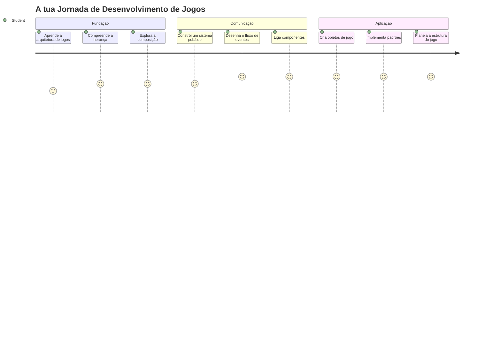
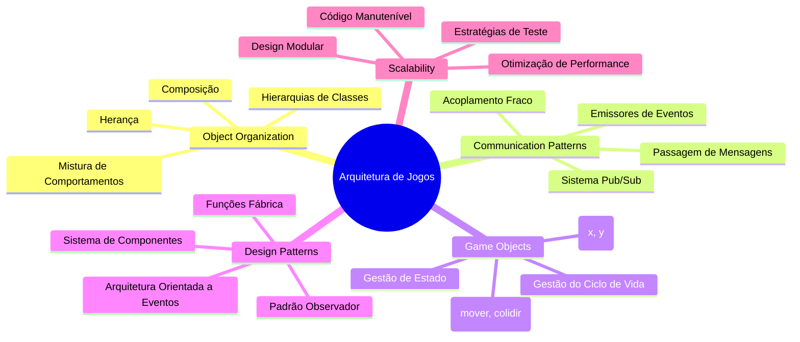
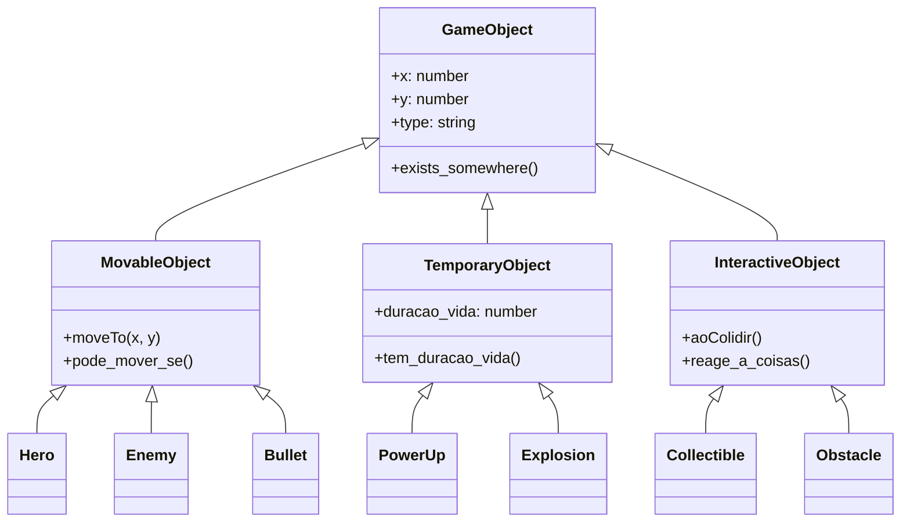
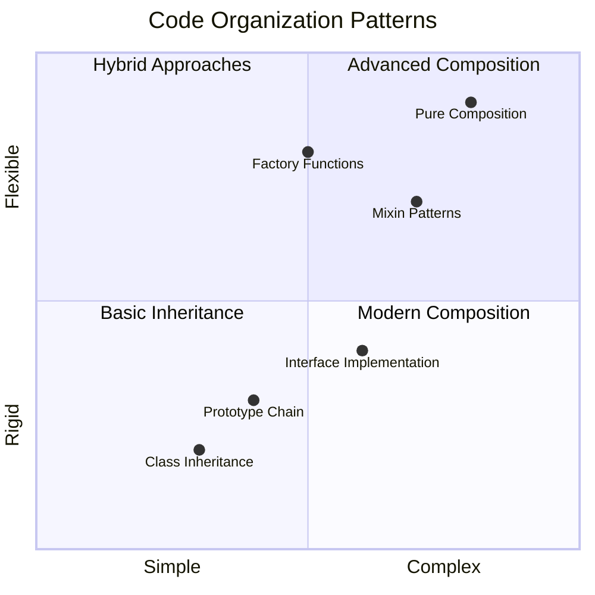
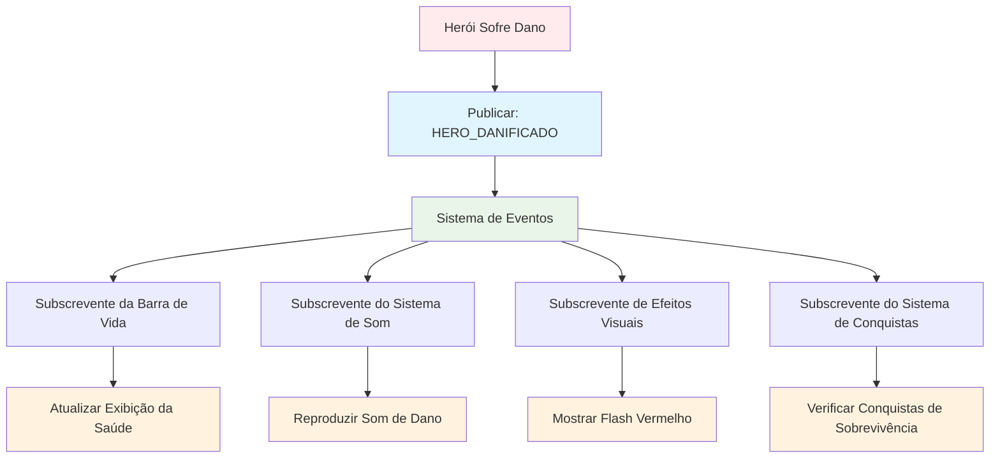
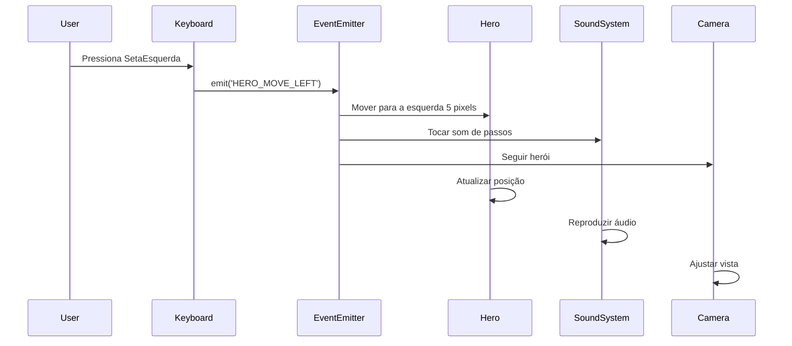
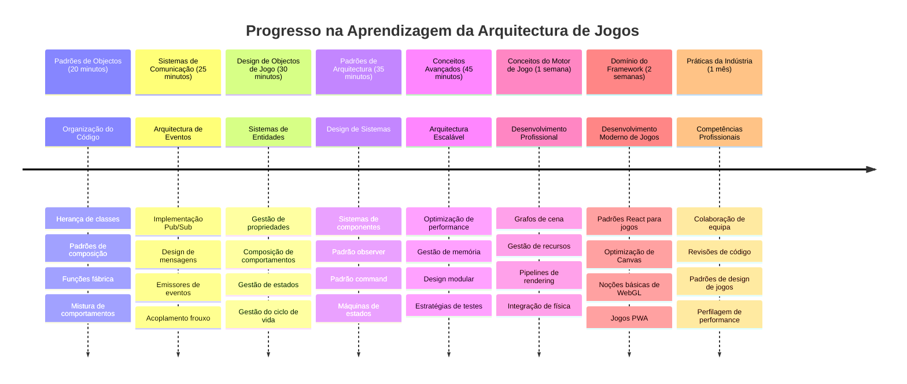

<!--
CO_OP_TRANSLATOR_METADATA:
{
  "original_hash": "a6332a7bb4d0be3bfd24199c83993777",
  "translation_date": "2026-01-06T17:56:18+00:00",
  "source_file": "6-space-game/1-introduction/README.md",
  "language_code": "pt"
}
-->
# Construir um Jogo Espacial Parte 1: Introdução




Assim como o centro de controlo da NASA coordena múltiplos sistemas durante um lançamento espacial, vamos construir um jogo espacial que demonstra como diferentes partes de um programa podem funcionar em conjunto sem falhas. Enquanto cria algo que pode realmente jogar, você aprenderá conceitos essenciais de programação que se aplicam a qualquer projeto de software.

Vamos explorar duas abordagens fundamentais para organizar código: herança e composição. Estes não são apenas conceitos académicos – são os mesmos padrões que alimentam tudo desde videojogos até sistemas bancários. Também iremos implementar um sistema de comunicação chamado pub/sub que funciona como as redes de comunicação usadas em naves espaciais, permitindo que diferentes componentes partilhem informação sem criar dependências.

No final desta série, você entenderá como construir aplicações que podem escalar e evoluir – seja desenvolvendo jogos, aplicações web, ou qualquer outro sistema de software.


## Questionário Pré-Aula

[Questionário pré-aula](https://ff-quizzes.netlify.app/web/quiz/29)

## Herança e Composição no Desenvolvimento de Jogos

À medida que os projetos crescem em complexidade, a organização do código torna-se crítica. O que começa como um simples script pode tornar-se difícil de manter sem uma estrutura adequada – assim como as missões Apollo exigiam uma coordenação cuidadosa entre milhares de componentes.

Vamos explorar duas abordagens fundamentais para organizar código: herança e composição. Cada uma tem vantagens distintas, e compreender ambas ajuda-o a escolher a abordagem certa para diferentes situações. Demonstraremos estes conceitos através do nosso jogo espacial, onde heróis, inimigos, power-ups e outros objetos devem interagir de forma eficiente.

✅ Um dos livros de programação mais famosos alguma vez escritos tem a ver com [padrões de design](https://en.wikipedia.org/wiki/Design_Patterns).

Em qualquer jogo, tem `objetos de jogo` – os elementos interativos que povoam o mundo do jogo. Heróis, inimigos, power-ups e efeitos visuais são todos objetos de jogo. Cada um existe em coordenadas específicas do ecrã usando valores `x` e `y`, semelhante a marcar pontos num plano cartesiano.

Apesar das suas diferenças visuais, estes objetos frequentemente partilham comportamentos fundamentais:

- **Existem em algum lugar** – Cada objeto tem coordenadas x e y para que o jogo saiba onde o desenhar  
- **Muitos podem mover-se** – Heróis correm, inimigos perseguem, balas voam pelo ecrã  
- **Têm um tempo de vida** – Alguns permanecem para sempre, outros (como explosões) aparecem brevemente e desaparecem  
- **Reagem a coisas** – Quando colidem, power-ups são apanhados, barras de saúde atualizam

✅ Pense num jogo como Pac-Man. Consegue identificar os quatro tipos de objetos listados acima neste jogo?


### Expressar Comportamento Através do Código

Agora que compreende os comportamentos comuns partilhados pelos objetos de jogo, vamos explorar como implementar esses comportamentos em JavaScript. Pode expressar comportamento de objeto através de métodos ligados a classes ou objetos individuais, e há várias abordagens para escolher.

**Abordagem Baseada em Classes**

Classes e herança fornecem uma abordagem estruturada para organizar objetos de jogo. Tal como o sistema taxonómico desenvolvido por Carl Linnaeus, começa com uma classe base contendo propriedades comuns e depois cria classes especializadas que herdam esses fundamentos enquanto adicionam capacidades específicas.

✅ Herança é um conceito importante para entender. Saiba mais em [artigo da MDN sobre herança](https://developer.mozilla.org/docs/Web/JavaScript/Inheritance_and_the_prototype_chain).

Aqui está como pode implementar objetos de jogo usando classes e herança:

```javascript
// Passo 1: Criar a classe base GameObject
class GameObject {
  constructor(x, y, type) {
    this.x = x;
    this.y = y;
    this.type = type;
  }
}
```

**Vamos decompor isto passo a passo:**
- Estamos a criar um modelo básico que qualquer objeto de jogo pode usar  
- O construtor guarda onde está o objeto (`x`, `y`) e que tipo de coisa é  
- Isto torna-se a base sobre a qual todos os seus objetos de jogo irão construir

```javascript
// Passo 2: Adicionar capacidade de movimento através da herança
class Movable extends GameObject {
  constructor(x, y, type) {
    super(x, y, type); // Chamar o construtor do pai
  }

  // Adicionar a capacidade de mover para uma nova posição
  moveTo(x, y) {
    this.x = x;
    this.y = y;
  }
}
```

**No exemplo acima, nós:**
- **Estendemos** a classe GameObject para adicionar funcionalidade de movimento  
- **Chamamos** o construtor do pai usando `super()` para inicializar propriedades herdadas  
- **Adicionamos** um método `moveTo()` que atualiza a posição do objeto  

```javascript
// Passo 3: Criar tipos específicos de objetos do jogo
class Hero extends Movable {
  constructor(x, y) {
    super(x, y, 'Hero'); // Definir tipo automaticamente
  }
}

class Tree extends GameObject {
  constructor(x, y) {
    super(x, y, 'Tree'); // Árvores não precisam de movimento
  }
}

// Passo 4: Usar os seus objetos do jogo
const hero = new Hero(0, 0);
hero.moveTo(5, 5); // O herói pode mover-se!

const tree = new Tree(10, 15);
// tree.moveTo() causaria um erro - as árvores não podem mover-se
```

**Compreendendo estes conceitos:**
- **Cria** tipos de objetos especializados que herdam comportamentos apropriados  
- **Demonstra** como a herança permite inclusão seletiva de funcionalidades  
- **Mostra** que heróis podem mover-se enquanto árvores permanecem estacionárias  
- **Ilustra** como a hierarquia de classes previne ações inadequadas  

✅ Dedique alguns minutos a reimaginar um herói de Pac-Man (Inky, Pinky ou Blinky, por exemplo) e como seria escrito em JavaScript.

**Abordagem por Composição**

A composição segue uma filosofia de design modular, semelhante a como engenheiros desenham naves espaciais com componentes intercambiáveis. Em vez de herdar de uma classe pai, combina comportamentos específicos para criar objetos com exatamente a funcionalidade que necessitam. Esta abordagem oferece flexibilidade sem restrições hierárquicas rígidas.

```javascript
// Passo 1: Criar objetos de comportamento base
const gameObject = {
  x: 0,
  y: 0,
  type: ''
};

const movable = {
  moveTo(x, y) {
    this.x = x;
    this.y = y;
  }
};
```

**Isto é o que este código faz:**
- **Define** um `gameObject` base com propriedades de posição e tipo  
- **Cria** um objeto de comportamento `movable` separado com funcionalidade de movimento  
- **Separa** responsabilidades mantendo dados de posição e lógica de movimento independentes  

```javascript
// Passo 2: Compor objetos combinando comportamentos
const movableObject = { ...gameObject, ...movable };

// Passo 3: Criar funções fábrica para diferentes tipos de objetos
function createHero(x, y) {
  return {
    ...movableObject,
    x,
    y,
    type: 'Hero'
  };
}

function createStatic(x, y, type) {
  return {
    ...gameObject,
    x,
    y,
    type
  };
}
```

**No exemplo acima, nós:**
- **Combinamos** propriedades do objeto base com comportamento de movimento usando sintaxe spread  
- **Criamos** funções fábrica que retornam objetos personalizados  
- **Permitimos** criação flexível de objetos sem hierarquias de classes rígidas  
- **Deixamos** objetos terem exatamente os comportamentos que necessitam  

```javascript
// Passo 4: Crie e utilize os seus objetos compostos
const hero = createHero(10, 10);
hero.moveTo(5, 5); // Funciona na perfeição!

const tree = createStatic(0, 0, 'Tree');
// tree.moveTo() está indefinido - nenhum comportamento de movimento foi composto
```

**Pontos-chave a lembrar:**
- **Compõe** objetos misturando comportamentos em vez de os herdar  
- **Fornece** mais flexibilidade do que hierarquias rígidas de herança  
- **Permite** que objetos tenham exatamente as funcionalidades de que precisam  
- **Usa** sintaxe moderna de spread do JavaScript para combinação limpa de objetos  

```

**Which Pattern Should You Choose?**

**Which Pattern Should You Choose?**



> 💡 **Dica Profissional**: Ambos padrões têm o seu lugar no desenvolvimento moderno em JavaScript. Classes funcionam bem para hierarquias claramente definidas, enquanto a composição destaca-se quando precisa de máxima flexibilidade.  
> 
**Aqui está quando usar cada abordagem:**
- **Escolha** herança quando existem relações claras de "é um" (um Herói *é um* objeto Movable)  
- **Selecione** composição quando precisa de relações "tem um" (um Herói *tem* capacidades de movimento)  
- **Considere** as preferências da equipa e os requisitos do projeto  
- **Lembre-se** que pode misturar ambas as abordagens na mesma aplicação  

### 🔄 **Verificação Pedagógica**
**Compreensão da Organização de Objetos**: Antes de avançar para os padrões de comunicação, certifique-se de que pode:
- ✅ Explicar a diferença entre herança e composição  
- ✅ Identificar quando usar classes versus funções fábrica  
- ✅ Entender como a palavra-chave `super()` funciona na herança  
- ✅ Reconhecer os benefícios de cada abordagem para desenvolvimento de jogos  

**Auto-teste Rápido**: Como criaria um Inimigo Voador que pode tanto mover-se como voar?  
- **Abordagem por herança**: `class FlyingEnemy extends Movable`  
- **Abordagem por composição**: `{ ...movable, ...flyable, ...gameObject }`  

**Ligação ao Mundo Real**: Estes padrões aparecem por toda a parte:  
- **Componentes React**: Props (composição) vs herança de classes  
- **Motores de Jogos**: Sistemas entidade-componente usam composição  
- **Apps Mobile**: Frameworks UI frequentemente usam hierarquias de herança  

## Padrões de Comunicação: O Sistema Pub/Sub

À medida que as aplicações se tornam complexas, gerir a comunicação entre componentes torna-se desafiante. O padrão publish-subscribe (pub/sub) resolve este problema usando princípios semelhantes à radiodifusão – um transmissor pode alcançar múltiplos recetores sem saber quem está a ouvir.

Considere o que acontece quando um herói recebe dano: a barra de saúde atualiza-se, efeitos sonoros tocam, surgem feedbacks visuais. Em vez de ligar diretamente o objeto herói a estes sistemas, o pub/sub permite que o herói transmita uma mensagem "dano recebido". Qualquer sistema que precise responder pode subscrever-se a esse tipo de mensagem e reagir em conformidade.

✅ **Pub/Sub** significa 'publish-subscribe' (publicar-subscrever)


### Compreender a Arquitetura Pub/Sub

O padrão pub/sub mantém diferentes partes da sua aplicação fracamente acopladas, o que significa que podem trabalhar juntas sem serem diretamente dependentes umas das outras. Esta separação torna o seu código mais fácil de manter, testar e flexível a mudanças.

**Os principais intervenientes no pub/sub:**
- **Mensagens** – Etiquetas simples de texto como `'PLAYER_SCORED'` que descrevem o que aconteceu (mais informações adicionais)  
- **Publicadores** – Os objetos que gritam "Aconteceu algo!" para quem estiver a ouvir  
- **Subscreventes** – Os objetos que dizem "Interessa-me esse evento" e reagem quando acontece  
- **Sistema de Eventos** – O intermediário que assegura que as mensagens chegam aos ouvintes certos  

### Construir um Sistema de Eventos

Vamos criar um sistema de eventos simples, mas poderoso, que demonstra estes conceitos:

```javascript
// Passo 1: Criar a classe EventEmitter
class EventEmitter {
  constructor() {
    this.listeners = {}; // Armazenar todos os ouvintes de eventos
  }
  
  // Registar um ouvinte para um tipo específico de mensagem
  on(message, listener) {
    if (!this.listeners[message]) {
      this.listeners[message] = [];
    }
    this.listeners[message].push(listener);
  }
  
  // Enviar uma mensagem para todos os ouvintes registados
  emit(message, payload = null) {
    if (this.listeners[message]) {
      this.listeners[message].forEach(listener => {
        listener(message, payload);
      });
    }
  }
}
```

**Analisando o que acontece aqui:**
- **Cria** um sistema central de gestão de eventos usando uma classe simples  
- **Armazena** ouvintes num objeto organizado pelo tipo de mensagem  
- **Regista** novos ouvintes usando o método `on()`  
- **Transmite** mensagens a todos os ouvintes interessados usando `emit()`  
- **Suporta** payloads de dados opcionais para passar informação relevante  

### Juntando Tudo: Um Exemplo Prático

Ok, vamos ver isto em ação! Vamos construir um sistema simples de movimento que mostra como o pub/sub é limpo e flexível:

```javascript
// Passo 1: Defina os seus tipos de mensagens
const Messages = {
  HERO_MOVE_LEFT: 'HERO_MOVE_LEFT',
  HERO_MOVE_RIGHT: 'HERO_MOVE_RIGHT',
  ENEMY_SPOTTED: 'ENEMY_SPOTTED'
};

// Passo 2: Crie o seu sistema de eventos e objetos de jogo
const eventEmitter = new EventEmitter();
const hero = createHero(0, 0);
```

**Isto que o código faz:**
- **Define** um objeto de constantes para prevenir erros tipográficos nos nomes das mensagens  
- **Cria** uma instância de emissor de eventos para gerir toda a comunicação  
- **Inicializa** um objeto herói na posição inicial  

```javascript
// Passo 3: Configurar ouvintes de eventos (assinantes)
eventEmitter.on(Messages.HERO_MOVE_LEFT, () => {
  hero.moveTo(hero.x - 5, hero.y);
  console.log(`Hero moved to position: ${hero.x}, ${hero.y}`);
});

eventEmitter.on(Messages.HERO_MOVE_RIGHT, () => {
  hero.moveTo(hero.x + 5, hero.y);
  console.log(`Hero moved to position: ${hero.x}, ${hero.y}`);
});
```

**No exemplo acima, nós:**
- **Registamos** ouvintes de eventos que respondem a mensagens de movimento  
- **Atualizamos** a posição do herói com base na direção do movimento  
- **Adicionamos** registos no console para acompanhar as mudanças de posição do herói  
- **Separamos** a lógica de movimento do tratamento da entrada  

```javascript
// Passo 4: Ligar a entrada do teclado aos eventos (publicadores)
window.addEventListener('keydown', (event) => {
  switch(event.key) {
    case 'ArrowLeft':
      eventEmitter.emit(Messages.HERO_MOVE_LEFT);
      break;
    case 'ArrowRight':
      eventEmitter.emit(Messages.HERO_MOVE_RIGHT);
      break;
  }
});
```

**Compreendendo estes conceitos:**
- **Conecta** a entrada do teclado a eventos do jogo sem acoplamento rígido  
- **Permite** ao sistema de entrada comunicar com objetos do jogo indiretamente  
- **Permite** a múltiplos sistemas responder aos mesmos eventos do teclado  
- **Facilita** mudar as teclas ou adicionar novos métodos de entrada  


> 💡 **Dica Profissional**: A grande vantagem deste padrão é a flexibilidade! Pode facilmente adicionar efeitos sonoros, tremores de ecrã ou efeitos de partículas simplesmente adicionando mais ouvintes de eventos – sem precisar modificar o código existente do teclado ou movimento.  
> 
**Aqui está porque vai adorar esta abordagem:**
- Adicionar novas funcionalidades torna-se muito fácil – basta escutar os eventos que lhe interessam  
- Muitas coisas podem reagir ao mesmo evento sem interferir umas com as outras  
- Os testes tornam-se muito mais simples porque cada peça funciona independentemente  
- Quando algo falha, sabe exatamente onde procurar  

### Porque o Pub/Sub Escala Eficazmente

O padrão pub/sub mantém a simplicidade à medida que as aplicações crescem em complexidade. Quer esteja a gerir dezenas de inimigos, atualizações dinâmicas da UI ou sistemas de som, o padrão lida com o aumento da escala sem mudanças na arquitetura. Novas funcionalidades integram-se no sistema de eventos existente sem afetar a funcionalidade estabelecida.

> ⚠️ **Erro Comum**: Não crie demasiados tipos específicos de mensagens logo no início. Comece com categorias gerais e refine à medida que as necessidades do seu jogo se tornam mais claras.  
> 
**Boas práticas a seguir:**
- **Agrupe** mensagens relacionadas em categorias lógicas  
- **Use** nomes descritivos que indiquem claramente o que aconteceu  
- **Mantenha** os payloads de mensagem simples e focados  
- **Documente** os seus tipos de mensagens para colaboração em equipa  

### 🔄 **Verificação Pedagógica**
**Compreensão da Arquitetura Orientada a Eventos**: Verifique a sua compreensão do sistema completo:
- ✅ Como o padrão pub/sub evita acoplamento rígido entre componentes?  
- ✅ Porque é mais fácil adicionar novas funcionalidades com arquitetura orientada a eventos?  
- ✅ Qual é o papel do EventEmitter no fluxo de comunicação?  
- ✅ Como constantes de mensagens evitam bugs e melhoram a manutenção?  

**Desafio de Design**: Como lidaria com estes cenários do jogo usando pub/sub?  
1. **Inimigo morre**: Atualizar pontuação, tocar som, gerar power-up, remover do ecrã  
2. **Nível concluído**: Parar música, mostrar UI, salvar progresso, carregar próximo nível  
3. **Power-up recolhido**: Melhorar capacidades, atualizar UI, tocar efeito, iniciar temporizador  

**Conexão Profissional**: Este padrão aparece em:  
- **Frameworks Frontend**: Sistemas de eventos React/Vue  
- **Serviços Backend**: Comunicação de microserviços  
- **Motores de Jogos**: Sistema de eventos da Unity  
- **Desenvolvimento Mobile**: Sistemas de notificações iOS/Android  

---

## Desafio GitHub Copilot Agent 🚀

Use o modo Agente para completar o seguinte desafio:

**Descrição:** Crie um sistema simples de objetos de jogo usando herança e o padrão pub/sub. Irá implementar um jogo básico onde diferentes objetos podem comunicar-se através de eventos sem saberem diretamente uns dos outros.

**Prompt:** Crie um sistema de jogo em JavaScript com os seguintes requisitos: 1) Crie uma classe base GameObject com coordenadas x, y e uma propriedade de tipo. 2) Crie uma classe Hero que estenda GameObject e possa mover-se. 3) Crie uma classe Enemy que estenda GameObject e possa perseguir o herói. 4) Implemente uma classe EventEmitter para o padrão pub/sub. 5) Configure ouvintes de eventos para que quando o herói se mova, inimigos próximos recebam um evento 'HERO_MOVED' e atualizem a sua posição para se moverem na direção do herói. Inclua declarações console.log para mostrar a comunicação entre objetos.

Saiba mais sobre o [modo agente](https://code.visualstudio.com/blogs/2025/02/24/introducing-copilot-agent-mode) aqui.

## 🚀 Desafio
Considere como o padrão pub-sub pode melhorar a arquitetura de jogos. Identifique quais componentes devem emitir eventos e como o sistema deve responder. Projete um conceito de jogo e trace os padrões de comunicação entre seus componentes.

## Quiz Pós-Aula

[Quiz pós-aula](https://ff-quizzes.netlify.app/web/quiz/30)

## Revisão & Autoestudo

Aprenda mais sobre Pub/Sub lendo sobre isso em [reading about it](https://docs.microsoft.com/azure/architecture/patterns/publisher-subscriber/?WT.mc_id=academic-77807-sagibbon).

### ⚡ **O Que Pode Fazer nos Próximos 5 Minutos**
- [ ] Abra qualquer jogo HTML5 online e inspeccione o seu código usando DevTools
- [ ] Crie um simples elemento Canvas HTML5 e desenhe uma forma básica
- [ ] Experimente usar `setInterval` para criar um ciclo de animação simples
- [ ] Explore a documentação da API Canvas e experimente um método de desenho

### 🎯 **O Que Pode Atingir Nesta Hora**
- [ ] Complete o quiz pós-aula e compreenda conceitos de desenvolvimento de jogos
- [ ] Configure a estrutura do seu projeto de jogo com ficheiros HTML, CSS e JavaScript
- [ ] Crie um ciclo básico de jogo que atualize e renderize continuamente
- [ ] Desenhe os seus primeiros sprites de jogo no canvas
- [ ] Implemente carregamento básico de recursos para imagens e sons

### 📅 **A Sua Criação de Jogo de Uma Semana**
- [ ] Complete o jogo espacial completo com todas as funcionalidades planeadas
- [ ] Adicione gráficos polidos, efeitos sonoros e animações suaves
- [ ] Implemente estados do jogo (ecrã inicial, jogabilidade, fim de jogo)
- [ ] Crie um sistema de pontuação e acompanhamento do progresso do jogador
- [ ] Torne o seu jogo responsivo e acessível em vários dispositivos
- [ ] Partilhe o seu jogo online e recolha feedback dos jogadores

### 🌟 **O Seu Desenvolvimento de Jogo de Um Mês**
- [ ] Construa vários jogos explorando diferentes géneros e mecânicas
- [ ] Aprenda um framework de desenvolvimento de jogo como Phaser ou Three.js
- [ ] Contribua para projetos open source de desenvolvimento de jogos
- [ ] Domine padrões avançados de programação de jogos e otimização
- [ ] Crie um portefólio a mostrar as suas competências em desenvolvimento de jogos
- [ ] Seja mentor de outros interessados em desenvolvimento de jogos e media interativos

## 🎯 A Sua Linha Temporal de Domínio em Desenvolvimento de Jogos


### 🛠️ Resumo do Seu Kit de Ferramentas de Arquitetura de Jogos

Após completar esta lição, agora tem:
- **Domínio de Padrões de Design**: Compreensão das trocas entre herança e composição
- **Arquitetura Orientada a Eventos**: Implementação pub/sub para comunicação escalável
- **Design Orientado a Objetos**: Hierarquias de classes e composição de comportamentos
- **JavaScript Moderno**: Funções de fábrica, sintaxe spread e padrões ES6+
- **Arquitetura Escalável**: Princípios de design modular e baixo acoplamento
- **Fundação em Desenvolvimento de Jogos**: Sistemas de entidades e padrões de componentes
- **Padrões Profissionais**: Abordagens padrão da indústria para organização de código

**Aplicações no Mundo Real**: Estes padrões aplicam-se diretamente a:
- **Frameworks Frontend**: Arquitetura de componentes React/Vue e gestão de estado
- **Serviços Backend**: Comunicação entre microserviços e sistemas orientados a eventos
- **Desenvolvimento Mobile**: Arquitetura de apps iOS/Android e sistemas de notificação
- **Motores de Jogo**: Unity, Unreal e desenvolvimento de jogos para web
- **Software Empresarial**: Event sourcing e design de sistemas distribuídos
- **Design de API**: Serviços RESTful e comunicação em tempo real

**Competências Profissionais Adquiridas**: Agora pode:
- **Desenhar** arquiteturas de software escaláveis usando padrões comprovados
- **Implementar** sistemas orientados a eventos que gerem interações complexas
- **Escolher** estratégias apropriadas de organização de código para diferentes cenários
- **Debugar** e manter sistemas com baixo acoplamento de forma eficaz
- **Comunicar** decisões técnicas usando terminologia padrão da indústria

**Próximo Nível**: Está pronto para implementar estes padrões num jogo real, explorar tópicos avançados de desenvolvimento de jogos, ou aplicar estes conceitos arquitetónicos em aplicações web!

🌟 **Conquista Desbloqueada**: Dominou padrões fundamentais de arquitetura de software que alimentam desde jogos simples a sistemas empresariais complexos!

## Tarefa

[Mock up a game](assignment.md)

---

<!-- CO-OP TRANSLATOR DISCLAIMER START -->
**Aviso Legal**:
Este documento foi traduzido utilizando o serviço de tradução automática [Co-op Translator](https://github.com/Azure/co-op-translator). Embora nos esforcemos por garantir a precisão, por favor tenha em conta que as traduções automáticas podem conter erros ou imprecisões. O documento original na sua língua nativa deve ser considerado a fonte autorizada. Para informações críticas, recomenda-se tradução profissional feita por humanos. Não nos responsabilizamos por quaisquer mal-entendidos ou interpretações erradas decorrentes do uso desta tradução.
<!-- CO-OP TRANSLATOR DISCLAIMER END -->