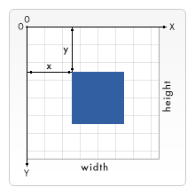

<!--
CO_OP_TRANSLATOR_METADATA:
{
  "original_hash": "056641280211e52fd0adb81b6058ec55",
  "translation_date": "2025-08-29T16:13:26+00:00",
  "source_file": "6-space-game/2-drawing-to-canvas/README.md",
  "language_code": "pt"
}
-->
# Construir um Jogo Espacial Parte 2: Desenhar Herói e Monstros no Canvas

## Questionário Pré-Aula

[Questionário pré-aula](https://ff-quizzes.netlify.app/web/quiz/31)

## O Canvas

O canvas é um elemento HTML que, por padrão, não tem conteúdo; é uma tela em branco. É necessário adicionar conteúdo desenhando nele.

✅ Leia [mais sobre a API Canvas](https://developer.mozilla.org/docs/Web/API/Canvas_API) no MDN.

Aqui está como ele é normalmente declarado, como parte do corpo da página:

```html
<canvas id="myCanvas" width="200" height="100"></canvas>
```

Acima, estamos a definir o `id`, `width` e `height`.

- `id`: defina isto para obter uma referência quando precisar interagir com o elemento.
- `width`: esta é a largura do elemento.
- `height`: esta é a altura do elemento.

## Desenhar geometria simples

O Canvas utiliza um sistema de coordenadas cartesianas para desenhar. Assim, usa um eixo x e um eixo y para expressar onde algo está localizado. A localização `0,0` é a posição no canto superior esquerdo, e o canto inferior direito corresponde ao que foi definido como a LARGURA e ALTURA do canvas.

  
> Imagem de [MDN](https://developer.mozilla.org/docs/Web/API/Canvas_API/Tutorial/Drawing_shapes)

Para desenhar no elemento canvas, é necessário seguir os seguintes passos:

1. **Obter uma referência** ao elemento Canvas.
1. **Obter uma referência** ao elemento Context que está no elemento Canvas.
1. **Realizar uma operação de desenho** utilizando o elemento Context.

O código para os passos acima geralmente é assim:

```javascript
// draws a red rectangle
//1. get the canvas reference
canvas = document.getElementById("myCanvas");

//2. set the context to 2D to draw basic shapes
ctx = canvas.getContext("2d");

//3. fill it with the color red
ctx.fillStyle = 'red';

//4. and draw a rectangle with these parameters, setting location and size
ctx.fillRect(0,0, 200, 200) // x,y,width, height
```

✅ A API Canvas foca-se principalmente em formas 2D, mas também é possível desenhar elementos 3D num site; para isso, pode usar a [API WebGL](https://developer.mozilla.org/docs/Web/API/WebGL_API).

Com a API Canvas, pode desenhar vários tipos de coisas, como:

- **Formas geométricas**, já mostramos como desenhar um retângulo, mas há muito mais que pode desenhar.
- **Texto**, pode desenhar texto com qualquer fonte e cor que desejar.
- **Imagens**, pode desenhar uma imagem com base num ficheiro de imagem, como um .jpg ou .png, por exemplo.

✅ Experimente! Já sabe como desenhar um retângulo, consegue desenhar um círculo numa página? Veja alguns desenhos interessantes feitos com Canvas no CodePen. Aqui está um [exemplo particularmente impressionante](https://codepen.io/dissimulate/pen/KrAwx).

## Carregar e desenhar um recurso de imagem

Carrega-se um recurso de imagem criando um objeto `Image` e definindo a sua propriedade `src`. Depois, ouve-se o evento `load` para saber quando está pronto para ser usado. O código é assim:

### Carregar recurso

```javascript
const img = new Image();
img.src = 'path/to/my/image.png';
img.onload = () => {
  // image loaded and ready to be used
}
```

### Padrão de carregamento de recurso

Recomenda-se envolver o código acima numa estrutura como esta, para facilitar o uso e garantir que só se tenta manipulá-lo quando estiver completamente carregado:

```javascript
function loadAsset(path) {
  return new Promise((resolve) => {
    const img = new Image();
    img.src = path;
    img.onload = () => {
      // image loaded and ready to be used
      resolve(img);
    }
  })
}

// use like so

async function run() {
  const heroImg = await loadAsset('hero.png')
  const monsterImg = await loadAsset('monster.png')
}

```

Para desenhar recursos de jogo no ecrã, o código seria assim:

```javascript
async function run() {
  const heroImg = await loadAsset('hero.png')
  const monsterImg = await loadAsset('monster.png')

  canvas = document.getElementById("myCanvas");
  ctx = canvas.getContext("2d");
  ctx.drawImage(heroImg, canvas.width/2,canvas.height/2);
  ctx.drawImage(monsterImg, 0,0);
}
```

## Agora é hora de começar a construir o seu jogo

### O que construir

Vai construir uma página web com um elemento Canvas. Deve renderizar um ecrã preto `1024*768`. Foram fornecidas duas imagens:

- Nave do herói

   

- Monstro 5*5

   

### Passos recomendados para começar o desenvolvimento

Localize os ficheiros que foram criados para si na subpasta `your-work`. Deve conter o seguinte:

```bash
-| assets
  -| enemyShip.png
  -| player.png
-| index.html
-| app.js
-| package.json
```

Abra a cópia desta pasta no Visual Studio Code. É necessário ter um ambiente de desenvolvimento local configurado, preferencialmente com Visual Studio Code, NPM e Node instalados. Se não tiver o `npm` configurado no seu computador, [aqui está como fazer isso](https://www.npmjs.com/get-npm).

Inicie o seu projeto navegando até à pasta `your_work`:

```bash
cd your-work
npm start
```

O comando acima iniciará um servidor HTTP no endereço `http://localhost:5000`. Abra um navegador e insira esse endereço. É uma página em branco neste momento, mas isso vai mudar.

> Nota: para ver alterações no ecrã, atualize o navegador.

### Adicionar código

Adicione o código necessário em `your-work/app.js` para resolver o seguinte:

1. **Desenhar** um canvas com fundo preto  
   > dica: adicione duas linhas sob o TODO apropriado em `/app.js`, definindo o elemento `ctx` para ser preto e as coordenadas superior/esquerda para 0,0, e a altura e largura iguais às do canvas.
2. **Carregar** texturas  
   > dica: adicione as imagens do jogador e do inimigo usando `await loadTexture` e passando o caminho da imagem. Ainda não verá as imagens no ecrã!
3. **Desenhar** o herói no centro do ecrã na metade inferior  
   > dica: use a API `drawImage` para desenhar heroImg no ecrã, definindo `canvas.width / 2 - 45` e `canvas.height - canvas.height / 4)`.
4. **Desenhar** monstros 5*5  
   > dica: agora pode descomentar o código para desenhar inimigos no ecrã. Em seguida, vá para a função `createEnemies` e desenvolva-a.

   Primeiro, configure algumas constantes:

    ```javascript
    const MONSTER_TOTAL = 5;
    const MONSTER_WIDTH = MONSTER_TOTAL * 98;
    const START_X = (canvas.width - MONSTER_WIDTH) / 2;
    const STOP_X = START_X + MONSTER_WIDTH;
    ```

    depois, crie um loop para desenhar o array de monstros no ecrã:

    ```javascript
    for (let x = START_X; x < STOP_X; x += 98) {
        for (let y = 0; y < 50 * 5; y += 50) {
          ctx.drawImage(enemyImg, x, y);
        }
      }
    ```

## Resultado

O resultado final deve ser assim:


## Solução

Tente resolver sozinho primeiro, mas se ficar preso, veja uma [solução](../../../../6-space-game/2-drawing-to-canvas/solution/app.js).

---

## 🚀 Desafio

Aprendeu sobre desenho com a API Canvas focada em 2D; veja a [API WebGL](https://developer.mozilla.org/docs/Web/API/WebGL_API) e tente desenhar um objeto 3D.

## Questionário Pós-Aula

[Questionário pós-aula](https://ff-quizzes.netlify.app/web/quiz/32)

## Revisão e Estudo Individual

Saiba mais sobre a API Canvas [lendo sobre ela](https://developer.mozilla.org/docs/Web/API/Canvas_API).

## Tarefa

[Experimente a API Canvas](assignment.md)

---

**Aviso Legal**:  
Este documento foi traduzido utilizando o serviço de tradução por IA [Co-op Translator](https://github.com/Azure/co-op-translator). Embora nos esforcemos para garantir a precisão, esteja ciente de que traduções automáticas podem conter erros ou imprecisões. O documento original na sua língua nativa deve ser considerado a fonte oficial. Para informações críticas, recomenda-se uma tradução profissional realizada por humanos. Não nos responsabilizamos por quaisquer mal-entendidos ou interpretações incorretas resultantes do uso desta tradução.