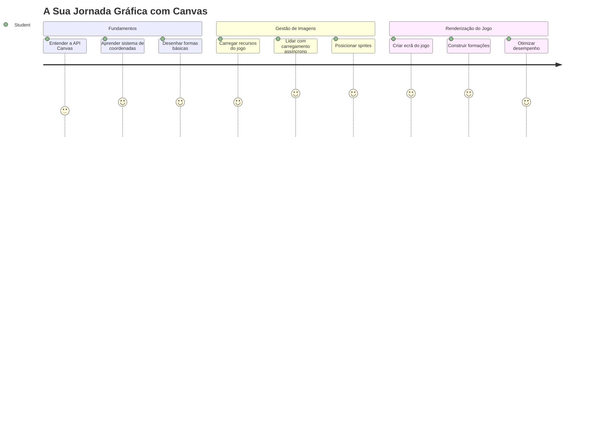
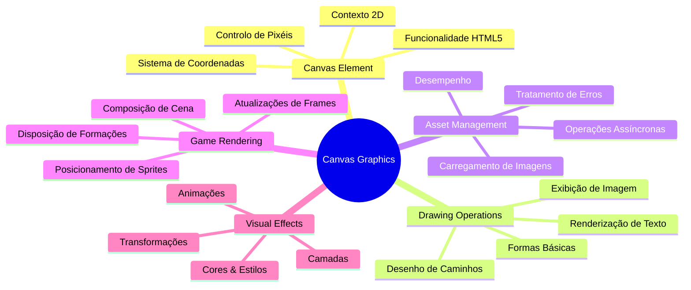
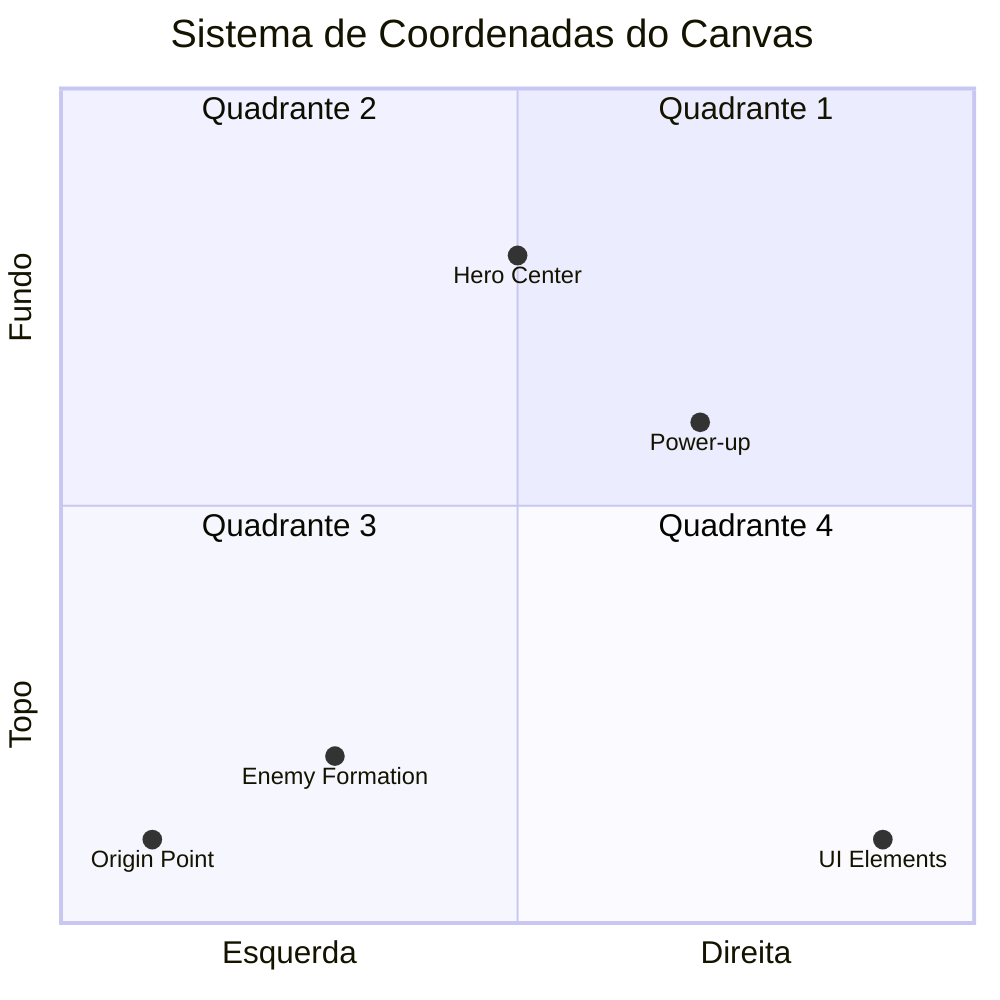
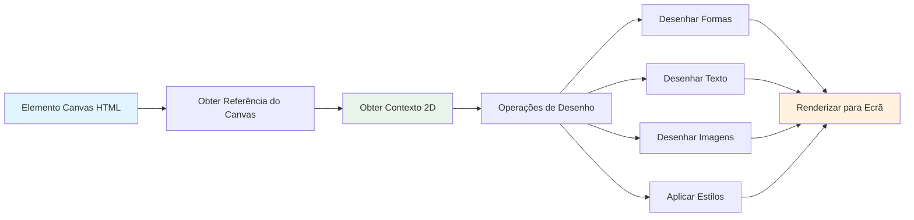
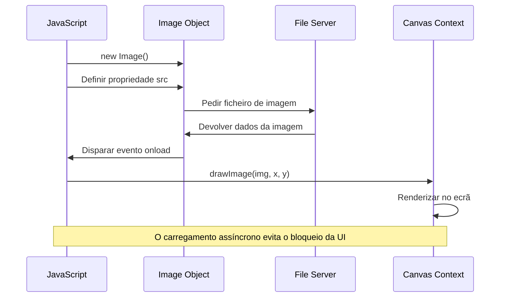
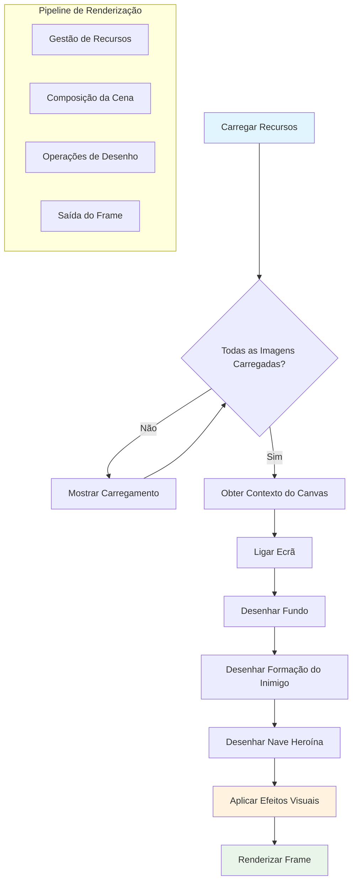
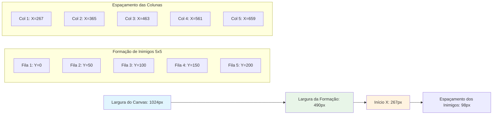
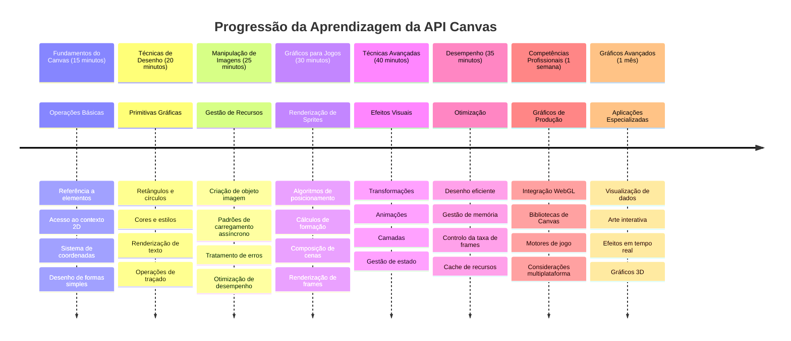

<!--
CO_OP_TRANSLATOR_METADATA:
{
  "original_hash": "7994743c5b21fdcceb36307916ef249a",
  "translation_date": "2026-01-06T17:51:17+00:00",
  "source_file": "6-space-game/2-drawing-to-canvas/README.md",
  "language_code": "pt"
}
-->
# Construir um Jogo Espacial Parte 2: Desenhar o Herói e os Monstros no Canvas


A API Canvas é uma das funcionalidades mais poderosas do desenvolvimento web para criar gráficos dinâmicos e interativos diretamente no seu navegador. Nesta lição, transformaremos esse elemento HTML `<canvas>` em branco num mundo de jogo cheio de heróis e monstros. Pense no canvas como a sua tela digital onde o código se torna visual.

Estamos a construir sobre o que aprendeu na lição anterior, e agora vamos mergulhar nos aspetos visuais. Vai aprender como carregar e mostrar sprites do jogo, posicionar elementos com precisão e criar a base visual para o seu jogo espacial. Isto faz a ponte entre páginas web estáticas e experiências dinâmicas e interativas.

No final desta lição, terá uma cena de jogo completa com a sua nave herói posicionada corretamente e formações de inimigos prontas para a batalha. Vai compreender como os jogos modernos desenham gráficos nos navegadores e adquirir competências para criar as suas próprias experiências visuais interativas. Vamos explorar os gráficos em canvas e dar vida ao seu jogo espacial!


## Questionário Pré-Aula

[Questionário pré-aula](https://ff-quizzes.netlify.app/web/quiz/31)

## O Canvas

Então, o que é exatamente este elemento `<canvas>`? É a solução do HTML5 para criar gráficos dinâmicos e animações nos navegadores web. Ao contrário das imagens ou vídeos normais que são estáticos, o canvas dá-lhe controlo ao nível do pixel sobre tudo o que aparece no ecrã. Isto torna-o perfeito para jogos, visualizações de dados e arte interativa. Pense nele como uma superfície de desenho programável em que o JavaScript é o seu pincel.

Por defeito, um elemento canvas parece um retângulo transparente e em branco na sua página. Mas é aí que está o potencial! O seu verdadeiro poder emerge quando usa JavaScript para desenhar formas, carregar imagens, criar animações e fazer as coisas responderem às interações do utilizador. É semelhante a como os primeiros pioneiros dos gráficos por computador no Bell Labs nos anos 60 tinham que programar cada pixel para criar as primeiras animações digitais.

✅ Leia [mais sobre a API Canvas](https://developer.mozilla.org/docs/Web/API/Canvas_API) na MDN.

Aqui está como normalmente é declarado, como parte do corpo da página:

```html
<canvas id="myCanvas" width="200" height="100"></canvas>
```

**Isto é o que este código faz:**
- **Define** o atributo `id` para que possa referenciar este elemento canvas específico no JavaScript
- **Define** a `width` em pixels para controlar a largura horizontal do canvas
- **Estabelece** a `height` em pixels para determinar as dimensões verticais do canvas

## Desenhar Geometria Simples

Agora que sabe o que é o elemento canvas, vamos explorar como desenhar nele! O canvas usa um sistema de coordenadas que pode parecer familiar da aula de matemática, mas há uma reviravolta importante específica dos gráficos de computador.

O canvas usa coordenadas cartesianas com um eixo x (horizontal) e um eixo y (vertical) para posicionar tudo o que desenha. Mas aqui está a diferença chave: ao contrário do sistema de coordenadas da matemática, o ponto de origem `(0,0)` começa no canto superior esquerdo, com os valores de x a aumentar para a direita e os valores de y a aumentar para baixo. Esta abordagem remonta aos primeiros ecrãs informáticos onde os feixes de elétrons varriam de cima para baixo, tornando o canto superior esquerdo o ponto de partida natural.



> Imagem de [MDN](https://developer.mozilla.org/docs/Web/API/Canvas_API/Tutorial/Drawing_shapes)

Para desenhar no elemento canvas, vai seguir o mesmo processo em três passos que forma a base de todos os gráficos em canvas. Depois de o fazer algumas vezes, torna-se natural:


1. **Obtenha uma referência** ao seu elemento Canvas no DOM (igual a qualquer outro elemento HTML)
2. **Obtenha o contexto de renderização 2D** – isto fornece todos os métodos de desenho
3. **Comece a desenhar!** Use os métodos incorporados do contexto para criar os seus gráficos

Aqui está como fica no código:

```javascript
// Passo 1: Obter o elemento canvas
const canvas = document.getElementById("myCanvas");

// Passo 2: Obter o contexto de renderização 2D
const ctx = canvas.getContext("2d");

// Passo 3: Definir a cor de preenchimento e desenhar um retângulo
ctx.fillStyle = 'red';
ctx.fillRect(0, 0, 200, 200); // x, y, largura, altura
```

**Vamos dividir isto passo a passo:**
- Apanhamos o nosso elemento canvas usando o seu ID e guardamo-lo numa variável
- Obtemos o contexto de renderização 2D – este é o nosso conjunto de ferramentas cheio de métodos para desenhar
- Dizemos ao canvas que queremos preencher com vermelho usando a propriedade `fillStyle`
- Desenhamos um retângulo começando no canto superior esquerdo (0,0) que tem 200 pixels de largura e altura

✅ A API Canvas foca-se maioritariamente em formas 2D, mas também pode desenhar elementos 3D num site; para isso, pode usar a [WebGL API](https://developer.mozilla.org/docs/Web/API/WebGL_API).

Pode desenhar todo o tipo de coisas com a API Canvas como:

- **Formas geométricas**, já mostramos como desenhar um retângulo, mas há muito mais que pode desenhar.
- **Texto**, pode desenhar texto com qualquer fonte e cor que desejar.
- **Imagens**, pode desenhar uma imagem baseada num ativo de imagem como um .jpg ou .png, por exemplo.

✅ Experimente! Já sabe desenhar um retângulo, consegue desenhar um círculo numa página? Dê uma vista de olhos em alguns desenhos interessantes de Canvas no CodePen. Aqui tem um [exemplo particularmente impressionante](https://codepen.io/dissimulate/pen/KrAwx).

### 🔄 **Verificação Pedagógica**
**Compreensão dos Fundamentos do Canvas**: Antes de avançar para o carregamento de imagens, certifique-se que consegue:
- ✅ Explicar como o sistema de coordenadas do canvas difere das coordenadas matemáticas
- ✅ Entender o processo em três passos para operações de desenho no canvas
- ✅ Identificar o que o contexto de renderização 2D fornece
- ✅ Descrever como `fillStyle` e `fillRect` funcionam em conjunto

**Autoavaliação Rápida**: Como desenharia um círculo azul na posição (100, 50) com raio 25?
```javascript
ctx.fillStyle = 'blue';
ctx.beginPath();
ctx.arc(100, 50, 25, 0, 2 * Math.PI);
ctx.fill();
```

**Métodos de Desenho no Canvas que Agora Conhece**:
- **fillRect()**: Desenha retângulos preenchidos
- **fillStyle**: Define cores e padrões
- **beginPath()**: Inicia novos caminhos de desenho
- **arc()**: Cria círculos e curvas

## Carregar e Desenhar um Ativo de Imagem

Desenhar formas básicas é útil para começar, mas a maioria dos jogos precisa de imagens reais! Sprites, fundos e texturas são o que conferem apelo visual aos jogos. Carregar e mostrar imagens no canvas funciona de forma diferente do desenho de formas geométricas, mas é simples depois de compreender o processo.

Precisamos criar um objeto `Image`, carregar o ficheiro da imagem (isto acontece de forma assíncrona, ou seja, "em segundo plano") e depois desenhá-lo no canvas quando estiver pronto. Esta abordagem garante que as suas imagens são exibidas corretamente sem bloquear a sua aplicação enquanto carregam.


### Carregamento Básico de Imagem

```javascript
const img = new Image();
img.src = 'path/to/my/image.png';
img.onload = () => {
  // Imagem carregada e pronta para ser usada
  console.log('Image loaded successfully!');
};
```

**Isto é o que está a acontecer neste código:**
- Criamos um novo objeto Image para conter o nosso sprite ou textura
- Dizemos qual o ficheiro de imagem para carregar definindo o caminho da fonte
- Escutamos o evento de load para sabermos exatamente quando a imagem está pronta a usar

### Uma Forma Melhor de Carregar Imagens

Aqui está uma forma mais robusta de lidar com o carregamento de imagens que os programadores profissionais usam. Envolveremos o carregamento da imagem numa função baseada em Promise – esta abordagem, popularizada quando as Promises em JavaScript se tornaram padrão no ES6, torna o seu código mais organizado e trata de erros com elegância:

```javascript
function loadAsset(path) {
  return new Promise((resolve, reject) => {
    const img = new Image();
    img.src = path;
    img.onload = () => {
      resolve(img);
    };
    img.onerror = () => {
      reject(new Error(`Failed to load image: ${path}`));
    };
  });
}

// Utilização moderna com async/await
async function initializeGame() {
  try {
    const heroImg = await loadAsset('hero.png');
    const monsterImg = await loadAsset('monster.png');
    // As imagens estão agora prontas a usar
  } catch (error) {
    console.error('Failed to load game assets:', error);
  }
}
```

**O que fizemos aqui:**
- **Envolvemos** toda a lógica de carregamento de imagem numa Promise para podermos geri-la melhor
- **Adicionámos** tratamento de erros que realmente nos avisa quando algo corre mal
- **Utilizamos** a sintaxe moderna async/await porque é muito mais limpa de ler
- **Incluímos** blocos try/catch para tratar qualquer contratempo no carregamento de forma elegante

Depois das suas imagens estarem carregadas, desenhá-las no canvas é na verdade bastante simples:

```javascript
async function renderGameScreen() {
  try {
    // Carregar recursos do jogo
    const heroImg = await loadAsset('hero.png');
    const monsterImg = await loadAsset('monster.png');

    // Obter canvas e contexto
    const canvas = document.getElementById("myCanvas");
    const ctx = canvas.getContext("2d");

    // Desenhar imagens em posições específicas
    ctx.drawImage(heroImg, canvas.width / 2, canvas.height / 2);
    ctx.drawImage(monsterImg, 0, 0);
  } catch (error) {
    console.error('Failed to render game screen:', error);
  }
}
```

**Vamos passar por isto passo a passo:**
- Carregamos as imagens do herói e dos monstros em segundo plano usando await
- Apanhamos o nosso elemento canvas e o contexto de renderização 2D que precisamos
- Posicionamos a imagem do herói mesmo no centro usando alguma matemática rápida de coordenadas
- Colocamos a imagem do monstro no canto superior esquerdo para iniciar a formação inimiga
- Apanhamos quaisquer erros que possam acontecer durante o carregamento ou renderização


## Agora É Hora de Começar a Construir o Seu Jogo

Agora vamos juntar tudo para criar a base visual do seu jogo espacial. Tem uma compreensão sólida dos fundamentos do canvas e das técnicas de carregamento de imagens, por isso esta secção prática irá guiá-lo na construção de um ecrã de jogo completo com sprites posicionados corretamente.

### O Que Construir

Vai construir uma página web com um elemento Canvas. Deve renderizar um ecrã preto `1024*768`. Fornecemos-lhe duas imagens:

- Nave herói

   

- Monstro 5*5

   

### Passos recomendados para começar o desenvolvimento

Localize os ficheiros iniciais que foram criados para si na subpasta `your-work`. A estrutura do seu projeto deve conter:

```bash
your-work/
├── assets/
│   ├── enemyShip.png
│   └── player.png
├── index.html
├── app.js
└── package.json
```

**Isto é com o que está a trabalhar:**
- **Sprites do jogo** vivem na pasta `assets/` para manter tudo organizado
- **O seu ficheiro HTML principal** configura o elemento canvas e prepara tudo
- **Um ficheiro JavaScript** onde vai escrever toda a magia da renderização do seu jogo
- **Um package.json** que configura um servidor de desenvolvimento para poder testar localmente

Abra esta pasta no Visual Studio Code para começar o desenvolvimento. Vai precisar de um ambiente local de desenvolvimento com Visual Studio Code, NPM e Node.js instalados. Se não tem o `npm` configurado no seu computador, [aqui está como o instalar](https://www.npmjs.com/get-npm).

Inicie o seu servidor de desenvolvimento navegando até à pasta `your-work`:

```bash
cd your-work
npm start
```

**Este comando faz coisas muito fixes:**
- **Inicia** um servidor local no `http://localhost:5000` para poder testar o seu jogo
- **Serve** todos os seus ficheiros corretamente para que o seu navegador os carregue bem
- **Vigia** os seus ficheiros para alterações para que possa desenvolver sem problemas
- **Dá-lhe** um ambiente de desenvolvimento profissional para testar tudo

> 💡 **Nota**: O seu navegador mostrará inicialmente uma página em branco – é esperado! À medida que adiciona código, atualize o navegador para ver as suas alterações. Esta abordagem iterativa de desenvolvimento é semelhante à forma como a NASA construiu o computador de navegação Apollo – testando cada componente antes de o integrar no sistema maior.

### Adicionar código

Adicione o código necessário a `your-work/app.js` para completar as seguintes tarefas:

1. **Desenhar um canvas com fundo preto**
   > 💡 **Aqui está como**: Procure o TODO em `/app.js` e adicione apenas duas linhas. Defina `ctx.fillStyle` a preto, depois use `ctx.fillRect()` começando em (0,0) com as dimensões do seu canvas. Fácil!

2. **Carregar texturas do jogo**
   > 💡 **Aqui está como**: Use `await loadAsset()` para carregar as imagens do jogador e inimigos. Guarde-as em variáveis para depois usar. Lembre-se – elas só aparecem depois de realmente as desenhar!

3. **Desenhar a nave herói na posição centro-inferior**
   > 💡 **Aqui está como**: Use `ctx.drawImage()` para posicionar o herói. Para a coordenada x, experimente `canvas.width / 2 - 45` para o centrar, e para a coordenada y use `canvas.height - canvas.height / 4` para o colocar na zona de baixo.

4. **Desenhar uma formação 5×5 de naves inimigas**
   > 💡 **Aqui está como**: Encontre a função `createEnemies` e configure um ciclo aninhado. Vai precisar de alguma matemática para o espaçamento e posicionamento, mas não se preocupe – vou mostrar-lhe exatamente como!

Primeiro, estabeleça constantes para o layout correto da formação inimiga:

```javascript
const ENEMY_TOTAL = 5;
const ENEMY_SPACING = 98;
const FORMATION_WIDTH = ENEMY_TOTAL * ENEMY_SPACING;
const START_X = (canvas.width - FORMATION_WIDTH) / 2;
const STOP_X = START_X + FORMATION_WIDTH;
```

**Vamos explicar o que estas constantes fazem:**
- Definimos 5 inimigos por linha e coluna (uma grelha simpática 5×5)
- Definimos quanto espaço colocar entre os inimigos para que não fiquem amontoados
- Calculamos quão larga será toda a formação
- Calculamos onde começar e terminar para que a formação fique centrada


Depois, crie ciclos aninhados para desenhar a formação inimiga:

```javascript
for (let x = START_X; x < STOP_X; x += ENEMY_SPACING) {
  for (let y = 0; y < 50 * 5; y += 50) {
    ctx.drawImage(enemyImg, x, y);
  }
}
```

**Isto é o que este ciclo aninhado faz:**
- O ciclo exterior move-se da esquerda para a direita através da formação
- O ciclo interior vai de cima para baixo para criar filas direitinhas
- Desenhamos cada sprite inimigo nas coordenadas x,y exatas que calculámos
- Tudo fica distribuído uniformemente para ficar com aspeto profissional e organizado

### 🔄 **Verificação Pedagógica**
**Domínio da Renderização do Jogo**: Verifique a sua compreensão do sistema completo de renderização:
- ✅ Como é que o carregamento assíncrono de imagens previne o bloqueio da interface durante o arranque do jogo?
- ✅ Porque é que calculamos as posições da formação inimiga usando constantes em vez de valores fixos?
- ✅ Que papel desempenha o contexto de renderização 2D nas operações de desenho?
- ✅ Como é que ciclos aninhados criam formações organizadas de sprites?

**Considerações de Performance**: O seu jogo demonstra agora:
- **Carregamento eficiente de ativos**: gestão de imagens baseada em Promise
- **Renderização organizada**: operações de desenho estruturadas
- **Posicionamento matemático**: colocação calculada dos sprites
- **Tratamento de erros**: gestão elegante de falhas

**Conceitos de Programação Visual**: Aprendeu:
- **Sistemas de coordenadas**: Traduzir matemática para posições no ecrã
- **Gestão de sprites**: Carregar e mostrar gráficos do jogo
- **Algoritmos de formação**: Padrões matemáticos para layouts organizados
- **Operações assíncronas**: JavaScript moderno para uma experiência de utilizador fluida

## Resultado

O resultado final deve parecer assim:


## Solução

Por favor, tente resolver você mesmo primeiro, mas se ficar preso, dê uma vista de olhos numa [solução](../../../../6-space-game/2-drawing-to-canvas/solution/app.js)

---

## Desafio do Agente GitHub Copilot 🚀

Use o modo Agente para completar o seguinte desafio:

**Descrição:** Melhore o seu jogo espacial em canvas adicionando efeitos visuais e elementos interativos usando as técnicas da API Canvas que aprendeu.

**Pedido:** Crie um novo ficheiro chamado `enhanced-canvas.html` com um canvas que mostre estrelas animadas no fundo, uma barra de saúde pulsante para a nave herói, e naves inimigas que se movem lentamente para baixo. Inclua código JavaScript que desenhe estrelas a cintilar usando posições e opacidade aleatórias, implemente uma barra de saúde que muda de cor conforme o nível de saúde (verde > amarelo > vermelho), e anime as naves inimigas para se moverem pela tela a velocidades diferentes.

Saiba mais sobre o [modo agente](https://code.visualstudio.com/blogs/2025/02/24/introducing-copilot-agent-mode) aqui.

## 🚀 Desafio

Aprendeu a desenhar com a API Canvas focada em 2D; dê uma vista de olhos na [API WebGL](https://developer.mozilla.org/docs/Web/API/WebGL_API), e tente desenhar um objeto 3D.

## Questionário Pós-Aula

[Questionário pós-aula](https://ff-quizzes.netlify.app/web/quiz/32)

## Revisão & Estudo Autónomo

Aprenda mais sobre a API Canvas [lendo sobre ela](https://developer.mozilla.org/docs/Web/API/Canvas_API).

### ⚡ **O que pode fazer nos próximos 5 minutos**
- [ ] Abra a consola do navegador e crie um elemento canvas com `document.createElement('canvas')`
- [ ] Experimente desenhar um retângulo usando `fillRect()` num contexto canvas
- [ ] Experimente diferentes cores usando a propriedade `fillStyle`
- [ ] Desenhe um círculo simples usando o método `arc()`

### 🎯 **O que pode alcançar nesta hora**
- [ ] Complete o questionário pós-aula e compreenda os fundamentos do canvas
- [ ] Crie uma aplicação de desenho em canvas com múltiplas formas e cores
- [ ] Implemente carregamento de imagens e renderização de sprites para o seu jogo
- [ ] Construa uma animação simples que move objetos pelo canvas
- [ ] Pratique transformações de canvas como escala, rotação e translação

### 📅 **A sua jornada de uma semana com Canvas**
- [ ] Complete o jogo espacial com gráficos refinados e animações de sprites
- [ ] Domine técnicas avançadas de canvas como gradientes, padrões, e composição
- [ ] Crie visualizações interativas usando canvas para representação de dados
- [ ] Aprenda técnicas de otimização do canvas para desempenho suave
- [ ] Construa uma aplicação de desenho ou pintura com várias ferramentas
- [ ] Explore padrões criativos de programação e arte generativa com canvas

### 🌟 **O seu domínio de gráficos em um mês**
- [ ] Construa aplicações visuais complexas usando Canvas 2D e WebGL
- [ ] Aprenda conceitos de programação gráfica e noções básicas de shaders
- [ ] Contribua para bibliotecas gráficas open source e ferramentas de visualização
- [ ] Domine otimizações de desempenho para aplicações gráficas intensivas
- [ ] Crie conteúdos educativos sobre programação de canvas e gráficos por computador
- [ ] Torne-se um especialista em programação gráfica que ajuda outros a criar experiências visuais

## 🎯 A sua linha temporal para dominação dos gráficos em Canvas


### 🛠️ Resumo da sua Caixa de Ferramentas Canvas

Após concluir esta lição, agora tem:
- **Domínio da API Canvas**: Compreensão completa da programação gráfica 2D
- **Matemática das coordenadas**: Posicionamento preciso e algoritmos de layout
- **Gestão de ativos**: Carregamento profissional de imagens e tratamento de erros
- **Pipeline de renderização**: Abordagem estruturada para composição da cena
- **Gráficos de jogo**: Posicionamento de sprites e cálculos de formações
- **Programação assíncrona**: Padrões JavaScript modernos para desempenho fluido
- **Programação visual**: Tradução de conceitos matemáticos em gráficos no ecrã

**Aplicações no mundo real**: As suas competências em Canvas aplicam-se diretamente a:
- **Visualização de dados**: Gráficos, diagramas e painéis interativos
- **Desenvolvimento de jogos**: Jogos 2D, simulações e experiências interativas
- **Arte digital**: Coding criativo e projetos de arte generativa
- **Design de UI/UX**: Gráficos personalizados e elementos interativos
- **Software educativo**: Ferramentas visuais de aprendizagem e simulações
- **Aplicações web**: Gráficos dinâmicos e visualizações em tempo real

**Competências profissionais adquiridas**: Agora pode:
- **Construir** soluções gráficas personalizadas sem bibliotecas externas
- **Otimizar** desempenho de renderização para experiências de utilizador fluídas
- **Depurar** problemas visuais complexos com as ferramentas de desenvolvimento do navegador
- **Desenhar** sistemas gráficos escaláveis usando princípios matemáticos
- **Integrar** gráficos Canvas em frameworks modernos de aplicações web

**Métodos da API Canvas que dominou**:
- **Gestão de elementos**: getElementById, getContext
- **Operações de desenho**: fillRect, drawImage, fillStyle
- **Carregamento de ativos**: Objetos Image, padrões Promise
- **Posicionamento matemático**: Cálculos de coordenadas, algoritmos de formação

**Próximo passo**: Está pronto para adicionar animação, interação do utilizador, deteção de colisões, ou explorar o WebGL para gráficos 3D!

🌟 **Conquista desbloqueada**: Construiu um sistema completo de renderização de jogos usando técnicas fundamentais da API Canvas!

## Tarefa

[Brinque com a API Canvas](assignment.md)

---

<!-- CO-OP TRANSLATOR DISCLAIMER START -->
**Aviso Legal**:
Este documento foi traduzido utilizando o serviço de tradução automática [Co-op Translator](https://github.com/Azure/co-op-translator). Embora nos esforcemos para garantir a precisão, por favor, tenha em conta que traduções automáticas podem conter erros ou imprecisões. O documento original na sua língua nativa deve ser considerado a fonte autoritária. Para informações críticas, recomenda-se a tradução profissional humana. Não nos responsabilizamos por quaisquer mal-entendidos ou interpretações incorretas decorrentes do uso desta tradução.
<!-- CO-OP TRANSLATOR DISCLAIMER END -->