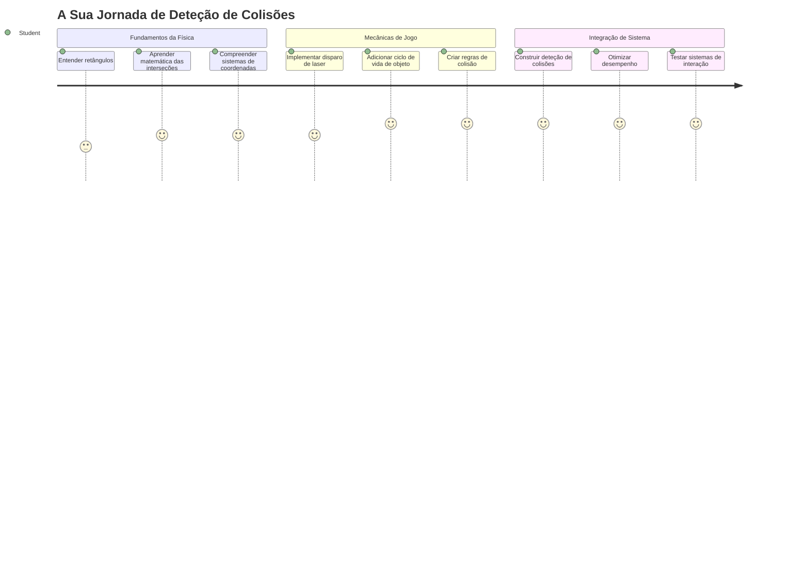
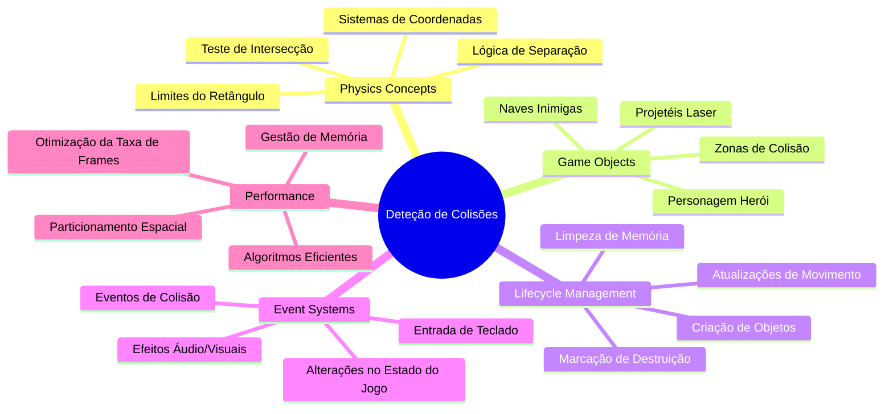
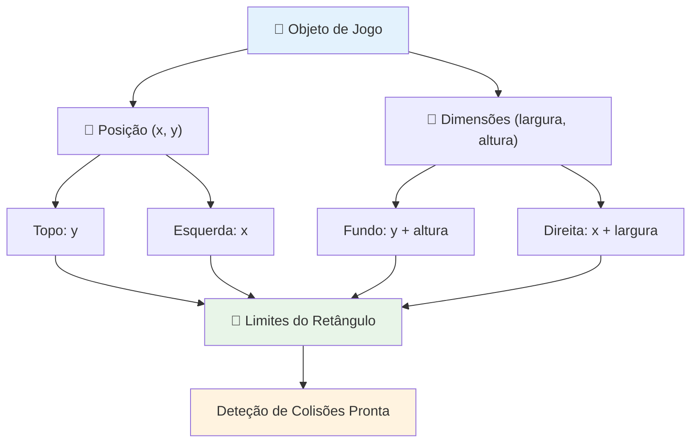
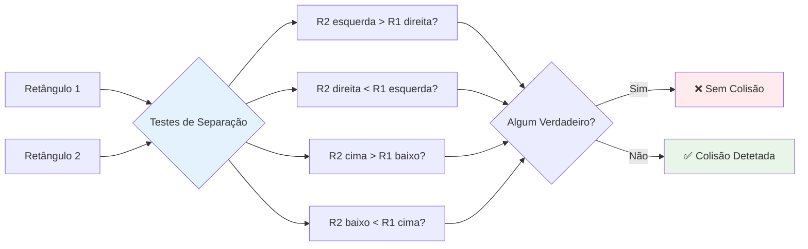
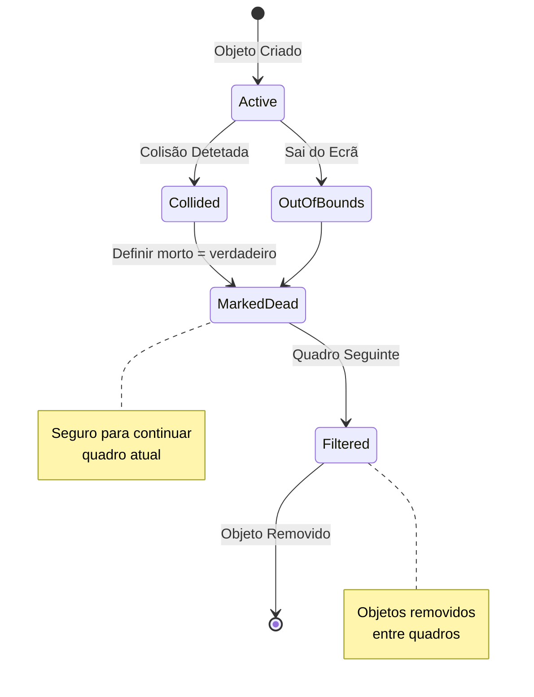
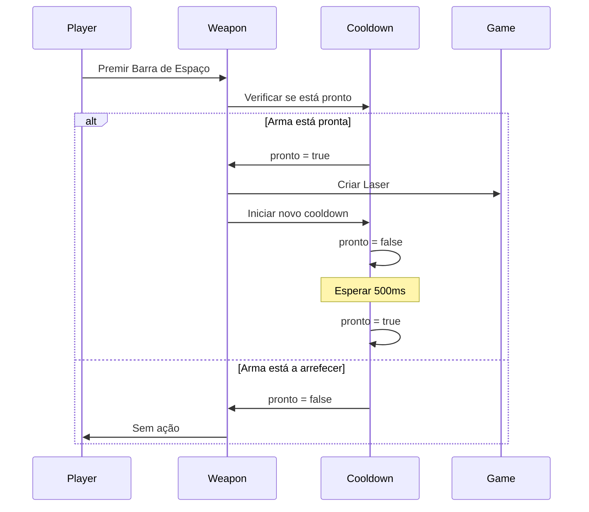
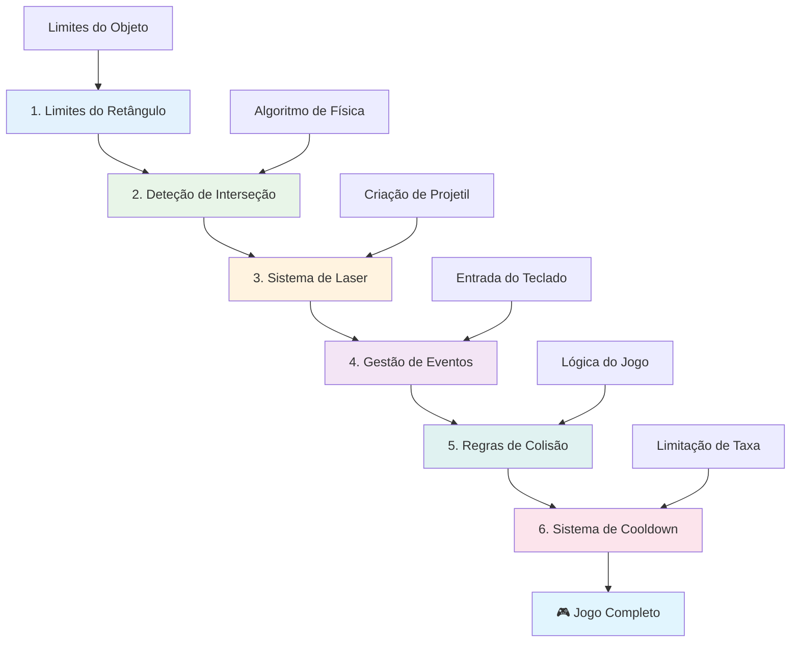
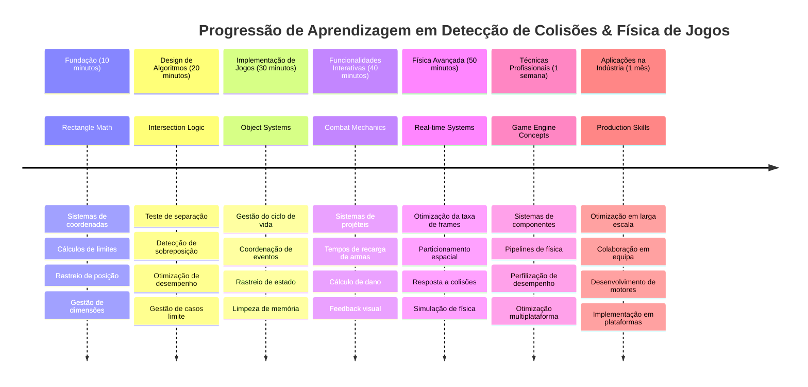

<!--
CO_OP_TRANSLATOR_METADATA:
{
  "original_hash": "039b4d8ce65f5edd82cf48d9c3e6728c",
  "translation_date": "2026-01-06T17:49:35+00:00",
  "source_file": "6-space-game/4-collision-detection/README.md",
  "language_code": "pt"
}
-->
# Construir um Jogo Espacial Parte 4: Adicionar um Laser e Detectar Colisões


## Questionário Pré-Aula

[Questionário pré-aula](https://ff-quizzes.netlify.app/web/quiz/35)

Pense no momento em Star Wars quando os torpedos de prótons do Luke acertam o porto de escape da Estrela da Morte. Essa detecção precisa de colisão mudou o destino da galáxia! Nos jogos, a detecção de colisão funciona da mesma forma - determina quando objetos interagem e o que acontece a seguir.

Nesta lição, vais adicionar armas laser ao teu jogo espacial e implementar a deteção de colisões. Tal como os planejadores de missão da NASA calculam as trajetórias das espaçonaves para evitar detritos, vais aprender a detectar quando os objetos do jogo se cruzam. Vamos dividir isto em passos geríveis que se constroem uns sobre os outros.

No final, terás um sistema de combate funcional onde lasers destroem inimigos e colisões desencadeiam eventos no jogo. Estes mesmos princípios de colisão são usados em tudo, desde simulações físicas até interfaces web interativas.


✅ Faz uma pequena pesquisa sobre o primeiro jogo de computador alguma vez criado. Qual era a sua funcionalidade?

## Deteção de colisão

A deteção de colisão funciona como os sensores de proximidade do módulo lunar Apollo - verifica constantemente as distâncias e dispara alertas quando os objetos ficam muito próximos. Nos jogos, este sistema determina quando os objetos interagem e o que deve acontecer a seguir.

A abordagem que vamos usar trata cada objeto do jogo como um retângulo, semelhante a como os sistemas de controlo de tráfego aéreo usam formas geométricas simplificadas para rastrear aeronaves. Este método retangular pode parecer básico, mas é computacionalmente eficiente e funciona bem para a maioria dos cenários de jogo.

### Representação do retângulo

Cada objeto do jogo precisa de limites coordenados, semelhante a como o rover Mars Pathfinder mapeou a sua localização na superfície marciana. Eis como definimos estas coordenadas limites:


```javascript
rectFromGameObject() {
  return {
    top: this.y,
    left: this.x,
    bottom: this.y + this.height,
    right: this.x + this.width
  }
}
```

**Vamos decompor isto:**
- **Borda superior**: É simplesmente onde o teu objeto começa verticalmente (a sua posição y)
- **Borda esquerda**: Onde começa horizontalmente (a sua posição x)
- **Borda inferior**: Soma a altura à posição y - agora sabes onde termina!
- **Borda direita**: Soma a largura à posição x - e tens o limite completo

### Algoritmo de interseção

Detetar interseções de retângulos usa uma lógica similar à do Telescópio Espacial Hubble ao determinar se objetos celestes estão sobrepostos no seu campo de visão. O algoritmo verifica separação:


```javascript
function intersectRect(r1, r2) {
  return !(r2.left > r1.right ||
    r2.right < r1.left ||
    r2.top > r1.bottom ||
    r2.bottom < r1.top);
}
```

**O teste de separação funciona como sistemas radar:**
- Está o retângulo 2 completamente à direita do retângulo 1?
- Está o retângulo 2 completamente à esquerda do retângulo 1?
- Está o retângulo 2 completamente abaixo do retângulo 1?
- Está o retângulo 2 completamente acima do retângulo 1?

Se nenhuma destas condições for verdadeira, os retângulos devem estar sobrepostos. Esta abordagem espelha como operadores de radar determinam se duas aeronaves estão a distâncias seguras.

## Gestão do ciclo de vida dos objetos

Quando um laser acerta num inimigo, ambos os objetos precisam ser removidos do jogo. No entanto, eliminar objetos no meio de um ciclo pode causar falhas - uma lição aprendida da forma difícil em sistemas de computador antigos como o Apollo Guidance Computer. Em vez disso, usamos uma abordagem de "marcar para eliminação" que remove os objetos com segurança entre frames.


Assim é como marcamos algo para remoção:

```javascript
// Marcar objeto para remoção
enemy.dead = true;
```

**Por que esta abordagem funciona:**
- Marcamos o objeto como "morto" mas não o apagamos imediatamente
- Isto permite que o frame atual do jogo termine em segurança
- Evita falhas por tentar usar algo que já desapareceu!

Depois, filtramos os objetos marcados antes do próximo ciclo de renderização:

```javascript
gameObjects = gameObjects.filter(go => !go.dead);
```

**O que esta filtragem faz:**
- Cria uma lista nova apenas com os objetos "vivos"
- Descarte tudo o que foi marcado como morto
- Mantém o teu jogo a correr suavemente
- Evita acumulação de objetos destruídos e aumento de memória

## Implementando a mecânica do laser

Os projéteis laser nos jogos funcionam pelo mesmo princípio dos torpedos de fótóns em Star Trek - são objetos discretos que viajam em linhas rectas até acertarem em algo. Cada pressão na tecla espaço cria um novo objeto laser que se move pelo ecrã.

Para isto funcionar, precisamos coordenar algumas peças diferentes:

**Componentes chave para implementar:**
- **Criar** objetos laser que aparecem na posição do herói
- **Gerir** a entrada do teclado para disparar a criação do laser
- **Controlar** o movimento e ciclo de vida do laser
- **Implementar** a representação visual dos projéteis laser

## Implementar controlo da taxa de disparo

Taxas ilimitadas de disparo sobrecarregariam o motor do jogo e tornariam a jogabilidade demasiado fácil. Sistemas de armas reais enfrentam restrições semelhantes - até os phasers da USS Enterprise precisavam de tempo para recarregar entre disparos.

Vamos implementar um sistema de cooldown que evita disparos em spam, mantendo o controlo responsivo:


```javascript
class Cooldown {
  constructor(time) {
    this.cool = false;
    setTimeout(() => {
      this.cool = true;
    }, time);
  }
}

class Weapon {
  constructor() {
    this.cooldown = null;
  }
  
  fire() {
    if (!this.cooldown || this.cooldown.cool) {
      // Criar projétil de laser
      this.cooldown = new Cooldown(500);
    } else {
      // A arma ainda está a arrefecer
    }
  }
}
```

**Como o cooldown funciona:**
- Quando criado, a arma começa "quente" (não pode disparar ainda)
- Após o período de timeout, fica "fria" (pronta para disparar)
- Antes de disparar, verificamos: "A arma está fria?"
- Isto previne cliques em spam enquanto mantém o controlo responsivo

✅ Consulta a lição 1 da série do jogo espacial para relembrar sobre cooldowns.

## Construir o sistema de colisão

Irás estender o código existente do teu jogo espacial para criar um sistema de deteção de colisões. Tal como o sistema automatizado da Estação Espacial Internacional para evitar colisões, o teu jogo vai monitorizar continuamente as posições dos objetos e reagir às interseções.

Começando com o código da lição anterior, vais adicionar deteção de colisões com regras específicas que governam as interações dos objetos.

> 💡 **Dica Profissional**: O sprite do laser já está incluído na tua pasta de assets e referenciado no teu código, pronto para implementação.

### Regras de colisão para implementar

**Mecânicas do jogo para adicionar:**
1. **Laser atinge inimigo**: O inimigo é destruído quando atingido por um projétil laser
2. **Laser atinge o limite do ecrã**: Laser é removido quando atinge a borda superior do ecrã
3. **Colisão entre inimigo e herói**: Ambos os objetos são destruídos quando se cruzam
4. **Inimigo atinge a parte inferior**: Condição de game over quando inimigos chegam ao fundo do ecrã

### 🔄 **Verificação Pedagógica**
**Fundamentos da Deteção de Colisão**: Antes de implementar, assegura que compreendes:
- ✅ Como os limites dos retângulos definem zonas de colisão
- ✅ Por que o teste de separação é mais eficiente que o cálculo de interseção
- ✅ A importância da gestão do ciclo de vida dos objetos nos loops do jogo
- ✅ Como sistemas orientados a eventos coordenam respostas de colisão

**Autoavaliação Rápida**: O que aconteceria se apagasses objetos imediatamente em vez de os marcares?
*Resposta: Apagar no meio do ciclo pode causar falhas ou saltar objetos na iteração*

**Compreensão Física**: Agora entendes:
- **Sistemas de Coordenadas**: Como posição e dimensões criam limites
- **Lógica de Interseção**: Princípios matemáticos por detrás da deteção de colisão
- **Otimização de Performance**: Por que algoritmos eficientes são importantes em sistemas em tempo real
- **Gestão de Memória**: Padrões seguros de ciclo de vida dos objetos para estabilidade

## Configurar o ambiente de desenvolvimento

Boas notícias - já preparamos a maior parte do trabalho para ti! Todos os teus assets do jogo e a estrutura básica estão na subpasta `your-work`, prontos para adicionares as funcionalidades fixas de colisão.

### Estrutura do projeto

```bash
-| assets
  -| enemyShip.png
  -| player.png
  -| laserRed.png
-| index.html
-| app.js
-| package.json
```

**Compreender a estrutura dos ficheiros:**
- **Contém** todas as imagens dos sprites necessárias para os objetos do jogo
- **Inclui** o documento HTML principal e o ficheiro da aplicação JavaScript
- **Fornece** a configuração do package para o servidor de desenvolvimento local

### Iniciar o servidor de desenvolvimento

Navega até à pasta do teu projeto e inicia o servidor local:

```bash
cd your-work
npm start
```

**Esta sequência de comandos:**
- **Muda** o diretório para a pasta do projeto onde estás a trabalhar
- **Inicia** um servidor HTTP local em `http://localhost:5000`
- **Serve** os teus ficheiros do jogo para teste e desenvolvimento
- **Permite** desenvolvimento em tempo real com recarregamentos automáticos

Abre o navegador e acede a `http://localhost:5000` para veres o estado atual do jogo com o herói e inimigos renderizados no ecrã.

### Implementação passo a passo

Como a abordagem sistemática que a NASA usou para programar a espaçonave Voyager, vamos implementar a deteção de colisão metodicamente, construindo cada componente passo a passo.


#### 1. Adicionar limites de colisão em retângulo

Primeiro, vamos ensinar os nossos objetos do jogo a descrever os seus limites. Adiciona este método à tua classe `GameObject`:

```javascript
rectFromGameObject() {
    return {
      top: this.y,
      left: this.x,
      bottom: this.y + this.height,
      right: this.x + this.width,
    };
  }
```

**Este método realiza:**
- **Cria** um objeto retângulo com coordenadas de limites precisas
- **Calcula** as bordas inferior e direita usando posição mais dimensões
- **Devolve** um objeto pronto para os algoritmos de deteção de colisão
- **Fornece** uma interface padronizada para todos os objetos do jogo

#### 2. Implementar deteção de interseção

Agora vamos criar o nosso detetor de colisões - uma função que sabe quando dois retângulos estão sobrepostos:

```javascript
function intersectRect(r1, r2) {
  return !(
    r2.left > r1.right ||
    r2.right < r1.left ||
    r2.top > r1.bottom ||
    r2.bottom < r1.top
  );
}
```

**Este algoritmo funciona:**
- **Testa** quatro condições de separação entre os retângulos
- **Devolve** `false` se qualquer condição de separação for verdadeira
- **Indica** colisão quando não existe separação
- **Usa** lógica de negação para teste eficiente de interseção

#### 3. Implementar sistema de disparo do laser

Aqui é que as coisas ficam empolgantes! Vamos configurar o sistema de disparo do laser.

##### Constantes de mensagens

Primeiro, define alguns tipos de mensagens para que diferentes partes do jogo possam comunicar entre si:

```javascript
KEY_EVENT_SPACE: "KEY_EVENT_SPACE",
COLLISION_ENEMY_LASER: "COLLISION_ENEMY_LASER",
COLLISION_ENEMY_HERO: "COLLISION_ENEMY_HERO",
```

**Estas constantes fornecem:**
- **Padronizam** nomes de eventos por toda a aplicação
- **Permitem** comunicação consistente entre sistemas do jogo
- **Previnem** erros de digitação no registo de eventos

##### Tratamento da entrada do teclado

Adiciona deteção da tecla espaço no teu listener de eventos de tecla:

```javascript
} else if(evt.keyCode === 32) {
  eventEmitter.emit(Messages.KEY_EVENT_SPACE);
}
```

**Este handler de entrada:**
- **Detecta** a pressão da tecla espaço usando keyCode 32
- **Emite** uma mensagem de evento padronizada
- **Permite** lógica de disparo desacoplada

##### Configuração do listener de eventos

Regista o comportamento de disparo na tua função `initGame()`:

```javascript
eventEmitter.on(Messages.KEY_EVENT_SPACE, () => {
 if (hero.canFire()) {
   hero.fire();
 }
});
```

**Este listener de evento:**
- **Responde** a eventos da tecla espaço
- **Verifica** o estado do cooldown para disparo
- **Dispara** a criação do laser quando permitido

Adiciona manipulação de colisão para interações entre laser e inimigo:

```javascript
eventEmitter.on(Messages.COLLISION_ENEMY_LASER, (_, { first, second }) => {
  first.dead = true;
  second.dead = true;
});
```

**Este handler de colisão:**
- **Recebe** dados do evento de colisão com ambos os objetos
- **Marca** ambos os objetos para remoção
- **Garante** limpeza adequada após colisão

#### 4. Criar a classe Laser

Implementa um projétil laser que move para cima e gere o seu próprio ciclo de vida:

```javascript
class Laser extends GameObject {
  constructor(x, y) {
    super(x, y);
    this.width = 9;
    this.height = 33;
    this.type = 'Laser';
    this.img = laserImg;
    
    let id = setInterval(() => {
      if (this.y > 0) {
        this.y -= 15;
      } else {
        this.dead = true;
        clearInterval(id);
      }
    }, 100);
  }
}
```

**Esta implementação da classe:**
- **Estende** GameObject para herdar funcionalidade base
- **Define** dimensões apropriadas para o sprite laser
- **Cria** movimento automático ascendente usando `setInterval()`
- **Gere** autodestruição ao atingir o topo do ecrã
- **Controla** temporização de animação e limpeza própria

#### 5. Implementar sistema de deteção de colisão

Cria uma função abrangente de deteção de colisão:

```javascript
function updateGameObjects() {
  const enemies = gameObjects.filter(go => go.type === 'Enemy');
  const lasers = gameObjects.filter(go => go.type === "Laser");
  
  // Testar colisões entre laser e inimigo
  lasers.forEach((laser) => {
    enemies.forEach((enemy) => {
      if (intersectRect(laser.rectFromGameObject(), enemy.rectFromGameObject())) {
        eventEmitter.emit(Messages.COLLISION_ENEMY_LASER, {
          first: laser,
          second: enemy,
        });
      }
    });
  });

  // Remover objetos destruídos
  gameObjects = gameObjects.filter(go => !go.dead);
}
```

**Este sistema de colisão:**
- **Filtra** os objetos de jogo por tipo para testes eficientes
- **Testa** cada laser contra cada inimigo para interseções
- **Emite** eventos de colisão quando as interseções são detetadas
- **Limpa** objetos destruídos após o processamento da colisão

> ⚠️ **Importante**: Adiciona `updateGameObjects()` ao teu loop principal do jogo em `window.onload` para ativar a deteção de colisão.

#### 6. Adicionar sistema de cooldown à classe Hero

Melhora a classe Hero com mecânicas de disparo e limitação da taxa de disparo:

```javascript
class Hero extends GameObject {
  constructor(x, y) {
    super(x, y);
    this.width = 99;
    this.height = 75;
    this.type = "Hero";
    this.speed = { x: 0, y: 0 };
    this.cooldown = 0;
  }
  
  fire() {
    gameObjects.push(new Laser(this.x + 45, this.y - 10));
    this.cooldown = 500;

    let id = setInterval(() => {
      if (this.cooldown > 0) {
        this.cooldown -= 100;
      } else {
        clearInterval(id);
      }
    }, 200);
  }
  
  canFire() {
    return this.cooldown === 0;
  }
}
```

**Compreendendo a classe Hero melhorada:**
- **Inicializa** o temporizador de cooldown a zero (pronto para disparar)
- **Cria** objetos laser posicionados acima da nave do herói
- **Define** o período de cooldown para evitar disparos rápidos
- **Decrementa** o temporizador de cooldown usando atualizações baseadas em intervalos
- **Fornece** verificação do estado de disparo através do método `canFire()`

### 🔄 **Verificação Pedagógica**
**Compreensão Completa do Sistema**: Verifica o teu domínio do sistema de colisão:
- ✅ Como os limites dos retângulos permitem deteção eficiente de colisão?
- ✅ Por que a gestão do ciclo de vida dos objetos é crítica para a estabilidade do jogo?
- ✅ Como o sistema de cooldown previne problemas de performance?
- ✅ Que papel tem a arquitetura orientada a eventos na gestão das colisões?

**Integração do Sistema**: A tua deteção de colisão demonstra:
- **Precisão Matemática**: Algoritmos de interseção de retângulos
- **Otimização de Performance**: Padrões eficientes para teste de colisão
- **Gestão de Memória**: Criação e destruição segura de objetos
- **Coordenação de Eventos**: Comunicação desacoplada do sistema
- **Processamento em Tempo Real**: Ciclos de atualização baseados em frames

**Padrões Profissionais**: Implementaste:
- **Separação de Responsabilidades**: Física, renderização e input separados
- **Design Orientado a Objetos**: Herança e polimorfismo
- **Gestão de Estado**: Ciclo de vida do objeto e rastreio do estado do jogo
- **Otimização de Performance**: Algoritmos eficientes para uso em tempo real

### Testar a tua implementação

O teu jogo espacial agora inclui deteção completa de colisões e mecânicas de combate. 🚀 Testa estas novas funcionalidades:
- **Move-te** com as setas para verificar os controlos de movimento
- **Dispara lasers** com a tecla espaço – nota como o cooldown previne spam de cliques
- **Observa colisões** quando os lasers atingem inimigos, desencadeando remoção
- **Confirma limpeza** à medida que objetos destruídos desaparecem do jogo

Conseguiste implementar com sucesso um sistema de deteção de colisões usando os mesmos princípios matemáticos que guiam a navegação espacial e a robótica.

### ⚡ **O Que Podes Fazer Nos Próximos 5 Minutos**
- [ ] Abre as Ferramentas de Desenvolvedor do navegador e coloca breakpoints na tua função de deteção de colisões
- [ ] Tenta modificar a velocidade do laser ou o movimento dos inimigos para ver os efeitos da colisão
- [ ] Experimenta valores diferentes de cooldown para testar as taxas de disparo
- [ ] Adicionar instruções `console.log` para rastrear eventos de colisão em tempo real

### 🎯 **O que pode realizar nesta hora**
- [ ] Completar o questionário pós-aula e compreender algoritmos de deteção de colisão
- [ ] Adicionar efeitos visuais como explosões quando ocorrem colisões
- [ ] Implementar diferentes tipos de projéteis com propriedades variadas
- [ ] Criar power-ups que aumentem temporariamente as habilidades do jogador
- [ ] Adicionar efeitos sonoros para tornar as colisões mais satisfatórias

### 📅 **A sua programação física para uma semana**
- [ ] Completar o jogo espacial completo com sistemas de colisão aperfeiçoados
- [ ] Implementar formas de colisão avançadas além de retângulos (círculos, polígonos)
- [ ] Adicionar sistemas de partículas para efeitos realistas de explosão
- [ ] Criar comportamentos complexos dos inimigos com evasão de colisões
- [ ] Otimizar a deteção de colisão para melhor desempenho com muitos objetos
- [ ] Adicionar simulação física como momento e movimento realista

### 🌟 **O domínio da física de jogos para um mês**
- [ ] Construir jogos com motores físicos avançados e simulações realistas
- [ ] Aprender deteção de colisão 3D e algoritmos de partição espacial
- [ ] Contribuir para bibliotecas físicas open source e motores de jogos
- [ ] Dominar otimização de desempenho para aplicações gráficas intensivas
- [ ] Criar conteúdos educativos sobre física de jogos e deteção de colisão
- [ ] Construir um portefólio mostrando competências avançadas em programação física

## 🎯 O seu calendário para domínio da deteção de colisão


### 🛠️ Resumo da sua caixa de ferramentas de física para jogos

Após completar esta aula, agora dominou:
- **Matemática da Colisão**: Algoritmos de interseção de retângulos e sistemas de coordenadas
- **Otimização de Desempenho**: Deteção de colisão eficiente para aplicações em tempo real
- **Gestão do Ciclo de Vida do Objeto**: Padrões seguros de criação, atualização e destruição
- **Arquitetura Orientada a Eventos**: Sistemas desacoplados para resposta a colisões
- **Integração no Ciclo do Jogo**: Atualizações físicas baseadas em frames e coordenação de renderização
- **Sistemas de Entrada**: Controlo responsivo com limitação de taxa e feedback
- **Gestão de Memória**: Pooling eficiente de objetos e estratégias de limpeza

**Aplicações no Mundo Real**: As suas competências em deteção de colisão aplicam-se diretamente a:
- **Simulações Interativas**: Modelação científica e ferramentas educativas
- **Design de Interfaces**: Interações drag-and-drop e deteção de toque
- **Visualização de Dados**: Gráficos interativos e elementos clicáveis
- **Desenvolvimento Móvel**: Reconhecimento de gestos tácteis e gestão de colisões
- **Programação Robótica**: Planeamento de trajetórias e evasão de obstáculos
- **Computação Gráfica**: Ray tracing e algoritmos espaciais

**Competências Profissionais Adquiridas**: Agora pode:
- **Desenhar** algoritmos eficientes para deteção de colisões em tempo real
- **Implementar** sistemas físicos que escalam com a complexidade dos objetos
- **Depurar** sistemas de interação complexos usando princípios matemáticos
- **Otimizar** desempenho para diferentes hardwares e capacidades de browser
- **Projetar** sistemas de jogos manuteníveis usando padrões de design comprovados

**Conceitos de Desenvolvimento de Jogos Dominados**:
- **Simulação Física**: Deteção e resposta de colisão em tempo real
- **Engenharia de Desempenho**: Algoritmos otimizados para aplicações interativas
- **Sistemas de Eventos**: Comunicação desacoplada entre componentes do jogo
- **Gestão de Objetos**: Padrões eficazes de ciclo de vida para conteúdos dinâmicos
- **Gestão de Entrada**: Controlo responsivo com feedback apropriado

**Próximo Nível**: Está preparado para explorar motores físicos avançados como Matter.js, implementar deteção de colisões 3D ou criar sistemas complexos de partículas!

🌟 **Conquista Desbloqueada**: Construiu um sistema completo de interação baseado em física com deteção de colisão profissional!

## Desafio do GitHub Copilot Agent 🚀

Use o modo Agent para completar o seguinte desafio:

**Descrição:** Melhore o sistema de deteção de colisão implementando power-ups que surgem aleatoriamente e oferecem habilidades temporárias quando recolhidos pela nave herói.

**Prompt:** Crie uma classe PowerUp que estenda GameObject e implemente a deteção de colisão entre o herói e os power-ups. Adicione pelo menos dois tipos de power-ups: um que aumenta a cadência de tiro (reduz o cooldown) e outro que cria um escudo temporário. Inclua lógica de geração que crie power-ups em intervalos e posições aleatórias.

---


## 🚀 Desafio

Adicione uma explosão! Veja os recursos do jogo em [o repositório Space Art](../../../../6-space-game/solution/spaceArt/readme.txt) e tente adicionar uma explosão quando o laser atinge um alienígena

## Questionário Pós-Aula

[Questionário pós-aula](https://ff-quizzes.netlify.app/web/quiz/36)

## Revisão e Autoestudo

Experimente os intervalos no seu jogo até agora. O que acontece quando os altera? Leia mais sobre [eventos de temporização em JavaScript](https://www.freecodecamp.org/news/javascript-timing-events-settimeout-and-setinterval/).

## Tarefa

[Explore colisões](assignment.md)

---

<!-- CO-OP TRANSLATOR DISCLAIMER START -->
**Aviso Legal**:
Este documento foi traduzido utilizando o serviço de tradução por IA [Co-op Translator](https://github.com/Azure/co-op-translator). Embora nos esforcemos por garantir a precisão, deve-se ter em conta que traduções automáticas podem conter erros ou imprecisões. O documento original na sua língua nativa deve ser considerado a fonte autorizada. Para informações críticas, recomenda-se tradução profissional humana. Não nos responsabilizamos por quaisquer mal-entendidos ou interpretações erradas decorrentes da utilização desta tradução.
<!-- CO-OP TRANSLATOR DISCLAIMER END -->