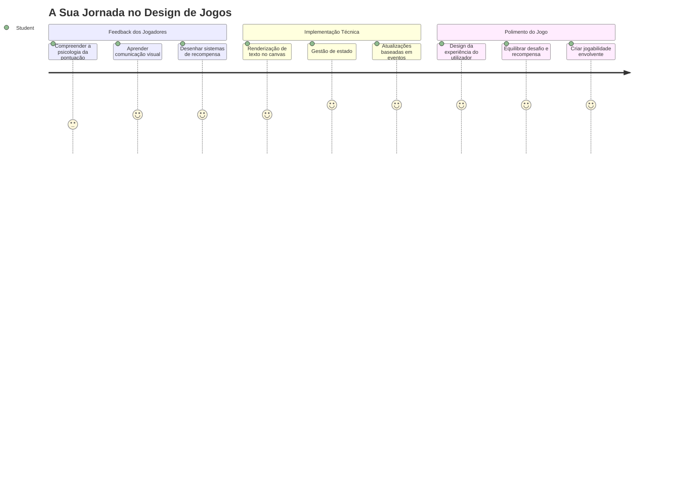
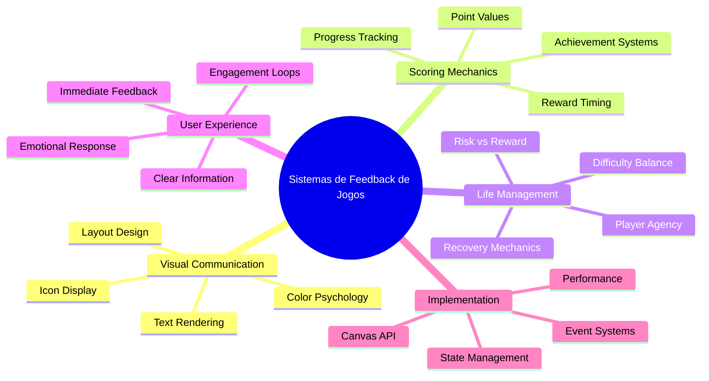
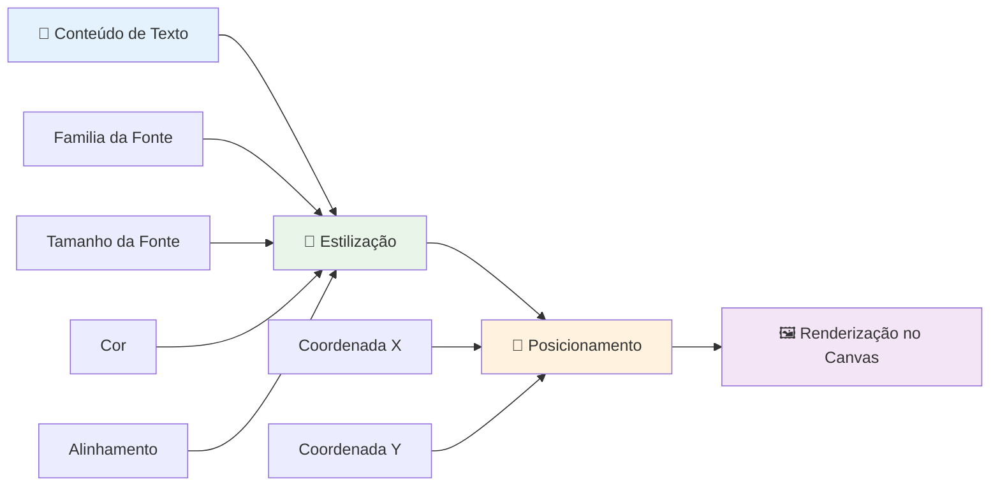
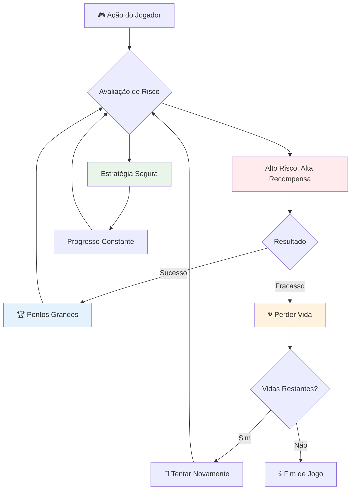
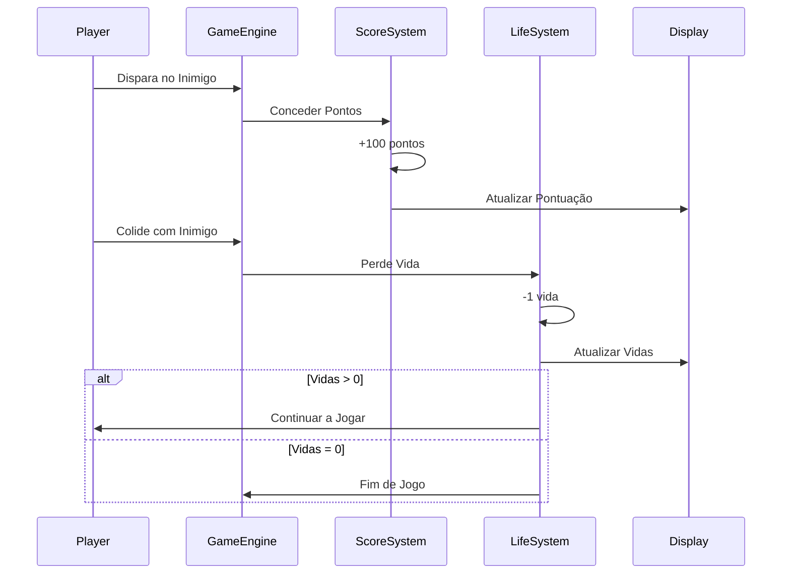
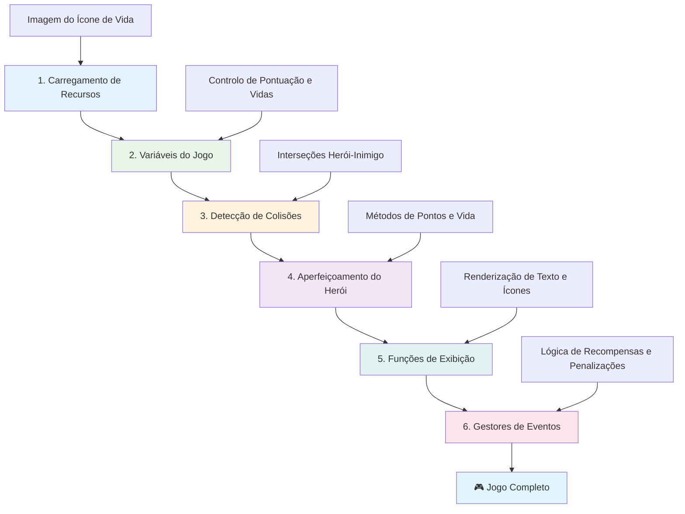
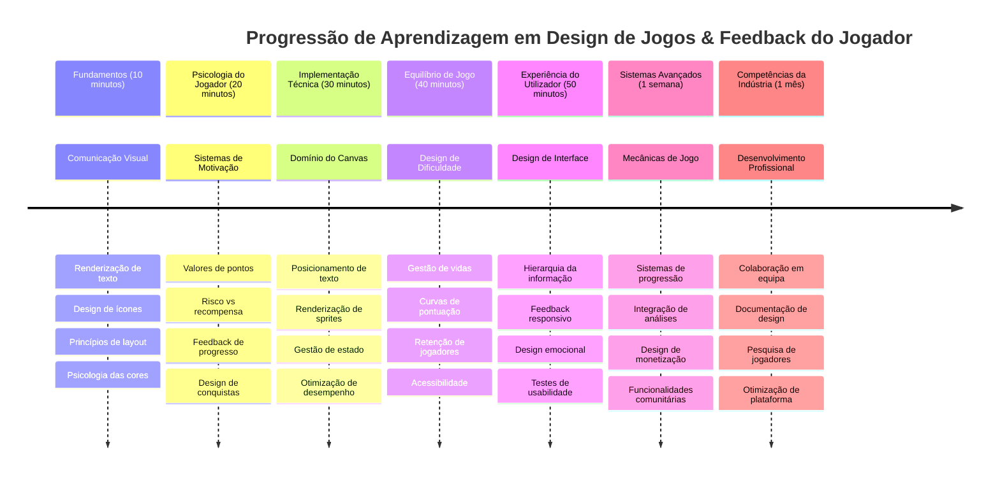

<!--
CO_OP_TRANSLATOR_METADATA:
{
  "original_hash": "2ed9145a16cf576faa2a973dff84d099",
  "translation_date": "2026-01-06T17:55:09+00:00",
  "source_file": "6-space-game/5-keeping-score/README.md",
  "language_code": "pt"
}
-->
# Construir um Jogo Espacial Parte 5: Pontuação e Vidas


## Questionário Pré-Aula

[Questionário pré-aula](https://ff-quizzes.netlify.app/web/quiz/37)

Pronto para fazer o teu jogo espacial parecer um jogo a sério? Vamos adicionar pontos de pontuação e gerir vidas - os mecanismos essenciais que transformaram os primeiros jogos arcade como Space Invaders de simples demonstrações em entretenimento viciante. É aqui que o teu jogo se torna verdadeiramente jogável.


## Desenhar Texto no Ecrã - A Voz do Teu Jogo

Para mostrar a tua pontuação, precisamos de aprender a renderizar texto no canvas. O método `fillText()` é a tua ferramenta principal para isto - é a mesma técnica usada nos clássicos jogos arcade para mostrar pontuações e informações de estado.


Tens controlo total sobre a aparência do texto:

```javascript
ctx.font = "30px Arial";
ctx.fillStyle = "red";
ctx.textAlign = "right";
ctx.fillText("show this on the screen", 0, 0);
```

✅ Mergulha mais fundo em [adicionar texto a um canvas](https://developer.mozilla.org/docs/Web/API/Canvas_API/Tutorial/Drawing_text) - podes ficar surpreendido com a criatividade que podes ter com fontes e estilos!

## Vidas - Mais do que Apenas um Número

No design de jogos, uma "vida" representa a margem de erro do jogador. Este conceito remonta às máquinas de pinball, onde tinhas múltiplas bolas para jogar. Nos primeiros videojogos como Asteroids, as vidas davam aos jogadores permissão para correr riscos e aprender com os erros.


A representação visual é muito importante - mostrar ícones de navios em vez de apenas "Vidas: 3" cria reconhecimento visual imediato, semelhante a como os primeiros armários arcade usavam iconografia para comunicar além das barreiras linguísticas.

## Construir o Sistema de Recompensas do Teu Jogo

Agora vamos implementar os sistemas de feedback principais que mantêm os jogadores envolvidos:


- **Sistema de pontuação**: Cada nave inimiga destruída atribui 100 pontos (números arredondados são mais fáceis para os jogadores calcularem mentalmente). A pontuação é mostrada no canto inferior esquerdo.
- **Contador de vidas**: O teu herói começa com três vidas - um padrão estabelecido pelos primeiros jogos arcade para equilibrar desafio e jogabilidade. Cada colisão com um inimigo custa uma vida. Vamos mostrar as vidas restantes no canto inferior direito usando ícones de navio .

## Vamos Construir!

Primeiro, prepara o teu espaço de trabalho. Navega até às ficheiros na tua subpasta `your-work`. Deves ver estes ficheiros:

```bash
-| assets
  -| enemyShip.png
  -| player.png
  -| laserRed.png
-| index.html
-| app.js
-| package.json
```

Para testar o teu jogo, inicia o servidor de desenvolvimento a partir da pasta `your_work`:

```bash
cd your-work
npm start
```

Isto executa um servidor local em `http://localhost:5000`. Abre este endereço no teu navegador para ver o teu jogo. Testa os controlos com as teclas de setas e tenta disparar contra os inimigos para verificar que tudo funciona.


### Hora de Codificar!

1. **Pega nos ativos visuais que vais precisar**. Copia o ativo `life.png` da pasta `solution/assets/` para a tua pasta `your-work`. Depois adiciona o lifeImg à tua função window.onload: 

    ```javascript
    lifeImg = await loadTexture("assets/life.png");
    ```

1. Não te esqueças de adicionar o `lifeImg` à tua lista de ativos:

    ```javascript
    let heroImg,
    ...
    lifeImg,
    ...
    eventEmitter = new EventEmitter();
    ```
  
2. **Configura as variáveis do jogo**. Adiciona algum código para acompanhar a tua pontuação total (começando em 0) e as vidas restantes (começando em 3). Vamos mostrar estes valores no ecrã para que os jogadores saibam sempre onde estão.

3. **Implementa a deteção de colisões**. Estende a tua função `updateGameObjects()` para detetar quando os inimigos colidem com o teu herói:

    ```javascript
    enemies.forEach(enemy => {
        const heroRect = hero.rectFromGameObject();
        if (intersectRect(heroRect, enemy.rectFromGameObject())) {
          eventEmitter.emit(Messages.COLLISION_ENEMY_HERO, { enemy });
        }
      })
    ```

4. **Adiciona o acompanhamento de vidas e pontos ao teu Herói**. 
   1. **Inicializa os contadores**. Por baixo de `this.cooldown = 0` na tua classe `Hero`, configura vidas e pontos:

        ```javascript
        this.life = 3;
        this.points = 0;
        ```

   1. **Mostra estes valores ao jogador**. Cria funções para desenhar estes valores no ecrã:

        ```javascript
        function drawLife() {
          // FAZER, 35, 27
          const START_POS = canvas.width - 180;
          for(let i=0; i < hero.life; i++ ) {
            ctx.drawImage(
              lifeImg, 
              START_POS + (45 * (i+1) ), 
              canvas.height - 37);
          }
        }
        
        function drawPoints() {
          ctx.font = "30px Arial";
          ctx.fillStyle = "red";
          ctx.textAlign = "left";
          drawText("Points: " + hero.points, 10, canvas.height-20);
        }
        
        function drawText(message, x, y) {
          ctx.fillText(message, x, y);
        }

        ```

   1. **Encaixa tudo no teu ciclo de jogo**. Adiciona estas funções à tua função window.onload logo a seguir a `updateGameObjects()`:

        ```javascript
        drawPoints();
        drawLife();
        ```

### 🔄 **Verificação Pedagógica**
**Compreensão do Design de Jogos**: Antes de implementares consequências, certifica-te que compreendes:
- ✅ Como o feedback visual comunica o estado do jogo aos jogadores
- ✅ Por que a colocação consistente dos elementos da UI melhora a usabilidade
- ✅ A psicologia por trás dos valores de pontos e gestão de vidas
- ✅ Como a renderização de texto em canvas difere do texto em HTML

**Autoavaliação Rápida**: Por que é que os jogos arcade normalmente usam números arredondados para os valores de pontos?
*Resposta: Números arredondados são mais fáceis para os jogadores calcularem mentalmente e criam recompensas psicológicas satisfatórias*

**Princípios de Experiência do Usuário**: Agora estás a aplicar:
- **Hierarquia Visual**: Informação importante posicionada em destaque
- **Feedback Imediato**: Atualizações em tempo real para as ações do jogador
- **Carga Cognitiva**: Apresentação simples e clara da informação
- **Design Emocional**: Ícones e cores que criam ligação com o jogador

1. **Implementar consequências e recompensas do jogo**. Agora iremos adicionar os sistemas de feedback que tornam as ações do jogador significativas:

   1. **Colisões custam vidas**. Sempre que o teu herói colidir com um inimigo, deves perder uma vida.
   
      Adiciona este método à tua classe `Hero`:

        ```javascript
        decrementLife() {
          this.life--;
          if (this.life === 0) {
            this.dead = true;
          }
        }
        ```

   2. **Disparar aos inimigos vale pontos**. Cada acerto bem-sucedido atribui 100 pontos, proporcionando feedback positivo imediato para tiros precisos.

      Estende a tua classe Hero com este método de incremento:
    
        ```javascript
          incrementPoints() {
            this.points += 100;
          }
        ```

        Agora liga estas funções aos eventos de colisão:

        ```javascript
        eventEmitter.on(Messages.COLLISION_ENEMY_LASER, (_, { first, second }) => {
           first.dead = true;
           second.dead = true;
           hero.incrementPoints();
        })

        eventEmitter.on(Messages.COLLISION_ENEMY_HERO, (_, { enemy }) => {
           enemy.dead = true;
           hero.decrementLife();
        });
        ```

✅ Curioso sobre outros jogos construídos com JavaScript e Canvas? Explora um pouco - podes ficar surpreendido com o que é possível!

Depois de implementar estas funcionalidades, testa o teu jogo para ver o sistema completo de feedback em ação. Deves ver ícones de vida no canto inferior direito, a tua pontuação no canto inferior esquerdo, e observar como as colisões reduzem vidas enquanto os tiros bem-sucedidos aumentam a tua pontuação.

O teu jogo agora tem os mecanismos essenciais que tornaram os primeiros jogos arcade tão cativantes - objetivos claros, feedback imediato e consequências significativas para as ações do jogador.

### 🔄 **Verificação Pedagógica**
**Sistema Completo de Design de Jogos**: Verifica o teu domínio dos sistemas de feedback ao jogador:
- ✅ Como é que os mecanismos de pontuação criam motivação e envolvimento?
- ✅ Por que é importante a consistência visual no design da interface do utilizador?
- ✅ Como é que o sistema de vidas equilibra desafio com retenção do jogador?
- ✅ Que papel desempenha o feedback imediato na criação de jogabilidade satisfatória?

**Integração do Sistema**: O teu sistema de feedback demonstra:
- **Design de Experiência do Utilizador**: Comunicação visual clara e hierarquia da informação
- **Arquitetura Orientada a Eventos**: Atualizações responsivas às ações do jogador
- **Gestão de Estado**: Acompanhamento e visualização de dados dinâmicos do jogo
- **Dominância do Canvas**: Renderização de texto e posicionamento de sprites
- **Psicologia dos Jogos**: Compreensão da motivação e envolvimento do jogador

**Padrões Profissionais**: Implementaste:
- **Arquitetura MVC**: Separação da lógica do jogo, dados e apresentação
- **Padrão Observer**: Atualizações orientadas a eventos para mudanças no estado do jogo
- **Design de Componentes**: Funções reutilizáveis para renderização e lógica
- **Otimização de Performance**: Renderização eficiente em ciclos de jogo

### ⚡ **O Que Podes Fazer Nos Próximos 5 Minutos**
- [ ] Experimentar diferentes tamanhos e cores de fonte para a visualização da pontuação
- [ ] Tentar alterar os valores dos pontos e ver como isso afeta a sensação do jogo
- [ ] Adicionar declarações console.log para acompanhar quando os pontos e vidas mudam
- [ ] Testar casos extremos como ficar sem vidas ou alcançar pontuações altas

### 🎯 **O Que Podes Concluir Nesta Hora**
- [ ] Completar o questionário pós-aula e compreender a psicologia do design de jogos
- [ ] Adicionar efeitos sonoros para pontuação e perda de vidas
- [ ] Implementar um sistema de pontuação máxima usando localStorage
- [ ] Criar diferentes valores de pontos para diferentes tipos de inimigos
- [ ] Adicionar efeitos visuais como tremor de ecrã ao perder uma vida

### 📅 **A Tua Jornada de Design de Jogos de Uma Semana**
- [ ] Completar o jogo espacial completo com sistemas de feedback polidos
- [ ] Implementar mecânicas avançadas de pontuação como multiplicadores de combos
- [ ] Adicionar conquistas e conteúdo desbloqueável
- [ ] Criar progressão de dificuldade e sistemas de equilíbrio
- [ ] Design de interfaces de utilizador para menus e ecrãs de fim de jogo
- [ ] Estudar outros jogos para entender mecanismos de envolvimento

### 🌟 **A Tua Mestria em Desenvolvimento de Jogos de Um Mês**
- [ ] Construir jogos completos com sistemas sofisticados de progressão
- [ ] Aprender análises de jogos e medição de comportamento do jogador
- [ ] Contribuir para projetos open source de desenvolvimento de jogos
- [ ] Dominar padrões avançados de design de jogos e monetização
- [ ] Criar conteúdo educativo sobre design de jogos e experiência de utilizador
- [ ] Construir um portfólio demonstrando habilidades de design e desenvolvimento de jogos

## 🎯 O Teu Calendário de Mestria em Design de Jogos


### 🛠️ Resumo da Tua Caixa de Ferramentas de Design de Jogos

Após completares esta aula, já dominaste:
- **Psicologia do Jogador**: Compreender motivação, risco/recompensa e ciclos de envolvimento
- **Comunicação Visual**: Design eficaz da UI usando texto, ícones e layout
- **Sistemas de Feedback**: Resposta em tempo real às ações do jogador e eventos do jogo
- **Gestão de Estado**: Acompanhamento e visualização eficiente de dados dinâmicos do jogo
- **Renderização de Texto no Canvas**: Exibição profissional de texto com estilo e posicionamento
- **Integração de Eventos**: Ligação das ações do utilizador a consequências significativas no jogo
- **Equilíbrio do Jogo**: Design de curvas de dificuldade e sistemas de progressão do jogador

**Aplicações no Mundo Real**: As tuas competências em design de jogos aplicam-se diretamente a:
- **Design de Interface de Utilizador**: Criação de interfaces envolventes e intuitivas
- **Desenvolvimento de Produto**: Compreensão da motivação do utilizador e ciclos de feedback
- **Tecnologia Educacional**: Gamificação e sistemas de envolvimento na aprendizagem
- **Visualização de Dados**: Tornar informação complexa acessível e envolvente
- **Desenvolvimento de Apps Móveis**: Mecânicas de retenção e design de experiência do utilizador
- **Tecnologia de Marketing**: Compreensão do comportamento do utilizador e otimização de conversão

**Competências Profissionais Adquiridas**: Agora podes:
- **Desenhar** experiências de utilizador que motivam e envolvem utilizadores
- **Implementar** sistemas de feedback que guiam o comportamento do utilizador eficazmente
- **Equilibrar** desafio e acessibilidade em sistemas interativos
- **Criar** comunicação visual que funcione em diferentes grupos de utilizadores
- **Analisar** comportamento do utilizador e iterar melhorias no design

**Conceitos de Desenvolvimento de Jogos Dominados**:
- **Motivação do Jogador**: Compreender o que impulsiona o envolvimento e retenção
- **Design Visual**: Criar interfaces claras, atrativas e funcionais
- **Integração de Sistemas**: Conectar múltiplos sistemas do jogo para experiência coesa
- **Otimização de Performance**: Renderização e gestão de estado eficiente
- **Acessibilidade**: Design para diferentes níveis de habilidade e necessidades do jogador

**Próximo Nível**: Estás pronto para explorar padrões avançados de design de jogos, implementar sistemas de análise ou estudar monetização e estratégias de retenção do jogador!

🌟 **Conquista Desbloqueada**: Construíste um sistema completo de feedback ao jogador com princípios profissionais de design de jogos!

---

## Desafio GitHub Copilot Agent 🚀

Usa o modo Agente para completar o seguinte desafio:

**Descrição:** Melhora o sistema de pontuação do jogo espacial implementando uma funcionalidade de pontuação máxima com armazenamento persistente e mecânicas de pontuação extra.

**Prompt:** Cria um sistema de pontuação máxima que salva a melhor pontuação do jogador no localStorage. Adiciona pontos de bónus para mortes consecutivas de inimigos (sistema de combo) e implementa diferentes valores de pontos para diferentes tipos de inimigos. Inclui um indicador visual quando o jogador atinge uma nova pontuação máxima e mostra a pontuação máxima atual no ecrã do jogo.


## 🚀 Desafio

Agora tens um jogo funcional com pontuação e vidas. Considera que funcionalidades adicionais podem melhorar a experiência do jogador.

## Questionário Pós-Aula

[Questionário pós-aula](https://ff-quizzes.netlify.app/web/quiz/38)

## Revisão & Estudo Independente

Quer explorar mais? Pesquisa diferentes abordagens a sistemas de pontuação e vidas em jogos. Existem motores de jogo fascinantes como [PlayFab](https://playfab.com) que gerem pontuações, quadros de líderes e progressão do jogador. Como integração de algo assim poderia levar o teu jogo ao próximo nível?

## Tarefa

[Construir um Jogo de Pontuação](assignment.md)

---

<!-- CO-OP TRANSLATOR DISCLAIMER START -->
**Aviso Legal**:
Este documento foi traduzido utilizando o serviço de tradução automática [Co-op Translator](https://github.com/Azure/co-op-translator). Embora nos esforcemos por garantir a precisão, por favor tenha em conta que traduções automáticas podem conter erros ou imprecisões. O documento original na sua língua nativa deve ser considerado a fonte oficial. Para informações críticas, recomenda-se tradução profissional humana. Não nos responsabilizamos por quaisquer mal-entendidos ou interpretações incorretas decorrentes da utilização desta tradução.
<!-- CO-OP TRANSLATOR DISCLAIMER END -->