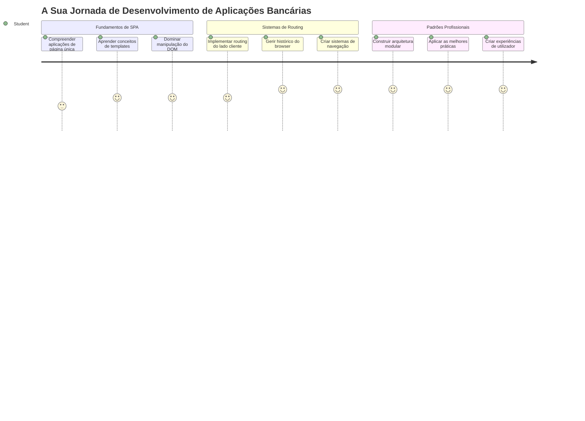
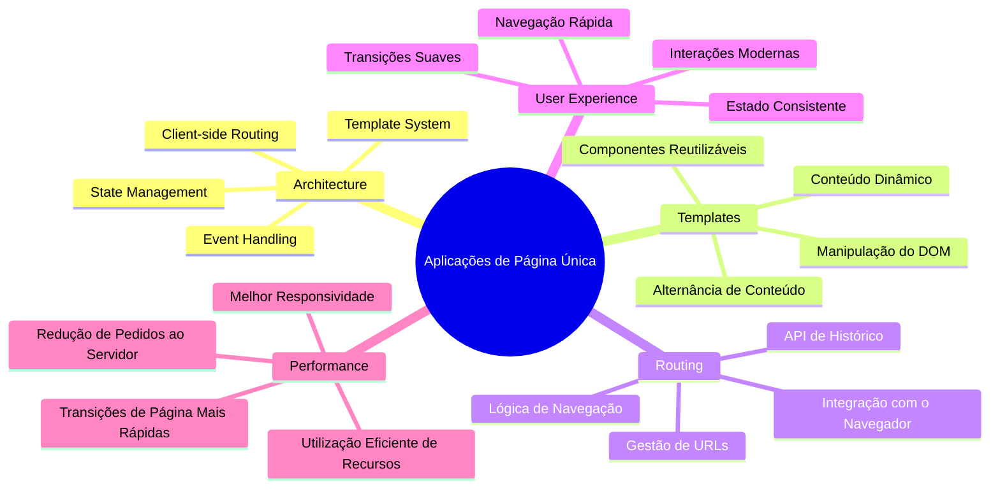
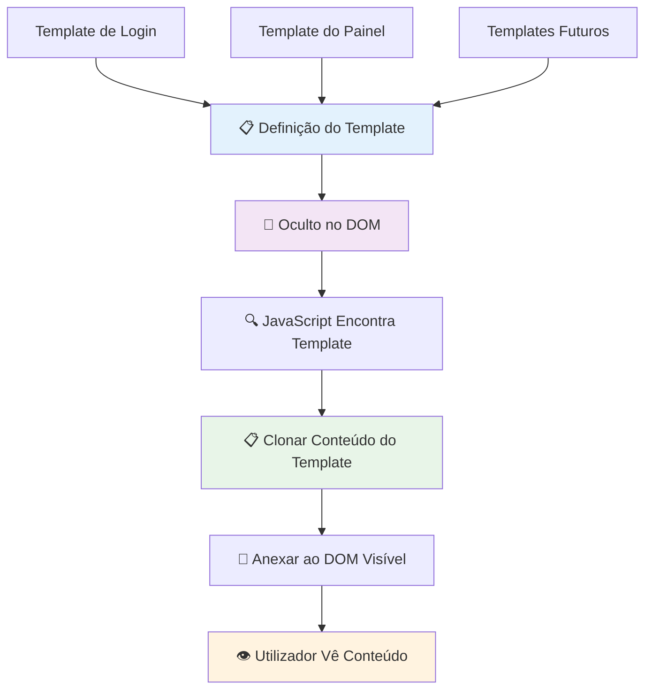
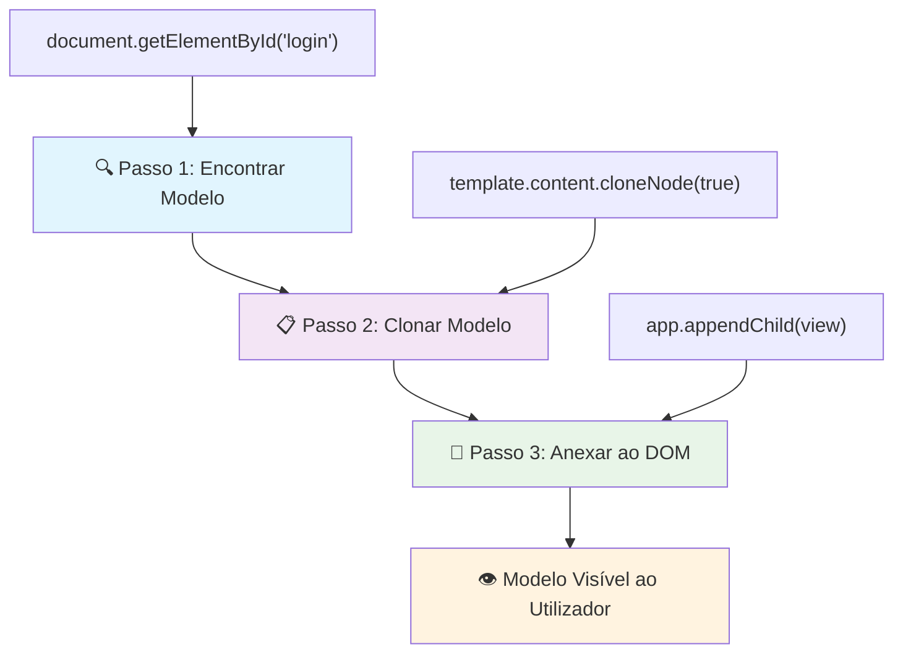
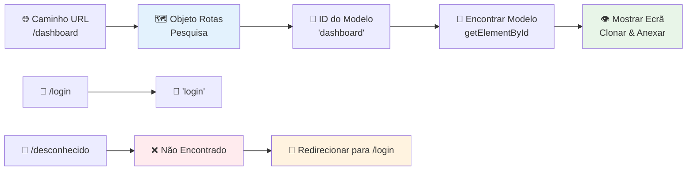
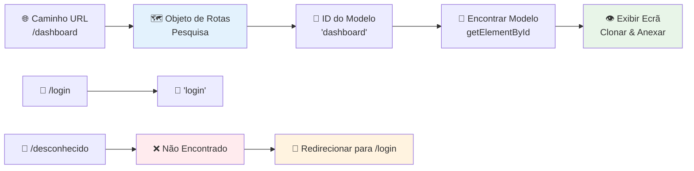
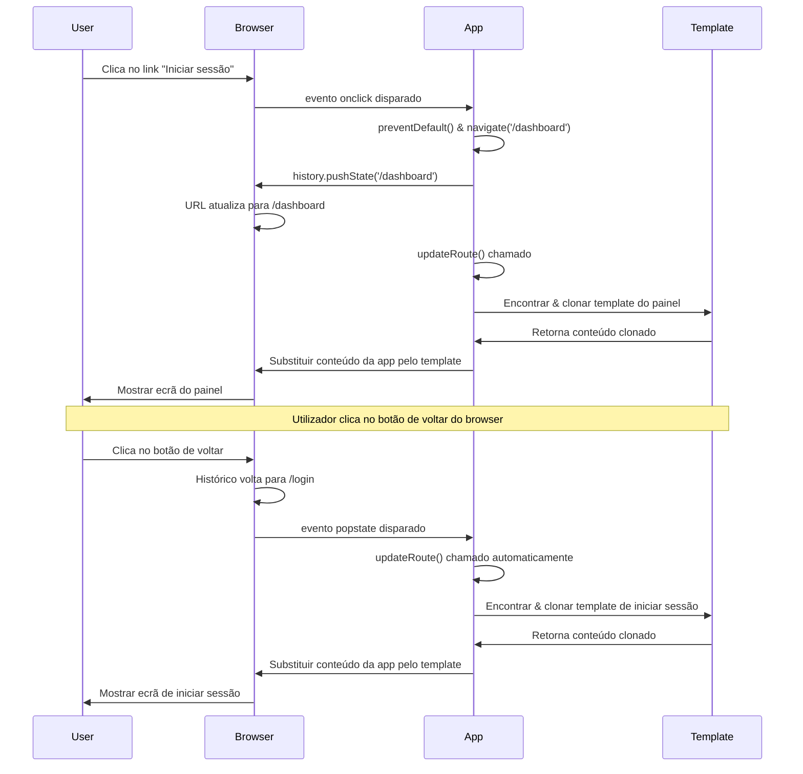
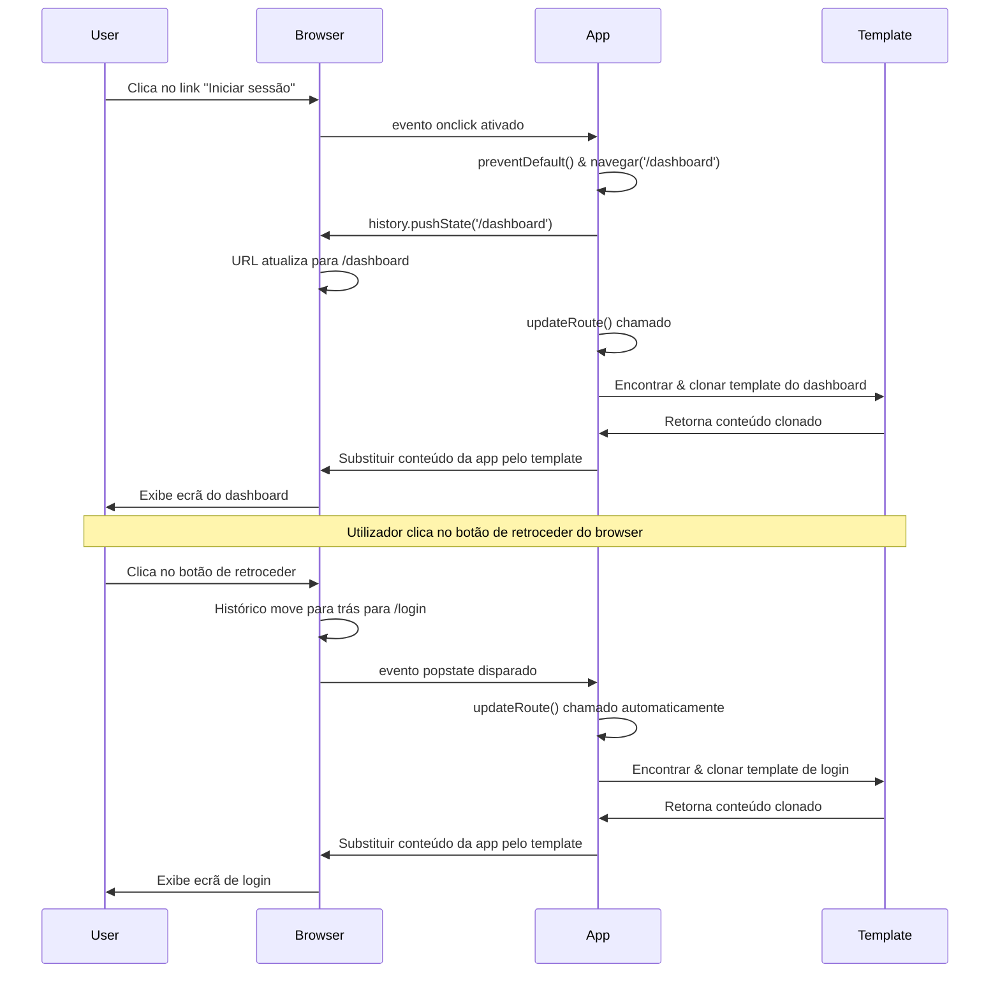
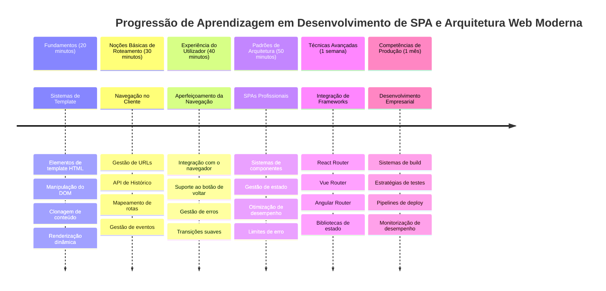

<!--
CO_OP_TRANSLATOR_METADATA:
{
  "original_hash": "351678bece18f07d9daa987a881fb062",
  "translation_date": "2026-01-06T18:10:27+00:00",
  "source_file": "7-bank-project/1-template-route/README.md",
  "language_code": "pt"
}
-->
# Construir uma App Bancária Parte 1: Templates HTML e Rotas numa App Web


Quando o computador de orientação da Apollo 11 navegou até à lua em 1969, teve de mudar entre diferentes programas sem reiniciar todo o sistema. As aplicações web modernas funcionam de forma semelhante – alteram o que vê sem recarregar tudo desde o início. Isto cria a experiência fluida e responsiva que os utilizadores esperam hoje em dia.

Ao contrário dos websites tradicionais que recarregam páginas inteiras a cada interação, as apps web modernas atualizam apenas as partes que precisam de mudar. Esta abordagem, tal como o centro de controlo de uma missão que alterna entre diferentes visores enquanto mantém comunicação constante, cria essa experiência fluida que procuramos.

Aqui está o que torna a diferença tão dramática:

| Apps Tradicionais Multi-Página | Apps Modernas de Página Única |
|-------------------------------|------------------------------|
| **Navegação** | Recarregamento completo da página para cada ecrã | Alteração instantânea de conteúdo |
| **Performance** | Mais lento devido a downloads completos de HTML | Mais rápido com atualizações parciais |
| **Experiência do Utilizador** | Piscar da página muito perceptível | Transições suaves, como de uma app |
| **Partilha de Dados** | Difícil entre páginas | Gestão de estado facilitada |
| **Desenvolvimento** | Múltiplos ficheiros HTML para manter | Um único HTML com templates dinâmicos |

**Compreendendo a evolução:**
- **Apps tradicionais** requerem pedidos ao servidor para cada ação de navegação
- **SPAs modernas** carregam uma vez e atualizam o conteúdo dinamicamente com JavaScript
- **As expectativas dos utilizadores** agora favorecem interações instantâneas e sem falhas
- **Benefícios de performance** incluem menor largura de banda e respostas mais rápidas

Nesta lição, vamos construir uma app bancária com múltiplos ecrãs que fluem entre si sem interrupções. Tal como cientistas que usam instrumentos modulares que podem ser reconfigurados para diferentes experiências, vamos usar templates HTML como componentes reutilizáveis que podem ser exibidos conforme necessário.

Irá trabalhar com templates HTML (esquemas reutilizáveis para diferentes ecrãs), roteamento JavaScript (o sistema que alterna entre ecrãs) e a API de histórico do navegador (que mantém o botão de voltar a funcionar como esperado). Estas são as mesmas técnicas fundamentais usadas por frameworks como React, Vue e Angular.

No final, terá uma app bancária funcional que demonstra princípios profissionais de aplicações de página única.


## Questionário Pré-Lição

[Questionário pré-lição](https://ff-quizzes.netlify.app/web/quiz/41)

### O Que Vai Precisar

Vamos precisar de um servidor web local para testar a nossa app bancária – não se preocupe, é mais fácil do que parece! Se ainda não tiver um configurado, basta instalar o [Node.js](https://nodejs.org) e correr `npx lite-server` a partir da pasta do seu projeto. Este comando prático inicia um servidor local e abre automaticamente a sua app no navegador.

### Preparação

No seu computador, crie uma pasta chamada `bank` com um ficheiro chamado `index.html` dentro dela. Vamos começar a partir deste [boilerplate](https://en.wikipedia.org/wiki/Boilerplate_code) HTML:

```html
<!DOCTYPE html>
<html lang="en">
  <head>
    <meta charset="UTF-8">
    <meta name="viewport" content="width=device-width, initial-scale=1.0">
    <title>Bank App</title>
  </head>
  <body>
    <!-- This is where you'll work -->
  </body>
</html>
```

**Isto é o que este boilerplate fornece:**
- **Estabelece** a estrutura do documento HTML5 com a declaração correta de DOCTYPE
- **Configura** a codificação de caracteres para UTF-8 para suporte internacional de texto
- **Permite** design responsivo com a meta tag viewport para compatibilidade móvel
- **Define** um título descritivo que aparece no separador do navegador
- **Cria** uma secção body limpa onde construiremos a nossa aplicação

> 📁 **Pré-visualização da Estrutura do Projeto**
> 
> **No final desta lição, o seu projeto conterá:**
> ```
> bank/
> ├── index.html      <!-- Main HTML with templates -->
> ├── app.js          <!-- Routing and navigation logic -->
> └── style.css       <!-- (Optional for future lessons) -->
> ```
> 
> **Responsabilidades dos ficheiros:**
> - **index.html**: Contém todos os templates e fornece a estrutura da app
> - **app.js**: Trata o roteamento, navegação e gestão de templates
> - **Templates**: Definem a interface para login, dashboard e outros ecrãs

---

## Templates HTML

Os templates resolvem um problema fundamental no desenvolvimento web. Quando Gutenberg inventou a impressão com tipos móveis na década de 1440, percebeu que em vez de esculpir páginas inteiras, podia criar blocos de letras reutilizáveis e arranjá-los conforme necessário. Os templates HTML funcionam pelo mesmo princípio – em vez de criar ficheiros HTML separados para cada ecrã, define estruturas reutilizáveis que podem ser exibidas quando for preciso.


Pense nos templates como esquemas para diferentes partes da sua app. Tal como um arquiteto cria um esquema e usa-o várias vezes em vez de redesenhar quartos idênticos, criamos templates uma vez e instanciamos quando necessário. O navegador mantém estes templates ocultos até serem ativados pelo JavaScript.

Se quiser criar múltiplos ecrãs para uma página web, uma solução seria criar um ficheiro HTML para cada ecrã que deseja mostrar. No entanto, esta solução traz alguns inconvenientes:

- Precisa de recarregar todo o HTML ao mudar de ecrã, o que pode ser lento.
- É difícil partilhar dados entre os diferentes ecrãs.

Outra abordagem é ter apenas um ficheiro HTML, e definir múltiplos [templates HTML](https://developer.mozilla.org/docs/Web/HTML/Element/template) usando o elemento `<template>`. Um template é um bloco HTML reutilizável que não é exibido pelo navegador e precisa ser instanciado em tempo de execução por JavaScript.

### Vamos Construir

Vamos criar uma app bancária com dois ecrãs principais: uma página de login e um dashboard. Primeiro, vamos adicionar um elemento placeholder ao corpo HTML – é aqui que todos os nossos diferentes ecrãs irão aparecer:

```html
<div id="app">Loading...</div>
```

**Compreendendo este placeholder:**
- **Cria** um contentor com o ID "app" onde todos os ecrãs serão exibidos
- **Mostra** uma mensagem de carregamento até o JavaScript inicializar o primeiro ecrã
- **Fornece** um único ponto de montagem para o nosso conteúdo dinâmico
- **Permite** fácil acesso pelo JavaScript usando `document.getElementById()`

> 💡 **Dica Profissional**: Como o conteúdo deste elemento será substituído, podemos colocar uma mensagem ou indicador de carregamento que será mostrado enquanto a app carrega.

A seguir, vamos adicionar abaixo o template HTML para a página de login. Por agora teremos apenas um título e uma secção que contém um link que usaremos para efetuar a navegação.

```html
<template id="login">
  <h1>Bank App</h1>
  <section>
    <a href="/dashboard">Login</a>
  </section>
</template>
```

**Explicação deste template de login:**
- **Define** um template com o identificador único "login" para o JavaScript poder apontar para ele
- **Inclui** um título principal que estabelece o branding da app
- **Contém** um elemento `<section>` semântico para agrupar conteúdo relacionado
- **Fornece** um link de navegação que levará os utilizadores ao dashboard

Depois adicionaremos outro template HTML para a página do dashboard. Esta página vai conter diferentes secções:

- Um cabeçalho com um título e um link de logout
- O saldo atual da conta bancária
- Uma lista de transações, exibida numa tabela

```html
<template id="dashboard">
  <header>
    <h1>Bank App</h1>
    <a href="/login">Logout</a>
  </header>
  <section>
    Balance: 100$
  </section>
  <section>
    <h2>Transactions</h2>
    <table>
      <thead>
        <tr>
          <th>Date</th>
          <th>Object</th>
          <th>Amount</th>
        </tr>
      </thead>
      <tbody></tbody>
    </table>
  </section>
</template>
```

**Vamos entender cada parte deste dashboard:**
- **Estrutura** a página com um elemento semântico `<header>` que contém a navegação
- **Exibe** o título da app de forma consistente entre os ecrãs para branding
- **Fornece** um link de logout que redireciona de volta ao ecrã de login
- **Mostra** o saldo atual da conta numa secção dedicada
- **Organiza** os dados de transações usando uma tabela HTML estruturada corretamente
- **Define** os cabeçalhos da tabela para as colunas Data, Objeto e Montante
- **Deixa** o corpo da tabela vazio para injeção dinâmica de conteúdo mais tarde

> 💡 **Dica Profissional**: Ao criar templates HTML, se quiser ver como ficam, pode comentar as linhas `<template>` e `</template>` colocando-as dentro de `<!-- -->`.

### 🔄 **Verificação Pedagógica**
**Compreensão do Sistema de Templates**: Antes de implementar o JavaScript, certifique-se de que entende:
- ✅ Como os templates diferem dos elementos HTML normais
- ✅ Por que os templates ficam ocultos até serem ativados por JavaScript
- ✅ A importância da estrutura HTML semântica nos templates
- ✅ Como os templates permitem componentes de interface reutilizáveis

**Autoavaliação Rápida**: O que acontece se remover as tags `<template>` à volta do seu HTML?
*Resposta: O conteúdo fica visível de imediato e perde a funcionalidade de template*

**Benefícios de Arquitectura**: Os templates fornecem:
- **Reutilização**: Uma definição, múltiplas instâncias
- **Performance**: Sem parsing HTML redundante
- **Manutenção**: Estrutura UI centralizada
- **Flexibilidade**: Alteração dinâmica de conteúdo

✅ Por que acha que usamos atributos `id` nos templates? Poderíamos usar outra coisa como classes?

## Dar Vida aos Templates com JavaScript

Agora precisamos de tornar os nossos templates funcionais. Tal como uma impressora 3D que pega num esquema digital e cria um objeto físico, o JavaScript pega nos nossos templates ocultos e cria elementos visíveis e interativos que os utilizadores podem ver e usar.

O processo segue três passos consistentes que formam a base do desenvolvimento web moderno. Uma vez que entenda este padrão, vai reconhecê-lo em muitos frameworks e bibliotecas.

Se tentar o seu ficheiro HTML atual no navegador, verá que ele fica preso a mostrar `Loading...`. Isto porque precisamos adicionar algum código JavaScript para instanciar e exibir os templates HTML.

Instanciar um template é normalmente feito em 3 passos:

1. Recuperar o elemento template no DOM, por exemplo usando [`document.getElementById`](https://developer.mozilla.org/docs/Web/API/Document/getElementById).
2. Clonar o elemento template, usando [`cloneNode`](https://developer.mozilla.org/docs/Web/API/Node/cloneNode).
3. Anexá-lo ao DOM sob um elemento visível, por exemplo usando [`appendChild`](https://developer.mozilla.org/docs/Web/API/Node/appendChild).


**Explicação visual do processo:**
- **Passo 1** localiza o template oculto na estrutura DOM
- **Passo 2** cria uma cópia funcional que pode ser modificada em segurança
- **Passo 3** insere a cópia na área visível da página
- **Resultado** é um ecrã funcional com que os utilizadores podem interagir

✅ Por que precisamos clonar o template antes de o anexar ao DOM? O que acha que aconteceria se pulássemos este passo?

### Tarefa

Crie um novo ficheiro chamado `app.js` na pasta do projeto e importe esse ficheiro na secção `<head>` do seu HTML:

```html
<script src="app.js" defer></script>
```

**Compreendendo esta importação de script:**
- **Liga** o ficheiro JavaScript ao nosso documento HTML
- **Usa** o atributo `defer` para garantir que o script corre depois do parsing do HTML
- **Permite** acesso a todos os elementos do DOM uma vez que estão totalmente carregados antes da execução do script
- **Segue** as melhores práticas modernas para carregamento de scripts e desempenho

Agora no `app.js`, vamos criar uma nova função `updateRoute`:

```js
function updateRoute(templateId) {
  const template = document.getElementById(templateId);
  const view = template.content.cloneNode(true);
  const app = document.getElementById('app');
  app.innerHTML = '';
  app.appendChild(view);
}
```

**Passo a passo, aqui está o que acontece:**
- **Localiza** o elemento template usando o seu ID único
- **Cria** uma cópia profunda do conteúdo do template usando `cloneNode(true)`
- **Encontra** o contentor da app onde o conteúdo será exibido
- **Limpa** qualquer conteúdo existente naquele contentor
- **Insere** o conteúdo copiado do template no DOM visível

Agora chame esta função com um dos templates e veja o resultado.

```js
updateRoute('login');
```

**O que esta chamada de função faz:**
- **Ativa** o template de login passando o seu ID como parâmetro
- **Demonstra** como mudar programaticamente entre diferentes ecrãs da app
- **Mostra** o ecrã de login em vez da mensagem "Loading..."

✅ Qual é o propósito deste código `app.innerHTML = '';`? O que acontece sem ele?

## Criar Rotas

Roteamento trata basicamente de associar URLs ao conteúdo certo. Considere como os operadores telefónicos antigos usavam centrais de comutação para ligar chamadas – eles recebiam um pedido e dirigiam-no ao destino correto. O roteamento web funciona de forma semelhante, recebendo um pedido de URL e determinando qual conteúdo mostrar.


Tradicionalmente, os servidores web tratavam isso servindo diferentes ficheiros HTML para URLs diferentes. Como estamos a construir uma app de página única, precisamos de gerir esse roteamento nós próprios com JavaScript. Esta abordagem dá-nos mais controlo sobre a experiência do utilizador e a performance.


**Compreendendo o fluxo do roteamento:**
- **Mudanças de URL** disparam uma consulta na nossa configuração de rotas
- **Rotas válidas** mapeiam para IDs de templates específicos para renderização
- **Rotas inválidas** ativam um comportamento fallback para evitar estados quebrados
- **Renderização do template** segue o processo de três passos que aprendemos anteriormente

Quando falamos de uma app web, chamamos *Roteamento* à intenção de mapear **URLs** para ecrãs específicos que devem ser exibidos. Numa website com múltiplos ficheiros HTML, isto é feito automaticamente pois os caminhos nos ficheiros refletem-se na URL. Por exemplo, com estes ficheiros na sua pasta de projeto:

```
mywebsite/index.html
mywebsite/login.html
mywebsite/admin/index.html
```

Se criar um servidor web com `mywebsite` como raiz, o mapeamento URL será:

```
https://site.com            --> mywebsite/index.html
https://site.com/login.html --> mywebsite/login.html
https://site.com/admin/     --> mywebsite/admin/index.html
```

No entanto, para a nossa app web estamos a usar um único ficheiro HTML contendo todos os ecrãs, pelo que este comportamento padrão não nos ajuda. Temos de criar este mapa manualmente e atualizar o template exibido usando JavaScript.

### Tarefa

Vamos usar um objeto simples para implementar um [mapa](https://en.wikipedia.org/wiki/Associative_array) entre caminhos URL e os nossos templates. Adicione este objeto no topo do seu ficheiro `app.js`.

```js
const routes = {
  '/login': { templateId: 'login' },
  '/dashboard': { templateId: 'dashboard' },
};
```

**Compreendendo esta configuração de rotas:**
- **Define** um mapeamento entre caminhos URL e identificadores de templates
- **Usa** sintaxe de objeto onde as chaves são caminhos URL e os valores contêm informação do template
- **Permite** uma consulta fácil de qual template exibir para qualquer URL dada
- **Fornece** uma estrutura escalável para adicionar novas rotas no futuro
Agora vamos modificar um pouco a função `updateRoute`. Em vez de passar diretamente o `templateId` como argumento, queremos obtê-lo primeiro olhando para a URL atual, e depois usar o nosso mapa para obter o valor correspondente do ID do template. Podemos usar [`window.location.pathname`](https://developer.mozilla.org/docs/Web/API/Location/pathname) para obter apenas a secção do caminho da URL.

```js
function updateRoute() {
  const path = window.location.pathname;
  const route = routes[path];

  const template = document.getElementById(route.templateId);
  const view = template.content.cloneNode(true);
  const app = document.getElementById('app');
  app.innerHTML = '';
  app.appendChild(view);
}
```

**Explicação do que acontece aqui:**
- **Extrai** o caminho atual da URL do browser usando `window.location.pathname`
- **Procura** a configuração da rota correspondente no nosso objeto routes
- **Obtém** o ID do template da configuração da rota
- **Segue** o mesmo processo de renderização do template como antes
- **Cria** um sistema dinâmico que responde a mudanças na URL

Aqui mapeámos as rotas que declarámos para o template correspondente. Pode experimentar e verificar que funciona corretamente ao alterar manualmente a URL no seu browser.

✅ O que acontece se introduzir um caminho desconhecido na URL? Como poderíamos resolver isto?

## Adicionando Navegação

Com o routing estabelecido, os utilizadores precisam de uma forma de navegar pela app. Sites tradicionais recarregam páginas inteiras ao clicar em links, mas queremos atualizar tanto a URL como o conteúdo sem recarregar a página. Isto cria uma experiência mais fluida, semelhante a como aplicações desktop mudam entre diferentes vistas.

Precisamos de coordenar duas coisas: atualizar a URL do browser para que os utilizadores possam guardar páginas ou partilhar links, e mostrar o conteúdo apropriado. Quando implementado corretamente, cria a navegação fluida que os utilizadores esperam das aplicações modernas.


### 🔄 **Verificação Pedagógica**
**Arquitetura de Aplicação de Página Única**: Verifique o seu entendimento do sistema completo:
- ✅ Como é que o routing do lado cliente difere do routing tradicional do lado servidor?
- ✅ Porque é que a API History é essencial para uma navegação SPA adequada?
- ✅ Como é que os templates permitem conteúdo dinâmico sem recarregar a página?
- ✅ Que papel tem o tratamento de eventos na interceptação da navegação?

**Integração do Sistema**: A sua SPA demonstra:
- **Gestão de Templates**: Componentes reutilizáveis de UI com conteúdo dinâmico
- **Routing do lado cliente**: Gestão da URL sem pedidos ao servidor
- **Arquitetura orientada a eventos**: Navegação e interações do utilizador responsivas
- **Integração com o browser**: Suporte correto ao histórico e botões de retrocesso/avançar
- **Otimização de desempenho**: Transições rápidas e redução da carga no servidor

**Padrões Profissionais**: Você implementou:
- **Separação Modelo-Visão**: Templates separados da lógica da aplicação
- **Gestão de Estado**: Estado da URL sincronizado com o conteúdo mostrado
- **Melhoria Progressiva**: JavaScript que melhora a funcionalidade básica do HTML
- **Experiência do Utilizador**: Navegação fluida semelhante a app sem recarregamentos

> � **Visão da Arquitetura**: Componentes do Sistema de Navegação
>
> **O que está a construir:**
> - **🔄 Gestão da URL**: Atualiza a barra de endereços do browser sem recarregamentos
> - **📋 Sistema de Templates**: Troca de conteúdo dinâmico com base na rota atual  
> - **📚 Integração com o Histórico**: Mantém a funcionalidade dos botões de retrocesso/avançar do browser
> - **🛡️ Tratamento de Erros**: Alternativas elegantes para rotas inválidas ou em falta
>
> **Como os componentes funcionam em conjunto:**
> - **Escuta** eventos de navegação (cliques, mudanças no histórico)
> - **Atualiza** a URL usando a API History
> - **Renderiza** o template apropriado para a nova rota
> - **Mantém** uma experiência de utilizador contínua

O próximo passo para a nossa app é adicionar a possibilidade de navegar entre páginas sem ter que alterar a URL manualmente. Isto implica duas coisas:

  1. Atualizar a URL atual
  2. Atualizar o template mostrado com base na nova URL

Já tratámos da segunda parte com a função `updateRoute`, portanto temos de descobrir como atualizar a URL atual.

Teremos de usar JavaScript e mais especificamente a [`history.pushState`](https://developer.mozilla.org/docs/Web/API/History/pushState) que permite atualizar a URL e criar uma nova entrada no histórico de navegação, sem recarregar o HTML.

> ⚠️ **Nota Importante**: Embora o elemento âncora HTML [`<a href>`](https://developer.mozilla.org/docs/Web/HTML/Element/a) possa ser usado sozinho para criar hiperligações para URLs diferentes, ele faz o browser recarregar o HTML por defeito. É necessário impedir este comportamento ao tratar o routing com JavaScript personalizado, usando a função preventDefault() no evento de clique.

### Tarefa

Vamos criar uma nova função que possamos usar para navegar na nossa app:

```js
function navigate(path) {
  window.history.pushState({}, path, path);
  updateRoute();
}
```

**Compreender esta função de navegação:**
- **Atualiza** a URL do browser para o novo caminho usando `history.pushState`
- **Adiciona** uma nova entrada na pilha do histórico do browser para suportar os botões de retrocesso/avançar
- **Dispara** a função `updateRoute()` para mostrar o template correspondente
- **Mantém** a experiência de aplicação de página única sem recarregamentos

Este método atualiza primeiro a URL atual com base no caminho dado, depois atualiza o template. A propriedade `window.location.origin` devolve a raiz da URL, permitindo-nos reconstruir uma URL completa a partir de um caminho dado.

Agora que temos esta função, podemos tratar do problema que temos se um caminho não corresponder a nenhuma rota definida. Vamos modificar a função `updateRoute` adicionando uma alternativa para uma rota existente caso não encontremos correspondência.

```js
function updateRoute() {
  const path = window.location.pathname;
  const route = routes[path];

  if (!route) {
    return navigate('/login');
  }

  const template = document.getElementById(route.templateId);
  const view = template.content.cloneNode(true);
  const app = document.getElementById('app');
  app.innerHTML = '';
  app.appendChild(view);
}
```

**Pontos-chave a lembrar:**
- **Verifica** se existe uma rota para o caminho atual
- **Redireciona** para a página de login quando se acede a uma rota inválida
- **Fornece** um mecanismo de fallback que previne navegação quebrada
- **Garante** que os utilizadores vejam sempre uma página válida, mesmo com URLs incorretas

Se não for encontrada uma rota, agora vamos redirecionar para a página `login`.

Agora vamos criar uma função para obter a URL quando um link é clicado e para impedir o comportamento padrão do browser para links:

```js
function onLinkClick(event) {
  event.preventDefault();
  navigate(event.target.href);
}
```

**Explicação deste manipulador de clique:**
- **Impede** o comportamento padrão dos links no browser usando `preventDefault()`
- **Extrai** a URL destino a partir do elemento de link clicado
- **Chama** a nossa função de navegação personalizada em vez de recarregar a página
- **Mantém** a experiência fluida da aplicação de página única

```html
<a href="/dashboard" onclick="onLinkClick(event)">Login</a>
...
<a href="/login" onclick="onLinkClick(event)">Logout</a>
```

**O que esta ligação onclick alcança:**
- **Liga** cada link ao nosso sistema de navegação personalizado
- **Passa** o evento de clique para a nossa função `onLinkClick` para processamento
- **Permite** navegação fluida sem recarregamento da página
- **Mantém** a estrutura correta da URL que os utilizadores podem guardar ou partilhar

O atributo [`onclick`](https://developer.mozilla.org/docs/Web/API/GlobalEventHandlers/onclick) liga o evento `click` ao código JavaScript, aqui à chamada da função `navigate()`.

Experimente clicar nestes links, agora deverá poder navegar entre as diferentes páginas da sua app.

✅ O método `history.pushState` faz parte do padrão HTML5 e está implementado em [todos os browsers modernos](https://caniuse.com/?search=pushState). Se estiver a construir uma app web para browsers antigos, existe um truque que pode usar em vez desta API: usando um [hash (`#`)](https://en.wikipedia.org/wiki/URI_fragment) antes do caminho pode implementar routing que funciona com navegação por âncoras normais e não recarrega a página, pois a função original desta técnica era criar ligações internas numa página.

## Fazer os Botões de Retrocesso e Avançar Funcionar

Os botões de retrocesso e avançar são fundamentais para a navegação na web, tal como os controladores de missão da NASA podem rever estados anteriores durante as missões espaciais. Os utilizadores esperam que estes botões funcionem, e quando não funcionam, quebra a experiência de navegação esperada.

A nossa aplicação de página única necessita de configuração adicional para suportar isto. O browser mantém uma pilha de histórico (à qual temos adicionado com `history.pushState`), mas quando os utilizadores navegam por este histórico, a nossa app precisa de responder atualizando o conteúdo mostrado em conformidade.


**Pontos-chave de interação:**
- **Ações do utilizador** disparam navegação por cliques ou botões do browser
- **App intercepta** cliques em links para prevenir recarregamentos de página
- **API History** gere alterações na URL e na pilha do histórico do browser
- **Templates** fornecem a estrutura de conteúdo para cada ecrã
- **Ouvintes de eventos** asseguram que a app responde a todos os tipos de navegação

Usar `history.pushState` cria novas entradas no histórico de navegação do browser. Pode verificar isso segurando o *botão de retrocesso* do seu browser, deverá aparecer algo assim:


Se tentar clicar várias vezes no botão de retrocesso, verá que a URL atual muda e o histórico é atualizado, mas o mesmo template continua a ser mostrado.

Isto acontece porque a aplicação não sabe que precisa de chamar `updateRoute()` sempre que o histórico muda. Se consultar a [documentação do `history.pushState`](https://developer.mozilla.org/docs/Web/API/History/pushState), verá que se o estado mudar — significando que passámos para uma URL diferente — o evento [`popstate`](https://developer.mozilla.org/docs/Web/API/Window/popstate_event) é disparado. Vamos usar isso para resolver esta situação.

### Tarefa

Para garantir que o template mostrado é atualizado quando o histórico do browser muda, vamos associar uma nova função que chama `updateRoute()`. Vamos fazê-lo no fim do nosso ficheiro `app.js`:

```js
window.onpopstate = () => updateRoute();
updateRoute();
```

**Compreender esta integração com o histórico:**
- **Escuta** eventos `popstate` que ocorrem quando os utilizadores navegam com os botões do browser
- **Usa** uma função arrow para sintaxe concisa do manipulador de eventos
- **Chama** `updateRoute()` automaticamente sempre que o estado do histórico muda
- **Inicializa** a app chamando `updateRoute()` quando a página é carregada
- **Garante** que o template correto é mostrado independentemente da forma como o utilizador navega

> 💡 **Dica Pró**: Usámos uma [arrow function](https://developer.mozilla.org/docs/Web/JavaScript/Reference/Functions/Arrow_functions) aqui para declarar o nosso manipulador do evento `popstate` por concisão, mas uma função normal funcionaria da mesma forma.

Aqui está um vídeo de revisão sobre funções arrow:

[](https://youtube.com/watch?v=OP6eEbOj2sc "Arrow Functions")

> 🎥 Clique na imagem acima para ver um vídeo sobre funções arrow.

Agora tente usar os botões de retrocesso e avançar do seu browser e verifique que a rota mostrada é atualizada corretamente.

### ⚡ **O Que Pode Fazer nos Próximos 5 Minutos**
- [ ] Testar a navegação da sua app bancária usando os botões de retrocesso/avançar do browser
- [ ] Experimentar escrever URLs diferentes manualmente na barra de endereços para testar o routing
- [ ] Abrir as DevTools do browser e inspecionar como os templates são clonados no DOM
- [ ] Experimentar adicionar declarações console.log para acompanhar o fluxo do routing

### 🎯 **O Que Pode Conseguir Nesta Hora**
- [ ] Completar o quiz pós-aula e compreender os conceitos da arquitetura SPA
- [ ] Adicionar estilo CSS para fazer os templates da sua app bancária parecerem profissionais
- [ ] Implementar a página de erro 404 com tratamento de erros adequado
- [ ] Criar a página de créditos com funcionalidade adicional de routing
- [ ] Adicionar estados de carregamento e transições entre trocas de template

### 📅 **A Sua Jornada de Desenvolvimento SPA em uma Semana**
- [ ] Completar a app bancária completa com formulários, gestão de dados e persistência
- [ ] Adicionar funcionalidades avançadas de routing como parâmetros e rotas aninhadas
- [ ] Implementar guardas de navegação e routing condicionado por autenticação
- [ ] Criar componentes de template reutilizáveis e uma biblioteca de componentes
- [ ] Adicionar animações e transições para uma experiência de utilizador mais suave
- [ ] Publicar a sua SPA numa plataforma de hosting e configurar o routing corretamente

### 🌟 **A Sua Maestria de Arquitetura Frontend em Um Mês**
- [ ] Construir SPAs complexas usando frameworks modernos como React, Vue ou Angular
- [ ] Aprender padrões e bibliotecas avançados de gestão de estado
- [ ] Dominar ferramentas de build e fluxos de desenvolvimento para SPAs
- [ ] Implementar funcionalidades de Progressive Web App e offline
- [ ] Estudar técnicas de otimização de desempenho para SPAs em larga escala
- [ ] Contribuir para projetos open source de SPAs e partilhar o seu conhecimento

## 🎯 O Seu Cronograma de Maestria em Aplicações de Página Única


### 🛠️ Resumo das Ferramentas de Desenvolvimento da Sua SPA

Após completar esta lição, agora dominou:
- **Arquitetura de Templates**: Componentes HTML reutilizáveis com renderização dinâmica de conteúdo
- **Routing do lado cliente**: Gestão da URL e navegação sem recarregamentos de página
- **Integração com o Browser**: Uso da API History e suporte aos botões de retrocesso/avançar
- **Sistemas orientados a eventos**: Gestão da navegação e interações do utilizador
- **Manipulação do DOM**: Clonagem de templates, troca de conteúdo e gestão de elementos
- **Tratamento de Erros**: Alternativas elegantes para rotas inválidas e conteúdo em falta
- **Padrões de Desempenho**: Estratégias eficientes para carregamento e renderização de conteúdo

**Aplicações no Mundo Real**: As suas competências de desenvolvimento SPA aplicam-se diretamente a:
- **Aplicações Web Modernas**: Desenvolvimento com React, Vue, Angular e outros frameworks
- **Progressive Web Apps**: Aplicações capazes de funcionar offline com experiência semelhante a apps
- **Dashboards Empresariais**: Aplicações complexas de negócios com múltiplas vistas
- **Plataformas de Comércio Eletrónico**: Catálogos de produtos, carrinhos e processos de checkout
- **Gestão de Conteúdo**: Interfaces de criação e edição dinâmica de conteúdos
- **Desenvolvimento Móvel**: Apps híbridas usando tecnologias web

**Competências Profissionais Adquiridas**: Agora pode:
- **Arquitetar** aplicações de página única com separação adequada de responsabilidades
- **Implementar** sistemas de roteamento do lado do cliente que escalem com a complexidade da aplicação
- **Depurar** fluxos complexos de navegação usando as ferramentas de desenvolvedor do navegador
- **Otimizar** o desempenho da aplicação através da gestão eficiente de templates
- **Desenhar** experiências de utilizador que pareçam nativas e responsivas

**Conceitos de Desenvolvimento Frontend Dominados**:
- **Arquitetura de Componentes**: Padrões de UI reutilizáveis e sistemas de templates
- **Sincronização de Estado**: Gestão do estado da URL e histórico do navegador
- **Programação Orientada a Eventos**: Gestão de interação do utilizador e navegação
- **Otimização de Desempenho**: Manipulação eficiente do DOM e carregamento de conteúdo
- **Design de Experiência de Utilizador**: Transições suaves e navegação intuitiva

**Próximo Nível**: Está pronto para explorar frameworks frontend modernos, gestão avançada de estado, ou construir aplicações empresariais complexas!

🌟 **Conquista Desbloqueada**: Construiu uma base profissional para aplicações de página única com padrões modernos de arquitetura web!

---

## Desafio GitHub Copilot Agent 🚀

Use o modo Agent para completar o seguinte desafio:

**Descrição:** Melhore a app bancária implementando tratamento de erros e um template de página 404 para rotas inválidas, aprimorando a experiência do utilizador ao navegar para páginas inexistentes.

**Prompt:** Crie um novo template HTML com id "not-found" que exiba uma página de erro 404 amigável com estilo. Depois modifique a lógica de roteamento JavaScript para mostrar esse template quando os utilizadores navegarem para URLs inválidas, e adicione um botão "Ir para Início" que navegue de volta para a página de login.

Saiba mais sobre [modo agent](https://code.visualstudio.com/blogs/2025/02/24/introducing-copilot-agent-mode) aqui.

## 🚀 Desafio

Adicione um novo template e rota para uma terceira página que mostre os créditos desta aplicação.

**Objetivos do desafio:**
- **Criar** um novo template HTML com estrutura de conteúdo apropriada
- **Adicionar** a nova rota ao seu objeto de configuração de rotas
- **Incluir** links de navegação para e a partir da página de créditos
- **Testar** se toda a navegação funciona corretamente com o histórico do navegador

## Quiz Pós-Aula

[Quiz pós-aula](https://ff-quizzes.netlify.app/web/quiz/42)

## Revisão & Autoestudo

O roteamento é uma das partes surpreendentemente complicadas do desenvolvimento web, especialmente à medida que a web evolui de comportamentos de atualização de páginas para aplicações de página única (SPA). Leia um pouco sobre [como o serviço Azure Static Web App](https://docs.microsoft.com/azure/static-web-apps/routes/?WT.mc_id=academic-77807-sagibbon) trata o roteamento. Consegue explicar porque algumas das decisões descritas nesse documento são necessárias?

**Recursos adicionais de aprendizagem:**
- **Explore** como frameworks populares como React Router e Vue Router implementam roteamento do lado do cliente
- **Pesquise** as diferenças entre roteamento baseado em hash e roteamento pela API de histórico
- **Aprenda** sobre renderização do lado do servidor (SSR) e como isso afeta estratégias de roteamento
- **Investigue** como Progressive Web Apps (PWAs) gerem o roteamento e a navegação

## Tarefa

[Melhorar o roteamento](assignment.md)

---

<!-- CO-OP TRANSLATOR DISCLAIMER START -->
**Aviso Legal**:
Este documento foi traduzido utilizando o serviço de tradução por IA [Co-op Translator](https://github.com/Azure/co-op-translator). Embora nos esforcemos para garantir a precisão, esteja atento de que traduções automáticas podem conter erros ou imprecisões. O documento original na sua língua nativa deve ser considerado a fonte autorizada. Para informações críticas, recomenda-se tradução profissional humana. Não nos responsabilizamos por quaisquer mal-entendidos ou interpretações incorretas decorrentes do uso desta tradução.
<!-- CO-OP TRANSLATOR DISCLAIMER END -->