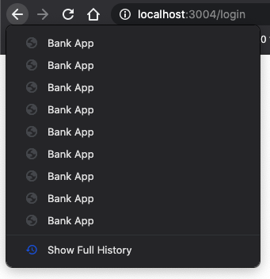

<!--
CO_OP_TRANSLATOR_METADATA:
{
  "original_hash": "8a07db14e75ac62f013b7de5df05981d",
  "translation_date": "2025-08-29T16:09:43+00:00",
  "source_file": "7-bank-project/1-template-route/README.md",
  "language_code": "pt"
}
-->
# Criar uma App Bancária Parte 1: Templates HTML e Rotas numa Aplicação Web

## Questionário Pré-Aula

[Questionário pré-aula](https://ff-quizzes.netlify.app/web/quiz/41)

### Introdução

Desde o surgimento do JavaScript nos navegadores, os websites tornaram-se mais interativos e complexos do que nunca. As tecnologias web são agora frequentemente utilizadas para criar aplicações totalmente funcionais que correm diretamente num navegador, chamadas [aplicações web](https://en.wikipedia.org/wiki/Web_application). Como as aplicações web são altamente interativas, os utilizadores não querem esperar por um carregamento completo da página sempre que uma ação é realizada. É por isso que o JavaScript é usado para atualizar o HTML diretamente através do DOM, proporcionando uma experiência de utilizador mais fluida.

Nesta lição, vamos estabelecer as bases para criar uma aplicação bancária web, utilizando templates HTML para criar múltiplas telas que podem ser exibidas e atualizadas sem necessidade de recarregar toda a página HTML.

### Pré-requisitos

Precisas de um servidor web local para testar a aplicação web que vamos construir nesta lição. Se não tiveres um, podes instalar [Node.js](https://nodejs.org) e usar o comando `npx lite-server` na pasta do teu projeto. Este comando criará um servidor web local e abrirá a tua aplicação num navegador.

### Preparação

No teu computador, cria uma pasta chamada `bank` com um ficheiro chamado `index.html` dentro dela. Vamos começar com este [boilerplate HTML](https://en.wikipedia.org/wiki/Boilerplate_code):

```html
<!DOCTYPE html>
<html lang="en">
  <head>
    <meta charset="UTF-8">
    <meta name="viewport" content="width=device-width, initial-scale=1.0">
    <title>Bank App</title>
  </head>
  <body>
    <!-- This is where you'll work -->
  </body>
</html>
```

---

## Templates HTML

Se quiseres criar múltiplas telas para uma página web, uma solução seria criar um ficheiro HTML para cada tela que desejas exibir. No entanto, esta solução tem algumas desvantagens:

- É necessário recarregar todo o HTML ao alternar entre telas, o que pode ser lento.
- É difícil partilhar dados entre as diferentes telas.

Outra abordagem é ter apenas um ficheiro HTML e definir múltiplos [templates HTML](https://developer.mozilla.org/docs/Web/HTML/Element/template) utilizando o elemento `<template>`. Um template é um bloco HTML reutilizável que não é exibido pelo navegador e precisa de ser instanciado em tempo de execução usando JavaScript.

### Tarefa

Vamos criar uma aplicação bancária com duas telas: a página de login e o painel de controlo. Primeiro, vamos adicionar no corpo do HTML um elemento de espaço reservado que usaremos para instanciar as diferentes telas da nossa aplicação:

```html
<div id="app">Loading...</div>
```

Estamos a atribuir-lhe um `id` para facilitar a sua localização com JavaScript mais tarde.

> Dica: como o conteúdo deste elemento será substituído, podemos colocar uma mensagem ou indicador de carregamento que será exibido enquanto a aplicação está a carregar.

Em seguida, vamos adicionar abaixo o template HTML para a página de login. Por agora, vamos apenas colocar um título e uma secção contendo um link que usaremos para realizar a navegação.

```html
<template id="login">
  <h1>Bank App</h1>
  <section>
    <a href="/dashboard">Login</a>
  </section>
</template>
```

Depois, vamos adicionar outro template HTML para a página do painel de controlo. Esta página conterá diferentes secções:

- Um cabeçalho com um título e um link para logout
- O saldo atual da conta bancária
- Uma lista de transações, exibida numa tabela

```html
<template id="dashboard">
  <header>
    <h1>Bank App</h1>
    <a href="/login">Logout</a>
  </header>
  <section>
    Balance: 100$
  </section>
  <section>
    <h2>Transactions</h2>
    <table>
      <thead>
        <tr>
          <th>Date</th>
          <th>Object</th>
          <th>Amount</th>
        </tr>
      </thead>
      <tbody></tbody>
    </table>
  </section>
</template>
```

> Dica: ao criar templates HTML, se quiseres ver como ficará, podes comentar as linhas `<template>` e `</template>` utilizando `<!-- -->`.

✅ Porque achas que usamos atributos `id` nos templates? Poderíamos usar algo como classes?

## Exibir templates com JavaScript

Se experimentares o teu ficheiro HTML atual num navegador, verás que ele fica preso a exibir `Loading...`. Isso acontece porque precisamos adicionar algum código JavaScript para instanciar e exibir os templates HTML.

Instanciar um template geralmente é feito em 3 passos:

1. Recuperar o elemento template no DOM, por exemplo, usando [`document.getElementById`](https://developer.mozilla.org/docs/Web/API/Document/getElementById).
2. Clonar o elemento template, usando [`cloneNode`](https://developer.mozilla.org/docs/Web/API/Node/cloneNode).
3. Anexá-lo ao DOM sob um elemento visível, por exemplo, usando [`appendChild`](https://developer.mozilla.org/docs/Web/API/Node/appendChild).

✅ Porque precisamos clonar o template antes de anexá-lo ao DOM? O que achas que aconteceria se ignorássemos este passo?

### Tarefa

Cria um novo ficheiro chamado `app.js` na pasta do teu projeto e importa esse ficheiro na secção `<head>` do teu HTML:

```html
<script src="app.js" defer></script>
```

Agora, no `app.js`, vamos criar uma nova função `updateRoute`:

```js
function updateRoute(templateId) {
  const template = document.getElementById(templateId);
  const view = template.content.cloneNode(true);
  const app = document.getElementById('app');
  app.innerHTML = '';
  app.appendChild(view);
}
```

O que fazemos aqui são exatamente os 3 passos descritos acima. Instanciamos o template com o id `templateId` e colocamos o seu conteúdo clonado dentro do espaço reservado da nossa aplicação. Nota que precisamos usar `cloneNode(true)` para copiar toda a subárvore do template.

Agora chama esta função com um dos templates e observa o resultado.

```js
updateRoute('login');
```

✅ Qual é o propósito deste código `app.innerHTML = '';`? O que acontece sem ele?

## Criar rotas

Quando falamos de uma aplicação web, chamamos *Routing* à intenção de mapear **URLs** para telas específicas que devem ser exibidas. Num website com múltiplos ficheiros HTML, isto é feito automaticamente, pois os caminhos dos ficheiros são refletidos no URL. Por exemplo, com estes ficheiros na pasta do teu projeto:

```
mywebsite/index.html
mywebsite/login.html
mywebsite/admin/index.html
```

Se criares um servidor web com `mywebsite` como raiz, o mapeamento de URLs será:

```
https://site.com            --> mywebsite/index.html
https://site.com/login.html --> mywebsite/login.html
https://site.com/admin/     --> mywebsite/admin/index.html
```

No entanto, para a nossa aplicação web, estamos a usar um único ficheiro HTML contendo todas as telas, então este comportamento padrão não nos será útil. Temos de criar este mapa manualmente e atualizar o template exibido usando JavaScript.

### Tarefa

Vamos usar um simples objeto para implementar um [mapa](https://en.wikipedia.org/wiki/Associative_array) entre caminhos de URL e os nossos templates. Adiciona este objeto no topo do teu ficheiro `app.js`.

```js
const routes = {
  '/login': { templateId: 'login' },
  '/dashboard': { templateId: 'dashboard' },
};
```

Agora vamos modificar um pouco a função `updateRoute`. Em vez de passar diretamente o `templateId` como argumento, queremos recuperá-lo primeiro olhando para o URL atual e, em seguida, usar o nosso mapa para obter o valor correspondente do `templateId`. Podemos usar [`window.location.pathname`](https://developer.mozilla.org/docs/Web/API/Location/pathname) para obter apenas a secção do caminho do URL.

```js
function updateRoute() {
  const path = window.location.pathname;
  const route = routes[path];

  const template = document.getElementById(route.templateId);
  const view = template.content.cloneNode(true);
  const app = document.getElementById('app');
  app.innerHTML = '';
  app.appendChild(view);
}
```

Aqui mapeamos as rotas que declaramos para o template correspondente. Podes testar que funciona corretamente alterando o URL manualmente no teu navegador.

✅ O que acontece se inserires um caminho desconhecido no URL? Como poderíamos resolver isso?

## Adicionar navegação

O próximo passo para a nossa aplicação é adicionar a possibilidade de navegar entre páginas sem ter de alterar o URL manualmente. Isto implica duas coisas:

1. Atualizar o URL atual
2. Atualizar o template exibido com base no novo URL

Já tratámos da segunda parte com a função `updateRoute`, então temos de descobrir como atualizar o URL atual.

Teremos de usar JavaScript e, mais especificamente, o [`history.pushState`](https://developer.mozilla.org/docs/Web/API/History/pushState), que permite atualizar o URL e criar uma nova entrada no histórico de navegação, sem recarregar o HTML.

> Nota: Embora o elemento HTML de âncora [`<a href>`](https://developer.mozilla.org/docs/Web/HTML/Element/a) possa ser usado sozinho para criar hiperligações para diferentes URLs, ele fará com que o navegador recarregue o HTML por padrão. É necessário evitar este comportamento ao lidar com rotas personalizadas em JavaScript, usando a função preventDefault() no evento de clique.

### Tarefa

Vamos criar uma nova função que podemos usar para navegar na nossa aplicação:

```js
function navigate(path) {
  window.history.pushState({}, path, path);
  updateRoute();
}
```

Este método primeiro atualiza o URL atual com base no caminho fornecido e, em seguida, atualiza o template. A propriedade `window.location.origin` retorna a raiz do URL, permitindo-nos reconstruir um URL completo a partir de um caminho fornecido.

Agora que temos esta função, podemos resolver o problema que temos se um caminho não corresponder a nenhuma rota definida. Vamos modificar a função `updateRoute` adicionando um fallback para uma das rotas existentes caso não consigamos encontrar uma correspondência.

```js
function updateRoute() {
  const path = window.location.pathname;
  const route = routes[path];

  if (!route) {
    return navigate('/login');
  }

  ...
```

Se uma rota não puder ser encontrada, agora redirecionaremos para a página de `login`.

Agora vamos criar uma função para obter o URL quando um link é clicado e evitar o comportamento padrão de links do navegador:

```js
function onLinkClick(event) {
  event.preventDefault();
  navigate(event.target.href);
}
```

Vamos completar o sistema de navegação adicionando ligações aos nossos links de *Login* e *Logout* no HTML.

```html
<a href="/dashboard" onclick="onLinkClick(event)">Login</a>
...
<a href="/login" onclick="onLinkClick(event)">Logout</a>
```

O objeto `event` acima captura o evento de clique e passa-o para a nossa função `onLinkClick`.

Usando o atributo [`onclick`](https://developer.mozilla.org/docs/Web/API/GlobalEventHandlers/onclick), liga o evento de clique ao código JavaScript, aqui a chamada à função `navigate()`.

Experimenta clicar nestes links, agora deverás conseguir navegar entre as diferentes telas da tua aplicação.

✅ O método `history.pushState` faz parte do padrão HTML5 e está implementado em [todos os navegadores modernos](https://caniuse.com/?search=pushState). Se estiveres a construir uma aplicação web para navegadores mais antigos, há um truque que podes usar em vez desta API: utilizando um [hash (`#`)](https://en.wikipedia.org/wiki/URI_fragment) antes do caminho, podes implementar rotas que funcionam com navegação regular de âncoras e não recarregam a página, já que o seu propósito era criar links internos dentro de uma página.

## Lidar com os botões de retroceder e avançar do navegador

Usar o `history.pushState` cria novas entradas no histórico de navegação do navegador. Podes verificar isso ao manter pressionado o botão *retroceder* do teu navegador; deverá exibir algo como isto:



Se tentares clicar no botão de retroceder algumas vezes, verás que o URL atual muda e o histórico é atualizado, mas o mesmo template continua a ser exibido.

Isso acontece porque a aplicação não sabe que precisamos chamar `updateRoute()` sempre que o histórico muda. Se olhares para a [documentação do `history.pushState`](https://developer.mozilla.org/docs/Web/API/History/pushState), podes ver que, se o estado mudar - ou seja, se nos movermos para um URL diferente - o evento [`popstate`](https://developer.mozilla.org/docs/Web/API/Window/popstate_event) é acionado. Vamos usar isso para corrigir o problema.

### Tarefa

Para garantir que o template exibido seja atualizado quando o histórico do navegador muda, vamos anexar uma nova função que chama `updateRoute()`. Vamos fazer isso no final do ficheiro `app.js`:

```js
window.onpopstate = () => updateRoute();
updateRoute();
```

> Nota: usamos uma [função arrow](https://developer.mozilla.org/docs/Web/JavaScript/Reference/Functions/Arrow_functions) aqui para declarar o nosso manipulador de eventos `popstate` por concisão, mas uma função regular funcionaria da mesma forma.

Aqui está um vídeo de revisão sobre funções arrow:

[](https://youtube.com/watch?v=OP6eEbOj2sc "Funções Arrow")

> 🎥 Clica na imagem acima para um vídeo sobre funções arrow.

Agora experimenta usar os botões de retroceder e avançar do teu navegador e verifica se a rota exibida é corretamente atualizada desta vez.

---

## 🚀 Desafio

Adiciona um novo template e rota para uma terceira página que mostre os créditos desta aplicação.

## Questionário Pós-Aula

[Questionário pós-aula](https://ff-quizzes.netlify.app/web/quiz/42)

## Revisão & Autoestudo

Routing é uma das partes surpreendentemente complicadas do desenvolvimento web, especialmente à medida que a web se move de comportamentos de atualização de página para atualizações de página em Aplicações de Página Única. Lê um pouco sobre [como o serviço Azure Static Web App](https://docs.microsoft.com/azure/static-web-apps/routes/?WT.mc_id=academic-77807-sagibbon) lida com routing. Consegues explicar porque algumas das decisões descritas nesse documento são necessárias?

## Tarefa

[Melhora o routing](assignment.md)

---

**Aviso Legal**:  
Este documento foi traduzido utilizando o serviço de tradução por IA [Co-op Translator](https://github.com/Azure/co-op-translator). Embora nos esforcemos para garantir a precisão, esteja ciente de que traduções automáticas podem conter erros ou imprecisões. O documento original na sua língua nativa deve ser considerado a fonte oficial. Para informações críticas, recomenda-se uma tradução profissional realizada por humanos. Não nos responsabilizamos por quaisquer mal-entendidos ou interpretações incorretas resultantes do uso desta tradução.