<!--
CO_OP_TRANSLATOR_METADATA:
{
  "original_hash": "7cbdbd132d39a2bb493e85bc2a9387cc",
  "translation_date": "2026-01-06T18:07:46+00:00",
  "source_file": "7-bank-project/2-forms/README.md",
  "language_code": "pt"
}
-->
# Construir uma Aplicação Bancária Parte 2: Construir um Formulário de Login e Registo

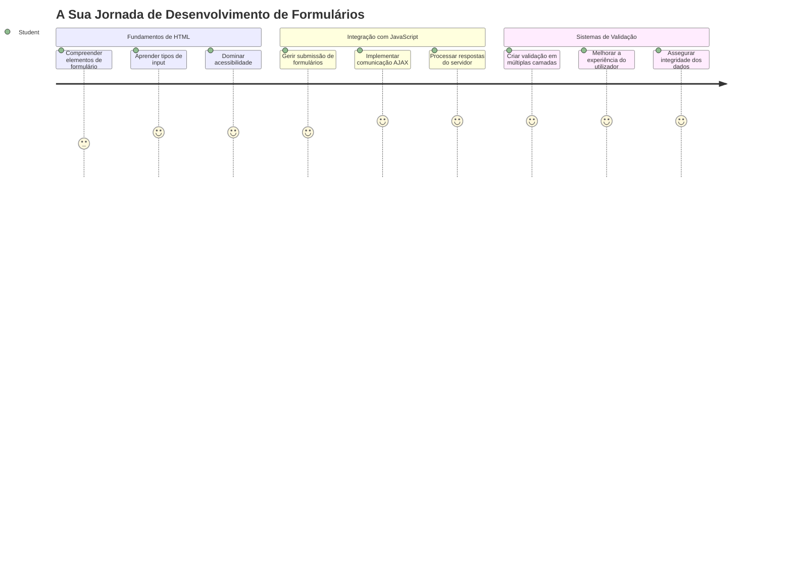
## Questionário Pré-aula

[Questionário pré-aula](https://ff-quizzes.netlify.app/web/quiz/43)

Alguma vez preencheu um formulário online e este rejeitou o formato do seu email? Ou perdeu toda a sua informação quando clicou em submeter? Todos nós já passámos por essas experiências frustrantes.

Os formulários são a ponte entre os seus utilizadores e a funcionalidade da sua aplicação. Tal como os protocolos cuidadosos que os controladores de tráfego aéreo usam para guiar aviões em segurança até aos seus destinos, os formulários bem concebidos fornecem um feedback claro e evitam erros dispendiosos. Formulários maus, por outro lado, podem afastar os utilizadores mais rapidamente do que uma má comunicação num aeroporto movimentado.

Nesta aula, vamos transformar a sua app bancária estática numa aplicação interativa. Vai aprender a criar formulários que validam a entrada do utilizador, comunicam com servidores e fornecem feedback útil. Pense nisso como construir a interface de controlo que permite aos utilizadores navegar pelas funcionalidades da sua aplicação.

No final, terá um sistema completo de login e registo com validação que orienta os utilizadores para o sucesso em vez da frustração.

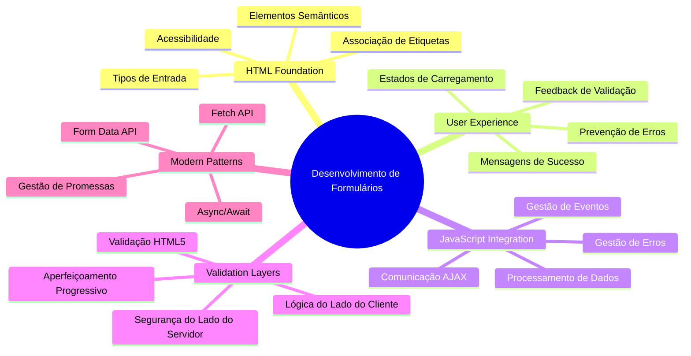
## Pré-requisitos

Antes de começarmos a construir formulários, vamos garantir que tem tudo configurado corretamente. Esta lição retoma exatamente de onde parámos na anterior, por isso, se saltou essa parte, pode querer voltar atrás e fazer funcionar o básico primeiro.

### Configuração Necessária

| Componente | Estado | Descrição |
|-----------|--------|-------------|
| [Templates HTML](../1-template-route/README.md) | ✅ Obrigatório | A sua estrutura básica da app bancária |
| [Node.js](https://nodejs.org) | ✅ Obrigatório | Ambiente JavaScript para o servidor |
| [Servidor API Bancária](../api/README.md) | ✅ Obrigatório | Serviço backend para armazenamento de dados |

> 💡 **Dica de Desenvolvimento**: Vai correr dois servidores separados simultaneamente – um para o front-end da sua app bancária e outro para a API backend. Esta configuração espelha o desenvolvimento no mundo real, onde os serviços de frontend e backend funcionam independentemente.

### Configuração do Servidor

**O seu ambiente de desenvolvimento incluirá:**
- **Servidor frontend**: Serve a sua app bancária (tipicamente na porta `3000`)
- **Servidor API backend**: Trata o armazenamento e recuperação de dados (porta `5000`)
- **Ambos os servidores** podem correr simultaneamente sem conflitos

**Testar a ligação à sua API:**
```bash
curl http://localhost:5000/api
# Resposta esperada: "Bank API v1.0.0"
```

**Se vir a resposta da versão da API, está pronto para avançar!**

---

## Compreender Formulários HTML e Controlo

Os formulários HTML são a forma como os utilizadores comunicam com a sua aplicação web. Pense neles como o sistema de telégrafo que ligava lugares distantes no século XIX – são o protocolo de comunicação entre a intenção do utilizador e a resposta da aplicação. Quando desenhados com atenção, apanharem erros, orientam o formato de entrada e fornecem sugestões úteis.

Os formulários modernos são significativamente mais sofisticados do que simples inputs de texto. O HTML5 introduziu tipos de input especializados que tratam automaticamente a validação de email, formatação numérica e seleção de datas. Estas melhorias beneficiam tanto a acessibilidade como as experiências móveis.

### Elementos Essenciais do Formulário

**Blocos construtores que cada formulário precisa:**

```html
<!-- Basic form structure -->
<form id="userForm" method="POST">
  <label for="username">Username</label>
  <input id="username" name="username" type="text" required>
  
  <button type="submit">Submit</button>
</form>
```

**Isto é o que este código faz:**
- **Cria** um contentor de formulário com um identificador único
- **Especifica** o método HTTP para submissão dos dados
- **Associa** labels aos inputs para acessibilidade
- **Define** um botão de submissão para processar o formulário

### Tipos e Atributos Modernos de Input

| Tipo de Input | Propósito | Exemplo de Uso |
|------------|---------|---------------|
| `text` | Entrada de texto geral | `<input type="text" name="username">` |
| `email` | Validação de email | `<input type="email" name="email">` |
| `password` | Entrada de texto oculta | `<input type="password" name="password">` |
| `number` | Entrada numérica | `<input type="number" name="balance" min="0">` |
| `tel` | Números de telefone | `<input type="tel" name="phone">` |

> 💡 **Vantagem do HTML5 Moderno**: Usar tipos específicos de input fornece validação automática, teclados móveis apropriados e melhor suporte a acessibilidade sem JavaScript adicional!

### Tipos de Botões e Comportamento

```html
<!-- Different button behaviors -->
<button type="submit">Save Data</button>     <!-- Submits the form -->
<button type="reset">Clear Form</button>    <!-- Resets all fields -->
<button type="button">Custom Action</button> <!-- No default behavior -->
```

**Isto é o que cada tipo de botão faz:**
- **Botões de submit**: Disparam a submissão do formulário e enviam os dados para o endpoint especificado
- **Botões de reset**: Restauram todos os campos do formulário ao estado inicial
- **Botões normais**: Não têm comportamento padrão, exigindo JavaScript personalizado para funcionar

> ⚠️ **Nota Importante**: O elemento `<input>` é auto-fechável e não necessita de uma tag de fecho. A boa prática moderna é escrever `<input>` sem a barra.

### Construir o Seu Formulário de Login

Agora vamos criar um formulário de login prático que demonstra as práticas modernas de formulários HTML. Começaremos com uma estrutura básica e vamos melhorando com características de acessibilidade e validação.

```html
<template id="login">
  <h1>Bank App</h1>
  <section>
    <h2>Login</h2>
    <form id="loginForm" novalidate>
      <div class="form-group">
        <label for="username">Username</label>
        <input id="username" name="user" type="text" required 
               autocomplete="username" placeholder="Enter your username">
      </div>
      <button type="submit">Login</button>
    </form>
  </section>
</template>
```

**Analisando o que acontece aqui:**
- **Estrutura** o formulário com elementos semânticos HTML5
- **Agrupa** elementos relacionados usando contentores `div` com classes significativas
- **Associa** labels aos inputs usando atributos `for` e `id`
- **Inclui** atributos modernos como `autocomplete` e `placeholder` para melhor UX
- **Adiciona** `novalidate` para tratar a validação com JavaScript em vez dos padrões do browser

### O Poder das Labels Apropriadas

**Porque é que as labels são importantes para o desenvolvimento web moderno:**

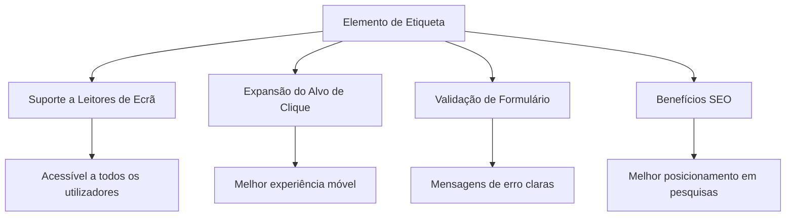
**O que as labels apropriadas conseguem:**
- **Permitem** que leitores de ecrã anunciem claramente os campos do formulário
- **Expandem** a área clicável (clicar no label foca o input)
- **Melhoram** a usabilidade móvel com alvos de toque maiores
- **Suportam** a validação do formulário com mensagens de erro significativas
- **Aumentam** o SEO ao fornecer significado semântico aos elementos do formulário

> 🎯 **Objetivo de Acessibilidade**: Cada input do formulário deve ter uma label associada. Esta prática simples torna os seus formulários utilizáveis por todos, incluindo utilizadores com deficiência, e melhora a experiência para todos os utilizadores.

### Criar o Formulário de Registo

O formulário de registo requer informação mais detalhada para criar uma conta completa de utilizador. Vamos construí-lo com funcionalidades modernas do HTML5 e acessibilidade melhorada.

```html
<hr/>
<h2>Register</h2>
<form id="registerForm" novalidate>
  <div class="form-group">
    <label for="user">Username</label>
    <input id="user" name="user" type="text" required 
           autocomplete="username" placeholder="Choose a username">
  </div>
  
  <div class="form-group">
    <label for="currency">Currency</label>
    <input id="currency" name="currency" type="text" value="$" 
           required maxlength="3" placeholder="USD, EUR, etc.">
  </div>
  
  <div class="form-group">
    <label for="description">Account Description</label>
    <input id="description" name="description" type="text" 
           maxlength="100" placeholder="Personal savings, checking, etc.">
  </div>
  
  <div class="form-group">
    <label for="balance">Starting Balance</label>
    <input id="balance" name="balance" type="number" value="0" 
           min="0" step="0.01" placeholder="0.00">
  </div>
  
  <button type="submit">Create Account</button>
</form>
```

**No exemplo acima, nós:**
- **Organizámos** cada campo em divs contentoras para melhor estilo e layout
- **Adicionámos** atributos `autocomplete` apropriados para suporte ao preenchimento automático do navegador
- **Incluímos** texto de placeholder útil para orientar a entrada do utilizador
- **Definimos** valores padrão sensatos usando o atributo `value`
- **Aplicámos** atributos de validação como `required`, `maxlength` e `min`
- **Usámos** `type="number"` para o campo de saldo com suporte a decimais

### Explorar Tipos e Comportamento de Input

**Tipos modernos de input fornecem funcionalidades avançadas:**

| Característica | Benefício | Exemplo |
|---------|---------|----------|
| `type="number"` | Teclado numérico em dispositivos móveis | Entrada mais fácil do saldo |
| `step="0.01"` | Controlo da precisão decimal | Permite cêntimos na moeda |
| `autocomplete` | Preenchimento automático do navegador | Preenchimento mais rápido do formulário |
| `placeholder` | Dicas contextuais | Orienta as expectativas do utilizador |

> 🎯 **Desafio de Acessibilidade**: Experimente navegar pelos formulários usando apenas o seu teclado! Use `Tab` para mover entre campos, `Space` para marcar caixas e `Enter` para submeter. Esta experiência ajuda a entender como utilizadores com leitores de ecrã interagem com os seus formulários.

### 🔄 **Verificação Pedagógica**
**Compreensão da Base dos Formulários**: Antes de implementar JavaScript, assegure-se de que compreende:
- ✅ Como o HTML semântico cria estruturas acessíveis de formulários
- ✅ Por que os tipos de input são importantes para teclados móveis e validação
- ✅ A relação entre labels e controlos do formulário
- ✅ Como os atributos do formulário afetam o comportamento padrão do browser

**Auto-teste Rápido**: O que acontece se submeter um formulário sem manipulação JavaScript?
*Resposta: O browser faz a submissão padrão, normalmente redirecionando para a URL da ação*

**Benefícios dos Formulários HTML5**: Os formulários modernos fornecem:
- **Validação incorporada**: Verificação automática do formato de email e números
- **Otimização para móvel**: Teclados apropriados para diferentes tipos de input
- **Acessibilidade**: Suporte a leitores de ecrã e navegação por teclado
- **Melhoria progressiva**: Funciona mesmo quando JavaScript está desativado

## Compreender Métodos de Submissão de Formulários

Quando alguém preenche o seu formulário e carrega em submeter, esses dados precisam de ir para algum lado – normalmente para um servidor que pode guardá-los. Existem algumas formas diferentes de o fazer, e saber qual usar pode poupar-lhe dores de cabeça mais tarde.

Vamos ver o que acontece de facto quando alguém carrega nesse botão de submeter.

### Comportamento Padrão do Formulário

Primeiro, observe o que acontece com a submissão básica do formulário:

**Teste os seus formulários atuais:**
1. Clique no botão *Registar* no seu formulário
2. Observe as mudanças na barra de endereço do navegador
3. Repare como a página recarrega e os dados aparecem na URL


### Comparação dos Métodos HTTP

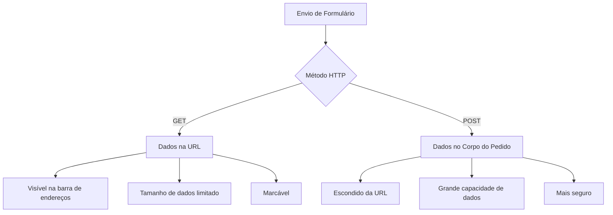
**Compreender as diferenças:**

| Método | Caso de Uso | Localização dos Dados | Nível de Segurança | Limite de Tamanho |
|--------|----------|---------------|----------------|-------------|
| `GET` | Consultas de pesquisa, filtros | Parâmetros na URL | Baixo (visível) | ~2000 caracteres |
| `POST` | Contas de utilizador, dados sensíveis | Corpo do pedido | Maior (oculto) | Sem limite prático |

**Compreender as diferenças fundamentais:**
- **GET**: Acrescenta os dados do formulário à URL como parâmetros de consulta (adequado para operações de pesquisa)
- **POST**: Inclui os dados no corpo do pedido (essencial para informações sensíveis)
- **Limitações do GET**: Restrições de tamanho, dados visíveis, histórico persistente no navegador
- **Vantagens do POST**: Grande capacidade de dados, proteção de privacidade, suporte a upload de ficheiros

> 💡 **Boa prática**: Use `GET` para formulários de pesquisa e filtros (recuperação de dados), use `POST` para registo de utilizadores, login e criação de dados.

### Configurar a Submissão do Formulário

Vamos configurar o seu formulário de registo para comunicar corretamente com a API backend usando o método POST:

```html
<form id="registerForm" action="//localhost:5000/api/accounts" 
      method="POST" novalidate>
```

**Isto é o que esta configuração faz:**
- **Direciona** a submissão do formulário para o seu endpoint da API
- **Usa** o método POST para transmissão segura dos dados
- **Inclui** `novalidate` para tratar validação com JavaScript

### Testar a Submissão do Formulário

**Siga estes passos para testar o seu formulário:**
1. **Preencha** o formulário de registo com a sua informação
2. **Clique** no botão "Criar Conta"
3. **Observe** a resposta do servidor no seu navegador

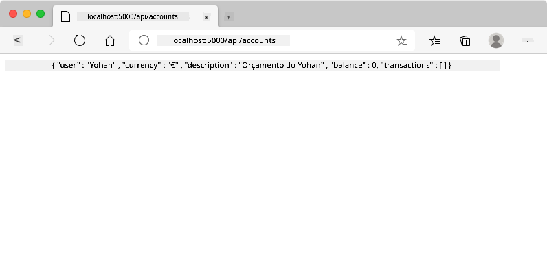

**O que deverá ver:**
- **O navegador redireciona** para a URL do endpoint da API
- **Resposta JSON** contendo os dados da conta que acabou de criar
- **Confirmação do servidor** que a conta foi criada com sucesso

> 🧪 **Hora do Experimento**: Tente registar novamente com o mesmo nome de utilizador. Que resposta obtém? Isto ajuda a perceber como o servidor gere dados duplicados e condições de erro.

### Compreender Respostas JSON

**Quando o servidor processa o seu formulário com sucesso:**
```json
{
  "user": "john_doe",
  "currency": "$",
  "description": "Personal savings",
  "balance": 100,
  "id": "unique_account_id"
}
```

**Esta resposta confirma que:**
- **Cria** uma nova conta com os dados especificados
- **Atribui** um identificador único para referência futura
- **Devolve** toda a informação da conta para verificação
- **Indica** armazenamento bem-sucedido na base de dados

## Manipulação Moderna de Formulários com JavaScript

As submissões tradicionais de formulários causam recarregamentos completos da página, de forma semelhante a como as primeiras missões espaciais exigiam reinicializações completas do sistema para correções de rota. Esta abordagem interrompe a experiência do utilizador e perde o estado da aplicação.

A manipulação de formulários com JavaScript funciona como os sistemas de orientação contínua usados pelas modernas naves espaciais – faz ajustes em tempo real sem perder o contexto da navegação. Podemos interceptar submissões de formulários, fornecer feedback imediato, tratar erros com elegância e atualizar a interface com base nas respostas do servidor enquanto mantemos a posição do utilizador na aplicação.

### Porque Evitar Recarregamentos de Página?

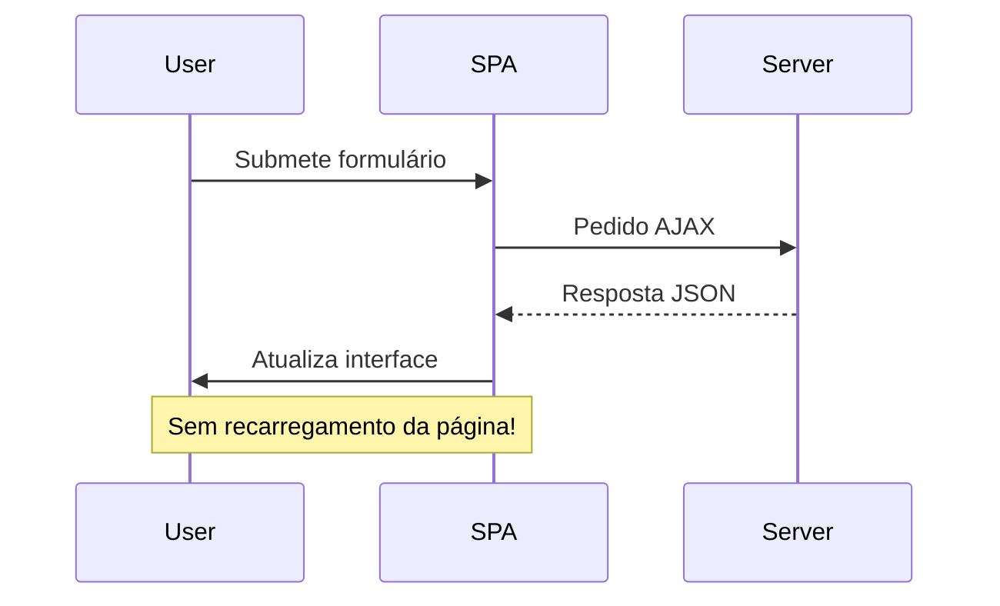
**Benefícios da manipulação de formulários com JavaScript:**
- **Mantém** o estado da aplicação e o contexto do utilizador
- **Fornece** feedback instantâneo e indicadores de carregamento
- **Permite** tratamento dinâmico de erros e validação
- **Cria** experiências fluidas, tipo app
- **Permite** lógica condicional com base em respostas do servidor

### Transição de Formulários Tradicionais para Modernos

**Desafios da abordagem tradicional:**
- **Redireciona** os utilizadores para fora da sua aplicação
- **Perde** o estado e contexto atual da aplicação
- **Exige** recarregamentos completos da página para operações simples
- **Oferece** controlo limitado sobre feedback ao utilizador

**Vantagens da abordagem moderna com JavaScript:**
- **Mantém** os utilizadores dentro da sua aplicação
- **Conserva** todo o estado e dados da aplicação
- **Habilita** validação e feedback em tempo real
- **Suporta** melhoria progressiva e acessibilidade

### Implementar Manipulação de Formulários com JavaScript

Vamos substituir a submissão tradicional do formulário por tratamento moderno de eventos JavaScript:

```html
<!-- Remove the action attribute and add event handling -->
<form id="registerForm" method="POST" novalidate>
```

**Adicione a lógica de registo ao seu ficheiro `app.js`:**

```javascript
// Manipulação moderna de formulários orientada por eventos
function register() {
  const registerForm = document.getElementById('registerForm');
  const formData = new FormData(registerForm);
  const data = Object.fromEntries(formData);
  const jsonData = JSON.stringify(data);
  
  console.log('Form data prepared:', data);
}

// Anexar ouvinte de eventos quando a página carrega
document.addEventListener('DOMContentLoaded', () => {
  const registerForm = document.getElementById('registerForm');
  registerForm.addEventListener('submit', (event) => {
    event.preventDefault(); // Prevenir o envio padrão do formulário
    register();
  });
});
```

**Analisando o que acontece aqui:**
- **Previne** a submissão padrão do formulário usando `event.preventDefault()`
- **Obtém** o elemento do formulário usando seleção moderna do DOM
- **Extrai** os dados do formulário usando a poderosa API `FormData`
- **Converte** os FormData num objeto simples com `Object.fromEntries()`
- **Serializa** os dados para formato JSON para comunicação com o servidor
- **Regista** os dados processados para depuração e verificação

### Compreender a API FormData

**A API FormData fornece manipulação poderosa de formulários:**
```javascript
// Exemplo do que o FormData captura
const formData = new FormData(registerForm);

// O FormData captura automaticamente:
// {
//   "user": "john_doe",
//   "currency": "$",
//   "description": "Conta pessoal",
//   "balance": "100"
// }
```

**Vantagens da API FormData:**
- **Coleção abrangente**: Captura todos os elementos do formulário incluindo texto, ficheiros e entradas complexas
- **Reconhecimento de tipos**: Lida automaticamente com diferentes tipos de entrada sem código personalizado
- **Eficiência**: Elimina a recolha manual dos campos com uma única chamada à API
- **Adaptabilidade**: Mantém a funcionalidade à medida que a estrutura do formulário evolui

### Criar a Função de Comunicação com o Servidor

Agora vamos construir uma função robusta para comunicar com o seu servidor API usando padrões modernos de JavaScript:

```javascript
async function createAccount(account) {
  try {
    const response = await fetch('//localhost:5000/api/accounts', {
      method: 'POST',
      headers: { 
        'Content-Type': 'application/json',
        'Accept': 'application/json'
      },
      body: account
    });
    
    // Verifique se a resposta foi bem-sucedida
    if (!response.ok) {
      throw new Error(`HTTP error! status: ${response.status}`);
    }
    
    return await response.json();
  } catch (error) {
    console.error('Account creation failed:', error);
    return { error: error.message || 'Network error occurred' };
  }
}
```

**Compreender JavaScript assíncrono:**

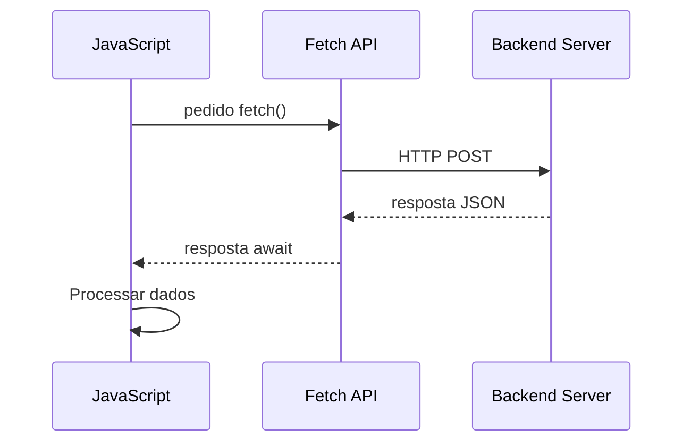
**O que esta implementação moderna realiza:**
- **Usa** `async/await` para código assíncrono legível
- **Inclui** manipulação adequada de erros com blocos try/catch
- **Verifica** o estado da resposta antes de processar os dados
- **Define** cabeçalhos apropriados para comunicação JSON
- **Fornece** mensagens detalhadas de erro para depuração
- **Devolve** estrutura de dados consistente para casos de sucesso e erro

### O Poder da API Fetch Moderna

**Vantagens da Fetch API sobre métodos antigos:**

| Característica | Benefício | Implementação |
|----------------|-----------|---------------|
| Baseada em Promessas | Código assíncrono limpo | `await fetch()` |
| Personalização do pedido | Controlo completo do HTTP | Cabeçalhos, métodos, corpo |
| Manipulação da resposta | Análise flexível dos dados | `.json()`, `.text()`, `.blob()` |
| Tratamento de erros | Captura abrangente de erros | Blocos try/catch |

> 🎥 **Saiba Mais**: [Tutorial Async/Await](https://youtube.com/watch?v=YwmlRkrxvkk) – Compreender padrões assíncronos de JavaScript para desenvolvimento web moderno.

**Conceitos chave para comunicação com o servidor:**
- **Funções async** permitem pausar a execução para aguardar respostas do servidor
- **Palavra-chave await** torna o código assíncrono semelhante a síncrono
- **Fetch API** fornece requisições HTTP modernas baseadas em promessas
- **Tratamento de erros** assegura que a aplicação responde adequadamente a problemas de rede

### Completar a Função de Registo

Vamos juntar tudo com uma função de registo completa e pronta para produção:

```javascript
async function register() {
  const registerForm = document.getElementById('registerForm');
  const submitButton = registerForm.querySelector('button[type="submit"]');
  
  try {
    // Mostrar estado de carregamento
    submitButton.disabled = true;
    submitButton.textContent = 'Creating Account...';
    
    // Processar dados do formulário
    const formData = new FormData(registerForm);
    const jsonData = JSON.stringify(Object.fromEntries(formData));
    
    // Enviar para o servidor
    const result = await createAccount(jsonData);
    
    if (result.error) {
      console.error('Registration failed:', result.error);
      alert(`Registration failed: ${result.error}`);
      return;
    }
    
    console.log('Account created successfully!', result);
    alert(`Welcome, ${result.user}! Your account has been created.`);
    
    // Repor formulário após registo bem-sucedido
    registerForm.reset();
    
  } catch (error) {
    console.error('Unexpected error:', error);
    alert('An unexpected error occurred. Please try again.');
  } finally {
    // Restaurar estado do botão
    submitButton.disabled = false;
    submitButton.textContent = 'Create Account';
  }
}
```

**Esta implementação melhorada inclui:**
- **Fornece** feedback visual durante o envio do formulário
- **Desativa** o botão de envio para evitar submissões duplicadas
- **Lida** graciosamente com erros esperados e inesperados
- **Mostra** mensagens de sucesso e erro amigáveis para o utilizador
- **Reinicia** o formulário após registo bem-sucedido
- **Restaura** o estado da interface independentemente do resultado

### Testar a Sua Implementação

**Abra as ferramentas de desenvolvimento do navegador e teste o registo:**

1. **Abra** a consola do navegador (F12 → separador Console)
2. **Preencha** o formulário de registo
3. **Clique** em "Criar Conta"
4. **Observe** as mensagens na consola e o feedback ao utilizador


**O que deve observar:**
- **Estado de carregamento** aparece no botão de envio
- **Logs na consola** mostram informações detalhadas sobre o processo
- **Mensagem de sucesso** aparece quando a criação da conta é bem-sucedida
- **O formulário reinicia-se** automaticamente após a submissão bem-sucedida

> 🔒 **Consideração de Segurança**: Atualmente, os dados viajam por HTTP, que não é seguro para produção. Em aplicações reais, use sempre HTTPS para encriptar a transmissão de dados. Saiba mais sobre [segurança HTTPS](https://en.wikipedia.org/wiki/HTTPS) e porque é essencial para proteger os dados do utilizador.

### 🔄 **Verificação Pedagógica**
**Integração de JavaScript Moderno**: Verifique o seu entendimento sobre manipulação assíncrona de formulários:
- ✅ Como o `event.preventDefault()` altera o comportamento padrão do formulário?
- ✅ Por que a API FormData é mais eficiente que a recolha manual de campos?
- ✅ Como os padrões async/await melhoram a legibilidade do código?
- ✅ Qual o papel da manipulação de erros na experiência do utilizador?

**Arquitetura do Sistema**: A sua manipulação de formulários demonstra:
- **Programação Orientada a Eventos**: Formulários respondem às ações do utilizador sem recarregar a página
- **Comunicação Assíncrona**: Pedidos ao servidor não bloqueiam a interface do utilizador
- **Tratamento de Erros**: Degradação graciosa quando falham pedidos de rede
- **Gestão de Estado**: Atualizações da UI refletem adequadamente respostas do servidor
- **Melhoria Progressiva**: Funcionalidade base funciona, e o JavaScript melhora-a

**Padrões Profissionais**: Implementou:
- **Responsabilidade Única**: Funções com propósitos claros e focados
- **Limites de Erro**: Blocos try/catch previnem falhas da aplicação
- **Feedback ao Utilizador**: Estados de carregamento e mensagens de sucesso/erro
- **Transformação de Dados**: FormData para JSON para comunicação com o servidor

## Validação Abrangente de Formulários

A validação de formulários previne a experiência frustrante de descobrir erros só após o envio. Como os múltiplos sistemas redundantes na Estação Espacial Internacional, a validação eficaz emprega múltiplas camadas de verificações de segurança.

A abordagem ideal combina validação ao nível do navegador para feedback imediato, validação em JavaScript para melhorar a experiência do utilizador, e validação no servidor para segurança e integridade dos dados. Esta redundância assegura a satisfação do utilizador e a proteção do sistema.

### Compreender as Camadas de Validação

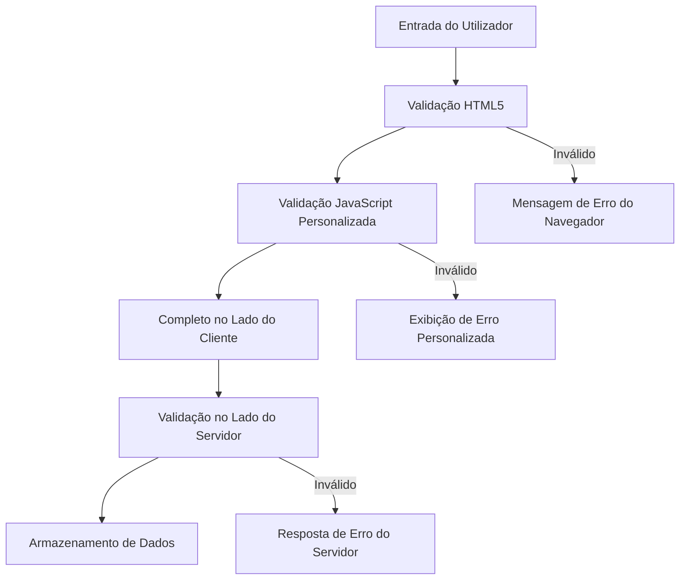
**Estratégia de validação em múltiplas camadas:**
- **Validação HTML5**: Verificações imediatas no navegador
- **Validação JavaScript**: Lógica personalizada e melhor experiência do utilizador
- **Validação no servidor**: Verificações finais de segurança e integridade de dados
- **Melhoria progressiva**: Funciona mesmo que o JavaScript esteja desativado

### Atributos de Validação HTML5

**Ferramentas modernas ao seu dispor:**

| Atributo | Propósito | Exemplo | Comportamento do navegador |
|----------|-----------|---------|-----------------------------|
| `required` | Campos obrigatórios | `<input required>` | Impede submissão vazia |
| `minlength`/`maxlength` | Limites de comprimento de texto | `<input maxlength="20">` | Impõe limites de caracteres |
| `min`/`max` | Intervalos numéricos | `<input min="0" max="1000">` | Valida limites numéricos |
| `pattern` | Regras regex personalizadas | `<input pattern="[A-Za-z]+">` | Correspondência a formatos específicos |
| `type` | Validação do tipo de dados | `<input type="email">` | Validação baseada no formato |

### Estilização CSS para Validação

**Crie feedback visual para os estados de validação:**

```css
/* Valid input styling */
input:valid {
  border-color: #28a745;
  background-color: #f8fff9;
}

/* Invalid input styling */
input:invalid {
  border-color: #dc3545;
  background-color: #fff5f5;
}

/* Focus states for better accessibility */
input:focus:valid {
  box-shadow: 0 0 0 0.2rem rgba(40, 167, 69, 0.25);
}

input:focus:invalid {
  box-shadow: 0 0 0 0.2rem rgba(220, 53, 69, 0.25);
}
```

**O que estes sinais visuais conseguem:**
- **Bordas verdes**: Indicam validação bem-sucedida, como luzes verdes no controlo da missão
- **Bordas vermelhas**: Sinalizam erros de validação que requerem atenção
- **Realces no foco**: Fornecem contexto visual claro para a entrada atual
- **Estilização consistente**: Estabelece padrões previsíveis para os utilizadores aprenderem

> 💡 **Dica profissional**: Use as pseudo-classes CSS `:valid` e `:invalid` para fornecer feedback visual imediato conforme os utilizadores escrevem, criando uma interface responsiva e útil.

### Implementar Validação Abrangente

Vamos reforçar o seu formulário de registo com validação robusta que fornece excelente experiência ao utilizador e qualidade dos dados:

```html
<form id="registerForm" method="POST" novalidate>
  <div class="form-group">
    <label for="user">Username <span class="required">*</span></label>
    <input id="user" name="user" type="text" required 
           minlength="3" maxlength="20" 
           pattern="[a-zA-Z0-9_]+" 
           autocomplete="username"
           title="Username must be 3-20 characters, letters, numbers, and underscores only">
    <small class="form-text">Choose a unique username (3-20 characters)</small>
  </div>
  
  <div class="form-group">
    <label for="currency">Currency <span class="required">*</span></label>
    <input id="currency" name="currency" type="text" required 
           value="$" maxlength="3" 
           pattern="[A-Z$€£¥₹]+" 
           title="Enter a valid currency symbol or code">
    <small class="form-text">Currency symbol (e.g., $, €, £)</small>
  </div>
  
  <div class="form-group">
    <label for="description">Account Description</label>
    <input id="description" name="description" type="text" 
           maxlength="100" 
           placeholder="Personal savings, checking, etc.">
    <small class="form-text">Optional description (up to 100 characters)</small>
  </div>
  
  <div class="form-group">
    <label for="balance">Starting Balance</label>
    <input id="balance" name="balance" type="number" 
           value="0" min="0" step="0.01" 
           title="Enter a positive number for your starting balance">
    <small class="form-text">Initial account balance (minimum $0.00)</small>
  </div>
  
  <button type="submit">Create Account</button>
</form>
```

**Compreender a validação melhorada:**
- **Combina** indicadores de campos obrigatórios com descrições úteis
- **Inclui** atributos `pattern` para validação de formato
- **Fornece** atributos `title` para acessibilidade e dicas
- **Adiciona** texto auxiliar para orientar a introdução do utilizador
- **Usa** estrutura HTML semântica para melhor acessibilidade

### Regras Avançadas de Validação

**O que cada regra de validação realiza:**

| Campo | Regras de Validação | Benefício para o Utilizador |
|-------|---------------------|-----------------------------|
| Nome de utilizador | `required`, `minlength="3"`, `maxlength="20"`, `pattern="[a-zA-Z0-9_]+"` | Garante identificadores válidos e únicos |
| Moeda | `required`, `maxlength="3"`, `pattern="[A-Z$€£¥₹]+"` | Aceita símbolos comuns de moeda |
| Saldo | `min="0"`, `step="0.01"`, `type="number"` | Evita saldos negativos |
| Descrição | `maxlength="100"` | Limites razoáveis de comprimento |

### Testar o Comportamento da Validação

**Experimente estes cenários de validação:**
1. **Submeta** o formulário com campos obrigatórios vazios
2. **Introduza** um nome de utilizador com menos de 3 caracteres
3. **Tente** caracteres especiais no campo do nome de utilizador
4. **Introduza** um valor negativo no saldo

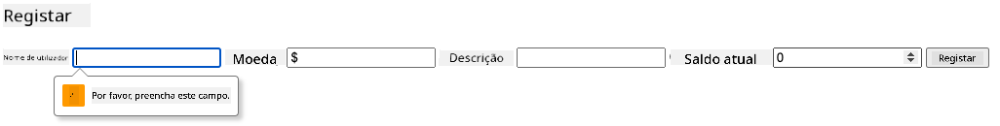

**O que irá observar:**
- **O navegador exibe** mensagens de validação nativas
- **Mudanças de estilo** baseadas nos estados `:valid` e `:invalid`
- **Submissão do formulário** é bloqueada até todas as validações passarem
- **O foco move-se automaticamente** para o primeiro campo inválido

### Validação no Cliente vs Validação no Servidor

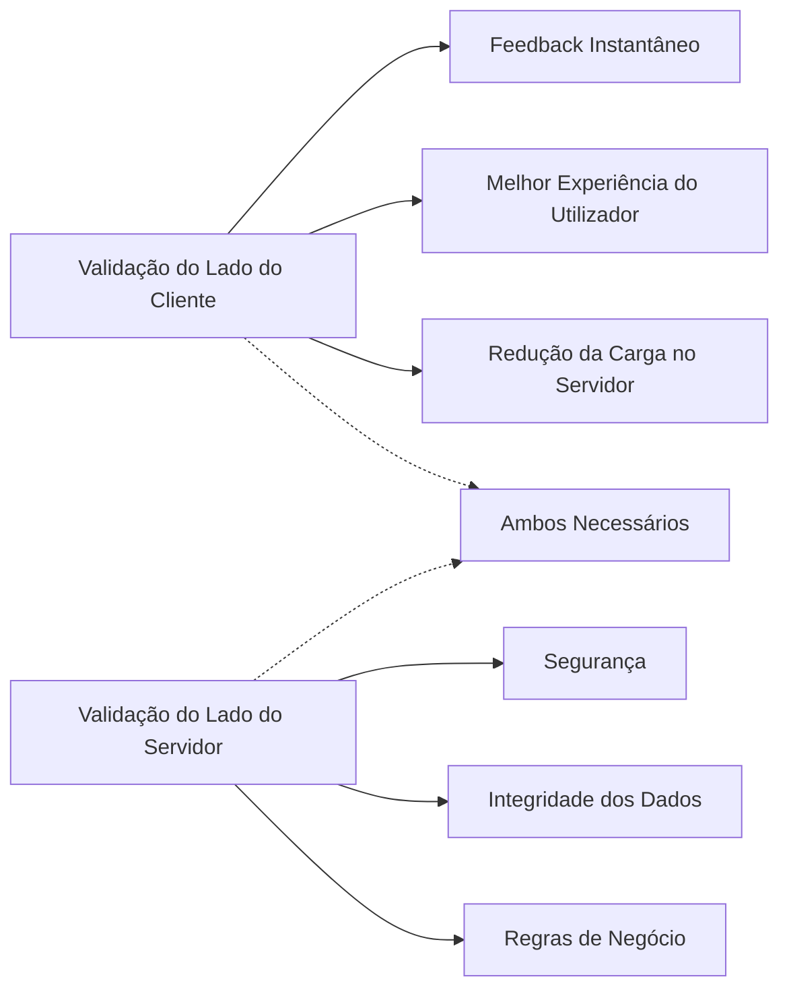
**Porquê precisar de ambas as camadas:**
- **Validação no cliente**: Fornece feedback imediato e melhora a experiência do utilizador
- **Validação no servidor**: Garante segurança e lida com regras de negócio complexas
- **Abordagem combinada**: Cria aplicações robustas, amigáveis e seguras
- **Melhoria progressiva**: Funciona mesmo quando o JavaScript está desativado

> 🛡️ **Lembrete de Segurança**: Nunca confie apenas na validação do lado do cliente! Utilizadores maliciosos podem contornar essas validações, por isso a validação no servidor é essencial para segurança e integridade dos dados.

### ⚡ **O Que Pode Fazer Nos Próximos 5 Minutos**
- [ ] Testar o seu formulário com dados inválidos para ver as mensagens de validação
- [ ] Tentar submeter o formulário com JavaScript desativado para ver a validação HTML5
- [ ] Abrir as ferramentas de desenvolvimento do navegador e inspecionar dados do formulário enviados ao servidor
- [ ] Experimentar diferentes tipos de entrada para ver as alterações no teclado móvel

### 🎯 **O Que Pode Realizar Nesta Hora**
- [ ] Completar o questionário pós-aula e entender conceitos de manipulação de formulários
- [ ] Implementar o desafio de validação abrangente com feedback em tempo real
- [ ] Adicionar estilização CSS para criar formulários profissionais
- [ ] Criar tratamento de erro para nomes de utilizador duplicados e erros do servidor
- [ ] Adicionar campos de confirmação de password com validação de correspondência

### 📅 **A Sua Jornada de Domínio de Formulários ao Longo da Semana**
- [ ] Completar a aplicação bancária completa com funcionalidades avançadas de formulários
- [ ] Implementar capacidades de upload de ficheiros para fotos de perfil ou documentos
- [ ] Adicionar formulários multi-etapas com indicadores de progresso e gestão de estado
- [ ] Criar formulários dinâmicos que se adaptam com base nas seleções do utilizador
- [ ] Implementar autosave e recuperação de formulários para melhor experiência do utilizador
- [ ] Adicionar validação avançada como verificação de email e formatação de número de telefone

### 🌟 **O Seu Domínio do Desenvolvimento Frontend ao Longo do Mês**
- [ ] Construir aplicações complexas de formulários com lógica condicional e fluxos de trabalho
- [ ] Aprender bibliotecas e frameworks para desenvolvimento rápido de formulários
- [ ] Dominar guidelines de acessibilidade e princípios de design inclusivo
- [ ] Implementar internacionalização e localização para formulários globais
- [ ] Criar bibliotecas de componentes reutilizáveis e sistemas de design para formulários
- [ ] Contribuir para projetos open source de formulários e partilhar boas práticas

## 🎯 O Seu Cronograma de Domínio do Desenvolvimento de Formulários

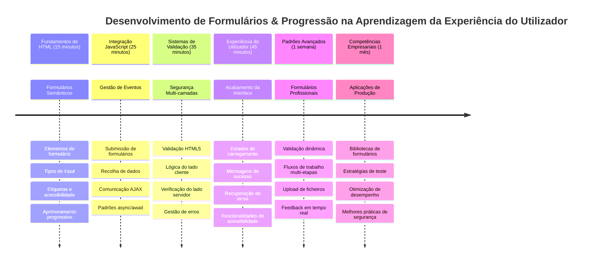
### 🛠️ Resumo da Sua Caixa de Ferramentas para Desenvolvimento de Formulários

Após completar esta lição, dominou:
- **Formulários HTML5**: Estrutura semântica, tipos de entrada, e funcionalidades de acessibilidade
- **Manipulação de Formulários em JavaScript**: Gestão de eventos, recolha de dados e comunicação AJAX
- **Arquitetura de Validação**: Validação em múltiplas camadas para segurança e experiência do utilizador
- **Programação Assíncrona**: Fetch API moderna e padrões async/await
- **Gestão de Erros**: Tratamento abrangente de erros e sistemas de feedback ao utilizador
- **Design de Experiência do Utilizador**: Estados de carregamento, mensagens de sucesso, e recuperação de erros
- **Melhoria Progressiva**: Formulários que funcionam em todos os navegadores e capacidades

**Aplicações no Mundo Real**: As suas competências em desenvolvimento de formulários aplicam-se diretamente a:
- **Aplicações de Comércio Eletrónico**: Processos de checkout, registo de conta e formulários de pagamento
- **Software Empresarial**: Sistemas de inserção de dados, interfaces de relatórios e aplicações de fluxos de trabalho
- **Gestão de Conteúdos**: Plataformas de publicação, conteúdos gerados pelos utilizadores e interfaces administrativas
- **Aplicações Financeiras**: Interfaces bancárias, plataformas de investimento e sistemas de transação
- **Sistemas de Saúde**: Portais de pacientes, agendamento de consultas e formulários de registos médicos
- **Plataformas Educativas**: Registo de cursos, ferramentas de avaliação e gestão da aprendizagem

**Competências Profissionais Adquiridas**: Agora pode:
- **Projetar** formulários acessíveis que funcionam para todos os utilizadores, incluindo pessoas com deficiência
- **Implementar** validação segura de formulários que previne corrupção de dados e vulnerabilidades de segurança
- **Criar** interfaces responsivas que fornecem feedback claro e orientação
- **Depurar** interações complexas de formulários usando ferramentas de desenvolvimento de navegador e análise de rede
- **Otimizar** o desempenho dos formulários através de recolha eficiente de dados e estratégias de validação

**Conceitos de Desenvolvimento Frontend Dominados**:
- **Arquitetura Orientada a Eventos**: Gestão de interação do utilizador e sistemas de resposta
- **Programação Assíncrona**: Comunicação com servidor sem bloqueios e manipulação de erros
- **Validação de Dados**: Verificações de segurança e integridade no cliente e no servidor
- **Design de Experiência do Utilizador**: Interfaces intuitivas que guiam o utilizador para o sucesso
- **Engenharia de Acessibilidade**: Design inclusivo que funciona para necessidades diversas

**Próximo Nível**: Está pronto para explorar bibliotecas avançadas de formulários, implementar regras de validação complexas, ou construir sistemas empresariais de recolha de dados!

🌟 **Conquista Desbloqueada**: Construiu um sistema completo de manipulação de formulários com validação profissional, tratamento de erros e padrões de experiência do utilizador!

---


---

## Desafio GitHub Copilot Agent 🚀

Use o modo Agente para completar o seguinte desafio:

**Descrição:** Reforce o formulário de registo com validação abrangente do lado do cliente e feedback ao utilizador. Este desafio irá ajudá-lo a praticar validação de formulários, tratamento de erros e melhorar a experiência do utilizador com feedback interativo.
**Prompt:** Crie um sistema completo de validação de formulário para o formulário de registro que inclua: 1) Feedback de validação em tempo real para cada campo enquanto o utilizador escreve, 2) Mensagens de validação personalizadas que aparecem abaixo de cada campo de entrada, 3) Um campo de confirmação de palavra-passe com validação de correspondência, 4) Indicadores visuais (como marcas de verificação verdes para campos válidos e avisos vermelhos para inválidos), 5) Um botão de envio que só fica ativado quando todas as validações são aprovadas. Utilize atributos de validação HTML5, CSS para estilizar os estados de validação e JavaScript para o comportamento interativo.

Saiba mais sobre o [modo agente](https://code.visualstudio.com/blogs/2025/02/24/introducing-copilot-agent-mode) aqui.

## 🚀 Desafio

Mostre uma mensagem de erro no HTML se o utilizador já existir.

Aqui está um exemplo de como pode ficar a página de login final após alguma estilização:


## Quiz Pós-Lição

[Quiz pós-lição](https://ff-quizzes.netlify.app/web/quiz/44)

## Revisão & Autoestudo

Os programadores têm estado muito criativos nos seus esforços de construção de formulários, especialmente no que toca a estratégias de validação. Aprenda sobre diferentes fluxos de formulários explorando o [CodePen](https://codepen.com); consegue encontrar alguns formulários interessantes e inspiradores?

## Tarefa

[Estilize a sua app bancária](assignment.md)

---

<!-- CO-OP TRANSLATOR DISCLAIMER START -->
**Aviso Legal**:
Este documento foi traduzido utilizando o serviço de tradução por IA [Co-op Translator](https://github.com/Azure/co-op-translator). Embora nos esforcemos por garantir a precisão, por favor tenha em consideração que traduções automáticas podem conter erros ou imprecisões. O documento original na sua língua nativa deve ser considerado a fonte autorizada. Para informações críticas, recomenda-se tradução profissional realizada por humanos. Não nos responsabilizamos por quaisquer mal-entendidos ou interpretações incorretas decorrentes da utilização desta tradução.
<!-- CO-OP TRANSLATOR DISCLAIMER END -->