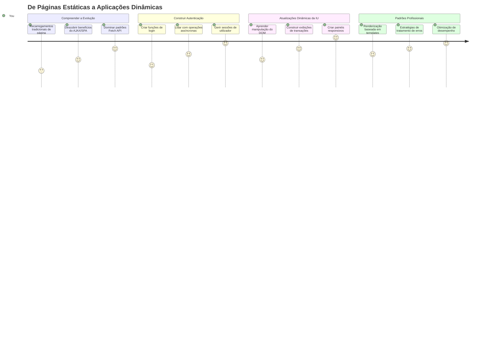
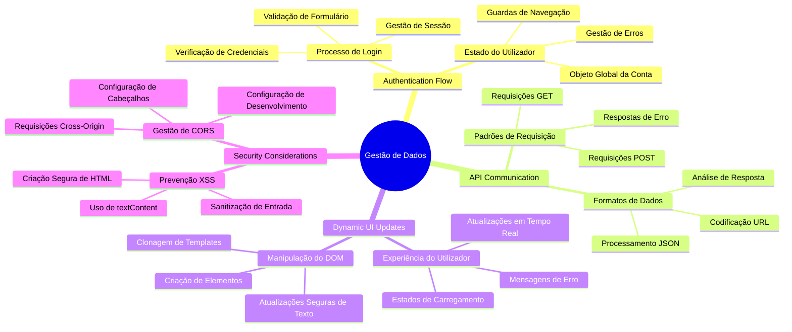
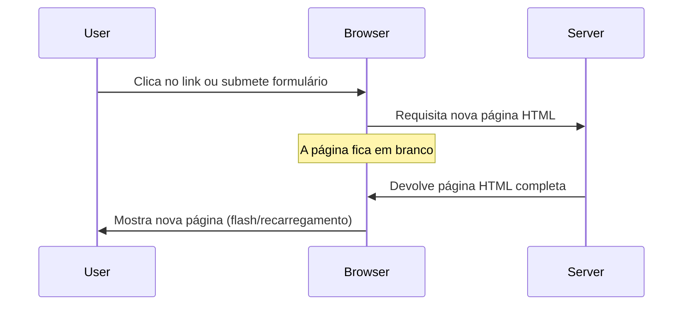
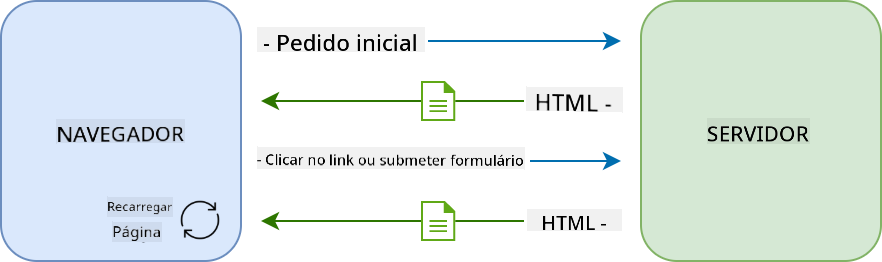
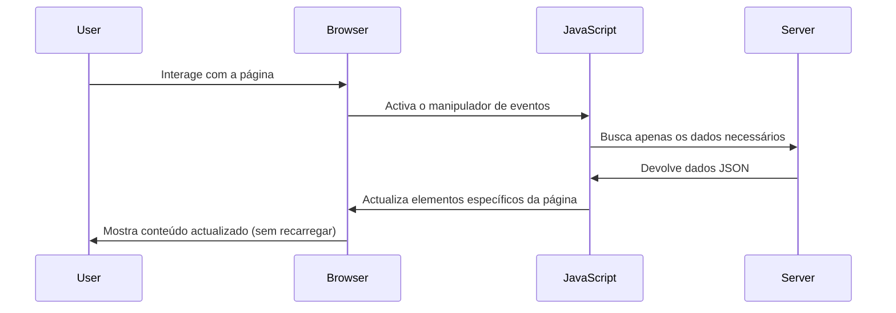
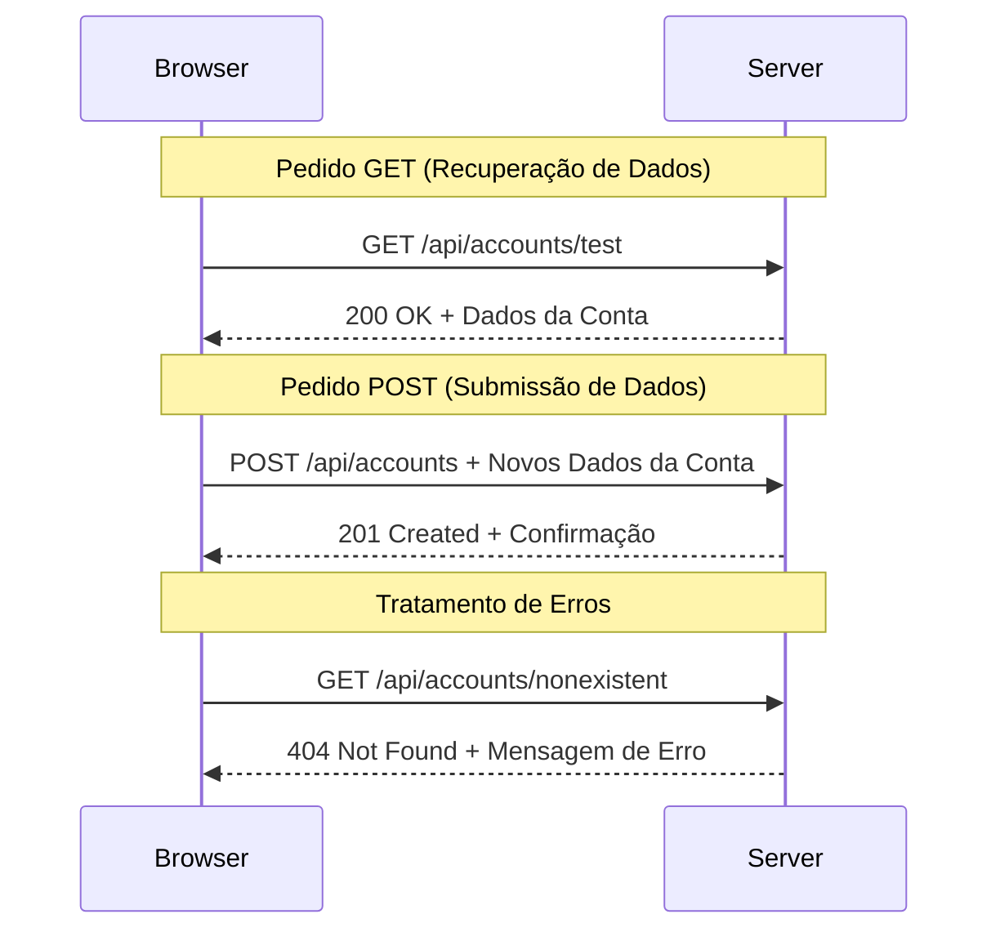
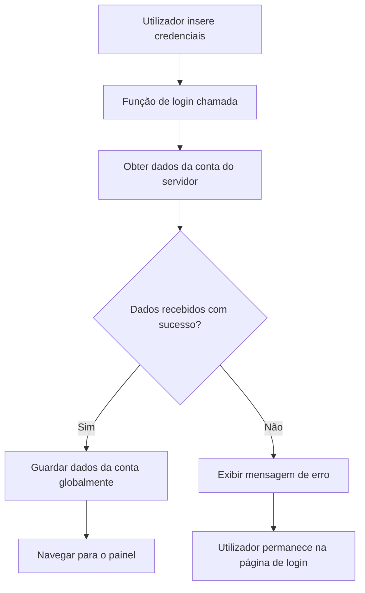
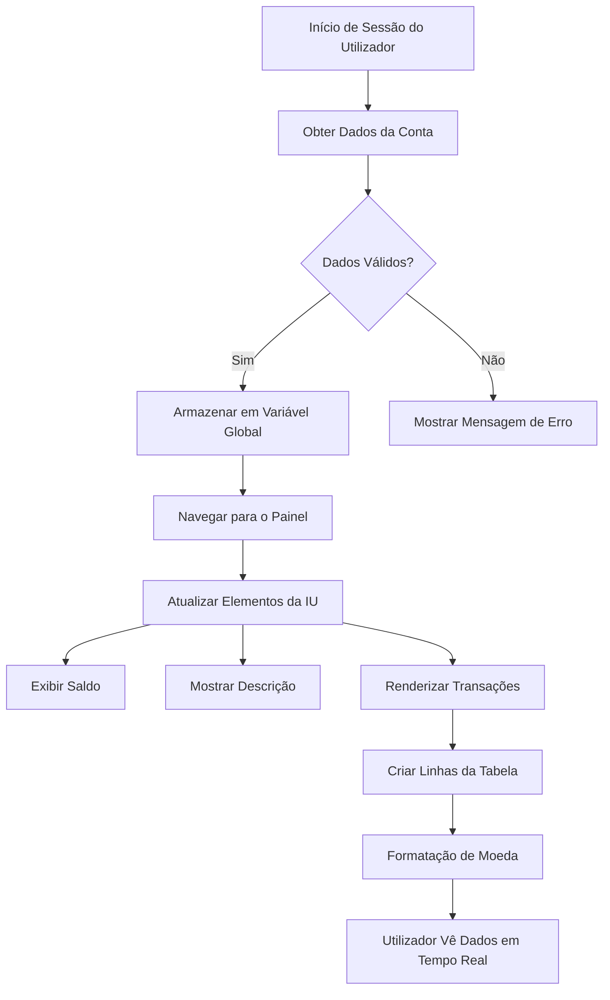
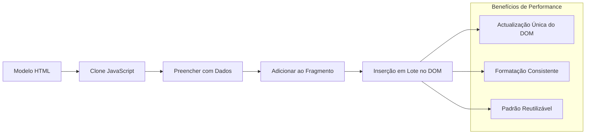
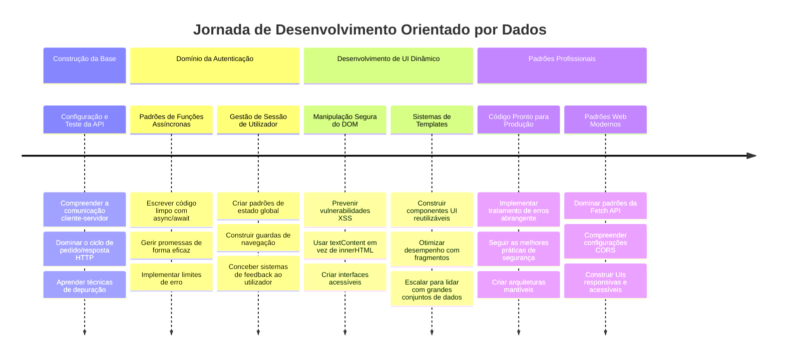

<!--
CO_OP_TRANSLATOR_METADATA:
{
  "original_hash": "86ee5069f27ea3151389d8687c95fac9",
  "translation_date": "2026-01-06T18:12:51+00:00",
  "source_file": "7-bank-project/3-data/README.md",
  "language_code": "pt"
}
-->
# Construir uma App Bancária Parte 3: Métodos de Obtenção e Utilização de Dados

Pense no computador da Enterprise em Star Trek – quando o Capitão Picard pede o estado da nave, a informação aparece instantaneamente sem que toda a interface desligue e se reconstrua. Esse fluxo contínuo de informações é exatamente o que estamos a construir aqui com a obtenção dinâmica de dados.

Neste momento, a sua app bancária é como um jornal impresso – informativa mas estática. Vamos transformá-la em algo mais como o controlo de missão da NASA, onde os dados fluem continuamente e são atualizados em tempo real sem interromper o fluxo de trabalho do utilizador.

Vai aprender a comunicar com servidores de forma assíncrona, lidar com dados que chegam em momentos diferentes e transformar informação bruta em algo significativo para os seus utilizadores. Esta é a diferença entre uma demo e um software pronto para produção.

## ⚡ O Que Pode Fazer Nos Próximos 5 Minutos

**Caminho Rápido para Desenvolvedores Ocupados**


- **Minutos 1-2**: Inicie o seu servidor API (`cd api && npm start`) e teste a ligação
- **Minuto 3**: Crie uma função básica `getAccount()` usando fetch
- **Minuto 4**: Ligue o formulário de login com `action="javascript:login()"`
- **Minuto 5**: Teste o login e veja os dados da conta aparecerem na consola

**Comandos de Teste Rápido**:
```bash
# Verificar se a API está a funcionar
curl http://localhost:5000/api

# Testar a obtenção de dados da conta
curl http://localhost:5000/api/accounts/test
```

**Porquê Isto é Importante**: Em 5 minutos, verá a magia da obtenção de dados assíncrona que alimenta todas as aplicações web modernas. Esta é a base que torna as apps responsivas e dinâmicas.

## 🗺️ O Seu Percurso de Aprendizagem em Aplicações Web Baseadas em Dados


**Destino do Seu Percurso**: No final desta lição, vai entender como as aplicações web modernas obtêm, processam e exibem dados dinamicamente, criando as experiências de utilizador fluídas que esperamos de aplicações profissionais.

## Questionário Pré-Aula

[Questionário pré-aula](https://ff-quizzes.netlify.app/web/quiz/45)

### Pré-requisitos

Antes de mergulhar na obtenção de dados, tenha estes componentes prontos:

- **Lição Anterior**: Complete o [Formulário de Login e Registo](../2-forms/README.md) – vamos construir sobre esta base
- **Servidor Local**: Instale [Node.js](https://nodejs.org) e [execute o servidor API](../api/README.md) para fornecer dados da conta
- **Ligação à API**: Teste a ligação ao seu servidor com este comando:

```bash
curl http://localhost:5000/api
# Resposta esperada: "API do Banco v1.0.0"
```

Este teste rápido assegura que todos os componentes estão a comunicar corretamente:
- Verifica que o Node.js está a funcionar corretamente no seu sistema
- Confirma que o seu servidor API está ativo e a responder
- Valida que a sua app pode alcançar o servidor (como verificar contacto rádio antes de uma missão)

## 🧠 Visão Geral do Ecossistema de Gestão de Dados


**Princípio Fundamental**: Aplicações web modernas são sistemas de orquestração de dados – coordenam interfaces de utilizador, APIs de servidor e modelos de segurança do navegador para criar experiências fluidas e responsivas.

---

## Compreender a Obtenção de Dados em Aplicações Web Modernas

A forma como as aplicações web lidam com dados evoluiu dramaticamente nas últimas duas décadas. Compreender esta evolução ajudará a apreciar porque técnicas modernas como AJAX e a API Fetch são tão poderosas e por que se tornaram ferramentas essenciais para os desenvolvedores web.

Vamos explorar como os sites tradicionais funcionavam comparados com as aplicações dinâmicas e responsivas que construímos hoje.

### Aplicações Tradicionais de Múltiplas Páginas (MPA)

Nos primórdios da web, cada clique era como mudar de canal numa televisão antiga – o ecrã ficava em branco e depois sintonizava lentamente o novo conteúdo. Esta era a realidade das primeiras aplicações web, onde cada interação significava reconstruir a página inteira do zero.




**Porque este método parecia pesado:**
- Cada clique implicava reconstruir a página inteira do zero
- Os utilizadores eram interrompidos no meio do pensamento por aqueles flashes irritantes de página
- A ligação à internet trabalhava em excesso a descarregar o mesmo cabeçalho e rodapé repetidamente
- As apps pareciam mais um arquivo de gavetas para clicar do que software a usar

### Aplicações Modernas de Página Única (SPA)

AJAX (JavaScript assíncrono e XML) mudou este paradigma completamente. Como o design modular da Estação Espacial Internacional, onde os astronautas podem substituir componentes individuais sem reconstruir toda a estrutura, AJAX permite-nos atualizar partes específicas de uma página sem recarregar tudo. Apesar do nome mencionar XML, hoje em dia usamos principalmente JSON, mas o princípio central mantém-se: atualizar apenas o que precisa de mudar.




**Porque é que as SPAs parecem muito melhores:**
- Só as partes que realmente mudaram são atualizadas (inteligente, certo?)
- Sem interrupções bruscas – o utilizador mantém o seu fluxo
- Menos dados a viajar, significado carregamentos mais rápidos
- Tudo parece rápido e responsivo, como as apps no seu telemóvel

### A Evolução para a API Fetch Moderna

Os navegadores modernos fornecem a [`Fetch` API](https://developer.mozilla.org/docs/Web/API/Fetch_API), que substitui o antigo [`XMLHttpRequest`](https://developer.mozilla.org/docs/Web/API/XMLHttpRequest/Using_XMLHttpRequest). Como a diferença entre operar um telégrafo e usar email, a API Fetch usa promessas para um código assíncrono mais limpo e manipula JSON naturalmente.

| Característica | XMLHttpRequest | Fetch API |
|---------|----------------|----------|
| **Sintaxe** | Complexa baseada em callbacks | Limpa baseada em promessas |
| **Manipulação de JSON** | Análise manual necessária | Método `.json()` incorporado |
| **Gestão de Erros** | Informações limitadas | Detalhes completos de erros |
| **Suporte Moderno** | Compatibilidade legado | Promessas ES6+ e async/await |

> 💡 **Compatibilidade dos Navegadores**: Boas notícias – a Fetch API funciona em todos os navegadores modernos! Se tiver curiosidade sobre versões específicas, [caniuse.com](https://caniuse.com/fetch) tem a história completa de compatibilidade.
> 
**Conclusão:**
- Funciona bem no Chrome, Firefox, Safari e Edge (basicamente em todo o lado onde os utilizadores estão)
- Apenas o Internet Explorer precisa de ajuda extra (e honestamente, está na hora de deixar o IE para trás)
- Prepara-o perfeitamente para os padrões elegantes async/await que usaremos mais tarde

### Implementar Login de Utilizador e Recuperação de Dados

Agora vamos implementar o sistema de login que transforma a sua app bancária de uma exibição estática numa aplicação funcional. Como os protocolos de autenticação usados em instalações militares seguras, vamos verificar as credenciais do utilizador e depois fornecer acesso aos seus dados específicos.

Vamos construir isso incrementalmente, começando com a autenticação básica e depois adicionando a capacidade de obter dados.

#### Passo 1: Criar a Fundação da Função de Login

Abra o seu ficheiro `app.js` e adicione uma nova função `login`. Esta vai tratar do processo de autenticação:

```javascript
async function login() {
  const loginForm = document.getElementById('loginForm');
  const user = loginForm.user.value;
}
```

**Vamos detalhar este código:**
- A palavra-chave `async`? Está a dizer ao JavaScript "ei, esta função pode precisar de esperar por coisas"
- Estamos a obter o nosso formulário da página (nada de especial, apenas a encontrar pelo ID)
- Depois extraímos o que o utilizador digitou como nome de utilizador
- Aqui está um truque: pode aceder a qualquer input do formulário pelo seu atributo `name` – não precisa de chamadas extras getElementById!

> 💡 **Padrão de Acesso a Formulários**: Cada controlo de formulário pode ser acedido pelo seu nome (definido em HTML usando o atributo `name`) como uma propriedade do elemento de formulário. Isto fornece uma forma limpa e legível de obter os dados do formulário.

#### Passo 2: Criar a Função de Obtenção de Dados da Conta

A seguir, vamos criar uma função dedicada para obter os dados da conta do servidor. Isto segue o mesmo padrão da sua função de registo mas foca-se na obtenção de dados:

```javascript
async function getAccount(user) {
  try {
    const response = await fetch('//localhost:5000/api/accounts/' + encodeURIComponent(user));
    return await response.json();
  } catch (error) {
    return { error: error.message || 'Unknown error' };
  }
}
```

**Isto é o que este código faz:**
- **Usa** a moderna API `fetch` para solicitar dados de forma assíncrona
- **Constrói** uma URL para uma requisição GET com o parâmetro do nome de utilizador
- **Aplica** `encodeURIComponent()` para tratar caracteres especiais nas URLs em segurança
- **Converte** a resposta para o formato JSON para facilitar a manipulação dos dados
- **Lida** com erros de forma elegante, retornando um objeto de erro em vez de falhar

> ⚠️ **Nota de Segurança**: A função `encodeURIComponent()` trata caracteres especiais em URLs. Como os sistemas de codificação usados em comunicações navais, garante que a sua mensagem chega exatamente como pretendida, prevenindo que caracteres como "#" ou "&" sejam mal interpretados.
> 
**Porque isto é importante:**
- Prevém que caracteres especiais partam URLs
- Protege contra ataques de manipulação de URL
- Garante que o seu servidor recebe os dados pretendidos
- Segue práticas seguras de programação

#### Compreender Requisições HTTP GET

Aqui está algo que pode surpreendê-lo: quando usa `fetch` sem opções adicionais, ele cria automaticamente uma requisição [`GET`](https://developer.mozilla.org/docs/Web/HTTP/Methods/GET). Isto é perfeito para o que estamos a fazer – pedir ao servidor "ei, posso ver os dados da conta deste utilizador?"

Pense nas requisições GET como pedir educadamente emprestado um livro na biblioteca – está a solicitar ver algo que já existe. Requisições POST (que usamos para registo) são mais como submeter um novo livro para adicionar à coleção.

| Requisição GET | Requisição POST |
|-------------|-------------|
| **Objetivo** | Recuperar dados existentes | Enviar dados novos ao servidor |
| **Parâmetros** | Na URL / query string | No corpo da requisição |
| **Cache** | Pode ser guardada em cache pelos navegadores | Normalmente não é guardada em cache |
| **Segurança** | Visível na URL/logs | Oculto no corpo da requisição |


#### Passo 3: Juntar Tudo

Agora a parte satisfatória – vamos ligar a função de obtenção da conta ao processo de login. É aqui que tudo se encaixa:

```javascript
async function login() {
  const loginForm = document.getElementById('loginForm');
  const user = loginForm.user.value;
  const data = await getAccount(user);

  if (data.error) {
    return console.log('loginError', data.error);
  }

  account = data;
  navigate('/dashboard');
}
```

Esta função segue uma sequência clara:
- Extrai o nome do utilizador do input do formulário
- Solicita os dados da conta do utilizador ao servidor
- Trata quaisquer erros que ocorram durante o processo
- Armazena os dados da conta e navega para o dashboard em caso de sucesso

> 🎯 **Padrão Async/Await**: Como `getAccount` é uma função assíncrona, usamos a palavra-chave `await` para pausar a execução até o servidor responder. Isto previne que o código continue com dados indefinidos.

#### Passo 4: Criar um Local para os Seus Dados

A sua app precisa de um local para guardar a informação da conta depois de carregada. Pense nisto como a memória de curto prazo da sua app – um lugar para manter os dados do utilizador atual à mão. Adicione esta linha no topo do seu ficheiro `app.js`:

```javascript
// Isto contém os dados da conta do utilizador atual
let account = null;
```

**Porque precisamos disto:**
- Mantém os dados da conta acessíveis de qualquer parte da sua app
- Começar com `null` significa "ninguém está logado ainda"
- Atualiza-se quando alguém faz login ou regista com sucesso
- Age como uma fonte única de verdade – nenhuma confusão sobre quem está logado

#### Passo 5: Ligar o Seu Formulário

Agora vamos ligar a sua nova função de login ao formulário HTML. Atualize a tag do seu formulário assim:

```html
<form id="loginForm" action="javascript:login()">
  <!-- Your existing form inputs -->
</form>
```

**O que esta pequena alteração faz:**
- Impede o formulário de fazer o seu comportamento padrão de "recarregar a página inteira"
- Chama a sua função JavaScript personalizada em vez disso
- Mantém tudo suave e como uma aplicação de página única
- Dá-lhe controlo completo sobre o que acontece quando os utilizadores clicam em "Login"

#### Passo 6: Melhorar a Sua Função de Registo

Para manter a consistência, atualize a sua função `register` para também guardar os dados da conta e navegar para o dashboard:

```javascript
// Adicione estas linhas no final da sua função de registo
account = result;
navigate('/dashboard');
```

**Esta melhoria proporciona:**
- **Transição fluida** do registo para o dashboard
- **Experiência consistente** para o utilizador entre fluxos de login e registo
- **Acesso imediato** aos dados da conta após registo bem-sucedido

#### Testar a Sua Implementação


**Hora de experimentar:**
1. Crie uma nova conta para garantir que tudo funciona
2. Tente fazer login com essas mesmas credenciais
3. Espie a consola do seu navegador (F12) se algo parecer estranho
4. Certifique-se que chega ao dashboard após um login bem-sucedido

Se algo não estiver a funcionar, não entre em pânico! A maioria dos problemas são correções simples como erros de digitação ou esquecer de arrancar o servidor API.

#### Uma Palavra Rápida Sobre a Magia Cross-Origin

Pode estar a perguntar-se: "Como é que a minha app web está a falar com este servidor API se estão a correr em portas diferentes?" Ótima pergunta! Isto toca num ponto que todos os desenvolvedores web acabam por encontrar.

> 🔒 **Segurança Cross-Origin**: Os navegadores aplicam uma "política de mesma origem" para prevenir comunicações não autorizadas entre domínios diferentes. Como o sistema de controlo num posto de segurança, verificam que a comunicação é autorizada antes de permitir a transferência de dados.
> 
**Na nossa configuração:**
- A sua app web corre em `localhost:3000` (servidor de desenvolvimento)
- O seu servidor API corre em `localhost:5000` (servidor backend)
- O servidor API inclui [headers CORS](https://developer.mozilla.org/docs/Web/HTTP/CORS) que autorizam explicitamente a comunicação da sua app web

Esta configuração espelha o ambiente real de desenvolvimento onde as aplicações frontend e backend tipicamente correm em servidores separados.

> 📚 **Saiba Mais**: Aprofunde APIs e obtenção de dados com este módulo abrangente da [Microsoft Learn sobre APIs](https://docs.microsoft.com/learn/modules/use-apis-discover-museum-art/?WT.mc_id=academic-77807-sagibbon).

## Dar Vida aos Seus Dados em HTML

Agora vamos tornar os dados obtidos visíveis aos utilizadores através da manipulação do DOM. Tal como o processo de revelar fotografias num laboratório, estamos a pegar em dados invisíveis e a transformá-los em algo que os utilizadores podem ver e interagir.
A manipulação do DOM é a técnica que transforma páginas web estáticas em aplicações dinâmicas que atualizam o seu conteúdo com base nas interações do utilizador e nas respostas do servidor.

### Escolher a Ferramenta Certa para o Trabalho

Quando se trata de atualizar o seu HTML com JavaScript, tem várias opções. Pense nelas como diferentes ferramentas numa caixa de ferramentas – cada uma perfeita para trabalhos específicos:

| Método | Em que é boa | Quando usar | Nível de segurança |
|--------|--------------|-------------|--------------------|
| `textContent` | Exibir dados do utilizador de forma segura | Sempre que mostrar texto | ✅ À prova de bala |
| `createElement()` + `append()` | Construir layouts complexos | Criar secções/listas novas | ✅ À prova de bala |
| `innerHTML` | Definir conteúdo HTML | ⚠️ Tente evitar este | ❌ Negócio arriscado |

#### A Forma Segura de Mostrar Texto: textContent

A propriedade [`textContent`](https://developer.mozilla.org/docs/Web/API/Node/textContent) é a sua melhor amiga quando mostra dados do utilizador. É como ter um segurança na sua página web – nada de prejudicial passa:

```javascript
// A forma segura e fiável de atualizar texto
const balanceElement = document.getElementById('balance');
balanceElement.textContent = account.balance;
```

**Benefícios do textContent:**
- Trata tudo como texto simples (evita a execução de scripts)
- Limpa automaticamente o conteúdo existente
- Eficiente para atualizações simples de texto
- Proporciona segurança incorporada contra conteúdos maliciosos

#### Criar Elementos HTML Dinâmicos

Para conteúdos mais complexos, combine [`document.createElement()`](https://developer.mozilla.org/docs/Web/API/Document/createElement) com o método [`append()`](https://developer.mozilla.org/docs/Web/API/ParentNode/append):

```javascript
// Maneira segura de criar novos elementos
const transactionItem = document.createElement('div');
transactionItem.className = 'transaction-item';
transactionItem.textContent = `${transaction.date}: ${transaction.description}`;
container.append(transactionItem);
```

**Compreender esta abordagem:**
- **Cria** novos elementos DOM programaticamente
- **Mantém** pleno controlo sobre os atributos e conteúdo dos elementos
- **Permite** estruturas complexas e aninhadas de elementos
- **Preserva** a segurança, separando estrutura do conteúdo

> ⚠️ **Consideração de Segurança**: Embora [`innerHTML`](https://developer.mozilla.org/docs/Web/API/Element/innerHTML) apareça em muitos tutoriais, pode executar scripts embutidos. Tal como os protocolos de segurança no CERN que impedem a execução não autorizada de código, usar `textContent` e `createElement` oferece alternativas mais seguras.
> 
**Riscos do innerHTML:**
- Executa quaisquer tags `<script>` nos dados do utilizador
- Vulnerável a ataques de injeção de código
- Cria potenciais vulnerabilidades de segurança
- As alternativas mais seguras que usamos fornecem funcionalidades equivalentes

### Tornar os Erros Amigáveis para o Utilizador

Atualmente, os erros de login aparecem apenas na consola do navegador, que é invisível para os utilizadores. Tal como a diferença entre os diagnósticos internos de um piloto e o sistema de informação para passageiros, precisamos de comunicar informações importantes pelo canal apropriado.

Implementar mensagens de erro visíveis oferece aos utilizadores feedback imediato sobre o que correu mal e como proceder.

#### Passo 1: Adicionar um Espaço para Mensagens de Erro

Primeiro, vamos dar às mensagens de erro um lugar no seu HTML. Adicione isto mesmo antes do seu botão de login para que os utilizadores o vejam naturalmente:

```html
<!-- This is where error messages will appear -->
<div id="loginError" role="alert"></div>
<button>Login</button>
```

**O que está a acontecer aqui:**
- Estamos a criar um contentor vazio que fica invisível até ser necessário
- Está posicionado onde os utilizadores naturalmente olham depois de clicar em "Login"
- Esse `role="alert"` é um toque especial para leitores de ecrã – diz à tecnologia assistiva "olha, isto é importante!"
- O `id` único dá ao nosso JavaScript um alvo fácil

#### Passo 2: Criar uma Função Utilitária Útil

Vamos criar uma pequena função utilitária que pode atualizar o texto de qualquer elemento. Esta é daquelas funções "escreve uma vez, usa em todo o lado" que lhe vai poupar tempo:

```javascript
function updateElement(id, text) {
  const element = document.getElementById(id);
  element.textContent = text;
}
```

**Benefícios da função:**
- Interface simples que só precisa do ID do elemento e do texto
- Localiza e atualiza elementos DOM de forma segura
- Padrão reutilizável que reduz a duplicação de código
- Mantém comportamento consistente de atualização na aplicação

#### Passo 3: Mostrar Erros Onde os Utilizadores os Podem Ver

Agora vamos substituir aquela mensagem oculta da consola por algo que os utilizadores possam realmente ver. Atualize a sua função de login:

```javascript
// Em vez de apenas registar no console, mostre ao utilizador o que está errado
if (data.error) {
  return updateElement('loginError', data.error);
}
```

**Esta pequena mudança faz uma grande diferença:**
- As mensagens de erro aparecem exatamente onde os utilizadores estão a olhar
- Chega de falhas silenciosas e misteriosas
- Os utilizadores recebem feedback imediato e acionável
- A sua app começa a parecer profissional e atenciosa

Agora, quando testar com uma conta inválida, verá uma mensagem de erro útil diretamente na página!


#### Passo 4: Ser Inclusivo com Acessibilidade

Aqui está algo fixe sobre esse `role="alert"` que adicionámos antes – não é só decoração! Este pequeno atributo cria o que se chama uma [Região Live](https://developer.mozilla.org/docs/Web/Accessibility/ARIA/ARIA_Live_Regions) que anuncia imediatamente as alterações aos leitores de ecrã:

```html
<div id="loginError" role="alert"></div>
```

**Porque é que isto importa:**
- Utilizadores de leitores de ecrã ouvem a mensagem de erro assim que ela aparece
- Todos recebem a mesma informação importante, independentemente da forma como navegam
- É uma forma simples de fazer a sua app funcionar para mais pessoas
- Demonstra que se importa em criar experiências inclusivas

Pequenos pormenores como este distinguem bons programadores de excelentes!

### 🎯 Verificação Pedagógica: Padrões de Autenticação

**Pausa e Refletir**: Acaba de implementar um fluxo completo de autenticação. Este é um padrão fundamental no desenvolvimento web.

**Autoavaliação Rápida**:
- Consegue explicar porque usamos async/await para chamadas à API?
- O que aconteceria se esquecêssemos a função `encodeURIComponent()`?
- Como é que o nosso tratamento de erros melhora a experiência do utilizador?

**Conexão com o Mundo Real**: Os padrões que aprendeu aqui (busca assíncrona de dados, tratamento de erros, feedback para o utilizador) são usados em todas as grandes aplicações web, desde plataformas de redes sociais até sites de comércio electrónico. Está a construir competências ao nível de produção!

**Questão Desafio**: Como poderia modificar este sistema de autenticação para lidar com múltiplos papéis de utilizador (cliente, administrador, operador)? Pense na estrutura de dados e nas alterações de UI necessárias.

#### Passo 5: Aplicar o Mesmo Padrão ao Registo

Para manter a consistência, implemente o mesmo tratamento de erros no seu formulário de registo:

1. **Adicione** um elemento de exibição de erros ao seu HTML do registo:
```html
<div id="registerError" role="alert"></div>
```

2. **Atualize** a sua função de registo para usar o mesmo padrão de exibição de erros:
```javascript
if (data.error) {
  return updateElement('registerError', data.error);
}
```

**Benefícios do tratamento consistente de erros:**
- **Proporciona** uma experiência de utilizador uniforme em todos os formulários
- **Reduz** a carga cognitiva usando padrões familiares
- **Simplifica** a manutenção com código reutilizável
- **Garante** que os padrões de acessibilidade são cumpridos em toda a aplicação

## Criar o Seu Painel de Controlo Dinâmico

Agora vamos transformar o seu painel de controlo estático numa interface dinâmica que exibe dados reais da conta. Tal como a diferença entre um horário de voos impresso e os quadros de partidas em tempo real nos aeroportos, estamos a passar de informação estática para exibições responsivas e em tempo real.

Usando as técnicas de manipulação do DOM que aprendeu, vamos criar um painel que se atualiza automaticamente com a informação atual da conta.

### Conhecer os Seus Dados

Antes de começar a construir, vejamos que tipo de dados o seu servidor envia. Quando alguém faz login com sucesso, aqui está o tesouro de informações com que vai trabalhar:

```json
{
  "user": "test",
  "currency": "$",
  "description": "Test account",
  "balance": 75,
  "transactions": [
    { "id": "1", "date": "2020-10-01", "object": "Pocket money", "amount": 50 },
    { "id": "2", "date": "2020-10-03", "object": "Book", "amount": -10 },
    { "id": "3", "date": "2020-10-04", "object": "Sandwich", "amount": -5 }
  ]
}
```

**Esta estrutura de dados fornece:**
- **`user`**: Perfeito para personalizar a experiência ("Bem-vinda de volta, Sara!")
- **`currency`**: Garante que mostramos valores monetários corretamente
- **`description`**: Um nome amigável para a conta
- **`balance`**: O saldo atual, muito importante
- **`transactions`**: O histórico completo de transações com todos os detalhes

Tudo o que precisa para construir um painel bancário profissional!


> 💡 **Dica Profissional**: Quer ver o seu painel em ação imediatamente? Use o nome de utilizador `test` quando fizer login – vem pré-carregado com dados de exemplo para ver tudo a funcionar sem ter que criar transações primeiro.
> 
**Porque a conta de teste é útil:**
- Vem com dados de exemplo realistas já carregados
- Perfeita para ver como as transações são apresentadas
- Excelente para testar as funcionalidades do seu painel
- Poupa-lhe o trabalho de criar dados de teste manualmente

### Criar os Elementos para Exibição do Painel

Vamos construir a interface do seu painel passo a passo, começando pela informação do resumo da conta e depois passando para funcionalidades mais complexas como listas de transações.

#### Passo 1: Atualizar a Estrutura HTML

Primeiro, substitua a secção estática do "Saldo" por elementos de espaço reservado dinâmicos que o seu JavaScript pode preencher:

```html
<section>
  Balance: <span id="balance"></span><span id="currency"></span>
</section>
```

De seguida, adicione uma secção para a descrição da conta. Como esta actua como um título para o conteúdo do painel, use HTML semântico:

```html
<h2 id="description"></h2>
```

**Compreender a estrutura HTML:**
- **Usa** elementos `<span>` separados para saldo e moeda para controlo individual
- **Aplica** IDs únicos a cada elemento para ser alvo do JavaScript
- **Segue** o HTML semântico usando `<h2>` para a descrição da conta
- **Cria** uma hierarquia lógica para leitores de ecrã e SEO

> ✅ **Perceção de Acessibilidade**: A descrição da conta funciona como título do conteúdo do painel, por isso está marcada semanticamente como título. Saiba mais sobre como a [estrutura de títulos](https://www.nomensa.com/blog/2017/how-structure-headings-web-accessibility) impacta a acessibilidade. Consegue identificar outros elementos na sua página que poderiam beneficiar de tags de título?

#### Passo 2: Criar a Função de Atualização do Painel

Agora crie uma função que preenche o seu painel com dados reais da conta:

```javascript
function updateDashboard() {
  if (!account) {
    return navigate('/login');
  }

  updateElement('description', account.description);
  updateElement('balance', account.balance.toFixed(2));
  updateElement('currency', account.currency);
}
```

**Passo a passo, aqui está o que esta função faz:**
- **Valida** que os dados da conta existem antes de avançar
- **Redireciona** utilizadores não autenticados de volta para a página de login
- **Atualiza** a descrição da conta usando a função reutilizável `updateElement`
- **Formata** o saldo para mostrar sempre duas casas decimais
- **Exibe** o símbolo da moeda apropriado

> 💰 **Formatação Monetária**: Esse método [`toFixed(2)`](https://developer.mozilla.org/docs/Web/JavaScript/Reference/Global_Objects/Number/toFixed) é uma dádiva! Garante que o saldo aparece sempre como dinheiro de verdade – "75.00" em vez de só "75". Os seus utilizadores vão apreciar ver a formatação familiar da moeda.

#### Passo 3: Garantir que o Painel se Atualiza

Para garantir que o seu painel se refresca com dados atuais sempre que alguém o visita, precisamos de ligar isto ao seu sistema de navegação. Se completou a [tarefa da lição 1](../1-template-route/assignment.md), isto deve parecer-lhe familiar. Se não, não se preocupe – aqui está o que precisa:

Adicione isto no fim da sua função `updateRoute()`:

```javascript
if (typeof route.init === 'function') {
  route.init();
}
```

Depois atualize as suas rotas para incluir a inicialização do painel:

```javascript
const routes = {
  '/login': { templateId: 'login' },
  '/dashboard': { templateId: 'dashboard', init: updateDashboard }
};
```

**O que esta configuração inteligente faz:**
- Verifica se uma rota tem código especial de inicialização
- Executa esse código automaticamente quando a rota carrega
- Garante que o painel mostra sempre dados frescos e atualizados
- Mantém a lógica de navegação limpa e organizada

#### Testar o Seu Painel

Depois de implementar estas alterações, teste o seu painel:

1. **Faça login** com uma conta de teste
2. **Verifique** se é redirecionado para o painel
3. **Confirme** que a descrição da conta, o saldo e a moeda aparecem corretamente
4. **Tente sair e entrar novamente** para garantir que os dados se atualizam corretamente

O seu painel deverá agora mostrar informações dinâmicas da conta que se atualizam com base nos dados do utilizador autenticado!

## Construir Listas de Transações Inteligentes com Templates

Em vez de criar manualmente HTML para cada transação, vamos usar templates para gerar formatação consistente automaticamente. Tal como os componentes padronizados usados na fabricação de naves espaciais, os templates asseguram que cada linha de transação segue a mesma estrutura e aparência.

Esta técnica escala eficientemente desde poucas até milhares de transações, mantendo desempenho e apresentação consistentes.



### Passo 1: Criar o Template da Transação

Primeiro, adicione um template reutilizável para linhas de transação dentro do seu `<body>` HTML:

```html
<template id="transaction">
  <tr>
    <td></td>
    <td></td>
    <td></td>
  </tr>
</template>
```

**Compreender templates HTML:**
- **Define** a estrutura para uma única linha de tabela
- **Mantém-se** invisível até ser clonada e preenchida com JavaScript
- **Inclui** três células para data, descrição e montante
- **Fornece** um padrão reutilizável para formatação consistente

### Passo 2: Preparar a Tabela para Conteúdo Dinâmico

De seguida, adicione um `id` ao corpo da tabela para que o JavaScript possa selecioná-lo facilmente:

```html
<tbody id="transactions"></tbody>
```

**O que isto consegue:**
- **Cria** um alvo claro para inserir as linhas de transação
- **Separa** a estrutura da tabela do conteúdo dinâmico
- **Permite** limpar e preencher facilmente os dados das transações

### Passo 3: Construir a Função Fábrica de Linhas de Transação

Agora crie uma função que transforma dados de transações em elementos HTML:

```javascript
function createTransactionRow(transaction) {
  const template = document.getElementById('transaction');
  const transactionRow = template.content.cloneNode(true);
  const tr = transactionRow.querySelector('tr');
  tr.children[0].textContent = transaction.date;
  tr.children[1].textContent = transaction.object;
  tr.children[2].textContent = transaction.amount.toFixed(2);
  return transactionRow;
}
```

**Análise desta função fábrica:**
- **Obtém** o elemento template pelo ID
- **Clona** o conteúdo do template para manipulação segura
- **Seleciona** a linha da tabela dentro do conteúdo clonado
- **Preenche** cada célula com dados da transação
- **Formata** o montante para mostrar as casas decimais adequadas
- **Devolve** a linha completa pronta para inserção

### Passo 4: Gerar Múltiplas Linhas de Transação de Forma Eficiente

Adicione este código na sua função `updateDashboard()` para mostrar todas as transações:

```javascript
const transactionsRows = document.createDocumentFragment();
for (const transaction of account.transactions) {
  const transactionRow = createTransactionRow(transaction);
  transactionsRows.appendChild(transactionRow);
}
updateElement('transactions', transactionsRows);
```

**Compreender esta abordagem eficiente:**
- **Cria** um fragmento de documento para operações em lote no DOM
- **Itera** por todas as transações nos dados da conta
- **Gera** uma linha para cada transação usando a função fábrica
- **Agrupa** todas as linhas no fragmento antes de adicionar ao DOM
- **Executa** uma única atualização do DOM em vez de múltiplas inserções individuais
> ⚡ **Otimização de Desempenho**: [`document.createDocumentFragment()`](https://developer.mozilla.org/docs/Web/API/Document/createDocumentFragment) funciona como o processo de montagem na Boeing – os componentes são preparados fora da linha principal, depois instalados como uma unidade completa. Esta abordagem de lote minimiza os reflows do DOM ao realizar uma única inserção em vez de múltiplas operações individuais.

### Passo 5: Melhorar a Função de Atualização para Conteúdos Mistos

A sua função `updateElement()` atualmente só lida com conteúdo de texto. Atualize-a para trabalhar com texto e nós DOM:

```javascript
function updateElement(id, textOrNode) {
  const element = document.getElementById(id);
  element.textContent = ''; // Remove todos os filhos
  element.append(textOrNode);
}
```

**Melhorias-chave nesta atualização:**
- **Limpa** o conteúdo existente antes de adicionar novo conteúdo
- **Aceita** tanto cadeias de texto como nós DOM como parâmetros
- **Utiliza** o método [`append()`](https://developer.mozilla.org/docs/Web/API/ParentNode/append) para maior flexibilidade
- **Mantém** compatibilidade retroativa com o uso baseado em texto existente

### Experimente o Seu Painel Dinâmico

Chegou o momento da verdade! Vamos ver o seu painel dinâmico em ação:

1. Inicie sessão com a conta `test` (tem dados de exemplo prontos para usar)
2. Navegue até ao seu painel
3. Verifique se as linhas das transações aparecem com formatação correta
4. Certifique-se de que datas, descrições e valores estão todos corretamente apresentados

Se tudo estiver a funcionar, deverá ver uma lista de transações totalmente funcional no seu painel! 🎉

**O que conseguiu alcançar:**
- Construiu um painel que dimensiona com qualquer quantidade de dados
- Criou templates reutilizáveis para formatação consistente
- Implementou técnicas eficientes de manipulação do DOM
- Desenvolveu uma funcionalidade comparável a aplicações bancárias em produção

Transformou com sucesso uma página web estática numa aplicação web dinâmica.

### 🎯 Verificação Pedagógica: Geração Dinâmica de Conteúdo

**Compreensão da Arquitetura**: Implementou uma pipeline complexa de dados para UI que espelha padrões usados em frameworks como React, Vue, e Angular.

**Conceitos-Chave Dominados**:
- **Renderização baseada em templates**: Criação de componentes de UI reutilizáveis
- **Fragmentos de documento**: Otimização do desempenho do DOM
- **Manipulação segura do DOM**: Prevenção de vulnerabilidades de segurança
- **Transformação de dados**: Conversão de dados do servidor para interfaces de utilizador

**Ligação à Indústria**: Estas técnicas formam a base dos frameworks modernos de frontend. O DOM virtual do React, o sistema de templates do Vue e a arquitetura de componentes do Angular constroem-se sobre estes conceitos fundamentais.

**Questão de Reflexão**: Como estenderia este sistema para lidar com atualizações em tempo real (como novas transações a aparecer automaticamente)? Considere WebSockets ou Eventos Enviados pelo Servidor.

---

## 📈 A Sua Linha Temporal de Domínio na Gestão de Dados


**🎓 Marco de Graduação**: Construiu com sucesso uma aplicação web completa orientada a dados utilizando padrões modernos de JavaScript. Estas competências traduzem-se diretamente para trabalho com frameworks como React, Vue ou Angular.

**🔄 Capacidades do Próximo Nível**:
- Pronto para explorar frameworks frontend que constroem sobre estes conceitos
- Preparado para implementar funcionalidades em tempo real com WebSockets
- Equipado para construir Progressive Web Apps com capacidades offline
- Fundação estabelecida para aprender padrões avançados de gestão de estado

## Desafio do Agente GitHub Copilot 🚀

Use o modo Agente para completar o seguinte desafio:

**Descrição:** Aprimore a aplicação bancária implementando uma funcionalidade de pesquisa e filtro de transações que permita aos utilizadores encontrar transações específicas por intervalo de datas, valor, ou descrição.

**Prompt:** Crie uma funcionalidade de pesquisa para a aplicação bancária que inclua: 1) Um formulário de pesquisa com campos de entrada para intervalo de datas (de/para), valor mínimo/máximo e palavras-chave na descrição da transação, 2) Uma função `filterTransactions()` que filtre o array account.transactions com base nos critérios de pesquisa, 3) Atualize a função `updateDashboard()` para mostrar resultados filtrados, e 4) Adicione um botão "Limpar Filtros" para redefinir a vista. Utilize métodos modernos de arrays JavaScript como `filter()` e trate casos extremos para critérios de pesquisa vazios.

Saiba mais sobre [modo agente](https://code.visualstudio.com/blogs/2025/02/24/introducing-copilot-agent-mode) aqui.

## 🚀 Desafio

Pronto para levar a sua aplicação bancária para o próximo nível? Vamos torná-la algo que realmente queira usar. Aqui estão algumas ideias para estimular a sua criatividade:

**Deixe-a bonita**: Adicione estilos CSS para transformar o seu painel funcional num visual apelativo. Pense em linhas limpas, bom espaçamento e talvez até algumas animações subtis.

**Deixe-a responsiva**: Tente usar [media queries](https://developer.mozilla.org/docs/Web/CSS/Media_Queries) para criar um [design responsivo](https://developer.mozilla.org/docs/Web/Progressive_web_apps/Responsive/responsive_design_building_blocks) que funcione bem em telemóveis, tablets e computadores. Os seus utilizadores agradecer-lhe-ão!

**Adicione um toque especial**: Considere codificar as transações por cores (verde para rendimentos, vermelho para despesas), adicionar ícones ou criar efeitos de hover que façam a interface parecer interativa.

Aqui está como um painel polido poderia parecer:


Não sinta que tem de corresponder exatamente a isto – use como inspiração e torne-o seu!

## Quiz Pós-Aula

[Quiz pós-aula](https://ff-quizzes.netlify.app/web/quiz/46)

## Tarefa

[Refatore e comente o seu código](assignment.md)

---

<!-- CO-OP TRANSLATOR DISCLAIMER START -->
**Aviso Legal**:
Este documento foi traduzido utilizando o serviço de tradução por IA [Co-op Translator](https://github.com/Azure/co-op-translator). Embora nos esforcemos por garantir a precisão, por favor, tenha em conta que traduções automáticas podem conter erros ou imprecisões. O documento original, na sua língua nativa, deve ser considerado a fonte oficial. Para informação crítica, recomenda-se a tradução profissional humana. Não nos responsabilizamos por quaisquer mal-entendidos ou interpretações erradas resultantes da utilização desta tradução.
<!-- CO-OP TRANSLATOR DISCLAIMER END -->