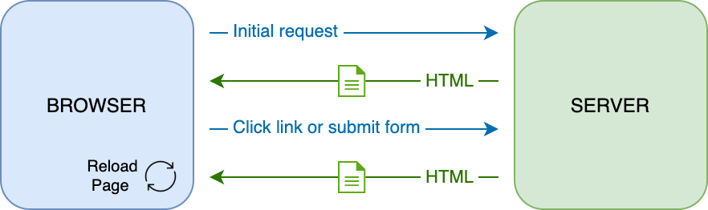
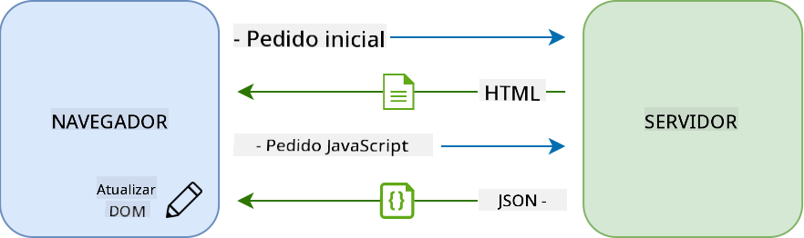
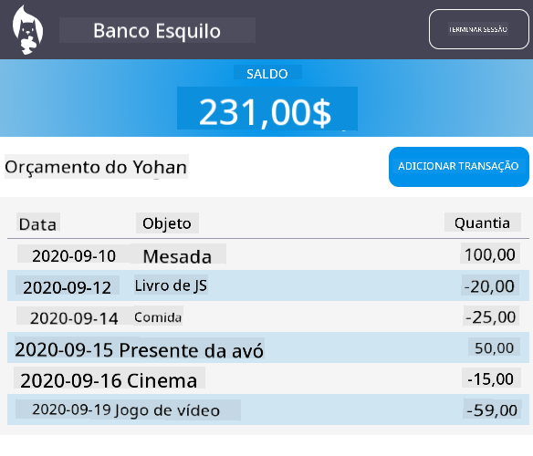

<!--
CO_OP_TRANSLATOR_METADATA:
{
  "original_hash": "89d0df9854ed020f155e94882ae88d4c",
  "translation_date": "2025-08-29T16:07:34+00:00",
  "source_file": "7-bank-project/3-data/README.md",
  "language_code": "pt"
}
-->
# Criar uma App Bancária Parte 3: Métodos de Obtenção e Utilização de Dados

## Questionário Pré-Aula

[Questionário pré-aula](https://ff-quizzes.netlify.app/web/quiz/45)

### Introdução

No núcleo de cada aplicação web está *dados*. Os dados podem assumir muitas formas, mas o seu principal objetivo é sempre exibir informações ao utilizador. Com as aplicações web a tornarem-se cada vez mais interativas e complexas, a forma como o utilizador acede e interage com as informações tornou-se uma parte essencial do desenvolvimento web.

Nesta lição, veremos como obter dados de um servidor de forma assíncrona e utilizá-los para exibir informações numa página web sem recarregar o HTML.

### Pré-requisitos

É necessário ter construído a [Formulário de Login e Registo](../2-forms/README.md) da aplicação web para esta lição. Também é necessário instalar o [Node.js](https://nodejs.org) e [executar a API do servidor](../api/README.md) localmente para obter os dados da conta.

Pode testar se o servidor está a funcionar corretamente executando este comando num terminal:

```sh
curl http://localhost:5000/api
# -> should return "Bank API v1.0.0" as a result
```

---

## AJAX e obtenção de dados

Os sites tradicionais atualizam o conteúdo exibido quando o utilizador seleciona um link ou submete dados através de um formulário, recarregando a página HTML completa. Sempre que novos dados precisam de ser carregados, o servidor web retorna uma nova página HTML que precisa de ser processada pelo navegador, interrompendo a ação atual do utilizador e limitando as interações durante o recarregamento. Este fluxo de trabalho é também chamado de *Aplicação Multi-Página* ou *MPA*.



Quando as aplicações web começaram a tornar-se mais complexas e interativas, surgiu uma nova técnica chamada [AJAX (JavaScript e XML Assíncronos)](https://en.wikipedia.org/wiki/Ajax_(programming)). Esta técnica permite que as aplicações web enviem e obtenham dados de um servidor de forma assíncrona utilizando JavaScript, sem necessidade de recarregar a página HTML, resultando em atualizações mais rápidas e interações mais suaves. Quando novos dados são recebidos do servidor, a página HTML atual pode ser atualizada com JavaScript utilizando a API do [DOM](https://developer.mozilla.org/docs/Web/API/Document_Object_Model). Com o tempo, esta abordagem evoluiu para o que agora é chamado de [*Aplicação de Página Única* ou *SPA*](https://en.wikipedia.org/wiki/Single-page_application).



Quando o AJAX foi introduzido pela primeira vez, a única API disponível para obter dados de forma assíncrona era [`XMLHttpRequest`](https://developer.mozilla.org/docs/Web/API/XMLHttpRequest/Using_XMLHttpRequest). Mas os navegadores modernos agora também implementam a mais conveniente e poderosa [`Fetch` API](https://developer.mozilla.org/docs/Web/API/Fetch_API), que utiliza promessas e é mais adequada para manipular dados JSON.

> Embora todos os navegadores modernos suportem a `Fetch API`, se quiser que a sua aplicação web funcione em navegadores antigos ou desatualizados, é sempre uma boa ideia verificar a [tabela de compatibilidade em caniuse.com](https://caniuse.com/fetch) primeiro.

### Tarefa

Na [lição anterior](../2-forms/README.md) implementámos o formulário de registo para criar uma conta. Agora vamos adicionar código para fazer login utilizando uma conta existente e obter os seus dados. Abra o ficheiro `app.js` e adicione uma nova função `login`:

```js
async function login() {
  const loginForm = document.getElementById('loginForm')
  const user = loginForm.user.value;
}
```

Aqui começamos por obter o elemento do formulário com `getElementById()`, e depois obtemos o nome de utilizador a partir do campo de entrada com `loginForm.user.value`. Cada controlo de formulário pode ser acedido pelo seu nome (definido no HTML utilizando o atributo `name`) como uma propriedade do formulário.

De forma semelhante ao que fizemos para o registo, criaremos outra função para realizar uma solicitação ao servidor, mas desta vez para obter os dados da conta:

```js
async function getAccount(user) {
  try {
    const response = await fetch('//localhost:5000/api/accounts/' + encodeURIComponent(user));
    return await response.json();
  } catch (error) {
    return { error: error.message || 'Unknown error' };
  }
}
```

Utilizamos a API `fetch` para solicitar os dados de forma assíncrona ao servidor, mas desta vez não precisamos de parâmetros adicionais além do URL a ser chamado, já que estamos apenas a consultar dados. Por padrão, `fetch` cria uma solicitação HTTP [`GET`](https://developer.mozilla.org/docs/Web/HTTP/Methods/GET), que é o que procuramos aqui.

✅ `encodeURIComponent()` é uma função que escapa caracteres especiais para URLs. Que problemas poderíamos ter se não chamássemos esta função e utilizássemos diretamente o valor de `user` no URL?

Agora vamos atualizar a nossa função `login` para utilizar `getAccount`:

```js
async function login() {
  const loginForm = document.getElementById('loginForm')
  const user = loginForm.user.value;
  const data = await getAccount(user);

  if (data.error) {
    return console.log('loginError', data.error);
  }

  account = data;
  navigate('/dashboard');
}
```

Primeiro, como `getAccount` é uma função assíncrona, precisamos de combiná-la com a palavra-chave `await` para aguardar o resultado do servidor. Como em qualquer solicitação ao servidor, também temos de lidar com casos de erro. Por enquanto, adicionaremos apenas uma mensagem de log para exibir o erro e voltaremos a isso mais tarde.

Depois, temos de armazenar os dados em algum lugar para que possamos utilizá-los mais tarde para exibir as informações do painel. Como a variável `account` ainda não existe, criaremos uma variável global para ela no topo do nosso ficheiro:

```js
let account = null;
```

Depois de os dados do utilizador serem guardados numa variável, podemos navegar da página de *login* para o *dashboard* utilizando a função `navigate()` que já temos.

Finalmente, precisamos de chamar a nossa função `login` quando o formulário de login for submetido, modificando o HTML:

```html
<form id="loginForm" action="javascript:login()">
```

Teste se tudo está a funcionar corretamente registando uma nova conta e tentando fazer login com a mesma conta.

Antes de avançar para a próxima parte, podemos também completar a função `register` adicionando isto no final da função:

```js
account = result;
navigate('/dashboard');
```

✅ Sabia que, por padrão, só pode chamar APIs de servidor a partir do *mesmo domínio e porta* da página web que está a visualizar? Este é um mecanismo de segurança imposto pelos navegadores. Mas espere, a nossa aplicação web está a ser executada em `localhost:3000`, enquanto a API do servidor está em `localhost:5000`. Por que funciona? Utilizando uma técnica chamada [Cross-Origin Resource Sharing (CORS)](https://developer.mozilla.org/docs/Web/HTTP/CORS), é possível realizar solicitações HTTP entre origens diferentes se o servidor adicionar cabeçalhos especiais à resposta, permitindo exceções para domínios específicos.

> Saiba mais sobre APIs ao fazer esta [lição](https://docs.microsoft.com/learn/modules/use-apis-discover-museum-art/?WT.mc_id=academic-77807-sagibbon)

## Atualizar HTML para exibir dados

Agora que temos os dados do utilizador, temos de atualizar o HTML existente para os exibir. Já sabemos como obter um elemento do DOM utilizando, por exemplo, `document.getElementById()`. Depois de ter um elemento base, aqui estão algumas APIs que pode utilizar para modificá-lo ou adicionar elementos filhos a ele:

- Utilizando a propriedade [`textContent`](https://developer.mozilla.org/docs/Web/API/Node/textContent), pode alterar o texto de um elemento. Note que alterar este valor remove todos os filhos do elemento (se houver) e substitui-os pelo texto fornecido. Assim, também é um método eficiente para remover todos os filhos de um elemento atribuindo-lhe uma string vazia `''`.

- Utilizando [`document.createElement()`](https://developer.mozilla.org/docs/Web/API/Document/createElement) juntamente com o método [`append()`](https://developer.mozilla.org/docs/Web/API/ParentNode/append), pode criar e anexar um ou mais novos elementos filhos.

✅ Utilizando a propriedade [`innerHTML`](https://developer.mozilla.org/docs/Web/API/Element/innerHTML) de um elemento, também é possível alterar os seus conteúdos HTML, mas esta deve ser evitada, pois é vulnerável a ataques de [cross-site scripting (XSS)](https://developer.mozilla.org/docs/Glossary/Cross-site_scripting).

### Tarefa

Antes de avançar para o ecrã do painel (*dashboard*), há mais uma coisa que devemos fazer na página de *login*. Atualmente, se tentar fazer login com um nome de utilizador que não existe, uma mensagem é exibida na consola, mas para um utilizador normal nada muda e não sabe o que está a acontecer.

Vamos adicionar um elemento de espaço reservado no formulário de login onde podemos exibir uma mensagem de erro, se necessário. Um bom lugar seria logo antes do botão de login `<button>`:

```html
...
<div id="loginError"></div>
<button>Login</button>
...
```

Este elemento `<div>` está vazio, o que significa que nada será exibido no ecrã até adicionarmos algum conteúdo a ele. Também damos-lhe um `id` para que possamos recuperá-lo facilmente com JavaScript.

Volte ao ficheiro `app.js` e crie uma nova função auxiliar `updateElement`:

```js
function updateElement(id, text) {
  const element = document.getElementById(id);
  element.textContent = text;
}
```

Esta função é bastante simples: dado um *id* de elemento e um *texto*, ela atualizará o conteúdo de texto do elemento DOM com o `id` correspondente. Vamos utilizar este método no lugar da mensagem de erro anterior na função `login`:

```js
if (data.error) {
  return updateElement('loginError', data.error);
}
```

Agora, se tentar fazer login com uma conta inválida, deverá ver algo como isto:


Agora temos um texto de erro que aparece visualmente, mas se o tentar com um leitor de ecrã, notará que nada é anunciado. Para que o texto adicionado dinamicamente a uma página seja anunciado por leitores de ecrã, será necessário utilizar algo chamado [Região Viva (Live Region)](https://developer.mozilla.org/docs/Web/Accessibility/ARIA/ARIA_Live_Regions). Aqui vamos utilizar um tipo específico de região viva chamado alerta:

```html
<div id="loginError" role="alert"></div>
```

Implemente o mesmo comportamento para os erros da função `register` (não se esqueça de atualizar o HTML).

## Exibir informações no painel

Utilizando as mesmas técnicas que acabámos de ver, também cuidaremos de exibir as informações da conta na página do painel.

Este é o aspeto de um objeto de conta recebido do servidor:

```json
{
  "user": "test",
  "currency": "$",
  "description": "Test account",
  "balance": 75,
  "transactions": [
    { "id": "1", "date": "2020-10-01", "object": "Pocket money", "amount": 50 },
    { "id": "2", "date": "2020-10-03", "object": "Book", "amount": -10 },
    { "id": "3", "date": "2020-10-04", "object": "Sandwich", "amount": -5 }
  ],
}
```

> Nota: para facilitar a sua vida, pode utilizar a conta `test` pré-existente que já está preenchida com dados.

### Tarefa

Vamos começar por substituir a secção "Saldo" no HTML para adicionar elementos de espaço reservado:

```html
<section>
  Balance: <span id="balance"></span><span id="currency"></span>
</section>
```

Também adicionaremos uma nova secção logo abaixo para exibir a descrição da conta:

```html
<h2 id="description"></h2>
```

✅ Como a descrição da conta funciona como um título para o conteúdo abaixo dela, está marcada semanticamente como um cabeçalho. Saiba mais sobre como a [estrutura de cabeçalhos](https://www.nomensa.com/blog/2017/how-structure-headings-web-accessibility) é importante para a acessibilidade e analise criticamente a página para determinar o que mais poderia ser um cabeçalho.

Em seguida, criaremos uma nova função em `app.js` para preencher o espaço reservado:

```js
function updateDashboard() {
  if (!account) {
    return navigate('/login');
  }

  updateElement('description', account.description);
  updateElement('balance', account.balance.toFixed(2));
  updateElement('currency', account.currency);
}
```

Primeiro, verificamos se temos os dados da conta de que precisamos antes de prosseguir. Depois, utilizamos a função `updateElement()` que criámos anteriormente para atualizar o HTML.

> Para tornar a exibição do saldo mais bonita, utilizamos o método [`toFixed(2)`](https://developer.mozilla.org/docs/Web/JavaScript/Reference/Global_Objects/Number/toFixed) para forçar a exibição do valor com 2 dígitos após o ponto decimal.

Agora precisamos de chamar a nossa função `updateDashboard()` sempre que o painel for carregado. Se já terminou o [exercício da lição 1](../1-template-route/assignment.md), isto deve ser simples, caso contrário, pode utilizar a seguinte implementação.

Adicione este código ao final da função `updateRoute()`:

```js
if (typeof route.init === 'function') {
  route.init();
}
```

E atualize a definição das rotas com:

```js
const routes = {
  '/login': { templateId: 'login' },
  '/dashboard': { templateId: 'dashboard', init: updateDashboard }
};
```

Com esta alteração, sempre que a página do painel for exibida, a função `updateDashboard()` será chamada. Após um login, deverá então ser capaz de ver o saldo da conta, a moeda e a descrição.

## Criar linhas de tabela dinamicamente com templates HTML

Na [primeira lição](../1-template-route/README.md), utilizámos templates HTML juntamente com o método [`appendChild()`](https://developer.mozilla.org/docs/Web/API/Node/appendChild) para implementar a navegação na nossa aplicação. Os templates também podem ser menores e utilizados para preencher dinamicamente partes repetitivas de uma página.

Utilizaremos uma abordagem semelhante para exibir a lista de transações na tabela HTML.

### Tarefa

Adicione um novo template no `<body>` do HTML:

```html
<template id="transaction">
  <tr>
    <td></td>
    <td></td>
    <td></td>
  </tr>
</template>
```

Este template representa uma única linha de tabela, com as 3 colunas que queremos preencher: *data*, *objeto* e *quantia* de uma transação.

Depois, adicione esta propriedade `id` ao elemento `<tbody>` da tabela dentro do template do painel para facilitar a sua localização utilizando JavaScript:

```html
<tbody id="transactions"></tbody>
```

O nosso HTML está pronto, vamos mudar para o código JavaScript e criar uma nova função `createTransactionRow`:

```js
function createTransactionRow(transaction) {
  const template = document.getElementById('transaction');
  const transactionRow = template.content.cloneNode(true);
  const tr = transactionRow.querySelector('tr');
  tr.children[0].textContent = transaction.date;
  tr.children[1].textContent = transaction.object;
  tr.children[2].textContent = transaction.amount.toFixed(2);
  return transactionRow;
}
```

Esta função faz exatamente o que o seu nome implica: utilizando o template que criámos anteriormente, cria uma nova linha de tabela e preenche os seus conteúdos utilizando os dados da transação. Utilizaremos isto na nossa função `updateDashboard()` para preencher a tabela:

```js
const transactionsRows = document.createDocumentFragment();
for (const transaction of account.transactions) {
  const transactionRow = createTransactionRow(transaction);
  transactionsRows.appendChild(transactionRow);
}
updateElement('transactions', transactionsRows);
```

Aqui utilizamos o método [`document.createDocumentFragment()`](https://developer.mozilla.org/docs/Web/API/Document/createDocumentFragment), que cria um novo fragmento DOM no qual podemos trabalhar, antes de finalmente anexá-lo à nossa tabela HTML.

Ainda há mais uma coisa que temos de fazer antes que este código funcione, já que a nossa função `updateElement()` atualmente suporta apenas conteúdo de texto. Vamos alterar um pouco o seu código:

```js
function updateElement(id, textOrNode) {
  const element = document.getElementById(id);
  element.textContent = ''; // Removes all children
  element.append(textOrNode);
}
```

Utilizamos o método [`append()`](https://developer.mozilla.org/docs/Web/API/ParentNode/append), pois permite anexar tanto texto quanto [nós DOM](https://developer.mozilla.org/docs/Web/API/Node) a um elemento pai, o que é perfeito para todos os nossos casos de uso.
Se tentar usar a conta `test` para iniciar sessão, deverá agora ver uma lista de transações no painel 🎉.

---

## 🚀 Desafio

Trabalhem juntos para fazer com que a página do painel se pareça com uma aplicação bancária real. Se já estilizou a sua aplicação, tente usar [media queries](https://developer.mozilla.org/docs/Web/CSS/Media_Queries) para criar um [design responsivo](https://developer.mozilla.org/docs/Web/Progressive_web_apps/Responsive/responsive_design_building_blocks) que funcione bem tanto em dispositivos desktop como móveis.

Aqui está um exemplo de uma página de painel estilizada:



## Questionário Pós-Aula

[Questionário pós-aula](https://ff-quizzes.netlify.app/web/quiz/46)

## Tarefa

[Refatore e comente o seu código](assignment.md)

---

**Aviso Legal**:  
Este documento foi traduzido utilizando o serviço de tradução por IA [Co-op Translator](https://github.com/Azure/co-op-translator). Embora nos esforcemos para garantir a precisão, é importante ter em conta que traduções automáticas podem conter erros ou imprecisões. O documento original na sua língua nativa deve ser considerado a fonte autoritária. Para informações críticas, recomenda-se a tradução profissional realizada por humanos. Não nos responsabilizamos por quaisquer mal-entendidos ou interpretações incorretas decorrentes da utilização desta tradução.