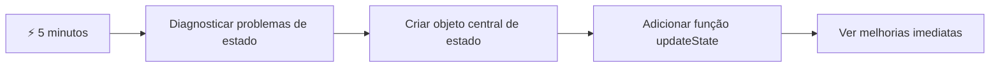
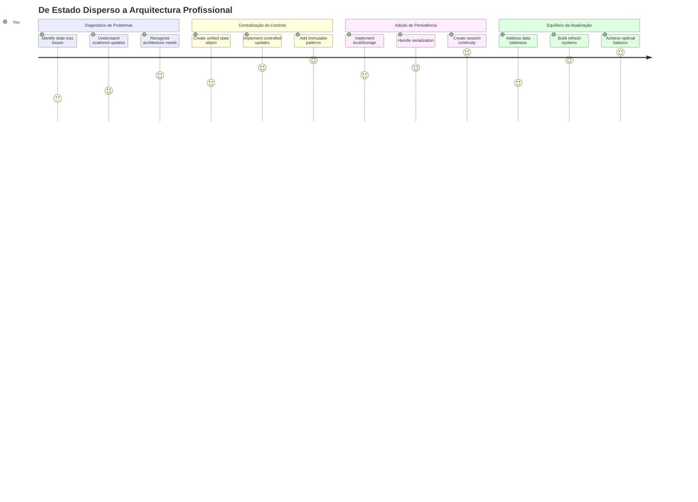
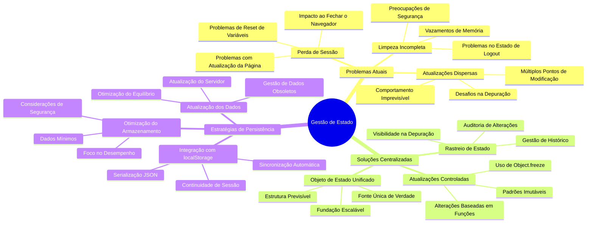
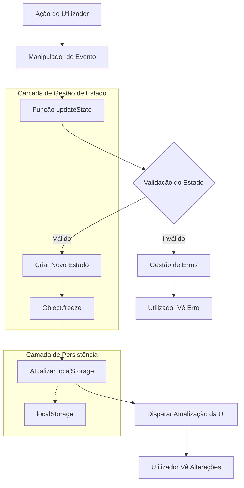
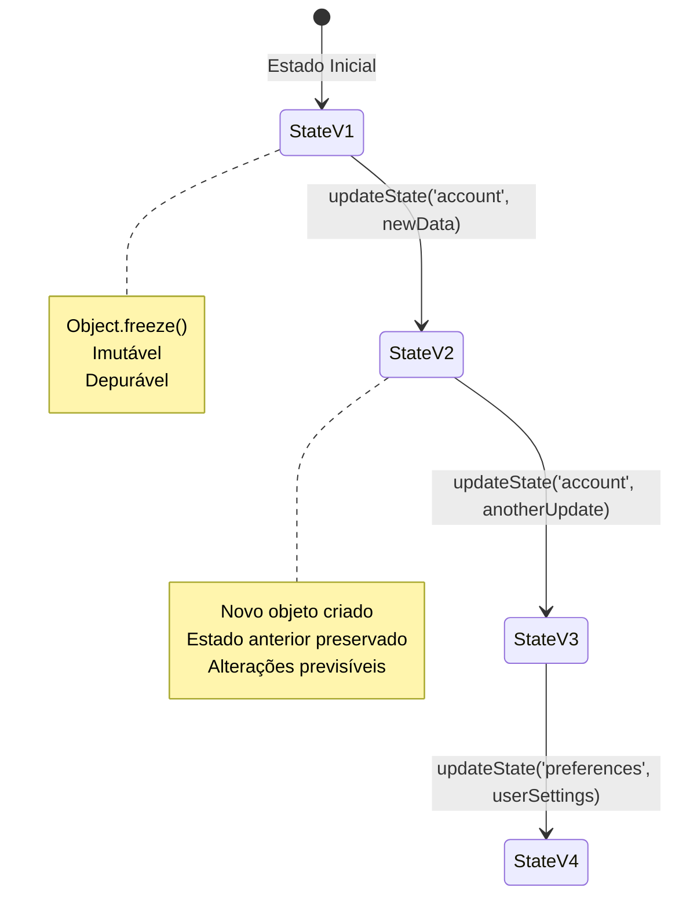
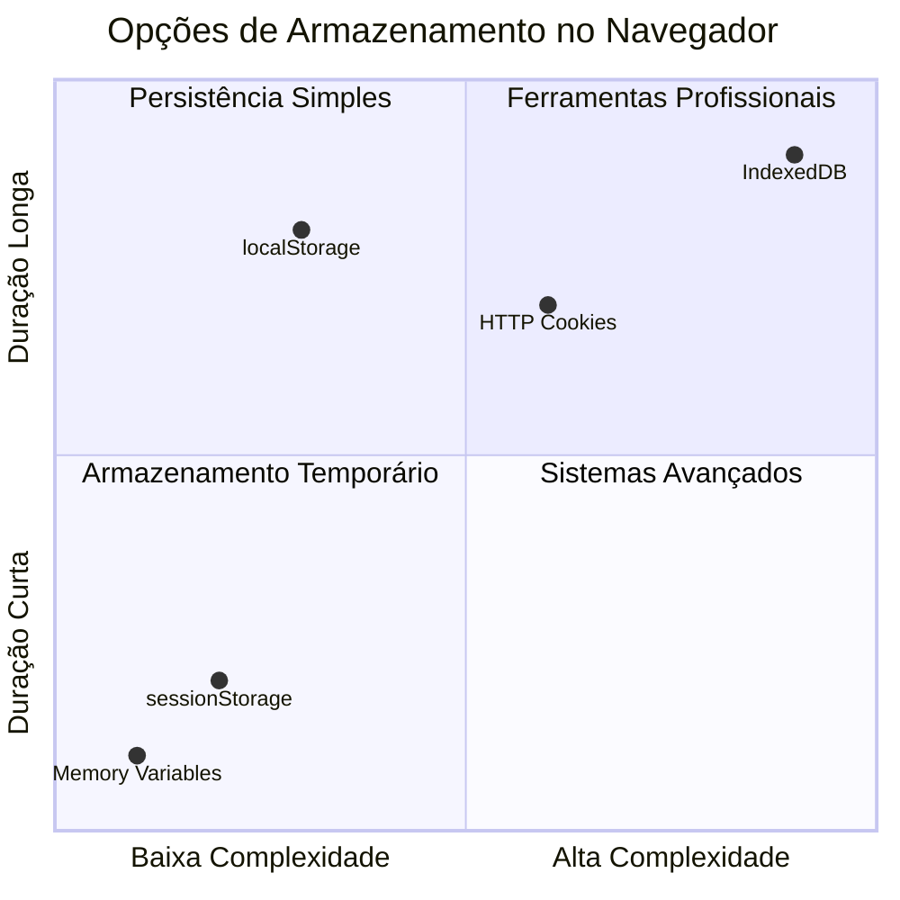
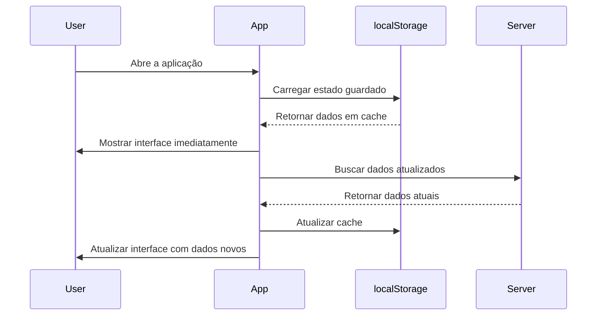
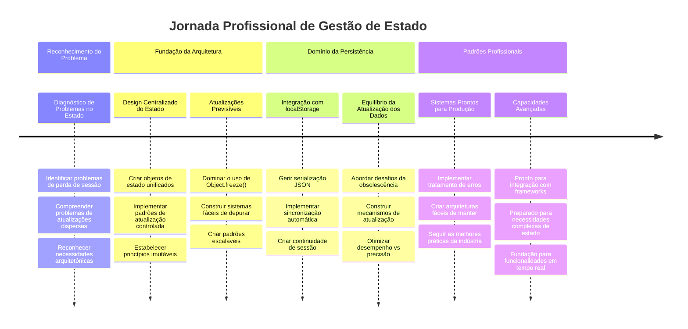

<!--
CO_OP_TRANSLATOR_METADATA:
{
  "original_hash": "b807b09df716dc48a2b750835bf8e933",
  "translation_date": "2026-01-06T18:15:56+00:00",
  "source_file": "7-bank-project/4-state-management/README.md",
  "language_code": "pt"
}
-->
# Construir uma Aplicação Bancária Parte 4: Conceitos de Gestão de Estado

## ⚡ O Que Pode Fazer Nos Próximos 5 Minutos

**Caminho de Arranque Rápido para Programadores Ocupados**


- **Minuto 1**: Testar o problema atual do estado - iniciar sessão, atualizar a página, observar o logout
- **Minuto 2**: Substituir `let account = null` por `let state = { account: null }`
- **Minuto 3**: Criar uma função simples `updateState()` para atualizações controladas
- **Minuto 4**: Atualizar uma função para usar o novo padrão
- **Minuto 5**: Testar a maior previsibilidade e capacidade de depuração

**Teste Rápido de Diagnóstico**:
```javascript
// Antes: Estado disperso
let account = null; // Perdido ao atualizar!

// Depois: Estado centralizado
let state = Object.freeze({ account: null }); // Controlado e rastreável!
```

**Porque é que isto é importante**: Em 5 minutos, irá experimentar a transformação da gestão de estado caótica para padrões previsíveis e depuráveis. Esta é a base que torna as aplicações complexas geríveis.

## 🗺️ A Sua Jornada de Aprendizagem na Maestria da Gestão de Estado


**Destino da Sua Jornada**: No final desta lição, terá construído um sistema de gestão de estado de nível profissional que lida com persistência, frescura de dados e atualizações previsíveis - os mesmos padrões usados em aplicações de produção.

## Questionário Pré-Aula

[Questionário pré-aula](https://ff-quizzes.netlify.app/web/quiz/47)

## Introdução

A gestão de estado é como o sistema de navegação da sonda Voyager – quando tudo está a funcionar bem, mal se nota que está lá. Mas quando algo corre mal, faz a diferença entre alcançar o espaço interestelar ou vaguear perdido no vazio cósmico. No desenvolvimento web, o estado representa tudo o que a sua aplicação precisa de lembrar: o estado de início de sessão do utilizador, dados de formulários, histórico de navegação e estados temporários da interface.

À medida que a sua aplicação bancária evoluiu de um simples formulário de login para uma aplicação mais sofisticada, provavelmente encontrou alguns desafios comuns. Atualize a página e os utilizadores são desconectados inesperadamente. Feche o navegador e todo o progresso desaparece. Depure um problema e está a vasculhar múltiplas funções que todas modificam os mesmos dados de maneiras diferentes.

Isto não são sinais de código pobre – são as dores de crescimento naturais que ocorrem quando as aplicações atingem determinado limiar de complexidade. Todos os programadores enfrentam estes desafios quando as suas apps passam de "prova de conceito" para "prontas para produção."

Nesta lição, vamos implementar um sistema centralizado de gestão de estado que transforma a sua aplicação bancária numa aplicação fiável e profissional. Vai aprender a gerir o fluxo de dados de forma previsível, a persistir sessões de utilizador adequadamente, e a criar a experiência suave de utilização que as aplicações web modernas exigem.

## Pré-requisitos

Antes de mergulhar nos conceitos de gestão de estado, precisa de ter o seu ambiente de desenvolvimento corretamente configurado e a base da sua aplicação bancária pronta. Esta lição constrói diretamente sobre os conceitos e código das partes anteriores desta série.

Certifique-se de que tem os seguintes componentes prontos antes de avançar:

**Configuração Necessária:**
- Complete a [lição de obtenção de dados](../3-data/README.md) - a sua app deve carregar e mostrar dados da conta com sucesso
- Instale [Node.js](https://nodejs.org) no seu sistema para executar a API backend
- Inicie a [API do servidor](../api/README.md) localmente para gerir operações de dados da conta

**Testar o Seu Ambiente:**

Verifique se o seu servidor API está a funcionar corretamente executando este comando no terminal:

```sh
curl http://localhost:5000/api
# -> deve retornar "Bank API v1.0.0" como resultado
```

**O que este comando faz:**
- **Envia** um pedido GET ao seu servidor API local
- **Testa** a ligação e verifica se o servidor responde
- **Retorna** a informação da versão da API se tudo estiver a funcionar corretamente

## 🧠 Visão Geral da Arquitetura de Gestão de Estado


**Princípio Central**: A gestão de estado profissional equilibra previsibilidade, persistência e desempenho para criar experiências de utilizador fiáveis que escalam de interações simples a fluxos de trabalho complexos de aplicações.

---

## Diagnóstico dos Problemas Atuais do Estado

Como Sherlock Holmes a examinar a cena de um crime, precisamos de entender exatamente o que está a acontecer na nossa implementação atual antes de resolver o mistério das sessões de utilizador desaparecidas.

Vamos fazer um simples experimento que revela os desafios subjacentes da gestão de estado:

**🧪 Experimente Este Teste Diagnóstico:**
1. Inicie sessão na sua aplicação bancária e navegue para o painel principal
2. Atualize a página do navegador
3. Observe o que acontece ao seu estado de login

Se for redirecionado de volta ao ecrã de login, descobriu o clássico problema de persistência de estado. Este comportamento ocorre porque a nossa implementação atual guarda dados do utilizador em variáveis JavaScript que se reiniciam a cada carregamento da página.

**Problemas da Implementação Atual:**

A simples variável `account` da nossa [lição anterior](../3-data/README.md) cria três problemas significativos que afetam tanto a experiência do utilizador como a manutenção do código:

| Problema | Causa Técnica | Impacto no Utilizador |
|---------|--------|----------------|
| **Perda de Sessão** | Atualizar a página limpa variáveis JavaScript | Os utilizadores devem autenticar-se frequentemente |
| **Atualizações Dispersas** | Múltiplas funções modificam o estado diretamente | A depuração torna-se mais difícil |
| **Limpeza Incompleta** | Logout não limpa todas as referências do estado | Potenciais problemas de segurança e privacidade |

**O Desafio Arquitetónico:**

Como o design compartimentado do Titanic, que parecia robusto até múltiplos compartimentos encherem simultaneamente, corrigir estes problemas individualmente não resolve o problema arquitetónico subjacente. Precisamos de uma solução de gestão de estado abrangente.

> 💡 **O que estamos realmente a tentar conseguir aqui?**

[Gestão de estado](https://en.wikipedia.org/wiki/State_management) é realmente resolver dois enigmas fundamentais:

1. **Onde estão os meus dados?**: Rastrear que informação temos e de onde vem  
2. **Todos estão na mesma página?**: Garantir que o que os utilizadores veem corresponde ao que realmente está a acontecer

**O Nosso Plano de Acção:**

Em vez de correr atrás do rabo, vamos criar um sistema **centralizado de gestão de estado**. Imagine uma pessoa muito organizada responsável por toda a informação importante:



**Compreender este fluxo de dados:**
- **Centraliza** todo o estado da aplicação num único local  
- **Encaminha** todas as alterações de estado através de funções controladas  
- **Garante** que a UI se mantém sincronizada com o estado atual  
- **Fornece** um padrão claro e previsível para gestão de dados  

> 💡 **Perspetiva Profissional**: Esta lição foca-se nos conceitos fundamentais. Para aplicações complexas, bibliotecas como [Redux](https://redux.js.org) fornecem funcionalidades de gestão de estado mais avançadas. Perceber estes princípios essenciais ajudará a dominar qualquer biblioteca de gestão de estado.

> ⚠️ **Tópico Avançado**: Não cobriremos atualizações automáticas da UI disparadas por alterações de estado, pois isto envolve conceitos de [Programação Reativa](https://en.wikipedia.org/wiki/Reactive_programming). Considere isto como um excelente próximo passo na sua jornada de aprendizagem!

### Tarefa: Centralizar a Estrutura de Estado

Vamos começar a transformar a nossa gestão de estado dispersa num sistema centralizado. Este primeiro passo estabelece a base para todas as melhorias que se seguem.

**Passo 1: Criar um Objeto Central de Estado**

Substitua a simples declaração `account`:

```js
let account = null;
```

Por um objeto de estado estruturado:

```js
let state = {
  account: null
};
```

**Porque é que esta alteração importa:**
- **Centraliza** todos os dados da aplicação num único local  
- **Prepara** a estrutura para adicionar mais propriedades de estado futuramente  
- **Cria** uma fronteira clara entre o estado e outras variáveis  
- **Estabelece** um padrão que escala à medida que a sua aplicação cresce  

**Passo 2: Atualizar os Padrões de Acesso ao Estado**

Atualize as suas funções para usar a nova estrutura de estado:

**Nas funções `register()` e `login()`**, substitua:  
```js
account = ...
```
  
Por:  
```js
state.account = ...
```
  

**Na função `updateDashboard()`**, adicione esta linha no topo:  
```js
const account = state.account;
```
  

**O que estas atualizações alcançam:**
- **Mantêm** a funcionalidade existente enquanto melhoram a estrutura  
- **Preparam** o seu código para uma gestão de estado mais sofisticada  
- **Criam** padrões consistentes para aceder aos dados do estado  
- **Estabelecem** a base para atualizações centralizadas do estado  

> 💡 **Nota**: Esta refatoração não resolve imediatamente os nossos problemas, mas cria a base essencial para as melhorias poderosas que se seguem!

### 🎯 Verificação Pedagógica: Princípios de Centralização

**Pausa e Reflita**: Acabou de implementar a base da gestão de estado centralizada. Esta é uma decisão arquitetónica crucial.

**Autoavaliação rápida**:
- Consegue explicar porque é que centralizar o estado num objeto é melhor do que usar variáveis dispersas?  
- O que aconteceria se esquecesse de atualizar uma função para usar `state.account`?  
- Como é que este padrão prepara o seu código para funcionalidades mais avançadas?  

**Conexão ao Mundo Real**: O padrão de centralização que aprendeu é a base de frameworks modernos como Redux, Vuex e React Context. Está a construir o mesmo pensamento arquitetónico usado em grandes aplicações.

**Pergunta Desafio**: Se precisasse de adicionar preferências do utilizador (tema, língua) à sua app, onde as adicionaria na estrutura de estado? Como isto escalaria?

## Implementando Atualizações Controladas do Estado

Com o nosso estado centralizado, o próximo passo envolve estabelecer mecanismos controlados para modificações de dados. Esta abordagem garante mudanças de estado previsíveis e depuração facilitada.

O princípio central assemelha-se ao controlo do tráfego aéreo: em vez de permitir que múltiplas funções modifiquem o estado de forma independente, vamos canalizar todas as alterações através de uma única função controlada. Este padrão fornece uma supervisão clara sobre quando e como as mudanças de dados ocorrem.

**Gestão de Estado Imutável:**

Vamos tratar o nosso objeto `state` como [*imutável*](https://en.wikipedia.org/wiki/Immutable_object), ou seja, nunca o modificamos diretamente. Em vez disso, cada alteração cria um novo objeto estado com os dados atualizados.

Embora esta abordagem possa parecer inicialmente menos eficiente comparada com modificações diretas, proporciona vantagens significativas para depuração, testes e manutenção da previsibilidade da aplicação.

**Benefícios da gestão de estado imutável:**

| Benefício | Descrição | Impacto |
|---------|-------------|--------|
| **Previsibilidade** | As alterações só acontecem através de funções controladas | Mais fácil de depurar e testar |
| **Registo Histórico** | Cada alteração cria um novo objeto estado | Permite funcionalidades de desfazer/refazer |
| **Prevenção de Efeitos Colaterais** | Não há modificações acidentais | Evita bugs misteriosos |
| **Otimização de Desempenho** | Fácil detectar quando o estado mudou realmente | Permite atualizações eficientes da UI |

**Imutabilidade em JavaScript com `Object.freeze()`:**

JavaScript fornece [`Object.freeze()`](https://developer.mozilla.org/docs/Web/JavaScript/Reference/Global_Objects/Object/freeze) para impedir modificações ao objeto:

```js
const immutableState = Object.freeze({ account: userData });
// Qualquer tentativa de modificar immutableState resultará num erro
```

**Análise do que acontece aqui:**
- **Impede** atribuições ou eliminações diretas de propriedades  
- **Lança** exceções se tentativas de modificação forem feitas  
- **Garante** que alterações de estado devem passar por funções controladas  
- **Cria** um contrato claro sobre como o estado pode ser atualizado  

> 💡 **Aprofundamento**: Saiba sobre a diferença entre objetos *imutáveis superficiais* e *imutáveis profundos* na [documentação MDN](https://developer.mozilla.org/docs/Web/JavaScript/Reference/Global_Objects/Object/freeze#What_is_shallow_freeze). Compreender esta distinção é crucial para estruturas de estado complexas.


### Tarefa

Vamos criar uma nova função `updateState()`:

```js
function updateState(property, newData) {
  state = Object.freeze({
    ...state,
    [property]: newData
  });
}
```

Nesta função, estamos a criar um novo objeto estado e a copiar dados do estado anterior usando o [*operador spread (`...`)*](https://developer.mozilla.org/docs/Web/JavaScript/Reference/Operators/Spread_syntax#Spread_in_object_literals). Depois sobrepomos uma propriedade particular do objeto estado com os novos dados usando a [notação de colchetes](https://developer.mozilla.org/docs/Web/JavaScript/Guide/Working_with_Objects#Objects_and_properties) `[property]` para atribuição. Finalmente, bloqueamos o objeto para impedir modificações usando `Object.freeze()`. Para já, só temos a propriedade `account` armazenada no estado, mas com esta abordagem pode adicionar tantas propriedades quanto precisar.

Também vamos atualizar a inicialização do `state` para garantir que o estado inicial também está congelado:

```js
let state = Object.freeze({
  account: null
});
```

Depois disso, atualize a função `register` substituindo a atribuição `state.account = result;` por:

```js
updateState('account', result);
```

Faça o mesmo na função `login`, substituindo `state.account = data;` por:

```js
updateState('account', data);
```

Agora aproveitamos para corrigir o problema dos dados da conta não serem apagados quando o utilizador clica em *Logout*.

Crie uma nova função `logout()`:

```js
function logout() {
  updateState('account', null);
  navigate('/login');
}
```

Em `updateDashboard()`, substitua o redirecionamento `return navigate('/login');` por `return logout()`;

Experimente registar uma nova conta, fazer logout e voltar a iniciar sessão para verificar se tudo continua a funcionar corretamente.

> Dica: pode olhar para todas as alterações de estado adicionando `console.log(state)` no fim de `updateState()` e abrindo a consola nas ferramentas de desenvolvimento do seu navegador.

## Implementando a Persistência de Dados

O problema de perda de sessão que identificámos antes requer uma solução de persistência que mantenha o estado do utilizador entre sessões do navegador. Isto transforma a nossa aplicação de uma experiência temporária numa ferramenta fiável e profissional.

Considere como os relógios atómicos mantêm o tempo preciso mesmo durante falhas de energia armazenando o estado crítico em memória não volátil. Da mesma forma, as aplicações web precisam de mecanismos de armazenamento persistente para preservar os dados essenciais do utilizador entre sessões do navegador e atualizações de página.

**Questões Estratégicas para Persistência de Dados:**

Antes de implementar a persistência, considere estes fatores críticos:

| Pergunta | Contexto da App Bancária | Impacto na Decisão |
|----------|-------------------|----------------|
| **Os dados são sensíveis?** | Saldo da conta, histórico de transações | Escolher métodos de armazenamento seguros |
| **Quanto tempo deverá persistir?** | Estado de login vs. preferências temporárias de UI | Selecione a duração apropriada para o armazenamento |
| **O servidor precisa dele?** | Tokens de autenticação vs. configurações de UI | Determine os requisitos de partilha |

**Opções de armazenamento do navegador:**

Os navegadores modernos fornecem vários mecanismos de armazenamento, cada um desenhado para diferentes casos de uso:

**APIs principais de armazenamento:**

1. **[`localStorage`](https://developer.mozilla.org/docs/Web/API/Window/localStorage)**: Armazenamento persistente [chave/valor](https://en.wikipedia.org/wiki/Key%E2%80%93value_database)
   - **Persiste** os dados entre sessões do navegador indefinidamente  
   - **Sobrevive** a reinícios do navegador e do computador
   - **Limitado** ao domínio específico do website
   - **Perfeito** para preferências do utilizador e estados de login

2. **[`sessionStorage`](https://developer.mozilla.org/docs/Web/API/Window/sessionStorage)**: Armazenamento de sessão temporário
   - **Funciona** de forma idêntica ao localStorage durante sessões ativas
   - **Apaga-se** automaticamente quando a aba do navegador é fechada
   - **Ideal** para dados temporários que não devem persistir

3. **[HTTP Cookies](https://developer.mozilla.org/docs/Web/HTTP/Cookies)**: Armazenamento partilhado pelo servidor
   - **Enviados automaticamente** com cada pedido ao servidor
   - **Perfeitos** para tokens de [autenticação](https://en.wikipedia.org/wiki/Authentication)
   - **Limitados** em tamanho e podem afetar o desempenho

**Requisito de serialização de dados:**

Tanto `localStorage` como `sessionStorage` armazenam apenas [strings](https://developer.mozilla.org/docs/Web/JavaScript/Reference/Global_Objects/String):

```js
// Converter objetos em strings JSON para armazenamento
const accountData = { user: 'john', balance: 150 };
localStorage.setItem('account', JSON.stringify(accountData));

// Analisar strings JSON de volta para objetos ao recuperar
const savedAccount = JSON.parse(localStorage.getItem('account'));
```

**Perceber a serialização:**
- **Converte** objetos JavaScript para strings JSON usando [`JSON.stringify()`](https://developer.mozilla.org/docs/Web/JavaScript/Reference/Global_Objects/JSON/stringify)
- **Reconstrói** objetos a partir de JSON usando [`JSON.parse()`](https://developer.mozilla.org/docs/Web/JavaScript/Reference/Global_Objects/JSON/parse)
- **Trata** automaticamente objetos aninhados complexos e arrays
- **Falha** com funções, valores indefinidos e referências circulares

> 💡 **Opção avançada**: Para aplicações offline complexas com grandes conjuntos de dados, considere a API [`IndexedDB`](https://developer.mozilla.org/docs/Web/API/IndexedDB_API). Fornece uma base de dados cliente completa, mas exige uma implementação mais complexa.


### Tarefa: Implementar persistência com localStorage

Vamos implementar armazenamento persistente para que os utilizadores mantenham o login até efetuarem logout explícito. Usaremos o `localStorage` para guardar os dados da conta entre sessões do navegador.

**Passo 1: Definir configuração de armazenamento**

```js
const storageKey = 'savedAccount';
```

**O que esta constante fornece:**
- **Cria** um identificador consistente para os nossos dados armazenados
- **Evita** erros tipográficos nas referências à chave de armazenamento
- **Facilita** a alteração da chave de armazenamento, se necessário
- **Segue** as melhores práticas para código sustentável

**Passo 2: Adicionar persistência automática**

Adicione esta linha no final da função `updateState()`:

```js
localStorage.setItem(storageKey, JSON.stringify(state.account));
```

**Desconstrução do que acontece aqui:**
- **Converte** o objeto da conta numa string JSON para armazenamento
- **Grava** os dados usando a nossa chave de armazenamento consistente
- **Executa-se** automaticamente sempre que ocorrem alterações no estado
- **Garante** que os dados armazenados estão sempre sincronizados com o estado atual

> 💡 **Benefício arquitetural**: Porque centralizámos todas as atualizações de estado através do `updateState()`, adicionar persistência exigiu apenas uma linha de código. Isto demonstra o poder de boas decisões arquitetónicas!

**Passo 3: Restaurar estado ao carregar a app**

Crie uma função de inicialização para restaurar os dados guardados:

```js
function init() {
  const savedAccount = localStorage.getItem(storageKey);
  if (savedAccount) {
    updateState('account', JSON.parse(savedAccount));
  }

  // O nosso código de inicialização anterior
  window.onpopstate = () => updateRoute();
  updateRoute();
}

init();
```

**Compreender o processo de inicialização:**
- **Obtém** quaisquer dados da conta previamente guardados no localStorage
- **Analisa** a string JSON de volta para um objeto JavaScript
- **Atualiza** o estado usando a nossa função controlada de atualização
- **Restabelece** a sessão do utilizador automaticamente ao carregar a página
- **Executa-se** antes das atualizações de rota para garantir que o estado está disponível

**Passo 4: Otimizar rota padrão**

Atualize a rota padrão para tirar proveito da persistência:

Em `updateRoute()`, substitua:
```js
// Substituir: return navigate('/login');
return navigate('/dashboard');
```

**Porque esta alteração faz sentido:**
- **Aproveita** eficazmente o nosso novo sistema de persistência
- **Permite** que o dashboard trate as verificações de autenticação
- **Redireciona** automaticamente para o login se não existir uma sessão guardada
- **Cria** uma experiência de utilizador mais fluida

**Testar a sua implementação:**

1. Faça login na sua aplicação bancária
2. Atualize a página do navegador
3. Verifique que permanece autenticado e no dashboard
4. Feche e reabra o navegador
5. Navegue novamente para a aplicação e confirme que continua autenticado

🎉 **Conquista desbloqueada**: Implementou com sucesso a gestão de estado persistente! A sua app agora comporta-se como uma aplicação web profissional.

### 🎯 Verificação pedagógica: Arquitetura da persistência

**Compreensão arquitetural**: Implementou uma camada de persistência sofisticada que equilibra a experiência do utilizador com a complexidade da gestão de dados.

**Conceitos chave dominados**:
- **Serialização JSON**: Conversão de objetos complexos em strings armazenáveis
- **Sincronização automática**: Mudanças no estado desencadeiam armazenamento persistente
- **Recuperação de sessão**: Apps podem restaurar o contexto do utilizador após interrupções
- **Persistência centralizada**: Uma única função de atualização controla todo o armazenamento

**Ligação à indústria**: Este padrão de persistência é fundamental para Progressive Web Apps (PWAs), aplicações offline-first e experiências web móveis modernas. Está a construir capacidades de nível profissional.

**Questão de reflexão**: Como modificaria este sistema para gerir múltiplas contas de utilizador no mesmo dispositivo? Considere as implicações de privacidade e segurança.

## Equilibrar persistência com frescura dos dados

O nosso sistema de persistência mantém com sucesso as sessões de utilizador, mas introduz um novo desafio: a obsolescência dos dados. Quando vários utilizadores ou aplicações modificam os mesmos dados no servidor, a informação local em cache fica desatualizada.

Esta situação assemelha-se aos navegadores Vikings que usavam tanto cartas estelares armazenadas como observações celestes atuais. As cartas forneciam consistência, mas os navegadores precisavam de observações frescas para adaptar-se às condições mutáveis. De modo semelhante, a nossa aplicação precisa tanto do estado persistente do utilizador como dos dados atuais do servidor.

**🧪 Descobrir o problema da frescura dos dados:**

1. Faça login no dashboard com a conta `test`
2. Execute este comando numa consola para simular uma transação a partir de outra origem:

```sh
curl --request POST \
     --header "Content-Type: application/json" \
     --data "{ \"date\": \"2020-07-24\", \"object\": \"Bought book\", \"amount\": -20 }" \
     http://localhost:5000/api/accounts/test/transactions
```

3. Atualize a página do dashboard no navegador
4. Observe se vê a nova transação

**O que este teste demonstra:**
- **Mostra** como o armazenamento local pode ficar "obsoleto" (desatualizado)
- **Simula** cenários reais onde os dados mudam fora da sua app
- **Revela** a tensão entre persistência e frescura dos dados

**O desafio da obsolescência dos dados:**

| Problema | Causa | Impacto no utilizador |
|---------|-------|---------------------|
| **Dados obsoletos** | localStorage nunca expira automaticamente | Os utilizadores veem informação desatualizada |
| **Alterações no servidor** | Outras apps/utilizadores modificam os mesmos dados | Vistas inconsistentes entre plataformas |
| **Cache vs. realidade** | O cache local não corresponde ao estado servidor | Má experiência do utilizador e confusão |

**Estratégia de solução:**

Vamos implementar um padrão de "atualizar ao carregar" que equilibra os benefícios da persistência com a necessidade de dados frescos. Esta abordagem mantém a experiência fluida do utilizador garantindo a precisão dos dados.


### Tarefa: Implementar sistema de atualização de dados

Vamos criar um sistema que obtém automaticamente dados atualizados do servidor enquanto mantém os benefícios da gestão de estado persistente.

**Passo 1: Criar atualizador dos dados da conta**

```js
async function updateAccountData() {
  const account = state.account;
  if (!account) {
    return logout();
  }

  const data = await getAccount(account.user);
  if (data.error) {
    return logout();
  }

  updateState('account', data);
}
```

**Compreender a lógica desta função:**
- **Verifica** se um utilizador está autenticado (existe state.account)
- **Redireciona** para logout se não houver sessão válida
- **Busca** dados frescos da conta no servidor usando a função existente `getAccount()`
- **Trata** erros do servidor de forma elegante fazendo logout das sessões inválidas
- **Atualiza** o estado com dados frescos usando o nosso sistema controlado de atualização
- **Ativa** a persistência automática no localStorage através da função `updateState()`

**Passo 2: Criar handler de atualização do dashboard**

```js
async function refresh() {
  await updateAccountData();
  updateDashboard();
}
```

**O que esta função de atualização alcança:**
- **Coordena** o processo de atualização dos dados e da UI
- **Espera** que os dados frescos sejam carregados antes de atualizar o ecrã
- **Garante** que o dashboard mostra a informação mais atualizada
- **Mantém** uma separação limpa entre gestão de dados e atualizações da UI

**Passo 3: Integrar com o sistema de rotas**

Atualize a sua configuração de rotas para disparar a atualização automaticamente:

```js
const routes = {
  '/login': { templateId: 'login' },
  '/dashboard': { templateId: 'dashboard', init: refresh }
};
```

**Como esta integração funciona:**
- **Executa** a função de atualização sempre que a rota do dashboard é carregada
- **Garante** que dados frescos são sempre exibidos quando o utilizador navega para o dashboard
- **Mantém** a estrutura de rota existente enquanto adiciona frescura dos dados
- **Fornece** um padrão consistente para inicialização específica da rota

**Testar o seu sistema de atualização de dados:**

1. Faça login na sua app bancária
2. Execute o comando curl mencionado anteriormente para criar uma nova transação
3. Atualize a página do dashboard ou navegue para outra página e volte
4. Verifique se a nova transação aparece imediatamente

🎉 **Equilíbrio perfeito alcançado**: A sua aplicação agora combina a fluidez do estado persistente com a precisão dos dados frescos do servidor!

## 📈 Linha temporal da sua maestria em gestão de estado


**🎓 Marco de graduação**: Construiu com sucesso um sistema completo de gestão de estado usando os mesmos princípios que sustentam Redux, Vuex e outras bibliotecas profissionais de estado. Estes padrões escalam desde apps simples a aplicações empresariais.

**🔄 Capacidades de nível seguinte**:
- Pronto para dominar frameworks de gestão de estado (Redux, Zustand, Pinia)
- Preparado para implementar funcionalidades em tempo real com WebSockets
- Equipado para construir Progressive Web Apps offline-first
- Base estabelecida para padrões avançados como máquinas de estado e observers

## Desafio GitHub Copilot Agent 🚀

Use o modo Agent para completar o seguinte desafio:

**Descrição:** Implemente um sistema abrangente de gestão de estado com funcionalidade de desfazer/refazer para a aplicação bancária. Este desafio ajudará a praticar conceitos avançados de gestão de estado incluindo rastreamento do histórico do estado, atualizações imutáveis e sincronização da interface do utilizador.

**Prompt:** Crie um sistema de gestão de estado melhorado que inclua: 1) Um array de histórico do estado que rastreie todos os estados anteriores, 2) funções de desfazer e refazer que revertam para estados anteriores, 3) botões de UI para operações de desfazer/refazer no dashboard, 4) um limite máximo de histórico de 10 estados para evitar problemas de memória, e 5) limpeza adequada do histórico quando o utilizador efetuar logout. Assegure que a funcionalidade de desfazer/refazer funciona com alterações no saldo da conta e persiste através das atualizações do navegador.

Saiba mais sobre [modo agent](https://code.visualstudio.com/blogs/2025/02/24/introducing-copilot-agent-mode) aqui.

## 🚀 Desafio: Otimização do armazenamento

A sua implementação agora gere sessões de utilizador, atualização de dados e gestão de estado eficazmente. Contudo, considere se a nossa abordagem atual equilibra de forma ótima a eficiência do armazenamento com a funcionalidade.

Como mestres do xadrez que distinguem entre peças essenciais e peões expendáveis, a gestão eficaz de estado exige identificar quais dados devem persistir versus quais devem ser sempre frescos do servidor.

**Análise de otimização:**

Avalie a sua implementação atual do localStorage e considere estas questões estratégicas:
- Qual é a informação mínima necessária para manter a autenticação do utilizador?
- Quais dados mudam com frequência suficiente para que o cache local traga pouco benefício?
- Como pode a otimização do armazenamento melhorar o desempenho sem degradar a experiência do utilizador?

Este tipo de análise arquitetónica distingue desenvolvedores experientes que consideram tanto funcionalidade como eficiência nas suas soluções.

**Estratégia de implementação:**
- **Identificar** os dados essenciais que devem persistir (provavelmente apenas a identificação do utilizador)
- **Modificar** a implementação de localStorage para guardar apenas os dados críticos da sessão
- **Garantir** que dados frescos são sempre carregados do servidor nas visitas ao dashboard
- **Testar** que a sua abordagem otimizada mantém a mesma experiência do utilizador

**Consideração avançada:**
- **Comparar** as compensações entre armazenar dados completos da conta vs. apenas tokens de autenticação
- **Documentar** as suas decisões e raciocínios para futuros membros da equipa

Este desafio ajudará a pensar como um desenvolvedor profissional que considera tanto a experiência do utilizador como a eficiência da aplicação. Tire o tempo que precisar para experimentar diferentes abordagens!

## Quiz pós-aula

[Post-lecture quiz](https://ff-quizzes.netlify.app/web/quiz/48)

## Trabalho prático

[Implementar diálogo "Adicionar transação"](assignment.md)

Aqui está um exemplo do resultado após completar o trabalho:


---

<!-- CO-OP TRANSLATOR DISCLAIMER START -->
**Aviso Legal**:
Este documento foi traduzido utilizando o serviço de tradução automática [Co-op Translator](https://github.com/Azure/co-op-translator). Embora nos esforcemos pela precisão, por favor esteja ciente de que traduções automáticas podem conter erros ou imprecisões. O documento original no seu idioma nativo deve ser considerado a fonte autoritativa. Para informações críticas, recomenda-se tradução profissional humana. Não nos responsabilizamos por quaisquer mal-entendidos ou interpretações erradas decorrentes da utilização desta tradução.
<!-- CO-OP TRANSLATOR DISCLAIMER END -->