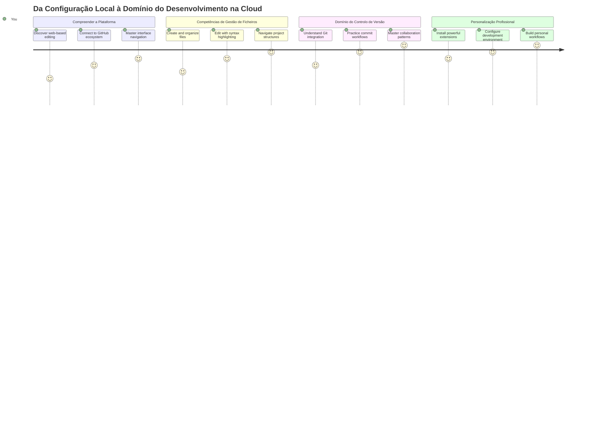
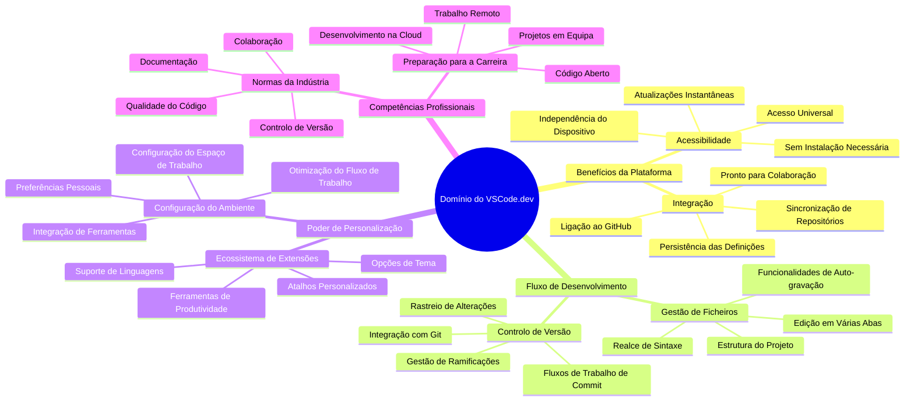
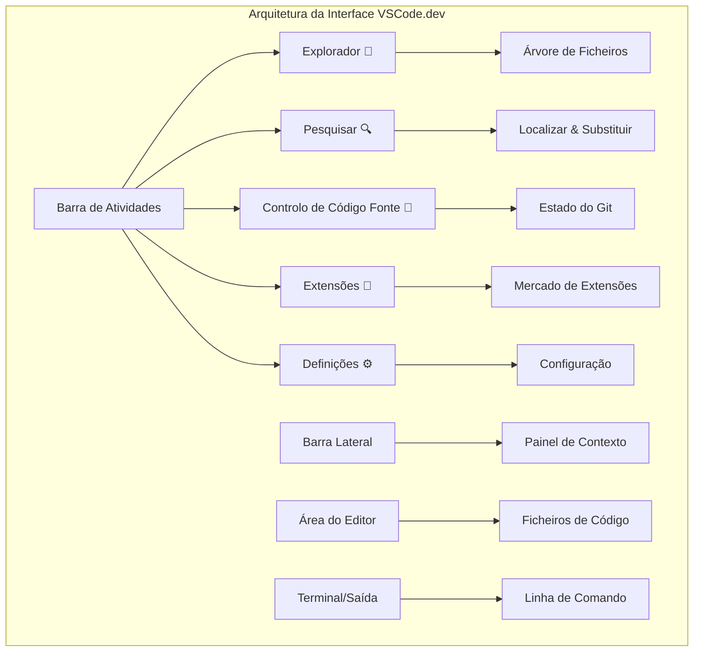
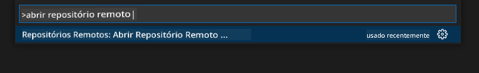
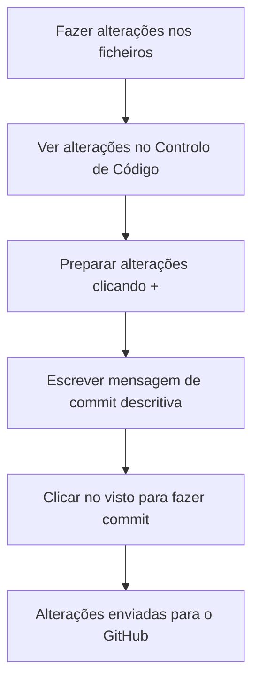
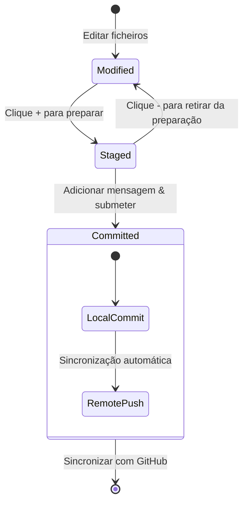
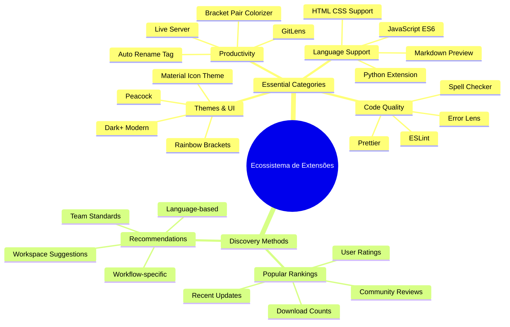
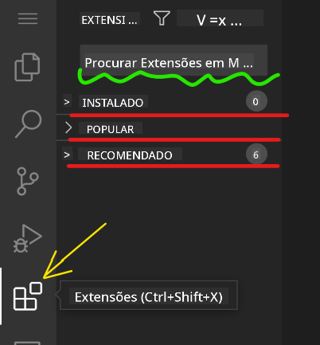
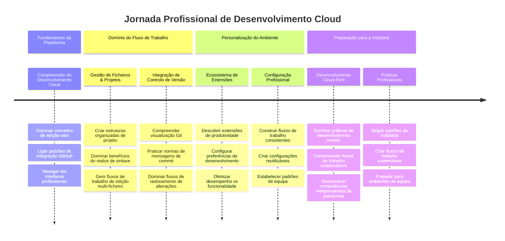

<!--
CO_OP_TRANSLATOR_METADATA:
{
  "original_hash": "a9a3bcc037a447e2d8994d99e871cd9f",
  "translation_date": "2026-01-06T17:46:37+00:00",
  "source_file": "8-code-editor/1-using-a-code-editor/README.md",
  "language_code": "pt"
}
-->
# Usar um Editor de Código: Dominar o VSCode.dev

Lembras-te em *The Matrix* quando o Neo teve de ligar-se a um terminal de computador gigante para aceder ao mundo digital? As ferramentas de desenvolvimento web de hoje em dia são a história oposta – capacidades incrivelmente poderosas acessíveis a partir de qualquer lugar. O VSCode.dev é um editor de código baseado no navegador que traz ferramentas profissionais de desenvolvimento para qualquer dispositivo com uma ligação à internet.

Tal como a imprensa tornou os livros acessíveis a todos, não apenas aos escribas dos mosteiros, o VSCode.dev democratiza a programação. Podes trabalhar em projetos a partir de um computador numa biblioteca, num laboratório da escola ou em qualquer lugar onde tenhas acesso a um navegador. Sem instalações, sem limitações do tipo "preciso da minha configuração específica".

No final desta lição, vais perceber como navegar no VSCode.dev, abrir repositórios GitHub diretamente no teu navegador e usar Git para controlo de versões – todas habilidades em que os programadores profissionais confiam diariamente.

## ⚡ O Que Podes Fazer Nos Próximos 5 Minutos

**Caminho de Arranque Rápido para Programadores Ocupados**


- **Minuto 1**: Acede a [vscode.dev](https://vscode.dev) - não é necessária qualquer instalação
- **Minuto 2**: Inicia sessão com o GitHub para conectares os teus repositórios
- **Minuto 3**: Experimenta o truque da URL: muda `github.com` para `vscode.dev/github` em qualquer URL de repositório
- **Minuto 4**: Cria um ficheiro novo e vê o realce de sintaxe a funcionar automaticamente
- **Minuto 5**: Faz uma alteração e grava-a através do painel de Controlo de Código-Fonte

**URL de Teste Rápido**:
```
# Transform this:
github.com/microsoft/Web-Dev-For-Beginners

# Into this:
vscode.dev/github/microsoft/Web-Dev-For-Beginners
```

**Porquê Isto é Importante**: Em 5 minutos, vais experimentar a liberdade de programar em qualquer lugar com ferramentas profissionais. Isto representa o futuro do desenvolvimento - acessível, poderoso e imediato.

## 🗺️ A Tua Jornada de Aprendizagem Pelo Desenvolvimento na Nuvem


**Destino da Tua Jornada**: No final desta lição, terás dominado um ambiente profissional de desenvolvimento em nuvem que funciona a partir de qualquer dispositivo, permitindo-te programar com as mesmas ferramentas usadas por programadores nas grandes empresas tecnológicas.

## O Que Vais Aprender

Depois de fazermos isto juntos, vais conseguir:

- Navegar no VSCode.dev como se fosse a tua segunda casa – encontrar tudo o que precisas sem te perderes
- Abrir qualquer repositório GitHub no teu navegador e começar a editar imediatamente (isto é mesmo mágico!)
- Usar Git para rastrear as tuas alterações e guardar o progresso como um profissional
- Turbinar o teu editor com extensões que tornam a programação mais rápida e divertida
- Criar e organizar ficheiros de projetos com confiança

## O Que Vais Precisar

Os requisitos são simples:

- Uma conta gratuita no [GitHub](https://github.com) (vamos ajudar-te a criar se precisares)
- Familiaridade básica com navegadores web
- A lição Básicos do GitHub fornece contexto útil, embora não seja essencial

> 💡 **És novo no GitHub?** Criar uma conta é grátis e demora minutos. Tal como um cartão de biblioteca te dá acesso a livros por todo o mundo, uma conta GitHub abre portas para repositórios de código em toda a internet.

## 🧠 Visão Geral do Ecossistema de Desenvolvimento na Nuvem


**Princípio Fundamental**: Ambientes de desenvolvimento baseados na nuvem representam o futuro da programação - fornecendo ferramentas profissionais que são acessíveis, colaborativas e independentes da plataforma.

## Porquê Que os Editores de Código Baseados na Web São Importantes

Antes da internet, os cientistas em diferentes universidades não podiam partilhar pesquisas facilmente. Depois veio a ARPANET nos anos 60, conectando computadores a largas distâncias. Os editores de código baseados na web seguem este mesmo princípio – tornar as ferramentas poderosas acessíveis independentemente da tua localização física ou dispositivo.

Um editor de código funciona como o teu espaço de trabalho para desenvolvimento, onde escreves, editas e organizas ficheiros de código. Ao contrário dos editores de texto simples, os editores profissionais fornecem realce de sintaxe, deteção de erros e funcionalidades de gestão de projetos.

O VSCode.dev traz estas capacidades para o teu navegador:

**Vantagens da edição baseada na web:**

| Característica | Descrição | Benefício Prático |
|---------|-------------|----------|
| **Independência de Plataforma** | Funciona em qualquer dispositivo com navegador | Trabalha sem problemas em diferentes computadores |
| **Sem Necessidade de Instalação** | Acesso através de uma URL web | Ultrapassa restrições na instalação de software |
| **Atualizações Automáticas** | Sempre a correr a versão mais recente | Acede a novas funcionalidades sem atualizações manuais |
| **Integração de Repositórios** | Ligação direta ao GitHub | Edita código sem gerir ficheiros locais |

**Implicações práticas:**
- Continuidade de trabalho em diferentes ambientes
- Interface consistente independentemente do sistema operativo
- Colaboração imediata facilitada
- Menor necessidade de armazenamento local

## Explorando o VSCode.dev

Tal como o laboratório de Marie Curie continha equipamento sofisticado num espaço relativamente simples, o VSCode.dev concentra ferramentas profissionais de desenvolvimento numa interface de navegador. Esta aplicação web disponibiliza a mesma funcionalidade central dos editores de código de ambiente de trabalho.

Começa por navegar para [vscode.dev](https://vscode.dev) no teu navegador. A interface carrega sem downloads ou instalações no sistema – uma aplicação direta dos princípios da computação na nuvem.

### Ligar a Tua Conta GitHub

Tal como o telefone de Alexander Graham Bell ligou locais distantes, ligar a tua conta GitHub cria uma ponte entre o VSCode.dev e os teus repositórios de código. Quando for pedido que inicies sessão com GitHub, é recomendável aceitar esta ligação.

**A integração GitHub oferece:**
- Acesso direto aos teus repositórios dentro do editor
- Configurações e extensões sincronizadas em múltiplos dispositivos
- Fluxo de trabalho simplificado para guardar no GitHub
- Ambiente de desenvolvimento personalizado

### Conhecer o Teu Novo Espaço de Trabalho

Quando tudo carregar, vais ver um espaço de trabalho lindamente limpo, desenhado para que te concentres no que realmente interessa – o teu código!


**Aqui está a tua visita guiada ao bairro:**
- **Barra de Atividades** (aquela faixa à esquerda): A tua navegação principal com Explorador 📁, Pesquisa 🔍, Controlo de Código-Fonte 🌿, Extensões 🧩, e Definições ⚙️
- **Barra Lateral** (o painel ao lado): Muda para mostrar-te informação relevante consoante o que seleccionaste
- **Área do Editor** (o grande espaço no meio): Aqui é que a magia acontece – a tua área principal de programação

**Tira um momento para explorar:**
- Clica nos ícones da Barra de Atividades e vê o que cada um faz
- Repara em como a barra lateral se atualiza para mostrar diferentes informações – fixe, não é?
- A vista Explorador (📁) vai provavelmente ser onde passas mais tempo, por isso familiariza-te com ela


## Abrir Repositórios GitHub

Antes da internet, os investigadores tinham de viajar fisicamente às bibliotecas para aceder a documentos. Os repositórios GitHub funcionam de forma similar – são coleções de código armazenadas remotamente. O VSCode.dev elimina a etapa tradicional de descarregar repositórios para a tua máquina local antes de editar.

Esta funcionalidade permite acesso imediato a qualquer repositório público para visualização, edição ou contribuição. Aqui tens dois métodos para abrir repositórios:

### Método 1: Apontar e Clicar

Este método é perfeito quando estiveres a começar no VSCode.dev e quiseres abrir um repositório específico. É direto e amigável para principiantes:

**Aqui está como fazer:**

1. Vai a [vscode.dev](https://vscode.dev), se ainda não estiveres lá
2. Procura o botão "Open Remote Repository" na tela de boas-vindas e clica nele

   

3. Cola qualquer URL de repositório GitHub (experimenta este: `https://github.com/microsoft/Web-Dev-For-Beginners`)
4. Pressiona Enter e vê a magia acontecer!

**Dica de profissional - Atalho para o Command Palette:**

Quer sentir-te um mago da programação? Experimenta este atalho de teclado: Ctrl+Shift+P (ou Cmd+Shift+P no Mac) para abrir o Command Palette:



**O Command Palette é como ter um motor de busca para tudo o que podes fazer:**
- Escreve "open remote" e ele encontra a opção para abrir repositórios remotamente
- Lembra dos repositórios que abriste recentemente (super útil!)
- Quando te habituas, vais sentir que programas a uma velocidade relâmpago
- É basicamente a versão do VSCode.dev para "Hey Siri, mas para programação"

### Método 2: Técnica de Modificação de URL

Tal como HTTP e HTTPS usam protocolos diferentes mantendo a mesma estrutura de domínio, o VSCode.dev usa um padrão de URL que espelha o sistema de endereçamento do GitHub. Qualquer URL de repositório GitHub pode ser modificada para abrir diretamente no VSCode.dev.

**Padrão de transformação de URL:**

| Tipo de Repositório | URL GitHub | URL VSCode.dev |
|----------------|---------------------|----------------|
| **Repositório Público** | `github.com/microsoft/Web-Dev-For-Beginners` | `vscode.dev/github/microsoft/Web-Dev-For-Beginners` |
| **Projeto Pessoal** | `github.com/o-teu-username/meu-projeto` | `vscode.dev/github/o-teu-username/meu-projeto` |
| **Qualquer Repositório Acessível** | `github.com/username-deles/repo-fixe` | `vscode.dev/github/username-deles/repo-fixe` |

**Implementação:**
- Substitui `github.com` por `vscode.dev/github`
- Mantém os restantes componentes da URL inalterados
- Funciona com qualquer repositório publicamente acessível
- Proporciona acesso imediato para edição

> 💡 **Dica que muda a vida**: Guarda nos favoritos as versões VSCode.dev dos teus repositórios favoritos. Eu tenho favoritos como "Editar o Meu Portfólio" e "Corrigir Documentação" que me levam diretamente ao modo de edição!

**Qual método deverias usar?**
- **O método da interface**: Óptimo quando estás a explorar ou não te lembras dos nomes exactos dos repositórios
- **O truque da URL**: Perfeito para acesso relâmpago quando sabes exatamente para onde vais

### 🎯 Verificação Pedagógica: Acesso ao Desenvolvimento na Nuvem

**Pára e Reflete**: Acabaste de aprender dois métodos para aceder a repositórios de código através do navegador web. Isto representa uma mudança fundamental na forma como o desenvolvimento funciona.

**Autoavaliação Rápida**:
- Consegues explicar por que a edição baseada na web elimina a tradicional "configuração do ambiente de desenvolvimento"?
- Que vantagens a técnica de modificação da URL tem sobre o cloning local com git?
- Como é que esta abordagem muda a forma como podes contribuir para projetos open source?

**Ligação ao Mundo Real**: Empresas maiores como GitHub, GitLab e Replit construíram as suas plataformas de desenvolvimento tendo estes princípios orientados pela nuvem em mente. Estás a aprender os mesmos fluxos de trabalho usados por equipas de desenvolvimento profissionais em todo o mundo.

**Pergunta Desafio**: Como é que o desenvolvimento baseado na nuvem pode mudar a forma como a programação é ensinada nas escolas? Considera requisitos de dispositivo, gestão de software e possibilidades colaborativas.

## Trabalhar com Ficheiros e Projetos

Agora que tens um repositório aberto, vamos começar a construir! O VSCode.dev dá-te tudo o que precisas para criar, editar e organizar os teus ficheiros de código. Pensa nisso como o teu atelier digital – todas as ferramentas estão exatamente onde precisas.

Vamos mergulhar nas tarefas do dia a dia que vão compor a maior parte do teu fluxo de trabalho de programação.

### Criar Novos Ficheiros

Tal como organizar plantas no escritório de um arquiteto, a criação de ficheiros no VSCode.dev segue uma abordagem estruturada. O sistema suporta todos os tipos de ficheiros comuns no desenvolvimento web.

**Processo de criação de ficheiros:**

1. Navega até à pasta destino na barra lateral do Explorador
2. Passa o cursor sobre o nome da pasta para revelar o ícone "Novo Ficheiro" (📄+)
3. Introduz o nome do ficheiro incluindo a extensão apropriada (`style.css`, `script.js`, `index.html`)
4. Pressiona Enter para criar o ficheiro


**Convenções de nomes:**
- Usa nomes descritivos que indiquem a finalidade do ficheiro
- Inclui as extensões para realce de sintaxe adequado
- Segue padrões de nomes consistentes em todos os projetos
- Usa letras minúsculas e hífens em vez de espaços

### Editar e Gravar Ficheiros

Aqui começa a verdadeira diversão! O editor do VSCode.dev está recheado de funcionalidades úteis que tornam a programação suave e intuitiva. É como ter um assistente de escrita muito inteligente, mas para código.

**O teu fluxo de trabalho de edição:**

1. Clica em qualquer ficheiro no Explorador para o abrir na área principal
2. Começa a escrever e vê o VSCode.dev a ajudar-te com cores, sugestões e deteção de erros
3. Guarda o teu trabalho com Ctrl+S (Windows/Linux) ou Cmd+S (Mac) – embora também tenha gravação automática!


**As coisas fixes que acontecem enquanto codificas:**
- O teu código fica lindamente colorido para facilitar a leitura
- O VSCode.dev sugere conclusões enquanto escreves (como autocorrecção, mas bem mais inteligente)
- Deteta erros e erros de escrita antes mesmo de guardares
- Podes ter múltiplos ficheiros abertos em separadores, tal como num navegador
- Tudo é guardado automaticamente em segundo plano

> ⚠️ **Dica rápida**: Embora a gravação automática esteja a cuidar do teu trabalho, é sempre boa prática carregar em Ctrl+S ou Cmd+S. Assim guardas tudo imediatamente e ativam-se funcionalidades adicionais úteis, como verificação de erros.

### Controlo de Versão com Git

Tal como arqueólogos criam registos detalhados das camadas de escavação, o Git regista alterações no teu código ao longo do tempo. Este sistema preserva o historial do projeto e permite-te reverter a versões anteriores quando for necessário. O VSCode.dev inclui funcionalidade Git integrada.

**Interface de Controlo de Código-Fonte:**

1. Acede ao painel de Controlo de Código-Fonte através do ícone 🌿 na Barra de Atividades
2. Os ficheiros modificados aparecem na secção "Changes"
3. A codificação por cores indica tipos de alteração: verde para adições, vermelho para eliminações


**Guardar o teu trabalho (fluxo de trabalho de commit):**



**Aqui está o teu processo passo a passo:**
- Clica no ícone "+" ao lado dos ficheiros que queres guardar (isto "prepara" os ficheiros)
- Verifique novamente se está satisfeito com todas as suas alterações preparadas
- Escreva uma nota curta explicando o que fez (esta é a sua "mensagem de commit")
- Clique no botão do visto para guardar tudo no GitHub
- Se mudar de opinião sobre algo, o ícone de desfazer permite descartar as alterações

**Escrever boas mensagens de commit (é mais fácil do que pensa!):**
- Apenas descreva o que fez, como "Adicionar formulário de contato" ou "Corrigir navegação com erros"
- Seja breve e direto – pense no tamanho de um tweet, não de um ensaio
- Comece com verbos de ação como "Adicionar", "Corrigir", "Atualizar" ou "Remover"
- **Bons exemplos**: "Adicionar menu de navegação responsivo", "Corrigir problemas de layout móvel", "Atualizar cores para melhor acessibilidade"

> 💡 **Dica rápida de navegação**: Use o menu hambúrguer (☰) no canto superior esquerdo para voltar ao seu repositório no GitHub e ver as suas alterações feitas online. É como um portal entre o seu ambiente de edição e a casa do seu projeto no GitHub!

## Melhorar a Funcionalidade com Extensões

Tal como a oficina de um artesão contém ferramentas especializadas para diferentes tarefas, o VSCode.dev pode ser personalizado com extensões que adicionam capacidades específicas. Estes plugins desenvolvidos pela comunidade abordam necessidades comuns de desenvolvimento, como formatação de código, pré-visualização em direto e integração avançada com o Git.

O mercado de extensões hospeda milhares de ferramentas gratuitas criadas por programadores de todo o mundo. Cada extensão resolve desafios particulares do fluxo de trabalho, permitindo-lhe construir um ambiente de desenvolvimento personalizado adequado às suas necessidades e preferências específicas.


### Encontrar as Suas Extensões Perfeitas

O mercado de extensões está muito bem organizado, por isso não se vai perder a tentar encontrar o que precisa. Foi concebido para o ajudar a descobrir tanto ferramentas específicas como coisas interessantes que nem sabia que existiam!

**Como chegar ao mercado:**

1. Clique no ícone Extensões (🧩) na Barra de Atividades
2. Navegue ou procure algo específico
3. Clique em qualquer coisa que pareça interessante para saber mais



**O que vai encontrar lá:**

| Secção | O Que Contém | Por Que é Útil |
|----------|---------|----------|
| **Instaladas** | Extensões que já adicionou | A sua caixa de ferramentas pessoal |
| **Populares** | As preferidas da comunidade | O que a maioria dos programadores utiliza |
| **Recomendadas** | Sugestões inteligentes para o seu projeto | As recomendações úteis do VSCode.dev |

**O que torna a navegação fácil:**
- Cada extensão mostra classificações, número de downloads e avaliações reais dos utilizadores
- Tem capturas de ecrã e descrições claras do que cada uma faz
- Tudo está claramente marcado com informações de compatibilidade
- Sugere extensões similares para poder comparar opções

### Instalar Extensões (É Muito Fácil!)

Adicionar novas funcionalidades ao seu editor é tão simples como clicar num botão. As extensões instalam-se em segundos e começam a funcionar imediatamente – sem reinícios, sem espera.

**Aqui está tudo o que tem de fazer:**

1. Procure o que quer (experimente procurar "live server" ou "prettier")
2. Clique numa que pareça boa para ver mais detalhes
3. Leia o que faz e verifique as classificações
4. Clique no botão azul "Instalar" e está feito!


**O que acontece nos bastidores:**
- A extensão é descarregada e configurada automaticamente
- Novas funcionalidades aparecem imediatamente na sua interface
- Tudo começa a funcionar de imediato (a sério, é muito rápido!)
- Se estiver ligado, a extensão sincroniza-se com todos os seus dispositivos

**Algumas extensões que recomendo começar a usar:**
- **Live Server**: Veja seu site atualizar em tempo real enquanto codifica (esta é mágica!)
- **Prettier**: Deixa o seu código limpo e profissional automaticamente
- **Auto Rename Tag**: Mude uma tag HTML e a parceira atualiza-se automaticamente
- **Bracket Pair Colorizer**: Codifica com cores os seus parênteses para nunca se perder
- **GitLens**: Potencia os recursos do Git com imensas informações úteis

### Personalizar as Suas Extensões

A maioria das extensões vem com definições que pode ajustar para que funcionem exatamente como prefere. Pense nisso como ajustar o assento e os espelhos do carro – cada um tem as suas preferências!

**Ajustar definições da extensão:**

1. Encontre a sua extensão instalada no painel Extensões
2. Procure o pequeno ícone de engrenagem (⚙️) ao lado do nome e clique nele
3. Escolha "Definições da Extensão" no menu dropdown
4. Ajuste as opções até que se adequem perfeitamente ao seu fluxo de trabalho


**Coisas comuns que pode querer ajustar:**
- Como o seu código fica formatado (tabs vs espaços, comprimento de linhas, etc.)
- Quais os atalhos de teclado a usar para diferentes ações
- Com que tipos de ficheiros a extensão deve trabalhar
- Ativar ou desativar funcionalidades específicas para manter tudo organizado

### Manter as Suas Extensões Organizadas

À medida que descobre mais extensões interessantes, quererá manter a sua coleção arrumada e a funcionar sem problemas. O VSCode.dev torna isto realmente fácil de gerir.

**Opções de gestão das suas extensões:**

| O Que Pode Fazer | Quando é Útil | Dica Profissional |
|--------|---------|----------|
| **Desativar** | Testar se uma extensão está a causar problemas | Melhor do que desinstalar se depois quiser voltar a usar |
| **Desinstalar** | Remover completamente extensões que não precisa | Mantém o ambiente limpo e rápido |
| **Atualizar** | Obter as últimas funcionalidades e correções | Normalmente acontece automaticamente, mas vale a pena verificar |

**Como gosto de gerir as extensões:**
- A cada poucos meses, reviso o que tenho instalado e removo o que não estou a usar
- Mantenho as extensões atualizadas para receber melhorias e correções de segurança
- Se algo estiver lento, desativo temporariamente as extensões para ver se alguma é a causa
- Leio as notas das atualizações quando as extensões recebem grandes melhorias – às vezes trazem funcionalidades fixes!

> ⚠️ **Dica de performance**: Extensões são fantásticas, mas ter muitas pode tornar o editor lento. Foque-se nas que realmente facilitam a sua vida e não tenha medo de desinstalar as que nunca usa.

### 🎯 Verificação Pedagógica: Personalização do Ambiente de Desenvolvimento

**Compreensão da Arquitetura**: Aprendeu a personalizar um ambiente profissional de desenvolvimento usando extensões criadas pela comunidade. Isto espelha como as equipas empresariais constroem cadeias de ferramentas padronizadas.

**Conceitos Chave Dominados**:
- **Descoberta de Extensões**: Encontrar ferramentas que resolvem desafios específicos de desenvolvimento
- **Configuração do Ambiente**: Personalizar ferramentas para corresponder a preferências pessoais ou da equipa
- **Otimização de Performance**: Equilibrar funcionalidades com desempenho do sistema
- **Colaboração Comunitária**: Aproveitar ferramentas criadas pela comunidade global de programadores

**Ligação à Indústria**: Ecossistemas de extensões alimentam plataformas importantes como VS Code, Chrome DevTools e IDEs modernos. Saber avaliar, instalar e configurar extensões é essencial para fluxos de trabalho profissionais.

**Pergunta para Reflexão**: Como abordaria a criação de um ambiente de desenvolvimento padronizado para uma equipa de 10 programadores? Considere consistência, desempenho e preferências individuais.

## 📈 A Sua Linha Temporal de Domínio do Desenvolvimento na Cloud


**🎓 Marco de Graduação**: Dominou com sucesso o desenvolvimento baseado na cloud usando as mesmas ferramentas e fluxos de trabalho utilizados por programadores profissionais em grandes empresas tecnológicas. Estas competências representam o futuro do desenvolvimento de software.

**🔄 Capacidades ao Próximo Nível**:
- Preparado para explorar plataformas avançadas de desenvolvimento na cloud (Codespaces, GitPod)
- Pronto para trabalhar em equipas de desenvolvimento distribuídas
- Equipado para contribuir para projetos open source globalmente
- Base estabelecida para práticas modernas de DevOps e integração contínua

## Desafio do Agente GitHub Copilot 🚀

Tal como a abordagem estruturada que a NASA usa para missões espaciais, este desafio envolve a aplicação sistemática das competências do VSCode.dev num cenário completo de fluxo de trabalho.

**Objetivo:** Demonstrar proficiência com VSCode.dev estabelecendo um fluxo de trabalho abrangente de desenvolvimento web.

**Requisitos do projeto:** Usando a ajuda do modo Agent, complete as tarefas:
1. Fazer fork de um repositório existente ou criar um novo
2. Estabelecer uma estrutura funcional do projeto com ficheiros HTML, CSS e JavaScript
3. Instalar e configurar três extensões que melhorem o desenvolvimento
4. Praticar controlo de versões com mensagens de commit descritivas
5. Experimentar a criação e modificação de ramas de funcionalidades
6. Documentar o processo e aprendizagens num ficheiro README.md

Este exercício consolida todos os conceitos do VSCode.dev num fluxo de trabalho prático que pode ser aplicado em projetos futuros.

Saiba mais sobre o [modo agent](https://code.visualstudio.com/blogs/2025/02/24/introducing-copilot-agent-mode) aqui.

## Tarefa

Está na hora de pôr estas competências à prova! Tenho um projeto prático que lhe permitirá praticar tudo o que cobrimos: [Criar um site de currículo usando VSCode.dev](./assignment.md)

Esta tarefa guia-o na construção de um site profissional de currículo inteiramente no seu navegador. Vai usar todas as funcionalidades do VSCode.dev que explorámos, e no final, terá um site com ótimo aspeto e muita confiança no seu novo fluxo de trabalho.

## Continue a Explorar e a Desenvolver as Suas Competências

Já tem uma base sólida, mas há muito mais coisas interessantes para descobrir! Aqui ficam alguns recursos e ideias para levar as suas competências VSCode.dev ao próximo nível:

**Documentação oficial a guardar nos favoritos:**
- [Documentação Web do VSCode](https://code.visualstudio.com/docs/editor/vscode-web?WT.mc_id=academic-0000-alfredodeza) – O guia completo para edição no navegador
- [GitHub Codespaces](https://docs.github.com/en/codespaces) – Para quando quiser ainda mais potência na cloud

**Funcionalidades fixes para experimentar a seguir:**
- **Atalhos de Teclado**: Aprenda as combinações que o vão fazer sentir um ninja da programação
- **Configurações do Espaço de Trabalho**: Configure ambientes diferentes para tipos diferentes de projetos
- **Espaços de Trabalho Multi-root**: Trabalhe em vários repositórios ao mesmo tempo (super útil!)
- **Integração do Terminal**: Aceda a ferramentas de linha de comando diretamente no seu navegador

**Ideias para prática:**
- Participe em projetos open-source e contribua usando VSCode.dev – é uma ótima forma de ajudar a comunidade!
- Experimente diferentes extensões para encontrar a configuração perfeita para si
- Crie modelos de projeto para os tipos de sites que constrói mais frequentemente
- Pratique fluxos de trabalho Git como branching e merging – estas competências são ouro em projetos de equipa

---

**Você dominou o desenvolvimento no navegador!** 🎉 Tal como a invenção de instrumentos portáteis permitiu aos cientistas fazer investigação em locais remotos, o VSCode.dev possibilita codificação profissional a partir de qualquer dispositivo com ligação à internet.

Estas competências refletem práticas atuais da indústria – muitos programadores profissionais usam ambientes de desenvolvimento baseados na cloud pela sua flexibilidade e acessibilidade. Aprendeu um fluxo de trabalho que escala desde projetos individuais até colaborações em grandes equipas.

Aplique estas técnicas no seu próximo projeto de desenvolvimento! 🚀

---

<!-- CO-OP TRANSLATOR DISCLAIMER START -->
**Aviso Legal**:  
Este documento foi traduzido utilizando o serviço de tradução por IA [Co-op Translator](https://github.com/Azure/co-op-translator). Embora nos esforcemos pela precisão, por favor esteja ciente de que traduções automáticas podem conter erros ou imprecisões. O documento original, na sua língua nativa, deve ser considerado a fonte autorizada. Para informações críticas, recomenda-se a tradução profissional efetuada por humanos. Não nos responsabilizamos por quaisquer mal-entendidos ou interpretações incorretas decorrentes do uso desta tradução.
<!-- CO-OP TRANSLATOR DISCLAIMER END -->