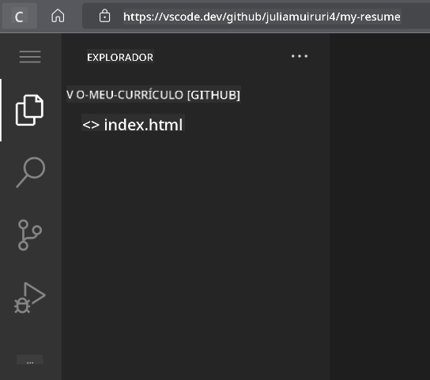

<!--
CO_OP_TRANSLATOR_METADATA:
{
  "original_hash": "effe56ba51c38d7bdfad1ea38288666b",
  "translation_date": "2026-01-06T17:48:56+00:00",
  "source_file": "8-code-editor/1-using-a-code-editor/assignment.md",
  "language_code": "pt"
}
-->
# Criar um Website de Currículo Usando VSCode.dev

Transforme as suas perspetivas de carreira construindo um website de currículo profissional que mostre as suas competências e experiência num formato interativo e moderno. Em vez de enviar PDFs tradicionais, imagine fornecer aos recrutadores um website elegante e responsivo que demonstre não só as suas qualificações, mas também as suas capacidades em desenvolvimento web.

Esta tarefa prática põe em ação todas as suas competências em VSCode.dev enquanto cria algo realmente útil para a sua carreira. Vai experienciar o fluxo completo de desenvolvimento web – desde a criação do repositório até à publicação – tudo dentro do seu navegador.

Ao completar este projeto, terá uma presença online profissional que pode ser facilmente partilhada com potenciais empregadores, atualizada conforme as suas competências evoluem, e personalizada para corresponder ao seu branding pessoal. Este é exatamente o tipo de projeto prático que demonstra competências reais em desenvolvimento web.

## Objetivos de Aprendizagem

Após completar esta tarefa, será capaz de:

- **Criar** e gerir um projeto completo de desenvolvimento web usando VSCode.dev
- **Estruturar** um website profissional usando elementos HTML semânticos
- **Estilizar** layouts responsivos com técnicas modernas de CSS
- **Implementar** funcionalidades interativas usando tecnologias web básicas
- **Publicar** um website ao vivo acessível via URL partilhável
- **Demonstrar** melhores práticas de controlo de versões ao longo do processo de desenvolvimento

## Pré-requisitos

Antes de começar esta tarefa, assegure-se de que tem:

- Uma conta GitHub (crie uma em [github.com](https://github.com/) se necessário)
- Conclusão da lição VSCode.dev que cobre navegação na interface e operações básicas
- Conhecimentos básicos de estrutura HTML e conceitos de estilização CSS

## Configuração do Projeto e Criação do Repositório

Vamos começar por configurar a base do seu projeto. Este processo espelha fluxos de trabalho reais onde os projetos começam com a inicialização adequada do repositório e planeamento da estrutura.

### Passo 1: Crie o seu Repositório no GitHub

Configurar um repositório dedicado garante que o seu projeto está organizado e controlado por versões desde o início.

1. **Navegue** para [GitHub.com](https://github.com) e inicie sessão na sua conta
2. **Clique** no botão verde "New" ou no ícone "+" no canto superior direito
3. **Nomeie** o seu repositório como `my-resume` (ou escolha um nome personalizado como `john-smith-resume`)
4. **Adicione** uma descrição breve: "Website profissional de currículo construído com HTML e CSS"
5. **Selecione** "Public" para tornar o seu currículo acessível a potenciais empregadores
6. **Assinale** "Add a README file" para criar uma descrição inicial do projeto
7. **Clique** em "Create repository" para finalizar a configuração

> 💡 **Dica para Nomear Repositórios**: Use nomes descritivos e profissionais que indiquem claramente o propósito do projeto. Isto ajuda na partilha com empregadores ou durante avaliações de portfólio.

### Passo 2: Inicialize a Estrutura do Projeto

Como o VSCode.dev requer pelo menos um ficheiro para abrir um repositório, vamos criar o nosso ficheiro principal HTML diretamente no GitHub antes de mudar para o editor web.

1. **Clique** no link "creating a new file" no seu novo repositório
2. **Digite** `index.html` como nome do ficheiro
3. **Adicione** esta estrutura HTML inicial:

```html
<!DOCTYPE html>
<html lang="en">
<head>
    <meta charset="UTF-8">
    <meta name="viewport" content="width=device-width, initial-scale=1.0">
    <title>Your Name - Professional Resume</title>
</head>
<body>
    <h1>Your Name</h1>
    <p>Professional Resume Website</p>
</body>
</html>
```

4. **Escreva** uma mensagem de commit: "Add initial HTML structure"
5. **Clique** em "Commit new file" para guardar as alterações


**Isto estabelece:**
- **Uma estrutura** correta de documento HTML5 com elementos semânticos
- **Inclui** a meta tag viewport para compatibilidade com design responsivo
- **Define** um título descritivo que aparece nas abas do navegador
- **Cria** a base para uma organização profissional de conteúdos

## Trabalhar no VSCode.dev

Agora que a base do seu repositório está estabelecida, vamos transitar para o VSCode.dev para o desenvolvimento principal. Este editor baseado na web oferece todas as ferramentas necessárias para desenvolvimento web profissional.

### Passo 3: Abra o seu Projeto no VSCode.dev

1. **Navegue** para [vscode.dev](https://vscode.dev) numa nova aba do navegador
2. **Clique** em "Open Remote Repository" na tela de boas-vindas
3. **Copie** a URL do seu repositório do GitHub e cole-a no campo de entrada

   Formato: `https://github.com/seu-usuario/my-resume`
   
   *Substitua `seu-usuario` pelo seu nome de utilizador GitHub real*

4. **Pressione** Enter para carregar o seu projeto

✅ **Indicador de sucesso**: Deve ver os ficheiros do projeto na barra lateral do Explorer e `index.html` disponível para edição na área principal do editor.



**O que verá na interface:**
- **Barra lateral Explorer**: **Exibe** os ficheiros e pastas do seu repositório
- **Área do editor**: **Mostra** o conteúdo dos ficheiros selecionados para edição
- **Barra de atividade**: **Fornece** acesso a funcionalidades como Controlo de Código-Fonte e Extensões
- **Barra de estado**: **Indica** o estado da ligação e informações sobre a branch atual

### Passo 4: Construa o Conteúdo do seu Currículo

Substitua o conteúdo temporário em `index.html` por uma estrutura abrangente de currículo. Este HTML fornece a base para uma apresentação profissional das suas qualificações.

<details>
<summary><b>Estrutura HTML Completa do Currículo</b></summary>

```html
<!DOCTYPE html>
<html lang="en">
<head>
    <meta charset="UTF-8">
    <meta name="viewport" content="width=device-width, initial-scale=1.0">
    <link href="style.css" rel="stylesheet">
    <link rel="stylesheet" href="https://cdnjs.cloudflare.com/ajax/libs/font-awesome/5.15.4/css/all.min.css">
    <title>Your Name - Professional Resume</title>
</head>
<body>
    <header id="header">
        <h1>Your Full Name</h1>
        <hr>
        <p class="role">Your Professional Title</p>
        <hr>
    </header>
    
    <main>
        <article id="mainLeft">
            <section>
                <h2>CONTACT</h2>
                <p>
                    <i class="fa fa-envelope" aria-hidden="true"></i>
                    <a href="mailto:your.email@domain.com">your.email@domain.com</a>
                </p>
                <p>
                    <i class="fab fa-github" aria-hidden="true"></i>
                    <a href="https://github.com/your-username">github.com/your-username</a>
                </p>
                <p>
                    <i class="fab fa-linkedin" aria-hidden="true"></i>
                    <a href="https://linkedin.com/in/your-profile">linkedin.com/in/your-profile</a>
                </p>
            </section>
            
            <section>
                <h2>SKILLS</h2>
                <ul>
                    <li>HTML5 & CSS3</li>
                    <li>JavaScript (ES6+)</li>
                    <li>Responsive Web Design</li>
                    <li>Version Control (Git)</li>
                    <li>Problem Solving</li>
                </ul>
            </section>
            
            <section>
                <h2>EDUCATION</h2>
                <h3>Your Degree or Certification</h3>
                <p>Institution Name</p>
                <p>Start Date - End Date</p>
            </section>
        </article>
        
        <article id="mainRight">
            <section>
                <h2>ABOUT</h2>
                <p>Write a compelling summary that highlights your passion for web development, key achievements, and career goals. This section should give employers insight into your personality and professional approach.</p>
            </section>
            
            <section>
                <h2>WORK EXPERIENCE</h2>
                <div class="job">
                    <h3>Job Title</h3>
                    <p class="company">Company Name | Start Date – End Date</p>
                    <ul>
                        <li>Describe a key accomplishment or responsibility</li>
                        <li>Highlight specific skills or technologies used</li>
                        <li>Quantify impact where possible (e.g., "Improved efficiency by 25%")</li>
                    </ul>
                </div>
                
                <div class="job">
                    <h3>Previous Job Title</h3>
                    <p class="company">Previous Company | Start Date – End Date</p>
                    <ul>
                        <li>Focus on transferable skills and achievements</li>
                        <li>Demonstrate growth and learning progression</li>
                        <li>Include any leadership or collaboration experiences</li>
                    </ul>
                </div>
            </section>
            
            <section>
                <h2>PROJECTS</h2>
                <div class="project">
                    <h3>Project Name</h3>
                    <p>Brief description of what the project accomplishes and technologies used.</p>
                    <a href="#" target="_blank">View Project</a>
                </div>
            </section>
        </article>
    </main>
</body>
</html>
```
</details>

**Diretrizes para personalização:**
- **Substitua** todo o texto exemplo pelas suas informações reais
- **Ajuste** as secções conforme o seu nível de experiência e foco profissional
- **Adicione** ou remova secções conforme necessário (ex: Certificações, Trabalho Voluntário, Línguas)
- **Inclua** ligações para os seus perfis e projetos reais

### Passo 5: Crie Ficheiros de Suporte

Websites profissionais requerem estruturas de ficheiros organizadas. Crie a folha de estilo CSS e os ficheiros de configuração necessários para o projeto completo.

1. **Passe o cursor** sobre o nome da pasta do projeto na barra lateral Explorer
2. **Clique** no ícone "New File" (📄+) que aparece
3. **Crie** estes ficheiros um a um:
   - `style.css` (para estilos e layout)
   - `codeswing.json` (para configuração da extensão de pré-visualização)

**Criação do ficheiro CSS (`style.css`):**

<details>
<summary><b>Estilização Profissional em CSS</b></summary>

```css
/* Modern Resume Styling */
body {
    font-family: 'Segoe UI', Tahoma, Geneva, Verdana, sans-serif;
    font-size: 16px;
    line-height: 1.6;
    max-width: 960px;
    margin: 0 auto;
    padding: 20px;
    color: #333;
    background-color: #f9f9f9;
}

/* Header Styling */
header {
    text-align: center;
    margin-bottom: 3em;
    padding: 2em;
    background: linear-gradient(135deg, #667eea 0%, #764ba2 100%);
    color: white;
    border-radius: 10px;
    box-shadow: 0 4px 6px rgba(0, 0, 0, 0.1);
}

h1 {
    font-size: 3em;
    letter-spacing: 0.1em;
    margin-bottom: 0.2em;
    font-weight: 300;
}

.role {
    font-size: 1.3em;
    font-weight: 300;
    margin: 1em 0;
}

/* Main Content Layout */
main {
    display: grid;
    grid-template-columns: 35% 65%;
    gap: 3em;
    margin-top: 3em;
    background: white;
    padding: 2em;
    border-radius: 10px;
    box-shadow: 0 2px 10px rgba(0, 0, 0, 0.1);
}

/* Typography */
h2 {
    font-size: 1.4em;
    font-weight: 600;
    margin-bottom: 1em;
    color: #667eea;
    border-bottom: 2px solid #667eea;
    padding-bottom: 0.3em;
}

h3 {
    font-size: 1.1em;
    font-weight: 600;
    margin-bottom: 0.5em;
    color: #444;
}

/* Section Styling */
section {
    margin-bottom: 2.5em;
}

#mainLeft {
    border-right: 1px solid #e0e0e0;
    padding-right: 2em;
}

/* Contact Links */
section a {
    color: #667eea;
    text-decoration: none;
    transition: color 0.3s ease;
}

section a:hover {
    color: #764ba2;
    text-decoration: underline;
}

/* Icons */
i {
    margin-right: 0.8em;
    width: 20px;
    text-align: center;
    color: #667eea;
}

/* Lists */
ul {
    list-style: none;
    padding-left: 0;
}

li {
    margin: 0.5em 0;
    padding: 0.3em 0;
    position: relative;
}

li:before {
    content: "▸";
    color: #667eea;
    margin-right: 0.5em;
}

/* Work Experience */
.job, .project {
    margin-bottom: 2em;
    padding-bottom: 1.5em;
    border-bottom: 1px solid #f0f0f0;
}

.company {
    font-style: italic;
    color: #666;
    margin-bottom: 0.5em;
}

/* Responsive Design */
@media (max-width: 768px) {
    main {
        grid-template-columns: 1fr;
        gap: 2em;
    }
    
    #mainLeft {
        border-right: none;
        border-bottom: 1px solid #e0e0e0;
        padding-right: 0;
        padding-bottom: 2em;
    }
    
    h1 {
        font-size: 2.2em;
    }
    
    body {
        padding: 10px;
    }
}

/* Print Styles */
@media print {
    body {
        background: white;
        color: black;
        font-size: 12pt;
    }
    
    header {
        background: none;
        color: black;
        box-shadow: none;
    }
    
    main {
        box-shadow: none;
    }
}
```
</details>

**Criação do ficheiro de configuração (`codeswing.json`):**

```json
{
    "scripts": [],
    "styles": []
}
```

**Funcionalidades do CSS:**
- **Utiliza** CSS Grid para estrutura de layout responsivo e profissional
- **Implementa** esquemas de cor modernos com cabeçalhos em gradiente
- **Inclui** efeitos de hover e transições suaves para interatividade
- **Fornece** design responsivo para todos os tamanhos de dispositivos
- **Adiciona** estilos amigáveis para impressão e geração de PDF

### Passo 6: Instale e Configure Extensões

As extensões melhoram a sua experiência de desenvolvimento oferecendo capacidades de pré-visualização ao vivo e ferramentas de fluxo de trabalho melhoradas. A extensão CodeSwing é particularmente útil para projetos de desenvolvimento web.

**Instalar a Extensão CodeSwing:**

1. **Clique** no ícone de Extensões (🧩) na Barra de Atividade 
2. **Pesquise** por "CodeSwing" na caixa de pesquisa do marketplace
3. **Selecione** a extensão CodeSwing nos resultados da pesquisa
4. **Clique** no botão azul "Install"


**O que o CodeSwing oferece:**
- **Permite** pré-visualização ao vivo do seu website enquanto edita
- **Mostra** alterações em tempo real sem necessidade de atualização manual
- **Suporta** múltiplos tipos de ficheiros incluindo HTML, CSS e JavaScript
- **Oferece** uma experiência integrada de ambiente de desenvolvimento

**Resultados imediatos após a instalação:**
Assim que o CodeSwing estiver instalado, verá uma pré-visualização ao vivo do seu website de currículo surgir no editor. Isto permite que veja exatamente como o seu site aparece enquanto faz alterações.


**Compreender a interface melhorada:**
- **Vista dividida**: **Mostra** o seu código de um lado e a pré-visualização do outro
- **Atualizações em tempo real**: **Reflete** alterações de imediato conforme escreve
- **Pré-visualização interativa**: **Permite** testar links e interações
- **Simulação móvel**: **Proporciona** capacidades de teste para design responsivo

### Passo 7: Controlo de Versão e Publicação

Agora que o seu website de currículo está completo, use Git para guardar o seu trabalho e torná-lo disponível online.

**Fazer commit das suas alterações:**

1. **Clique** no ícone Controlo de Código-Fonte (🌿) na Barra de Atividade
2. **Revise** todos os ficheiros criados e modificados na secção "Changes"
3. **Faça stage** das alterações clicando no ícone "+" junto a cada ficheiro
4. **Escreva** uma mensagem de commit descritiva, como:
   - "Add complete resume website with responsive design"
   - "Implement professional styling and content structure"
5. **Clique** no visto (✓) para fazer commit e push das alterações

**Exemplos eficazes de mensagens de commit:**
- "Add professional resume content and styling"
- "Implement responsive design for mobile compatibility"
- "Update contact information and project links"

> 💡 **Dica Profissional**: Boas mensagens de commit ajudam a acompanhar a evolução do projeto e demonstram atenção ao detalhe – qualidades valorizadas pelos empregadores.

**Aceder ao seu site publicado:**
Depois de fazer o commit, pode voltar ao seu repositório GitHub usando o menu hambúrguer (☰) no canto superior esquerdo. O seu website de currículo está agora controlado por versões e pronto para publicação ou partilha.

## Resultados e Próximos Passos

**Parabéns! 🎉** Criou com sucesso um website profissional de currículo usando VSCode.dev. O seu projeto demonstra:
**Competências técnicas demonstradas:**
- **Gestão de repositórios**: Criou e organizou uma estrutura de projeto completa
- **Desenvolvimento web**: Construíu um website responsivo usando HTML5 e CSS3 modernos
- **Controlo de versão**: Implementou fluxo de trabalho Git adequado com commits significativos
- **Proeficiência em ferramentas**: Usou eficazmente a interface e o sistema de extensões do VSCode.dev

**Resultados profissionais alcançados:**
- **Presença online**: Um URL partilhável que mostra as suas qualificações
- **Formato moderno**: Uma alternativa interativa aos currículos PDF tradicionais
- **Competências demonstráveis**: Evidência concreta das suas aptidões de desenvolvimento web
- **Atualizações fáceis**: Uma base que pode melhorar e personalizar continuamente

### Opções de Publicação

Para tornar o seu currículo acessível aos empregadores, considere estas opções de alojamento:

**GitHub Pages (Recomendado):**
1. Vá às Definições (Settings) do seu repositório no GitHub
2. Desça até à secção "Pages"
3. Selecione "Deploy from a branch" e escolha "main"
4. O seu site estará disponível em `https://seu-usuario.github.io/my-resume`

**Plataformas alternativas:**
- **Netlify**: Publicação automática com domínios personalizados
- **Vercel**: Publicação rápida com funcionalidades modernas de alojamento
- **GitHub Codespaces**: Ambiente de desenvolvimento com pré-visualização integrada

### Sugestões de Aprimoramento

Continue a desenvolver as suas competências adicionando estas funcionalidades:

**Melhorias técnicas:**
- **Interatividade com JavaScript**: Adicione scroll suave ou elementos interativos
- **Modo escuro**: Implemente alternância de tema para preferência do utilizador
- **Formulário de contacto**: Permita comunicação direta com potenciais empregadores
- **Otimização SEO**: Adicione meta tags e dados estruturados para melhor visibilidade

**Aprimoramentos de conteúdo:**
- **Portefólio de projetos**: Ligue para repositórios GitHub e demonstrações ao vivo
- **Visualização de competências**: Crie barras de progresso ou sistemas de avaliação
- **Secção de testemunhos**: Inclua recomendações de colegas ou instrutores
- **Integração de blog**: Adicione uma secção de blog para mostrar a sua jornada de aprendizagem

## Desafio do GitHub Copilot Agent 🚀

Use o modo Agent para completar o desafio seguinte:

**Descrição:** Aprimore o seu website de currículo com funcionalidades avançadas que demonstrem capacidades profissionais de desenvolvimento web e princípios modernos de design.

**Prompt:** Com base no seu site de currículo existente, implemente estas funcionalidades avançadas:
1. Adicione um alternador de tema claro/escuro com transições suaves
2. Crie uma secção interativa de competências com barras de progresso animadas
3. Implemente um formulário de contacto com validação
4. Adicione uma secção de portefólio de projetos com efeitos hover e modais pop-up
5. Inclua uma secção de blog com pelo menos 3 posts de amostra sobre a sua jornada de aprendizagem
6. Otimize para SEO com meta tags apropriadas, dados estruturados e performance
7. Publique o site melhorado usando GitHub Pages ou Netlify
8. Documente todas as novas funcionalidades no README.md com capturas de ecrã

O seu website melhorado deverá demonstrar domínio das práticas modernas de desenvolvimento web, incluindo design responsivo, interatividade com JavaScript, e fluxos profissionais de publicação.

## Extensão do Desafio

Quer levar as suas competências mais longe? Experimente estes desafios avançados:

**📱 Redesenho Mobile-First:** Reconstrua completamente o site usando uma abordagem mobile-first com CSS Grid e Flexbox

**🔍 Otimização SEO:** Implemente SEO abrangente incluindo meta tags, dados estruturados e otimização de performance

**🌐 Suporte Multilingue:** Adicione funcionalidades de internacionalização para suportar múltiplas línguas

**📊 Integração de Analytics:** Adicione Google Analytics para monitorizar o envolvimento de visitantes e otimizar conteúdos

**🚀 Otimização de Performance:** Alcance pontuações perfeitas no Lighthouse em todas as categorias

## Revisão & Autoestudo

Expanda os seus conhecimentos com estes recursos:

**Funcionalidades avançadas do VSCode.dev:**
- [Documentação do VSCode.dev](https://code.visualstudio.com/docs/editor/vscode-web?WT.mc_id=academic-0000-alfredodeza) - Guia completo para edição web
- [GitHub Codespaces](https://docs.github.com/en/codespaces) - Ambientes de desenvolvimento em nuvem

**Melhores práticas de desenvolvimento web:**
- **Design responsivo**: Estude CSS Grid e Flexbox para layouts modernos
- **Acessibilidade**: Aprenda as diretrizes WCAG para design web inclusivo
- **Desempenho**: Explore ferramentas como o Lighthouse para otimização
- **SEO**: Compreenda os fundamentos da otimização para motores de busca

**Desenvolvimento Profissional:**
- **Construção de Portefólio**: Crie projetos adicionais para demonstrar habilidades diversificadas
- **Open Source**: Contribua para projetos existentes para ganhar experiência em colaboração
- **Networking**: Partilhe o seu website de currículo em comunidades de programadores para obter feedback
- **Aprendizagem Contínua**: Mantenha-se atualizado com as tendências e tecnologias do desenvolvimento web

---

**Os Seus Próximos Passos:** Partilhe o seu website de currículo com amigos, família ou mentores para obter feedback. Utilize as suas sugestões para iterar e melhorar o seu design. Lembre-se, este projeto não é apenas um currículo – é uma demonstração do seu crescimento como programador web!

---

<!-- CO-OP TRANSLATOR DISCLAIMER START -->
**Aviso Legal**:
Este documento foi traduzido utilizando o serviço de tradução automática [Co-op Translator](https://github.com/Azure/co-op-translator). Embora nos esforcemos para garantir a precisão, esteja ciente de que traduções automatizadas podem conter erros ou imprecisões. O documento original na sua língua nativa deve ser considerado a fonte oficial. Para informações críticas, recomenda-se a tradução profissional realizada por um humano. Não nos responsabilizamos por quaisquer mal-entendidos ou interpretações incorretas resultantes da utilização desta tradução.
<!-- CO-OP TRANSLATOR DISCLAIMER END -->