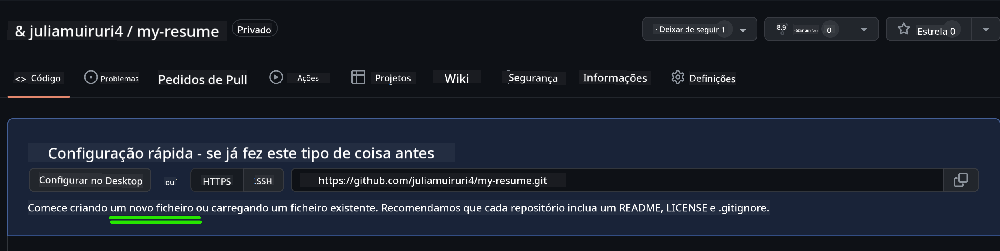
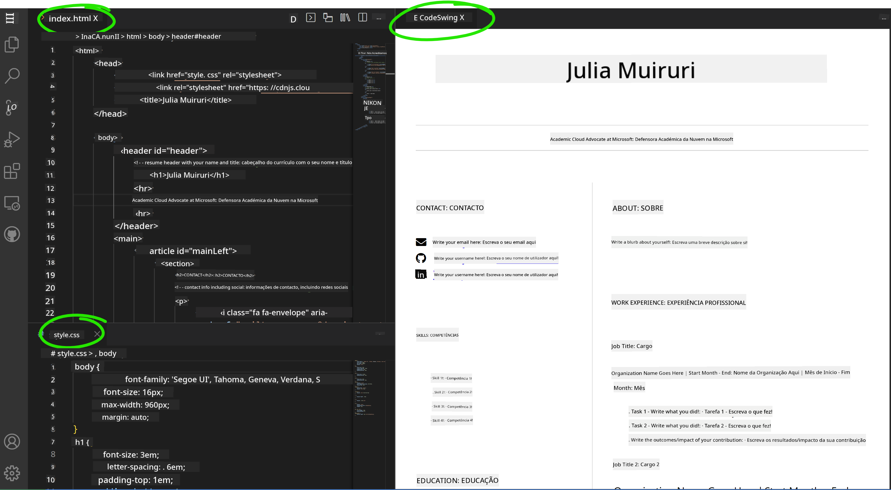

<!--
CO_OP_TRANSLATOR_METADATA:
{
  "original_hash": "bd3aa6d2b879c30ea496c43aec1c49ed",
  "translation_date": "2025-08-29T16:17:40+00:00",
  "source_file": "8-code-editor/1-using-a-code-editor/assignment.md",
  "language_code": "pt"
}
-->
# Criar um site de currículo usando vscode.dev

_Que incrível seria se um recrutador pedisse o teu currículo e tu enviasses um URL?_ 😎

<!----
TODO: adicionar uma imagem opcional

> Sketchnote por [Nome do Autor](https://example.com)
---->

<!---
## Questionário Pré-Aula
[Questionário pré-aula](https://ff-quizzes.netlify.app/web/quiz/3)
---->

## Objetivos

Após esta tarefa, vais aprender a:

- Criar um site para apresentar o teu currículo

### Pré-requisitos

1. Uma conta no GitHub. Acede a [GitHub](https://github.com/) e cria uma conta, caso ainda não tenhas uma.

## Passos

**Passo 1:** Cria um novo repositório no GitHub e dá-lhe o nome `my-resume`

**Passo 2:** Cria um ficheiro `index.html` no teu repositório. Vamos adicionar pelo menos um ficheiro diretamente no github.com, pois não é possível abrir um repositório vazio no vscode.dev.

Clica no link `creating a new file`, escreve o nome `index.html` e seleciona o botão `Commit new file`.



**Passo 3:** Abre [VSCode.dev](https://vscode.dev) e seleciona o botão `Open Remote Repository`.

Copia o URL do repositório que acabaste de criar para o site do teu currículo e cola-o na caixa de entrada:

_Substitui `your-username` pelo teu nome de utilizador do GitHub._

```
https://github.com/your-username/my-resume
```

✅ Se for bem-sucedido, vais ver o teu projeto e o ficheiro index.html abertos no editor de texto no navegador.


**Passo 4:** Abre o ficheiro `index.html`, cola o código abaixo na área de código e guarda.

<details>
    <summary><b>Código HTML responsável pelo conteúdo do site do teu currículo.</b></summary>
    
        <html>

            <head>
                <link href="style.css" rel="stylesheet">
                <link rel="stylesheet" href="https://cdnjs.cloudflare.com/ajax/libs/font-awesome/5.15.4/css/all.min.css">
                <title>O Teu Nome Aqui!</title>
            </head>
            <body>
                <header id="header">
                    <!-- cabeçalho do currículo com o teu nome e título -->
                    <h1>O Teu Nome Aqui!</h1>
                    <hr>
                    A Tua Função!
                    <hr>
                </header>
                <main>
                    <article id="mainLeft">
                        <section>
                            <h2>CONTACTO</h2>
                            <!-- informações de contacto, incluindo redes sociais -->
                            <p>
                                <i class="fa fa-envelope" aria-hidden="true"></i>
                                <a href="mailto:username@domain.top-level domain">Escreve o teu email aqui</a>
                            </p>
                            <p>
                                <i class="fab fa-github" aria-hidden="true"></i>
                                <a href="github.com/yourGitHubUsername">Escreve o teu nome de utilizador aqui!</a>
                            </p>
                            <p>
                                <i class="fab fa-linkedin" aria-hidden="true"></i>
                                <a href="linkedin.com/yourLinkedInUsername">Escreve o teu nome de utilizador aqui!</a>
                            </p>
                        </section>
                        <section>
                            <h2>COMPETÊNCIAS</h2>
                            <!-- as tuas competências -->
                            <ul>
                                <li>Competência 1!</li>
                                <li>Competência 2!</li>
                                <li>Competência 3!</li>
                                <li>Competência 4!</li>
                            </ul>
                        </section>
                        <section>
                            <h2>EDUCAÇÃO</h2>
                            <!-- a tua formação -->
                            <h3>Escreve o teu curso aqui!</h3>
                            <p>
                                Escreve a tua instituição aqui!
                            </p>
                            <p>
                                Data de início - Data de fim
                            </p>
                        </section>            
                    </article>
                    <article id="mainRight">
                        <section>
                            <h2>SOBRE</h2>
                            <!-- sobre ti -->
                            <p>Escreve um resumo sobre ti!</p>
                        </section>
                        <section>
                            <h2>EXPERIÊNCIA PROFISSIONAL</h2>
                            <!-- a tua experiência profissional -->
                            <h3>Título do Cargo</h3>
                            <p>
                                Nome da Organização Aqui | Mês de Início – Mês de Fim
                            </p>
                            <ul>
                                    <li>Tarefa 1 - Escreve o que fizeste!</li>
                                    <li>Tarefa 2 - Escreve o que fizeste!</li>
                                    <li>Escreve os resultados/impacto da tua contribuição</li>
                                    
                            </ul>
                            <h3>Título do Cargo 2</h3>
                            <p>
                                Nome da Organização Aqui | Mês de Início – Mês de Fim
                            </p>
                            <ul>
                                    <li>Tarefa 1 - Escreve o que fizeste!</li>
                                    <li>Tarefa 2 - Escreve o que fizeste!</li>
                                    <li>Escreve os resultados/impacto da tua contribuição</li>
                                    
                            </ul>
                        </section>
                    </article>
                </main>
            </body>
        </html>
</details>

Adiciona os detalhes do teu currículo para substituir o _texto de exemplo_ no código HTML.

**Passo 5:** Passa o cursor sobre a pasta My-Resume, clica no ícone `New File ...` e cria 2 novos ficheiros no teu projeto: `style.css` e `codeswing.json`.

**Passo 6:** Abre o ficheiro `style.css`, cola o código abaixo e guarda.

<details>
        <summary><b>Código CSS para formatar o layout do site.</b></summary>
            
            body {
                font-family: 'Segoe UI', Tahoma, Geneva, Verdana, sans-serif;
                font-size: 16px;
                max-width: 960px;
                margin: auto;
            }
            h1 {
                font-size: 3em;
                letter-spacing: .6em;
                padding-top: 1em;
                padding-bottom: 1em;
            }

            h2 {
                font-size: 1.5em;
                padding-bottom: 1em;
            }

            h3 {
                font-size: 1em;
                padding-bottom: 1em;
            }
            main { 
                display: grid;
                grid-template-columns: 40% 60%;
                margin-top: 3em;
            }
            header {
                text-align: center;
                margin: auto 2em;
            }

            section {
                margin: auto 1em 4em 2em;
            }

            i {
                margin-right: .5em;
            }

            p {
                margin: .2em auto
            }

            hr {
                border: none;
                background-color: lightgray;
                height: 1px;
            }

            h1, h2, h3 {
                font-weight: 100;
                margin-bottom: 0;
            }
            #mainLeft {
                border-right: 1px solid lightgray;
            }
            
</details>

**Passo 6:** Abre o ficheiro `codeswing.json`, cola o código abaixo e guarda.

    {
    "scripts": [],
    "styles": []
    }

**Passo 7:** Instala a extensão `Codeswing` para visualizar o site do currículo na área de código.

Clica no ícone _`Extensions`_ na barra de atividades e escreve Codeswing. Clica no _botão azul de instalação_ na barra de atividades expandida para instalar ou usa o botão de instalação que aparece na área de código ao selecionar a extensão para carregar informações adicionais. Imediatamente após instalar a extensão, observa a área de código para ver as alterações no teu projeto 😃.


Isto é o que vais ver no teu ecrã após instalar a extensão.



Se estiveres satisfeito com as alterações que fizeste, passa o cursor sobre a pasta `Changes` e clica no botão `+` para preparar as alterações.

Escreve uma mensagem de commit _(Uma descrição da alteração que fizeste no projeto)_ e confirma as tuas alterações clicando no `check`. Quando terminares de trabalhar no teu projeto, seleciona o ícone do menu hambúrguer no canto superior esquerdo para voltar ao repositório no GitHub.

Parabéns 🎉 Acabaste de criar o teu site de currículo usando vscode.dev em poucos passos.

## 🚀 Desafio

Abre um repositório remoto onde tens permissões para fazer alterações e atualiza alguns ficheiros. Em seguida, tenta criar um novo ramo com as tuas alterações e faz um Pull Request.

<!----
## Questionário Pós-Aula
[Questionário pós-aula](https://ff-quizzes.netlify.app/web/quiz/4)
---->

## Revisão & Autoestudo

Lê mais sobre [VSCode.dev](https://code.visualstudio.com/docs/editor/vscode-web?WT.mc_id=academic-0000-alfredodeza) e algumas das suas outras funcionalidades.

---

**Aviso**:  
Este documento foi traduzido utilizando o serviço de tradução por IA [Co-op Translator](https://github.com/Azure/co-op-translator). Embora nos esforcemos pela precisão, esteja ciente de que traduções automáticas podem conter erros ou imprecisões. O documento original na sua língua nativa deve ser considerado a fonte autoritária. Para informações críticas, recomenda-se a tradução profissional realizada por humanos. Não nos responsabilizamos por quaisquer mal-entendidos ou interpretações incorretas decorrentes do uso desta tradução.