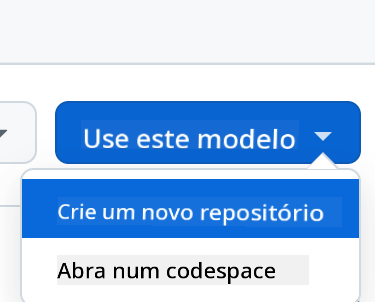
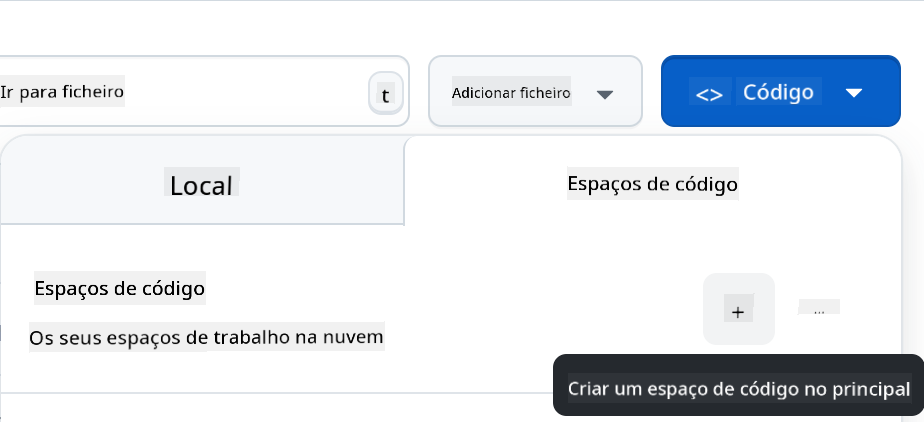

<!--
CO_OP_TRANSLATOR_METADATA:
{
  "original_hash": "11cf36165c243947b6cd85b88cf6faa6",
  "translation_date": "2025-09-01T16:53:36+00:00",
  "source_file": "9-chat-project/README.md",
  "language_code": "pt"
}
-->
# Projeto de Chat

Este projeto de chat mostra como construir um Assistente de Chat utilizando os Modelos do GitHub.

Aqui está como o projeto finalizado se parece:


Para contextualizar, construir assistentes de chat usando IA generativa é uma ótima maneira de começar a aprender sobre IA. O que você aprenderá nesta lição é como integrar IA generativa em uma aplicação web. Vamos começar.

## Conectando à IA generativa

Para o backend, estamos a usar os Modelos do GitHub. É um ótimo serviço que permite usar IA gratuitamente. Aceda ao playground e copie o código correspondente à linguagem de backend que escolheu. Aqui está como ele se parece no [GitHub Models Playground](https://github.com/marketplace/models/azure-openai/gpt-4o-mini/playground)


Como mencionado, selecione o separador "Code" e o runtime que escolheu. 


### Usando Python

Neste caso, selecionamos Python, o que significa que escolhemos este código:

```python
"""Run this model in Python

> pip install openai
"""
import os
from openai import OpenAI

# To authenticate with the model you will need to generate a personal access token (PAT) in your GitHub settings. 
# Create your PAT token by following instructions here: https://docs.github.com/en/authentication/keeping-your-account-and-data-secure/managing-your-personal-access-tokens
client = OpenAI(
    base_url="https://models.github.ai/inference",
    api_key=os.environ["GITHUB_TOKEN"],
)

response = client.chat.completions.create(
    messages=[
        {
            "role": "system",
            "content": "",
        },
        {
            "role": "user",
            "content": "What is the capital of France?",
        }
    ],
    model="openai/gpt-4o-mini",
    temperature=1,
    max_tokens=4096,
    top_p=1
)

print(response.choices[0].message.content)
```

Vamos limpar este código um pouco para que seja reutilizável:

```python
def call_llm(prompt: str, system_message: str):
    response = client.chat.completions.create(
        messages=[
            {
                "role": "system",
                "content": system_message,
            },
            {
                "role": "user",
                "content": prompt,
            }
        ],
        model="openai/gpt-4o-mini",
        temperature=1,
        max_tokens=4096,
        top_p=1
    )

    return response.choices[0].message.content
```

Com esta função `call_llm`, agora podemos passar um prompt e um prompt de sistema, e a função retorna o resultado.

### Personalizar o Assistente de IA

Se quiser personalizar o assistente de IA, pode especificar como deseja que ele se comporte preenchendo o prompt de sistema desta forma:

```python
call_llm("Tell me about you", "You're Albert Einstein, you only know of things in the time you were alive")
```

## Expor via uma API Web

Ótimo, já temos a parte de IA concluída. Vamos ver como podemos integrá-la numa API Web. Para a API Web, escolhemos usar Flask, mas qualquer framework web deve funcionar. Vamos ver o código:

### Usando Python

```python
# api.py
from flask import Flask, request, jsonify
from llm import call_llm
from flask_cors import CORS

app = Flask(__name__)
CORS(app)   # *   example.com

@app.route("/", methods=["GET"])
def index():
    return "Welcome to this API. Call POST /hello with 'message': 'my message' as JSON payload"


@app.route("/hello", methods=["POST"])
def hello():
    # get message from request body  { "message": "do this taks for me" }
    data = request.get_json()
    message = data.get("message", "")

    response = call_llm(message, "You are a helpful assistant.")
    return jsonify({
        "response": response
    })

if __name__ == "__main__":
    app.run(host="0.0.0.0", port=5000)
```

Aqui, criamos uma API Flask e definimos uma rota padrão "/" e "/chat". Esta última será usada pelo nosso frontend para enviar perguntas.

Para integrar o *llm.py*, aqui está o que precisamos fazer:

- Importar a função `call_llm`:

   ```python
   from llm import call_llm
   from flask import Flask, request
   ```

- Chamá-la na rota "/chat":

   ```python
   @app.route("/hello", methods=["POST"])
   def hello():
      # get message from request body  { "message": "do this taks for me" }
      data = request.get_json()
      message = data.get("message", "")

      response = call_llm(message, "You are a helpful assistant.")
      return jsonify({
         "response": response
      })
   ```

   Aqui analisamos o pedido recebido para obter a propriedade `message` do corpo JSON. Em seguida, chamamos o LLM com esta chamada:

   ```python
   response = call_llm(message, "You are a helpful assistant")

   # return the response as JSON
   return jsonify({
      "response": response 
   })
   ```

Ótimo, agora temos tudo o que precisamos.

## Configurar Cors

Devemos mencionar que configuramos algo como CORS, ou partilha de recursos entre origens. Isto significa que, como o nosso backend e frontend irão correr em portas diferentes, precisamos permitir que o frontend aceda ao backend.

### Usando Python

Há um trecho de código em *api.py* que configura isto:

```python
from flask_cors import CORS

app = Flask(__name__)
CORS(app)   # *   example.com
```

Atualmente, está configurado para permitir "*" (todas as origens), o que é um pouco inseguro. Devemos restringi-lo quando formos para produção.

## Executar o projeto

Para executar o projeto, primeiro precisa iniciar o backend e depois o frontend.

### Usando Python

Ok, temos *llm.py* e *api.py*. Como podemos fazer isso funcionar com um backend? Bem, há duas coisas que precisamos fazer:

- Instalar as dependências:

   ```sh
   cd backend
   python -m venv venv
   source ./venv/bin/activate

   pip install openai flask flask-cors openai
   ```

- Iniciar a API:

   ```sh
   python api.py
   ```

   Se estiver a usar Codespaces, precisa ir a Ports na parte inferior do editor, clicar com o botão direito e selecionar "Port Visibility" e escolher "Public".

### Trabalhar num frontend

Agora que temos uma API a funcionar, vamos criar um frontend para ela. Um frontend mínimo que iremos melhorar gradualmente. Na pasta *frontend*, crie o seguinte:

```text
backend/
frontend/
index.html
app.js
styles.css
```

Vamos começar com **index.html**:

```html
<html>
    <head>
        <link rel="stylesheet" href="styles.css">
    </head>
    <body>
      <form>
        <textarea id="messages"></textarea>
        <input id="input" type="text" />
        <button type="submit" id="sendBtn">Send</button>  
      </form>  
      <script src="app.js" />
    </body>
</html>    
```

O código acima é o mínimo necessário para suportar uma janela de chat, consistindo numa área de texto onde as mensagens serão exibidas, um campo de entrada para digitar mensagens e um botão para enviar a mensagem ao backend. Vamos olhar para o JavaScript a seguir em *app.js*.

**app.js**

```js
// app.js

(function(){
  // 1. set up elements  
  const messages = document.getElementById("messages");
  const form = document.getElementById("form");
  const input = document.getElementById("input");

  const BASE_URL = "change this";
  const API_ENDPOINT = `${BASE_URL}/hello`;

  // 2. create a function that talks to our backend
  async function callApi(text) {
    const response = await fetch(API_ENDPOINT, {
      method: "POST",
      headers: { "Content-Type": "application/json" },
      body: JSON.stringify({ message: text })
    });
    let json = await response.json();
    return json.response;
  }

  // 3. add response to our textarea
  function appendMessage(text, role) {
    const el = document.createElement("div");
    el.className = `message ${role}`;
    el.innerHTML = text;
    messages.appendChild(el);
  }

  // 4. listen to submit events
  form.addEventListener("submit", async(e) => {
    e.preventDefault();
   // someone clicked the button in the form
   
   // get input
   const text = input.value.trim();

   appendMessage(text, "user")

   // reset it
   input.value = '';

   const reply = await callApi(text);

   // add to messages
   appendMessage(reply, "assistant");

  })
})();
```

Vamos analisar o código por secção:

- 1) Aqui obtemos uma referência a todos os elementos que iremos usar mais tarde no código.
- 2) Nesta secção, criamos uma função que usa o método `fetch` embutido para chamar o nosso backend.
- 3) `appendMessage` ajuda a adicionar respostas, bem como o que o utilizador digita.
- 4) Aqui ouvimos o evento de envio, lemos o campo de entrada, colocamos a mensagem do utilizador na área de texto, chamamos a API e exibimos a resposta na área de texto.

Agora vamos ver o estilo. Aqui pode ser criativo e personalizar como quiser, mas aqui estão algumas sugestões:

**styles.css**

```
.message {
    background: #222;
    box-shadow: 0 0 0 10px orange;
    padding: 10px:
    margin: 5px;
}

.message.user {
    background: blue;
}

.message.assistant {
    background: grey;
} 
```

Com estas três classes, pode estilizar as mensagens de forma diferente dependendo de quem as enviou: o assistente ou o utilizador. Se precisar de inspiração, veja a pasta `solution/frontend/styles.css`.

### Alterar a Base URL

Há um detalhe que ainda não configurámos: a `BASE_URL`. Isto só será conhecido quando o backend estiver em execução. Para configurá-la:

- Se estiver a executar a API localmente, deve ser algo como `http://localhost:5000`.
- Se estiver a usar Codespaces, será algo como "[name]app.github.dev".

## Tarefa

Crie a sua própria pasta *project* com o seguinte conteúdo:

```text
project/
  frontend/
    index.html
    app.js
    styles.css
  backend/
    ...
```

Copie o conteúdo das instruções acima, mas sinta-se à vontade para personalizar como preferir.

## Solução

[Solução](./solution/README.md)

## Bónus

Experimente alterar a personalidade do assistente de IA.

### Para Python

Quando chamar `call_llm` em *api.py*, pode alterar o segundo argumento para o que quiser, por exemplo:

```python
call_llm(message, "You are Captain Picard")
```

### Frontend

Altere também o CSS e o texto como preferir, fazendo mudanças em *index.html* e *styles.css*.

## Resumo

Ótimo, aprendeu do zero como criar um assistente pessoal usando IA. Fizemos isso utilizando os Modelos do GitHub, um backend em Python e um frontend em HTML, CSS e JavaScript.

## Configurar com Codespaces

- Navegue para: [Repositório Web Dev For Beginners](https://github.com/microsoft/Web-Dev-For-Beginners)
- Crie a partir de um template (certifique-se de que está autenticado no GitHub) no canto superior direito:

    

- Uma vez no seu repositório, crie um Codespace:

    

    Isto deve iniciar um ambiente com o qual pode trabalhar.

---

**Aviso Legal**:  
Este documento foi traduzido utilizando o serviço de tradução por IA [Co-op Translator](https://github.com/Azure/co-op-translator). Embora nos esforcemos para garantir a precisão, é importante notar que traduções automáticas podem conter erros ou imprecisões. O documento original na sua língua nativa deve ser considerado a fonte autoritária. Para informações críticas, recomenda-se uma tradução profissional realizada por humanos. Não nos responsabilizamos por quaisquer mal-entendidos ou interpretações incorretas decorrentes da utilização desta tradução.