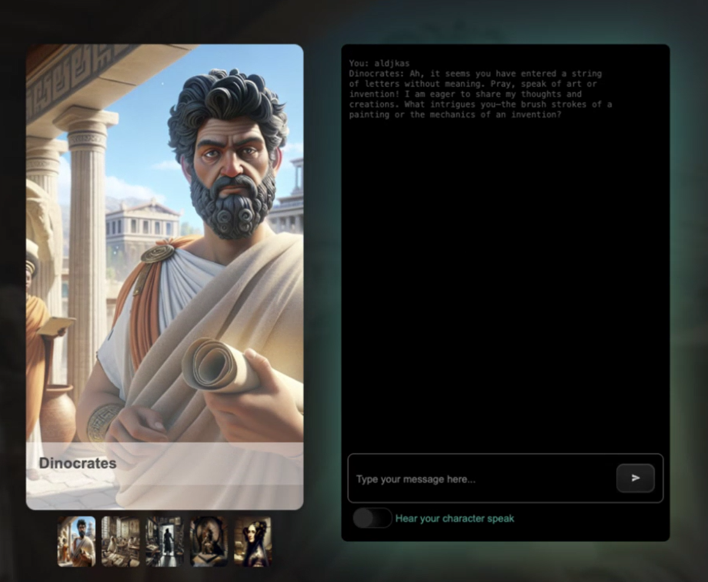

<!--
CO_OP_TRANSLATOR_METADATA:
{
  "original_hash": "687c62646ad5595f1ba733edc294cdae",
  "translation_date": "2025-08-29T16:06:11+00:00",
  "source_file": "README.md",
  "language_code": "pt"
}
-->
[](https://github.com/microsoft/Web-Dev-For-Beginners/blob/master/LICENSE)  
[](https://GitHub.com/microsoft/Web-Dev-For-Beginners/graphs/contributors/)  
[](https://GitHub.com/microsoft/Web-Dev-For-Beginners/issues/)  
[](https://GitHub.com/microsoft/Web-Dev-For-Beginners/pulls/)  
[](http://makeapullrequest.com)  

[](https://GitHub.com/microsoft/Web-Dev-For-Beginners/watchers/)  
[](https://GitHub.com/microsoft/Web-Dev-For-Beginners/network/)  
[](https://GitHub.com/microsoft/Web-Dev-For-Beginners/stargazers/)  

[](https://discord.gg/zxKYvhSnVp?WT.mc_id=academic-000002-leestott)  

[](https://open.vscode.dev/microsoft/Web-Dev-For-Beginners)  

[](https://discord.com/invite/ByRwuEEgH4)  

Siga estes passos para começar a usar estes recursos:  
1. **Faça um Fork do Repositório**: Clique [](https://GitHub.com/microsoft/Web-Dev-For-Beginners/fork)  
2. **Clone o Repositório**: `git clone https://github.com/microsoft/Web-Dev-For-Beginners.git`  
3. [**Junte-se ao Discord do Azure AI Foundry e conheça especialistas e outros desenvolvedores**](https://discord.com/invite/ByRwuEEgH4)  

# Desenvolvimento Web para Iniciantes - Um Currículo  

Aprenda os fundamentos do desenvolvimento web com o nosso curso abrangente de 12 semanas oferecido pelos Microsoft Cloud Advocates. Cada uma das 24 lições explora JavaScript, CSS e HTML através de projetos práticos como terrários, extensões de navegador e jogos espaciais. Participe de quizzes, discussões e tarefas práticas. Melhore suas habilidades e otimize a retenção de conhecimento com nossa metodologia eficaz baseada em projetos. Comece sua jornada de programação hoje!  

### 🌐 Suporte Multilíngue  

#### Suporte via GitHub Action (Automatizado e Sempre Atualizado)  

[Francês](../fr/README.md) | [Espanhol](../es/README.md) | [Alemão](../de/README.md) | [Russo](../ru/README.md) | [Árabe](../ar/README.md) | [Persa (Farsi)](../fa/README.md) | [Urdu](../ur/README.md) | [Chinês (Simplificado)](../zh/README.md) | [Chinês (Tradicional, Macau)](../mo/README.md) | [Chinês (Tradicional, Hong Kong)](../hk/README.md) | [Chinês (Tradicional, Taiwan)](../tw/README.md) | [Japonês](../ja/README.md) | [Coreano](../ko/README.md) | [Hindi](../hi/README.md) | [Bengali](../bn/README.md) | [Marathi](../mr/README.md) | [Nepali](../ne/README.md) | [Punjabi (Gurmukhi)](../pa/README.md) | [Português (Portugal)](./README.md) | [Português (Brasil)](../br/README.md) | [Italiano](../it/README.md) | [Polonês](../pl/README.md) | [Turco](../tr/README.md) | [Grego](../el/README.md) | [Tailandês](../th/README.md) | [Sueco](../sv/README.md) | [Dinamarquês](../da/README.md) | [Norueguês](../no/README.md) | [Finlandês](../fi/README.md) | [Holandês](../nl/README.md) | [Hebraico](../he/README.md) | [Vietnamita](../vi/README.md) | [Indonésio](../id/README.md) | [Malaio](../ms/README.md) | [Tagalog (Filipino)](../tl/README.md) | [Suaíli](../sw/README.md) | [Húngaro](../hu/README.md) | [Tcheco](../cs/README.md) | [Eslovaco](../sk/README.md) | [Romeno](../ro/README.md) | [Búlgaro](../bg/README.md) | [Sérvio (Cirílico)](../sr/README.md) | [Croata](../hr/README.md) | [Esloveno](../sl/README.md) | [Ucraniano](../uk/README.md) | [Birmanês (Myanmar)](../my/README.md)  

**Se desejar suporte para idiomas adicionais, os idiomas disponíveis estão listados [aqui](https://github.com/Azure/co-op-translator/blob/main/getting_started/supported-languages.md)**  

#### 🧑‍🎓 _É estudante?_  

Visite [**Página do Hub de Estudantes**](https://docs.microsoft.com/learn/student-hub/?WT.mc_id=academic-77807-sagibbon), onde encontrará recursos para iniciantes, pacotes para estudantes e até formas de obter um voucher gratuito para certificação. Esta é a página que você deve marcar como favorita e verificar de tempos em tempos, pois o conteúdo é atualizado mensalmente.  

### 📣 Anúncio - _Novo Projeto para construir usando IA Generativa_  

Acabamos de adicionar um novo projeto de Assistente de IA, confira [projeto](./09-chat-project/README.md)  

### 📣 Anúncio - _Novo Currículo_ sobre IA Generativa para JavaScript foi lançado  

Não perca nosso novo currículo de IA Generativa!  

Visite [https://aka.ms/genai-js-course](https://aka.ms/genai-js-course) para começar!  

  

- Lições que cobrem desde os fundamentos até RAG.  
- Interaja com personagens históricos usando GenAI e nosso aplicativo complementar.  
- Narrativa divertida e envolvente, você viajará no tempo!  

  

Cada lição inclui uma tarefa para completar, uma verificação de conhecimento e um desafio para guiá-lo no aprendizado de tópicos como:  
- Criação de prompts e engenharia de prompts  
- Geração de aplicativos de texto e imagem  
- Aplicativos de busca  

Visite [https://aka.ms/genai-js-course](https://aka.ms/genai-js-course) para começar!  

## 🌱 Começando  

> **Professores**, incluímos [algumas sugestões](for-teachers.md) sobre como usar este currículo. Adoraríamos receber seu feedback [no nosso fórum de discussão](https://github.com/microsoft/Web-Dev-For-Beginners/discussions/categories/teacher-corner)!  

**[Estudantes](https://aka.ms/student-page/?WT.mc_id=academic-77807-sagibbon)**, para cada lição, comece com um quiz pré-aula e siga lendo o material da aula, completando as várias atividades e verificando sua compreensão com o quiz pós-aula.  

Para melhorar sua experiência de aprendizado, conecte-se com seus colegas para trabalhar nos projetos juntos! Discussões são incentivadas no nosso [fórum de discussão](https://github.com/microsoft/Web-Dev-For-Beginners/discussions), onde nossa equipe de moderadores estará disponível para responder às suas perguntas.  

Para aprofundar sua educação, recomendamos explorar [Microsoft Learn](https://learn.microsoft.com/users/wirelesslife/collections/p1ddcy5jwy0jkm?WT.mc_id=academic-77807-sagibbon) para materiais de estudo adicionais.  

### 📋 Configurando seu ambiente  

Este currículo tem um ambiente de desenvolvimento pronto para uso! Ao começar, você pode optar por executar o currículo em um [Codespace](https://github.com/features/codespaces/) (_um ambiente baseado em navegador, sem necessidade de instalações_), ou localmente no seu computador usando um editor de texto como [Visual Studio Code](https://code.visualstudio.com/?WT.mc_id=academic-77807-sagibbon).  

#### Crie seu repositório  
Para salvar seu trabalho facilmente, recomendamos que você crie sua própria cópia deste repositório. Você pode fazer isso clicando no botão **Use this template** no topo da página. Isso criará um novo repositório na sua conta do GitHub com uma cópia do currículo.  

Siga estes passos:  
1. **Faça um Fork do Repositório**: Clique no botão "Fork" no canto superior direito desta página.  
2. **Clone o Repositório**: `git clone https://github.com/microsoft/Web-Dev-For-Beginners.git`  

#### Executando o currículo em um Codespace  

Na sua cópia deste repositório que você criou, clique no botão **Code** e selecione **Open with Codespaces**. Isso criará um novo Codespace para você trabalhar.  

[!Codespace](../..)./images/createcodespace.png)  

#### Executando o currículo localmente no seu computador  

Para executar este currículo localmente no seu computador, você precisará de um editor de texto, um navegador e uma ferramenta de linha de comando. Nossa primeira lição, [Introdução às Linguagens de Programação e Ferramentas de Trabalho](../../1-getting-started-lessons/1-intro-to-programming-languages), irá guiá-lo por várias opções para cada uma dessas ferramentas, para que você selecione o que funciona melhor para você.  

Nossa recomendação é usar [Visual Studio Code](https://code.visualstudio.com/?WT.mc_id=academic-77807-sagibbon) como seu editor, que também possui um [Terminal](https://code.visualstudio.com/docs/terminal/basics/?WT.mc_id=academic-77807-sagibbon) integrado. Você pode baixar o Visual Studio Code [aqui](https://code.visualstudio.com/?WT.mc_id=academic-77807-sagibbon).  

1. Clone seu repositório para o seu computador. Você pode fazer isso clicando no botão **Code** e copiando o URL:  

    [!CodeSpace](./images/createcodespace.png)  

    Em seguida, abra o [Terminal](https://code.visualstudio.com/docs/terminal/basics/?WT.mc_id=academic-77807-sagibbon) dentro do [Visual Studio Code](https://code.visualstudio.com/?WT.mc_id=academic-77807-sagibbon) e execute o seguinte comando, substituindo `<your-repository-url>` pelo URL que você acabou de copiar:  

    ```bash 
    git clone <your-repository-url>
    ```  

2. Abra a pasta no Visual Studio Code. Você pode fazer isso clicando em **File**  
> **Abrir Pasta** e selecionar a pasta que acabou de clonar.
> Extensões recomendadas para o Visual Studio Code:
>
> * [Live Server](https://marketplace.visualstudio.com/items?itemName=ritwickdey.LiveServer&WT.mc_id=academic-77807-sagibbon) - para pré-visualizar páginas HTML diretamente no Visual Studio Code
> * [Copilot](https://marketplace.visualstudio.com/items?itemName=GitHub.copilot&WT.mc_id=academic-77807-sagibbon) - para ajudar a escrever código mais rapidamente

## 📂 Cada lição inclui:

- sketchnote opcional
- vídeo complementar opcional
- questionário de aquecimento antes da lição
- lição escrita
- para lições baseadas em projetos, guias passo a passo para construir o projeto
- verificações de conhecimento
- um desafio
- leitura complementar
- tarefa
- [questionário pós-lição](https://ff-quizzes.netlify.app/web/)

> **Nota sobre os questionários**: Todos os questionários estão contidos na pasta Quiz-app, com um total de 48 questionários, cada um com três perguntas. Eles estão disponíveis [aqui](https://ff-quizzes.netlify.app/web/). A aplicação de questionários pode ser executada localmente ou implantada no Azure; siga as instruções na pasta `quiz-app`.

## 🗃️ Lições

|     |                       Nome do Projeto                       |                            Conceitos Ensinados                             | Objetivos de Aprendizagem                                                                                                           |                                                         Lição Vinculada                                                          |         Autor          |
| :-: | :---------------------------------------------------------: | :------------------------------------------------------------------------: | ----------------------------------------------------------------------------------------------------------------------------------- | :-----------------------------------------------------------------------------------------------------------------------------: | :-------------------: |
| 01  |                     Primeiros Passos                       |           Introdução à Programação e Ferramentas do Ofício                | Aprenda os fundamentos básicos por trás da maioria das linguagens de programação e sobre o software que ajuda desenvolvedores      | [Introdução às Linguagens de Programação e Ferramentas do Ofício](./1-getting-started-lessons/1-intro-to-programming-languages/README.md) |         Jasmine         |
| 02  |                     Primeiros Passos                       |             Fundamentos do GitHub, incluindo trabalho em equipe           | Como usar o GitHub no seu projeto e colaborar com outros em uma base de código                                                     |                            [Introdução ao GitHub](./1-getting-started-lessons/2-github-basics/README.md)                             |          Floor          |
| 03  |                     Primeiros Passos                       |                             Acessibilidade                                | Aprenda os fundamentos da acessibilidade na web                                                                                    |                       [Fundamentos de Acessibilidade](./1-getting-started-lessons/3-accessibility/README.md)                       |       Christopher       |
| 04  |                        Fundamentos de JS                   |                         Tipos de Dados em JavaScript                      | Os fundamentos dos tipos de dados em JavaScript                                                                                    |                                       [Tipos de Dados](./2-js-basics/1-data-types/README.md)                                        |         Jasmine         |
| 05  |                        Fundamentos de JS                   |                         Funções e Métodos                                 | Aprenda sobre funções e métodos para gerenciar o fluxo lógico de uma aplicação                                                     |                              [Funções e Métodos](./2-js-basics/2-functions-methods/README.md)                                       | Jasmine e Christopher |
| 06  |                        Fundamentos de JS                   |                        Tomando Decisões com JS                            | Aprenda a criar condições no seu código usando métodos de tomada de decisão                                                        |                                 [Tomando Decisões](./2-js-basics/3-making-decisions/README.md)                                     |         Jasmine         |
| 07  |                        Fundamentos de JS                   |                            Arrays e Loops                                 | Trabalhe com dados usando arrays e loops em JavaScript                                                                             |                                   [Arrays e Loops](./2-js-basics/4-arrays-loops/README.md)                                         |         Jasmine         |
| 08  |       [Terrário](./3-terrarium/solution/README.md)         |                            HTML na Prática                                | Construa o HTML para criar um terrário online, focando na criação de um layout                                                     |                                 [Introdução ao HTML](./3-terrarium/1-intro-to-html/README.md)                                      |           Jen           |
| 09  |       [Terrário](./3-terrarium/solution/README.md)         |                            CSS na Prática                                 | Construa o CSS para estilizar o terrário online, focando nos fundamentos do CSS, incluindo tornar a página responsiva              |                                  [Introdução ao CSS](./3-terrarium/2-intro-to-css/README.md)                                       |           Jen           |
| 10  |            [Terrário](./3-terrarium/solution/README.md)    |                 Closures em JavaScript, manipulação do DOM                | Construa o JavaScript para fazer o terrário funcionar como uma interface de arrastar/soltar, focando em closures e manipulação do DOM |                  [Closures em JavaScript, manipulação do DOM](./3-terrarium/3-intro-to-DOM-and-closures/README.md)                  |           Jen           |
| 11  |          [Jogo de Digitação](./4-typing-game/solution/README.md) |                          Construa um Jogo de Digitação                    | Aprenda a usar eventos de teclado para conduzir a lógica da sua aplicação JavaScript                                               |                                [Programação Orientada a Eventos](./4-typing-game/typing-game/README.md)                            |       Christopher       |
| 12  | [Extensão Verde para Navegador](./5-browser-extension/solution/README.md) |                         Trabalhando com Navegadores                       | Aprenda como os navegadores funcionam, sua história e como estruturar os primeiros elementos de uma extensão para navegador         |                               [Sobre Navegadores](./5-browser-extension/1-about-browsers/README.md)                                |           Jen           |
| 13  | [Extensão Verde para Navegador](./5-browser-extension/solution/README.md) | Construindo um formulário, chamando uma API e armazenando variáveis no armazenamento local | Construa os elementos JavaScript da sua extensão para navegador para chamar uma API usando variáveis armazenadas no armazenamento local |                [APIs, Formulários e Armazenamento Local](./5-browser-extension/2-forms-browsers-local-storage/README.md)            |           Jen           |
| 14  | [Extensão Verde para Navegador](./5-browser-extension/solution/README.md) |          Processos em segundo plano no navegador, desempenho na web       | Use os processos em segundo plano do navegador para gerenciar o ícone da extensão; aprenda sobre desempenho na web e algumas otimizações |             [Tarefas em Segundo Plano e Desempenho](./5-browser-extension/3-background-tasks-and-performance/README.md)            |           Jen           |
| 15  |           [Jogo Espacial](./6-space-game/solution/README.md)           |             Desenvolvimento de Jogos Avançado com JavaScript              | Aprenda sobre Herança usando Classes e Composição e o padrão Pub/Sub, em preparação para construir um jogo                         |                      [Introdução ao Desenvolvimento de Jogos Avançado](./6-space-game/1-introduction/README.md)                    |          Chris          |
| 16  |           [Jogo Espacial](./6-space-game/solution/README.md)           |                           Desenhando no Canvas                            | Aprenda sobre a API Canvas, usada para desenhar elementos na tela                                                                   |                                [Desenhando no Canvas](./6-space-game/2-drawing-to-canvas/README.md)                                |          Chris          |
| 17  |           [Jogo Espacial](./6-space-game/solution/README.md)           |                   Movendo elementos pela tela                             | Descubra como os elementos podem ganhar movimento usando coordenadas cartesianas e a API Canvas                                     |                           [Movendo Elementos](./6-space-game/3-moving-elements-around/README.md)                                   |          Chris          |
| 18  |           [Jogo Espacial](./6-space-game/solution/README.md)           |                          Detecção de Colisões                             | Faça os elementos colidirem e reagirem uns aos outros usando teclas pressionadas e forneça uma função de cooldown para garantir o desempenho do jogo |                              [Detecção de Colisões](./6-space-game/4-collision-detection/README.md)                                |          Chris          |
| 19  |           [Jogo Espacial](./6-space-game/solution/README.md)           |                             Mantendo a Pontuação                          | Realize cálculos matemáticos com base no status e desempenho do jogo                                                                |                                    [Mantendo a Pontuação](./6-space-game/5-keeping-score/README.md)                                |          Chris          |
| 20  |           [Jogo Espacial](./6-space-game/solution/README.md)           |                     Finalizando e Reiniciando o Jogo                      | Aprenda sobre como finalizar e reiniciar o jogo, incluindo limpar recursos e redefinir valores de variáveis                        |                                [Condição de Término](./6-space-game/6-end-condition/README.md)                                     |          Chris          |
| 21  |         [Aplicação Bancária](./7-bank-project/solution/README.md)      |                 Templates HTML e Rotas em uma Aplicação Web               | Aprenda a criar a estrutura de uma arquitetura de site multipágina usando rotas e templates HTML                                    |                            [Templates HTML e Rotas](./7-bank-project/1-template-route/README.md)                                   |          Yohan          |
| 22  |         [Aplicação Bancária](./7-bank-project/solution/README.md)      |                  Construindo um Formulário de Login e Registro            | Aprenda a construir formulários e lidar com rotinas de validação                                                                    |                                           [Formulários](./7-bank-project/2-forms/README.md)                                       |          Yohan          |
| 23  |         [Aplicação Bancária](./7-bank-project/solution/README.md)      |                   Métodos de Obtenção e Uso de Dados                      | Como os dados fluem dentro e fora da sua aplicação, como obtê-los, armazená-los e descartá-los                                      |                                            [Dados](./7-bank-project/3-data/README.md)                                             |          Yohan          |
| 24  |         [Aplicação Bancária](./7-bank-project/solution/README.md)      |                      Conceitos de Gerenciamento de Estado                 | Aprenda como sua aplicação mantém o estado e como gerenciá-lo programaticamente                                                    |                                [Gerenciamento de Estado](./7-bank-project/4-state-management/README.md)                            |          Yohan          |
| 25 | [Editor de Código no Navegador/VScode](../../8-code-editor) | Trabalhando com o VScode | Aprenda a usar um editor de código | [Usar o Editor de Código VScode](./8-code-editor/1-using-a-code-editor/README.md) | Chris |
| 26 | [Assistentes de IA](./9-chat-project/README.md) | Trabalhando com IA | Aprenda a construir o seu próprio assistente de IA | [Projeto de Assistente de IA](./9-chat-project/README.md) | Chris |

## 🏫 Pedagogia

O nosso currículo foi projetado com dois princípios pedagógicos fundamentais em mente:
* aprendizagem baseada em projetos
* questionários frequentes

O programa ensina os fundamentos de JavaScript, HTML e CSS, bem como as ferramentas e técnicas mais recentes utilizadas pelos desenvolvedores web atualmente. Os alunos terão a oportunidade de desenvolver experiência prática ao construir um jogo de digitação, um terrário virtual, uma extensão de navegador ecológica, um jogo no estilo "space invader" e uma aplicação bancária para empresas. Ao final da série, os alunos terão adquirido uma compreensão sólida do desenvolvimento web.

> 🎓 Pode fazer as primeiras lições deste currículo como um [Caminho de Aprendizagem](https://docs.microsoft.com/learn/paths/web-development-101/?WT.mc_id=academic-77807-sagibbon) no Microsoft Learn!

Ao garantir que o conteúdo esteja alinhado com projetos, o processo torna-se mais envolvente para os alunos e a retenção dos conceitos será aumentada. Também escrevemos várias lições introdutórias sobre os fundamentos de JavaScript para apresentar conceitos, acompanhadas de um vídeo da coleção "[Série para Iniciantes: JavaScript](https://channel9.msdn.com/Series/Beginners-Series-to-JavaScript/?WT.mc_id=academic-77807-sagibbon)", alguns dos quais foram criados pelos autores deste currículo.

Além disso, um questionário de baixo risco antes da aula define a intenção do aluno em relação ao aprendizado de um tópico, enquanto um segundo questionário após a aula garante uma maior retenção. Este currículo foi projetado para ser flexível e divertido, podendo ser realizado na íntegra ou em partes. Os projetos começam pequenos e tornam-se progressivamente mais complexos ao longo do ciclo de 12 semanas.

Embora tenhamos evitado intencionalmente introduzir frameworks de JavaScript para nos concentrarmos nas habilidades básicas necessárias como desenvolvedor web antes de adotar um framework, um bom próximo passo após completar este currículo seria aprender sobre Node.js através de outra coleção de vídeos: "[Série para Iniciantes: Node.js](https://channel9.msdn.com/Series/Beginners-Series-to-Nodejs/?WT.mc_id=academic-77807-sagibbon)".

> Visite o nosso [Código de Conduta](CODE_OF_CONDUCT.md) e as diretrizes de [Contribuição](CONTRIBUTING.md). Agradecemos o seu feedback construtivo!

## 🧭 Acesso offline

Pode executar esta documentação offline utilizando o [Docsify](https://docsify.js.org/#/). Faça um fork deste repositório, [instale o Docsify](https://docsify.js.org/#/quickstart) na sua máquina local e, na pasta raiz deste repositório, digite `docsify serve`. O site será servido na porta 3000 no seu localhost: `localhost:3000`.

## 📘 PDF

Um PDF com todas as lições pode ser encontrado [aqui](https://microsoft.github.io/Web-Dev-For-Beginners/pdf/readme.pdf).

## 🎒 Outros Cursos

A nossa equipa produz outros cursos! Confira:

- [IA Generativa para Iniciantes](https://aka.ms/genai-beginners)
- [IA Generativa para Iniciantes .NET](https://github.com/microsoft/Generative-AI-for-beginners-dotnet)
- [IA Generativa com JavaScript](https://github.com/microsoft/generative-ai-with-javascript)
- [IA Generativa com Java](https://github.com/microsoft/Generative-AI-for-beginners-java)
- [IA para Iniciantes](https://aka.ms/ai-beginners)
- [Ciência de Dados para Principiantes](https://aka.ms/datascience-beginners)  
- [Aprendizagem Automática para Principiantes](https://aka.ms/ml-beginners)  
- [Cibersegurança para Principiantes](https://github.com/microsoft/Security-101)  
- [Desenvolvimento Web para Principiantes](https://aka.ms/webdev-beginners)  
- [IoT para Principiantes](https://aka.ms/iot-beginners)  
- [Desenvolvimento XR para Principiantes](https://github.com/microsoft/xr-development-for-beginners)  
- [Dominar o GitHub Copilot para Uso Agente](https://github.com/microsoft/Mastering-GitHub-Copilot-for-Paired-Programming)  
- [Dominar o GitHub Copilot para Programadores C#/.NET](https://github.com/microsoft/mastering-github-copilot-for-dotnet-csharp-developers)  
- [Escolhe a Tua Própria Aventura com o Copilot](https://github.com/microsoft/CopilotAdventures)  

## Licença

Este repositório está licenciado sob a licença MIT. Consulte o ficheiro [LICENSE](../../LICENSE) para mais informações.

---

**Aviso Legal**:  
Este documento foi traduzido utilizando o serviço de tradução por IA [Co-op Translator](https://github.com/Azure/co-op-translator). Embora nos esforcemos para garantir a precisão, é importante notar que traduções automáticas podem conter erros ou imprecisões. O documento original na sua língua nativa deve ser considerado a fonte autoritária. Para informações críticas, recomenda-se a tradução profissional realizada por humanos. Não nos responsabilizamos por quaisquer mal-entendidos ou interpretações incorretas decorrentes do uso desta tradução.