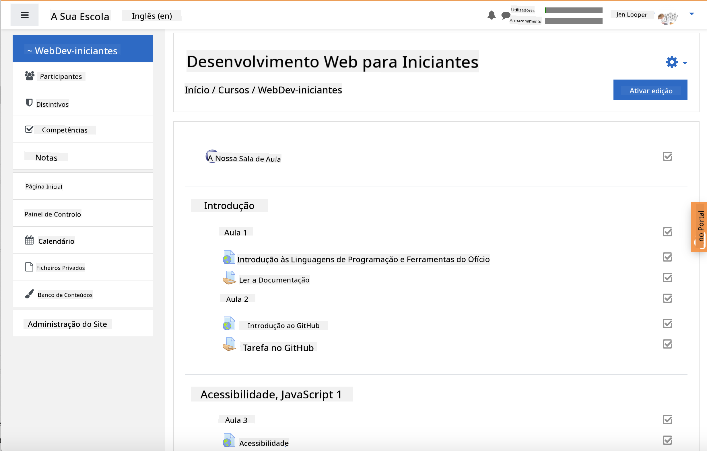

<!--
CO_OP_TRANSLATOR_METADATA:
{
  "original_hash": "71009af209f81cc01a1f2d324200375f",
  "translation_date": "2025-10-03T09:29:30+00:00",
  "source_file": "for-teachers.md",
  "language_code": "pt"
}
-->
### Para Educadores

Sinta-se à vontade para usar este currículo na sua sala de aula. Ele funciona perfeitamente com o GitHub Classroom e as principais plataformas LMS, podendo também ser utilizado como um repositório independente com os seus alunos.

### Utilizar com o GitHub Classroom

Para gerir lições e tarefas por turma, crie um repositório por lição para que o GitHub Classroom possa associar cada tarefa de forma independente.

- Faça um fork deste repositório para a sua organização.
- Crie um repositório separado para cada lição, extraindo cada pasta de lição para o seu próprio repositório.
  - Opção A: Crie repositórios vazios (um por lição) e copie os conteúdos da pasta da lição para cada um.
  - Opção B: Utilize uma abordagem que preserve o histórico do Git (por exemplo, dividir uma pasta num novo repositório) caso precise de manter a proveniência.
- No GitHub Classroom, crie uma tarefa por lição e aponte para o repositório correspondente.
- Configurações recomendadas:
  - Visibilidade do repositório: privado para o trabalho dos alunos.
  - Utilize o código inicial da branch padrão do repositório da lição.
  - Adicione templates de issues e pull requests para questionários e submissões.
  - Opcionalmente, configure autograding e testes se as suas lições os incluírem.
- Convenções úteis:
  - Nomes de repositórios como lesson-01-intro, lesson-02-html, etc.
  - Etiquetas: quiz, assignment, needs-review, late, resubmission.
  - Tags/releases por turma (por exemplo, v2025-term1).

Dica: Evite armazenar repositórios dentro de pastas sincronizadas (por exemplo, OneDrive/Google Drive) para prevenir conflitos do Git no Windows.

### Utilizar com Moodle, Canvas ou Blackboard

Este currículo inclui pacotes importáveis para fluxos de trabalho comuns em LMS.

- Moodle: Utilize o ficheiro de upload do Moodle [Moodle upload file](../../../../../../../teaching-files/webdev-moodle.mbz) para carregar o curso completo.
- Common Cartridge: Utilize o ficheiro Common Cartridge [Common Cartridge file](../../../../../../../teaching-files/webdev-common-cartridge.imscc) para maior compatibilidade com LMS.
- Notas:
  - O Moodle Cloud tem suporte limitado para Common Cartridge. Prefira o ficheiro do Moodle acima, que também pode ser carregado no Canvas.
  - Após a importação, reveja os módulos, datas de entrega e configurações de questionários para ajustar ao calendário do seu período letivo.

> O currículo numa sala de aula Moodle

> O currículo no Canvas

### Utilizar o repositório diretamente (sem Classroom)

Se preferir não utilizar o GitHub Classroom, pode executar o curso diretamente a partir deste repositório.

- Formatos síncronos/online (Zoom/Teams):
  - Realize aquecimentos curtos liderados por mentores; utilize salas de grupo para questionários.
  - Anuncie uma janela de tempo para os questionários; os alunos submetem respostas como Issues no GitHub.
  - Para tarefas colaborativas, os alunos trabalham em repositórios públicos das lições e abrem pull requests.
- Formatos privados/assíncronos:
  - Os alunos fazem fork de cada lição para os seus próprios repositórios **privados** e adicionam-no como colaborador.
  - Submetem via Issues (questionários) e Pull Requests (tarefas) no seu repositório de sala de aula ou nos seus forks privados.

### Melhores práticas

- Ofereça uma lição de orientação sobre os fundamentos do Git/GitHub, Issues e PRs.
- Utilize checklists em Issues para questionários/tarefas com vários passos.
- Adicione CONTRIBUTING.md e CODE_OF_CONDUCT.md para definir normas na sala de aula.
- Inclua notas de acessibilidade (texto alternativo, legendas) e ofereça PDFs imprimíveis.
- Versione o seu conteúdo por período letivo e congele os repositórios das lições após a publicação.

### Feedback e suporte

Queremos que este currículo funcione para si e para os seus alunos. Por favor, abra uma nova Issue neste repositório para reportar erros, fazer pedidos ou sugerir melhorias, ou inicie uma discussão no Teacher Corner.

---

**Aviso Legal**:  
Este documento foi traduzido utilizando o serviço de tradução por IA [Co-op Translator](https://github.com/Azure/co-op-translator). Embora nos esforcemos para garantir a precisão, esteja ciente de que traduções automáticas podem conter erros ou imprecisões. O documento original na sua língua nativa deve ser considerado a fonte autoritária. Para informações críticas, recomenda-se uma tradução profissional realizada por humanos. Não nos responsabilizamos por quaisquer mal-entendidos ou interpretações incorretas resultantes do uso desta tradução.