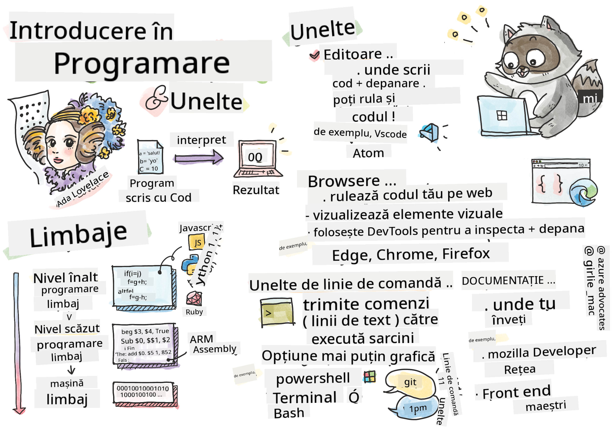

<!--
CO_OP_TRANSLATOR_METADATA:
{
  "original_hash": "c63675cfaf1d223b37bb9fecbfe7c252",
  "translation_date": "2025-08-28T08:24:06+00:00",
  "source_file": "1-getting-started-lessons/1-intro-to-programming-languages/README.md",
  "language_code": "ro"
}
-->
# Introducere în Limbaje de Programare și Instrumente Esențiale

Această lecție acoperă elementele de bază ale limbajelor de programare. Subiectele discutate aici se aplică majorității limbajelor de programare moderne. În secțiunea „Instrumente Esențiale”, vei învăța despre software util care te ajută ca dezvoltator.


> Sketchnote de [Tomomi Imura](https://twitter.com/girlie_mac)

## Chestionar Pre-Lecție
[Chestionar pre-lecție](https://forms.office.com/r/dru4TE0U9n?origin=lprLink)

## Introducere

În această lecție, vom acoperi:

- Ce este programarea?
- Tipuri de limbaje de programare
- Elemente de bază ale unui program
- Software și instrumente utile pentru dezvoltatorii profesioniști

> Poți parcurge această lecție pe [Microsoft Learn](https://docs.microsoft.com/learn/modules/web-development-101/introduction-programming/?WT.mc_id=academic-77807-sagibbon)!

## Ce este Programarea?

Programarea (cunoscută și sub numele de codare) este procesul de scriere a instrucțiunilor pentru un dispozitiv, cum ar fi un computer sau un dispozitiv mobil. Scriem aceste instrucțiuni folosind un limbaj de programare, care este apoi interpretat de dispozitiv. Aceste seturi de instrucțiuni pot fi denumite în diverse moduri, dar *program*, *program de computer*, *aplicație (app)* și *executabil* sunt câteva denumiri populare.

Un *program* poate fi orice este scris cu cod; site-uri web, jocuri și aplicații pentru telefon sunt programe. Deși este posibil să creezi un program fără a scrie cod, logica de bază este interpretată de dispozitiv, iar acea logică a fost cel mai probabil scrisă cu cod. Un program care *rulează* sau *execută* cod îndeplinește instrucțiuni. Dispozitivul pe care citești această lecție rulează un program pentru a o afișa pe ecran.

✅ Fă puțină cercetare: cine este considerat primul programator de computer din lume?

## Limbaje de Programare

Limbajele de programare permit dezvoltatorilor să scrie instrucțiuni pentru un dispozitiv. Dispozitivele pot înțelege doar binar (1 și 0), iar pentru *majoritatea* dezvoltatorilor aceasta nu este o modalitate eficientă de comunicare. Limbajele de programare sunt vehiculul de comunicare între oameni și computere.

Limbajele de programare vin în diferite formate și pot servi scopuri diferite. De exemplu, JavaScript este utilizat în principal pentru aplicații web, în timp ce Bash este utilizat în principal pentru sisteme de operare.

*Limbajele de nivel scăzut* necesită, de obicei, mai puțini pași decât *limbajele de nivel înalt* pentru ca un dispozitiv să interpreteze instrucțiunile. Totuși, ceea ce face limbajele de nivel înalt populare este lizibilitatea și suportul lor. JavaScript este considerat un limbaj de nivel înalt.

Următorul cod ilustrează diferența dintre un limbaj de nivel înalt, cum ar fi JavaScript, și un limbaj de nivel scăzut, cum ar fi codul de asamblare ARM.

```javascript
let number = 10
let n1 = 0, n2 = 1, nextTerm;

for (let i = 1; i <= number; i++) {
    console.log(n1);
    nextTerm = n1 + n2;
    n1 = n2;
    n2 = nextTerm;
}
```

```c
 area ascen,code,readonly
 entry
 code32
 adr r0,thumb+1
 bx r0
 code16
thumb
 mov r0,#00
 sub r0,r0,#01
 mov r1,#01
 mov r4,#10
 ldr r2,=0x40000000
back add r0,r1
 str r0,[r2]
 add r2,#04
 mov r3,r0
 mov r0,r1
 mov r1,r3
 sub r4,#01
 cmp r4,#00
 bne back
 end
```

Crezi sau nu, *ambele fac același lucru*: afișează o secvență Fibonacci până la 10.

✅ O secvență Fibonacci este [definită](https://en.wikipedia.org/wiki/Fibonacci_number) ca un set de numere în care fiecare număr este suma celor două precedente, începând de la 0 și 1. Primele 10 numere din secvența Fibonacci sunt 0, 1, 1, 2, 3, 5, 8, 13, 21 și 34.

## Elemente ale unui Program

O singură instrucțiune într-un program se numește *declarație* și, de obicei, are un caracter sau un spațiu care marchează unde se termină instrucțiunea, sau *se termină*. Modul în care o instrucțiune se termină variază în funcție de limbaj.

Declarațiile dintr-un program pot depinde de date furnizate de un utilizator sau din altă parte pentru a îndeplini instrucțiuni. Datele pot schimba modul în care un program se comportă, astfel încât limbajele de programare vin cu o modalitate de a stoca temporar datele pentru a fi utilizate mai târziu. Acestea se numesc *variabile*. Variabilele sunt declarații care instruiesc un dispozitiv să salveze datele în memoria sa. Variabilele din programe sunt similare cu variabilele din algebră, unde au un nume unic și valoarea lor poate varia în timp.

Există șansa ca unele declarații să nu fie executate de un dispozitiv. Acest lucru se întâmplă, de obicei, intenționat, atunci când sunt scrise de dezvoltator, sau accidental, când apare o eroare neașteptată. Acest tip de control asupra unei aplicații o face mai robustă și mai ușor de întreținut. De obicei, aceste schimbări de control au loc atunci când anumite condiții sunt îndeplinite. O declarație comună utilizată în programarea modernă pentru a controla modul în care un program rulează este declarația `if..else`.

✅ Vei învăța mai multe despre acest tip de declarație în lecțiile următoare.

## Instrumente Esențiale

[](https://youtube.com/watch?v=69WJeXGBdxg "Tools of the Trade")

> 🎥 Fă clic pe imaginea de mai sus pentru un videoclip despre instrumente

În această secțiune, vei învăța despre câteva software-uri pe care le vei găsi foarte utile pe măsură ce începi călătoria ta ca dezvoltator profesionist.

Un **mediu de dezvoltare** este un set unic de instrumente și funcții pe care un dezvoltator le folosește frecvent atunci când scrie software. Unele dintre aceste instrumente au fost personalizate pentru nevoile specifice ale unui dezvoltator și pot evolua în timp dacă acel dezvoltator își schimbă prioritățile în muncă, proiecte personale sau când folosește un alt limbaj de programare. Mediile de dezvoltare sunt la fel de unice ca dezvoltatorii care le folosesc.

### Editoare

Unul dintre cele mai importante instrumente pentru dezvoltarea software este editorul. Editoarele sunt locul unde scrii codul și, uneori, unde îl rulezi.

Dezvoltatorii se bazează pe editoare din câteva motive suplimentare:

- *Debugging* ajută la descoperirea bug-urilor și erorilor prin parcurgerea codului, linie cu linie. Unele editoare au capacități de debugging; acestea pot fi personalizate și adăugate pentru limbaje de programare specifice.
- *Syntax highlighting* adaugă culori și formatare textului codului, făcându-l mai ușor de citit. Majoritatea editorilor permit personalizarea syntax highlighting.
- *Extensii și Integrări* sunt instrumente specializate pentru dezvoltatori, create de dezvoltatori. Aceste instrumente nu au fost incluse în editorul de bază. De exemplu, mulți dezvoltatori își documentează codul pentru a explica cum funcționează. Ei pot instala o extensie de verificare ortografică pentru a găsi greșeli în documentație. Majoritatea extensiilor sunt destinate utilizării într-un editor specific, iar majoritatea editorilor vin cu o modalitate de a căuta extensii disponibile.
- *Personalizare* permite dezvoltatorilor să creeze un mediu de dezvoltare unic pentru nevoile lor. Majoritatea editorilor sunt extrem de personalizabili și pot permite dezvoltatorilor să creeze extensii personalizate.

#### Editoare Populare și Extensii pentru Dezvoltare Web

- [Visual Studio Code](https://code.visualstudio.com/?WT.mc_id=academic-77807-sagibbon)
  - [Code Spell Checker](https://marketplace.visualstudio.com/items?itemName=streetsidesoftware.code-spell-checker)
  - [Live Share](https://marketplace.visualstudio.com/items?itemName=MS-vsliveshare.vsliveshare)
  - [Prettier - Code formatter](https://marketplace.visualstudio.com/items?itemName=esbenp.prettier-vscode)
- [Atom](https://atom.io/)
  - [spell-check](https://atom.io/packages/spell-check)
  - [teletype](https://atom.io/packages/teletype)
  - [atom-beautify](https://atom.io/packages/atom-beautify)
  
- [Sublimetext](https://www.sublimetext.com/)
  - [emmet](https://emmet.io/)
  - [SublimeLinter](http://www.sublimelinter.com/en/stable/)

### Browsere

Un alt instrument crucial este browserul. Dezvoltatorii web se bazează pe browser pentru a vedea cum rulează codul lor pe web. Este, de asemenea, utilizat pentru a afișa elementele vizuale ale unei pagini web scrise în editor, cum ar fi HTML.

Multe browsere vin cu *instrumente pentru dezvoltatori* (DevTools) care conțin un set de funcții utile și informații pentru a ajuta dezvoltatorii să colecteze și să capteze informații importante despre aplicația lor. De exemplu: Dacă o pagină web are erori, este uneori util să știi când au apărut. DevTools dintr-un browser pot fi configurate pentru a capta aceste informații.

#### Browsere Populare și DevTools

- [Edge](https://docs.microsoft.com/microsoft-edge/devtools-guide-chromium/?WT.mc_id=academic-77807-sagibbon)
- [Chrome](https://developers.google.com/web/tools/chrome-devtools/)
- [Firefox](https://developer.mozilla.org/docs/Tools)

### Instrumente de Linie de Comandă

Unii dezvoltatori preferă o vizualizare mai puțin grafică pentru sarcinile lor zilnice și se bazează pe linia de comandă pentru a realiza acest lucru. Scrierea codului necesită o cantitate semnificativă de tastare, iar unii dezvoltatori preferă să nu își întrerupă fluxul pe tastatură. Ei vor folosi scurtături de tastatură pentru a comuta între ferestrele desktop, a lucra la diferite fișiere și a utiliza instrumente. Majoritatea sarcinilor pot fi realizate cu un mouse, dar un beneficiu al utilizării liniei de comandă este că multe pot fi realizate cu instrumente de linie de comandă fără a fi nevoie să comuți între mouse și tastatură. Un alt beneficiu al liniei de comandă este că aceasta poate fi configurată și poți salva o configurație personalizată, o poți schimba mai târziu și o poți importa pe alte mașini de dezvoltare. Deoarece mediile de dezvoltare sunt atât de unice pentru fiecare dezvoltator, unii vor evita utilizarea liniei de comandă, alții se vor baza complet pe ea, iar unii preferă un mix între cele două.

### Opțiuni Populare pentru Linia de Comandă

Opțiunile pentru linia de comandă vor diferi în funcție de sistemul de operare pe care îl folosești.

*💻 = vine preinstalat pe sistemul de operare.*

#### Windows

- [Powershell](https://docs.microsoft.com/powershell/scripting/overview?view=powershell-7/?WT.mc_id=academic-77807-sagibbon) 💻
- [Command Line](https://docs.microsoft.com/windows-server/administration/windows-commands/windows-commands/?WT.mc_id=academic-77807-sagibbon) (cunoscut și sub numele de CMD) 💻
- [Windows Terminal](https://docs.microsoft.com/windows/terminal/?WT.mc_id=academic-77807-sagibbon)
- [mintty](https://mintty.github.io/)
  
#### MacOS

- [Terminal](https://support.apple.com/guide/terminal/open-or-quit-terminal-apd5265185d-f365-44cb-8b09-71a064a42125/mac) 💻
- [iTerm](https://iterm2.com/)
- [Powershell](https://docs.microsoft.com/powershell/scripting/install/installing-powershell-core-on-macos?view=powershell-7/?WT.mc_id=academic-77807-sagibbon)

#### Linux

- [Bash](https://www.gnu.org/software/bash/manual/html_node/index.html) 💻
- [KDE Konsole](https://docs.kde.org/trunk5/en/konsole/konsole/index.html)
- [Powershell](https://docs.microsoft.com/powershell/scripting/install/installing-powershell-core-on-linux?view=powershell-7/?WT.mc_id=academic-77807-sagibbon)

#### Instrumente Populare de Linie de Comandă

- [Git](https://git-scm.com/) (💻 pe majoritatea sistemelor de operare)
- [NPM](https://www.npmjs.com/)
- [Yarn](https://classic.yarnpkg.com/en/docs/cli/)

### Documentație

Când un dezvoltator dorește să învețe ceva nou, cel mai probabil va apela la documentație pentru a învăța cum să o folosească. Dezvoltatorii se bazează adesea pe documentație pentru a-i ghida în utilizarea corectă a instrumentelor și limbajelor și pentru a dobândi cunoștințe mai profunde despre cum funcționează.

#### Documentație Populară despre Dezvoltarea Web

- [Mozilla Developer Network (MDN)](https://developer.mozilla.org/docs/Web), de la Mozilla, editorii browserului [Firefox](https://www.mozilla.org/firefox/)
- [Frontend Masters](https://frontendmasters.com/learn/)
- [Web.dev](https://web.dev), de la Google, editorii browserului [Chrome](https://www.google.com/chrome/)
- [Documentația pentru dezvoltatori Microsoft](https://docs.microsoft.com/microsoft-edge/#microsoft-edge-for-developers), pentru [Microsoft Edge](https://www.microsoft.com/edge)
- [W3 Schools](https://www.w3schools.com/where_to_start.asp)

✅ Fă puțină cercetare: Acum că știi elementele de bază ale mediului unui dezvoltator web, compară și contrastează-l cu mediul unui designer web.

---

## 🚀 Provocare

Compară câteva limbaje de programare. Care sunt unele dintre trăsăturile unice ale JavaScript față de Java? Dar COBOL față de Go?

## Chestionar Post-Lecție
[Chestionar post-lecție](https://ff-quizzes.netlify.app/web/quiz/2)

## Recapitulare și Studiu Individual

Studiază puțin despre diferitele limbaje disponibile pentru programatori. Încearcă să scrii o linie într-un limbaj și apoi să o rescrii în alte două. Ce ai învățat?

## Temă

[Citirea Documentației](assignment.md)

---

**Declinarea responsabilității**:  
Acest document a fost tradus folosind serviciul de traducere AI [Co-op Translator](https://github.com/Azure/co-op-translator). Deși ne străduim să asigurăm acuratețea, vă rugăm să rețineți că traducerile automate pot conține erori sau inexactități. Documentul original în limba sa natală ar trebui considerat sursa autoritară. Pentru informații critice, se recomandă traducerea profesională realizată de un specialist uman. Nu ne asumăm răspunderea pentru eventualele neînțelegeri sau interpretări greșite care pot apărea din utilizarea acestei traduceri.