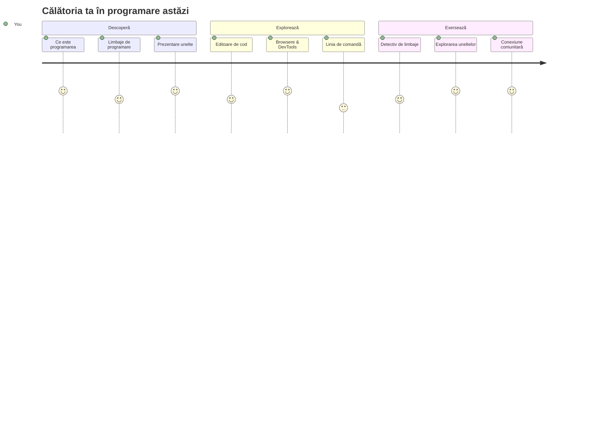
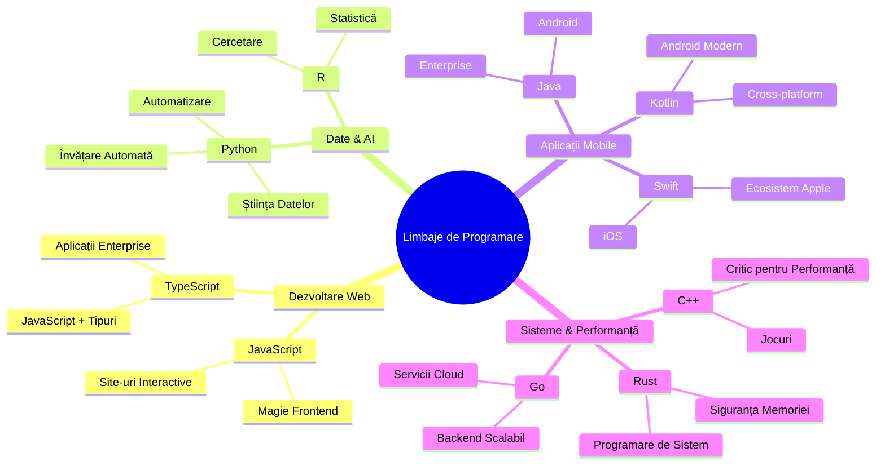
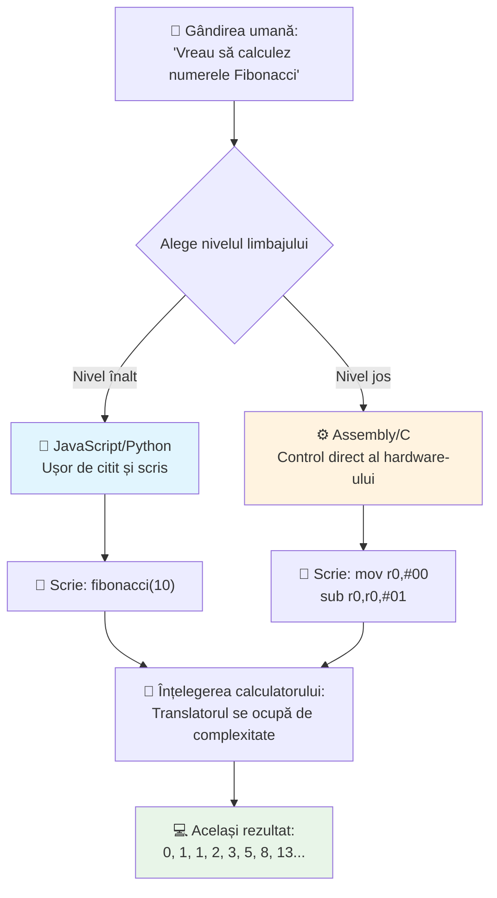
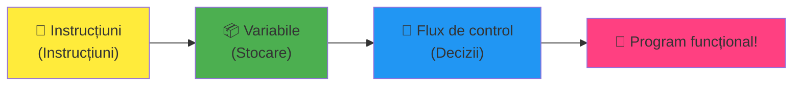
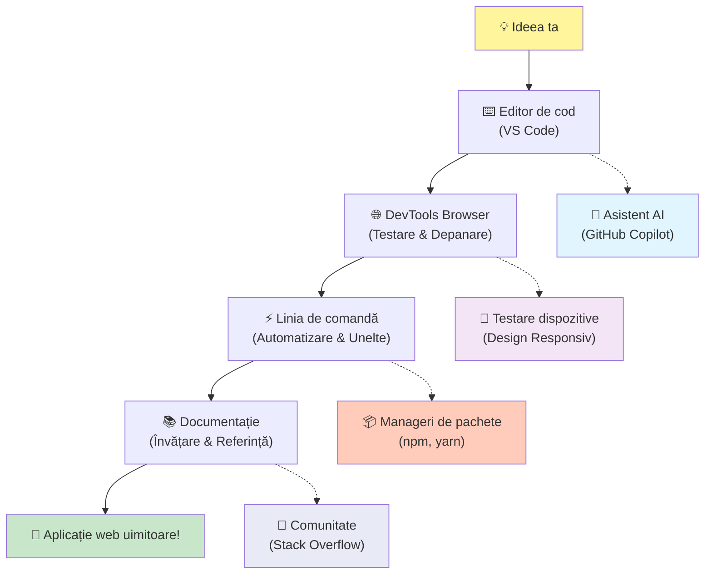
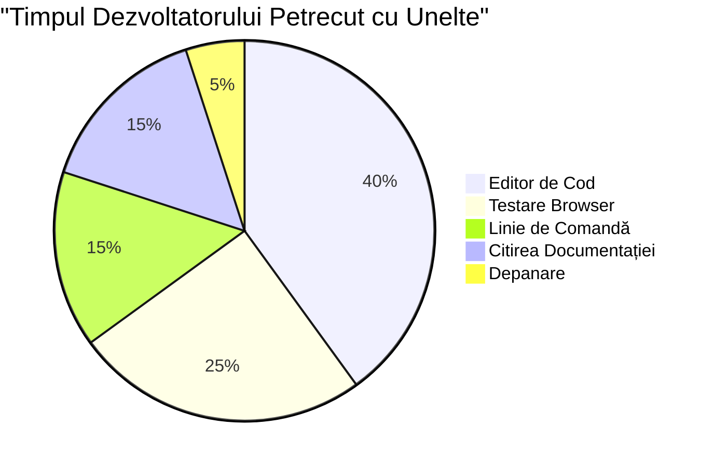
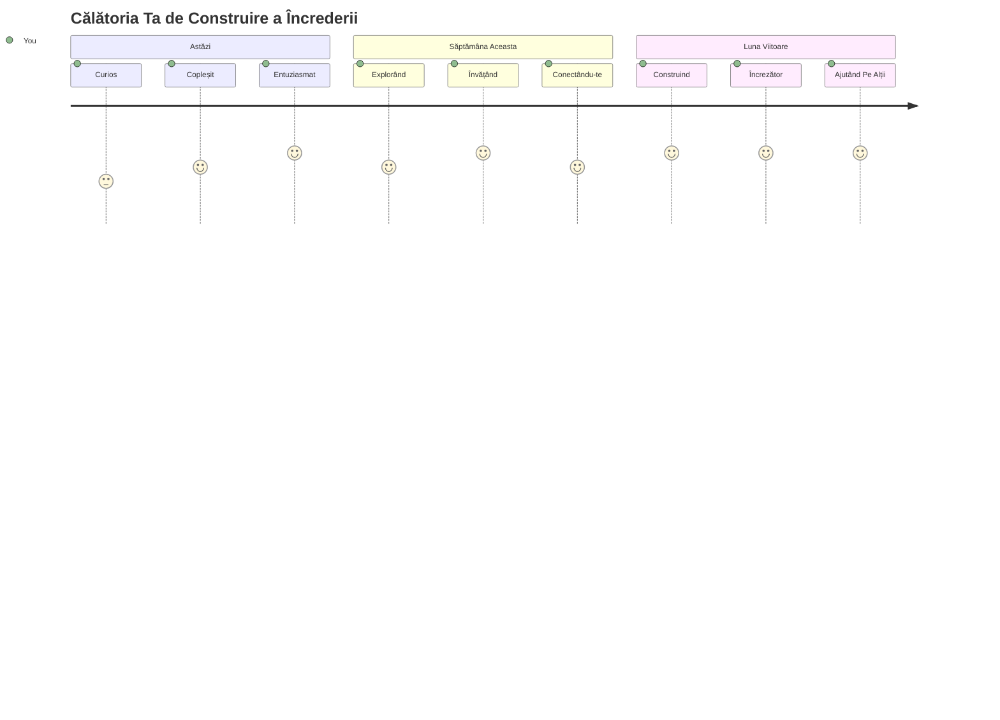

<!--
CO_OP_TRANSLATOR_METADATA:
{
  "original_hash": "d45ddcc54eb9232a76d08328b09d792e",
  "translation_date": "2026-01-07T06:18:32+00:00",
  "source_file": "1-getting-started-lessons/1-intro-to-programming-languages/README.md",
  "language_code": "ro"
}
-->
# Introducere în Limbaje de Programare și Unelte Moderne pentru Dezvoltatori

Salut, viitorule dezvoltator! 👋 Pot să-ți spun ceva care încă îmi dă fiori în fiecare zi? Ești pe cale să descoperi că programarea nu este doar despre calculatoare – este despre a avea puteri reale ca să aduci la viață cele mai sălbatice idei ale tale!

Știi momentul acela când folosești aplicația ta preferată și totul funcționează perfect? Când apeși un buton și se întâmplă ceva absolut magic care te face să spui „wow, cum au FĂCUT asta?” Ei bine, cineva chiar ca tine – probabil stând în cafeneaua lui preferată la 2 dimineața cu al treilea espresso – a scris codul care a creat acea magie. Și iată ce o să-ți dea pe spate: până la finalul acestei lecții, nu doar că vei înțelege cum au făcut asta, dar vei fi nerăbdător să încerci și tu!

Uite, înțeleg perfect dacă programarea pare intimidantă acum. Când am început eu, sincer am crezut că trebuie să fii vreun geniu la matematică sau să codezi de când aveai cinci ani. Dar iată ce mi-a schimbat complet perspectiva: programarea este exact ca învățarea de a purta conversații într-o limbă nouă. Începi cu „bună” și „mulțumesc”, apoi treci la a comanda cafea și înainte să-ți dai seama, ai discuții filozofice adânci! Doar că în acest caz, porți conversații cu calculatoarele și, sincer? Sunt cei mai răbdători parteneri de conversație – nu judecă greșelile tale și sunt mereu entuziasmați să încerce din nou!

Astăzi, vom explora uneltele incredibile care fac dezvoltarea web modernă nu doar posibilă, ci și foarte captivantă. Vorbesc despre exact aceiași editori, browsere și workflow-uri pe care le folosesc zilnic dezvoltatorii de la Netflix, Spotify și studioul tău indie preferat de aplicații. Și iată partea care te va face să dansezi de bucurie: majoritatea acestor unelte profesionale, standard în industrie, sunt complet gratuite!


> Sketchnote de [Tomomi Imura](https://twitter.com/girlie_mac)


## Hai să Vedem Ce Știi Deja!

Înainte să trecem la partea distractivă, sunt curios – ce știi deja despre lumea asta a programării? Și ascultă, dacă te uiți la aceste întrebări gândind „nu am absolut niciun habar despre nimic din toate acestea,” nu doar că e în regulă, e perfect! Înseamnă că ești în locul potrivit. Gândește-te la acest quiz ca la o încălzire înainte de antrenament – doar ne pregătim mușchii creierului!

[Participă la quiz-ul pre-lecție](https://forms.office.com/r/dru4TE0U9n?origin=lprLink)


## Aventura pe care Urmează să o Parcurgem Împreună

Ok, sunt cu adevărat entuziasmat de ceea ce vom explora azi! Serios, aș vrea să văd fața ta când unele dintre aceste concepte îți vor face clic. Iată călătoria incredibilă pe care o vom face împreună:

- **Ce este cu adevărat programarea (și de ce e cel mai tare lucru din lume!)** – Vom descoperi cum codul este literalmente magia invizibilă care alimentează tot ce te înconjoară, de la alarma care știe că e luni dimineața până la algoritmul care-ți recomandă perfect seriale pe Netflix
- **Limbajele de programare și personalitățile lor uimitoare** – Imaginează-ți că intri la o petrecere unde fiecare persoană are puteri speciale diferite și moduri unice de a rezolva probleme. Așa este lumea limbajelor de programare, și îți va plăcea să le cunoști!
- **Elementele fundamentale care fac să se întâmple magia digitală** – Consideră-le ca pe setul suprem de LEGO creativ. Odată ce înțelegi cum se potrivesc aceste piese, vei realiza că poți construi practic orice îți imaginezi
- **Unelte profesionale care te vor face să simți că ți s-a dat o baghetă de vrăjitor** – Nu exagerez aici – aceste unelte îți vor da cu adevărat senzația că ai superputeri, și partea cea mai bună? Sunt aceleași unelte pe care le folosesc profesioniștii!

> 💡 **Iată chestia**: Nu încerca nici măcar să memorezi totul astăzi! Acum vreau doar să simți scânteia de entuziasm despre ceea ce este posibil. Detaliile se vor fixa natural pe măsură ce practicăm împreună – așa se întâmplă învățarea reală!

> Poți parcurge această lecție pe [Microsoft Learn](https://docs.microsoft.com/learn/modules/web-development-101/introduction-programming/?WT.mc_id=academic-77807-sagibbon)!

## Deci Ce Este Exact *Programarea*?

Bine, să abordăm întrebarea de un milion de dolari: ce este programarea, cu adevărat?

Îți voi spune o poveste care mi-a schimbat complet modul de a gândi. Săptămâna trecută, încercam să-i explic mamei mele cum să folosească noua telecomandă smart pentru televizor. M-am prins vorbind așa: „Apasă butonul roșu, dar nu butonul mare roșu, butonul mic roșu din stânga... nu, cealaltă stânga... ok, acum ține apăsat două secunde, nu una, nici trei...” Sună cunoscut? 😅

Asta este programarea! Este arta de a da instrucțiuni extrem de detaliate, pas cu pas, către ceva foarte puternic, dar care are nevoie să îi spui totul exact și clar. Doar că, în loc să-i explici mamei (care poate întreabă „care buton roșu?!”), îi explici unui calculator (care face exact ce-i spui, chiar dacă ceea ce ai spus nu e tocmai ce ai vrut).

Ce m-a uimit când am învățat asta prima dată: calculatoarele sunt de fapt destul de simple la bază. Ele înțeleg literalmente doar două lucruri – 1 și 0, ceea ce înseamnă practic „da” și „nu” sau „pornit” și „oprit.” Atât! Dar aici intervine magia – nu trebuie să vorbim în 1 și 0 ca în filmul Matrix. Aici vin în ajutor **limbajele de programare**. Ele sunt ca cei mai buni traducători din lume care iau gândurile tale perfect normale și le convertesc în limbajul calculatoarelor.

Și iată ce încă îmi dă fiori în fiecare dimineață când mă trezesc: practic *tot* ce există digital în viața ta a pornit de la cineva ca tine, probabil stând în pijamale cu o ceașcă de cafea, tastând cod pe laptop. Filtrul Instagram care te face să arăți perfect? Cineva a creat acel cod. Recomandarea care te-a dus la melodia ta preferată? Un dezvoltator a construit acel algoritm. Aplicația care te ajută să împarți nota de cină cu prietenii? Da, cineva s-a gândit „asta e enervant, sigur pot să rezolv asta” și apoi... a făcut-o!

Când înveți să programezi, nu doar că înveți o nouă abilitate – devii parte din această comunitate incredibilă de rezolvatori de probleme care își petrec zilele gândindu-se „Ce-ar fi dacă aș putea construi ceva care să-i facă ziua cuiva puțin mai bună?” Sincer, există ceva mai tare de atât?

✅ **Vânătoare de Fapte Amuzante**: Iată ceva super interesant de căutat când ai un moment liber – cine crezi că a fost primul programator din lume? Îți dau un indiciu: nu este cine te-ai aștepta! Povestea din spatele acestei persoane este absolut fascinantă și arată că programarea a fost întotdeauna despre gândire creativă și rezolvare de probleme în mod inedit.

### 🧠 **Moment de Reflectare: Cum Te Simți?**

**Ia-ți un moment să reflectezi:**
- Îți face acum sens ideea de „a da instrucțiuni calculatoarelor”?
- Poți să te gândești la o sarcină zilnică pe care ai vrea să o automatizezi prin programare?
- Ce întrebări îți vin în minte despre toată treaba asta cu programarea?

> **Amintește-ți**: Este complet normal dacă unele concepte par confuze acum. Învățarea programării este ca învățarea unei limbi noi – creierul tău are nevoie de timp să-și construiască acele căi neuronale. Ești grozav!

## Limbajele de Programare Sunt ca Diferite Arome de Magie

Ok, asta poate suna ciudat, dar rămâi cu mine – limbajele de programare sunt foarte asemănătoare cu diferite tipuri de muzică. Gândește-te: ai jazz, care este lin și improvizat, rock care este puternic și direct, clasică care este elegantă și structurată și hip-hop care este creativ și expresiv. Fiecare stil are propria vibrație, propria comunitate de fani pasionați și fiecare este perfect pentru stări și ocazii diferite.

Limbajele de programare funcționează la fel! Nu ai folosi același limbaj pentru a crea un joc mobil distractiv pe care l-ai folosi pentru a procesa cantități uriașe de date climatice, la fel cum nu ai da death metal la o clasă de yoga (bine, în cele mai multe clase de yoga oricum! 😄).

Dar iată ce mă uimește de fiecare dată când mă gândesc la asta: aceste limbaje sunt ca un interpret extrem de răbdător și de genial din lume stând chiar lângă tine. Poți exprima ideile într-un mod care pare natural pentru creierul tău uman, iar ele fac toată treaba incredibil de complexă de a traduce asta în 1 și 0, limbajul pe care calculatoarele îl înțeleg. E ca și cum ai avea un prieten perfect fluent atât în „creativitatea umană” cât și în „logica calculatoarelor” – și care nu se obosește niciodată, nu are nevoie de pauze de cafea și nu te judecă niciodată dacă întrebi același lucru de două ori!

### Limbaje de Programare Populare și Utilizările Lor


| Limbaj | Cel Mai Potrivit Pentru | De Ce Este Popular |
|--------|-------------------------|-------------------|
| **JavaScript** | Dezvoltare web, interfețe utilizator | Rulează în browsere și alimentează site-uri interactive |
| **Python** | Știința datelor, automatizare, AI | Ușor de citit și învățat, biblioteci puternice |
| **Java** | Aplicații enterprise, aplicații Android | Independent de platformă, robust pentru sisteme mari |
| **C#** | Aplicații Windows, dezvoltare jocuri | Suport puternic din ecosistemul Microsoft |
| **Go** | Servicii cloud, sisteme backend | Rapid, simplu, proiectat pentru calcul modern |

### Limbaje de Nivel Înalt vs. Nivel Jos

Ok, acesta a fost sincer conceptul care mi-a frânt creierul când am început să învăț, așa că o să-ți împărtășesc analogia care în final m-a făcut să înțeleg – și sper să te ajute și pe tine!

Imaginează-ți că vizitezi o țară unde nu vorbești limba și ai mare nevoie să găsești cea mai apropiată toaletă (am trecut cu toții prin asta, nu? 😅):

- **Programarea la nivel jos** este ca și cum ai învăța dialectul local atât de bine încât poți sta de vorbă cu bunica care vinde fructe pe colț, folosind referințe culturale, argou local și glume pe care le înțelege doar cine a crescut acolo. Super impresionant și incredibil de eficient... dacă ești fluent! Dar destul de copleșitor când încerci doar să găsești o toaletă.

- **Programarea la nivel înalt** este ca și cum ai avea un prieten local minunat care te înțelege. Poți spune „Am mare nevoie să găsesc o toaletă” în engleză simplă, iar el se ocupă de toată traducerea culturală și îți dă indicații într-un mod care are sens perfect pentru creierul tău ne-local.

În termeni de programare:
- **Limbajele de nivel jos** (ca Assembly sau C) îți permit să ai conversații extrem de detaliate cu hardware-ul calculatorului, dar trebuie să gândești ca o mașină, ceea ce este... ei bine, să spunem că este o schimbare mentală mare!
- **Limbajele de nivel înalt** (ca JavaScript, Python sau C#) îți permit să gândești ca un om în timp ce ele se ocupă de tot limbajul mașinii pe fundal. Plus că au comunități incredibil de primitoare pline de oameni care își amintesc cum e să fii începător și vor sincer să te ajute!

Ghici cu ce limbaje îți sugerez să începi? 😉 Limbajele de nivel înalt sunt ca niște roți de antrenament pe care nu vrei să le dai jos niciodată pentru că fac toată experiența mult mai plăcută!


### Lasă-mă să-ți Arăt De Ce Limbajele de Nivel Înalt Sunt Atât de Prietenoase

Ok, urmează să-ți arăt ceva care demonstrează perfect de ce m-am îndrăgostit de limbajele de nivel înalt, dar mai întâi – vreau să-mi promiți ceva. Când vezi primul exemplu de cod, nu te panica! Este făcut să arate intimidant. Exact asta vreau să-ți arăt!

Vom vedea aceeași sarcină scrisă în două stiluri complet diferite. Ambele creează ceea ce se numește secvența Fibonacci – este un model matematic frumos unde fiecare număr este suma celor două precedente: 0, 1, 1, 2, 3, 5, 8, 13... (Fapt amuzant: vei găsi acest model literalmente peste tot în natură – spiralele semințelor de floarea-soarelui, modelele de con de pin, chiar și modul în care se formează galaxii!)

Gata să vezi diferența? Hai să începem!

**Limbaj de nivel înalt (JavaScript) – Prietenos pentru oameni:**

```javascript
// Pasul 1: Configurarea de bază Fibonacci
const fibonacciCount = 10;
let current = 0;
let next = 1;

console.log('Fibonacci sequence:');
```

**Iată ce face acest cod:**
- **Declară** o constantă pentru a specifica câte numere Fibonacci vrem să generăm
- **Inițializează** două variabile pentru a urmări numărul curent și următorul din secvență
- **Setează** valorile de început (0 și 1) care definesc tiparul Fibonacci
- **Afișează** un mesaj de titlu pentru a identifica rezultatul

```javascript
// Pasul 2: Generează secvența cu un ciclu
for (let i = 0; i < fibonacciCount; i++) {
  console.log(`Position ${i + 1}: ${current}`);
  
  // Calculează următorul număr din secvență
  const sum = current + next;
  current = next;
  next = sum;
}
```

**Descompunem ce se întâmplă aici:**
- **Parcurge** fiecare poziție din secvența noastră folosind un `for` loop
- **Afișează** fiecare număr cu poziția sa folosind formatul template literal
- **Calculează** următorul număr Fibonacci adunând valorile curente și următoare
- **Actualizează** variabilele de urmărire pentru a avansa la următoarea iterare

```javascript
// Pasul 3: Abordare funcțională modernă
const generateFibonacci = (count) => {
  const sequence = [0, 1];
  
  for (let i = 2; i < count; i++) {
    sequence[i] = sequence[i - 1] + sequence[i - 2];
  }
  
  return sequence;
};

// Exemplu de utilizare
const fibSequence = generateFibonacci(10);
console.log(fibSequence);
```

**În exemplul de mai sus am:**
- **Creat** o funcție reutilizabilă folosind sintaxa modernă de funcție săgeată
- **Construim** un array pentru a stoca întreaga secvență în loc să afișăm element cu element
- **Folosim** indexarea în array pentru a calcula fiecare număr nou din valorile precedente
- **Returnăm** secvența completă pentru a o putea folosi flexibil în alte părți ale programului

**Limbaj de nivel jos (ARM Assembly) – Prietenos pentru computer:**

```assembly
 area ascen,code,readonly
 entry
 code32
 adr r0,thumb+1
 bx r0
 code16
thumb
 mov r0,#00
 sub r0,r0,#01
 mov r1,#01
 mov r4,#10
 ldr r2,=0x40000000
back add r0,r1
 str r0,[r2]
 add r2,#04
 mov r3,r0
 mov r0,r1
 mov r1,r3
 sub r4,#01
 cmp r4,#00
 bne back
 end
```

Observă cum versiunea în JavaScript se citește aproape ca niște instrucțiuni în engleză, în timp ce versiunea Assembly folosește comenzi criptice care controlează direct procesorul calculatorului. Ambele realizează exact aceeași sarcină, dar limbajul de nivel înalt este mult mai ușor pentru oameni să-l înțeleagă, scrie și întrețină.

**Diferențele cheie pe care le vei observa:**
- **Lizibilitate**: JavaScript folosește nume descriptive precum `fibonacciCount` în timp ce Assembly folosește etichete criptice precum `r0`, `r1`
- **Comentarii**: Limbajele de nivel înalt încurajează comentariile explicative care fac codul să fie auto-documentat  
- **Structură**: Fluxul logic al JavaScript se potrivește cu modul în care oamenii gândesc problemele pas cu pas  
- **Mentenanță**: Actualizarea versiunii JavaScript pentru cerințe diferite este simplă și clară  

✅ **Despre secvența Fibonacci**: Această secvență absolut superbă de numere (unde fiecare număr este egal cu suma celor doi precedenți: 0, 1, 1, 2, 3, 5, 8...) apare literalmente *peste tot* în natură! O vei găsi în spiralele florilor de floarea-soarelui, în modelele conurilor de pin, în felul în care cochiliile de nautilus se curbează și chiar în modul în care cresc ramurile copacilor. Este uimitor cum matematica și codul ne pot ajuta să înțelegem și să recreăm modelele pe care natura le folosește pentru a crea frumusețe!

## Blocurile de bază care fac magia să se întâmple

Bine, acum că ai văzut cum arată limbajele de programare în acțiune, haide să descompunem elementele fundamentale care alcătuiesc literalmente orice program vreodată scris. Gândește-te la ele ca la ingredientele esențiale din rețeta ta preferată – odată ce înțelegi ce face fiecare, vei putea citi și scrie cod în aproape orice limbaj!

Este cam ca și cum ai învăța gramatica programării. Îți amintești cum ai învățat la școală despre substantive, verbe și cum să alcătuiești propoziții? Programarea are propria sa versiune de gramatică și, sincer, este mult mai logică și mai permisivă decât gramatica engleză vreodată a fost! 😄

### Instrucțiuni: Pașii de urmat

Să începem cu **instrucțiunile** – acestea sunt ca propoziții individuale într-o conversație cu calculatorul tău. Fiecare instrucțiune îi spune calculatorului să facă un lucru specific, cam ca atunci când dai indicații: „Ia-o la stânga aici,” „Oprește-te la semaforul roșu,” „Parchează în acel loc.”

Ce îmi place la instrucțiuni este cât de ușor de citit sunt de obicei. Uită-te la asta:

```javascript
// Instrucțiuni de bază care efectuează acțiuni unice
const userName = "Alex";                    
console.log("Hello, world!");              
const sum = 5 + 3;                         
```
  
**Iată ce face acest cod:**  
- **Declară** o variabilă constantă pentru a stoca numele unui utilizator  
- **Afișează** un mesaj de salut în consola de ieșire  
- **Calculează** și stochează rezultatul unei operațiuni matematice  

```javascript
// Instrucțiuni care interacționează cu paginile web
document.title = "My Awesome Website";      
document.body.style.backgroundColor = "lightblue";
```
  
**Pas cu pas, iată ce se întâmplă:**  
- **Modifică** titlul paginii web care apare în fila browserului  
- **Schimbă** culoarea de fundal a întregului corp al paginii  

### Variabile: Sistemul de memorie al programului tău

Ok, **variabilele** sunt, sincer, unul dintre conceptele mele preferate de predat pentru că sunt atât de asemănătoare cu lucrurile pe care le folosești deja în fiecare zi!

Gândește-te pentru o clipă la lista de contacte de pe telefonul tău. Nu memorezi numerele de telefon ale tuturor – în schimb, salvezi „Mama,” „Cel mai bun prieten” sau „Pizzerie care livrează până la 2 noaptea” și lași telefonul să țină minte numerele reale. Variabilele funcționează exact așa! Sunt ca niște recipiente etichetate unde programul tău poate stoca informații și le poate accesa mai târziu folosind un nume care chiar are sens.

Ce este cu adevărat grozav: variabilele se pot schimba pe măsură ce programul rulează (de aici vine și numele „variabilă” – vezi ce au făcut acolo?). La fel cum poți actualiza contactul de la pizzerie când descoperi o opțiune mai bună, variabilele pot fi actualizate pe măsură ce programul învață informații noi sau condițiile se schimbă!

Lasă-mă să-ți arăt cât de simplu poate fi acest lucru:

```javascript
// Pasul 1: Crearea variabilelor de bază
const siteName = "Weather Dashboard";        
let currentWeather = "sunny";               
let temperature = 75;                       
let isRaining = false;                      
```
  
**Înțelegerea acestor concepte:**  
- **Stochează** valori neschimbătoare în variabile `const` (ca numele site-ului)  
- **Folosește** `let` pentru valori care se pot schimba pe parcursul programului  
- **Atribuie** diferite tipuri de date: șiruri de caractere (text), numere și booleeni (adevărat/fals)  
- **Alege** nume descriptive care să explice ce conține fiecare variabilă  

```javascript
// Pasul 2: Lucrul cu obiecte pentru a grupa datele aferente
const weatherData = {                       
  location: "San Francisco",
  humidity: 65,
  windSpeed: 12
};
```
  
**În exemplul de mai sus, am:**  
- **Creat** un obiect pentru a grupa împreună informații legate de vreme  
- **Organizat** mai multe bucăți de date sub un singur nume de variabilă  
- **Folosit** perechi cheie-valoare pentru a eticheta clar fiecare informație  

```javascript
// Pasul 3: Utilizarea și actualizarea variabilelor
console.log(`${siteName}: Today is ${currentWeather} and ${temperature}°F`);
console.log(`Wind speed: ${weatherData.windSpeed} mph`);

// Actualizarea variabilelor care se pot schimba
currentWeather = "cloudy";                  
temperature = 68;                          
```
  
**Să înțelegem fiecare parte:**  
- **Afișează** informații folosind șabloane literale cu sintaxa `${}`  
- **Accesează** proprietățile obiectului folosind notația cu punct (`weatherData.windSpeed`)  
- **Actualizează** variabile declarate cu `let` pentru a reflecta condițiile în schimbare  
- **Combină** mai multe variabile pentru a crea mesaje cu sens  

```javascript
// Pasul 4: Destructurarea modernă pentru un cod mai curat
const { location, humidity } = weatherData; 
console.log(`${location} humidity: ${humidity}%`);
```
  
**Ce trebuie să știi:**  
- **Extrage** proprietăți specifice din obiecte folosind atribuirea prin destructurare  
- **Creează** variabile noi automat cu aceleași nume ca și cheile obiectului  
- **Simplifică** codul evitând utilizarea repetitivă a notației cu punct  

### Flux de control: Învățarea programului tău să gândească

Ok, aici programarea devine cu adevărat uimitoare! **Fluxul de control** înseamnă practic să înveți programul să ia decizii inteligente, la fel cum faci tu în fiecare zi fără să te gândești.

Imaginează-ți: în această dimineață probabil ai gândit ceva de genul „Dacă plouă, iau umbrelă. Dacă e frig, port o geacă. Dacă întârzii, sar peste micul dejun și iau cafea pe drum.” Creierul tău aplică logică condițională „dacă – atunci” de zeci de ori pe zi!

Acesta este motivul pentru care programele par inteligente și vii, în loc să urmeze doar un scenariu plictisitor și previzibil. Ele pot de fapt să privească o situație, să evalueze ce se întâmplă și să răspundă corespunzător. Este ca și cum ai da programului tău un creier care poate să se adapteze și să ia decizii!

Vrei să vezi cât de frumos funcționează? Lasă-mă să-ți arăt:

```javascript
// Pasul 1: Logica condițională de bază
const userAge = 17;

if (userAge >= 18) {
  console.log("You can vote!");
} else {
  const yearsToWait = 18 - userAge;
  console.log(`You'll be able to vote in ${yearsToWait} year(s).`);
}
```
  
**Iată ce face acest cod:**  
- **Verifică** dacă vârsta utilizatorului îndeplinește cerința pentru vot  
- **Execută** blocuri diferite de cod în funcție de rezultat  
- **Calculează** și afișează cât timp mai este până la eligibilitatea pentru vot dacă are sub 18 ani  
- **Oferă** feedback specific și util pentru fiecare scenariu  

```javascript
// Pasul 2: Condiții multiple cu operatori logici
const userAge = 17;
const hasPermission = true;

if (userAge >= 18 && hasPermission) {
  console.log("Access granted: You can enter the venue.");
} else if (userAge >= 16) {
  console.log("You need parent permission to enter.");
} else {
  console.log("Sorry, you must be at least 16 years old.");
}
```
  
**Să descompunem ce se întâmplă aici:**  
- **Combină** mai multe condiții folosind operatorul `&&` (și)  
- **Creează** o ierarhie de condiții folosind `else if` pentru mai multe scenarii  
- **Gestionează** toate cazurile posibile cu o ultimă instrucțiune `else`  
- **Oferă** feedback clar și acționabil pentru fiecare situație diferită  

```javascript
// Pasul 3: Condițional concis cu operator ternar
const votingStatus = userAge >= 18 ? "Can vote" : "Cannot vote yet";
console.log(`Status: ${votingStatus}`);
```
  
**Ce trebuie să ții minte:**  
- **Folosește** operatorul ternar (`? :`) pentru condiții simple cu două opțiuni  
- **Scrie** întâi condiția, urmată de `?`, apoi rezultatul adevărat, apoi `:`, apoi rezultatul fals  
- **Aplică** acest model când vrei să atribui valori pe baza condițiilor  

```javascript
// Pasul 4: Gestionarea mai multor cazuri specifice
const dayOfWeek = "Tuesday";

switch (dayOfWeek) {
  case "Monday":
  case "Tuesday":
  case "Wednesday":
  case "Thursday":
  case "Friday":
    console.log("It's a weekday - time to work!");
    break;
  case "Saturday":
  case "Sunday":
    console.log("It's the weekend - time to relax!");
    break;
  default:
    console.log("Invalid day of the week");
}
```
  
**Acest cod realizează următoarele:**  
- **Potrivește** valoarea variabilei cu mai multe cazuri specifice  
- **Grupează** cazurile similare împreună (zile lucrătoare vs. weekend)  
- **Execută** blocul de cod corespunzător când găsește o potrivire  
- **Include** un caz `default` pentru a gestiona valori neașteptate  
- **Folosește** instrucțiuni `break` pentru a preveni continuarea codului către următorul caz  

> 💡 **Analogie din viața reală**: Gândește-te la fluxul de control ca la cel mai răbdător GPS din lume care îți dă indicații. Ar putea spune „Dacă este trafic pe strada Principală, ia autostrada. Dacă construcția blochează autostrada, încearcă ruta scenică.” Programele folosesc exact același tip de logică condițională pentru a răspunde inteligent situațiilor diferite și pentru a oferi utilizatorilor cea mai bună experiență posibilă.

### 🎯 **Verificare de concept: Stăpânirea blocurilor de bază**

**Să vedem cum te descurci cu elementele fundamentale:**  
- Poți explica diferența dintre o variabilă și o instrucțiune în cuvintele tale?  
- Gândește-te la un scenariu din viața reală unde ai utiliza o decizie if-then (cum e exemplul nostru cu votul)  
- Care este un lucru despre logica programării care te-a surprins?  

**Un mic impuls de încredere:**  

✅ **Ce urmează:** Vom avea un adevărat moment de distracție aprofundând aceste concepte pe măsură ce continuăm această călătorie incredibilă împreună! Acum, concentrează-te să simți entuziasmul față de toate posibilitățile uimitoare care te așteaptă. Abilitățile și tehnicile specifice se vor fixa natural pe măsură ce exersăm împreună – promit că va fi mult mai distractiv decât te aștepți!

## Uneltele meseriei

Bine, aici chiar mă entuziasmez foarte tare, aproape că nu mă pot stăpâni! 🚀 Suntem pe punctul de a vorbi despre instrumentele incredibile care o să te facă să simți că tocmai ți s-au dat cheile unei nave spațiale digitale.

Știi cum un chef are acele cuțite perfect echilibrate care par o extensie a mâinilor lui? Sau cum un muzician are acea chitară care pare că începe să cânte încă de când o atinge? Ei bine, dezvoltatorii au propria lor versiune a acestor unelte magice, și iată ce o să te uimească total – majoritatea sunt complet gratuite!

Practic salt pe scaun de bucurie gândindu-mă să le împărtășesc cu tine pentru că au revoluționat complet modul în care construim software. Vorbim despre asistenți de codare alimentați de AI care te pot ajuta să scrii cod (serios!), medii în cloud în care poți construi aplicații întregi de oriunde ai Wi-Fi, și unelte de depanare atât de sofisticate încât par că au vedere cu raze X pentru programele tale.

Și partea care încă îmi dă fiori: acestea nu sunt „unelte pentru începători” pe care le vei depăși. Sunt aceleași unelte profesionale pe care dezvoltatorii de la Google, Netflix și studioul indie de aplicații pe care îl iubești le folosesc chiar în acest moment. O să te simți ca un profesionist folosindu-le!


### Editoare de cod și IDE-uri: Noii tăi cei mai buni prieteni digitali

Hai să vorbim despre editarea codului – acestea urmează să devină locurile tale preferate unde petreci timpul! Gândește-te la ele ca la sanctuarul tău personal de codare unde vei petrece majoritatea timpului creând și perfecționând creațiile tale digitale.

Dar iată ce este absolut magic la editările moderne: nu sunt doar editoare de text sofisticate. Sunt ca și cum ai avea cel mai strălucit și mai susținător mentor în codare stând lângă tine 24/7. Corectează greșelile tale înainte să le observi, sugerează îmbunătățiri care te fac să pari un geniu, te ajută să înțelegi ce face fiecare bucată de cod, iar unele pot chiar să prezică ce urmează să scrii și să ofere să îți termine gândurile!

Îmi amintesc când am descoperit prima oară completarea automată – chiar am simțit că trăiesc în viitor. Începi să tastezi ceva, iar editorul zice „Hei, te gândeai la această funcție care face exact ce ai nevoie?” Este ca și cum ai avea un cititor de gânduri ca și coleg de codare!

**Ce face aceste editoare atât de incredibile?**

Editoarele moderne oferă o gamă impresionantă de caracteristici proiectate să-ți sporească productivitatea:

| Caracteristică        | Ce face                         | De ce ajută                           |
|----------------------|--------------------------------|-------------------------------------|
| **Evidențiere sintaxă** | Colorează diferite părți din cod | Face codul mai ușor de citit și de găsit erori |
| **Completare automată**  | Sugerează cod pe măsură ce tastezi | Accelerează scrierea codului și reduce greșelile de tastare |
| **Unelte de depanare**    | Te ajută să găsești și să repari erori | Economisește ore întregi de depanare |
| **Extensii**             | Adaugă funcții specializate    | Personalizează editorul pentru orice tehnologie |
| **Asistenți AI**         | Sugerează cod și explicații    | Accelerează învățarea și productivitatea |

> 🎥 **Resursă video**: Vrei să vezi aceste unelte în acțiune? Aruncă o privire la acest [video Tools of the Trade](https://youtube.com/watch?v=69WJeXGBdxg) pentru o prezentare cuprinzătoare.

#### Editoare recomandate pentru dezvoltare web

**[Visual Studio Code](https://code.visualstudio.com/?WT.mc_id=academic-77807-sagibbon)** (Gratuit)  
- Cel mai popular printre dezvoltatorii web  
- Ecosistem excelent de extensii  
- Terminal integrat și integrare Git  
- **Extensii esențiale**:  
  - [GitHub Copilot](https://marketplace.visualstudio.com/items?itemName=GitHub.copilot) - Sugestii de cod alimentate de AI  
  - [Live Share](https://marketplace.visualstudio.com/items?itemName=MS-vsliveshare.vsliveshare) - Colaborare în timp real  
  - [Prettier](https://marketplace.visualstudio.com/items?itemName=esbenp.prettier-vscode) - Formatare automată a codului  
  - [Code Spell Checker](https://marketplace.visualstudio.com/items?itemName=streetsidesoftware.code-spell-checker) - Detectează greșeli de scriere în cod  

**[JetBrains WebStorm](https://www.jetbrains.com/webstorm/)** (Plătit, gratuit pentru studenți)  
- Unelte avansate de depanare și testare  
- Completare inteligentă a codului  
- Control al versiunilor integrat  

**IDE-uri bazate pe cloud** (Diferite prețuri)  
- [GitHub Codespaces](https://github.com/features/codespaces) - VS Code complet în browserul tău  
- [Replit](https://replit.com/) - Grozav pentru învățare și partajare de cod  
- [StackBlitz](https://stackblitz.com/) - Dezvoltare web full-stack instant  

> 💡 **Sfat pentru început**: Începe cu Visual Studio Code – este gratuit, folosit pe scară largă în industrie și are o comunitate enormă care creează tutoriale și extensii utile.

### Browsere web: Laboratorul tău secret de dezvoltare

Ok, pregătește-te să fii uimit total! Știi cum ai folosit browserele ca să navighezi pe rețele sociale și să te uiți la videoclipuri? Ei bine, se pare că au ascuns tot acest timp un laborator incredibil de dezvoltare, doar așteptând să îl descoperi!

De fiecare dată când faci clic dreapta pe o pagină web și selectezi „Inspect Element,” deschizi o lume ascunsă de unelte pentru dezvoltatori care sunt sincer mai puternice decât unele programe costisitoare la care eu plăteam sute de dolari. Este ca și cum ai descoperi că bucătăria ta veche și obișnuită ascunde un laborator profesional de bucătar în spatele unui panou secret!
Prima dată când cineva mi-a arătat DevTools din browser, am petrecut vreo trei ore doar făcând clic pe diverse chestii și spunând „STAI, ȘI ASTA POATE FACE?!” Poți literalmente edita orice site web în timp real, să vezi exact cât de repede se încarcă totul, să testezi cum arată site-ul tău pe diferite dispozitive și chiar să depanezi JavaScript ca un profesionist adevărat. E absolut uluitor!

**Iată de ce browserele sunt arma ta secretă:**

Când creezi un site web sau o aplicație web, trebuie să vezi cum arată și cum se comportă în lumea reală. Browserele nu doar afișează munca ta, ci oferă și feedback detaliat despre performanță, accesibilitate și posibile probleme.

#### Unelte pentru dezvoltatori în browser (DevTools)

Browserele moderne includ suite complete de dezvoltare:

| Categoria uneltei | Ce face | Exemplu de utilizare |
|-------------------|---------|---------------------|
| **Inspector de elemente** | Vizualizează și editează HTML/CSS în timp real | Ajustează stilurile pentru a vedea rezultatele imediat |
| **Consolă** | Vizualizează mesaje de eroare și testează JavaScript | Depanează probleme și experimentează cu codul |
| **Monitor de rețea** | Urmărește încărcarea resurselor | Optimizează performanța și timpii de încărcare |
| **Verificator de accesibilitate** | Testează designul incluziv | Asigură-te că site-ul funcționează pentru toți utilizatorii |
| **Simulator de dispozitive** | Previzionează pe diferite dimensiuni de ecran | Testează designul responsiv fără multiple dispozitive |

#### Browsere recomandate pentru dezvoltare

- **[Chrome](https://developers.google.com/web/tools/chrome-devtools/)** - DevTools standard în industrie cu documentație extensivă  
- **[Firefox](https://developer.mozilla.org/docs/Tools)** - Instrumente excelente pentru CSS Grid și accesibilitate  
- **[Edge](https://docs.microsoft.com/microsoft-edge/devtools-guide-chromium/?WT.mc_id=academic-77807-sagibbon)** - Bazat pe Chromium cu resurse de la Microsoft pentru dezvoltatori  

> ⚠️ **Sfat important pentru testare**: Testează-ți întotdeauna site-urile în mai multe browsere! Ce funcționează perfect în Chrome poate arăta diferit în Safari sau Firefox. Dezvoltatorii profesioniști testează pe toate browserele majore pentru a asigura experiențe consistente utilizatorilor.

### Unelte de linie de comandă: Poarta ta către superputeri de dezvoltator

Bine, să fim complet sinceri aici despre linia de comandă, pentru că vreau să auzi asta de la cineva care chiar înțelege. Când am văzut-o prima dată – doar un ecran negru înspăimântător cu text clipind – am gândit literalmente: „Nu, nici vorbă! Arată ca ceva dintr-un film cu hackeri din anii 80, și cu siguranță nu sunt destul de deștept pentru asta!” 😅

Dar iată ce mi-aș fi dorit să mi se spună atunci și îți spun ție acum: linia de comandă nu e înfricoșătoare – e, de fapt, ca o conversație directă cu calculatorul tău. Gândește-te la diferența dintre a comanda mâncare printr-o aplicație fancy cu poze și meniuri (care e drăguță și ușoară) versus a intra în restaurantul tău local preferat unde bucătarul știe exact ce-ți place și poate face ceva perfect doar pentru că spui „surprinde-mă cu ceva uimitor.”

Linia de comandă este locul unde dezvoltatorii se simt ca niște vrăjitori absoluți. Tastezi câteva cuvinte care par magice (okay, sunt doar comenzi, dar se simt magice!), apeși enter și BOOM – ai creat structuri întregi de proiecte, ai instalat unelte puternice din toată lumea sau ți-ai lansat aplicația pe internet ca milioane de oameni să o vadă. Odată ce simți puterea asta, e sincer destul de captivant!

**De ce linia de comandă va deveni unealta ta preferată:**

Deși interfețele grafice sunt grozave pentru multe sarcini, linia de comandă excelează la automatizare, precizie și viteză. Multe unelte de dezvoltare funcționează în primul rând prin interfețe de linie de comandă, iar învățarea lor eficientă îți poate îmbunătăți dramatic productivitatea.

```bash
# Pasul 1: Creează și navighează către directorul proiectului
mkdir my-awesome-website
cd my-awesome-website
```

**Ce face acest cod:**
- **Creează** un nou director numit "my-awesome-website" pentru proiectul tău  
- **Intra** în directorul nou creat ca să începi să lucrezi  

```bash
# Pasul 2: Inițializează proiectul cu package.json
npm init -y

# Instalează unelte moderne de dezvoltare
npm install --save-dev vite prettier eslint
npm install --save-dev @eslint/js
```

**Pas cu pas, ce se întâmplă aici:**
- **Inițializează** un proiect Node.js nou cu setările implicite folosind `npm init -y`  
- **Instalează** Vite ca o unealtă modernă de build pentru dezvoltare rapidă și build-uri de producție  
- **Adaugă** Prettier pentru formatare automată a codului și ESLint pentru verificări de calitate a codului  
- **Folosește** flag-ul `--save-dev` pentru a marca aceste dependențe doar pentru dezvoltare  

```bash
# Pasul 3: Creează structura proiectului și fișierele
mkdir src assets
echo '<!DOCTYPE html><html><head><title>My Site</title></head><body><h1>Hello World</h1></body></html>' > index.html

# Pornește serverul de dezvoltare
npx vite
```

**Mai sus am:**
- **Organizat** proiectul creând foldere separate pentru cod sursă și resurse  
- **Generat** un fișier HTML de bază cu structură corectă  
- **Pornit** serverul de dezvoltare Vite pentru reîncărcare live și înlocuire la cald a modulelor  

#### Unelte esențiale de linie de comandă pentru dezvoltare web

| Unealtă | Scop | De ce ai nevoie de ea |
|---------|------|-----------------------|
| **[Git](https://git-scm.com/)** | Controlul versiunilor | Urmărește modificările, colaborează cu alții, fă backup la munca ta |
| **[Node.js & npm](https://nodejs.org/)** | Runtime JavaScript & gestionare pachete | Rulează JavaScript în afara browserului, instalează unelte moderne de dezvoltare |
| **[Vite](https://vitejs.dev/)** | Unealtă de build & server de dezvoltare | Dezvoltare ultra-rapidă cu înlocuire la cald a modulelor |
| **[ESLint](https://eslint.org/)** | Calitatea codului | Găsește și repară automat probleme în JavaScript-ul tău |
| **[Prettier](https://prettier.io/)** | Formatarea codului | Menține codul tău consistent formatat și ușor de citit |

#### Opțiuni specifice platformei

**Windows:**  
- **[Windows Terminal](https://docs.microsoft.com/windows/terminal/?WT.mc_id=academic-77807-sagibbon)** - Terminal modern, cu multe funcții  
- **[PowerShell](https://docs.microsoft.com/powershell/?WT.mc_id=academic-77807-sagibbon)** 💻 - Mediu puternic de scripting  
- **[Command Prompt](https://docs.microsoft.com/windows-server/administration/windows-commands/?WT.mc_id=academic-77807-sagibbon)** 💻 - Linia de comandă tradițională Windows  

**macOS:**  
- **[Terminal](https://support.apple.com/guide/terminal/)** 💻 - Aplicație terminal încorporată  
- **[iTerm2](https://iterm2.com/)** - Terminal îmbunătățit cu funcții avansate  

**Linux:**  
- **[Bash](https://www.gnu.org/software/bash/)** 💻 - Shell-ul standard Linux  
- **[KDE Konsole](https://docs.kde.org/trunk5/en/konsole/konsole/index.html)** - Emulator de terminal avansat  

> 💻 = Preinstalat în sistemul de operare

> 🎯 **Calea de învățare**: Începe cu comenzi de bază ca `cd` (schimbă director), `ls` sau `dir` (listează fișiere), și `mkdir` (crează folder). Exersează cu comenzi moderne de workflow ca `npm install`, `git status` și `code .` (deschide directorul curent în VS Code). Pe măsură ce te simți mai confortabil, vei învăța natural comenzi mai avansate și tehnici de automatizare.

### Documentația: Mentorul tău disponibil mereu pentru învățare

Ok, lasă-mă să-ți împărtășesc un mic secret care te va face să te simți mult mai bine că ești la început: chiar și cei mai experimentați dezvoltatori petrec o mare parte din timp citind documentația. Și asta nu pentru că nu știu ce fac – este de fapt un semn de înțelepciune!

Gândește-te la documentație ca la accesul la cei mai răbdători, cei mai bine informați profesori din lume, disponibili 24/7. Ești blocat la o problemă la 2 dimineața? Documentația e acolo cu o îmbrățișare virtuală caldă și exact răspunsul de care ai nevoie. Vrei să înveți despre o caracteristică nouă tare despre care toată lumea vorbește? Documentația te acoperă cu exemple pas cu pas. Încerci să înțelegi de ce ceva funcționează așa cum face? Ai ghicit – documentația este gata să explice într-un mod care în sfârșit te lămurește!

Iată ceva care mi-a schimbat complet perspectiva: lumea dezvoltării web se mișcă incredibil de repede, și nimeni (dar chiar nimeni!) nu ține totul în memorie. Am văzut dezvoltatori seniori cu peste 15 ani experiență căutând sintaxa de bază, și știi ce? Nu e rușinos – e inteligent! Nu e despre o memorie perfectă; e despre a ști unde să găsești răspunsuri de încredere rapid și cum să le aplici.

**Aici vine adevărata magie:**

Dezvoltatorii profesioniști petrec o parte semnificativă din timp citind documentația – nu pentru că nu știu ce fac, ci pentru că peisajul dezvoltării web evoluează atât de rapid încât a rămâne la curent cere învățare continuă. Documentația excelentă te ajută să înțelegi nu doar *cum* să folosești ceva, ci și *de ce* și *când* să îl folosești.

#### Resurse esențiale de documentație

**[Mozilla Developer Network (MDN)](https://developer.mozilla.org/docs/Web)**  
- Standardul de aur pentru documentația tehnologiilor web  
- Ghiduri cuprinzătoare pentru HTML, CSS și JavaScript  
- Include informații despre compatibilitatea cu browserele  
- Oferă exemple practice și demo-uri interactive  

**[Web.dev](https://web.dev)** (de Google)  
- Cele mai bune practici moderne pentru dezvoltare web  
- Ghiduri de optimizare a performanței  
- Principii de accesibilitate și design incluziv  
- Studii de caz din proiecte reale  

**[Documentația Microsoft pentru dezvoltatori](https://docs.microsoft.com/microsoft-edge/#microsoft-edge-for-developers)**  
- Resurse pentru dezvoltarea browserului Edge  
- Ghiduri pentru Progressive Web Apps  
- Perspective pentru dezvoltarea cross-platform  

**[Frontend Masters Learning Paths](https://frontendmasters.com/learn/)**  
- Curricula de învățare structurată  
- Cursuri video oferite de experți din industrie  
- Exerciții practice de codare  

> 📚 **Strategie de studiu**: Nu încerca să memorezi documentația – învață în schimb cum să o navighezi eficient. Marchează ca favorite referințele folosite frecvent și exersează folosirea funcțiilor de căutare pentru a găsi rapid informații specifice.

### 🔧 **Verificare a stăpânirii uneltelor: Ce rezonează cu tine?**

**Ia un moment să te gândești:**  
- Care unealtă ești cel mai entuziasmat să o încerci prima? (Nu există răspuns greșit!)  
- Încă simți linia de comandă intimidantă sau ești curios să o explorezi?  
- Îți poți imagina să folosești DevTools din browser pentru a arunca o privire în culisele site-urilor tale favorite?


> **Informație amuzantă**: Majoritatea dezvoltatorilor petrec în jur de 40% din timp în editorul de cod, dar observă cât timp merge pe testare, învățare și rezolvare de probleme. Programarea nu înseamnă doar scris cod – înseamnă crearea de experiențe!

✅ **De gândit**: Iată ceva interesant de analizat – cum crezi că uneltele pentru construirea site-urilor (dezvoltare) ar putea fi diferite față de uneltele pentru design-ul lor (design)? E ca diferența dintre un arhitect care proiectează o casă frumoasă și un constructor care o ridică efectiv. Ambele sunt cruciale, dar au nevoie de truse de unelte diferite! Gândirea asta te va ajuta cu adevărat să vezi imaginea de ansamblu despre cum prind viață site-urile web.

## Provocarea Agentului GitHub Copilot 🚀

Folosește modul Agent pentru a îndeplini următoarea provocare:

**Descriere:** Explorează funcțiile unui editor de cod modern sau IDE și demonstrează cum îți poate îmbunătăți fluxul de lucru ca dezvoltator web.

**Sarcină:** Alege un editor de cod sau IDE (cum ar fi Visual Studio Code, WebStorm sau un IDE bazat pe cloud). Enumeră trei funcții sau extensii care te ajută să scrii, depanezi sau să menții codul mai eficient. Pentru fiecare, oferă o scurtă explicație despre cum îți beneficiează fluxul de lucru.

---

## 🚀 Provocare

**Bine, detectivule, gata pentru primul tău caz?**

Acum că ai această bază grozavă, am o aventură care te va ajuta să vezi cât de incredibil de diversă și fascinantă este cu adevărat lumea programării. Și ascultă – nu e vorba încă de scris cod, deci fără presiune! Gândește-te la tine ca la un detectiv de limbaje de programare în primul tău caz palpitant!

**Misiunea ta, dacă accepți:**
1. **Devino explorator de limbaje**: Alege trei limbaje de programare din universuri complet diferite – poate unul care construiește site-uri, unul care creează aplicații mobile și unul care face calcule pentru oameni de știință. Găsește exemple cu aceeași sarcină simplă scrisă în fiecare limbaj. Promit că vei fi absolut uimit cât de diferit pot arăta, făcând exact același lucru!

2. **Descoperă poveștile lor de origine**: Ce face fiecare limbaj special? Iată un fapt interesant – fiecare limbaj de programare a fost creat pentru că cineva s-a gândit: „Știi ce? Trebuie să fie o cale mai bună de a rezolva această problemă specifică.” Poți să descoperi care au fost aceste probleme? Unele dintre povești sunt cu adevărat fascinante!

3. **Cunoaște comunitățile**: Vezi cât de primitoare și pasionată este comunitatea fiecărui limbaj. Unele au milioane de dezvoltatori care împărtășesc cunoștințe și se ajută reciproc, altele sunt mai mici dar incredibil de strânse și supportive. O să-ți placă să vezi diferitele personalități ale acestor comunități!

4. **Ascultă-ți instinctul**: Care limbaj ți se pare cel mai accesibil acum? Nu te stresa că trebuie să faci alegerea „perfectă” – doar ascultă-ți instinctele! Nu există un răspuns greșit aici, și poți oricând să le explorezi pe celelalte mai târziu.

**Bonus de detectiv:** Vezi dacă poți descoperi ce site-uri sau aplicații mari sunt construite cu fiecare limbaj. Îți garantez că vei fi șocat să afli ce alimentează Instagram, Netflix sau jocul mobil pe care nu te poți opri să îl joci!

> 💡 **Amintește-ți**: Nu încerci să devii expert în niciunul dintre aceste limbaje azi. Doar te familiarizezi cu zona înainte să decizi unde vrei să te stabilești. Ia-ți timp, distrează-te și lasă-ți curiozitatea să te ghideze!

## Să sărbătorim ce ai descoperit!

Vai de mine, ai absorbit atât de multe informații incredibile azi! Sunt sincer entuziasmat să văd cât din această călătorie uimitoare a rămas cu tine. Și amintește-ți – asta nu e un test la care trebuie să fii perfect. E mai degrabă o sărbătoare a tuturor lucrurilor grozave pe care le-ai învățat despre această lume fascinantă în care urmează să te avânți!

[Participă la quiz-ul post-lectură](https://ff-quizzes.netlify.app/web/)
## Recenzie & Auto-studiu

**Ia-ți timp să explorezi și să te distrezi cu asta!**

Ai acoperit multe astăzi, și asta e ceva de care să fii mândru! Acum vine partea distractivă – explorarea subiectelor care ți-au stârnit curiozitatea. Amintește-ți, asta nu e teme pentru acasă – e o aventură!

**Aprofundează ceea ce te entuziasmează:**

**Pune mâna pe limbaje de programare:**
- Vizitează site-urile oficiale a 2-3 limbaje care ți-au atras atenția. Fiecare are propria personalitate și poveste!
- Încearcă câteva playground-uri de programare online precum [CodePen](https://codepen.io/), [JSFiddle](https://jsfiddle.net/), sau [Replit](https://replit.com/). Nu te teme să experimentezi – nu poți strica nimic!
- Citește despre cum a apărut limbajul tău preferat. Serios, unele dintre aceste povești de origine sunt fascinante și te vor ajuta să înțelegi de ce limbajele funcționează cum funcționează.

**Familiarizează-te cu noile tale unelte:**
- Descarcă Visual Studio Code dacă nu ai făcut-o deja – este gratuit și o să-ți placă!
- Petrece câteva minute explorând piața de extensii. E ca un magazin de aplicații pentru editorul tău de cod!
- Deschide uneltele pentru dezvoltatori din browserul tău și doar dă click în jur. Nu te îngrijora să înțelegi totul – doar obișnuiește-te cu ceea ce există.

**Alătură-te comunității:**
- Urmărește comunități de dezvoltatori pe [Dev.to](https://dev.to/), [Stack Overflow](https://stackoverflow.com/) sau [GitHub](https://github.com/). Comunitatea programatorilor este incredibil de primitoare cu începătorii!
- Urmărește videoclipuri de programare pentru începători pe YouTube. Sunt atât de mulți creatori grozavi care își amintesc cum e să începi.
- Ia în considerare să participi la întâlniri locale sau comunități online. Crede-mă, dezvoltatorii iubesc să îi ajute pe cei noi!

> 🎯 **Ascultă, iată ce vreau să reții**: Nu te așteaptă nimeni să devii un vrăjitor al codului peste noapte! Acum faci doar primii pași în această lume uimitoare din care urmează să faci parte. Ia-ți timp, bucură-te de călătorie și amintește-ți – fiecare dezvoltator pe care îl admiri a fost odată exact în locul în care ești tu acum, entuziasmat și poate puțin copleșit. E perfect normal și înseamnă că faci bine!


## Tema

[Reading the Docs](assignment.md)

> 💡 **Un mic impuls pentru tema ta**: Mi-ar plăcea foarte mult să te văd explorând unele unelte pe care încă nu le-am acoperit! Sari peste editoare, browsere și unelte de linie de comandă despre care am vorbit deja – există un univers întreg de unelte uimitoare pentru dezvoltare care așteaptă să fie descoperite. Caută unele care sunt menținute activ și au comunități vibrante și ajutătoare (acestea tind să aibă cele mai bune tutoriale și cele mai suportive persoane când te blochezi și ai nevoie de o mână prietenoasă).

---

## 🚀 Cronologia Călătoriei Tale în Programare

### ⚡ **Ce poți face în următoarele 5 minute**
- [ ] Salvează la favorite 2-3 site-uri ale limbajelor de programare care ți-au atras atenția
- [ ] Descarcă Visual Studio Code dacă nu ai făcut-o deja
- [ ] Deschide DevTools în browser (F12) și dă click pe orice site
- [ ] Alătură-te unei comunități de programatori (Dev.to, Reddit r/webdev sau Stack Overflow)

### ⏰ **Ce poți realiza în această oră**
- [ ] Completează quiz-ul post-lecție și reflectează asupra răspunsurilor tale
- [ ] Configurează VS Code cu extensia GitHub Copilot
- [ ] Încearcă un exemplu "Hello World" în 2 limbaje de programare diferite online
- [ ] Urmărește un videoclip „O zi în viața unui dezvoltator” pe YouTube
- [ ] Începe-ți investigația despre limbajul de programare ales (din provocare)

### 📅 **Aventura ta de o săptămână**
- [ ] Completează tema și explorează 3 unelte noi de dezvoltare
- [ ] Urmărește 5 dezvoltatori sau conturi de programare pe rețele sociale
- [ ] Încearcă să construiești ceva mic în CodePen sau Replit (chiar și doar „Hello, [Numele tău]!”)
- [ ] Citește o postare pe un blog de dezvoltare despre călătoria cuiva în programare
- [ ] Participă la un meetup virtual sau urmărește un talk despre programare
- [ ] Începe să înveți limbajul ales cu tutoriale online

### 🗓️ **Transformarea ta de o lună**
- [ ] Construiește primul tău proiect mic (chiar și o pagină web simplă contează!)
- [ ] Contribuie la un proiect open-source (începe cu corecturi de documentație)
- [ ] Fii mentor pentru cineva care abia începe să programeze
- [ ] Creează-ți site-ul de portofoliu de dezvoltator
- [ ] Connectează-te cu comunități locale de dezvoltatori sau grupuri de studiu
- [ ] Începe să planifici următorul tău obiectiv de învățare

### 🎯 **Verificarea reflecției finale**

**Înainte să treci mai departe, ia un moment să sărbătorești:**
- Care este un lucru despre programare care te-a entuziasmat astăzi?
- Ce unealtă sau concept vrei să explorezi prima dată?
- Cum te simți în legătură cu începerea acestei călătorii în programare?
- Ce întrebare ai vrea să pui unui dezvoltator chiar acum?


> 🌟 **Amintește-ți**: Fiecare expert a fost odată începător. Fiecare dezvoltator senior s-a simțit exact ca tine acum – entuziasmat, poate puțin copleșit și cu siguranță curios despre ce este posibil. Ești în companie minunată, iar această călătorie va fi incredibilă. Bine ai venit în minunata lume a programării! 🎉

---

<!-- CO-OP TRANSLATOR DISCLAIMER START -->
**Declinare de responsabilitate**:  
Acest document a fost tradus folosind serviciul de traducere AI [Co-op Translator](https://github.com/Azure/co-op-translator). Deși ne străduim pentru acuratețe, vă rugăm să rețineți că traducerile automate pot conține erori sau inexactități. Documentul original, în limba sa nativă, trebuie considerat sursa autoritară. Pentru informații critice, se recomandă traducerea profesională realizată de un specialist uman. Nu ne asumăm responsabilitatea pentru eventualele neînțelegeri sau interpretări greșite care pot rezulta din utilizarea acestei traduceri.
<!-- CO-OP TRANSLATOR DISCLAIMER END -->