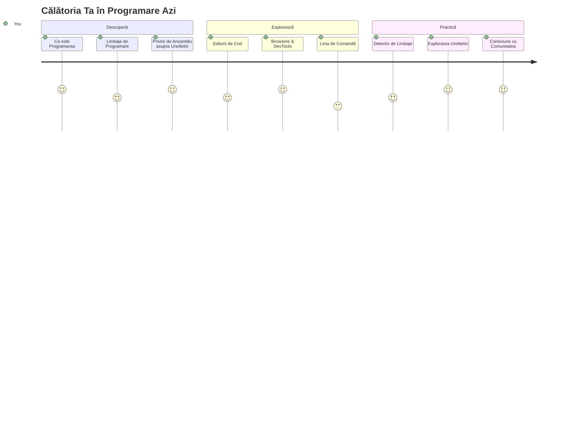
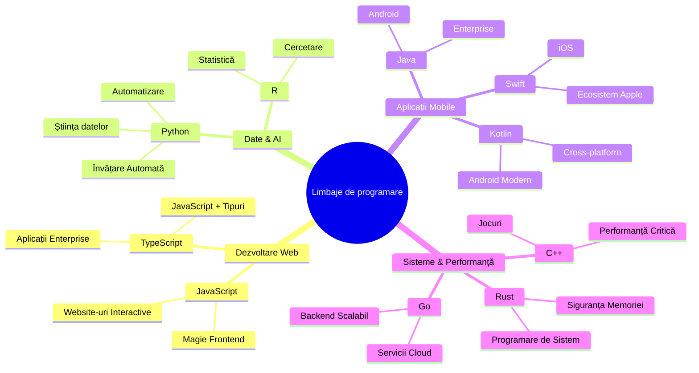
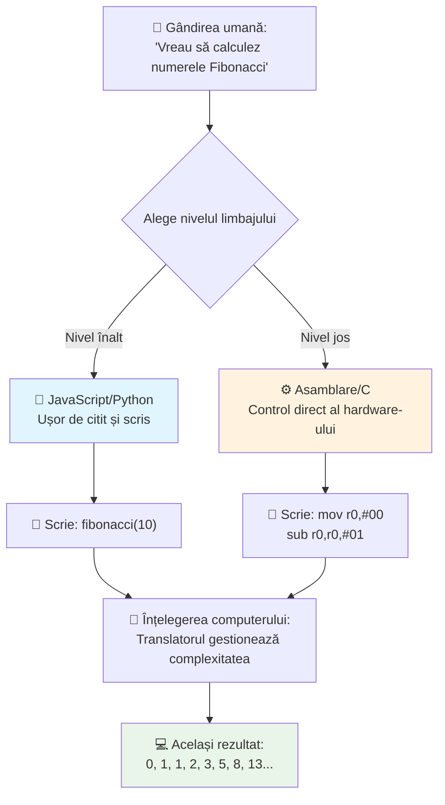
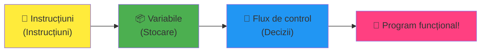
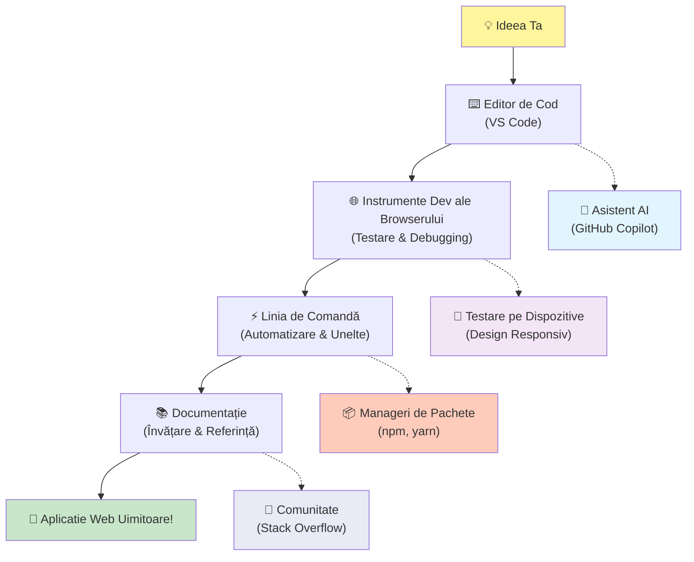
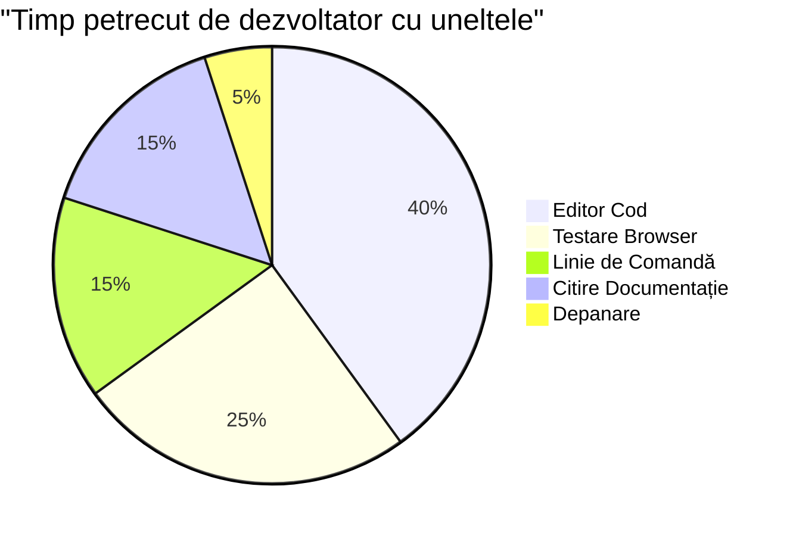
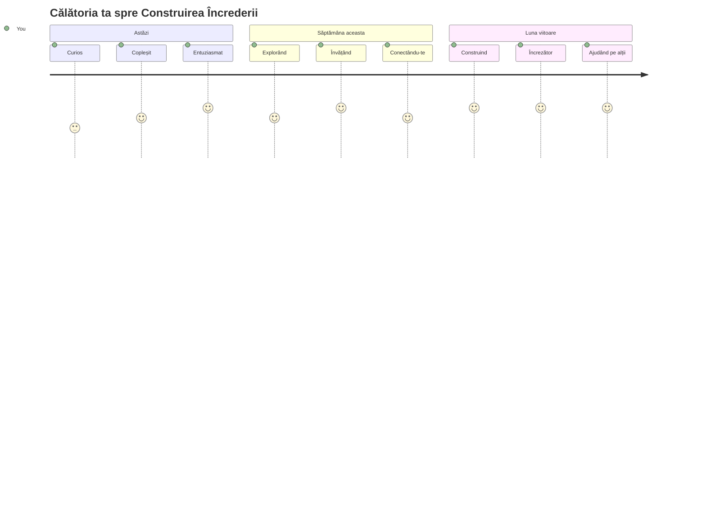

# Introducere în limbajele de programare și instrumentele moderne pentru dezvoltatori
 
Salut, viitor dezvoltator! 👋 Pot să-ți spun ceva care încă îmi provoacă fiori în fiecare zi? Ești pe cale să descoperi că programarea nu este doar despre calculatoare – este despre a avea adevărate superputeri pentru a da viață celor mai nebunești idei ale tale!

Știi momentul acela când folosești aplicația ta preferată și totul se potrivește perfect? Când apeși un buton și se întâmplă ceva absolut magic care te face să spui „wow, cum ORICINE A FĂCUT ASTA?” Ei bine, cineva chiar ca tine – probabil stând în cafeneaua lor preferată la ora 2 dimineața cu al treilea espresso – a scris codul care a creat acea magie. Și iată ce o să te uimească: la finalul acestei lecții, nu doar că vei înțelege cum au făcut asta, dar vei fi nerăbdător să încerci chiar tu!

Uite, înțeleg perfect dacă programarea ți se pare intimidantă acum. Când am început eu, sincer credeam că trebuie să fii un geniu la matematică sau să fi programat de când aveai cinci ani. Dar iată ce mi-a schimbat complet perspectiva: programarea este exact ca învățarea să porți conversații într-o limbă nouă. Începi cu „bună” și „mulțumesc,” apoi ajungi la comandarea unei cafele și, înainte să-ți dai seama, ai discuții profunde filosofice! Doar că în cazul ăsta vorbești cu calculatoarele și, sincer? Sunt cei mai răbdători parteneri de conversație pe care îi vei avea vreodată – nu-ți judecă greșelile și întotdeauna sunt bucuroase să încerce din nou!

Astăzi vom explora instrumentele incredibile care fac dezvoltarea web modernă nu doar posibilă, ci serios captivantă. Vorbesc despre aceiași editori, browsere și fluxuri de lucru pe care dezvoltatorii de la Netflix, Spotify și studioul tău indie favorit le folosesc în fiecare zi. Și iată partea care o să-ți declanșeze dansul fericirii: majoritatea acestor instrumente profesionale, standard în industrie, sunt complet gratuite!


> Sketchnote de [Tomomi Imura](https://twitter.com/girlie_mac)


```mermaid
journey
    title Călătoria Ta în Programare Azi
    section Descoperă
      Ce este Programarea: 5: You
      Limbaje de Programare: 4: You
      Privire de Ansamblu asupra Uneltelor: 5: You
    section Explorează
      Editorii de Cod: 4: You
      Browsere & DevTools: 5: You
      Linia de Comandă: 3: You
    section Practică
      Detectiv de Limbaje: 4: You
      Explorarea Uneltelor: 5: You
      Conexiune cu Comunitatea: 5: You
```
## Hai să vedem ce știi deja!

Înainte să ne aruncăm în lucrurile distractive, sunt curios – ce știi deja despre această lume a programării? Și ascultă, dacă te uiți la aceste întrebări gândind „nu am nici cea mai mică idee despre nimic din toate astea,” nu doar că e în regulă, e perfect! Asta înseamnă că ești în locul exact potrivit. Gândește-te la acest quiz ca la o sesiune de stretching înainte de antrenament – doar încălzim mușchii creierului!

[Fă quiz-ul pre-lectură](https://ff-quizzes.netlify.app/web/)


## Aventura pe care o vom parcurge împreună

Ok, sunt cu adevărat entuziasmat de ceea ce vom explora azi! Serios, mi-aș dori să văd fața ta când unele dintre aceste concepte se vor potrivi perfect. Iată această călătorie incredibilă pe care o facem împreună:

- **Ce este cu adevărat programarea (și de ce e cel mai tare lucru din lume!)** – Vom descoperi cum codul este literalmente magia invizibilă care alimentează tot ce te înconjoară, de la acea alarmă care cumva știe că e luni dimineață până la algoritmul care îți oferă recomandările perfecte pe Netflix
- **Limbajele de programare și personalitățile lor uimitoare** – Imaginează-ți că intri la o petrecere unde fiecare persoană are puteri supranaturale complet diferite și feluri diferite de a rezolva probleme. Așa e lumea limbajelor de programare și o să-ți placă să le cunoști!
- **Blocurile fundamentale care fac magia digitală posibilă** – Gândește-te la ele ca la setul suprem de LEGO creativ. Odată ce înțelegi cum se potrivesc aceste piese, realizezi că poți construi literalmente orice visează imaginația ta
- **Instrumentele profesionale care te vor face să simți că tocmai ți s-a înmânat bagheta unui vrăjitor** – Nu exagerez – aceste instrumente chiar te vor face să simți că ai superputeri, și partea cea mai bună? Sunt aceleași pe care le folosesc profesioniștii!

> 💡 **Uite chestia:** Nu te gândi nici măcar să încerci să memorezi totul azi! Acum, vreau doar să simți acea scânteie de entuziasm față de ce e posibil. Detaliile vor rămâne natural pe măsură ce vom exersa împreună – așa se întâmplă învățarea reală!

> Poți lua această lecție pe [Microsoft Learn](https://learn.microsoft.com/en-us/learn/modules/web-development-101/introduction-programming/?WT.mc_id=academic-77807-sagibbon)!

## Deci ce este *exact* Programarea?

Bine, să abordăm întrebarea de un milion de dolari: ce este programarea cu adevărat?

O să-ți spun o poveste care mi-a schimbat complet modul în care gândesc asta. Săptămâna trecută încercam să explic mamei cum să folosească telecomanda noastră nouă pentru smart TV. M-am surprins spunând lucruri ca „Apasă butonul roșu, dar nu pe butonul mare roșu, pe cel mic roșu din stânga... nu, pe cealaltă stânga... ok, acum ține-l apăsat două secunde, nu una, nu trei...” Ți se pare cunoscut? 😅

Asta e programarea! Este arta de a da instrucțiuni incredibil de detaliate, pas cu pas, către ceva foarte puternic dar care are nevoie să i se explice totul perfect. Doar că în loc să explici mamei (care poate întreba „care buton roșu?!”), îi explici unui calculator (care face exact ce îi spui, chiar dacă ce ai spus nu e chiar ce ai vrut să spui).

Iată ce m-a uimit când am învățat asta prima dată: calculatoarele sunt, de fapt, destul de simple la bază. Ele înțeleg literalmente doar două lucruri – 1 și 0, care în esență sunt „da” și „nu” sau „pornit” și „oprit.” Atât! Dar aici devine magic – nu trebuie să vorbim în 1 și 0 ca în Matrix. Aici vin în ajutor **limbajele de programare**. Sunt ca un traducător genial care îți ia gândurile normale, umane, și le convertește în limbajul computerelor.

Și iată ce încă îmi provoacă fiori adevărați în fiecare dimineață când mă trezesc: literalmente *tot* ceea ce e digital în viața ta a început cu cineva ca tine, probabil în pijamale cu o cană de cafea, tastând cod pe laptop. Filtrul de Instagram care te face să arăți perfect? Cineva l-a programat. Recomandarea care te-a dus la melodia ta preferată? Un dezvoltator a făcut acel algoritm. Aplicația care te ajută să împarți nota la cină cu prietenii? Da, cineva a zis „asta e enervant, pariez că pot să rezolv asta” și apoi... a făcut-o!

Când înveți să programezi, nu înveți doar o abilitate nouă – devii parte dintr-o comunitate incredibilă de rezolvatori de probleme care își petrec zilele gândind „ce-ar fi dacă aș putea construi ceva care face ziua cuiva puțin mai bună?” Sincer, există ceva mai tare de atât?

✅ **Descoperire amuzantă**: Uite ceva super interesant de căutat când ai un moment liber – cine crezi că a fost primul programator din lume? Îți dau un indiciu: s-ar putea să nu fie cine te aștepți! Povestea din spatele acestei persoane este absolut fascinantă și arată că programarea a fost întotdeauna despre creativitate și gândire în afara tiparelor.

### 🧠 **Verificare: Cum te simți?**

**Ia-ți un moment să reflectezi:**
- Are acum sens pentru tine ideea de a „da instrucțiuni calculatoarelor”?
- Te gândești la o activitate zilnică pe care ai vrea să o automatizezi cu programarea?
- Ce întrebări îți vin în minte despre toată această treabă cu programarea?

> **Amintește-ți:** E perfect normal dacă unele concepte par încă neclare acum. Învațarea programării e ca învățarea unei limbi noi – creierul are nevoie de timp să formeze acele căi neuronale. O faci grozav!

## Limbajele de programare sunt ca diferite tipuri de magie

Ok, o să sune ciudat, dar ține-te bine – limbajele de programare sunt foarte asemănătoare cu diferite genuri muzicale. Gândește-te: ai jazz, care e fluid și improvizat, rock, care e puternic și direct, clasică, elegantă și structurată, și hip-hop, creativ și expresiv. Fiecare stil are propria atmosferă, propria comunitate de fani pasionați și fiecare e perfect pentru dispoziții și ocazii diferite.

Limbajele de programare funcționează exact la fel! Nu ai folosi același limbaj ca să construiești un joc distractiv pentru mobil și pentru a analiza cantități uriașe de date climatice, la fel cum nu ai pune death metal la ora de yoga (bine, cel puțin la majoritatea orelor! 😄).

Dar iată ce mă uimește mereu când mă gândesc la asta: aceste limbaje sunt ca și cum ai avea un interpret extrem de răbdător și de inteligent stând chiar lângă tine. Poți exprima ideile în mod natural pentru creierul tău uman și ei preiau toată munca incredibil de complexă de a traduce asta în 1 și 0, limbajul real al calculatorului. E ca și cum ai avea un prieten care stăpânește perfect ambele lumi, „creativitatea umană” și „logica computațională” – și care n-are nevoie niciodată de pauză de cafea și nu te judecă dacă întrebi același lucru de două ori!

### Limbaje populare de programare și utilizările lor


```mermaid
mindmap
  root((Limbaje de programare))
    Dezvoltare Web
      JavaScript
        Magie Frontend
        Website-uri Interactive
      TypeScript
        JavaScript + Tipuri
        Aplicații Enterprise
    Date & AI
      Python
        Știința datelor
        Învățare Automată
        Automatizare
      R
        Statistică
        Cercetare
    Aplicații Mobile
      Java
        Android
        Enterprise
      Swift
        iOS
        Ecosistem Apple
      Kotlin
        Android Modern
        Cross-platform
    Sisteme & Performanță
      C++
        Jocuri
        Performanță Critică
      Rust
        Siguranța Memoriei
        Programare de Sistem
      Go
        Servicii Cloud
        Backend Scalabil
```
| Limbaj | Cea mai bună utilizare | De ce este popular |
|--------|-----------------------|------------------|
| **JavaScript** | Dezvoltare web, interfețe utilizator | Rulează în browsere și alimentează site-uri interactive |
| **Python** | Știința datelor, automatizare, AI | Ușor de citit și învățat, biblioteci puternice |
| **Java** | Aplicații enterprise, aplicații Android | Independență de platformă, robust pentru sisteme mari |
| **C#** | Aplicații Windows, dezvoltare jocuri | Suport puternic în ecosistemul Microsoft |
| **Go** | Servicii cloud, sisteme backend | Rapid, simplu, conceput pentru computație modernă |

### Limbaje de nivel înalt vs. nivel jos

Ok, sincer ăsta a fost conceptul care mi-a „rupt” creierul când am început să învăț, așa că o să-ți împărtășesc analogia care în cele din urmă mi-a făcut click – și sper să te ajute și pe tine!

Imaginează-ți că vizitezi o țară unde nu vorbești limba și ai nevoie disperată să găsești cea mai apropiată toaletă (am trecut toți prin asta, nu? 😅):

- **Programarea la nivel jos** e ca și cum ai învăța dialectul local atât de bine încât poți vorbi cu bunica care vinde fructe în colț folosind referințe culturale, argou local și glume pe care doar cineva născut acolo le înțelege. Super impresionant și incredibil de eficient... dacă vorbești fluent! Dar destul de copleșitor dacă doar încerci să găsești o toaletă.

- **Programarea la nivel înalt** este ca și cum ai avea acel prieten local minunat care te înțelege perfect. Poți spune simplu „Trebuie să găsesc o toaletă” în engleză și el se ocupă de traducerea culturală și îți dă indicații într-un mod care are sens pentru creierul tău non-local.

În termeni de programare:
- **Limbajele de nivel jos** (ca Assembly sau C) îți permit să ai conversații extrem de detaliate cu hardware-ul real al calculatorului, dar trebuie să gândești ca o mașină, ceea ce... ei bine, hai să spunem că e o schimbare mentală uriașă!
- **Limbajele de nivel înalt** (ca JavaScript, Python sau C#) îți permit să gândești ca un om în timp ce ei se ocupă de toată vorbirea mașinii în fundal. Plus, au comunități incredibil de primitoare pline de oameni care își amintesc cum era să fii începător și chiar vor să te ajute!

Ghici ce limbaje o să-ți sugerez să începi? 😉 Limbajele de nivel înalt sunt ca niște roți suplimentare pe bicicletă pe care nu vrei să le dai jos niciodată pentru că fac toată experiența mult mai plăcută!


```mermaid
flowchart TB
    A["👤 Gândirea umană:<br/>'Vreau să calculez numerele Fibonacci'"] --> B{Alege nivelul limbajului}
    
    B -->|Nivel înalt| C["🌟 JavaScript/Python<br/>Ușor de citit și scris"]
    B -->|Nivel jos| D["⚙️ Asamblare/C<br/>Control direct al hardware-ului"]
    
    C --> E["📝 Scrie: fibonacci(10)"]
    D --> F["📝 Scrie: mov r0,#00<br/>sub r0,r0,#01"]
    
    E --> G["🤖 Înțelegerea computerului:<br/>Translatorul gestionează complexitatea"]
    F --> G
    
    G --> H["💻 Același rezultat:<br/>0, 1, 1, 2, 3, 5, 8, 13..."]
    
    style C fill:#e1f5fe
    style D fill:#fff3e0
    style H fill:#e8f5e8
```
### Lasă-mă să-ți arăt de ce limbajele de nivel înalt sunt mult mai prietenoase

Ok, urmează să-ți arăt ceva care demonstrează perfect de ce m-am îndrăgostit de limbajele de nivel înalt, dar mai întâi – am nevoie să-mi promită ceva. Când vezi primul exemplu de cod, nu te panica! E normal să arate intimidant. Exact asta vreau să subliniez!

Vom vedea aceeași sarcină scrisă în două stiluri complet diferite. Ambele creează ceea ce se numește secvența Fibonacci – un model matematic frumos unde fiecare număr este suma celor două anterioare: 0, 1, 1, 2, 3, 5, 8, 13... (Curiozitate: vei găsi acest tipar literalmente peste tot în natură – în spiralele semințelor de floarea soarelui, în modelele conurilor de pin, chiar și în forma galaxiilor!)

Gata să vezi diferența? Hai să începem!

**Limbaj de nivel înalt (JavaScript) – Prietenos cu oamenii:**

```javascript
// Pasul 1: Configurarea de bază Fibonacci
const fibonacciCount = 10;
let current = 0;
let next = 1;

console.log('Fibonacci sequence:');
```

**Iată ce face acest cod:**
- **Declară** o constantă pentru a specifica câți termeni Fibonacci vrem să generăm
- **Inițializează** două variabile pentru a urmări numărul curent și următorul în secvență
- **Setează** valorile de pornire (0 și 1) care definesc modelul Fibonacci
- **Afișează** un mesaj antet pentru a identifica rezultatul

```javascript
// Pasul 2: Generează secvența cu un ciclu
for (let i = 0; i < fibonacciCount; i++) {
  console.log(`Position ${i + 1}: ${current}`);
  
  // Calculează următorul număr din secvență
  const sum = current + next;
  current = next;
  next = sum;
}
```

**Descompunem ce se întâmplă aici:**
- **Parcurge** fiecare poziție în secvență folosind un ciclu `for`
- **Afișează** fiecare număr cu poziția sa folosind formatare template literal
- **Calculează** numărul Fibonacci următor adunând valorile curente și următoare
- **Actualizează** variabilele pentru a trece la următoarea iterație

```javascript
// Pasul 3: Abordare funcțională modernă
const generateFibonacci = (count) => {
  const sequence = [0, 1];
  
  for (let i = 2; i < count; i++) {
    sequence[i] = sequence[i - 1] + sequence[i - 2];
  }
  
  return sequence;
};

// Exemplu de utilizare
const fibSequence = generateFibonacci(10);
console.log(fibSequence);
```

**În exemplul de mai sus am:**
- **Creat** o funcție reutilizabilă folosind sintaxa modernă de săgeată
- **Construim** un array pentru a stoca întreaga secvență, în loc să afișăm unul câte unul
- **Folosim** indexarea vectorului pentru a calcula fiecare număr nou pornind de la cei anteriori
- **Returnăm** secvența completă pentru flexibilitate în alte părți ale programului

**Limbaj de nivel jos (ARM Assembly) – Prietenos cu calculatorul:**

```assembly
 area ascen,code,readonly
 entry
 code32
 adr r0,thumb+1
 bx r0
 code16
thumb
 mov r0,#00
 sub r0,r0,#01
 mov r1,#01
 mov r4,#10
 ldr r2,=0x40000000
back add r0,r1
 str r0,[r2]
 add r2,#04
 mov r3,r0
 mov r0,r1
 mov r1,r3
 sub r4,#01
 cmp r4,#00
 bne back
 end
```

Observi cum versiunea JavaScript se citește aproape ca instrucțiuni în engleză, în timp ce versiunea Assembly folosește comenzi criptice care controlează direct procesorul calculatorului. Ambele realizează aceeași sarcină, dar limbajul de nivel înalt este mult mai ușor de înțeles, scris și întreținut de oameni.

**Diferențele cheie pe care le vei observa:**
- **Claritate**: JavaScript folosește nume descriptive precum `fibonacciCount`, în timp ce Assembly folosește etichete criptice ca `r0`, `r1`
- **Comentarii**: Limbajele de nivel înalt încurajează comentarii explicative care fac codul auto-documentat
- **Structură**: Fluxul logic din JavaScript corespunde modului în care oamenii gândesc problemele pas cu pas
- **Mentenanță**: Actualizarea versiunii JavaScript pentru cerințe diferite este simplă și clară

✅ **Despre șirul Fibonacci**: Acest tipar numeric absolut superb (unde fiecare număr este egal cu suma celor două precedente: 0, 1, 1, 2, 3, 5, 8...) apare literalmente *peste tot* în natură! Îl vei găsi în spiralele florilor de floarea-soarelui, în modelele conurilor de pin, în modul în care se curbează cochiliile nautilus, și chiar în modul în care cresc ramurile copacilor. Este cu adevărat uimitor cum matematica și codul ne pot ajuta să înțelegem și să recreăm tiparele pe care natura le folosește pentru a crea frumusețe!


## Componentele de Bază Care Fac Magia Posibilă

Bine, acum că ai văzut cum arată limbajele de programare în acțiune, să descompunem piesele fundamentale care alcătuiesc literalmente fiecare program scris vreodată. Gândește-le ca ingredientele esențiale din rețeta ta preferată – odată ce înțelegi ce face fiecare, vei putea citi și scrie cod aproape în orice limbaj!

Este cam ca să înveți gramatica programării. Îți amintești când erai la școală și învățai despre substantive, verbe și cum să pui propoziții împreună? Programarea are propria versiune de gramatică și, sincer, este mult mai logică și mai permisivă decât gramatica limbii engleze! 😄

### Instrucțiuni: Pașii de Urmat

Să începem cu **instrucțiunile** – acestea sunt ca propozițiile dintr-o conversație cu calculatorul tău. Fiecare instrucțiune spune calculatorului să facă un lucru specific, cam ca și cum ai da indicații: „Ia-o la stânga aici,” „Oprește-te la semaforul roșu,” „Parchează în acel loc.”

Ce-mi place la instrucțiuni este cât de ușor de citit sunt de obicei. Uită-te la asta:

```javascript
// Instrucțiuni de bază care efectuază acțiuni unice
const userName = "Alex";                    
console.log("Hello, world!");              
const sum = 5 + 3;                         
```

**Iată ce face acest cod:**
- **Declară** o variabilă constantă pentru a stoca numele unui utilizator
- **Afișează** un mesaj de salut în consola de ieșire
- **Calculează** și stochează rezultatul unei operații matematice

```javascript
// Instrucțiuni care interacționează cu paginile web
document.title = "My Awesome Website";      
document.body.style.backgroundColor = "lightblue";
```

**Pas cu pas, iată ce se întâmplă:**
- **Modifică** titlul paginii web care apare în fila browserului
- **Schimbă** culoarea de fundal a întregului corp al paginii

### Variabile: Sistemul de Memorie al Programului Tău

Ok, **variabilele** sunt, sincer, unul dintre conceptele mele absolut preferate de predat deoarece sunt foarte asemănătoare cu lucrurile pe care le folosești deja în fiecare zi!

Gândește-te la lista ta de contacte de pe telefon pentru o secundă. Nu memorezi numărul de telefon al tuturor – în schimb, salvezi „Mama”, „Cel mai bun prieten” sau „Pizzerie care livrează până la ora 2 AM” și lași telefonul să-și amintească numerele reale. Variabilele funcționează exact la fel! Sunt ca recipiente etichetate unde programul tău poate stoca informații și le poate recupera mai târziu folosind un nume care chiar are sens.

Iată ce e cu adevărat cool: variabilele se pot schimba pe măsură ce rulează programul tău (de unde și numele „variabilă” – înțelegi ce au făcut?). La fel cum ai putea actualiza contactul pizzeriei când descoperi un loc chiar mai bun, variabilele pot fi actualizate pe măsură ce programul tău învață informații noi sau pe măsură ce situațiile se schimbă!

Lasă-mă să-ți arăt cât de simplu poate fi asta:

```javascript
// Pasul 1: Crearea variabilelor de bază
const siteName = "Weather Dashboard";        
let currentWeather = "sunny";               
let temperature = 75;                       
let isRaining = false;                      
```

**Înțelegerea acestor concepte:**
- **Stochează** valori nemodificabile în variabile `const` (cum ar fi numele site-ului)
- **Folosește** `let` pentru valori care se pot schimba pe parcursul programului
- **Atribuie** tipuri de date diferite: șiruri de caractere (text), numere și booleeni (adevărat/fals)
- **Alege** nume descriptive care explică ce conține fiecare variabilă

```javascript
// Pasul 2: Lucrul cu obiecte pentru a grupa datele aferente
const weatherData = {                       
  location: "San Francisco",
  humidity: 65,
  windSpeed: 12
};
```

**În exemplul de mai sus, am:**
- **Creat** un obiect pentru a grupa informații meteo conexe
- **Organizat** mai multe date sub un singur nume de variabilă
- **Folosit** perechi cheie-valoare pentru a eticheta clar fiecare informație

```javascript
// Pasul 3: Utilizarea și actualizarea variabilelor
console.log(`${siteName}: Today is ${currentWeather} and ${temperature}°F`);
console.log(`Wind speed: ${weatherData.windSpeed} mph`);

// Actualizarea variabilelor schimbabile
currentWeather = "cloudy";                  
temperature = 68;                          
```

**Să înțelegem fiecare parte:**
- **Afișează** informații folosind șabloane literale cu sintaxa `${}`
- **Accesează** proprietățile obiectului folosind notația cu punct (`weatherData.windSpeed`)
- **Actualizează** variabile declarate cu `let` pentru a reflecta condițiile schimbătoare
- **Combină** mai multe variabile pentru a crea mesaje semnificative

```javascript
// Pasul 4: Destructurare modernă pentru cod mai curat
const { location, humidity } = weatherData; 
console.log(`${location} humidity: ${humidity}%`);
```

**Ce trebuie să știi:**
- **Extrage** proprietăți specifice din obiecte folosind destructurarea
- **Creează** variabile noi automat cu aceleași nume ca și cheile obiectului
- **Simplifică** codul evitând notația cu punct repetitivă

### Controlul Fluxului: Învățarea Programului Tău să Gândească

Ok, aici programarea devine absolut uluitoare! **Controlul fluxului** este practic să înveți programul cum să ia decizii inteligente, exact ca și cum faci tu în fiecare zi fără să te gândești prea mult.

Imaginează-ți asta: azi dimineață probabil ai trecut prin ceva de genul „Dacă plouă, iau umbrelă. Dacă e frig, port jachetă. Dacă întârzii, sar peste mic dejun și iau o cafea pe drum.” Creierul tău urmează această logică if-then zeci de ori pe zi!

Acesta este motivul pentru care programele par inteligente și vii, în loc să urmeze un scenariu plictisitor și previzibil. Ele pot analiza o situație, evalua ce se întâmplă și răspunde corespunzător. Este ca și cum dai programului tău un creier care se poate adapta și face alegeri!

Vrei să vezi cât de frumos funcționează asta? Lasă-mă să-ți arăt:

```javascript
// Pasul 1: Logică condițională de bază
const userAge = 17;

if (userAge >= 18) {
  console.log("You can vote!");
} else {
  const yearsToWait = 18 - userAge;
  console.log(`You'll be able to vote in ${yearsToWait} year(s).`);
}
```

**Iată ce face acest cod:**
- **Verifică** dacă utilizatorul are vârsta necesară pentru a vota
- **Execută** diferite blocuri de cod în funcție de rezultat
- **Calculează** și afișează cât mai este până la eligibilitate dacă are sub 18 ani
- **Oferă** feedback specific și util pentru fiecare scenariu

```javascript
// Pasul 2: Condiții multiple cu operatori logici
const userAge = 17;
const hasPermission = true;

if (userAge >= 18 && hasPermission) {
  console.log("Access granted: You can enter the venue.");
} else if (userAge >= 16) {
  console.log("You need parent permission to enter.");
} else {
  console.log("Sorry, you must be at least 16 years old.");
}
```

**Împărțind ceea ce se întâmplă aici:**
- **Combină** mai multe condiții folosind operatorul `&&` (și)
- **Creează** o ierarhie de condiții folosind `else if` pentru scenarii multiple
- **Tratează** toate cazurile posibile cu o instrucțiune finală `else`
- **Oferă** feedback clar și acțiuni pentru fiecare situație diferită

```javascript
// Pasul 3: Condițional concis cu operator ternar
const votingStatus = userAge >= 18 ? "Can vote" : "Cannot vote yet";
console.log(`Status: ${votingStatus}`);
```

**Ce trebuie să ții minte:**
- **Folosește** operatorul ternar (`? :`) pentru condiții simple cu două opțiuni
- **Scrie** mai întâi condiția, urmată de `?`, apoi rezultatul dacă e adevărat, apoi `:`, apoi rezultatul dacă e fals
- **Aplică** acest model când trebuie să atribui valori pe baza condițiilor

```javascript
// Pasul 4: Gestionarea mai multor cazuri specifice
const dayOfWeek = "Tuesday";

switch (dayOfWeek) {
  case "Monday":
  case "Tuesday":
  case "Wednesday":
  case "Thursday":
  case "Friday":
    console.log("It's a weekday - time to work!");
    break;
  case "Saturday":
  case "Sunday":
    console.log("It's the weekend - time to relax!");
    break;
  default:
    console.log("Invalid day of the week");
}
```

**Acest cod realizează următoarele:**
- **Potrivește** valoarea variabilei cu mai multe cazuri specifice
- **Grupă** cazuri similare împreună (zile lucrătoare vs. weekend)
- **Execută** blocul de cod potrivit când se găsește o potrivire
- **Include** un caz `default` pentru a trata valori neașteptate
- **Folosește** instrucțiuni `break` pentru a preveni continuarea spre cazul următor

> 💡 **Analogie din viața reală**: Gândește-te la controlul fluxului ca la cel mai răbdător GPS din lume care-ți dă indicații. S-ar putea să zică „Dacă există trafic pe strada Principală, ia autostrada în schimb. Dacă autostrada este blocată de lucrări, încearcă ruta pitorească.” Programele folosesc exact acest tip de logică condițională pentru a răspunde inteligent la situații diferite și să ofere utilizatorilor cea mai bună experiență posibilă.

### 🎯 **Verificare de Concept: Stăpânirea Componentele de Bază**

**Să vedem cum te descurci cu elementele fundamentale:**
- Poți să explici în cuvintele tale diferența dintre o variabilă și o instrucțiune?
- Gândește-te la un scenariu real unde ai folosi o decizie if-then (precum exemplul nostru cu votul)
- Ce te-a surprins cel mai mult legat de logica programării?

**Un mic impuls de încredere:**

```mermaid
flowchart LR
    A["📝 Instrucțiuni<br/>(Instrucțiuni)"] --> B["📦 Variabile<br/>(Stocare)"] --> C["🔀 Flux de control<br/>(Decizii)"] --> D["🎉 Program funcțional!"]
    
    style A fill:#ffeb3b
    style B fill:#4caf50
    style C fill:#2196f3
    style D fill:#ff4081
```
✅ **Ce urmează**: Ne vom distra de minune explorând mai în profunzime aceste concepte pe măsură ce continuăm această călătorie incredibilă împreună! Deocamdată, concentrează-te doar pe entuziasmul pentru toate posibilitățile uimitoare care te așteaptă. Abilitățile și tehnicile specifice vor veni natural pe măsură ce exersăm împreună – îți promit că va fi mult mai distractiv decât te-ai aștepta!

## Uneltele Meseriei

Bine, sincer, aici mă entuziasmez atât de mult încât abia mă pot stăpâni! 🚀 Urmează să vorbim despre uneltele incredibile care te vor face să te simți ca și cum tocmai ai primit cheile unei nave spațiale digitale.

Știi cum un bucătar are acele cuțite perfect echilibrate care par extensii ale mâinilor lui? Sau cum un muzician are acea chitară care pare să cânte în momentul în care o atinge? Ei bine, dezvoltatorii avem propria versiune a acestor unelte magice, iar ceea ce îți va da pe spate este faptul că majoritatea sunt complet gratuite!

Practic, sar în sus în scaunul meu gândindu-mă să ți le împărtășesc pentru că au revoluționat complet modul în care construim software. Vorbim despre asistenți de codare alimentați de AI care te pot ajuta să scrii codul (nu glumesc!), medii în cloud unde poți crea aplicații întregi de oriunde ai Wi-Fi, și unelte de depanare atât de sofisticate încât sunt ca o vedere cu raze X pentru programele tale.

Și partea care încă îmi dă fiori: acestea nu sunt „unelte de începător” pe care le vei depăși. Sunt exact aceleași unelte profesionale folosite de dezvoltatorii de la Google, Netflix și studioul acela indie de aplicații pe care îl iubești chiar acum. O să te simți un profesionist adevărat folosindu-le!


```mermaid
graph TD
    A["💡 Ideea Ta"] --> B["⌨️ Editor de Cod<br/>(VS Code)"] 
    B --> C["🌐 Instrumente Dev ale Browserului<br/>(Testare & Debugging)"]
    C --> D["⚡ Linia de Comandă<br/>(Automatizare & Unelte)"]
    D --> E["📚 Documentație<br/>(Învățare & Referință)"]
    E --> F["🚀 Aplicatie Web Uimitoare!"]
    
    B -.-> G["🤖 Asistent AI<br/>(GitHub Copilot)"]
    C -.-> H["📱 Testare pe Dispozitive<br/>(Design Responsiv)"]
    D -.-> I["📦 Manageri de Pachete<br/>(npm, yarn)"]
    E -.-> J["👥 Comunitate<br/>(Stack Overflow)"]
    
    style A fill:#fff59d
    style F fill:#c8e6c9
    style G fill:#e1f5fe
    style H fill:#f3e5f5
    style I fill:#ffccbc
    style J fill:#e8eaf6
```
### Editorii de Cod și IDE-urile: Noii Tăi Cele Mai Buni Prieteni Digitali

Să vorbim despre editori de cod – aceștia vor deveni cu adevărat locurile tale favorite de stat! Gândește-te la ei ca la sanctuarul tău personal de programare unde petreci cea mai mare parte a timpului creând și perfecționând creațiile digitale.

Dar iată ce este cu adevărat magic la editorii moderni: nu sunt doar editoare fancy de text. Sunt ca și cum ai avea cel mai strălucit, susținător mentor de programare stând chiar lângă tine 24/7. Ei prind greșelile tale înainte să le observi, sugerează îmbunătățiri care te fac să pari un geniu, te ajută să înțelegi ce face fiecare bucățică de cod, și unii chiar pot să prevadă ce vrei să scrii și să-ți ofere să-ți termine gândurile!

Îmi amintesc când am descoperit prima oară auto-completarea – chiar simțeam că trăiesc în viitor. Începi să tastezi ceva și editorul zice: „Hei, te gândeai la funcția asta care face exact ce ai nevoie?” E ca și cum ai avea un cititor de minți ca partener de codare!

**Ce face acești editori atât de incredibili?**

Editorii moderni oferă o gamă impresionantă de funcții concepute să-ți crească productivitatea:

| Funcție | Ce face | De ce ajută |
|---------|---------|-------------|
| **Evidențierea sintaxei** | Colorează diferite părți ale codului tău | Face codul mai ușor de citit și de identificat erorile |
| **Auto-completare** | Sugerează cod pe măsură ce tastezi | Accelerază codarea și reduce greșelile de tastare |
| **Unelte de depanare** | Te ajută să găsești și să corectezi erorile | Economisește ore întregi de depanare |
| **Extensii** | Adaugă funcții specializate | Personalizează editorul pentru orice tehnologie |
| **Asistenți AI** | Sugerează cod și explicații | Accelerează învățarea și productivitatea |

> 🎥 **Resursă video**: Vrei să vezi aceste unelte în acțiune? Vezi acest [video Tools of the Trade](https://youtube.com/watch?v=69WJeXGBdxg) pentru o prezentare cuprinzătoare.

#### Editorii Recomandați pentru Dezvoltare Web

**[Visual Studio Code](https://code.visualstudio.com/?WT.mc_id=academic-77807-sagibbon)** (Gratuit)
- Cel mai popular printre dezvoltatorii web
- Ecosistem excelent de extensii
- Terminal încorporat și integrare Git
- **Extensii obligatorii**:
  - [GitHub Copilot](https://marketplace.visualstudio.com/items?itemName=GitHub.copilot) - sugestii de cod alimentate de AI
  - [Live Share](https://marketplace.visualstudio.com/items?itemName=MS-vsliveshare.vsliveshare) - colaborare în timp real
  - [Prettier](https://marketplace.visualstudio.com/items?itemName=esbenp.prettier-vscode) - formatare automată a codului
  - [Code Spell Checker](https://marketplace.visualstudio.com/items?itemName=streetsidesoftware.code-spell-checker) - prinde greșelile de scriere în codul tău

**[JetBrains WebStorm](https://www.jetbrains.com/webstorm/)** (Plătit, gratuit pentru studenți)
- Unelte avansate de depanare și testare
- Auto-completare inteligentă a codului
- Control al versiunilor integrat

**IDE-uri în cloud** (Diverse prețuri)
- [GitHub Codespaces](https://github.com/features/codespaces) - VS Code complet în browserul tău
- [Replit](https://replit.com/) - grozav pentru învățare și partajare de cod
- [StackBlitz](https://stackblitz.com/) - dezvoltare web full-stack instantanee

> 💡 **Sfat pentru început**: Începe cu Visual Studio Code – este gratuit, utilizat pe scară largă în industrie și are o comunitate uriașă care creează tutoriale și extensii utile.


### Browsere Web: Laboratorul Tău Secret de Dezvoltare

Ok, pregătește-te să fii complet uimit! Știi cum ai folosit browserele ca să răsfoiești rețele sociale și să te uiți la videoclipuri? Ei bine, se pare că au ascuns acest laborator incredibil de dezvoltare tot timpul, doar așteptând să-l descoperi!

De fiecare dată când dai click dreapta pe o pagină web și selectezi „Inspectează Element”, deschizi o lume ascunsă de unelte pentru dezvoltatori care, sincer, sunt mai puternice decât unele softuri scumpe pentru care obișnuiam să plătesc sute de dolari. E ca și cum ai descoperi că bucătăria ta obișnuită ascunde în spatele unui panou secret un laborator profesionist de bucătar!
Prima dată când cineva mi-a arătat DevTools în browser, am petrecut cam trei ore doar făcând clic peste tot și spunând „STAI, CHIAR POATE ȘI ASTA?!” Practic, poți edita orice site web în timp real, vedea exact cât de rapid se încarcă totul, testa cum arată site-ul tău pe diferite dispozitive și chiar să depanezi JavaScript ca un adevărat profesionist. Este absolut uluitor!

**Iată de ce browserele sunt arma ta secretă:**

Când creezi un site sau o aplicație web, trebuie să vezi cum arată și cum se comportă în lumea reală. Browserele nu doar afișează munca ta, ci oferă și feedback detaliat despre performanță, accesibilitate și potențiale probleme.

#### Instrumentele pentru dezvoltatori din browser (DevTools)

Browserele moderne includ suite complete de dezvoltare:

| Categorii de unelte | Ce face | Exemplu de utilizare |
|--------------------|---------|---------------------|
| **Inspector Element** | Vizualizează și editează HTML/CSS în timp real | Ajustează stilizarea pentru a vedea rezultate imediate |
| **Consolă** | Vizualizează mesaje de eroare și testează JavaScript | Depanează probleme și experimentează cu codul |
| **Monitor de rețea** | Urmărește cum se încarcă resursele | Optimizează performanța și timpii de încărcare |
| **Verificator de accesibilitate** | Testează design-ul incluziv | Asigură-te că site-ul funcționează pentru toți utilizatorii |
| **Simulator de dispozitiv** | Previzualizează pe diferite dimensiuni de ecran | Testează designul responsive fără mai multe dispozitive |

#### Browsere recomandate pentru dezvoltare

- **[Chrome](https://developers.google.com/web/tools/chrome-devtools/)** – DevTools standard în industrie cu documentație extinsă
- **[Firefox](https://developer.mozilla.org/docs/Tools)** – Instrumente excelente pentru CSS Grid și accesibilitate
- **[Edge](https://docs.microsoft.com/microsoft-edge/devtools-guide-chromium/?WT.mc_id=academic-77807-sagibbon)** – Bazat pe Chromium cu resurse Microsoft pentru dezvoltatori

> ⚠️ **Sfat important pentru testare**: Testează întotdeauna site-urile în mai multe browsere! Ce funcționează perfect în Chrome poate arăta diferit în Safari sau Firefox. Dezvoltatorii profesioniști testează în toate browserele majore pentru a asigura o experiență utilizator constantă.


### Instrumentele liniei de comandă: poarta ta către superputeri de dezvoltator

Bine, să fim sinceri acum despre linia de comandă, pentru că vreau să auzi asta de la cineva care chiar înțelege. Când am văzut-o prima dată – acea ecran negru înfricoșător cu text care clipoceste – chiar am gândit: „Nu, nu, absolut nu! Arată ca ceva dintr-un film cu hackeri din anii ‘80 și clar nu sunt destul de deștept pentru asta!” 😅

Dar iată ce aș fi vrut să-mi spună cineva atunci, și ce îți spun acum: linia de comandă nu e înfricoșătoare – e ca o conversație directă cu calculatorul tău. Gândește-te la diferența dintre a comanda mâncare printr-o aplicație sofisticată cu poze și meniuri (care e simplă și ușoară) versus a intra într-un restaurant local preferat unde bucătarul știe exact ce-ți place și poate să-ți pregătească ceva perfect doar spunând „surprinde-mă cu ceva incredibil.”

Linia de comandă e locul unde dezvoltatorii se simt ca niște magicieni adevărați. Tastezi câteva cuvinte aparent magice (ok, sunt doar comenzi, dar par magice!), apeși enter și BOOM – ai creat structuri întregi de proiect, ai instalat unelte puternice din toată lumea sau ai urcat aplicația ta pe internet pentru milioane de oameni să o vadă. Odată ce gusti din puterea asta, devine destul de adictiv!

**De ce linia de comandă va deveni unealta ta preferată:**

În timp ce interfețele grafice sunt grozave pentru multe sarcini, linia de comandă excelează la automatizare, precizie și viteză. Multe unelte de dezvoltare funcționează în primul rând prin interfețe de linie de comandă și a învăța să le folosești eficient îți poate crește productivitatea dramatic.

```bash
# Pasul 1: Creează și navighează în directorul proiectului
mkdir my-awesome-website
cd my-awesome-website
```

**Iată ce face acest cod:**
- **Creează** un nou director numit "my-awesome-website" pentru proiectul tău
- **Navighează** în directorul proaspăt creat pentru a începe lucrul

```bash
# Pasul 2: Inițializați proiectul cu package.json
npm init -y

# Instalați unelte moderne de dezvoltare
npm install --save-dev vite prettier eslint
npm install --save-dev @eslint/js
```

**Pas cu pas, iată ce se întâmplă:**
- **Inițializează** un nou proiect Node.js cu setările implicite folosind `npm init -y`
- **Instalează** Vite ca unealtă modernă de build pentru dezvoltare rapidă și build-uri de producție
- **Adaugă** Prettier pentru formatare automată a codului și ESLint pentru verificări de calitate a codului
- **Folosește** flag-ul `--save-dev` pentru a marca aceste pachete ca fiind doar pentru dezvoltare

```bash
# Pasul 3: Creează structura proiectului și fișierele
mkdir src assets
echo '<!DOCTYPE html><html><head><title>My Site</title></head><body><h1>Hello World</h1></body></html>' > index.html

# Pornește serverul de dezvoltare
npx vite
```

**În exemplul de mai sus, am:**
- **Organizat** proiectul prin crearea unor foldere separate pentru codul sursă și resurse
- **Generat** un fișier HTML de bază cu structură corectă a documentului
- **Pornit** serverul de dezvoltare Vite pentru reîncărcare live și înlocuire de module la cald

#### Unelte esențiale de linie de comandă pentru dezvoltare web

| Unealtă | Scop | De ce ai nevoie de ea |
|---------|------|-----------------------|
| **[Git](https://git-scm.com/)** | Controlul versiunilor | Urmărește modificările, colaborează cu alții, fă backup la munca ta |
| **[Node.js & npm](https://nodejs.org/)** | Runtime JavaScript & gestionare pachete | Rulează JavaScript în afara browserelor, instalează unelte moderne de dezvoltare |
| **[Vite](https://vitejs.dev/)** | Unealtă de build & server dev | Dezvoltare fulger cu înlocuire de module la cald |
| **[ESLint](https://eslint.org/)** | Calitatea codului | Găsește și corectează automat problemele din JavaScript |
| **[Prettier](https://prettier.io/)** | Formatare cod | Menține codul consistent formatat și ușor de citit |

#### Opțiuni specifice platformei

**Windows:**
- **[Windows Terminal](https://docs.microsoft.com/windows/terminal/?WT.mc_id=academic-77807-sagibbon)** – Terminal modern, cu multe funcții
- **[PowerShell](https://docs.microsoft.com/powershell/?WT.mc_id=academic-77807-sagibbon)** 💻 – Mediu puternic pentru scripting
- **[Command Prompt](https://docs.microsoft.com/windows-server/administration/windows-commands/?WT.mc_id=academic-77807-sagibbon)** 💻 – Linia de comandă tradițională Windows

**macOS:**
- **[Terminal](https://support.apple.com/guide/terminal/)** 💻 – Aplicația terminal încorporată
- **[iTerm2](https://iterm2.com/)** – Terminal îmbunătățit cu funcții avansate

**Linux:**
- **[Bash](https://www.gnu.org/software/bash/)** 💻 – Shell standard Linux
- **[KDE Konsole](https://docs.kde.org/trunk5/en/konsole/konsole/index.html)** – Emulator de terminal avansat

> 💻 = Preinstalat în sistemul de operare

> 🎯 **Calea de învățare**: Începe cu comenzi de bază precum `cd` (schimbă director), `ls` sau `dir` (listează fișiere), și `mkdir` (creează folder). Exersează cu comenzi moderne de workflow ca `npm install`, `git status` și `code .` (deschide directorul curent în VS Code). Pe măsură ce te simți mai confortabil, vei prelua natural comenzi mai avansate și tehnici de automatizare.


### Documentația: mentorul tău de învățare mereu disponibil

Ok, lasă-mă să-ți împărtășesc un mic secret care te va face să te simți mult mai bine că ești începător: chiar și cei mai experimentați dezvoltatori petrec o mare parte din timp citind documentație. Și nu pentru că nu știu ce fac – este de fapt un semn de înțelepciune!

Gândește-te la documentație ca la accesul la cei mai răbdători și deștepți profesori din lume, disponibili 24/7. Blocat la o problemă la 2 dimineața? Documentația e acolo cu o îmbrățișare virtuală caldă și exact răspunsul de care ai nevoie. Vrei să înveți despre o funcție nouă tare despre care toată lumea vorbește? Documentația te susține cu exemple pas cu pas. Încerci să înțelegi de ce ceva funcționează așa cum funcționează? Ai ghicit – documentația e pregătită să explice într-un mod care în final să te ajute să înțelegi!

Iată ceva care mi-a schimbat complet perspectiva: lumea dezvoltării web se mișcă incredibil de repede și nimeni (dar nimeni absolut!) nu are totul memorat. Am văzut dezvoltatori seniori cu peste 15 ani experiență căutând sintaxă de bază, și știi ceva? Nu e rușinos – e inteligent! Nu e vorba despre o memorie perfectă; ci despre a ști unde să găsești rapid răspunsuri de încredere și cum să le aplici.

**Aici se întâmplă adevărata magie:**

Dezvoltatorii profesioniști petrec o parte semnificativă din timp citind documentație – nu pentru că nu știu ce fac, ci pentru că peisajul dezvoltării web evoluează atât de rapid încât să fii la curent necesită învățare continuă. Documentația excelentă te ajută să înțelegi nu doar *cum* să folosești ceva, ci *de ce* și *când* să îl folosești.

#### Resurse esențiale de documentație

**[Mozilla Developer Network (MDN)](https://developer.mozilla.org/docs/Web)**
- Standardul de aur pentru documentația tehnologiilor web
- Ghiduri cuprinzătoare pentru HTML, CSS și JavaScript
- Include informații despre compatibilitatea în browsere
- Oferă exemple practice și demo-uri interactive

**[Web.dev](https://web.dev)** (de Google)
- Cele mai bune practici moderne pentru dezvoltarea web
- Ghiduri pentru optimizarea performanței
- Principii de accesibilitate și design incluziv
- Studii de caz din proiecte reale

**[Microsoft Developer Documentation](https://docs.microsoft.com/microsoft-edge/#microsoft-edge-for-developers)**
- Resurse pentru dezvoltarea cu browserul Edge
- Ghiduri pentru Progressive Web Apps
- Perspective pentru dezvoltare cross-platform

**[Frontend Masters Learning Paths](https://frontendmasters.com/learn/)**
- Curricula structurate de învățare
- Cursuri video de la experți din industrie
- Exerciții practice de programare

> 📚 **Strategie de studiu**: Nu încerca să memorezi documentația – în schimb, învață să o navighezi eficient. Marchează referințele utilizate frecvent și exersează funcțiile de căutare pentru a găsi rapid informații specifice.

### 🔧 **Verificarea stăpânirii uneltelor: Ce rezonează cu tine?**

**Ia un moment să reflectezi:**
- Ce unealtă ești cel mai entuziasmat să încerci prima oară? (Nu există răspuns greșit!)
- Linia de comandă încă ți se pare intimidantă sau ești curios să o explorezi?
- Te poți imagina folosind DevTools din browser pentru a arunca o privire în spatele cortinei site-urilor tale preferate?


```mermaid
pie title "Timp petrecut de dezvoltator cu uneltele"
    "Editor Cod" : 40
    "Testare Browser" : 25
    "Linie de Comandă" : 15
    "Citire Documentație" : 15
    "Depanare" : 5
```
> **Informație amuzantă**: Majoritatea dezvoltatorilor petrec aproximativ 40% din timp în editorul de cod, dar observă cât de mult timp se duce pe testare, învățare și rezolvare de probleme. Programarea nu înseamnă doar scris cod – înseamnă crearea de experiențe!

✅ **De meditat**: Iată ceva interesant de reflectat – cum crezi că uneltele pentru construcția site-urilor (dezvoltare) se diferențiază de cele pentru designul aspectului lor (design)? E ca diferența dintre arhitect care proiectează o casă frumoasă și constructorul care efectiv o construiește. Ambele sunt cruciale, dar au nevoie de truse de unelte diferite! Acest mod de gândire te va ajuta cu adevărat să vezi imaginea de ansamblu a modului în care iau viață site-urile.

## Provocarea Agentului GitHub Copilot 🚀

Folosește modul Agent pentru a finaliza următoarea provocare:

**Descriere:** Explorează caracteristicile unui editor de cod sau IDE modern și demonstrează cum îți poate îmbunătăți fluxul de lucru ca dezvoltator web.

**Sarcină:** Alege un editor de cod sau IDE (cum ar fi Visual Studio Code, WebStorm sau un IDE bazat pe cloud). Enumeră trei caracteristici sau extensii care te ajută să scrii, depanezi sau menții codul mai eficient. Pentru fiecare, oferă o scurtă explicație a beneficiului adus fluxului tău de lucru.

---

## 🚀 Provocare

**Bine, detectiv, gata pentru primul tău caz?**

Acum că ai această fundație grozavă, am o aventură care te va ajuta să vezi cât de incredibil de diversă și fascinantă e lumea programării. Și ascultă – încă nu e vorba să scrii cod, deci fără presiune! Gândește-te ca un detectiv al limbajelor de programare la primul caz palpitant!

**Misiunea ta, dacă alegi să o accepți:**
1. **Devino explorator de limbaje:** Alege trei limbaje de programare din universuri complet diferite – poate unul pentru site-uri web, unul pentru aplicații mobile și unul care procesează date pentru oameni de știință. Găsește exemple ale aceleiași sarcini simple scrise în fiecare limbaj. Îți promit că vei fi absolut uimit cât de diferit pot arăta deși fac exact același lucru!

2. **Descoperă poveștile lor de origine:** Ce face fiecare limbaj special? Iată un fapt interesant – fiecare limbaj de programare a fost creat pentru că cineva s-a gândit „Știi ce? Trebuie să existe o modalitate mai bună de a rezolva această problemă specifică.” Poți afla care au fost acele probleme? Unele povești sunt cu adevărat fascinante!

3. **Cunoaște comunitățile:** Vezi cât de primitoare și pasionată este comunitatea fiecărui limbaj. Unele au milioane de dezvoltatori care împărtășesc cunoștințe și se ajută reciproc, altele sunt mai mici, dar foarte unite și suportive. Îți va plăcea să vezi personalitățile diferite ale acestor comunități!

4. **Urmărește-ți intuiția:** Care limbaj ți se pare cel mai abordabil acum? Nu te stresa să faci alegerea „perfectă” – ascultă-ți instinctele! Nu există răspuns greșit aici și poți explora oricând altele mai târziu.

**Temă bonus de detectiv:** Vezi dacă poți descoperi ce site-uri sau aplicații majore sunt construite cu fiecare limbaj. Îți garantez că vei fi șocat să afli ce stă în spatele Instagram, Netflix sau acel joc mobil la care nu poți renunța!

> 💡 **Amintește-ți:** Nu încerci să devii expert în niciunul dintre aceste limbaje astăzi. Doar faci cunoștință cu vecinătatea înainte să decizi unde vrei să te stabilești. Ia-ți timp, distrează-te și lasă-ți curiozitatea să te ghideze!

## Să sărbătorim ce ai descoperit!

Doamne, câtă informație incredibilă ai absorbit astăzi! Sunt cu adevărat entuziasmat să văd cât din această călătorie uimitoare ți-a rămas. Și amintește-ți – asta nu e un test unde trebuie să nimerești totul perfect. E mai degrabă o celebrare a tuturor lucrurilor grozave pe care le-ai învățat despre această lume fascinantă în care urmează să te aventurezi!

[Participă la quiz-ul post-lecție](https://ff-quizzes.netlify.app/web/)

## Recapitulare & Studiu individual

**Ia-ți timpul să explorezi și să te distrezi!**
Ai parcurs mult astăzi și este ceva de care să fii mândru! Acum urmează partea distractivă – explorarea subiectelor care ți-au stârnit curiozitatea. Ține minte, asta nu este temă – este o aventură!

**Cufundă-te mai adânc în ceea ce te pasionează:**

**Pune-ți mâinile pe limbajele de programare:**
- Vizitează site-urile oficiale a 2-3 limbaje care ți-au atras atenția. Fiecare are propria personalitate și poveste!
- Încearcă câteva platforme online de programare, cum ar fi [CodePen](https://codepen.io/), [JSFiddle](https://jsfiddle.net/), sau [Replit](https://replit.com/). Nu te teme să experimentezi – nu poți strica nimic!
- Citește despre cum a apărut limbajul tău preferat. Serios, unele dintre aceste povești de origine sunt fascinante și te vor ajuta să înțelegi de ce limbajele funcționează așa cum o fac.

**Familiarizează-te cu noile unelte:**
- Descarcă Visual Studio Code dacă nu ai făcut-o deja – este gratuit și o să îți placă foarte mult!
- Petrece câteva minute răsfoind piața de extensii. E ca un magazin de aplicații pentru editorul tău de cod!
- Deschide Instrumentele pentru Dezvoltatori din browserul tău și fă clic pe diverse elemente. Nu te îngrijora să înțelegi totul – doar obișnuiește-te cu ce ai acolo.

**Alătură-te comunității:**
- Urmărește comunități de dezvoltatori pe [Dev.to](https://dev.to/), [Stack Overflow](https://stackoverflow.com/), sau [GitHub](https://github.com/). Comunitatea de programare este extrem de primitoare cu începătorii!
- Uite câteva videoclipuri prietenoase pentru începători pe YouTube. Există mulți creatori grozavi care își amintesc cum e să fii la început.
- Ia în considerare participarea la întâlniri locale sau comunități online. Crede-mă, dezvoltatorii adoră să ajute pe cei aflați la început!

> 🎯 **Ascultă, iată ce vreau să reții**: Nu te aștept să devii un vrăjitor al codului peste noapte! Acum abia începi să cunoști această lume uimitoare din care urmează să faci parte. Ia-ți timp, bucură-te de călătorie și amintește-ți – fiecare dezvoltator pe care-l admiri a fost odată exact unde ești acum, entuziasmat și poate puțin copleșit. Este total normal și înseamnă că faci totul bine!


## Temă

[Reading the Docs](assignment.md)

> 💡 **Un mic impuls pentru tema ta**: Mi-ar plăcea tare mult să te văd explorând niște unelte pe care încă nu le-am acoperit! Sari peste editoare, browsere și uneltele de linie de comandă despre care am vorbit deja – există un întreg univers incredibil de unelte de dezvoltare care așteaptă să fie descoperite. Caută unele care sunt întreținute activ și au comunități vibrante, de ajutor (acestea tind să aibă cele mai bune tutoriale și cele mai susținătoare persoane când inevitabil vei rămâne blocat și vei avea nevoie de o mână prietenoasă).

---

## 🚀 Cronologia Călătoriei Tale în Programare

### ⚡ **Ce poți face în următoarele 5 minute**
- [ ] Adaugă la favorite 2-3 site-uri oficiale ale limbajelor de programare care ți-au atras atenția
- [ ] Descarcă Visual Studio Code dacă nu ai făcut-o deja
- [ ] Deschide DevTools din browser (F12) și fă clic pe orice site web
- [ ] Alătură-te unei comunități de programare (Dev.to, Reddit r/webdev sau Stack Overflow)

### ⏰ **Ce poți realiza în această oră**
- [ ] Completează testul după lecție și reflectă asupra răspunsurilor tale
- [ ] Configurează VS Code cu extensia GitHub Copilot
- [ ] Încearcă un exemplu "Hello World" în 2 limbaje de programare diferite online
- [ ] Uite un videoclip "O zi din viața unui dezvoltator" pe YouTube
- [ ] Începe munca de detectiv pentru limbajul de programare (din provocare)

### 📅 **Aventura ta pe o săptămână**
- [ ] Finalizează tema și explorează 3 unelte noi de dezvoltare
- [ ] Urmărește 5 dezvoltatori sau conturi de programare pe rețelele sociale
- [ ] Încearcă să construiești ceva mic în CodePen sau Replit (chiar și un simplu „Hello, [Numele Tău]!”)
- [ ] Citește o postare de blog a unui dezvoltator despre călătoria lui în programare
- [ ] Alătură-te unui meetup virtual sau urmărește o prezentare despre programare
- [ ] Începe să înveți limbajul ales folosind tutoriale online

### 🗓️ **Transformarea ta pe o lună**
- [ ] Construiește primul tău proiect mic (chiar și o pagină web simplă contează!)
- [ ] Contribuie la un proiect open-source (începe cu corecturi de documentație)
- [ ] Fii mentor pentru cineva care tocmai începe călătoria în programare
- [ ] Creează-ți site-ul portofoliu de dezvoltator
- [ ] Conectează-te cu comunități locale de dezvoltatori sau grupuri de studiu
- [ ] Începe să planifici următorul tău obiectiv de învățare

### 🎯 **Reflecția finală**

**Înainte să continui, ia-ți câteva momente să sărbătorești:**
- Ce lucru din programare te-a entuziasmat azi?
- Ce unealtă sau concept vrei să explorezi primul?
- Cum te simți privind începutul acestei călătorii de programare?
- Ce întrebare ai vrea să pui unui dezvoltator chiar acum?


```mermaid
journey
    title Călătoria ta spre Construirea Încrederii
    section Astăzi
      Curios: 3: You
      Copleșit: 4: You
      Entuziasmat: 5: You
    section Săptămâna aceasta
      Explorând: 4: You
      Învățând: 5: You
      Conectându-te: 4: You
    section Luna viitoare
      Construind: 5: You
      Încrezător: 5: You
      Ajudând pe alții: 5: You
```
> 🌟 **Amintește-ți**: Fiecare expert a fost odată începător. Fiecare dezvoltator senior s-a simțit exact ca tine acum – entuziasmat, poate puțin copleșit și cu siguranță curios despre ce este posibil. Ești în companie minunată și această călătorie va fi incredibilă. Bine ai venit în minunata lume a programării! 🎉

---

<!-- CO-OP TRANSLATOR DISCLAIMER START -->
**Declinare de responsabilitate**:
Acest document a fost tradus folosind serviciul de traducere AI [Co-op Translator](https://github.com/Azure/co-op-translator). Deși ne străduim pentru acuratețe, vă rugăm să aveți în vedere că traducerile automate pot conține erori sau inexactități. Documentul original în limba sa nativă trebuie considerat sursa autoritativă. Pentru informații critice, se recomandă traducerea profesională realizată de un specialist uman. Nu ne asumăm responsabilitatea pentru eventualele neînțelegeri sau interpretări greșite rezultate din utilizarea acestei traduceri.
<!-- CO-OP TRANSLATOR DISCLAIMER END -->