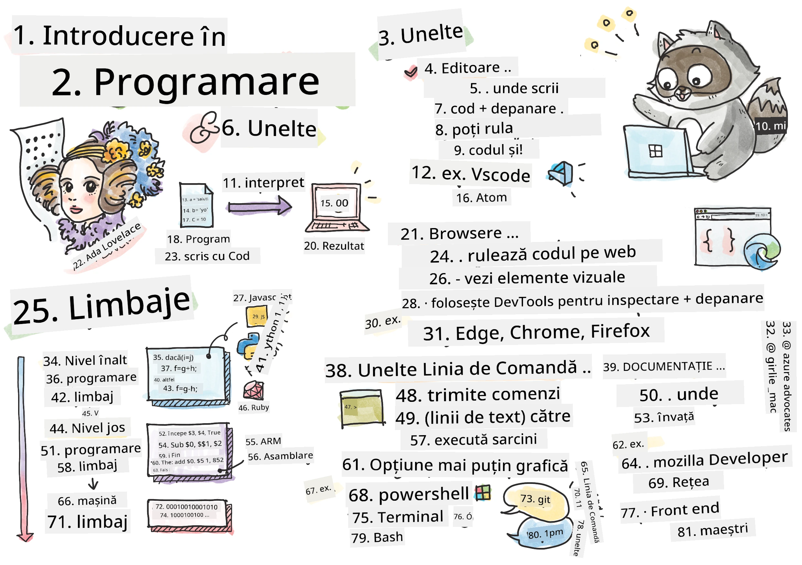
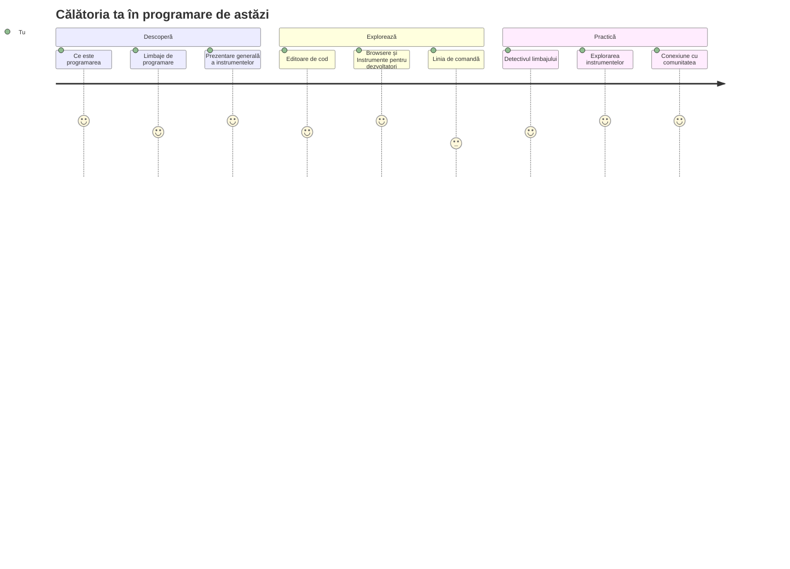
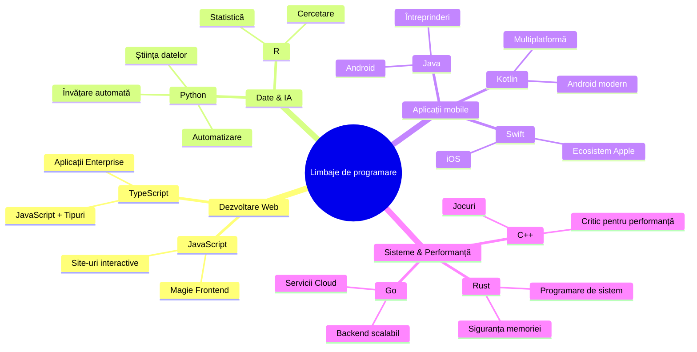
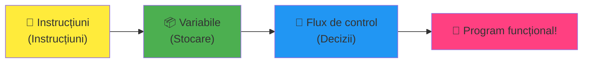
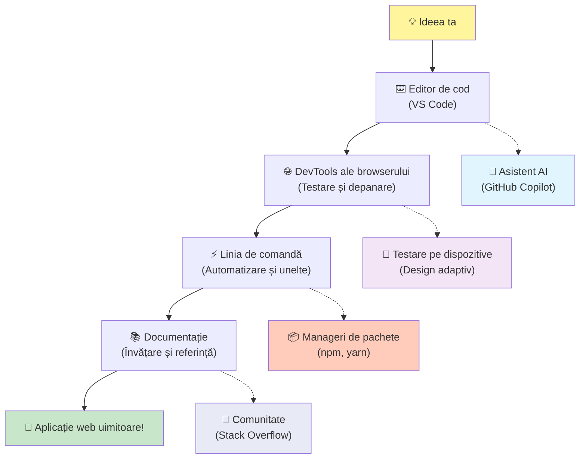
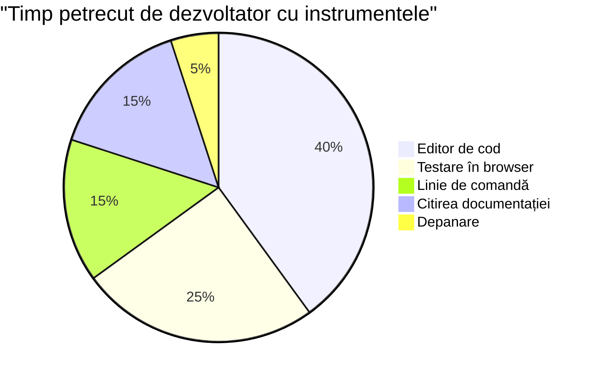
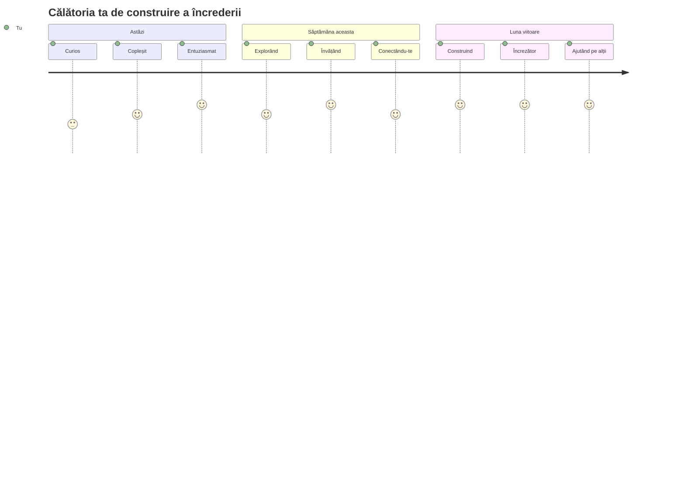

# Introducere în limbaje de programare și uneltele moderne pentru dezvoltatori
 
Salut, viitor dezvoltator! 👋 Pot să-ți spun ceva care încă îmi dă fiori în fiecare zi? Ești pe cale să descoperi că programarea nu înseamnă doar calculatoare – înseamnă să ai superputeri reale ca să-ți transformi cele mai îndrăznețe idei în realitate!

Știi momentul acela când folosești aplicația ta preferată și totul se potrivește perfect? Când apeși un buton și se întâmplă ceva absolut magic care te face să spui „wow, cum au FĂCUT asta?” Ei bine, cineva exact ca tine – probabil stând în cafeneaua preferată la 2 dimineața cu al treilea espresso – a scris codul care a creat acea magie. Și iată ce îți va da pe spate: până la finalul acestei lecții, nu doar că vei înțelege cum au făcut-o, dar vei și avea chef să încerci tu însuți!

Uite, înțeleg perfect dacă programarea ți se pare intimidantă acum. Când am început eu, sincer am crezut că trebuie să fii geniu la matematică sau să programezi de când aveai cinci ani. Dar iată ce mi-a schimbat complet perspectiva: programarea e exact ca învățarea unei limbi noi. Începi cu „hello” și „mulțumesc”, apoi ajungi să comanzi cafea, iar înainte să-ți dai seama, ai discuții filosofice profunde! Doar că, în acest caz, porți conversații cu calculatoarele, și sincer? Sunt cei mai răbdători parteneri de conversație pe care îi vei avea vreodată – nu judecă greșelile și sunt mereu încântați să încerce din nou!

Astăzi vom explora uneltele incredibile care fac dezvoltarea web modernă nu doar posibilă, ci și serios captivantă. Vorbesc despre aceiași editori, browsere și fluxuri de lucru pe care dezvoltatorii de la Netflix, Spotify și studioul tău indie preferat le folosesc zilnic. Și iată partea care te va face să dansezi de bucurie: majoritatea acestor unelte profesionale, standard în industrie, sunt complet gratuite!


> Sketchnote realizată de [Tomomi Imura](https://twitter.com/girlie_mac)


```mermaid
journey
    title Călătoria ta în programare de astăzi
    section Descoperă
      Ce este programarea: 5: Tu
      Limbaje de programare: 4: Tu
      Prezentare generală a instrumentelor: 5: Tu
    section Explorează
      Editoare de cod: 4: Tu
      Browsere și Instrumente pentru dezvoltatori: 5: Tu
      Linia de comandă: 3: Tu
    section Practică
      Detectivul limbajului: 4: Tu
      Explorarea instrumentelor: 5: Tu
      Conexiune cu comunitatea: 5: Tu
```
## Să vedem ce știi deja!

Înainte să trecem la partea distractivă, sunt curios – ce știi deja despre lumea programării? Și ascultă, dacă te uiți la întrebările astea gândindu-te „chiar nu am niciun habar despre toate astea,” nu doar că e în regulă, e perfect! Asta înseamnă că ești chiar în locul potrivit. Gândește-te la acest chestionar ca la o încălzire înainte de antrenament – ne activăm mușchii creierului!

[Fă chestionarul înainte de lecție](https://ff-quizzes.netlify.app/web/)


## Aventura pe care urmează să o parcurgem împreună

Ok, sunt cu adevărat plin de entuziasm pentru ce vom explora azi! Serios, mi-aș dori să văd fața ta când unele dintre aceste concepte vor face „click”. Iată călătoria incredibilă pe care o vom parcurge împreună:

- **What programming actually is (and why it's the coolest thing ever!)** – Vom descoperi cum codul este literalmente magia invizibilă care alimentează tot ce te înconjoară, de la alarma care cumva știe că e luni dimineață până la algoritmul care-ți oferă recomandinările perfecte pe Netflix
- **Programming languages and their amazing personalities** – Imaginează-ți că intri la o petrecere unde fiecare persoană are superputeri complet diferite și moduri proprii de a rezolva probleme. Așa e lumea limbajelor de programare, și îți va plăcea să le cunoști!
- **The fundamental building blocks that make digital magic happen** – Gândește-te la acestea ca la setul suprem de LEGO creativ. Odată ce înțelegi cum se potrivesc aceste piese, vei realiza că poți construi literalmente orice îți imaginezi
- **Professional tools that'll make you feel like you just got handed a wizard's wand** – Nu exagerez – aceste unelte te vor face cu adevărat să te simți ca și cum ai avea superputeri, iar partea cea mai bună? Sunt aceleași pe care le folosesc profesioniștii!

> 💡 **Uite despre ce e vorba**: Nu te gândi nici măcar să încerci să memorezi totul azi! Acum vreau doar să simți acel scânteie de entuziasm legat de ce e posibil. Detaliile se vor fixa natural pe măsură ce exersăm – așa se întâmplă învățarea reală!

> Poți parcurge această lecție pe [Microsoft Learn](https://learn.microsoft.com/en-us/learn/modules/web-development-101/introduction-programming/?WT.mc_id=academic-77807-sagibbon)!

## Deci ce *este* programarea?

Bine, să abordăm întrebarea de un milion de dolari: ce este programarea, cu adevărat?

Îți voi spune o poveste care mi-a schimbat complet modul de a gândi. Săptămâna trecută încercam să-i explic mamei mele cum să folosească noua telecomandă inteligentă de la televizor. M-am surprins spunând lucruri de genul „Apasă butonul roșu, dar nu butonul roșu mare, butonul roșu mic din stânga... nu, cealaltă ta stângă... bine, acum ține-l apăsat două secunde, nu una, nu trei...” Sună cunoscut? 😅

Asta e programarea! E arta de a da instrucțiuni extrem de detaliate, pas cu pas, către ceva foarte puternic, dar care are nevoie să i se spună totul impecabil. Numai că, în loc să explici mamei tale (care poate întreba „ce buton roșu?!”), explici unui calculator (care execută exact ce spui, chiar dacă ce ai spus nu e chiar ce ai vrut).

Iată ce m-a uimit când am aflat asta prima dată: calculatoarele sunt, de fapt, destul de simple la bază. Ele înțeleg literalmente doar două lucruri – 1 și 0, ceea ce e practic doar „da” și „nu” sau „pornit” și „oprit.” Atât! Dar aici devine magic – nu trebuie să vorbim în 1 și 0 ca într-un film. Aici intervin **programming languages**. Sunt ca cel mai bun translator din lume care îți ia gândurile umane și le transformă în limbajul pe care îl înțelege calculatorul.

Și iată ce încă îmi dă fiori în fiecare dimineață: literalmente *tot* ce e digital din viața ta a pornit de la cineva exact ca tine, probabil în pijamale cu o ceașcă de cafea în față, tastând cod pe laptop. Filtrul de Instagram care te face să arăți impecabil? Cineva l-a programat. Recomandarea care te-a dus la melodia ta preferată? Un dezvoltator a construit algoritmul. Aplicația care te ajută să împărți nota de la cină cu prietenii? Da, cineva s-a gândit „asta e enervant, pariez că pot rezolva” și... a făcut-o!

Când înveți să programezi, nu doar achiziționezi o abilitate nouă – devii parte dintr-o comunitate incredibilă de rezolvatori de probleme care își petrec zilele gândindu-se: „Ce-ar fi dacă aș construi ceva care să-i facă ziua cuiva puțin mai bună?” Sincer, există ceva mai tare decât asta?

✅ **Vânătoare de fapte interesante**: Iată ceva super tare de căutat când ai un moment liber – cine crezi că a fost primul programator din lume? Îți dau un indiciu: s-ar putea să nu fie cine te aștepți! Povestea acestei persoane este absolut fascinantă și arată că programarea a fost mereu despre rezolvarea creativă a problemelor și gândirea în afara tiparelor.

### 🧠 **Timp de verificare: Cum te simți?**

**Ia un moment să reflectezi:**
- Are sens acum ideea de „a da instrucțiuni calculatoarelor”?
- Poți să te gândești la o sarcină zilnică pe care ai vrea să o automatizezi cu programarea?
- Ce întrebări îți vin în minte despre toată chestia asta cu programarea?

> **Amintește-ți**: E perfect normal dacă unele concepte par încă vagi. Învățarea programării e ca învățarea unei limbi noi – durează până când creierul tău construiește acele noi conexiuni neuronale. Te descurci grozav!

## Limbajele de programare sunt ca diferite stiluri de magie

Ok, asta o să sune ciudat, dar fii pe fază – limbajele de programare seamănă mult cu diferite stiluri muzicale. Gândește-te: ai jazz, care e fluid și improvizatoric, rock-ul care e puternic și direct, clasică, care e elegantă și structurată, și hip-hop-ul, care e creativ și expresiv. Fiecare stil are propria atmosferă, propria comunitate de fani pasionați și e perfect pentru momente sau stări diferite.

Limbajele de programare funcționează exact la fel! Nu ai folosi același limbaj pentru a construi un joc mobil jucăuș pe care l-ai folosi pentru a procesa cantități uriașe de date climatice, la fel cum nu ai pune death metal la o clasă de yoga (bine, în majoritatea cazurilor! 😄).

Dar ceea ce mă uluiește de fiecare dată când mă gândesc la asta: aceste limbaje sunt ca având cel mai răbdător și strălucit interpret din lume lângă tine. Poți să-ți exprimi ideile într-un mod care se simte natural pentru creierul tău uman, iar ele se ocupă de toată treaba incredibil de complexă de a traduce asta în 1 și 0. E ca și cum ai avea un prieten perfect bilingv în „creativitate umană” și „logică computerizată” – și nu obosește niciodată, nu are pauze de cafea și nu te judecă pentru că întrebi același lucru de două ori!

### Limbaje populare de programare și utilizările lor


```mermaid
mindmap
  root((Limbaje de programare))
    Dezvoltare Web
      JavaScript
        Magie Frontend
        Site-uri interactive
      TypeScript
        JavaScript + Tipuri
        Aplicații Enterprise
    Date & IA
      Python
        Știința datelor
        Învățare automată
        Automatizare
      R
        Statistică
        Cercetare
    Aplicații mobile
      Java
        Android
        Întreprinderi
      Swift
        iOS
        Ecosistem Apple
      Kotlin
        Android modern
        Multiplatformă
    Sisteme & Performanță
      C++
        Jocuri
        Critic pentru performanță
      Rust
        Siguranța memoriei
        Programare de sistem
      Go
        Servicii Cloud
        Backend scalabil
```
| Language | Cel mai bun pentru | De ce e popular |
|----------|--------------------|------------------|
| **JavaScript** | dezvoltare web, interfețe cu utilizatorul | Rulează în browsere și alimentează site-urile web interactive |
| **Python** | știința datelor, automatizare, AI | Ușor de citit și de învățat, biblioteci puternice |
| **Java** | aplicații enterprise, aplicații Android | Independență de platformă, robust pentru sisteme mari |
| **C#** | aplicații Windows, dezvoltare de jocuri | Suport solid al ecosistemului Microsoft |
| **Go** | servicii cloud, sisteme backend | Rapid, simplu, conceput pentru calcul modern |

### Limbaje de nivel înalt vs. nivel scăzut

Ok, sincer, acesta a fost conceptul care mi-a frânt mintea când am început, așa că îți voi împărtăși analogia care, în cele din urmă, mi-a făcut totul să prindă sens – și sper din suflet să te ajute și pe tine!

Imaginează-ți că vizitezi o țară în care nu vorbești limba și ai nevoie disperată să găsești cea mai apropiată toaletă (cu toții am trecut prin asta, nu-i așa? 😅):

- **Programarea de nivel scăzut** e ca și cum ai învăța dialectul local atât de bine încât poți purta o conversație cu bunica care vinde fructe pe colț folosind referințe culturale, argou local și glume pe care doar cineva crescut acolo le-ar înțelege. Super impresionant și incredibil de eficient... dacă ești fluent! Dar destul de copleșitor când doar încerci să găsești o toaletă.

- **Programarea de nivel înalt** e ca și cum ai avea acel prieten local minunat care te înțelege imediat. Poți spune „Am nevoie urgentă să găsesc o toaletă” în engleză simplă, iar el se ocupă de toată traducerea culturală și îți dă indicații într-un mod care are sens pentru creierul tău de non-local.

În termeni de programare:
- **Limbajele de nivel scăzut** (cum ar fi Assembly sau C) îți permit să porți conversații incredibil de detaliate cu hardware-ul real al calculatorului, dar trebuie să gândești ca o mașină, ceea ce... ei bine, să zicem că e o schimbare mentală destul de mare!
- **Limbajele de nivel înalt** (cum ar fi JavaScript, Python sau C#) îți permit să gândești ca un om, în timp ce ele se ocupă de tot „limbajul” mașinii în fundal. În plus, au comunități incredibil de primitoare, pline de oameni care își amintesc cum e să fii nou și care chiar vor să te ajute!

Ghicești cu care îți voi sugera să începi? 😉 Limbajele de nivel înalt sunt ca roțile de antrenament pe care nu o să vrei să le dai jos niciodată, pentru că fac experiența mult mai plăcută!


```mermaid
flowchart TB
    A["👤 Gândul uman:<br/>'Vreau să calculez numerele Fibonacci'"] --> B{Alege nivelul limbajului}
    
    B -->|Nivel înalt| C["🌟 JavaScript/Python<br/>Ușor de citit și de scris"]
    B -->|Nivel scăzut| D["⚙️ Assembly/C<br/>Control direct al hardware-ului"]
    
    C --> E["📝 Scrie: fibonacci(10)"]
    D --> F["📝 Scrie: mov r0,#00<br/>sub r0,r0,#01"]
    
    E --> G["🤖 Înțelegerea calculatorului:<br/>Traducătorul gestionează complexitatea"]
    F --> G
    
    G --> H["💻 Același rezultat:<br/>0, 1, 1, 2, 3, 5, 8, 13..."]
    
    style C fill:#e1f5fe
    style D fill:#fff3e0
    style H fill:#e8f5e8
```
### Lasă-mă să-ți arăt de ce limbajele de nivel înalt sunt mult mai prietenoase

Ok, îți voi arăta ceva care demonstrează perfect de ce m-am îndrăgostit de limbajele de nivel înalt, dar mai întâi – am nevoie să-mi promiți ceva. Când vei vedea primul exemplu de cod, nu intra în panică! E normal să pară intimidant. Exact asta vreau să subliniez!

Vom vedea exact aceeași sarcină scrisă în două stiluri complet diferite. Ambele creează ceea ce se numește secvența Fibonacci – e un pattern matematic frumos în care fiecare număr este suma celor două precedente: 0, 1, 1, 2, 3, 5, 8, 13... (P.S.: vei găsi acest pattern literalmente peste tot în natură – spiralele semințelor de floarea-soarelui, modelul conurilor de brad, chiar și modul în care se formează galaxiile!)

Gata să vezi diferența? Hai!

**High-level language (JavaScript) – Prietenos pentru oameni:**

```javascript
// Pasul 1: Configurare de bază pentru Fibonacci
const fibonacciCount = 10;
let current = 0;
let next = 1;

console.log('Fibonacci sequence:');
```

**Ce face acest cod:**
- **Declară** o constantă pentru a specifica câte numere Fibonacci vrem să generăm
- **Inițializează** două variabile pentru a urmări numărul curent și următorul în secvență
- **Setează** valorile de început (0 și 1) care definesc pattern-ul Fibonacci
- **Afișează** un antet pentru a identifica ieșirea noastră

```javascript
// Pasul 2: Generează secvența folosind o buclă
for (let i = 0; i < fibonacciCount; i++) {
  console.log(`Position ${i + 1}: ${current}`);
  
  // Calculează următorul număr din secvență
  const sum = current + next;
  current = next;
  next = sum;
}
```

**Descompunând ce se întâmplă aici:**
- **Parcurge** fiecare poziție din secvența noastră folosind un `for` loop
- **Afișează** fiecare număr cu poziția sa folosind formatare cu template literal
- **Calculează** următorul număr Fibonacci prin adunarea valorilor curente și următoare
- **Actualizează** variabilele de urmărit pentru a trece la iterația următoare

```javascript
// Pasul 3: abordare funcțională modernă
const generateFibonacci = (count) => {
  const sequence = [0, 1];
  
  for (let i = 2; i < count; i++) {
    sequence[i] = sequence[i - 1] + sequence[i - 2];
  }
  
  return sequence;
};

// Exemplu de utilizare
const fibSequence = generateFibonacci(10);
console.log(fibSequence);
```

**În exemplul de mai sus, am:**
- **Creat** o funcție reutilizabilă folosind sintaxa modernă a funcțiilor săgeată
- **Construit** un array pentru a stoca întreaga secvență în loc să o afișăm una câte una
- **Folosit** indexarea array-ului pentru a calcula fiecare număr nou din valorile anterioare
- **Returnat** secvența completă pentru utilizare flexibilă în alte părți ale programului nostru

**Low-level language (ARM Assembly) – Prietenos pentru computere:**

```assembly
 area ascen,code,readonly
 entry
 code32
 adr r0,thumb+1
 bx r0
 code16
thumb
 mov r0,#00
 sub r0,r0,#01
 mov r1,#01
 mov r4,#10
 ldr r2,=0x40000000
back add r0,r1
 str r0,[r2]
 add r2,#04
 mov r3,r0
 mov r0,r1
 mov r1,r3
 sub r4,#01
 cmp r4,#00
 bne back
 end
```

Observă cum versiunea JavaScript se citește aproape ca niște instrucțiuni în engleză, în timp ce versiunea Assembly folosește comenzi criptice care controlează direct procesorul calculatorului. Ambele îndeplinesc aceeași sarcină, dar limbajul de nivel înalt este mult mai ușor pentru oameni de înțeles, scris și întreținut.

**Diferențe cheie pe care le vei observa:**
- **Readability**: JavaScript folosește nume descriptive precum `fibonacciCount` în timp ce Assembly folosește etichete criptice precum `r0`, `r1`
- **Comments**: Limbaje de nivel înalt încurajează comentarii explicative care fac codul auto-documentat
- **Structure**: Fluxul logic al JavaScript se potrivește cu modul în care oamenii gândesc pas cu pas despre probleme
- **Maintenance**: Actualizarea versiunii JavaScript pentru cerințe diferite este simplă și clară

✅ **Despre secvența Fibonacci**: Acest model numeric absolut superb (unde fiecare număr este egal cu suma celor două precedente: 0, 1, 1, 2, 3, 5, 8...) apare literalmente *peste tot* în natură! Îl vei găsi în spiralele soarelui, în modelul conurilor de pin, în curbura cochiliilor de nautilus și chiar în modul în care se dezvoltă ramurile copacilor. E destul de uluitor cât de mult ne poate ajuta matematica și codul să înțelegem și să recreăm modelele pe care natura le folosește pentru a crea frumusețe!


## The Building Blocks That Make the Magic Happen

Alright, now that you've seen what programming languages look like in action, let's break down the fundamental pieces that make up literally every program ever written. Think of these as the essential ingredients in your favorite recipe – once you understand what each one does, you'll be able to read and write code in pretty much any language!

This is kind of like learning the grammar of programming. Remember back in school when you learned about nouns, verbs, and how to put sentences together? Programming has its own version of grammar, and honestly, it's way more logical and forgiving than English grammar ever was! 😄

### Statements: The Step-by-Step Instructions

Let's start with **statements** – these are like individual sentences in a conversation with your computer. Each statement tells the computer to do one specific thing, kind of like giving directions: "Turn left here," "Stop at the red light," "Park in that spot."

What I love about statements is how readable they usually are. Check this out:

```javascript
// Instrucțiuni de bază care efectuează acțiuni simple
const userName = "Alex";                    
console.log("Hello, world!");              
const sum = 5 + 3;                         
```

**Here's what this code does:**
- **Declare** a constant variable to store a user's name
- **Display** a greeting message to the console output
- **Calculate** and store the result of a mathematical operation

```javascript
// Instrucțiuni care interacționează cu paginile web
document.title = "My Awesome Website";      
document.body.style.backgroundColor = "lightblue";
```

**Step by step, here's what's happening:**
- **Modify** the webpage's title that appears in the browser tab
- **Change** the background color of the entire page body

### Variables: Your Program's Memory System

Okay, **variables** are honestly one of my absolute favorite concepts to teach because they're so much like things you already use every single day!

Think about your phone's contact list for a second. You don't memorize everyone's phone number – instead, you save "Mom," "Best Friend," or "Pizza Place That Delivers Until 2 AM" and let your phone remember the actual numbers. Variables work exactly the same way! They're like labeled containers where your program can store information and retrieve it later using a name that actually makes sense.

Here's what's really cool: variables can change as your program runs (hence the name "variable" – see what they did there?). Just like you might update that pizza place contact when you discover somewhere even better, variables can be updated as your program learns new information or as situations change!

Let me show you how beautifully simple this can be:

```javascript
// Pasul 1: Crearea variabilelor de bază
const siteName = "Weather Dashboard";        
let currentWeather = "sunny";               
let temperature = 75;                       
let isRaining = false;                      
```

**Understanding these concepts:**
- **Store** unchanging values in `const` variables (like site name)
- **Use** `let` for values that can change throughout your program
- **Assign** different data types: strings (text), numbers, and booleans (true/false)
- **Choose** descriptive names that explain what each variable contains

```javascript
// Pasul 2: Lucrul cu obiecte pentru a grupa date conexe
const weatherData = {                       
  location: "San Francisco",
  humidity: 65,
  windSpeed: 12
};
```

**In the above, we've:**
- **Created** an object to group related weather information together
- **Organized** multiple pieces of data under one variable name
- **Used** key-value pairs to label each piece of information clearly

```javascript
// Pasul 3: Folosirea și actualizarea variabilelor
console.log(`${siteName}: Today is ${currentWeather} and ${temperature}°F`);
console.log(`Wind speed: ${weatherData.windSpeed} mph`);

// Actualizarea variabilelor modificabile
currentWeather = "cloudy";                  
temperature = 68;                          
```

**Let's understand each part:**
- **Display** information using template literals with `${}` syntax
- **Access** object properties using dot notation (`weatherData.windSpeed`)
- **Update** variables declared with `let` to reflect changing conditions
- **Combine** multiple variables to create meaningful messages

```javascript
// Pasul 4: Destructurare modernă pentru un cod mai curat
const { location, humidity } = weatherData; 
console.log(`${location} humidity: ${humidity}%`);
```

**What you need to know:**
- **Extract** specific properties from objects using destructuring assignment
- **Create** new variables automatically with the same names as object keys
- **Simplify** code by avoiding repetitive dot notation

### Control Flow: Teaching Your Program to Think

Okay, this is where programming gets absolutely mind-blowing! **Control flow** is basically teaching your program how to make smart decisions, exactly like you do every single day without even thinking about it.

Picture this: this morning you probably went through something like "If it's raining, I'll grab an umbrella. If it's cold, I'll wear a jacket. If I'm running late, I'll skip breakfast and grab coffee on the way." Your brain naturally follows this if-then logic dozens of times every day!

This is what makes programs feel intelligent and alive instead of just following some boring, predictable script. They can actually look at a situation, evaluate what's happening, and respond appropriately. It's like giving your program a brain that can adapt and make choices!

Want to see how beautifully this works? Let me show you:

```javascript
// Pasul 1: Logică condițională de bază
const userAge = 17;

if (userAge >= 18) {
  console.log("You can vote!");
} else {
  const yearsToWait = 18 - userAge;
  console.log(`You'll be able to vote in ${yearsToWait} year(s).`);
}
```

**Here's what this code does:**
- **Check** if the user's age meets the voting requirement
- **Execute** different code blocks based on the condition result
- **Calculate** and display how long until voting eligibility if under 18
- **Provide** specific, helpful feedback for each scenario

```javascript
// Pasul 2: Mai multe condiții cu operatori logici
const userAge = 17;
const hasPermission = true;

if (userAge >= 18 && hasPermission) {
  console.log("Access granted: You can enter the venue.");
} else if (userAge >= 16) {
  console.log("You need parent permission to enter.");
} else {
  console.log("Sorry, you must be at least 16 years old.");
}
```

**Breaking down what happens here:**
- **Combine** multiple conditions using the `&&` (and) operator
- **Create** a hierarchy of conditions using `else if` for multiple scenarios
- **Handle** all possible cases with a final `else` statement
- **Provide** clear, actionable feedback for each different situation

```javascript
// Pasul 3: Condițional concis cu operator ternar
const votingStatus = userAge >= 18 ? "Can vote" : "Cannot vote yet";
console.log(`Status: ${votingStatus}`);
```

**What you need to remember:**
- **Use** the ternary operator (`? :`) for simple two-option conditions
- **Write** condition first, followed by `?`, then true result, then `:`, then false result
- **Apply** this pattern when you need to assign values based on conditions

```javascript
// Pasul 4: Tratarea mai multor cazuri specifice
const dayOfWeek = "Tuesday";

switch (dayOfWeek) {
  case "Monday":
  case "Tuesday":
  case "Wednesday":
  case "Thursday":
  case "Friday":
    console.log("It's a weekday - time to work!");
    break;
  case "Saturday":
  case "Sunday":
    console.log("It's the weekend - time to relax!");
    break;
  default:
    console.log("Invalid day of the week");
}
```

**This code accomplishes the following:**
- **Match** the variable value against multiple specific cases
- **Group** similar cases together (weekdays vs. weekends)
- **Execute** the appropriate code block when a match is found
- **Include** a `default` case to handle unexpected values
- **Use** `break` statements to prevent code from continuing to the next case

> 💡 **Real-world analogy**: Think of control flow like having the world's most patient GPS giving you directions. It might say "If there's traffic on Main Street, take the highway instead. If construction is blocking the highway, try the scenic route." Programs use exactly the same type of conditional logic to respond intelligently to different situations and always give users the best possible experience.

### 🎯 **Concept Check: Building Blocks Mastery**

**Let's see how you're doing with the fundamentals:**
- Can you explain the difference between a variable and a statement in your own words?
- Think of a real-world scenario where you'd use an if-then decision (like our voting example)
- What's one thing about programming logic that surprised you?

**Quick confidence booster:**

```mermaid
flowchart LR
    A["📝 Instrucțiuni<br/>(Instrucțiuni)"] --> B["📦 Variabile<br/>(Stocare)"] --> C["🔀 Flux de control<br/>(Decizii)"] --> D["🎉 Program funcțional!"]
    
    style A fill:#ffeb3b
    style B fill:#4caf50
    style C fill:#2196f3
    style D fill:#ff4081
```
✅ **What's coming up next**: We're going to have an absolute blast diving deeper into these concepts as we continue this incredible journey together! Right now, just focus on feeling that excitement about all the amazing possibilities ahead of you. The specific skills and techniques will stick naturally as we practice together – I promise this is going to be so much more fun than you might expect!

## Tools of the Trade

Alright, this is honestly where I get so excited I can barely contain myself! 🚀 We're about to talk about the incredible tools that are going to make you feel like you just got handed the keys to a digital spaceship.

You know how a chef has those perfectly balanced knives that feel like extensions of their hands? Or how a musician has that one guitar that seems to sing the moment they touch it? Well, developers have our own version of these magical tools, and here's what's going to absolutely blow your mind – most of them are completely free!

I'm practically bouncing in my chair thinking about sharing these with you because they've completely revolutionized how we build software. We're talking about AI-powered coding assistants that can help write your code (I'm not even kidding!), cloud environments where you can build entire applications from literally anywhere with Wi-Fi, and debugging tools so sophisticated they're like having X-ray vision for your programs.

And here's the part that still gives me chills: these aren't "beginner tools" that you'll outgrow. These are the exact same professional-grade tools that developers at Google, Netflix, and that indie app studio you love are using right this very moment. You're going to feel like such a pro using them!


```mermaid
graph TD
    A["💡 Ideea ta"] --> B["⌨️ Editor de cod<br/>(VS Code)"] 
    B --> C["🌐 DevTools ale browserului<br/>(Testare și depanare)"]
    C --> D["⚡ Linia de comandă<br/>(Automatizare și unelte)"]
    D --> E["📚 Documentație<br/>(Învățare și referință)"]
    E --> F["🚀 Aplicație web uimitoare!"]
    
    B -.-> G["🤖 Asistent AI<br/>(GitHub Copilot)"]
    C -.-> H["📱 Testare pe dispozitive<br/>(Design adaptiv)"]
    D -.-> I["📦 Manageri de pachete<br/>(npm, yarn)"]
    E -.-> J["👥 Comunitate<br/>(Stack Overflow)"]
    
    style A fill:#fff59d
    style F fill:#c8e6c9
    style G fill:#e1f5fe
    style H fill:#f3e5f5
    style I fill:#ffccbc
    style J fill:#e8eaf6
```
### Code Editors and IDEs: Your New Digital Best Friends

Let's talk about code editors – these are seriously about to become your new favorite places to hang out! Think of them as your personal coding sanctuary where you'll spend most of your time crafting and perfecting your digital creations.

But here's what's absolutely magical about modern editors: they're not just fancy text editors. They're like having the most brilliant, supportive coding mentor sitting right next to you 24/7. They catch your typos before you even notice them, suggest improvements that make you look like a genius, help you understand what every piece of code does, and some of them can even predict what you're about to type and offer to finish your thoughts!

I remember when I first discovered auto-completion – I literally felt like I was living in the future. You start typing something, and your editor goes, "Hey, were you thinking of this function that does exactly what you need?" It's like having a mind reader as your coding buddy!

**What makes these editors so incredible?**

Modern code editors offer an impressive array of features designed to boost your productivity:

| Feature | What It Does | Why It Helps |
|---------|--------------|--------------|
| **Syntax Highlighting** | Colors different parts of your code | Makes code easier to read and spot errors |
| **Auto-completion** | Suggests code as you type | Speeds up coding and reduces typos |
| **Debugging Tools** | Helps you find and fix errors | Saves hours of troubleshooting time |
| **Extensions** | Add specialized features | Customize your editor for any technology |
| **AI Assistants** | Suggest code and explanations | Accelerates learning and productivity |

> 🎥 **Video Resource**: Want to see these tools in action? Check out this [Tools of the Trade video](https://youtube.com/watch?v=69WJeXGBdxg) for a comprehensive overview.

#### Recommended Editors for Web Development

**[Visual Studio Code](https://code.visualstudio.com/?WT.mc_id=academic-77807-sagibbon)** (Gratuit)
- Most popular among web developers
- Excellent extension ecosystem
- Built-in terminal and Git integration
- **Must-have extensions**:
  - [GitHub Copilot](https://marketplace.visualstudio.com/items?itemName=GitHub.copilot) - AI-powered code suggestions
  - [Live Share](https://marketplace.visualstudio.com/items?itemName=MS-vsliveshare.vsliveshare) - Real-time collaboration
  - [Prettier](https://marketplace.visualstudio.com/items?itemName=esbenp.prettier-vscode) - Automatic code formatting
  - [Code Spell Checker](https://marketplace.visualstudio.com/items?itemName=streetsidesoftware.code-spell-checker) - Catch typos in your code

**[JetBrains WebStorm](https://www.jetbrains.com/webstorm/)** (Paid, free for students)
- Advanced debugging and testing tools
- Intelligent code completion
- Built-in version control

**Cloud-Based IDEs** (Diferite tarife)
- [GitHub Codespaces](https://github.com/features/codespaces) - Full VS Code in your browser
- [Replit](https://replit.com/) - Great for learning and sharing code
- [StackBlitz](https://stackblitz.com/) - Instant, full-stack web development

> 💡 **Getting Started Tip**: Start with Visual Studio Code – it's free, widely used in the industry, and has an enormous community creating helpful tutorials and extensions.


### Web Browsers: Your Secret Development Laboratory

Okay, prepare to have your mind completely blown! You know how you've been using browsers to scroll through social media and watch videos? Well, it turns out they've been hiding this incredible secret developer laboratory this entire time, just waiting for you to discover it!

Every single time you right-click on a webpage and select "Inspect Element," you're opening up a hidden world of developer tools that are honestly more powerful than some expensive software I used to pay hundreds of dollars for. It's like discovering that your regular old kitchen has been concealing a professional chef's laboratory behind a secret panel!
The first time someone showed me browser DevTools, I spent like three hours just clicking around and going "WAIT, IT CAN DO THAT TOO?!" You can literally edit any website in real-time, see exactly how fast everything loads, test how your site looks on different devices, and even debug JavaScript like a total pro. It's absolutely mind-blowing!

**Here's why browsers are your secret weapon:**

When you create a website or web application, you need to see how it looks and behaves in the real world. Browsers not only display your work but also provide detailed feedback about performance, accessibility, and potential issues.

#### Browser Developer Tools (DevTools)

Modern browsers include comprehensive development suites:

| Tool Category | What It Does | Example Use Case |
|---------------|--------------|------------------|
| **Element Inspector** | View and edit HTML/CSS in real-time | Adjust styling to see immediate results |
| **Console** | View error messages and test JavaScript | Debug problems and experiment with code |
| **Network Monitor** | Track how resources load | Optimize performance and loading times |
| **Accessibility Checker** | Test for inclusive design | Ensure your site works for all users |
| **Device Simulator** | Preview on different screen sizes | Test responsive design without multiple devices |

#### Recommended Browsers for Development

- **[Chrome](https://developers.google.com/web/tools/chrome-devtools/)** - Industry-standard DevTools with extensive documentation
- **[Firefox](https://developer.mozilla.org/docs/Tools)** - Excellent CSS Grid and accessibility tools
- **[Edge](https://docs.microsoft.com/microsoft-edge/devtools-guide-chromium/?WT.mc_id=academic-77807-sagibbon)** - Built on Chromium with Microsoft's developer resources

> ⚠️ **Important Testing Tip**: Always test your websites in multiple browsers! What works perfectly in Chrome might look different in Safari or Firefox. Professional developers test across all major browsers to ensure consistent user experiences.


### Command Line Tools: Your Gateway to Developer Superpowers

Alright, let's have a completely honest moment here about the command line, because I want you to hear this from someone who truly gets it. When I first saw it – just this scary black screen with blinking text – I literally thought, "Nope, absolutely not! This looks like something from a 1980s hacker movie, and I am definitely not smart enough for this!" 😅

But here's what I wish someone had told me back then, and what I'm telling you right now: the command line isn't scary – it's actually like having a direct conversation with your computer. Think of it like the difference between ordering food through a fancy app with pictures and menus (which is nice and easy) versus walking into your favorite local restaurant where the chef knows exactly what you like and can whip up something perfect just by you saying "surprise me with something amazing."

The command line is where developers go to feel like absolute wizards. You type a few seemingly magical words (okay, they're just commands, but they feel magical!), hit enter, and BOOM – you've created entire project structures, installed powerful tools from around the world, or deployed your app to the internet for millions of people to see. Once you get your first taste of that power, it's honestly pretty addictive!

**Why the command line will become your favorite tool:**

While graphical interfaces are great for many tasks, the command line excels at automation, precision, and speed. Many development tools work primarily through command line interfaces, and learning to use them efficiently can dramatically improve your productivity.

```bash
# Pasul 1: Creează și navighează în directorul proiectului
mkdir my-awesome-website
cd my-awesome-website
```

**Here's what this code does:**
- **Create** a new directory called "my-awesome-website" for your project
- **Navigate** into the newly created directory to begin working

```bash
# Pasul 2: Inițializează proiectul cu package.json
npm init -y

# Instalează instrumente moderne de dezvoltare
npm install --save-dev vite prettier eslint
npm install --save-dev @eslint/js
```

**Step by step, here's what's happening:**
- **Initialize** a new Node.js project with default settings using `npm init -y`
- **Install** Vite as a modern build tool for fast development and production builds
- **Add** Prettier for automatic code formatting and ESLint for code quality checks
- **Use** the `--save-dev` flag to mark these as development-only dependencies

```bash
# Pasul 3: Creează structura proiectului și fișierele
mkdir src assets
echo '<!DOCTYPE html><html><head><title>My Site</title></head><body><h1>Hello World</h1></body></html>' > index.html

# Pornește serverul de dezvoltare
npx vite
```

**In the above, we've:**
- **Organized** our project by creating separate folders for source code and assets
- **Generated** a basic HTML file with proper document structure
- **Started** the Vite development server for live reloading and hot module replacement

#### Essential Command Line Tools for Web Development

| Tool | Purpose | Why You Need It |
|------|---------|-----------------|
| **[Git](https://git-scm.com/)** | Version control | Track changes, collaborate with others, backup your work |
| **[Node.js & npm](https://nodejs.org/)** | JavaScript runtime & package management | Run JavaScript outside browsers, install modern development tools |
| **[Vite](https://vitejs.dev/)** | Build tool & dev server | Lightning-fast development with hot module replacement |
| **[ESLint](https://eslint.org/)** | Code quality | Automatically find and fix problems in your JavaScript |
| **[Prettier](https://prettier.io/)** | Code formatting | Keep your code consistently formatted and readable |

#### Platform-Specific Options

**Windows:**
- **[Windows Terminal](https://docs.microsoft.com/windows/terminal/?WT.mc_id=academic-77807-sagibbon)** - Modern, feature-rich terminal
- **[PowerShell](https://docs.microsoft.com/powershell/?WT.mc_id=academic-77807-sagibbon)** 💻 - Powerful scripting environment
- **[Command Prompt](https://learn.microsoft.com/windows-server/administration/windows-commands/windows-commands)** 💻 - Traditional Windows command line

**macOS:**
- **[Terminal](https://support.apple.com/guide/terminal/)** 💻 - Built-in terminal application
- **[iTerm2](https://iterm2.com/)** - Enhanced terminal with advanced features

**Linux:**
- **[Bash](https://www.gnu.org/software/bash/)** 💻 - Standard Linux shell
- **[KDE Konsole](https://docs.kde.org/trunk5/en/konsole/konsole/index.html)** - Advanced terminal emulator

> 💻 = Pre-installed on the operating system

> 🎯 **Learning Path**: Start with basic commands like `cd` (change directory), `ls` or `dir` (list files), and `mkdir` (create folder). Practice with modern workflow commands like `npm install`, `git status`, and `code .` (opens current directory in VS Code). As you become more comfortable, you'll naturally pick up more advanced commands and automation techniques.


### Documentation: Your Always-Available Learning Mentor

Okay, let me share a little secret that's going to make you feel so much better about being a beginner: even the most experienced developers spend a huge chunk of their time reading documentation. And that's not because they don't know what they're doing – it's actually a sign of wisdom!

Think of documentation as having access to the world's most patient, knowledgeable teachers who are available 24/7. Stuck on a problem at 2 AM? Documentation is there with a warm virtual hug and exactly the answer you need. Want to learn about some cool new feature that everyone's talking about? Documentation has your back with step-by-step examples. Trying to understand why something works the way it does? You guessed it – documentation is ready to explain it in a way that finally makes it click!

Here's something that completely changed my perspective: the web development world moves incredibly fast, and nobody (I mean absolutely nobody!) keeps everything memorized. I've watched senior developers with 15+ years of experience look up basic syntax, and you know what? That's not embarrassing – that's smart! It's not about having a perfect memory; it's about knowing where to find reliable answers quickly and understanding how to apply them.

**Here's where the real magic happens:**

Professional developers spend a significant portion of their time reading documentation – not because they don't know what they're doing, but because the web development landscape evolves so rapidly that staying current requires continuous learning. Great documentation helps you understand not just *how* to use something, but *why* and *when* to use it.

#### Essential Documentation Resources

**[Mozilla Developer Network (MDN)](https://developer.mozilla.org/docs/Web)**
- The gold standard for web technology documentation
- Comprehensive guides for HTML, CSS, and JavaScript
- Includes browser compatibility information
- Features practical examples and interactive demos

**[Web.dev](https://web.dev)** (by Google)
- Modern web development best practices
- Performance optimization guides
- Accessibility and inclusive design principles
- Case studies from real-world projects

**[Microsoft Developer Documentation](https://docs.microsoft.com/microsoft-edge/#microsoft-edge-for-developers)**
- Edge browser development resources
- Progressive Web App guides
- Cross-platform development insights

**[Frontend Masters Learning Paths](https://frontendmasters.com/learn/)**
- Structured learning curricula
- Video courses from industry experts
- Hands-on coding exercises

> 📚 **Study Strategy**: Don't try to memorize documentation – instead, learn how to navigate it efficiently. Bookmark frequently-used references and practice using the search functions to find specific information quickly.

### 🔧 **Tool Mastery Check: What Resonates With You?**

**Take a moment to consider:**
- Which tool are you most excited to try first? (There's no wrong answer!)
- Does the command line still feel intimidating, or are you curious about it?
- Can you imagine using browser DevTools to peek behind the curtain of your favorite websites?


```mermaid
pie title "Timp petrecut de dezvoltator cu instrumentele"
    "Editor de cod" : 40
    "Testare în browser" : 25
    "Linie de comandă" : 15
    "Citirea documentației" : 15
    "Depanare" : 5
```
> **Fun insight**: Most developers spend about 40% of their time in their code editor, but notice how much time goes to testing, learning, and problem-solving. Programming isn't just about writing code – it's about crafting experiences!

✅ **Food for thought**: Here's something interesting to ponder – how do you think the tools for building websites (development) might be different from tools for designing how they look (design)? It's like the difference between being an architect who designs a beautiful house and the contractor who actually builds it. Both are crucial, but they need different toolboxes! This kind of thinking will really help you see the bigger picture of how websites come to life.

## GitHub Copilot Agent Challenge 🚀

Use the Agent mode to complete the following challenge:

**Description:** Explore the features of a modern code editor or IDE and demonstrate how it can improve your workflow as a web developer.

**Prompt:** Choose a code editor or IDE (such as Visual Studio Code, WebStorm, or a cloud-based IDE). List three features or extensions that help you write, debug, or maintain code more efficiently. For each, provide a brief explanation of how it benefits your workflow.

---

## 🚀 Challenge

**Alright, detective, ready for your first case?**

Now that you've got this awesome foundation, I've got an adventure that's going to help you see just how incredibly diverse and fascinating the programming world really is. And listen – this isn't about writing code yet, so no pressure there! Think of yourself as a programming language detective on your very first exciting case!

**Your mission, should you choose to accept it:**
1. **Become a language explorer**: Pick three programming languages from completely different universes – maybe one that builds websites, one that creates mobile apps, and one that crunches data for scientists. Find examples of the same simple task written in each language. I promise you're going to be absolutely amazed at how different they can look while doing the exact same thing!

2. **Uncover their origin stories**: What makes each language special? Here's a cool fact – every single programming language was created because someone thought, "You know what? There's got to be a better way to solve this specific problem." Can you figure out what those problems were? Some of these stories are genuinely fascinating!

3. **Meet the communities**: Check out how welcoming and passionate each language's community is. Some have millions of developers sharing knowledge and helping each other, others are smaller but incredibly tight-knit and supportive. You're going to love seeing the different personalities these communities have!

4. **Follow your gut feeling**: Which language feels most approachable to you right now? Don't stress about making the "perfect" choice – just listen to your instincts! There's honestly no wrong answer here, and you can always explore others later.

**Bonus detective work**: See if you can discover what major websites or apps are built with each language. I guarantee you'll be shocked to learn what powers Instagram, Netflix, or that mobile game you can't stop playing!

> 💡 **Remember**: You're not trying to become an expert in any of these languages today. You're just getting to know the neighborhood before you decide where you want to set up shop. Take your time, have fun with it, and let your curiosity guide you!

## Let's Celebrate What You've Discovered!

Holy moly, you've absorbed so much incredible information today! I'm genuinely excited to see how much of this amazing journey has stuck with you. And remember – this isn't a test where you need to get everything perfect. This is more like a celebration of all the cool stuff you've learned about this fascinating world you're about to dive into!

[Take the post-lesson quiz](https://ff-quizzes.netlify.app/web/)

## Review & Self Study

**Take your time to explore and have fun with it!**
Ai parcurs mult astăzi, și asta este ceva de care să fii mândru! Acum urmează partea distractivă – explorarea subiectelor care ți-au stârnit curiozitatea. Amintește-ți, asta nu e o temă – e o aventură!

**Aprofundează ceea ce te entuziasmează:**

**Încearcă practic limbaje de programare:**
- Vizitează site-urile oficiale ale a 2-3 limbaje care ți-au atras atenția. Fiecare are propria personalitate și poveste!
- Încearcă niște playground-uri de cod online precum [CodePen](https://codepen.io/), [JSFiddle](https://jsfiddle.net/), sau [Replit](https://replit.com/). Nu-ți fie teamă să experimentezi – nu poți strica nimic!
- Citește despre cum a apărut limbajul tău preferat. Serios, unele dintre aceste povești de origine sunt fascinante și te vor ajuta să înțelegi de ce limbajele funcționează așa cum o fac.

**Familiarizează-te cu noile tale instrumente:**
- Descarcă Visual Studio Code dacă nu l-ai descărcat deja – e gratuit și îți va plăcea!
- Petrece câteva minute răsfoind Marketplace-ul de extensii. E ca un magazin de aplicații pentru editorul tău de cod!
- Deschide Instrumentele pentru dezvoltatori ale browserului și doar dă click pe diferite elemente. Nu-ți face griji că trebuie să înțelegi totul – doar familiarizează-te cu ce este acolo.

**Alătură-te comunității:**
- Urmează câteva comunități de dezvoltatori pe [Dev.to](https://dev.to/), [Stack Overflow](https://stackoverflow.com/), sau [GitHub](https://github.com/). Comunitatea de programare este incredibil de prietenoasă cu începătorii!
- Urmărește câteva videoclipuri prietenoase pentru începători pe YouTube. Există atât de mulți creatori grozavi care își amintesc cum e să începi.
- Ia în considerare să participi la întâlniri locale sau la comunități online. Crede-mă, dezvoltatorii iubesc să ajute începătorii!

> 🎯 **Ascultă, iată ce vreau să-ți amintești**: Nu se așteaptă de la tine să devii un vrăjitor al codării peste noapte! În momentul de față, doar începi să cunoști această lume uimitoare din care urmează să faci parte. Ia-ți timp, bucură-te de călătorie și amintește-ți – fiecare dezvoltator pe care îl admiri a fost odată chiar unde ești tu acum, entuziasmat și poate puțin copleșit. Asta e perfect normal și înseamnă că faci lucrurile corect!


## Tema

[Citește documentația](assignment.md)

> 💡 **Un mic impuls pentru tema ta**: Mi-ar plăcea foarte mult să te văd explorând unele instrumente pe care încă nu le-am tratat! Sări peste editorii, browserele și instrumentele de linie de comandă despre care am discutat deja – există un întreg univers incredibil de unelte de dezvoltare care așteaptă să fie descoperite. Caută-le pe cele care sunt întreținute activ și au comunități vibrante și de ajutor (acestea tind să aibă cele mai bune tutoriale și cele mai susținătoare persoane când, inevitabil, rămâi blocat și ai nevoie de o mână prietenoasă).

---

## 🚀 Cronologia călătoriei tale în programare

### ⚡ **Ce poți face în următoarele 5 minute**
- [ ] Adaugă la favorite 2-3 site-uri de limbaje de programare care ți-au atras atenția
- [ ] Descarcă Visual Studio Code dacă nu l-ai descărcat deja
- [ ] Deschide Instrumentele pentru dezvoltatori ale browserului (F12) și dă click printr-un site
- [ ] Alătură-te unei comunități de programare (Dev.to, Reddit r/webdev, sau Stack Overflow)

### ⏰ **Ce poți realiza în această oră**
- [ ] Completează quiz-ul post-lecție și reflectează asupra răspunsurilor
- [ ] Configurează VS Code cu extensia GitHub Copilot
- [ ] Încearcă un exemplu "Hello World" în 2 limbaje de programare diferite online
- [ ] Urmărește un videoclip "Day in the Life of a Developer" pe YouTube
- [ ] Începe-ți cercetarea despre limbaje de programare (din provocare)

### 📅 **Aventura ta de o săptămână**
- [ ] Finalizează tema și explorează 3 instrumente noi de dezvoltare
- [ ] Urmărește 5 dezvoltatori sau conturi de programare pe rețele sociale
- [ ] Încearcă să construiești ceva mic în CodePen sau Replit (chiar și doar "Hello, [Numele tău]!")
- [ ] Citește un articol de blog al unui dezvoltator despre drumul său în programare
- [ ] Participă la o întâlnire virtuală sau urmărește o prezentare despre programare
- [ ] Începe să înveți limbajul ales cu tutoriale online

### 🗓️ **Transformarea ta într-o lună**
- [ ] Creează-ți primul proiect mic (chiar și o pagină web simplă contează!)
- [ ] Contribuie la un proiect open-source (începe cu corecturi de documentație)
- [ ] Fii mentor pentru cineva care abia își începe călătoria în programare
- [ ] Creează-ți site-ul de portofoliu pentru dezvoltatori
- [ ] Conectează-te cu comunități locale de dezvoltatori sau cu grupuri de studiu
- [ ] Începe să planifici următorul tău obiectiv de învățare

### 🎯 **Reflecție finală**

**Înainte să continui, ia-ți un moment pentru a celebra:**
- Ce este un lucru legat de programare care te-a entuziasmat astăzi?
- Ce instrument sau concept vrei să explorezi primul?
- Cum te simți în legătură cu începutul acestei călătorii în programare?
- Care e o întrebare pe care ai vrea să o adresezi unui dezvoltator chiar acum?


```mermaid
journey
    title Călătoria ta de construire a încrederii
    section Astăzi
      Curios: 3: Tu
      Copleșit: 4: Tu
      Entuziasmat: 5: Tu
    section Săptămâna aceasta
      Explorând: 4: Tu
      Învățând: 5: Tu
      Conectându-te: 4: Tu
    section Luna viitoare
      Construind: 5: Tu
      Încrezător: 5: Tu
      Ajutând pe alții: 5: Tu
```
> 🌟 **Amintește-ți**: Fiecare expert a fost odată un începător. Fiecare dezvoltator senior s-a simțit la un moment dat exact așa cum te simți tu acum – entuziasmat, poate puțin copleșit, și cu siguranță curios despre ce e posibil. Ești în companie extraordinară, iar această călătorie va fi incredibilă. Bine ai venit în minunata lume a programării! 🎉

---

<!-- CO-OP TRANSLATOR DISCLAIMER START -->
**Declinare de responsabilitate**:
Acest document a fost tradus folosind serviciul de traducere AI [Co-op Translator](https://github.com/Azure/co-op-translator). Deși ne străduim pentru acuratețe, vă rugăm să rețineți că traducerile automate pot conține erori sau inexactități. Documentul original, în limba sa nativă, trebuie considerat sursa autorizată. Pentru informații critice, se recomandă traducerea profesională realizată de un traducător uman. Nu ne asumăm răspunderea pentru eventualele neînțelegeri sau interpretări greșite care decurg din utilizarea acestei traduceri.
<!-- CO-OP TRANSLATOR DISCLAIMER END -->