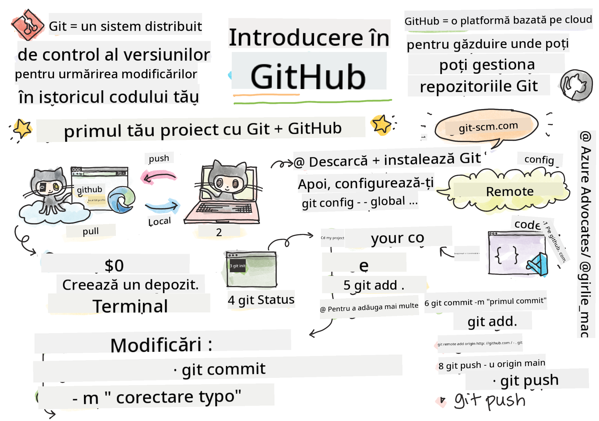

<!--
CO_OP_TRANSLATOR_METADATA:
{
  "original_hash": "361249da70432ddfd4741c917d1a6f50",
  "translation_date": "2025-08-29T11:41:01+00:00",
  "source_file": "1-getting-started-lessons/2-github-basics/README.md",
  "language_code": "ro"
}
-->
# Introducere în GitHub

Această lecție acoperă elementele de bază ale GitHub, o platformă pentru găzduirea și gestionarea modificărilor aduse codului tău.


> Sketchnote de [Tomomi Imura](https://twitter.com/girlie_mac)

## Chestionar înainte de lecție
[Chestionar înainte de lecție](https://ff-quizzes.netlify.app)

## Introducere

În această lecție, vom acoperi:

- urmărirea muncii pe care o faci pe mașina ta
- lucrul la proiecte împreună cu alții
- cum să contribui la software open source

### Cerințe preliminare

Înainte de a începe, trebuie să verifici dacă Git este instalat. În terminal, tastează:  
`git --version`

Dacă Git nu este instalat, [descarcă Git](https://git-scm.com/downloads). Apoi, configurează profilul local Git în terminal:
* `git config --global user.name "numele-tău"`
* `git config --global user.email "email-ul-tău"`

Pentru a verifica dacă Git este deja configurat, poți tasta:
`git config --list`

De asemenea, vei avea nevoie de un cont GitHub, un editor de cod (cum ar fi Visual Studio Code) și trebuie să deschizi terminalul (sau: command prompt).

Accesează [github.com](https://github.com/) și creează un cont dacă nu ai deja unul, sau conectează-te și completează profilul tău.

✅ GitHub nu este singurul depozit de cod din lume; există și altele, dar GitHub este cel mai cunoscut.

### Pregătire

Vei avea nevoie de un folder cu un proiect de cod pe mașina ta locală (laptop sau PC) și de un depozit public pe GitHub, care va servi ca exemplu pentru cum să contribui la proiectele altora.

---

## Gestionarea codului

Să presupunem că ai un folder local cu un proiect de cod și vrei să începi să îți urmărești progresul folosind git - sistemul de control al versiunilor. Unii oameni compară utilizarea git cu scrierea unei scrisori de dragoste către sinele tău din viitor. Citind mesajele de commit după zile, săptămâni sau luni, vei putea să îți amintești de ce ai luat o anumită decizie sau să "revii" la o modificare - asta dacă scrii mesaje de commit bune.

### Sarcină: Creează un depozit și comite cod  

> Vezi videoclipul
> 
> [](https://www.youtube.com/watch?v=9R31OUPpxU4)

1. **Creează un depozit pe GitHub**. Pe GitHub.com, în fila depozite sau din bara de navigare din dreapta sus, găsește butonul **new repo**.

   1. Dă un nume depozitului tău (folderului).
   1. Selectează **create repository**.

1. **Navighează la folderul tău de lucru**. În terminal, schimbă directorul la folderul pe care vrei să începi să îl urmărești. Tastează:

   ```bash
   cd [name of your folder]
   ```

1. **Inițializează un depozit git**. În proiectul tău, tastează:

   ```bash
   git init
   ```

1. **Verifică statusul**. Pentru a verifica statusul depozitului, tastează:

   ```bash
   git status
   ```

   output-ul poate arăta ceva de genul:

   ```output
   Changes not staged for commit:
   (use "git add <file>..." to update what will be committed)
   (use "git checkout -- <file>..." to discard changes in working directory)

        modified:   file.txt
        modified:   file2.txt
   ```

   De obicei, comanda `git status` îți spune lucruri precum ce fișiere sunt gata să fie _salvate_ în depozit sau ce fișiere au modificări pe care poate vrei să le persiști.

1. **Adaugă toate fișierele pentru urmărire**  
   Acest proces este numit și "staging files"/adăugarea fișierelor în zona de staging.

   ```bash
   git add .
   ```

   Argumentul `git add` plus `.` indică faptul că toate fișierele și modificările sunt pregătite pentru urmărire.

1. **Adaugă fișiere selectate pentru urmărire**

   ```bash
   git add [file or folder name]
   ```

   Acest lucru ne ajută să adăugăm doar fișierele selectate în zona de staging atunci când nu vrem să comitem toate fișierele deodată.

1. **Elimină toate fișierele din staging**

   ```bash
   git reset
   ```

   Această comandă ne ajută să eliminăm toate fișierele din staging deodată.

1. **Elimină un fișier specific din staging**

   ```bash
   git reset [file or folder name]
   ```

   Această comandă ne ajută să eliminăm doar un fișier specific din staging pe care nu vrem să îl includem în următorul commit.

1. **Persistă munca ta**. În acest punct, ai adăugat fișierele într-o zonă numită _staging area_. Un loc unde Git urmărește fișierele tale. Pentru a face modificarea permanentă, trebuie să _comitezi_ fișierele. Pentru a face acest lucru, creezi un _commit_ cu comanda `git commit`. Un _commit_ reprezintă un punct de salvare în istoria depozitului tău. Tastează următoarele pentru a crea un _commit_:

   ```bash
   git commit -m "first commit"
   ```

   Acest lucru comite toate fișierele tale, adăugând mesajul "first commit". Pentru mesajele de commit viitoare, vei dori să fii mai descriptiv pentru a transmite ce tip de modificare ai făcut.

1. **Conectează depozitul local Git cu GitHub**. Un depozit Git este util pe mașina ta, dar la un moment dat vei dori să ai un backup al fișierelor undeva și să inviți alte persoane să lucreze cu tine pe depozit. Un loc excelent pentru asta este GitHub. Am creat deja un depozit pe GitHub, așa că singurul lucru pe care trebuie să îl facem este să conectăm depozitul local Git cu GitHub. Comanda `git remote add` va face exact asta. Tastează următoarea comandă:

   > Notă, înainte de a tasta comanda, accesează pagina depozitului GitHub pentru a găsi URL-ul depozitului. Vei folosi acest URL în comanda de mai jos. Înlocuiește ```https://github.com/username/repository_name.git``` cu URL-ul GitHub.

   ```bash
   git remote add origin https://github.com/username/repository_name.git
   ```

   Aceasta creează o _remote_, sau conexiune, numită "origin", care indică spre depozitul GitHub pe care l-ai creat anterior.

1. **Trimite fișierele locale pe GitHub**. Până acum ai creat o _conexiune_ între depozitul local și depozitul GitHub. Să trimitem aceste fișiere pe GitHub cu următoarea comandă `git push`, astfel:

   > Notă, numele branch-ului tău poate fi diferit de ```main```.

   ```bash
   git push -u origin main
   ```

   Aceasta trimite commit-urile tale din branch-ul "main" pe GitHub.

2. **Adaugă mai multe modificări**. Dacă vrei să continui să faci modificări și să le trimiți pe GitHub, va trebui doar să folosești următoarele trei comenzi:

   ```bash
   git add .
   git commit -m "type your commit message here"
   git push
   ```

   > Sfat, Poate vrei să adopți un fișier `.gitignore` pentru a preveni ca fișierele pe care nu vrei să le urmărești să apară pe GitHub - cum ar fi acel fișier de notițe pe care îl stochezi în același folder, dar care nu are loc într-un depozit public. Poți găsi șabloane pentru fișiere `.gitignore` la [.gitignore templates](https://github.com/github/gitignore).

#### Mesaje de commit

Un subiect grozav pentru un commit Git completează următoarea propoziție:  
Dacă se aplică, acest commit va <subiectul tău aici>

Pentru subiect, folosește timpul prezent imperativ: "modifică" nu "modificat" sau "modificări".  
La fel ca în subiect, în corpul mesajului (opțional) folosește timpul prezent imperativ. Corpul ar trebui să includă motivația pentru modificare și să contrasteze aceasta cu comportamentul anterior. Explici `de ce`, nu `cum`.

✅ Ia câteva minute pentru a naviga pe GitHub. Poți găsi un mesaj de commit cu adevărat grozav? Poți găsi unul foarte minimal? Ce informații crezi că sunt cele mai importante și utile de transmis într-un mesaj de commit?

### Sarcină: Colaborează

Principalul motiv pentru a pune lucruri pe GitHub a fost să faci posibilă colaborarea cu alți dezvoltatori.

## Lucrul la proiecte împreună cu alții

> Vezi videoclipul
>
> [](https://www.youtube.com/watch?v=bFCM-PC3cu8)

În depozitul tău, navighează la `Insights > Community` pentru a vedea cum se compară proiectul tău cu standardele comunității recomandate.

   Iată câteva lucruri care pot îmbunătăți depozitul tău GitHub:
   - **Descriere**. Ai adăugat o descriere pentru proiectul tău?
   - **README**. Ai adăugat un README? GitHub oferă îndrumări pentru scrierea unui [README](https://docs.github.com/articles/about-readmes/?WT.mc_id=academic-77807-sagibbon).
   - **Ghid de contribuție**. Proiectul tău are [ghiduri de contribuție](https://docs.github.com/articles/setting-guidelines-for-repository-contributors/?WT.mc_id=academic-77807-sagibbon)?
   - **Cod de conduită**. Un [Cod de conduită](https://docs.github.com/articles/adding-a-code-of-conduct-to-your-project/).
   - **Licență**. Poate cel mai important, o [licență](https://docs.github.com/articles/adding-a-license-to-a-repository/)?

Toate aceste resurse vor ajuta la integrarea noilor membri ai echipei. Și acestea sunt, de obicei, lucrurile pe care noii contribuitori le analizează înainte de a se uita la codul tău, pentru a afla dacă proiectul tău este locul potrivit pentru a-și petrece timpul.

✅ Fișierele README, deși necesită timp pentru a fi pregătite, sunt adesea neglijate de mentori ocupați. Poți găsi un exemplu de README deosebit de descriptiv? Notă: există [instrumente pentru a ajuta la crearea de README-uri bune](https://www.makeareadme.com/) pe care s-ar putea să vrei să le încerci.

### Sarcină: Combină codul

Documentele de contribuție ajută oamenii să contribuie la proiect. Ele explică ce tipuri de contribuții cauți și cum funcționează procesul. Contribuitorii vor trebui să parcurgă o serie de pași pentru a putea contribui la depozitul tău pe GitHub:

1. **Fork-ul depozitului tău**. Probabil vei dori ca oamenii să _fork-eze_ proiectul tău. Fork-ul înseamnă crearea unei replici a depozitului tău pe profilul lor GitHub.
1. **Clonează**. De acolo, vor clona proiectul pe mașina lor locală.
1. **Creează un branch**. Vei dori să le ceri să creeze un _branch_ pentru munca lor.
1. **Concentrează modificarea pe o singură zonă**. Cere contribuitorilor să își concentreze contribuțiile pe un singur lucru la un moment dat - astfel șansele ca tu să poți _combina_ munca lor sunt mai mari. Imaginează-ți că scriu o corecție de bug, adaugă o funcționalitate nouă și actualizează mai multe teste - ce se întâmplă dacă vrei sau poți implementa doar 2 din 3 sau 1 din 3 modificări?

✅ Imaginează-ți o situație în care branch-urile sunt deosebit de critice pentru scrierea și livrarea unui cod bun. Ce cazuri de utilizare îți vin în minte?

> Notă, fii schimbarea pe care vrei să o vezi în lume și creează branch-uri pentru propria ta muncă. Orice commit-uri pe care le faci vor fi făcute pe branch-ul pe care ești în prezent "checked out". Folosește `git status` pentru a vedea pe ce branch te afli.

Să parcurgem un flux de lucru al contribuitorului. Presupunem că contribuitorul a _fork-at_ și _clonat_ depozitul, astfel încât are un depozit Git gata de lucru pe mașina sa locală:

1. **Creează un branch**. Folosește comanda `git branch` pentru a crea un branch care va conține modificările pe care intenționează să le contribuie:

   ```bash
   git branch [branch-name]
   ```

1. **Schimbă-te pe branch-ul de lucru**. Schimbă-te pe branch-ul specificat și actualizează directorul de lucru cu `git switch`:

   ```bash
   git switch [branch-name]
   ```

1. **Fă modificări**. În acest punct, vrei să adaugi modificările tale. Nu uita să îi spui lui Git despre ele cu următoarele comenzi:

   ```bash
   git add .
   git commit -m "my changes"
   ```

   Asigură-te că dai commit-ului tău un nume bun, atât pentru tine, cât și pentru mentorul depozitului pe care îl ajuți.

1. **Combină munca ta cu branch-ul `main`**. La un moment dat, ai terminat de lucrat și vrei să combini munca ta cu cea din branch-ul `main`. Branch-ul `main` s-ar putea să se fi schimbat între timp, așa că asigură-te că îl actualizezi mai întâi la cea mai recentă versiune cu următoarele comenzi:

   ```bash
   git switch main
   git pull
   ```

   În acest punct, vrei să te asiguri că orice _conflicte_, situații în care Git nu poate _combina_ ușor modificările, apar în branch-ul tău de lucru. Prin urmare, rulează următoarele comenzi:

   ```bash
   git switch [branch_name]
   git merge main
   ```

   Aceasta va aduce toate modificările din `main` în branch-ul tău și, sperăm, poți continua. Dacă nu, VS Code îți va spune unde Git este _confuz_ și doar modifici fișierele afectate pentru a indica ce conținut este cel mai precis.

1. **Trimite munca ta pe GitHub**. Trimiterea muncii tale pe GitHub înseamnă două lucruri. Pushing-ul branch-ului tău pe depozitul tău și apoi deschiderea unui PR, Pull Request.

   ```bash
   git push --set-upstream origin [branch-name]
   ```

   Comanda de mai sus creează branch-ul pe depozitul tău fork-at.

1. **Deschide un PR**. Următorul pas este să deschizi un PR. Faci asta navigând la depozitul fork-at pe GitHub. Vei vedea o indicație pe GitHub unde te întreabă dacă vrei să creezi un nou PR, dai click pe asta și vei fi dus la o interfață unde poți schimba titlul mesajului de commit, să îi dai o descriere mai potrivită. Acum mentorul depozitului pe care l-ai fork-at va vedea acest PR și _sperăm_ că îl va aprecia și va _combina_ PR-ul tău. Acum ești un contribuitor, yay :)

1. **Curăță**. Este considerat o practică bună să _curăți_ după ce ai combinat cu succes un PR. Vrei să cureți atât branch-ul local, cât și branch-ul pe care l-ai trimis pe GitHub. Mai întâi, să îl ștergem local cu următoarea comandă:

   ```bash
   git branch -d [branch-name]
   ```

   Asigură-te că accesezi pagina GitHub pentru depozitul fork-at și elimină branch-ul remote pe care tocmai l-ai trimis.
`Pull request` pare un termen ciudat, deoarece, în realitate, vrei să împingi modificările tale către proiect. Totuși, menținătorul (proprietarul proiectului) sau echipa de bază trebuie să analizeze modificările tale înainte de a le îmbina cu ramura "principală" a proiectului, așa că, de fapt, soliciți o decizie de modificare de la un menținător.

Un pull request este locul unde poți compara și discuta diferențele introduse pe o ramură, cu recenzii, comentarii, teste integrate și altele. Un pull request bun urmează, în mare parte, aceleași reguli ca un mesaj de commit. Poți adăuga o referință la o problemă din tracker-ul de probleme, de exemplu, atunci când munca ta rezolvă o problemă. Acest lucru se face folosind un `#` urmat de numărul problemei. De exemplu, `#97`.

🤞Sperăm că toate verificările trec și proprietarul/proprietarii proiectului îmbină modificările tale în proiect🤞

Actualizează ramura ta locală curentă cu toate commit-urile noi din ramura corespunzătoare de pe GitHub:

`git pull`

## Cum să contribui la open source

Mai întâi, să găsim un depozit (sau **repo**) pe GitHub care te interesează și la care ai dori să contribui cu o modificare. Vei dori să copiezi conținutul acestuia pe mașina ta.

✅ O modalitate bună de a găsi repo-uri 'prietenoase pentru începători' este să [cauți după eticheta 'good-first-issue'](https://github.blog/2020-01-22-browse-good-first-issues-to-start-contributing-to-open-source/).


Există mai multe modalități de a copia codul. O modalitate este să "clonezi" conținutul depozitului, folosind HTTPS, SSH sau GitHub CLI (Command Line Interface).

Deschide terminalul și clonează depozitul astfel:
`git clone https://github.com/ProjectURL`

Pentru a lucra la proiect, schimbă folderul:
`cd ProjectURL`

De asemenea, poți deschide întregul proiect folosind [Codespaces](https://github.com/features/codespaces), editorul de cod integrat / mediul de dezvoltare în cloud al GitHub, sau [GitHub Desktop](https://desktop.github.com/).

În cele din urmă, poți descărca codul într-un folder arhivat.

### Câteva lucruri interesante despre GitHub

Poți să dai stea, să urmărești și/sau să "forkezi" orice depozit public pe GitHub. Poți găsi depozitele marcate cu stea în meniul drop-down din dreapta sus. Este ca și cum ai salva un bookmark, dar pentru cod.

Proiectele au un tracker de probleme, de obicei pe GitHub, în fila "Issues", dacă nu este indicat altfel, unde oamenii discută probleme legate de proiect. Iar fila Pull Requests este locul unde oamenii discută și revizuiesc modificările aflate în progres.

Proiectele pot avea, de asemenea, discuții în forumuri, liste de e-mail sau canale de chat precum Slack, Discord sau IRC.

✅ Aruncă o privire în noul tău repo GitHub și încearcă câteva lucruri, cum ar fi editarea setărilor, adăugarea de informații în repo-ul tău și crearea unui proiect (cum ar fi un panou Kanban). Sunt multe lucruri pe care le poți face!

---

## 🚀 Provocare

Lucrează împreună cu un prieten la codul fiecăruia. Creați un proiect colaborativ, faceți fork la cod, creați ramuri și îmbinați modificările.

## Quiz post-lectură
[Quiz post-lectură](https://ff-quizzes.netlify.app/web/en/)

## Recapitulare & Studiu individual

Citește mai multe despre [contribuția la software open source](https://opensource.guide/how-to-contribute/#how-to-submit-a-contribution).

[Git cheatsheet](https://training.github.com/downloads/github-git-cheat-sheet/).

Exersează, exersează, exersează. GitHub are trasee de învățare excelente disponibile prin [skills.github.com](https://skills.github.com):

- [Prima săptămână pe GitHub](https://skills.github.com/#first-week-on-github)

Vei găsi și cursuri mai avansate.

## Temă

Completează [cursul Prima săptămână pe GitHub](https://skills.github.com/#first-week-on-github)

---

**Declinarea responsabilității**:  
Acest document a fost tradus utilizând serviciul de traducere AI [Co-op Translator](https://github.com/Azure/co-op-translator). Deși depunem eforturi pentru a asigura acuratețea, vă rugăm să aveți în vedere că traducerile automate pot conține erori sau inexactități. Documentul original în limba sa nativă ar trebui considerat sursa autoritară. Pentru informații critice, se recomandă traducerea realizată de un profesionist uman. Nu ne asumăm răspunderea pentru eventualele neînțelegeri sau interpretări greșite care pot apărea din utilizarea acestei traduceri.