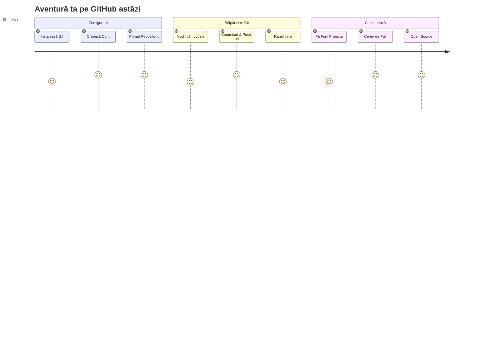
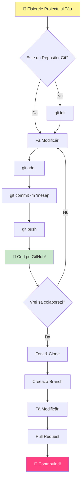
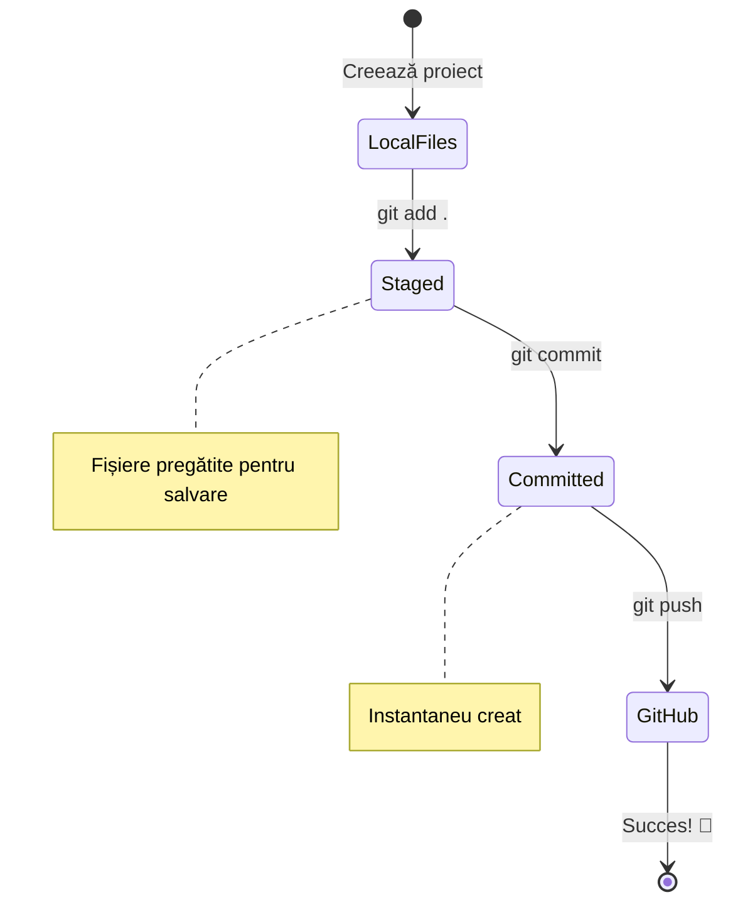
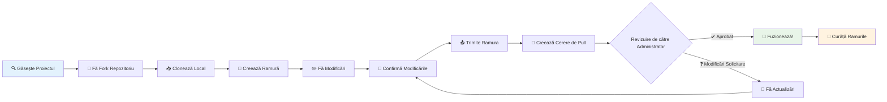
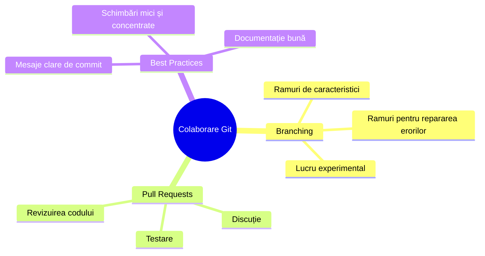
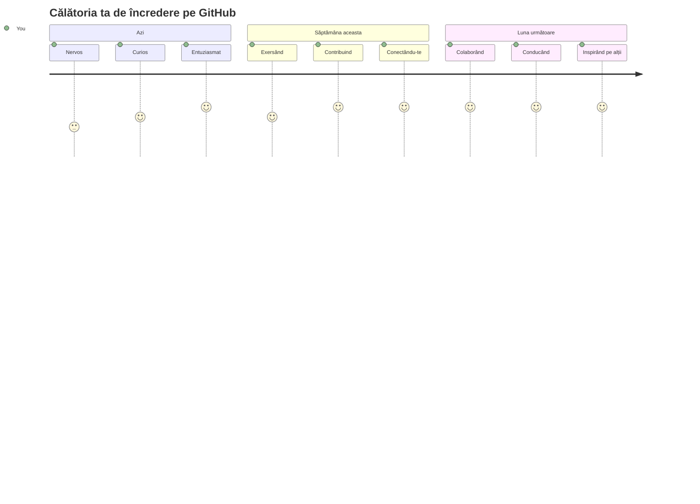

<!--
CO_OP_TRANSLATOR_METADATA:
{
  "original_hash": "5c383cc2cc23bb164b06417d1c107a44",
  "translation_date": "2026-01-07T06:22:01+00:00",
  "source_file": "1-getting-started-lessons/2-github-basics/README.md",
  "language_code": "ro"
}
-->
# Introducere în GitHub

Salut, viitor dezvoltator! 👋 Ești gata să te alături milioanelor de programatori din întreaga lume? Sunt cu adevărat entuziasmat să-ți prezint GitHub – gândește-l ca o platformă de social media pentru programatori, doar că în loc să împărtășim poze cu prânzul nostru, împărtășim cod și construim lucruri incredibile împreună!

Iată ce mă uimește total: fiecare aplicație de pe telefonul tău, fiecare site pe care îl vizitezi și majoritatea uneltelor pe care le vei învăța să le folosești au fost construite de echipe de dezvoltatori care colaborează pe platforme exact ca GitHub. Acea aplicație de muzică pe care o iubești? Cineva ca tine a contribuit la ea. Jocul acela pe care nu-l poți lăsa din mână? Da, probabil a fost creat cu colaborare pe GitHub. Și acum TU vei învăța cum să faci parte din acea comunitate uimitoare!

Știu că la început poate părea mult – Doamne, îmi amintesc că mă uitam la prima mea pagină GitHub gândindu-mă „Ce naiba înseamnă toate astea?” Dar iată chestia: fiecare dezvoltator a început exact de unde ești tu acum. La sfârșitul acestei lecții, vei avea propriul tău repository GitHub (gândește-l ca un portofoliu personal în cloud) și vei ști cum să-ți salvezi munca, să o împărtășești altora și chiar să contribui la proiecte pe care milioane de oameni le folosesc.

Vom parcurge acest drum împreună, pas cu pas. Fără grabă, fără presiune – doar tu, eu și niște unelte super tari care urmează să devină cei mai buni prieteni ai tăi!


> Schiță realizată de [Tomomi Imura](https://twitter.com/girlie_mac)


## Test de dinaintea lecției
[Test de dinaintea lecției](https://ff-quizzes.netlify.app)

## Introducere

Înainte să începem cu partea cu adevărat interesantă, hai să pregătim calculatorul tău pentru magia GitHub! Gândește-te la asta ca la organizarea uneltelor artistice înainte de a crea o capodoperă – având uneltele potrivite gata pregătite, totul merge mult mai lin și mult mai plăcut.

Voi parcurge fiecare pas de configurare personal, și promit că nu este la fel de intimidant pe cât pare la prima vedere. Dacă ceva nu iese imediat cum te aștepți, e complet normal! Îmi amintesc cum am configurat prima mea bază de dezvoltare și mă simțeam ca și cum încercam să citesc hieroglife antice. Fiecare dezvoltator a fost exact unde ești tu acum, întrebându-se dacă face totul corect. Spoiler: dacă ești aici să înveți, deja faci totul bine! 🌟

În această lecție vom acoperi:

- cum să urmărești munca făcută pe calculatorul tău
- cum să lucrezi la proiecte împreună cu alții
- cum să contribui la software open source

### Cerințe preliminare

Hai să pregătim calculatorul tău pentru magia GitHub! Nu te îngrijora – această configurare trebuie făcută o singură dată, iar apoi vei fi gata pentru întreaga ta călătorie în programare.

Bine, să începem cu baza! Mai întâi trebuie să vedem dacă Git este deja instalat pe calculatorul tău. Git este practic ca un asistent super-deștept care își amintește fiecare modificare pe care o faci la cod – mult mai bine decât să apeși frenetic Ctrl+S la fiecare două secunde (am fost cu toții acolo!).

Haide să vedem dacă Git este deja instalat tastând această comandă magică în terminalul tău:
`git --version`

Dacă Git nu este încă instalat, nicio problemă! Mergi pe [download Git](https://git-scm.com/downloads) și descarcă-l. După ce l-ai instalat, trebuie să îl configurezi cum trebuie:

> 💡 **Configurare pentru prima dată**: Aceste comenzi spun Git cine ești. Aceste informații vor fi atașate fiecărui commit pe care îl faci, așa că alege un nume și un email pe care ești confortabil să le împărtășești public.

```bash
git config --global user.name "your-name"
git config --global user.email "your-email"
```

Pentru a verifica dacă Git este deja configurat, poți tasta:
```bash
git config --list
```

Vei avea nevoie și de un cont GitHub, un editor de cod (cum ar fi Visual Studio Code) și trebuie să deschizi terminalul (sau: command prompt).

Accesează [github.com](https://github.com/) și creează-ți un cont dacă nu ai deja sau autentifică-te și completează-ți profilul.

💡 **Sfat modern**: Ia în considerare configurarea [cheilor SSH](https://docs.github.com/en/authentication/connecting-to-github-with-ssh) sau folosirea [GitHub CLI](https://cli.github.com/) pentru autentificare mai ușoară, fără parole.

✅ GitHub nu este singurul depozit de cod din lume; mai există și altele, dar GitHub este cel mai cunoscut

### Pregătire

Vei avea nevoie atât de un folder cu un proiect de cod pe calculatorul tău (laptop sau PC), cât și de un repository public pe GitHub, care va servi ca exemplu pentru cum să contribui la proiectele altora.

### Păstrarea codului în siguranță

Hai să vorbim un pic despre securitate – dar nu te îngrijora, nu te vom copleși cu chestii înfricoșătoare! Gândește-te la aceste practici de securitate ca la încuietoarea mașinii sau a casei tale. Sunt obiceiuri simple care devin a doua natură și îți protejează munca muncitoare.

Îți vom arăta metodele moderne, sigure de a lucra cu GitHub încă de la început. Astfel, vei dezvolta obiceiuri bune care te vor ajuta pe toată durata carierei tale în programare.

Când lucrezi cu GitHub, e important să urmezi cele mai bune practici de securitate:

| Domeniul Securității | Cea Mai Bună Practică | De Ce Contează |
|----------------------|----------------------|----------------|
| **Autentificare** | Folosește chei SSH sau Token-uri de Acces Personal | Parolele sunt mai puțin sigure și sunt eliminate treptat |
| **Autentificare în 2 pași** | Activează 2FA pe contul tău GitHub | Adaugă un strat suplimentar de protecție contului tău |
| **Securitatea Repository-ului** | Niciodată să nu faci commit cu informații sensibile | Cheile API și parolele nu trebuie să fie niciodată în repo-uri publice |
| **Gestionarea Dependențelor** | Activează Dependabot pentru actualizări | Ține dependențele tale în siguranță și actualizate |

> ⚠️ **Avertisment critic de securitate**: Nu face niciodată commit cu chei API, parole sau alte informații sensibile în vreun repository. Folosește variabile de mediu și fișiere `.gitignore` pentru a proteja aceste date.

**Configurare modernă a autentificării:**

```bash
# Generează cheia SSH (algoritm modern ed25519)
ssh-keygen -t ed25519 -C "your_email@example.com"

# Configurează Git să utilizeze SSH
git remote set-url origin git@github.com:username/repository.git
```

> 💡 **Sfat de expert**: Cheile SSH elimină necesitatea de a introduce parola de mai multe ori și sunt mai sigure decât metodele tradiționale de autentificare.

---

## Gestionarea codului tău ca un profesionist

Okay, AICI începe cu adevărat distracția! 🎉 Urmează să învățăm cum să urmărești și să gestionezi codul tău ca un profesionist și, sincer, aceasta este una dintre lucrurile mele preferate de predat pentru că schimbă total jocul.

Imaginează-ți că scrii o poveste uimitoare și vrei să urmărești fiecare schiță, fiecare editare genială și fiecare moment de „așteaptă, asta e genial!” pe parcurs. Exact asta face Git pentru codul tău! E ca și cum ai avea cel mai incredibil caiet călător în timp care își amintește TOT – fiecare apăsare de tastă, fiecare schimbare, fiecare moment de „ups, asta a stricat tot” pe care îl poți anula instantaneu.

Să fiu sincer – la început poate părea copleșitor. Când am început, mă gândeam „De ce nu pot doar să salvez fișierele ca în mod normal?” Dar crede-mă: odată ce Git va face clic pentru tine (și o va face!), vei avea un moment de revelație în care te vei întreba „Cum am codificat FĂRĂ asta vreodată?” E ca și cum ai descoperi că poți zbura după ce ai umblat pe jos toată viața!

Să spunem că ai un folder local cu un proiect de cod și vrei să începi să-ți urmărești progresul folosind git - sistemul de control al versiunilor. Unii oameni compară folosirea git cu scrierea unei scrisori de dragoste către sinele lor viitor. Citind mesajele de commit după zile, săptămâni sau luni, vei putea să-ți amintești de ce ai luat anumite decizii sau să faci „rollback” la o schimbare – asta înseamnă când scrii mesaje bune de commit.


### Sarcina: Creează primul tău repository!

> 🎯 **Misiunea ta (și sunt atât de entuziasmat pentru tine!)**: Vom crea împreună primul tău repository GitHub! Până ajungem în punctul final, vei avea un colț al tău pe internet unde locuiește codul tău și vei fi făcut primul „commit” (asta în limbajul programatorilor înseamnă să-ți salvezi munca într-un mod cu adevărat inteligent).
>
> Acesta este un moment foarte special – ești pe punctul de a te alătura oficial comunității globale de dezvoltatori! Îmi amintesc emoția pe care am simțit-o când am creat primul meu repo și am gândit „Wow, chiar fac asta!”

Să parcurgem această aventură împreună, pas cu pas. Ia-ți tot timpul de care ai nevoie pentru fiecare parte – nu există vreun premiu pentru grabă, iar promit că fiecare pas va avea sens. Amintește-ți, fiecare star al programării pe care îl admiri a stat la fel ca tine, pe punctul de a-și crea primul repository. Cât de tare e asta?

> Vezi video
> 
> [](https://www.youtube.com/watch?v=9R31OUPpxU4)

**Facem asta împreună:**

1. **Creează repository-ul tău pe GitHub**. Mergi pe GitHub.com și caută butonul verde strălucitor **New** (sau semnul **+** din colțul dreapta sus). Click pe el și selectează **New repository**.

   Iată ce trebuie să faci:
   1. Dă repository-ului tău un nume – alege unul care să aibă sens pentru tine!
   1. Adaugă o descriere dacă vrei (ajută pe alții să înțeleagă despre ce este proiectul tău)
   1. Decide dacă dorești să fie public (orice poate vedea) sau privat (doar pentru tine)
   1. Îți recomand să bifezi caseta pentru a adăuga un fișier README – e ca pagina principală a proiectului tău
   1. Click pe **Create repository** și sărbătorește – tocmai ți-ai creat primul repo! 🎉

2. **Navighează către folderul proiectului tău**. Acum hai să deschidem terminalul tău (nu te speria, nu e chiar așa înfricoșător!). Trebuie să-i spui calculatorului unde sunt fișierele proiectului. Tastează această comandă:

   ```bash
   cd [name of your folder]
   ```

   **Ce facem aici:**
   - Practic îi spunem calculatorului „Hei, du-mă în folderul proiectului meu”
   - E ca și cum ai deschide un folder specific pe desktop, dar o facem prin comenzi text
   - Înlocuiește `[name of your folder]` cu numele real al folderului proiectului tău

3. **Transformă folderul într-un repository Git**. Aici începe magia! Tastează:

   ```bash
   git init
   ```

   **Iată ce tocmai s-a întâmplat (lucruri tare cool!):**
   - Git tocmai a creat un folder ascuns `.git` în proiectul tău – nu îl vei vedea, dar este acolo!
   - Folderul tău normal este acum un „repository” care poate urmări fiecare schimbare făcută
   - Gândește-te la asta ca și cum folderul tău a primit superputeri să-și amintească totul

4. **Verifică ce se întâmplă**. Hai să vedem ce spune Git despre proiectul tău acum:

   ```bash
   git status
   ```

   **Ce înseamnă ce-ți spune Git:**
   
   Ai putea vedea ceva asemănător cu asta:

   ```output
   Changes not staged for commit:
   (use "git add <file>..." to update what will be committed)
   (use "git restore <file>..." to discard changes in working directory)

        modified:   file.txt
        modified:   file2.txt
   ```

   **Nu te panica! Iată ce înseamnă:**
   - Fișierele în **roșu** sunt cele cu modificări, dar care încă nu sunt gata să fie salvate
   - Fișierele în **verde** (când le vezi) sunt gata să fie salvate
   - Git te ajută spunându-ți exact ce poți face în continuare

   > 💡 **Sfat de expert**: Comanda `git status` este cel mai bun prieten al tău! Folosește-o ori de câte ori ești confuz despre ce se întâmplă. E ca și cum l-ai întreba pe Git „Hei, care e situația acum?”

5. **Pregătește fișierele pentru salvare** (asta se numește „staging”):

   ```bash
   git add .
   ```

   **Ce am făcut acum:**
   - Am spus Git „Hey, vreau să includ TOATE fișierele mele în următorul save”
   - `.` înseamnă „tot ce e în acest folder”
   - Acum fișierele tale sunt „staged” și gata pentru pasul următor

   **Vrei să fii mai selectiv?** Poți să adaugi doar anumite fișiere:

   ```bash
   git add [file or folder name]
   ```

   **De ce ai vrea să faci asta?**
   - Uneori vrei să salvezi schimbări legate între ele, împreună
   - Te ajută să-ți organizezi munca în părți logice
   - Face mai ușor să înțelegi ce s-a schimbat și când

   **Ți-ai schimbat părerea?** Nicio problemă! Poți scoate fișierele din staging astfel:

   ```bash
   # Elimină totul din stagiu
   git reset
   
   # Elimină din stagiu doar un singur fișier
   git reset [file name]
   ```

   Nu-ți face griji – asta nu șterge munca ta, doar scoate fișierele din lista de „ready to save”.

6. **Salvează munca definitiv** (făcând primul commit!):

   ```bash
   git commit -m "first commit"
   ```

   **🎉 Felicitări! Tocmai ai făcut primul tău commit!**
   
   **Iată ce s-a întâmplat:**
   - Git a luat o „fotografie” a tuturor fișierelor staged în acest moment exact
   - Mesajul tău de commit „first commit” explică despre ce e acest punct de salvare
   - Git a dat acestei fotografii un ID unic ca să o poți găsi oricând mai târziu
   - Ai început oficial să urmărești istoria proiectului tău!

   > 💡 **Mesaje pentru viitoarele commit-uri**: Pentru următoarele commit-uri, fii mai descriptiv! În loc de „updated stuff”, încearcă „Add contact form to homepage” sau „Fix navigation menu bug”. Sinele tău viitor îți va mulțumi!

7. **Conectează proiectul local la GitHub**. Acum proiectul tău există doar pe calculatorul tău. Hai să-l conectăm la repository-ul tău de pe GitHub ca să poți să-l împărtășești cu lumea!

   Mai întâi, mergi la pagina repository-ului tău GitHub și copiază URL-ul. Apoi revino aici și tastează:

   ```bash
   git remote add origin https://github.com/username/repository_name.git
   ```
   
   (Înlocuiește acel URL cu URL-ul real al repository-ului tău!)

   **Ce am făcut acum:**
   - Am creat o conexiune între proiectul tău local și depozitul tău GitHub
   - „Origin” este doar un nickname pentru depozitul tău GitHub – este ca și cum ai adăuga un contact în telefonul tău
   - Acum Git-ul local știe unde să trimită codul tău când ești gata să-l partajezi

   💡 **Mod mai simplu**: Dacă ai instalat GitHub CLI, poți face asta într-o singură comandă:
   ```bash
   gh repo create my-repo --public --push --source=.
   ```

8. **Trimite-ți codul către GitHub** (momentul cel mare!):

   ```bash
   git push -u origin main
   ```

   **🚀 Asta este! Îți încarci codul pe GitHub!**
   
   **Ce se întâmplă:**
   - Commit-urile tale călătoresc de pe calculatorul tău către GitHub
   - Flag-ul `-u` stabilește o conexiune permanentă, astfel încât viitoarele push-uri vor fi mai simple
   - „main” este numele ramurii tale principale (ca un dosar principal)
   - După asta, poți doar să scrii `git push` pentru încărcări viitoare!

   💡 **Notă rapidă**: Dacă ramura ta se numește altfel (ex: „master”), folosește acel nume. Poți verifica cu `git branch --show-current`.

9. **Ritmul tău zilnic de coding** (aici devine captivant!):

   De acum încolo, de fiecare dată când faci modificări în proiectul tău, ai această rutină simplă în trei pași:

   ```bash
   git add .
   git commit -m "describe what you changed"
   git push
   ```

   **Acesta devine ritmul tău de lucru:**
   - Fă niște modificări grozave la codul tău ✨
   - Etichetează-le cu `git add` („Hei Git, fii atent la aceste modificări!”)
   - Salvează-le cu `git commit` și un mesaj descriptiv (tu din viitor îți vei mulțumi!)
   - Împarte-le cu lumea folosind `git push` 🚀
   - Repetă – serios, devine la fel de natural ca respirația!

   Îmi place acest flux de lucru pentru că este ca și cum ai avea multiple puncte de salvare într-un joc video. Ai făcut o schimbare pe care o iubești? Commit-eaz-o! Vrei să încerci ceva riscant? Nicio problemă – poți oricând să te întorci la ultimul commit dacă ceva nu merge bine!

   > 💡 **Sfat**: Ai putea dori să adopți un fișier `.gitignore` pentru a preveni afișarea pe GitHub a fișierelor pe care nu dorești să le urmărești – cum ar fi fișierul de notițe pe care îl stochezi în același dosar, dar care nu-și are locul într-un depozit public. Poți găsi șabloane pentru fișiere `.gitignore` la [.gitignore templates](https://github.com/github/gitignore) sau poți crea unul folosind [gitignore.io](https://www.toptal.com/developers/gitignore).

### 🧠 **Prima înregistrare în depozit: Cum te-ai simțit?**

**Ia un moment să celebrezi și să reflectezi:**
- Cum te-ai simțit când ți-ai văzut codul afișat pentru prima dată pe GitHub?
- Care etapă ți s-a părut cea mai confuză și care surprinzător de ușoară?
- Poți explica în cuvintele tale diferența dintre `git add`, `git commit` și `git push`?


> **Amintește-ți**: Chiar și dezvoltatorii experimentați uneori uită comenzile exacte. A face acest flux de lucru să devină memorie musculară necesită practică – te descurci grozav!

#### Fluxuri moderne de lucru cu Git

Ia în considerare adoptarea acestor practici moderne:

- **Conventional Commits**: Folosește un format standardizat pentru mesajele de commit, cum ar fi `feat:`, `fix:`, `docs:`, etc. Află mai multe la [conventionalcommits.org](https://www.conventionalcommits.org/)
- **Commit-uri atomice**: Fă ca fiecare commit să reprezinte o singură schimbare logică
- **Commit-uri frecvente**: Commit-ează des cu mesaje descriptive, nu rar cu schimbări uriașe

#### Mesaje de commit

Un subiect bun pentru un commit Git completează următoarea propoziție:
Dacă se aplică, acest commit va <subiectul tău aici>

Pentru subiect folosește imperativul, prezentul: „schimbă” nu „schimbat” sau „schimbări”. 
La fel ca în subiect, și în corpul mesajului (opțional) folosește imperativul, prezentul. Corpul trebuie să includă motivația schimbării și să contrasteze cu comportamentul anterior. Explici de ce, nu cum.

✅ Petrece câteva minute navigând pe GitHub. Poți găsi un mesaj de commit foarte bun? Poți găsi unul foarte minimal? Ce informații crezi că sunt cele mai importante și utile pentru un mesaj de commit?

## Lucrul cu alții (Partea Distractivă!)

Ține-ți pălăria pentru că AICI GitHub devine cu adevărat magic! 🪄 Ai învățat să-ți gestionezi propriul cod, dar acum intrăm în partea mea preferată – colaborarea cu oameni minunați din toată lumea.

Imaginează-ți asta: te trezești mâine și vezi că cineva din Tokyo ți-a îmbunătățit codul în timp ce dormeai. Apoi cineva din Berlin repară un bug care te-a blocat. Până după-amiază, un dezvoltator din São Paulo adaugă o funcționalitate la care nici nu te-ai gândit. Nu este științifico-fantastic – asta este doar o zi obișnuită în universul GitHub!

Ce mă entuziasmează cu adevărat este că abilitățile de colaborare pe care urmează să le înveți? Acestea sunt exact aceleași fluxuri de lucru pe care le folosesc echipele de la Google, Microsoft și startup-urile tale preferate în fiecare zi. Nu înveți doar un instrument tare – înveți limbajul secret care face întregul univers software să funcționeze împreună.

Serios, odată ce simți emoția să primești primul tău pull request combinat, vei înțelege de ce dezvoltatorii sunt atât de pasionați de open source. Este ca și cum ai face parte din cel mai mare și mai creativ proiect de echipă din lume!

> Vezi video
>
> [](https://www.youtube.com/watch?v=bFCM-PC3cu8)

Motivul principal pentru a pune lucruri pe GitHub a fost să faci posibilă colaborarea cu alți dezvoltatori.


În depozitul tău, navighează la `Insights > Community` pentru a vedea cum se compară proiectul tău cu standardele recomandate ale comunității.

Vrei să faci depozitul tău să arate profesional și primitor? Mergi la depozitul tău și apasă pe `Insights > Community`. Această funcție interesantă îți arată cum se compară proiectul tău cu ceea ce comunitatea GitHub consideră „bune practici pentru depozite.”

> 🎯 **Fă-ți proiectul să strălucească**: Un depozit bine organizat cu documentație bună este ca o vitrină curată și primitoare. Arată oamenilor că îți pasă de munca ta și îi face pe alții să vrea să contribuie!

**Iată ce face un depozit minunat:**

| Ce să adaugi | De ce este important | Ce îți aduce ție |
|-------------|---------------------|-----------------|
| **Descriere** | Prima impresie contează! | Oamenii știu instant ce face proiectul tău |
| **README** | Pagina principală a proiectului | Ca un ghid prietenos pentru vizitatorii noi |
| **Reguli de contribuție** | Arată că primești cu drag ajutor | Oamenii știu exact cum te pot ajuta |
| **Cod de conduită** | Creează un spațiu prietenos | Toată lumea se simte binevenită să participe |
| **Licență** | Claritate legală | Alții știu cum pot folosi codul tău |
| **Politică de securitate** | Arată că ești responsabil | Demonstrează practici profesionale |

> 💡 **Sfat profesionist**: GitHub oferă șabloane pentru toate aceste fișiere. Când creezi un nou depozit, bifează casetele pentru a genera automat aceste fișiere.

**Funcționalități moderne GitHub de explorat:**

🤖 **Automatizare & CI/CD:**
- **GitHub Actions** pentru testare și implementare automate
- **Dependabot** pentru actualizări automate ale dependențelor

💬 **Comunitate & gestionarea proiectelor:**
- **GitHub Discussions** pentru conversații comunitare dincolo de probleme
- **GitHub Projects** pentru management de proiect în stil kanban
- **Reguli de protecție a ramurilor** pentru a impune standarde de calitate a codului


Toate aceste resurse vor ajuta în integrarea noilor membri ai echipei. Și acestea sunt de obicei lucrurile pe care contribuitorii noi le verifică înainte să se uite în codul tău, pentru a vedea dacă proiectul tău este locul potrivit unde să-și petreacă timpul.

✅ Fișierele README, deși necesită timp pentru pregătire, sunt uneori neglijate de mentori ocupați. Poți găsi un exemplu de README deosebit de descriptiv? Notă: există unele [instrumente care ajută la crearea unor README bune](https://www.makeareadme.com/) pe care ai putea dori să le încerci.

### Sarcină: Combină codul

Documentația pentru contribuții ajută oamenii să contribuie la proiect. Explică ce tipuri de contribuții cauți și cum funcționează procesul. Contributorii vor trebui să parcurgă o serie de pași pentru a putea contribui la repo-ul tău pe GitHub:

1. **Fork-ul repo-ului tău** Probabil vei dori ca oamenii să _fork-uiască_ proiectul tău. Fork înseamnă crearea unei replici a depozitului tău în profilul lor GitHub.
1. **Clone**. De acolo vor clona proiectul pe mașina lor locală. 
1. **Crearea unei ramuri**. Le vei cere să creeze o _ramură_ pentru munca lor. 
1. **Focalizează schimbările într-o singură zonă**. Cere colaboratorilor să-și concentreze contribuțiile pe câte un lucru odată – așa șansele să poți _combina_ munca lor sunt mai mari. Imaginează-ți că scriu un fix de bug, adaugă o funcționalitate nouă și actualizează mai multe teste – ce se întâmplă dacă vrei să implementezi, sau poți să implementezi, doar 2 din 3 sau 1 din 3 schimbări?

✅ Imaginează-ți o situație în care ramurile sunt deosebit de critice pentru scrierea și livrarea unui cod bun. Ce cazuri de utilizare îți vin în minte?

> Ține minte, fii schimbarea pe care vrei să o vezi în lume și creează ramuri și pentru munca ta personală. Orice commit vei face va fi în ramura pe care ești „checked out” momentan. Folosește `git status` să vezi care este ramura.

Hai să trecem prin fluxul de lucru al unui contributor. Presupunem că contributorul a _fork-uit_ și _clonat_ deja repo-ul astfel încât are un repo Git gata de lucru pe mașina locală:

1. **Crearea unei ramuri**. Folosește comanda `git branch` pentru a crea o ramură care va conține schimbările pe care vrea să le contribuie:

   ```bash
   git branch [branch-name]
   ```

   > 💡 **Abordare modernă**: Poți crea și comuta la noua ramură într-o singură comandă:
   ```bash
   git switch -c [branch-name]
   ```

1. **Comută la ramura de lucru**. Comută la ramura specificată și actualizează directorul de lucru cu `git switch`:

   ```bash
   git switch [branch-name]
   ```

   > 💡 **Notă modernă**: `git switch` este înlocuitorul modern pentru `git checkout` când schimbi ramurile. Este mai clar și mai sigur pentru începători.

1. **Lucrează**. Acum vrei să adaugi modificările. Nu uita să spui Git-ului prin următoarele comenzi:

   ```bash
   git add .
   git commit -m "my changes"
   ```

   > ⚠️ **Calitatea mesajului de commit**: Asigură-te că dai un nume bun commit-ului tău, atât pentru tine cât și pentru mentoul repo-ului la care contribui. Fii specific despre ce ai schimbat!

1. **Combină munca ta cu ramura `main`**. La un moment dat termini de lucrat și vrei să-ți combini munca cu cea de pe ramura `main`. Aceasta s-ar fi putut schimba între timp, așa că mai întâi asigură-te că o actualizezi la cea mai recentă versiune cu următoarele comenzi:

   ```bash
   git switch main
   git pull
   ```

   Acum vrei să te asiguri că orice _conflict_, situații în care Git nu poate ușor să _combine_ schimbările, apar în ramura ta de lucru. Așadar, rulează următoarele comenzi:

   ```bash
   git switch [branch_name]
   git merge main
   ```

   Comanda `git merge main` va aduce toate schimbările din `main` în ramura ta. Sperăm că poți continua direct. Dacă nu, VS Code îți spune unde Git este _confuz_ și trebuie doar să modifici fișierele afectate pentru a spune ce conținut este cel mai corect.

   💡 **Alternativă modernă**: Ia în considerare folosirea `git rebase` pentru un istoric mai curat:
   ```bash
   git rebase main
   ```
   Aceasta va „reproduce” commit-urile tale deasupra celei mai recente ramuri main, creând un istoric liniar.

1. **Trimite munca ta pe GitHub**. A trimite munca pe GitHub înseamnă două lucruri. Să faci push ramurii tale pe repo-ul tău și apoi să deschizi un PR, Pull Request.

   ```bash
   git push --set-upstream origin [branch-name]
   ```

   Comanda de mai sus creează ramura pe repo-ul tău fork-uit.

### 🤝 **Verificare abilități colaborare: Ești gata să lucrezi cu alții?**

**Hai să vedem cum te simți în legătură cu colaborarea:**
- Acum are sens pentru tine ideea de fork și pull requests?
- Care este un lucru despre lucrul cu ramuri pe care vrei să-l practici mai mult?
- Cât de confortabil te simți cu ideea de a contribui la un proiect al altcuiva?


> **Boost de încredere**: Toți dezvoltatorii pe care îi admiri au fost odată emoționați de primul lor pull request. Comunitatea GitHub este incredibil de primitoare cu începătorii!

1. **Deschide un PR**. Apoi, vrei să deschizi un PR. Faci asta navigând la repo-ul fork-uit pe GitHub. Vei vedea o indicație pe GitHub unde te întreabă dacă vrei să creezi un PR nou, faci click și ajungi într-o interfață unde poți schimba titlul mesajului de commit, da o descriere mai potrivită. Acum mentoul repo-ului pe care l-ai fork-uit va vedea acest PR și, _mâini încrucișate_, îl va aprecia și _îl va combina_. Acum ești contributor, yay :)

   💡 **Sfat modern**: Poți crea PR-uri și folosind GitHub CLI:
   ```bash
   gh pr create --title "Your PR title" --body "Description of changes"
   ```

   🔧 **Cele mai bune practici pentru PR-uri**:
   - Leagă PR-uri de probleme aferente folosind cuvinte cheie ca „Fixes #123”
   - Adaugă capturi de ecran pentru schimbări de UI
   - Cere recenzori specifici
   - Folosește PR-uri draft pentru muncă în progres
   - Asigură-te că toate verificările CI trec înainte să ceri review
1. **Curățare**. Este considerat o bună practică să faci _curățenie_ după ce fuzionezi cu succes un PR. Vrei să cureți atât ramura locală, cât și ramura pe care ai făcut push pe GitHub. Mai întâi, să o ștergem local cu următoarea comandă: 

   ```bash
   git branch -d [branch-name]
   ```

   Asigură-te că mergi pe pagina GitHub a repo-ului fork-uit și ștergi ramura remote pe care tocmai ai făcut push.

`Pull request` pare un termen ciudat, pentru că de fapt vrei să împingi schimbările tale către proiect. Dar întreținătorul (proprietarul proiectului) sau echipa principală trebuie să ia în considerare schimbările tale înainte să le îmbine cu ramura "main" a proiectului, deci într-adevăr ceri o decizie privind schimbarea de la un întreținător.

Un pull request este locul unde compari și discuți diferențele introduse pe o ramură cu recenzii, comentarii, teste integrate și altele. Un pull request bun urmează aproximativ aceleași reguli ca și un mesaj de commit. Poți adăuga o referință la o problemă din urmăritorul de issues, când munca ta de exemplu rezolvă o problemă. Aceasta se face folosind un `#` urmat de numărul problemei tale. De exemplu `#97`.

🤞Degetele încrucișate să treacă toate verificările și ca proprietarii proiectului să îți fuzioneze schimbările în proiect🤞

Actualizează-ți ramura locală de lucru curentă cu toate commit-urile noi din ramura corespondentă remote pe GitHub:

`git pull`

## Contribuind la Open Source (Șansa ta de a face o diferență!)

Ești gata pentru ceva care îți va exploda mintea complet? 🤯 Hai să vorbim despre contribuția la proiecte open source – și mi se face pielea de găină doar gândindu-mă să împărtășesc asta cu tine!

Aceasta este șansa ta să devii parte din ceva cu adevărat extraordinar. Imaginează-ți că îmbunătățești instrumentele pe care milioane de dezvoltatori le folosesc zi de zi sau rezolvi un bug într-o aplicație pe care prietenii tăi o iubesc. Nu este doar un vis – asta înseamnă contribuția la open source!

Iată ce mă emoționează de fiecare dată când mă gândesc la asta: fiecare instrument pe care l-ai învățat până acum – editorul tău de cod, framework-urile pe care le vom explora, chiar și browserul în care citești asta – a început cu cineva exact ca tine făcând prima lor contribuție. Dezvoltatorul genial care a creat extensia ta preferată pentru VS Code? A fost odată un începător care apăsa „create pull request” cu mâini tremurânde, exact cum ești și tu pe punctul să faci.

Și partea cea mai frumoasă: comunitatea open source este ca cel mai mare îmbrățișare colectivă a internetului. Cele mai multe proiecte caută activ începători și au probleme etichetate „good first issue” chiar pentru oameni ca tine! Întreținătorii se bucură cu adevărat când văd contributori noi, pentru că își amintesc de primii pași ai lor.

```mermaid
flowchart TD
    A[🔍 Explorează GitHub] --> B[🏷️ Găsește "primul issue bun"]
    B --> C[📖 Citește Ghidul de Contribuție]
    C --> D[🍴 Fă Fork la Repozitoriu]
    D --> E[💻 Configurează Mediul Local]
    E --> F[🌿 Creează o Ramură pentru Funcționalitate]
    F --> G[✨ Fă Contribuția Ta]
    G --> H[🧪 Testează Modificările]
    H --> I[📝 Scrie un Commit Clar]
    I --> J[📤 Pune & Creează PR]
    J --> K[💬 Implică-te în Feedback]
    K --> L[🎉 Fuzionat! Ești Contribuitor!]
    L --> M[🌟 Găsește Următorul Issue]
    
    style A fill:#e1f5fe
    style L fill:#c8e6c9
    style M fill:#fff59d
```
Nu doar înveți să codezi aici – te pregătești să te alături unei familii globale de constructori care se gândesc în fiecare zi „Cum putem face lumea digitală puțin mai bună?” Bine ai venit în club! 🌟

Mai întâi, hai să găsim un repository (sau **repo**) pe GitHub care să te intereseze și la care ai vrea să contribui cu o schimbare. Vrei să-i copiezi conținutul pe calculatorul tău.

✅ Un mod bun de a găsi repo-uri „prietenoase pentru începători” este să [cauți după eticheta 'good-first-issue'](https://github.blog/2020-01-22-browse-good-first-issues-to-start-contributing-to-open-source/).


Există mai multe modalități de a copia codul. Un mod este să „clonezi” conținutul repository-ului, folosind HTTPS, SSH sau folosind GitHub CLI (interfața de linie de comandă GitHub).

Deschide terminalul și clonează repository-ul astfel:
```bash
# Folosind HTTPS
git clone https://github.com/ProjectURL

# Folosind SSH (necesită configurarea cheii SSH)
git clone git@github.com:username/repository.git

# Folosind GitHub CLI
gh repo clone username/repository
```

Pentru a lucra la proiect, schimbă directorul în cel corect:
`cd ProjectURL`

De asemenea, poți deschide întregul proiect folosind:
- **[GitHub Codespaces](https://github.com/features/codespaces)** - mediul de dezvoltare cloud GitHub cu VS Code în browser
- **[GitHub Desktop](https://desktop.github.com/)** - o aplicație GUI pentru operații Git  
- **[GitHub.dev](https://github.dev)** - apasă tasta `.` pe orice repo GitHub pentru a deschide VS Code în browser
- **VS Code** cu extensia GitHub Pull Requests

În final, poți descărca codul într-un folder arhivat.

### Câteva lucruri interesante despre GitHub

Poți da star, urmări și/sau „fork-a” orice repository public pe GitHub. Îți poți găsi repository-urile cu stea în meniul drop-down din dreapta sus. Este ca un bookmark, dar pentru cod.

Proiectele au un urmăritor de probleme, mai ales pe GitHub la fila „Issues”, cu excepția situației în care se indică altfel, unde oamenii discută probleme legate de proiect. Iar fila Pull Requests este locul unde oamenii discută și revizuiesc schimbările aflate în curs.

Proiectele pot avea și discuții în forumuri, liste de email sau canale de chat precum Slack, Discord sau IRC.

🔧 **Caracteristici moderne GitHub**:
- **GitHub Discussions** - forum integrat pentru conversații în comunitate
- **GitHub Sponsors** - suport financiar pentru întreținători  
- **Fila Security** - rapoarte de vulnerabilități și informări de securitate
- **Fila Actions** - vezi fluxurile automate de lucru și pipeline-urile CI/CD
- **Fila Insights** - analize despre contributori, commit-uri și starea proiectului
- **Fila Projects** - unelte native GitHub pentru managementul proiectelor

✅ Aruncă o privire în noul tău repo GitHub și încearcă câteva lucruri, precum editarea setărilor, adăugarea de informații la repo, crearea unui proiect (precum un board Kanban), sau configurarea GitHub Actions pentru automatizări. Ai multe de făcut!

---

## 🚀 Provocare

Bine, e momentul să îți testezi noile super-puteri GitHub! 🚀 Iată o provocare care va face ca totul să se lipească în cel mai satisfăcător mod:

Ia-ți un prieten (sau un membru în familie care întreabă mereu ce faci cu toate chestile astea de „calculator”) și porniți împreună într-o aventură de codare colaborativă! Aici se întâmplă adevărata magie – creează un proiect, lasă-l să-l forkeze, fă câteva ramuri și fuzionează schimbări ca adevărații profesioniști care deveniți.

Nu o să mint – probabil o să râdeți la un moment dat (mai ales când amândoi încercați să schimbați aceeași linie), poate o să vă frecați capetele confuzi, dar cu siguranță veți avea acele momente incredibile de „aha!” care fac toată învățarea să merite. Plus, e ceva special când împarți primul merge reușit cu altcineva – e ca o mică sărbătoare a progresului tău!

Nu ai încă un coleg de codat? Nicio problemă! Comunitatea GitHub este plină cu oameni incredibil de prietenoși care își amintesc cum e să fii nou. Caută repository-uri cu etichetele „good first issue” – ele practic spun „Hei începători, veniți să învățăm împreună!” Cât de tare e asta?

## Test Post-Lecție
[Test post-lectură](https://ff-quizzes.netlify.app/web/en/)

## Recapitulare & Continuă să înveți

Uf! 🎉 Uite-te la tine – tocmai ai cucerit bazele GitHub ca un campion absolut! Dacă acum ți se pare că ai o mulțime de informații, este perfect normal și sincer un semn bun. Tocmai ai învățat unelte care mi-au luat săptămâni de practică până m-am simțit confortabil cu ele când am început.

Git și GitHub sunt extrem de puternice (serios, foarte puternice), iar fiecare dezvoltator pe care îl cunosc – inclusiv cei care par acum niște vrăjitori – au trebuit să exerseze și să se împiedice puțin până când totul a prins sens. Faptul că ai trecut prin această lecție înseamnă că deja ești pe drumul să stăpânești unele dintre cele mai importante unelte din trusa unui dezvoltator.

Iată câteva resurse absolut fantastice pentru a te ajuta să exersezi și să devii și mai bun:

- [Ghid pentru contribuția la software open source](https://opensource.guide/how-to-contribute/#how-to-submit-a-contribution) – Harta ta pentru a face o diferență
- [Fișă de comenzi rapide Git](https://training.github.com/downloads/github-git-cheat-sheet/) – Ține-o aproape pentru referință rapidă!

Și amintește-ți: exercițiul face progres, nu perfecțiune! Cu cât folosești mai mult Git și GitHub, cu atât devine mai natural. GitHub a creat cursuri interactive grozave care îți permit să exersezi într-un mediu sigur:

- [Introducere în GitHub](https://github.com/skills/introduction-to-github)
- [Comunicare folosind Markdown](https://github.com/skills/communicate-using-markdown)  
- [GitHub Pages](https://github.com/skills/github-pages)
- [Gestionarea conflictelor de fuziune](https://github.com/skills/resolve-merge-conflicts)

**Te simți aventuros? Aruncă o privire la aceste unelte moderne:**
- [Documentația GitHub CLI](https://cli.github.com/manual/) – Pentru când vrei să te simți ca un vrăjitor al liniei de comandă
- [Documentația GitHub Codespaces](https://docs.github.com/en/codespaces) – Codează în cloud!
- [Documentația GitHub Actions](https://docs.github.com/en/actions) – Automatizează toate lucrurile
- [Bune practici Git](https://www.atlassian.com/git/tutorials/comparing-workflows) – Ridică nivelul fluxului tău de lucru

## Provocarea Agentului GitHub Copilot 🚀

Folosește modul Agent pentru a realiza următoarea provocare:

**Descriere:** Creează un proiect colaborativ de dezvoltare web care să demonstreze întregul flux de lucru GitHub pe care l-ai învățat în această lecție. Această provocare te va ajuta să exersezi crearea unui repository, funcțiile de colaborare și fluxurile moderne Git în scenarii reale.

**Cerere:** Creează un nou repository public pe GitHub pentru un proiect simplu „Resurse pentru dezvoltare web”. Repository-ul trebuie să includă un fișier README.md bine structurat listând unelte și resurse utile pentru dezvoltare web, organizate pe categorii (HTML, CSS, JavaScript etc.). Configurează repository-ul cu standarde comunitare corespunzătoare, inclusiv o licență, ghiduri de contribuție și un cod de conduită. Creează cel puțin două ramuri de funcționalități: una pentru adăugarea de resurse CSS și alta pentru resurse JavaScript. Fă commit-uri pe fiecare ramură cu mesaje descriptive, apoi creează pull request-uri pentru a fuziona schimbările în main. Activează funcții GitHub precum Issues, Discussions și configurează un workflow de bază GitHub Actions pentru verificări automate.

## Temă

Misiunea ta, dacă alegi să o accepți: finalizează cursul [Introducere în GitHub](https://github.com/skills/introduction-to-github) pe GitHub Skills. Acest curs interactiv îți va permite să exersezi tot ce ai învățat într-un mediu sigur și ghidat. În plus, vei primi un badge la terminare! 🏅

**Te simți pregătit pentru mai multe provocări?**
- Configurează autentificarea SSH pentru contul tău GitHub (fără parole!)
- Încearcă să folosești GitHub CLI pentru operațiile zilnice Git
- Creează un repository cu un workflow GitHub Actions
- Explorează GitHub Codespaces deschizând chiar acest repository într-un editor bazat pe cloud

---

## 🚀 Cronologia ta de stăpânire GitHub

### ⚡ **Ce poți face în următoarele 5 minute**
- [ ] Dă star acestui repository și altor 3 proiecte care te interesează
- [ ] Configurează autentificarea cu doi factori pentru contul GitHub
- [ ] Creează un README simplu pentru primul tău repository
- [ ] Urmărește 5 dezvoltatori ale căror lucrări te inspiră

### 🎯 **Ce poți realiza în această oră**
- [ ] Finalizează testul post-lectură și reflectă asupra călătoriei tale GitHub
- [ ] Configurează chei SSH pentru autentificare fără parolă pe GitHub
- [ ] Fă primul commit semnificativ cu un mesaj excelent
- [ ] Explorează fila „Explore” din GitHub pentru a descoperi proiecte populare
- [ ] Exersează forking-ul unui repository și fă o mică schimbare

### 📅 **Aventura ta GitHub pe o săptămână**
- [ ] Finalizează cursurile GitHub Skills (Introducere în GitHub, Markdown)
- [ ] Fă primul pull request către un proiect open source
- [ ] Configurează un site GitHub Pages pentru a-ți expune lucrările
- [ ] Participă la GitHub Discussions pe proiecte care te interesează
- [ ] Creează un repository cu standarde comunitare corecte (README, Licență etc.)
- [ ] Încearcă GitHub Codespaces pentru dezvoltare în cloud

### 🌟 **Transformarea ta GitHub pe o lună**
- [ ] Contribuie la 3 proiecte open source diferite
- [ ] Mentorizează pe cineva nou pe GitHub (dă mai departe!)
- [ ] Configurează workflow-uri automate cu GitHub Actions
- [ ] Construiește un portofoliu care să arate contribuțiile tale GitHub
- [ ] Participă la Hacktoberfest sau evenimente comunitare similare
- [ ] Devino întreținător al propriului proiect la care alții contribuie

### 🎓 **Verificarea finală a stăpânirii GitHub**

**Sărbătorește progresul tău:**
- Care este lucrul tău preferat în folosirea GitHub?
- Ce caracteristică de colaborare te entuziasmează cel mai mult?
- Cât de încrezător te simți acum în contribuția la open source?
- Care este primul proiect la care vrei să contribui?


> 🌍 **Bine ai venit în comunitatea globală de dezvoltatori!** Acum ai uneltele să colaborezi cu milioane de dezvoltatori din întreaga lume. Prima ta contribuție poate părea mică, dar amintește-ți – fiecare proiect major open source a început cu cineva care a făcut primul commit. Întrebarea nu este dacă vei face o diferență, ci ce proiect uimitor va beneficia mai întâi de perspectiva ta unică! 🚀

Amintește-ți: fiecare expert a fost odată începător. Tu poți reuși! 💪

---

<!-- CO-OP TRANSLATOR DISCLAIMER START -->
**Declinare de responsabilitate**:
Acest document a fost tradus folosind serviciul de traducere AI [Co-op Translator](https://github.com/Azure/co-op-translator). Deși ne străduim pentru acuratețe, vă rugăm să rețineți că traducerile automate pot conține erori sau inexactități. Documentul original în limba sa nativă trebuie considerat sursa autoritară. Pentru informații critice, se recomandă o traducere profesională realizată de un traducător uman. Nu ne asumăm responsabilitatea pentru eventualele neînțelegeri sau interpretări greșite rezultate din utilizarea acestei traduceri.
<!-- CO-OP TRANSLATOR DISCLAIMER END -->