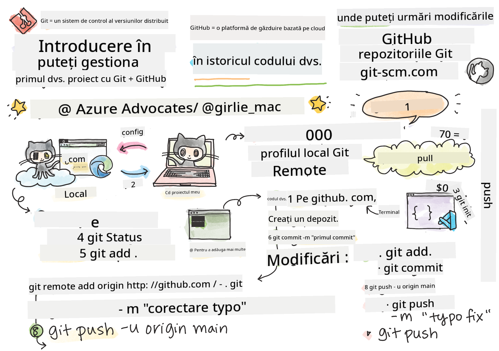
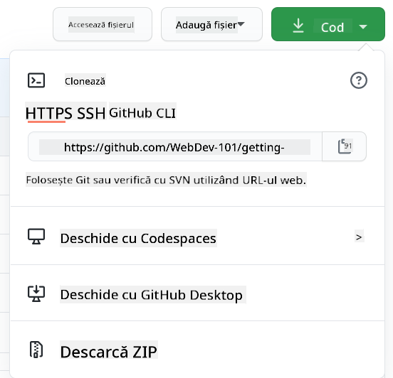

<!--
CO_OP_TRANSLATOR_METADATA:
{
  "original_hash": "acad15f3164cd6348e065ff38619aae9",
  "translation_date": "2025-10-24T22:01:34+00:00",
  "source_file": "1-getting-started-lessons/2-github-basics/README.md",
  "language_code": "ro"
}
-->
# Introducere în GitHub

Salut, viitor dezvoltator! 👋 Ești pregătit să te alături milioanelor de programatori din întreaga lume? Sunt cu adevărat entuziasmat să îți prezint GitHub – gândește-te la el ca la o platformă de social media pentru programatori, doar că în loc să împărtășim poze cu prânzul nostru, împărtășim cod și construim lucruri incredibile împreună!

Iată ce mă uimește complet: fiecare aplicație de pe telefonul tău, fiecare site web pe care îl vizitezi și majoritatea instrumentelor pe care vei învăța să le folosești au fost construite de echipe de dezvoltatori care colaborează pe platforme exact ca GitHub. Aplicația de muzică pe care o iubești? Cineva ca tine a contribuit la ea. Jocul de care nu te poți dezlipi? Da, probabil a fost construit cu colaborarea pe GitHub. Și acum TU vei învăța cum să faci parte din această comunitate uimitoare!

Știu că la început poate părea copleșitor – îmi amintesc cum mă uitam la prima mea pagină de GitHub și mă gândeam „Ce înseamnă toate astea?”. Dar iată care e treaba: fiecare dezvoltator a început exact de unde ești tu acum. Până la sfârșitul acestei lecții, vei avea propriul tău depozit GitHub (gândește-te la el ca la vitrina ta personală de proiecte în cloud) și vei ști cum să îți salvezi munca, să o împărtășești cu alții și chiar să contribui la proiecte pe care milioane de oameni le folosesc.

Vom parcurge această călătorie împreună, pas cu pas. Fără grabă, fără presiune – doar tu, eu și câteva instrumente foarte cool care vor deveni noii tăi prieteni de nădejde!


> Sketchnote de [Tomomi Imura](https://twitter.com/girlie_mac)

## Chestionar înainte de lecție
[Chestionar înainte de lecție](https://ff-quizzes.netlify.app)

## Introducere

Înainte să ne aruncăm în lucrurile cu adevărat interesante, hai să pregătim computerul tău pentru magia GitHub! Gândește-te la asta ca la organizarea materialelor de artă înainte de a crea o capodoperă – să ai instrumentele potrivite pregătite face totul mult mai ușor și mult mai distractiv.

Te voi ghida personal prin fiecare pas de configurare și îți promit că nu este nici pe departe atât de intimidant pe cât pare la prima vedere. Dacă ceva nu are sens imediat, este complet normal! Îmi amintesc când mi-am configurat primul mediu de dezvoltare și mă simțeam ca și cum încercam să citesc hieroglife antice. Fiecare dezvoltator a fost exact unde ești tu acum, întrebându-se dacă face totul corect. Spoiler: dacă ești aici și înveți, deja faci totul cum trebuie! 🌟

În această lecție, vom acoperi:

- cum să urmărești munca pe care o faci pe computerul tău
- cum să lucrezi la proiecte împreună cu alții
- cum să contribui la software open source

### Cerințe preliminare

Hai să pregătim computerul tău pentru magia GitHub! Nu-ți face griji – această configurare trebuie făcută o singură dată, iar apoi vei fi pregătit pentru întreaga ta călătorie în programare.

Bun, să începem cu baza! Mai întâi, trebuie să verificăm dacă Git este deja instalat pe computerul tău. Git este practic ca un asistent super-inteligent care își amintește fiecare schimbare pe care o faci în codul tău – mult mai bine decât să apeși frenetic Ctrl+S la fiecare două secunde (cu toții am fost acolo!).

Să vedem dacă Git este deja instalat, tastând această comandă magică în terminalul tău:
`git --version`

Dacă Git nu este încă instalat, nu-ți face griji! Doar accesează [download Git](https://git-scm.com/downloads) și descarcă-l. După ce l-ai instalat, trebuie să îi faci cunoștință lui Git cu tine:

> 💡 **Configurare inițială**: Aceste comenzi îi spun lui Git cine ești. Aceste informații vor fi atașate fiecărui commit pe care îl faci, așa că alege un nume și un email cu care te simți confortabil să le împărtășești public.

```bash
git config --global user.name "your-name"
git config --global user.email "your-email"
```

Pentru a verifica dacă Git este deja configurat, poți tasta:
```bash
git config --list
```

De asemenea, vei avea nevoie de un cont GitHub, un editor de cod (cum ar fi Visual Studio Code) și va trebui să deschizi terminalul (sau: command prompt).

Accesează [github.com](https://github.com/) și creează un cont dacă nu ai deja unul sau conectează-te și completează-ți profilul.

💡 **Sfat modern**: Ia în considerare configurarea [cheilor SSH](https://docs.github.com/en/authentication/connecting-to-github-with-ssh) sau utilizarea [GitHub CLI](https://cli.github.com/) pentru autentificare mai ușoară, fără parole.

✅ GitHub nu este singurul depozit de cod din lume; există și altele, dar GitHub este cel mai cunoscut.

### Pregătire

Vei avea nevoie de un folder cu un proiect de cod pe computerul tău (laptop sau PC) și de un depozit public pe GitHub, care va servi drept exemplu pentru cum să contribui la proiectele altora.

### Păstrarea codului în siguranță

Hai să vorbim puțin despre securitate – dar nu-ți face griji, nu te vom copleși cu lucruri înfricoșătoare! Gândește-te la aceste practici de securitate ca la închiderea mașinii sau a casei. Sunt obiceiuri simple care devin naturale și îți protejează munca.

Îți vom arăta modalitățile moderne și sigure de a lucra cu GitHub chiar de la început. În acest fel, vei dezvolta obiceiuri bune care te vor ajuta pe tot parcursul carierei tale de programator.

Când lucrezi cu GitHub, este important să urmezi cele mai bune practici de securitate:

| Domeniul securității | Cele mai bune practici | De ce contează |
|-----------------------|------------------------|----------------|
| **Autentificare** | Folosește chei SSH sau Token-uri de Acces Personal | Parolele sunt mai puțin sigure și sunt înlocuite treptat |
| **Autentificare în doi pași** | Activează 2FA pe contul tău GitHub | Adaugă un strat suplimentar de protecție pentru cont |
| **Securitatea depozitului** | Nu comite informații sensibile | Cheile API și parolele nu ar trebui să fie niciodată în depozite publice |
| **Managementul dependențelor** | Activează Dependabot pentru actualizări | Menține dependențele tale sigure și actualizate |

> ⚠️ **Atenționare critică de securitate**: Nu comite niciodată chei API, parole sau alte informații sensibile în vreun depozit. Folosește variabile de mediu și fișiere `.gitignore` pentru a proteja datele sensibile.

**Configurare modernă de autentificare:**

```bash
# Generate SSH key (modern ed25519 algorithm)
ssh-keygen -t ed25519 -C "your_email@example.com"

# Set up Git to use SSH
git remote set-url origin git@github.com:username/repository.git
```

> 💡 **Sfat Pro**: Cheile SSH elimină necesitatea de a introduce parole în mod repetat și sunt mai sigure decât metodele tradiționale de autentificare.

---

## Gestionarea codului ca un profesionist

Bun, ACUM lucrurile devin cu adevărat interesante! 🎉 Suntem pe cale să învățăm cum să urmărim și să gestionăm codul ca profesioniști, și sincer, acesta este unul dintre lucrurile mele preferate de predat, pentru că este o schimbare majoră.

Imaginează-ți asta: scrii o poveste uimitoare și vrei să ții evidența fiecărui draft, fiecărei modificări geniale și fiecărui moment de „stai, asta e genial!” pe parcurs. Exact asta face Git pentru codul tău! Este ca și cum ai avea cel mai incredibil caiet de călătorie în timp care își amintește TOTUL – fiecare tastare, fiecare schimbare, fiecare moment de „ups, am stricat totul” pe care îl poți anula instantaneu.

Voi fi sincer – la început poate părea copleșitor. Când am început, mă gândeam „De ce nu pot să îmi salvez fișierele ca de obicei?”. Dar ai încredere în mine: odată ce Git devine clar pentru tine (și va deveni!), vei avea unul dintre acele momente de iluminare în care te gândești „Cum am putut să programez vreodată fără asta?”. Este ca și cum ai descoperi că poți zbura după ce ai mers peste tot pe jos toată viața!

Să presupunem că ai un folder local cu un proiect de cod și vrei să începi să îți urmărești progresul folosind git – sistemul de control al versiunilor. Unii oameni compară utilizarea git cu scrierea unei scrisori de dragoste către sinele tău din viitor. Citind mesajele tale de commit peste zile, săptămâni sau luni, vei putea să îți amintești de ce ai luat o anumită decizie sau să „revii” la o modificare – asta dacă scrii mesaje de commit bune.

### Sarcină: Creează primul tău depozit!

> 🎯 **Misiunea ta (și sunt atât de entuziasmat pentru tine!)**: Vom crea împreună primul tău depozit GitHub! Până la sfârșitul acestui proces, vei avea propriul tău colț pe internet unde va locui codul tău și vei fi făcut primul tău „commit” (asta înseamnă, în limbajul dezvoltatorilor, să îți salvezi munca într-un mod foarte inteligent).
>
> Acesta este cu adevărat un moment special – ești pe cale să te alături oficial comunității globale de dezvoltatori! Îmi amintesc încă emoția de a-mi crea primul depozit și de a mă gândi „Wow, chiar fac asta!”

Hai să parcurgem această aventură împreună, pas cu pas. Ia-ți timpul necesar pentru fiecare parte – nu există premii pentru grabă și îți promit că fiecare pas va avea sens. Amintește-ți, fiecare superstar al programării pe care îl admiri a fost odată exact unde ești tu acum, pe punctul de a-și crea primul depozit. Cât de tare e asta?

> Vezi videoclipul
> 
> [](https://www.youtube.com/watch?v=9R31OUPpxU4)

**Hai să facem asta împreună:**

1. **Creează-ți depozitul pe GitHub**. Accesează GitHub.com și caută butonul verde strălucitor **New** (sau semnul **+** din colțul din dreapta sus). Apasă pe el și selectează **New repository**.

   Iată ce trebuie să faci:
   1. Dă un nume depozitului tău – fă-l să fie ceva semnificativ pentru tine!
   1. Adaugă o descriere dacă vrei (asta îi ajută pe alții să înțeleagă despre ce este proiectul tău)
   1. Decide dacă vrei să fie public (toată lumea poate să îl vadă) sau privat (doar pentru tine)
   1. Îți recomand să bifezi caseta pentru a adăuga un fișier README – este ca prima pagină a proiectului tău
   1. Apasă pe **Create repository** și sărbătorește – tocmai ți-ai creat primul depozit! 🎉

2. **Navighează la folderul proiectului tău**. Acum să deschidem terminalul (nu-ți face griji, nu este atât de înfricoșător pe cât pare!). Trebuie să îi spunem computerului unde se află fișierele proiectului tău. Tastează această comandă:

   ```bash
   cd [name of your folder]
   ```

   **Ce facem aici:**
   - Practic spunem „Hei computer, du-mă la folderul proiectului meu”
   - Este ca și cum ai deschide un folder specific pe desktop, dar facem asta cu comenzi text
   - Înlocuiește `[numele folderului tău]` cu numele real al folderului proiectului tău

3. **Transformă-ți folderul într-un depozit Git**. Aici se întâmplă magia! Tastează:

   ```bash
   git init
   ```

   **Ce tocmai s-a întâmplat (lucruri destul de tari!):**
   - Git tocmai a creat un folder ascuns `.git` în proiectul tău – nu îl vei vedea, dar este acolo!
   - Folderul tău obișnuit este acum un „depozit” care poate urmări fiecare schimbare pe care o faci
   - Gândește-te la asta ca la oferirea de superputeri folderului tău pentru a-și aminti totul

4. **Verifică ce se întâmplă**. Să vedem ce crede Git despre proiectul tău acum:

   ```bash
   git status
   ```

   **Înțelegerea a ceea ce îți spune Git:**
   
   S-ar putea să vezi ceva care arată cam așa:

   ```output
   Changes not staged for commit:
   (use "git add <file>..." to update what will be committed)
   (use "git restore <file>..." to discard changes in working directory)

        modified:   file.txt
        modified:   file2.txt
   ```

   **Nu te panica! Iată ce înseamnă asta:**
   - Fișierele în **roșu** sunt fișiere care au modificări, dar nu sunt încă pregătite pentru a fi salvate
   - Fișierele în **verde** (când le vezi) sunt pregătite pentru a fi salvate
   - Git este util și îți spune exact ce poți face în continuare

   > 💡 **Sfat Pro**: Comanda `git status` este cel mai bun prieten al tău! Folosește-o ori de câte ori ești confuz cu privire la ce se întâmplă. Este ca și cum ai întreba Git „Hei, care e situația acum?”

5. **Pregătește fișierele pentru salvare** (acest proces se numește „staging”):

   ```bash
   git add .
   ```

   **Ce tocmai am făcut:**
   - I-am spus lui Git „Hei, vreau să includ TOATE fișierele mele în următoarea salvare”
   - `.` este ca și cum ai spune „totul din acest folder”
   - Acum fișierele tale sunt „staged” și pregătite pentru pasul următor

   **Vrei să fii mai selectiv?** Poți adăuga doar fișiere specifice:

   ```bash
   git add [file or folder name]
   ```

   **De ce ai vrea să faci asta?**
   - Uneori vrei să salvezi modificări legate între ele
   - Te ajută să îți organizezi munca în bucăți logice
   - Face mai ușor să înțelegi ce s-a schimbat și când

   **Te-ai răzgândit?** Nicio problemă! Poți să scoți fișierele din „staged” astfel:

   ```bash
   # Unstage everything
   git reset
   
   # Unstage just one file
   git reset [file name]
   ```

   Nu-ți face griji – asta nu îți șterge munca, doar scoate fișierele din „pregătite pentru salvare”.

6. **Salvează-ți munca permanent** (făcând primul tău commit!):

   ```bash
   git commit -m "first commit"
   ```

   **🎉 Felicitări! Tocmai ai făcut primul tău commit!**
   
   **Ce tocmai s-a întâmplat:**
   - Git a făcut o „captură” a tuturor fișierelor tale pregătite în acest moment exact
   - Mesajul tău de commit „primul commit” explică despre ce este acest punct de salvare
   - Git a dat acestei capturi un ID unic, astfel încât să o poți găsi mereu mai târziu
   - Ai început oficial să urmărești istoricul proiectului tău!

   > 💡 **Mesaje de commit viitoare**: Pentru următoarele tale commit-uri, fii mai descriptiv! În loc de „am actualizat chestii”, încearcă „Am adăugat formularul de contact pe pagina principală” sau „Am rezolvat bug-ul din meniul de navigare”. Viitorul tău sine îți va mulțumi!

7. **Conectează proiectul local la GitHub**. În acest moment, proiectul tău există doar pe computerul tău. Hai să îl conectăm la depozitul tău GitHub, astfel încât să îl poți împărtăși cu lumea!

   Mai întâi, accesează pagina depozitului tău GitHub și copiază URL-ul. Apoi revino aici și tastează:

   ```bash
   git remote add origin https://github.com/username/repository_name.git
   ```
   
   (Înlocuiește acel URL cu URL-ul real al depozitului tău!)

   **Ce tocmai am făcut:**
   - Am creat o conexiune între proiectul tău local și depozitul tău GitHub.
   - "Origin" este doar un pseudonim pentru depozitul tău GitHub – e ca și cum ai adăuga un contact în telefonul tău.
   - Acum, Git-ul local știe unde să trimită codul tău când ești gata să-l împărtășești.

   💡 **Metodă mai simplă**: Dacă ai instalat GitHub CLI, poți face acest lucru cu o singură comandă:
   ```bash
   gh repo create my-repo --public --push --source=.
   ```

8. **Trimite codul tău pe GitHub** (momentul cel mare!):

   ```bash
   git push -u origin main
   ```

   **🚀 Asta e! Îți încarci codul pe GitHub!**
   
   **Ce se întâmplă:**
   - Commit-urile tale călătoresc de pe computerul tău pe GitHub.
   - Flag-ul `-u` stabilește o conexiune permanentă, astfel încât viitoarele push-uri să fie mai ușoare.
   - "main" este numele ramurii tale principale (ca un folder principal).
   - După aceasta, poți pur și simplu să tastezi `git push` pentru încărcările viitoare!

   💡 **Notă rapidă**: Dacă ramura ta se numește altfel (cum ar fi "master"), folosește acel nume. Poți verifica cu `git branch --show-current`.

9. **Ritmul tău zilnic de codare** (aici devine captivant!):

   De acum înainte, de fiecare dată când faci modificări în proiectul tău, urmează acest dans simplu în trei pași:

   ```bash
   git add .
   git commit -m "describe what you changed"
   git push
   ```

   **Acesta devine ritmul tău de codare:**
   - Fă niște modificări grozave în codul tău ✨
   - Stochează-le cu `git add` ("Hei Git, fii atent la aceste modificări!")
   - Salvează-le cu `git commit` și un mesaj descriptiv (viitorul tu îți va mulțumi!)
   - Împărtășește-le cu lumea folosind `git push` 🚀
   - Repetă – serios, devine la fel de natural ca respirația!

   Îmi place acest flux de lucru pentru că e ca și cum ai avea mai multe puncte de salvare într-un joc video. Ai făcut o modificare care îți place? Commit-o! Vrei să încerci ceva riscant? Nicio problemă – poți oricând să te întorci la ultimul commit dacă lucrurile nu merg bine!

   > 💡 **Sfaturi**: Poate vrei să adopți și un fișier `.gitignore` pentru a preveni ca fișierele pe care nu vrei să le urmărești să apară pe GitHub – cum ar fi acel fișier de notițe pe care îl păstrezi în același folder, dar care nu are ce căuta într-un depozit public. Poți găsi șabloane pentru fișiere `.gitignore` la [.gitignore templates](https://github.com/github/gitignore) sau poți crea unul folosind [gitignore.io](https://www.toptal.com/developers/gitignore).

#### Fluxuri de lucru moderne în Git

Ia în considerare adoptarea acestor practici moderne:

- **Conventional Commits**: Folosește un format standardizat pentru mesajele de commit, cum ar fi `feat:`, `fix:`, `docs:`, etc. Află mai multe la [conventionalcommits.org](https://www.conventionalcommits.org/)
- **Commit-uri atomice**: Fă ca fiecare commit să reprezinte o singură modificare logică.
- **Commit-uri frecvente**: Fă commit-uri frecvente cu mesaje descriptive, mai degrabă decât commit-uri mari și rare.

#### Mesaje de commit

O linie de subiect bună pentru un commit Git completează următoarea propoziție:
Dacă se aplică, acest commit va <subiectul tău aici>.

Pentru subiect, folosește timpul prezent, imperativ: "modifică" nu "modificat" sau "modificări". 
La fel ca în subiect, în corpul mesajului (opțional) folosește timpul prezent, imperativ. Corpul ar trebui să includă motivația pentru modificare și să contrasteze aceasta cu comportamentul anterior. Explici `de ce`, nu `cum`.

✅ Ia câteva minute să explorezi GitHub. Poți găsi un mesaj de commit cu adevărat grozav? Poți găsi unul foarte minimal? Ce informații crezi că sunt cele mai importante și utile de transmis într-un mesaj de commit?

## Lucrul în echipă (Partea distractivă!)

Ține-te bine, pentru că AICI GitHub devine absolut magic! 🪄 Ai stăpânit gestionarea propriului cod, dar acum ne aruncăm în partea mea preferată – colaborarea cu oameni uimitori din întreaga lume.

Imaginează-ți asta: te trezești mâine și vezi că cineva din Tokyo ți-a îmbunătățit codul în timp ce dormeai. Apoi cineva din Berlin rezolvă un bug la care te-ai blocat. Până după-amiază, un dezvoltator din São Paulo a adăugat o funcționalitate la care nici măcar nu te-ai gândit. Nu e science fiction – e doar o zi obișnuită în universul GitHub!

Ce mă entuziasmează cu adevărat este că abilitățile de colaborare pe care urmează să le înveți? Acestea sunt EXACT aceleași fluxuri de lucru pe care echipele de la Google, Microsoft și startup-urile tale preferate le folosesc în fiecare zi. Nu înveți doar un instrument cool – înveți limbajul secret care face ca întreaga lume software să funcționeze împreună.

Serios, odată ce experimentezi senzația de a avea pe cineva care îți acceptă primul pull request, vei înțelege de ce dezvoltatorii sunt atât de pasionați de open source. E ca și cum ai face parte din cel mai mare și mai creativ proiect de echipă din lume!

> Vezi videoclipul
>
> [](https://www.youtube.com/watch?v=bFCM-PC3cu8)

Motivul principal pentru a pune lucrurile pe GitHub a fost să faci posibilă colaborarea cu alți dezvoltatori.

În depozitul tău, navighează la `Insights > Community` pentru a vedea cum se compară proiectul tău cu standardele comunității recomandate.

Vrei să faci ca depozitul tău să arate profesional și primitor? Accesează depozitul tău și dă clic pe `Insights > Community`. Această funcție interesantă îți arată cum se compară proiectul tău cu ceea ce comunitatea GitHub consideră "practici bune pentru depozite".

> 🎯 **Fă-ți proiectul să strălucească**: Un depozit bine organizat, cu documentație bună, este ca un magazin curat și primitor. Le arată oamenilor că îți pasă de munca ta și îi face pe alții să dorească să contribuie!

**Ce face un depozit să fie grozav:**

| Ce să adaugi | De ce este important | Ce face pentru tine |
|--------------|----------------------|---------------------|
| **Descriere** | Prima impresie contează! | Oamenii știu instantaneu ce face proiectul tău |
| **README** | Prima pagină a proiectului tău | Ca un ghid prietenos pentru vizitatorii noi |
| **Ghiduri de contribuție** | Arată că ești deschis la ajutor | Oamenii știu exact cum te pot ajuta |
| **Cod de conduită** | Creează un spațiu prietenos | Toată lumea se simte binevenită să participe |
| **Licență** | Claritate legală | Alții știu cum pot folosi codul tău |
| **Politică de securitate** | Arată că ești responsabil | Demonstrează practici profesionale |

> 💡 **Sfaturi profesionale**: GitHub oferă șabloane pentru toate aceste fișiere. Când creezi un depozit nou, bifează casetele pentru a genera automat aceste fișiere.

**Funcții moderne GitHub de explorat:**

🤖 **Automatizare & CI/CD:**
- **GitHub Actions** pentru testare automată și implementare
- **Dependabot** pentru actualizări automate ale dependențelor

💬 **Comunitate & Management de proiect:**
- **GitHub Discussions** pentru conversații comunitare dincolo de probleme
- **GitHub Projects** pentru management de proiect în stil kanban
- **Reguli de protecție a ramurilor** pentru a impune standarde de calitate a codului

Toate aceste resurse vor fi utile pentru integrarea noilor membri ai echipei. Și acestea sunt, de obicei, lucrurile pe care noii contribuitori le analizează înainte de a se uita la codul tău, pentru a afla dacă proiectul tău este locul potrivit pentru a-și petrece timpul.

✅ Fișierele README, deși necesită timp pentru a fi pregătite, sunt adesea neglijate de către cei care întrețin proiecte. Poți găsi un exemplu de README deosebit de descriptiv? Notă: există câteva [instrumente pentru a crea README-uri bune](https://www.makeareadme.com/) pe care s-ar putea să vrei să le încerci.

### Sarcină: Fuzionează niște cod

Documentele de contribuție ajută oamenii să contribuie la proiect. Ele explică ce tipuri de contribuții cauți și cum funcționează procesul. Contribuitorii vor trebui să parcurgă o serie de pași pentru a putea contribui la depozitul tău pe GitHub:

1. **Fork-ul depozitului tău**. Probabil vei dori ca oamenii să _fork-eze_ proiectul tău. Fork-ul înseamnă crearea unei replici a depozitului tău pe profilul lor GitHub.
1. **Clonează**. De acolo, vor clona proiectul pe mașina lor locală.
1. **Creează o ramură**. Vei dori să le ceri să creeze o _ramură_ pentru munca lor.
1. **Concentrează modificarea pe o singură zonă**. Cere contribuitorilor să-și concentreze contribuțiile pe un singur lucru la un moment dat – astfel șansele ca tu să poți _fuziona_ munca lor sunt mai mari. Imaginează-ți că scriu o corecție de bug, adaugă o funcționalitate nouă și actualizează mai multe teste – ce se întâmplă dacă vrei sau poți implementa doar 2 din 3 sau 1 din 3 modificări?

✅ Imaginează-ți o situație în care ramurile sunt deosebit de critice pentru scrierea și livrarea unui cod bun. La ce cazuri de utilizare te poți gândi?

> Notă, fii schimbarea pe care vrei să o vezi în lume și creează ramuri pentru propria ta muncă. Orice commit-uri pe care le faci vor fi făcute pe ramura pe care ești în prezent "verificat". Folosește `git status` pentru a vedea pe ce ramură te afli.

Să parcurgem un flux de lucru pentru contribuitori. Presupunem că contribuitorul a _fork-at_ și a _clonat_ depozitul, astfel încât să aibă un depozit Git gata de lucru pe mașina lor locală:

1. **Creează o ramură**. Folosește comanda `git branch` pentru a crea o ramură care va conține modificările pe care intenționează să le contribuie:

   ```bash
   git branch [branch-name]
   ```

   > 💡 **Abordare modernă**: Poți, de asemenea, să creezi și să treci la noua ramură într-o singură comandă:
   ```bash
   git switch -c [branch-name]
   ```

1. **Treci la ramura de lucru**. Treci la ramura specificată și actualizează directorul de lucru cu `git switch`:

   ```bash
   git switch [branch-name]
   ```

   > 💡 **Notă modernă**: `git switch` este înlocuitorul modern pentru `git checkout` atunci când schimbi ramurile. Este mai clar și mai sigur pentru începători.

1. **Lucrează**. În acest moment, vrei să adaugi modificările tale. Nu uita să îi spui Git-ului despre ele cu următoarele comenzi:

   ```bash
   git add .
   git commit -m "my changes"
   ```

   > ⚠️ **Calitatea mesajului de commit**: Asigură-te că dai commit-ului un nume bun, atât pentru tine, cât și pentru întreținătorul depozitului pe care îl ajuți. Fii specific cu privire la ceea ce ai schimbat!

1. **Combină munca ta cu ramura `main`**. La un moment dat, ai terminat de lucrat și vrei să combini munca ta cu cea a ramurii `main`. Ramura `main` s-ar putea să se fi schimbat între timp, așa că asigură-te că o actualizezi mai întâi la cea mai recentă versiune cu următoarele comenzi:

   ```bash
   git switch main
   git pull
   ```

   În acest moment, vrei să te asiguri că orice _conflicte_, situații în care Git nu poate _combina_ ușor modificările, apar în ramura ta de lucru. Prin urmare, rulează următoarele comenzi:

   ```bash
   git switch [branch_name]
   git merge main
   ```

   Comanda `git merge main` va aduce toate modificările din `main` în ramura ta. Sperăm că poți continua fără probleme. Dacă nu, VS Code îți va arăta unde Git este _confuz_ și doar alterezi fișierele afectate pentru a indica ce conținut este cel mai corect.

   💡 **Alternativă modernă**: Ia în considerare utilizarea `git rebase` pentru un istoric mai curat:
   ```bash
   git rebase main
   ```
   Aceasta reia commit-urile tale deasupra celei mai recente ramuri main, creând un istoric liniar.

1. **Trimite munca ta pe GitHub**. Trimiterea muncii tale pe GitHub înseamnă două lucruri. Împingerea ramurii tale în depozitul tău și apoi deschiderea unui PR, Pull Request.

   ```bash
   git push --set-upstream origin [branch-name]
   ```

   Comanda de mai sus creează ramura în depozitul tău fork-at.

1. **Deschide un PR**. Următorul pas este să deschizi un PR. Faci acest lucru navigând la depozitul fork-at pe GitHub. Vei vedea o indicație pe GitHub unde te întreabă dacă vrei să creezi un nou PR, dai clic pe asta și vei fi dus la o interfață unde poți schimba titlul mesajului de commit, să îi dai o descriere mai potrivită. Acum întreținătorul depozitului pe care l-ai fork-at va vedea acest PR și _sperăm_ că va aprecia și va _fuziona_ PR-ul tău. Acum ești un contribuitor, yay :)

   💡 **Sfaturi moderne**: Poți, de asemenea, să creezi PR-uri folosind GitHub CLI:
   ```bash
   gh pr create --title "Your PR title" --body "Description of changes"
   ```

   🔧 **Cele mai bune practici pentru PR-uri**:
   - Leagă problemele relevante folosind cuvinte cheie precum "Fixes #123".
   - Adaugă capturi de ecran pentru modificările UI.
   - Solicită recenzori specifici.
   - Folosește PR-uri de tip draft pentru lucrări în curs.
   - Asigură-te că toate verificările CI trec înainte de a solicita recenzia.

1. **Curăță**. Este considerat o bună practică să _cureți_ după ce ai fuzionat cu succes un PR. Vrei să cureți atât ramura locală, cât și ramura pe care ai împins-o pe GitHub. Mai întâi, șterge-o local cu următoarea comandă:

   ```bash
   git branch -d [branch-name]
   ```

   Asigură-te că accesezi pagina GitHub pentru depozitul fork-at și elimină ramura remote pe care tocmai ai împins-o.

`Pull request` pare un termen ciudat, pentru că, de fapt, vrei să împingi modificările tale în proiect. Dar întreținătorul (proprietarul proiectului) sau echipa principală trebuie să ia în considerare modificările tale înainte de a le fuziona cu ramura "main" a proiectului, așa că, de fapt, soliciți o decizie de schimbare de la un întreținător.

Un pull request este locul unde compari și discuți diferențele introduse pe o ramură, cu recenzii, comentarii, teste integrate și altele. Un pull request bun urmează aproximativ aceleași reguli ca un mesaj de commit. Poți adăuga o referință la o problemă din tracker-ul de probleme, atunci când munca ta, de exemplu, rezolvă o problemă. Acest lucru se face folosind un `#` urmat de numărul problemei tale. De exemplu, `#97`.
🤞Să sperăm că toate verificările trec și proprietarul/proprietarii proiectului îți vor accepta modificările în proiect 🤞

Actualizează ramura locală curentă cu toate commit-urile noi din ramura corespunzătoare de pe GitHub:

`git pull`

## Contribuția la Open Source (Șansa ta de a face o diferență!)

Ești pregătit pentru ceva care îți va da peste cap mintea? 🤯 Hai să vorbim despre contribuția la proiectele open source – și mă trec fiorii doar gândindu-mă să împărtășesc asta cu tine!

Aceasta este șansa ta de a face parte din ceva cu adevărat extraordinar. Imaginează-ți că îmbunătățești instrumentele pe care milioane de dezvoltatori le folosesc zilnic sau că repari un bug într-o aplicație pe care prietenii tăi o adoră. Nu este doar un vis – asta înseamnă să contribui la open source!

Iată ce mă emoționează de fiecare dată când mă gândesc la asta: fiecare instrument pe care l-ai învățat – editorul de cod, framework-urile pe care le vom explora, chiar și browserul în care citești asta – a început cu cineva exact ca tine, făcând prima lor contribuție. Dezvoltatorul genial care a creat extensia ta preferată pentru VS Code? A fost odată un începător care a apăsat pe "create pull request" cu mâinile tremurânde, exact așa cum urmează să faci și tu.

Și iată partea cea mai frumoasă: comunitatea open source este ca o mare îmbrățișare a internetului. Majoritatea proiectelor caută activ noi contribuitori și au probleme etichetate "good first issue" special pentru oameni ca tine! Cei care întrețin proiectele sunt cu adevărat încântați când văd noi contribuitori, pentru că își amintesc propriile lor primii pași.

Nu doar înveți să programezi aici – te pregătești să te alături unei familii globale de creatori care se trezesc în fiecare zi gândindu-se "Cum putem face lumea digitală puțin mai bună?" Bine ai venit în club! 🌟

Mai întâi, să găsim un depozit (sau **repo**) pe GitHub care te interesează și la care ai vrea să contribui cu o modificare. Va trebui să copiezi conținutul acestuia pe mașina ta.

✅ O modalitate bună de a găsi depozite prietenoase pentru începători este să [cauți după eticheta 'good-first-issue'](https://github.blog/2020-01-22-browse-good-first-issues-to-start-contributing-to-open-source/).



Există mai multe moduri de a copia codul. O modalitate este să "clonezi" conținutul depozitului, folosind HTTPS, SSH sau GitHub CLI (Command Line Interface).

Deschide terminalul și clonează depozitul astfel:
```bash
# Using HTTPS
git clone https://github.com/ProjectURL

# Using SSH (requires SSH key setup)
git clone git@github.com:username/repository.git

# Using GitHub CLI
gh repo clone username/repository
```

Pentru a lucra la proiect, schimbă folderul:
`cd ProjectURL`

De asemenea, poți deschide întregul proiect folosind:
- **[GitHub Codespaces](https://github.com/features/codespaces)** - Mediul de dezvoltare cloud al GitHub cu VS Code în browser
- **[GitHub Desktop](https://desktop.github.com/)** - O aplicație GUI pentru operațiuni Git  
- **[GitHub.dev](https://github.dev)** - Apasă tasta `.` pe orice repo GitHub pentru a deschide VS Code în browser
- **VS Code** cu extensia GitHub Pull Requests

În cele din urmă, poți descărca codul într-un folder arhivat.

### Câteva lucruri interesante despre GitHub

Poți să dai stea, să urmărești și/sau să "fork"-uiești orice depozit public pe GitHub. Poți găsi depozitele marcate cu stea în meniul drop-down din dreapta sus. Este ca și cum ai salva un bookmark, dar pentru cod.

Proiectele au un tracker de probleme, de obicei pe GitHub în fila "Issues", dacă nu este indicat altfel, unde oamenii discută probleme legate de proiect. Iar fila Pull Requests este locul unde oamenii discută și revizuiesc modificările aflate în progres.

Proiectele pot avea, de asemenea, discuții în forumuri, liste de e-mail sau canale de chat precum Slack, Discord sau IRC.

🔧 **Funcționalități moderne GitHub**:
- **GitHub Discussions** - Forum integrat pentru conversații comunitare
- **GitHub Sponsors** - Susține financiar cei care întrețin proiectele  
- **Security tab** - Rapoarte de vulnerabilitate și sfaturi de securitate
- **Actions tab** - Vezi fluxuri de lucru automate și pipeline-uri CI/CD
- **Insights tab** - Analize despre contribuitori, commit-uri și sănătatea proiectului
- **Projects tab** - Instrumente de management de proiect integrate în GitHub

✅ Explorează noul tău repo GitHub și încearcă câteva lucruri, cum ar fi editarea setărilor, adăugarea de informații în repo, crearea unui proiect (cum ar fi un board Kanban) și configurarea GitHub Actions pentru automatizare. Sunt multe lucruri pe care le poți face!

---

## 🚀 Provocare 

Bun, e timpul să-ți testezi noile superputeri GitHub! 🚀 Iată o provocare care va face totul să se lege într-un mod extrem de satisfăcător:

Ia un prieten (sau acel membru al familiei care te întreabă mereu ce faci cu tot acest "stuff de calculator") și porniți împreună într-o aventură de codare colaborativă! Aici se întâmplă magia adevărată – creați un proiect, lasă-l să-l fork-uiască, faceți câteva ramuri și îmbinați modificările ca niște profesioniști în devenire.

Nu o să mint – probabil veți râde la un moment dat (mai ales când încercați amândoi să modificați aceeași linie), poate vă veți scărpina în cap de confuzie, dar cu siguranță veți avea acele momente uimitoare de "aha!" care fac tot efortul să merite. În plus, există ceva special în a împărtăși prima îmbinare reușită cu altcineva – e ca o mică sărbătoare a progresului vostru!

Nu ai încă un partener de codare? Nicio problemă! Comunitatea GitHub este plină de oameni incredibil de primitori care își amintesc cum era să fie noi. Caută depozite cu etichete "good first issue" – practic spun "Hei începători, veniți să învățați cu noi!" Cât de tare e asta?

## Quiz post-lectură
[Quiz post-lectură](https://ff-quizzes.netlify.app/web/en/)

## Recapitulare & Continuă să înveți

Uau! 🎉 Uită-te la tine – tocmai ai cucerit elementele de bază ale GitHub ca un adevărat campion! Dacă simți că mintea ta e puțin plină acum, e complet normal și, sincer, un semn bun. Tocmai ai învățat instrumente care mi-au luat săptămâni să le înțeleg când am început.

Git și GitHub sunt incredibil de puternice (serios, foarte puternice), și fiecare dezvoltator pe care îl cunosc – inclusiv cei care par acum niște vrăjitori – a trebuit să exerseze și să se împiedice puțin înainte ca totul să aibă sens. Faptul că ai trecut prin această lecție înseamnă că ești deja pe drumul cel bun spre a stăpâni unele dintre cele mai importante instrumente din trusa unui dezvoltator.

Iată câteva resurse absolut fantastice care te vor ajuta să exersezi și să devii și mai grozav:

- [Ghid pentru contribuția la software open source](https://opensource.guide/how-to-contribute/#how-to-submit-a-contribution) – Harta ta pentru a face o diferență
- [Git cheatsheet](https://training.github.com/downloads/github-git-cheat-sheet/) – Păstrează-l la îndemână pentru referințe rapide!

Și amintește-ți: practica aduce progres, nu perfecțiune! Cu cât folosești mai mult Git și GitHub, cu atât devine mai natural. GitHub a creat câteva cursuri interactive uimitoare care îți permit să exersezi într-un mediu sigur:

- [Introducere în GitHub](https://github.com/skills/introduction-to-github)
- [Comunicarea folosind Markdown](https://github.com/skills/communicate-using-markdown)  
- [GitHub Pages](https://github.com/skills/github-pages)
- [Gestionarea conflictelor de îmbinare](https://github.com/skills/resolve-merge-conflicts)

**Te simți aventuros? Verifică aceste instrumente moderne:**
- [Documentația GitHub CLI](https://cli.github.com/manual/) – Pentru momentele în care vrei să te simți ca un vrăjitor al liniei de comandă
- [Documentația GitHub Codespaces](https://docs.github.com/en/codespaces) – Cod în cloud!
- [Documentația GitHub Actions](https://docs.github.com/en/actions) – Automatizează totul
- [Cele mai bune practici Git](https://www.atlassian.com/git/tutorials/comparing-workflows) – Îmbunătățește-ți fluxul de lucru 

## Provocarea GitHub Copilot Agent 🚀

Folosește modul Agent pentru a finaliza următoarea provocare:

**Descriere:** Creează un proiect colaborativ de dezvoltare web care demonstrează întregul flux de lucru GitHub pe care l-ai învățat în această lecție. Această provocare te va ajuta să exersezi crearea de depozite, funcțiile de colaborare și fluxurile de lucru moderne Git într-un scenariu real.

**Prompt:** Creează un nou depozit public GitHub pentru un proiect simplu "Resurse pentru Dezvoltare Web". Depozitul ar trebui să includă un fișier README.md bine structurat, care listează instrumente și resurse utile pentru dezvoltarea web, organizate pe categorii (HTML, CSS, JavaScript etc.). Configurează depozitul cu standarde comunitare adecvate, inclusiv o licență, ghiduri de contribuție și un cod de conduită. Creează cel puțin două ramuri de funcționalitate: una pentru adăugarea resurselor CSS și alta pentru resursele JavaScript. Fă commit-uri pe fiecare ramură cu mesaje descriptive, apoi creează pull requests pentru a îmbina modificările în ramura principală. Activează funcțiile GitHub precum Issues, Discussions și configurează un flux de lucru GitHub Actions de bază pentru verificări automate.

## Temă 

Misiunea ta, dacă alegi să o accepți: Finalizează cursul [Introducere în GitHub](https://github.com/skills/introduction-to-github) pe GitHub Skills. Acest curs interactiv îți va permite să exersezi tot ce ai învățat într-un mediu sigur și ghidat. În plus, vei primi o insignă cool când termini! 🏅

**Te simți pregătit pentru mai multe provocări?**
- Configurează autentificarea SSH pentru contul tău GitHub (fără mai multe parole!)
- Încearcă să folosești GitHub CLI pentru operațiunile tale zilnice cu Git
- Creează un depozit cu un flux de lucru GitHub Actions
- Explorează GitHub Codespaces deschizând chiar acest depozit într-un editor bazat pe cloud

Amintește-ți: fiecare expert a fost odată un începător. Poți să o faci! 💪

---

**Declinare de responsabilitate**:  
Acest document a fost tradus folosind serviciul de traducere AI [Co-op Translator](https://github.com/Azure/co-op-translator). Deși ne străduim să asigurăm acuratețea, vă rugăm să fiți conștienți că traducerile automate pot conține erori sau inexactități. Documentul original în limba sa natală ar trebui considerat sursa autoritară. Pentru informații critice, se recomandă traducerea profesională realizată de oameni. Nu ne asumăm responsabilitatea pentru neînțelegerile sau interpretările greșite care pot apărea din utilizarea acestei traduceri.