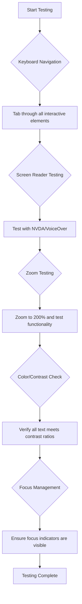
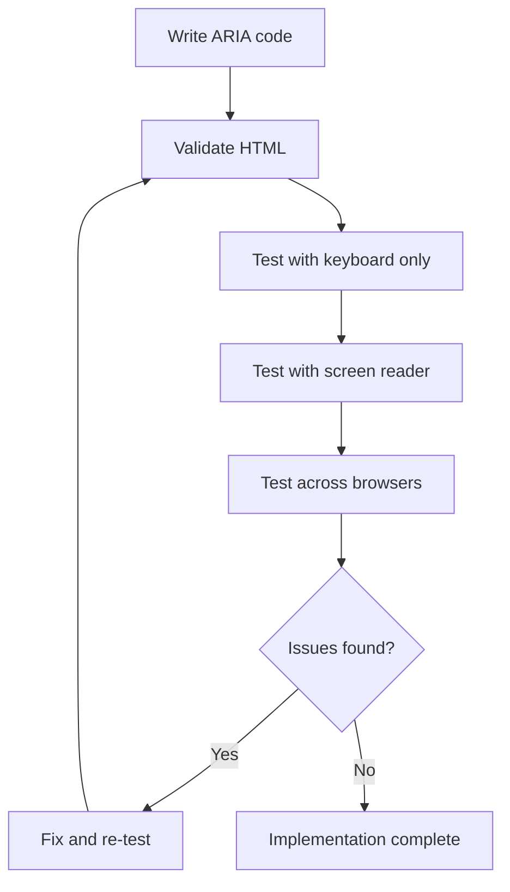

<!--
CO_OP_TRANSLATOR_METADATA:
{
  "original_hash": "90b19cde5b79b29e91babd3138cd8035",
  "translation_date": "2025-10-24T21:59:52+00:00",
  "source_file": "1-getting-started-lessons/3-accessibility/README.md",
  "language_code": "ro"
}
-->
# Crearea paginilor web accesibile


> Sketchnote de [Tomomi Imura](https://twitter.com/girlie_mac)

## Chestionar înainte de lecție
[Chestionar înainte de lecție](https://ff-quizzes.netlify.app/web/)

> Puterea web-ului constă în universalitatea sa. Accesul pentru toți, indiferent de dizabilitate, este un aspect esențial.
>
> \- Sir Timothy Berners-Lee, Director W3C și inventatorul World Wide Web

Iată ceva ce s-ar putea să te surprindă: când construiești site-uri web accesibile, nu ajuți doar persoanele cu dizabilități—de fapt, faci web-ul mai bun pentru toată lumea!

Ai observat vreodată acele rampe de la colțurile străzilor? Inițial au fost concepute pentru scaunele cu rotile, dar acum ajută și persoanele cu cărucioare, lucrătorii de livrări cu cărucioare, călătorii cu bagaje pe roți și bicicliștii. Exact așa funcționează designul web accesibil—soluțiile care ajută un grup ajung adesea să fie benefice pentru toți. Destul de tare, nu-i așa?

În această lecție, vom explora cum să creăm site-uri web care funcționează cu adevărat pentru toată lumea, indiferent de modul în care navighează pe internet. Vei descoperi tehnici practice care sunt deja integrate în standardele web, vei avea ocazia să testezi instrumente și vei vedea cum accesibilitatea face site-urile tale mai ușor de utilizat pentru toți utilizatorii.

Până la sfârșitul acestei lecții, vei avea încrederea necesară pentru a face din accesibilitate o parte naturală a fluxului tău de lucru în dezvoltare. Ești pregătit să explorezi cum alegerile de design bine gândite pot deschide web-ul pentru miliarde de utilizatori? Hai să începem!

> Poți parcurge această lecție pe [Microsoft Learn](https://docs.microsoft.com/learn/modules/web-development-101/accessibility/?WT.mc_id=academic-77807-sagibbon)!

## Înțelegerea tehnologiilor asistive

Înainte să trecem la codare, să luăm un moment pentru a înțelege cum experimentează web-ul persoanele cu abilități diferite. Nu este doar teorie—înțelegerea acestor modele reale de navigare te va face un dezvoltator mult mai bun!

Tehnologiile asistive sunt instrumente uimitoare care ajută persoanele cu dizabilități să interacționeze cu site-urile web în moduri care te-ar putea surprinde. Odată ce înțelegi cum funcționează aceste tehnologii, crearea experiențelor web accesibile devine mult mai intuitivă. Este ca și cum ai învăța să vezi codul tău prin ochii altcuiva.

### Cititoare de ecran

[Cititoarele de ecran](https://en.wikipedia.org/wiki/Screen_reader) sunt tehnologii destul de sofisticate care transformă textul digital în ieșire vocală sau braille. Deși sunt utilizate în principal de persoanele cu deficiențe de vedere, sunt de asemenea foarte utile pentru utilizatorii cu dizabilități de învățare, cum ar fi dislexia.

Îmi place să mă gândesc la un cititor de ecran ca la un narator foarte inteligent care îți citește o carte. Citește conținutul cu voce tare într-o ordine logică, anunță elementele interactive precum "buton" sau "link" și oferă scurtături de tastatură pentru navigarea pe pagină. Dar iată care e treaba—cititoarele de ecran pot face magie doar dacă construim site-uri web cu o structură adecvată și conținut semnificativ. Aici intervii tu, ca dezvoltator!

**Cititoare de ecran populare pe diverse platforme:**
- **Windows**: [NVDA](https://www.nvaccess.org/about-nvda/) (gratuit și cel mai popular), [JAWS](https://webaim.org/articles/jaws/), [Narrator](https://support.microsoft.com/windows/complete-guide-to-narrator-e4397a0d-ef4f-b386-d8ae-c172f109bdb1/?WT.mc_id=academic-77807-sagibbon) (integrat)
- **macOS/iOS**: [VoiceOver](https://support.apple.com/guide/voiceover/welcome/10) (integrat și foarte capabil)
- **Android**: [TalkBack](https://support.google.com/accessibility/android/answer/6283677) (integrat)
- **Linux**: [Orca](https://wiki.gnome.org/Projects/Orca) (gratuit și open-source)

**Cum navighează cititoarele de ecran conținutul web:**

Cititoarele de ecran oferă mai multe metode de navigare care fac navigarea eficientă pentru utilizatorii experimentați:
- **Lectură secvențială**: Citește conținutul de sus în jos, ca și cum ai citi o carte
- **Navigare prin repere**: Salt între secțiunile paginii (antet, navigare, principal, subsol)
- **Navigare prin titluri**: Salt între titluri pentru a înțelege structura paginii
- **Liste de linkuri**: Generarea unei liste cu toate linkurile pentru acces rapid
- **Controale de formular**: Navigare directă între câmpurile de introducere și butoane

> 💡 **Iată ceva ce m-a uimit**: 68% dintre utilizatorii de cititoare de ecran navighează în principal prin titluri ([WebAIM Survey](https://webaim.org/projects/screenreadersurvey9/#finding)). Asta înseamnă că structura titlurilor tale este ca o hartă pentru utilizatori—când o faci corect, literalmente ajuți oamenii să găsească mai rapid drumul prin conținutul tău!

### Construirea fluxului de lucru pentru testare

Iată o veste bună—testarea eficientă a accesibilității nu trebuie să fie copleșitoare! Vei dori să combini instrumentele automate (sunt fantastice pentru a detecta probleme evidente) cu ceva testare manuală. Iată o abordare sistematică pe care am descoperit-o că prinde cele mai multe probleme fără să-ți consume întreaga zi:

**Flux de lucru esențial pentru testare manuală:**



**Listă de verificare pas cu pas pentru testare:**
1. **Navigare cu tastatura**: Folosește doar tastele Tab, Shift+Tab, Enter, Space și săgețile
2. **Testare cu cititor de ecran**: Activează NVDA, VoiceOver sau Narrator și navighează cu ochii închiși
3. **Testare zoom**: Testează la niveluri de zoom de 200% și 400%
4. **Verificarea contrastului culorilor**: Verifică tot textul și componentele UI
5. **Testarea indicatorului de focalizare**: Asigură-te că toate elementele interactive au stări vizibile de focalizare

✅ **Începe cu Lighthouse**: Deschide DevTools în browserul tău, rulează un audit de accesibilitate Lighthouse, apoi folosește rezultatele pentru a ghida zonele de testare manuală.

### Instrumente de zoom și mărire

Știi cum uneori mărești textul pe telefon când este prea mic sau te străduiești să citești ecranul laptopului în lumina puternică a soarelui? Mulți utilizatori se bazează pe instrumente de mărire pentru a face conținutul lizibil în fiecare zi. Acest lucru include persoanele cu deficiențe de vedere, adulții în vârstă și oricine a încercat vreodată să citească un site web în aer liber.

Tehnologiile moderne de zoom au evoluat dincolo de simpla mărire a lucrurilor. Înțelegerea modului în care funcționează aceste instrumente te va ajuta să creezi designuri responsive care rămân funcționale și atractive la orice nivel de mărire.

**Capacități moderne de zoom ale browserelor:**
- **Zoom pagină**: Scalează tot conținutul proporțional (text, imagini, layout) - aceasta este metoda preferată
- **Zoom doar text**: Mărește dimensiunea fontului păstrând layout-ul original
- **Pinch-to-zoom**: Suport pentru gesturi mobile pentru mărire temporară
- **Suport browser**: Toate browserele moderne suportă zoom până la 500% fără a afecta funcționalitatea

**Software specializat de mărire:**
- **Windows**: [Magnifier](https://support.microsoft.com/windows/use-magnifier-to-make-things-on-the-screen-easier-to-see-414948ba-8b1c-d3bd-8615-0e5e32204198) (integrat), [ZoomText](https://www.freedomscientific.com/training/zoomtext/getting-started/)
- **macOS/iOS**: [Zoom](https://www.apple.com/accessibility/mac/vision/) (integrat cu funcții avansate)

> ⚠️ **Considerație de design**: WCAG cere ca conținutul să rămână funcțional atunci când este mărit la 200%. La acest nivel, derularea orizontală ar trebui să fie minimă, iar toate elementele interactive ar trebui să rămână accesibile.

✅ **Testează designul tău responsive**: Mărește browserul la 200% și 400%. Se adaptează layout-ul tău în mod grațios? Poți accesa în continuare toate funcționalitățile fără derulare excesivă?

## Instrumente moderne de testare a accesibilității

Acum că înțelegi cum navighează oamenii pe web cu ajutorul tehnologiilor asistive, să explorăm instrumentele care te ajută să construiești și să testezi site-uri web accesibile.

Gândește-te așa: instrumentele automate sunt excelente pentru a detecta probleme evidente (cum ar fi lipsa textului alternativ), în timp ce testarea manuală te ajută să te asiguri că site-ul tău este plăcut de utilizat în lumea reală. Împreună, îți oferă încrederea că site-urile tale funcționează pentru toată lumea.

### Testarea contrastului culorilor

Iată o veste bună: contrastul culorilor este una dintre cele mai frecvente probleme de accesibilitate, dar este și una dintre cele mai ușor de rezolvat. Un contrast bun beneficiază pe toată lumea—de la utilizatorii cu deficiențe de vedere până la cei care încearcă să citească pe telefon la plajă.

**Cerințele de contrast WCAG:**

| Tip text | WCAG AA (Minim) | WCAG AAA (Îmbunătățit) |
|----------|-----------------|------------------------|
| **Text normal** (sub 18pt) | Raport de contrast 4.5:1 | Raport de contrast 7:1 |
| **Text mare** (18pt+ sau 14pt+ bold) | Raport de contrast 3:1 | Raport de contrast 4.5:1 |
| **Componente UI** (butoane, borduri de formular) | Raport de contrast 3:1 | Raport de contrast 3:1 |

**Instrumente esențiale de testare:**
- [Colour Contrast Analyser](https://www.tpgi.com/color-contrast-checker/) - Aplicație desktop cu selector de culori
- [WebAIM Contrast Checker](https://webaim.org/resources/contrastchecker/) - Bazat pe web, cu feedback instant
- [Stark](https://www.getstark.co/) - Plugin pentru instrumente de design precum Figma, Sketch, Adobe XD
- [Accessible Colors](https://accessible-colors.com/) - Găsește palete de culori accesibile

✅ **Construiește palete de culori mai bune**: Începe cu culorile brandului tău și folosește verificatoarele de contrast pentru a crea variații accesibile. Documentează-le ca parte a sistemului tău de design accesibil.

### Audit complet de accesibilitate

Cea mai eficientă testare a accesibilității combină mai multe abordări. Niciun instrument nu detectează totul, așa că construirea unei rutine de testare cu diverse metode asigură o acoperire completă.

**Testare bazată pe browser (integrată în DevTools):**
- **Chrome/Edge**: Audit de accesibilitate Lighthouse + Panoul de accesibilitate
- **Firefox**: Inspector de accesibilitate cu vizualizare detaliată a arborelui
- **Safari**: Tab-ul de audit în Web Inspector cu simulare VoiceOver

**Extensii profesionale de testare:**
- [axe DevTools](https://www.deque.com/axe/devtools/) - Testare automată standard în industrie
- [WAVE](https://wave.webaim.org/extension/) - Feedback vizual cu evidențierea erorilor
- [Accessibility Insights](https://accessibilityinsights.io/) - Suita de testare cuprinzătoare de la Microsoft

**Integrare în linia de comandă și CI/CD:**
- [axe-core](https://github.com/dequelabs/axe-core) - Bibliotecă JavaScript pentru testare automată
- [Pa11y](https://pa11y.org/) - Instrument de testare a accesibilității în linia de comandă
- [Lighthouse CI](https://github.com/GoogleChrome/lighthouse-ci) - Scor automat de accesibilitate

> 🎯 **Obiectiv de testare**: Tinde spre un scor de accesibilitate Lighthouse de 95+ ca bază. Amintește-ți, instrumentele automate detectează doar aproximativ 30-40% din problemele de accesibilitate—testarea manuală este încă esențială!

## Construirea accesibilității de la bază

Cheia succesului în accesibilitate este să o integrezi în fundația ta încă de la început. Știu că este tentant să te gândești "O să adaug accesibilitatea mai târziu," dar asta e ca și cum ai încerca să adaugi o rampă la o casă după ce a fost deja construită. Posibil? Da. Ușor? Nu prea.

Gândește-te la accesibilitate ca la planificarea unei case—este mult mai ușor să incluzi accesibilitatea pentru scaunele cu rotile în planurile tale arhitecturale inițiale decât să modifici totul mai târziu.

### Principiile POUR: Fundația accesibilității tale

Ghidurile de conținut web accesibil (WCAG) sunt construite în jurul a patru principii fundamentale care formează acronimul POUR. Nu te îngrijora—nu sunt concepte academice plictisitoare! Sunt, de fapt, ghiduri practice pentru crearea unui conținut care funcționează pentru toată lumea.

Odată ce înțelegi principiile POUR, luarea deciziilor legate de accesibilitate devine mult mai intuitivă. Este ca și cum ai avea o listă mentală care îți ghidează alegerile de design. Să le analizăm:

**🔍 Perceptibil**: Informațiile trebuie să fie prezentate în moduri pe care utilizatorii le pot percepe prin simțurile lor disponibile

- Oferă alternative textuale pentru conținutul non-text (imagini, videoclipuri, audio)
- Asigură un contrast suficient al culorilor pentru tot textul și componentele UI
- Oferă subtitrări și transcrieri pentru conținut multimedia
- Proiectează conținut care rămâne funcțional când este redimensionat până la 200%
- Folosește caracteristici senzoriale multiple (nu doar culoarea) pentru a transmite informații

**🎮 Operabil**: Toate componentele interfeței trebuie să fie operabile prin metode de intrare disponibile

- Fă ca toate funcționalitățile să fie accesibile prin navigare cu tastatura
- Oferă utilizatorilor suficient timp pentru a citi și interacționa cu conținutul
- Evită conținutul care provoacă convulsii sau tulburări vestibulare
- Ajută utilizatorii să navigheze eficient cu o structură clară și repere
- Asigură-te că elementele interactive au dimensiuni adecvate (minim 44px)

**📖 Ușor de înțeles**: Informațiile și operarea interfeței trebuie să fie clare și ușor de înțeles

- Folosește un limbaj clar și simplu, potrivit pentru publicul tău
- Asigură-te că conținutul apare și funcționează într-un mod previzibil și consistent
- Oferă instrucțiuni clare și mesaje de eroare pentru introducerea utilizatorului
- Ajută utilizatorii să înțeleagă și să corecteze greșelile din formulare
- Organizează conținutul cu o ordine logică de citire și o ierarhie informațională

**💪 Robust**: Conținutul trebuie să funcționeze fiabil pe diferite tehnologii și dispozitive asistive

- Folosește HTML valid și semantic ca fundație
- Asigură compatibilitatea cu tehnologiile asistive actuale și viitoare
- Respectă standardele web și cele mai bune practici pentru marcaj
- Testează pe diferite browsere
Culoarea este un instrument puternic de comunicare, dar nu ar trebui să fie niciodată singura modalitate de a transmite informații importante. Proiectarea dincolo de utilizarea culorii creează experiențe mai robuste și mai incluzive, care funcționează în mai multe situații.

**Proiectare pentru diferențele de percepție a culorilor:**

Aproximativ 8% dintre bărbați și 0,5% dintre femei au o formă de diferență în percepția culorilor (adesea numită "daltonism"). Cele mai comune tipuri sunt:
- **Deuteranopie**: Dificultate în a distinge roșu și verde
- **Protanopie**: Roșul apare mai estompat
- **Tritanopie**: Dificultate cu albastru și galben (rar)

**Strategii incluzive pentru utilizarea culorilor:**

```css
/* ❌ Bad: Using only color to indicate status */
.error { color: red; }
.success { color: green; }

/* ✅ Good: Color plus icons and context */
.error {
  color: #d32f2f;
  border-left: 4px solid #d32f2f;
}
.error::before {
  content: "⚠️";
  margin-right: 8px;
}

.success {
  color: #2e7d32;
  border-left: 4px solid #2e7d32;
}
.success::before {
  content: "✅";
  margin-right: 8px;
}
```

**Dincolo de cerințele de contrast de bază:**
- Testați alegerile de culori cu simulatoare de daltonism
- Utilizați modele, texturi sau forme alături de codificarea culorilor
- Asigurați-vă că stările interactive rămân distincte fără utilizarea culorilor
- Luați în considerare cum arată designul dvs. în modul de contrast ridicat

✅ **Testați accesibilitatea culorilor**: Folosiți instrumente precum [Coblis](https://www.color-blindness.com/coblis-color-blindness-simulator/) pentru a vedea cum apare site-ul dvs. pentru utilizatorii cu diferite tipuri de percepție a culorilor.

### Indicatori de focalizare și design interactiv

Indicatorii de focalizare sunt echivalentul digital al unui cursor—ei arată utilizatorilor de tastatură unde se află pe pagină. Indicatorii de focalizare bine proiectați îmbunătățesc experiența pentru toată lumea, făcând interacțiunile clare și previzibile.

**Cele mai bune practici pentru indicatorii de focalizare moderni:**

```css
/* Enhanced focus styles that work across browsers */
button:focus-visible {
  outline: 2px solid #0066cc;
  outline-offset: 2px;
  box-shadow: 0 0 0 4px rgba(0, 102, 204, 0.25);
}

/* Remove focus outline for mouse users, preserve for keyboard users */
button:focus:not(:focus-visible) {
  outline: none;
}

/* Focus-within for complex components */
.card:focus-within {
  box-shadow: 0 0 0 3px rgba(74, 144, 164, 0.5);
  border-color: #4A90A4;
}

/* Ensure focus indicators meet contrast requirements */
.custom-focus:focus-visible {
  outline: 3px solid #ffffff;
  outline-offset: 2px;
  box-shadow: 0 0 0 6px #000000;
}
```

**Cerințe pentru indicatorii de focalizare:**
- **Vizibilitate**: Trebuie să aibă un raport de contrast de cel puțin 3:1 cu elementele înconjurătoare
- **Lățime**: Grosime minimă de 2px în jurul întregului element
- **Persistență**: Trebuie să rămână vizibil până când focalizarea se mută în altă parte
- **Distincție**: Trebuie să fie vizual diferit de alte stări ale interfeței

> 💡 **Sfat de design**: Indicatorii de focalizare buni folosesc adesea o combinație de contur, box-shadow și modificări de culoare pentru a asigura vizibilitatea pe diferite fundaluri și contexte.

✅ **Auditați indicatorii de focalizare**: Navigați pe site-ul dvs. folosind tasta Tab și observați care elemente au indicatori de focalizare clari. Există vreunul dificil de văzut sau care lipsește complet?

### HTML semantic: Fundamentul accesibilității

HTML semantic este ca și cum ai oferi tehnologiilor asistive un sistem GPS pentru site-ul tău. Când folosești elementele HTML potrivite pentru scopul lor, practic oferi cititoarelor de ecran, tastaturilor și altor instrumente o hartă detaliată pentru a ajuta utilizatorii să navigheze eficient.

Iată o analogie care mi-a rămas în minte: HTML semantic este diferența dintre o bibliotecă bine organizată, cu categorii clare și semne utile, și un depozit unde cărțile sunt împrăștiate aleatoriu. Ambele locuri au aceleași cărți, dar în care ai prefera să cauți ceva? Exact!

**Elemente de bază ale structurii accesibile a paginii:**

```html
<!-- Landmark elements provide page navigation structure -->
<header>
  <h1>Your Site Name</h1>
  <nav aria-label="Main navigation">
    <ul>
      <li><a href="/home">Home</a></li>
      <li><a href="/about">About</a></li>
      <li><a href="/services">Services</a></li>
    </ul>
  </nav>
</header>

<main>
  <article>
    <header>
      <h1>Article Title</h1>
      <p>Published on <time datetime="2024-10-14">October 14, 2024</time></p>
    </header>
    
    <section>
      <h2>First Section</h2>
      <p>Content that relates to this section...</p>
    </section>
    
    <section>
      <h2>Second Section</h2>
      <p>More related content...</p>
    </section>
  </article>
  
  <aside>
    <h2>Related Links</h2>
    <nav aria-label="Related articles">
      <ul>
        <li><a href="/related-1">First related article</a></li>
        <li><a href="/related-2">Second related article</a></li>
      </ul>
    </nav>
  </aside>
</main>

<footer>
  <p>&copy; 2024 Your Site Name. All rights reserved.</p>
  <nav aria-label="Footer links">
    <ul>
      <li><a href="/privacy">Privacy Policy</a></li>
      <li><a href="/contact">Contact Us</a></li>
    </ul>
  </nav>
</footer>
```

**De ce HTML semantic transformă accesibilitatea:**

| Element semantic | Scop | Beneficiu pentru cititoarele de ecran |
|------------------|-------|---------------------------------------|
| `<header>` | Antetul paginii sau secțiunii | "Landmark banner" - navigare rapidă la partea de sus |
| `<nav>` | Linkuri de navigare | "Landmark navigație" - listă de secțiuni de navigare |
| `<main>` | Conținutul principal al paginii | "Landmark principal" - acces direct la conținut |
| `<article>` | Conținut independent | Anunță limitele articolului |
| `<section>` | Grupuri tematice de conținut | Oferă structură conținutului |
| `<aside>` | Conținut lateral relevant | "Landmark complementar" |
| `<footer>` | Subsolul paginii sau secțiunii | "Landmark contentinfo" |

**Superputeri ale cititoarelor de ecran cu HTML semantic:**
- **Navigare prin puncte de reper**: Sărituri între secțiunile majore ale paginii instantaneu
- **Structuri de titluri**: Generarea unui cuprins din structura titlurilor
- **Liste de elemente**: Crearea listelor de toate linkurile, butoanele sau controalele formularului
- **Conștientizarea contextului**: Înțelegerea relațiilor dintre secțiunile de conținut

> 🎯 **Test rapid**: Încercați să navigați pe site-ul dvs. cu un cititor de ecran folosind scurtături pentru puncte de reper (D pentru punct de reper, H pentru titlu, K pentru link în NVDA/JAWS). Navigarea are sens?

✅ **Auditați structura semantică**: Folosiți panoul de accesibilitate din DevTools-ul browserului dvs. pentru a vizualiza arborele de accesibilitate și pentru a vă asigura că marcajul dvs. creează o structură logică.

### Ierarhia titlurilor: Crearea unui cuprins logic al conținutului

Titlurile sunt absolut esențiale pentru conținutul accesibil—ele sunt ca o coloană vertebrală care ține totul împreună. Utilizatorii de cititoare de ecran se bazează foarte mult pe titluri pentru a înțelege și a naviga prin conținutul dvs. Gândiți-vă la ele ca la un cuprins al paginii.

**Iată regula de aur pentru titluri:**
Nu săriți peste niveluri. Progresul trebuie să fie logic de la `<h1>` la `<h2>` la `<h3>` și așa mai departe. Vă amintiți cum făceați schițe la școală? Este exact același principiu—nu ați sări de la "I. Punct principal" direct la "C. Sub-sub-punct" fără un "A. Sub-punct" între ele, nu-i așa?

**Exemplu de structură perfectă a titlurilor:**

```html
<!-- ✅ Excellent: Logical, hierarchical progression -->
<main>
  <h1>Complete Guide to Web Accessibility</h1>
  
  <section>
    <h2>Understanding Screen Readers</h2>
    <p>Introduction to screen reader technology...</p>
    
    <h3>Popular Screen Reader Software</h3>
    <p>NVDA, JAWS, and VoiceOver comparison...</p>
    
    <h3>Testing with Screen Readers</h3>
    <p>Step-by-step testing instructions...</p>
  </section>
  
  <section>
    <h2>Color and Contrast Guidelines</h2>
    <p>Designing with sufficient contrast...</p>
    
    <h3>WCAG Contrast Requirements</h3>
    <p>Understanding the different contrast levels...</p>
    
    <h3>Testing Tools and Techniques</h3>
    <p>Tools for verifying contrast ratios...</p>
  </section>
</main>
```

```html
<!-- ❌ Problematic: Skipping levels, inconsistent structure -->
<h1>Page Title</h1>
<h3>Subsection</h3> <!-- Skipped h2 -->
<h2>This should come before h3</h2>
<h1>Another main heading?</h1> <!-- Multiple h1s -->
```

**Cele mai bune practici pentru titluri:**
- **Un singur `<h1>` pe pagină**: De obicei, titlul principal al paginii sau al conținutului principal
- **Progresie logică**: Nu săriți peste niveluri (h1 → h2 → h3, nu h1 → h3)
- **Conținut descriptiv**: Faceți titlurile semnificative atunci când sunt citite în afara contextului
- **Stilizare vizuală cu CSS**: Folosiți CSS pentru aspect, nivelurile HTML pentru structură

**Statistici de navigare cu cititoare de ecran:**
- 68% dintre utilizatorii de cititoare de ecran navighează folosind titluri ([WebAIM Survey](https://webaim.org/projects/screenreadersurvey9/#finding))
- Utilizatorii se așteaptă să găsească o ierarhie logică a titlurilor
- Titlurile oferă cea mai rapidă modalitate de a înțelege structura paginii

> 💡 **Sfat profesional**: Folosiți extensii de browser precum "HeadingsMap" pentru a vizualiza structura titlurilor. Ar trebui să se citească ca un cuprins bine organizat.

✅ **Testați structura titlurilor**: Folosiți navigarea prin titluri a unui cititor de ecran (tasta H în NVDA) pentru a sări prin titluri. Progresia spune povestea conținutului în mod logic?

### Tehnici avansate de accesibilitate vizuală

Dincolo de elementele de bază ale contrastului și culorii, există tehnici sofisticate care ajută la crearea unor experiențe vizuale cu adevărat incluzive. Aceste metode asigură că conținutul dvs. funcționează în diferite condiții de vizualizare și cu tehnologii asistive.

**Strategii esențiale de comunicare vizuală:**

- **Feedback multimodal**: Combinați indicii vizuale, textuale și, uneori, audio
- **Dezvăluire progresivă**: Prezentați informațiile în fragmente ușor de digerat
- **Tipare consistente de interacțiune**: Utilizați convenții familiare ale interfeței
- **Tipografie receptivă**: Scalați textul corespunzător pe diferite dispozitive
- **Stări de încărcare și eroare**: Oferiți feedback clar pentru toate acțiunile utilizatorului

**Utilități CSS pentru accesibilitate îmbunătățită:**

```css
/* Screen reader only text - visually hidden but accessible */
.sr-only {
  position: absolute;
  width: 1px;
  height: 1px;
  padding: 0;
  margin: -1px;
  overflow: hidden;
  clip: rect(0, 0, 0, 0);
  white-space: nowrap;
  border: 0;
}

/* Skip link for keyboard navigation */
.skip-link {
  position: absolute;
  top: -40px;
  left: 6px;
  background: #000000;
  color: #ffffff;
  padding: 8px 16px;
  text-decoration: none;
  border-radius: 4px;
  font-weight: bold;
  transition: top 0.3s ease;
  z-index: 1000;
}

.skip-link:focus {
  top: 6px;
}

/* Reduced motion respect */
@media (prefers-reduced-motion: reduce) {
  .skip-link {
    transition: none;
  }
  
  * {
    animation-duration: 0.01ms !important;
    animation-iteration-count: 1 !important;
    transition-duration: 0.01ms !important;
  }
}

/* High contrast mode support */
@media (prefers-contrast: high) {
  .button {
    border: 2px solid;
  }
}
```

> 🎯 **Model de accesibilitate**: Linkul "skip" este esențial pentru utilizatorii de tastatură. Ar trebui să fie primul element focalizabil de pe pagina dvs. și să sară direct la zona de conținut principal.

✅ **Implementați navigarea rapidă**: Adăugați linkuri de tip "skip" pe paginile dvs. și testați-le apăsând Tab imediat ce pagina se încarcă. Ar trebui să apară și să vă permită să săriți la conținutul principal.

## Crearea unui text semnificativ pentru linkuri

Linkurile sunt practic autostrăzile web-ului, dar un text slab scris pentru linkuri este ca și cum ai avea semne de circulație care spun doar "Loc" în loc de "Centrul orașului Chicago". Nu prea util, nu-i așa?

Iată ceva ce m-a uimit când am aflat: cititoarele de ecran pot extrage toate linkurile de pe o pagină și le pot afișa ca o listă mare. Imaginați-vă că cineva vă oferă un director cu toate linkurile de pe pagina dvs. Ar avea sens fiecare dintre ele pe cont propriu? Acesta este testul pe care textul linkurilor trebuie să-l treacă!

### Înțelegerea tiparelor de navigare ale linkurilor

Cititoarele de ecran oferă funcții puternice de navigare a linkurilor care se bazează pe textul bine scris al acestora:

**Metode de navigare a linkurilor:**
- **Citire secvențială**: Linkurile sunt citite în context, ca parte a fluxului de conținut
- **Generarea listei de linkuri**: Toate linkurile paginii compilate într-un director căutabil
- **Navigare rapidă**: Sărituri între linkuri folosind scurtături de tastatură (K în NVDA)
- **Funcționalitate de căutare**: Găsirea linkurilor specifice prin tastarea textului parțial

**De ce contează contextul:**
Când utilizatorii de cititoare de ecran generează o listă de linkuri, ei văd ceva de genul:
- "Descarcă raportul"
- "Află mai multe"
- "Click aici"
- "Politica de confidențialitate"
- "Click aici"

Doar două dintre aceste linkuri oferă informații utile atunci când sunt citite în afara contextului!

> 📊 **Impact asupra utilizatorilor**: Utilizatorii de cititoare de ecran scanează listele de linkuri pentru a înțelege rapid conținutul paginii. Textul generic al linkurilor îi obligă să navigheze înapoi la contextul fiecărui link, încetinind semnificativ experiența de navigare.

### Greșeli comune în textul linkurilor de evitat

Înțelegerea a ceea ce nu funcționează vă ajută să recunoașteți și să remediați problemele de accesibilitate în conținutul existent.

**❌ Text generic pentru linkuri care nu oferă context:**

```html
<!-- Meaningless when read from a link list -->
<p>Our sustainability efforts are detailed in our recent report. 
   <a href="/sustainability-2024.pdf">Click here</a> to view it.</p>

<!-- Repeated generic text throughout the page -->
<div class="article-card">
  <h3>Web Accessibility Guide</h3>
  <p>Learn the fundamentals...</p>
  <a href="/accessibility-guide">Read more</a>
</div>
<div class="article-card">
  <h3>Color Contrast Tips</h3>
  <p>Improve your design...</p>
  <a href="/color-contrast">Read more</a>
</div>

<!-- URLs as link text (difficult for screen readers to announce) -->
<p>Visit https://www.w3.org/WAI/WCAG21/quickref/ for WCAG guidelines.</p>

<!-- Vague action words -->
<a href="/contact">Go</a> | <a href="/about">See</a> | <a href="/help">View</a>
```

**De ce aceste tipare eșuează:**
- **"Click aici"** nu spune nimic despre destinație
- **"Află mai multe"** repetat de mai multe ori creează confuzie
- **URL-uri brute** sunt greu de pronunțat clar de către cititoarele de ecran
- **Cuvinte singulare** precum "Mergi" sau "Vezi" lipsesc de context descriptiv

### Scrierea unui text excelent pentru linkuri

Textul descriptiv al linkurilor beneficiază pe toată lumea—utilizatorii văzători pot scana rapid linkurile, iar utilizatorii de cititoare de ecran înțeleg destinațiile imediat.

**✅ Exemple de text clar și descriptiv pentru linkuri:**

```html
<!-- Descriptive text that explains the destination -->
<p>Our comprehensive <a href="/sustainability-2024.pdf">2024 sustainability report (PDF, 2.1MB)</a> details our environmental initiatives.</p>

<!-- Specific, unique link text for each card -->
<div class="article-card">
  <h3>Web Accessibility Guide</h3>
  <p>Learn the fundamentals of inclusive design...</p>
  <a href="/accessibility-guide">Read our complete web accessibility guide</a>
</div>
<div class="article-card">
  <h3>Color Contrast Tips</h3>
  <p>Improve your design with better color choices...</p>
  <a href="/color-contrast">Explore color contrast best practices</a>
</div>

<!-- Meaningful text instead of raw URLs -->
<p>The <a href="https://www.w3.org/WAI/WCAG21/quickref/">WCAG 2.1 Quick Reference guide</a> provides comprehensive accessibility guidelines.</p>

<!-- Descriptive action links -->
<a href="/contact">Contact our support team</a> | 
<a href="/about">About our company</a> | 
<a href="/help">Get help with your account</a>
```

**Cele mai bune practici pentru textul linkurilor:**
- **Fii specific**: "Descarcă raportul financiar trimestrial" vs. "Descarcă"
- **Include tipul și dimensiunea fișierului**: "(PDF, 1.2MB)" pentru fișierele descărcabile
- **Menționează dacă linkurile se deschid extern**: "(se deschide într-o fereastră nouă)" când este cazul
- **Folosește limbaj activ**: "Contactează-ne" vs. "Pagina de contact"
- **Fii concis**: Încearcă să folosești între 2-8 cuvinte, dacă este posibil

### Modele avansate de accesibilitate pentru linkuri

Uneori, constrângerile de design vizual sau cerințele tehnice necesită soluții speciale. Iată tehnici sofisticate pentru scenarii provocatoare comune:

**Utilizarea ARIA pentru context îmbunătățit:**

```html
<!-- When button text must be short but needs more context -->
<a href="/report.pdf" 
   aria-label="Download 2024 annual financial report, PDF format, 2.3MB">
  Download Report
</a>

<!-- When the full context comes from surrounding content -->
<h3 id="sustainability-heading">Sustainability Initiative</h3>
<p>Our efforts to reduce environmental impact...</p>
<a href="/sustainability-details" 
   aria-labelledby="sustainability-heading"
   aria-describedby="sustainability-summary">
  Learn more
</a>
<p id="sustainability-summary">Detailed breakdown of our 2024 environmental goals and achievements</p>
```

**Indicarea tipurilor de fișiere și destinațiilor externe:**

```html
<!-- Method 1: Include information in visible link text -->
<a href="/annual-report.pdf">
  Download our 2024 annual report (PDF, 2.3MB)
</a>

<!-- Method 2: Use screen reader-only text for file details -->
<a href="/annual-report.pdf">
  Download our 2024 annual report
  <span class="sr-only">(PDF format, 2.3MB)</span>
</a>

<!-- Method 3: External link indication -->
<a href="https://example.com" 
   target="_blank" 
   aria-describedby="external-link-warning">
  Visit external resource
</a>
<span id="external-link-warning" class="sr-only">
  (opens in new window)
</span>

<!-- Method 4: Using CSS for visual indicators -->
<a href="https://example.com" class="external-link">
  External resource
</a>
```

```css
/* Visual indicator for external links */
.external-link::after {
  content: " ↗";
  font-size: 0.8em;
  color: #666;
}

/* Screen reader announcement for external links */
.external-link::before {
  content: "External link: ";
  position: absolute;
  left: -10000px;
  width: 1px;
  height: 1px;
  overflow: hidden;
}
```

> ⚠️ **Important**: Când folosiți `target="_blank"`, informați întotdeauna utilizatorii că linkul se deschide într-o fereastră sau filă nouă. Schimbările neașteptate de navigare pot fi dezorientante.

✅ **Testați contextul linkurilor**: Folosiți instrumentele de dezvoltare ale browserului pentru a genera o listă cu toate linkurile de pe pagina dvs. Puteți înțelege scopul fiecărui link fără niciun context înconjurător?

## ARIA: Superputerea accesibilității HTML

[Accessible Rich Internet Applications (ARIA)](https://developer.mozilla.org/docs/Web/Accessibility/ARIA) este ca un traducător universal între aplicațiile web complexe și tehnologiile asistive. Când HTML-ul singur nu poate exprima tot ceea ce fac componentele dvs. interactive, ARIA intervine pentru a umple golurile.

Îmi place să mă gândesc la ARIA ca la adăugarea de adnotări utile în HTML-ul dvs.—un fel de indicații scenice într-un scenariu de teatru care ajută actorii să înțeleagă rolurile și relațiile lor.

**Iată cea mai importantă regulă despre ARIA**: Folosiți întotdeauna HTML semantic mai întâi, apoi adăugați ARIA pentru a-l îmbunătăți. Gândiți-vă la ARIA ca la un condiment, nu la felul principal. Ar trebui să clarifice și să îmbunătățească structura HTML, niciodată să o înlocuiască. Mai întâi asigurați-vă că baza este corectă!

### Implementarea strategică a ARIA

ARIA este puternic, dar cu puterea vine responsabilitatea. ARIA incorect poate face accesibilitatea mai rea decât lipsa ARIA. Iată când și cum să o folosiți eficient:

**✅ Folosiți ARIA când:**
- Creați widget-uri interactive personalizate (acordioane, file, carusele)
- Construiți conținut dinamic care se schimbă fără reîncărcarea paginii
- Oferiți context suplimentar pentru relațiile complexe ale interfeței
- Indicați stările de încărcare sau actualizările de conținut live
- Creați interfețe asemănătoare aplicațiilor cu controale personalizate

**❌ Evitați ARIA când:**
- Elementele HTML standard oferă deja semantica necesară
- Nu sunteți sigur cum să o implementați corect
- Dublează informațiile deja oferite de HTML-ul semantic
- Nu ați testat cu tehnologie asistivă reală

> 🎯 **Regula de aur ARIA**: "Nu schimbați semantica decât dacă este absolut necesar, asigurați întotdeauna accesibilitatea tastaturii și testați cu tehnologie asistivă reală."

**Cele cinci categorii de ARIA:**

1. **Roluri**: Ce este acest element? (`button`, `tab`, `dialog`)
2. **Proprietăți**: Care sunt caracteristicile sale? (`aria-required
5. **Începe simplu**: Implementările complexe ARIA sunt mai predispuse la erori

**🔍 Flux de testare:**



**🚫 Greșeli comune ARIA de evitat:**

- **Informații contradictorii**: Nu contrazice semantica HTML
- **Suprainformare**: Prea multe informații ARIA pot copleși utilizatorii
- **ARIA statică**: Uitarea actualizării stărilor ARIA când conținutul se schimbă
- **Implementări netestate**: ARIA care funcționează teoretic, dar eșuează practic
- **Lipsa suportului pentru tastatură**: Roluri ARIA fără interacțiuni corespunzătoare cu tastatura

> 💡 **Resurse de testare**: Folosește instrumente precum [accessibility-checker](https://www.npmjs.com/package/accessibility-checker) pentru validarea automată ARIA, dar testează întotdeauna cu cititoare de ecran reale pentru o experiență completă.

✅ **Învață de la experți**: Studiază [ARIA Authoring Practices Guide](https://w3c.github.io/aria-practices/) pentru modele și implementări testate ale widget-urilor interactive complexe.

## Accesibilitatea imaginilor și a conținutului media

Conținutul vizual și audio este o parte esențială a experiențelor web moderne, dar poate crea bariere dacă nu este implementat cu grijă. Scopul este să te asiguri că informațiile și impactul emoțional al conținutului media ajung la fiecare utilizator. Odată ce te obișnuiești, devine o rutină.

Tipuri diferite de media necesită abordări diferite pentru accesibilitate. Este ca gătitul—nu ai trata un pește delicat la fel cum ai trata o friptură consistentă. Înțelegerea acestor diferențe te ajută să alegi soluția potrivită pentru fiecare situație.

### Accesibilitatea strategică a imaginilor

Fiecare imagine de pe site-ul tău are un scop. Înțelegerea acestui scop te ajută să scrii texte alternative mai bune și să creezi experiențe mai incluzive.

**Cele patru tipuri de imagini și strategiile lor pentru textul alternativ:**

**Imagini informative** - transmit informații importante:
```html

```

**Imagini decorative** - pur vizuale, fără valoare informațională:
```html

```

**Imagini funcționale** - servesc drept butoane sau controale:
```html
<button>
  
</button>
```

**Imagini complexe** - grafice, diagrame, infografice:
```html

<div id="chart-description">
  <p>Detailed description: Sales data shows a steady increase across all quarters...</p>
</div>
```

### Accesibilitatea video și audio

**Cerințe pentru video:**
- **Subtitrări**: Versiune text a conținutului vorbit și a efectelor sonore
- **Descrieri audio**: Narațiunea elementelor vizuale pentru utilizatorii nevăzători
- **Transcrieri**: Versiune completă în text a întregului conținut audio și vizual

```html
<video controls>
  <source src="video.mp4" type="video/mp4">
  <track kind="captions" src="captions.vtt" srclang="en" label="English">
  <track kind="descriptions" src="descriptions.vtt" srclang="en" label="Audio descriptions">
</video>
```

**Cerințe pentru audio:**
- **Transcrieri**: Versiune text a întregului conținut vorbit
- **Indicatori vizuali**: Pentru conținut exclusiv audio, oferă indicii vizuale

### Tehnici moderne pentru imagini

**Utilizarea CSS pentru imagini decorative:**
```css
.hero-section {
  background-image: url('decorative-hero.jpg');
  /* Decorative images in CSS don't need alt text */
}
```

**Imagini responsive cu accesibilitate:**
```html
<picture>
  <source media="(min-width: 800px)" srcset="large-chart.png">
  <source media="(min-width: 400px)" srcset="medium-chart.png">
  
</picture>
```

✅ **Testează accesibilitatea imaginilor**: Folosește un cititor de ecran pentru a naviga pe o pagină cu imagini. Primești suficiente informații pentru a înțelege conținutul?

## Navigarea cu tastatura și gestionarea focusului

Mulți utilizatori navighează pe web exclusiv cu tastatura. Aceasta include persoane cu dizabilități motorii, utilizatori avansați care consideră tastatura mai rapidă decât mouse-ul și oricine al cărui mouse nu funcționează. Asigurarea funcționării site-ului tău cu input de la tastatură este esențială și adesea face site-ul mai eficient pentru toată lumea.

### Modele esențiale de navigare cu tastatura

**Interacțiuni standard cu tastatura:**
- **Tab**: Mută focusul înainte prin elementele interactive
- **Shift + Tab**: Mută focusul înapoi
- **Enter**: Activează butoane și linkuri
- **Space**: Activează butoane, bifează casete de selectare
- **Tastele săgeți**: Navighează în grupuri de componente (butoane radio, meniuri)
- **Escape**: Închide modale, meniuri derulante sau anulează operațiuni

### Cele mai bune practici pentru gestionarea focusului

**Indicatori vizibili de focus:**
```css
/* Ensure focus is always visible */
button:focus-visible {
  outline: 2px solid #4A90A4;
  outline-offset: 2px;
}

/* Custom focus styles for different components */
.card:focus-within {
  box-shadow: 0 0 0 3px rgba(74, 144, 164, 0.5);
}
```

**Linkuri de tip "skip" pentru navigare eficientă:**
```html
<a href="#main-content" class="skip-link">Skip to main content</a>
<a href="#navigation" class="skip-link">Skip to navigation</a>

<nav id="navigation">
  <!-- navigation content -->
</nav>
<main id="main-content">
  <!-- main content -->
</main>
```

**Ordine corectă a tab-urilor:**
```html
<!-- Use semantic HTML for natural tab order -->
<form>
  <label for="name">Name:</label>
  <input type="text" id="name" tabindex="0">
  
  <label for="email">Email:</label>
  <input type="email" id="email" tabindex="0">
  
  <button type="submit" tabindex="0">Submit</button>
</form>
```

### Captarea focusului în modale

Când deschizi dialoguri modale, focusul ar trebui să fie captat în cadrul modalului:

```javascript
// Modern focus trap implementation
function trapFocus(element) {
  const focusableElements = element.querySelectorAll(
    'button, [href], input, select, textarea, [tabindex]:not([tabindex="-1"])'
  );
  
  const firstElement = focusableElements[0];
  const lastElement = focusableElements[focusableElements.length - 1];

  element.addEventListener('keydown', (e) => {
    if (e.key === 'Tab') {
      if (e.shiftKey && document.activeElement === firstElement) {
        e.preventDefault();
        lastElement.focus();
      } else if (!e.shiftKey && document.activeElement === lastElement) {
        e.preventDefault();
        firstElement.focus();
      }
    }
    
    if (e.key === 'Escape') {
      closeModal();
    }
  });
  
  // Focus first element when modal opens
  firstElement.focus();
}
```

✅ **Testează navigarea cu tastatura**: Încearcă să navighezi pe site-ul tău folosind doar tasta Tab. Poți ajunge la toate elementele interactive? Ordinea focusului este logică? Indicatorii de focus sunt clar vizibili?

## Accesibilitatea formularelor

Formularele sunt esențiale pentru interacțiunea utilizatorilor și necesită o atenție specială pentru accesibilitate.

### Asocierea etichetelor și controalelor formularului

**Fiecare control de formular are nevoie de o etichetă:**
```html
<!-- Explicit labeling (preferred) -->
<label for="username">Username:</label>
<input type="text" id="username" name="username" required>

<!-- Implicit labeling -->
<label>
  Password:
  <input type="password" name="password" required>
</label>

<!-- Using aria-label when visual label isn't desired -->
<input type="search" aria-label="Search products" placeholder="Search...">
```

### Gestionarea erorilor și validarea

**Mesaje de eroare accesibile:**
```html
<label for="email">Email Address:</label>
<input type="email" id="email" name="email" 
       aria-describedby="email-error" 
       aria-invalid="true" required>
<div id="email-error" role="alert">
  Please enter a valid email address
</div>
```

**Cele mai bune practici pentru validarea formularelor:**
- Folosește `aria-invalid` pentru a indica câmpurile invalide
- Oferă mesaje de eroare clare și specifice
- Folosește `role="alert"` pentru anunțuri importante de eroare
- Afișează erorile atât imediat, cât și la trimiterea formularului

### Gruparea câmpurilor cu fieldset-uri

**Grupează controalele de formular conexe:**
```html
<fieldset>
  <legend>Shipping Address</legend>
  <label for="street">Street Address:</label>
  <input type="text" id="street" name="street">
  
  <label for="city">City:</label>
  <input type="text" id="city" name="city">
</fieldset>

<fieldset>
  <legend>Preferred Contact Method</legend>
  <input type="radio" id="contact-email" name="contact" value="email">
  <label for="contact-email">Email</label>
  
  <input type="radio" id="contact-phone" name="contact" value="phone">
  <label for="contact-phone">Phone</label>
</fieldset>
```

## Călătoria ta în accesibilitate: Concluzii cheie

Felicitări! Tocmai ai dobândit cunoștințele de bază pentru a crea experiențe web cu adevărat incluzive. Este ceva cu adevărat interesant! Accesibilitatea web nu înseamnă doar bifarea unor cerințe de conformitate—este despre recunoașterea diversității modurilor în care oamenii interacționează cu conținutul digital și despre proiectarea pentru această complexitate uimitoare.

Acum faci parte dintr-o comunitate în creștere de dezvoltatori care înțeleg că un design grozav funcționează pentru toată lumea. Bine ai venit în club!

**🎯 Trusa ta de instrumente pentru accesibilitate include acum:**

| Principiu de bază | Implementare | Impact |
|-------------------|-------------|--------|
| **Fundament HTML semantic** | Folosește elemente HTML corespunzătoare scopului lor | Cititoarele de ecran pot naviga eficient, tastaturile funcționează automat |
| **Design vizual incluziv** | Contrast suficient, utilizarea semnificativă a culorilor, indicatori vizibili de focus | Clar pentru toată lumea, în orice condiții de iluminare |
| **Conținut descriptiv** | Text de link semnificativ, text alternativ, titluri | Utilizatorii înțeleg conținutul fără context vizual |
| **Accesibilitate tastatură** | Ordine tab, scurtături de tastatură, gestionarea focusului | Accesibilitate motorie și eficiență pentru utilizatori avansați |
| **Îmbunătățiri ARIA** | Utilizare strategică pentru a acoperi golurile semantice | Aplicațiile complexe funcționează cu tehnologii asistive |
| **Testare cuprinzătoare** | Instrumente automate + verificare manuală + testare cu utilizatori reali | Identificarea problemelor înainte de a afecta utilizatorii |

**🚀 Pașii tăi următori:**

1. **Integrează accesibilitatea în fluxul de lucru**: Fă din testare o parte naturală a procesului de dezvoltare
2. **Învață de la utilizatori reali**: Caută feedback de la persoane care folosesc tehnologii asistive
3. **Rămâi la curent**: Tehnicile de accesibilitate evoluează odată cu noile tehnologii și standarde
4. **Militează pentru incluziune**: Împărtășește cunoștințele tale și fă din accesibilitate o prioritate pentru echipă

> 💡 **Amintește-ți**: Constrângerile de accesibilitate duc adesea la soluții inovatoare și elegante care beneficiază pe toată lumea. Rampele pentru scaune rulante, subtitrările și controalele vocale au început ca funcții de accesibilitate și au devenit îmbunătățiri mainstream.

**Cazul de afaceri este clar**: Site-urile accesibile ajung la mai mulți utilizatori, se clasează mai bine în motoarele de căutare, au costuri de întreținere mai mici și evită riscurile legale. Dar, sincer? Motivul real pentru a te preocupa de accesibilitate este mult mai profund. Site-urile accesibile întruchipează cele mai bune valori ale web-ului—deschidere, incluziune și ideea că toată lumea merită acces egal la informație.

Acum ești pregătit să construiești web-ul incluziv al viitorului. Fiecare site accesibil pe care îl creezi face internetul un loc mai primitor pentru toată lumea. Este cu adevărat uimitor când te gândești la asta!

## Resurse suplimentare

Continuă călătoria ta de învățare a accesibilității cu aceste resurse esențiale:

**📚 Standarde și ghiduri oficiale:**
- [WCAG 2.1 Guidelines](https://www.w3.org/WAI/WCAG21/quickref/) - Standardul oficial de accesibilitate cu referințe rapide
- [ARIA Authoring Practices Guide](https://w3c.github.io/aria-practices/) - Modele cuprinzătoare pentru widget-uri interactive
- [WebAIM Guidelines](https://webaim.org/) - Ghiduri practice și prietenoase pentru începători

**🛠️ Instrumente și resurse de testare:**
- [axe DevTools](https://www.deque.com/axe/devtools/) - Testare de accesibilitate standard în industrie
- [A11y Project Checklist](https://www.a11yproject.com/checklist/) - Verificare pas cu pas a accesibilității
- [Accessibility Insights](https://accessibilityinsights.io/) - Suita de testare cuprinzătoare de la Microsoft
- [Color Oracle](https://colororacle.org/) - Simulator de daltonism pentru testarea designului

**🎓 Învățare și comunitate:**
- [WebAIM Screen Reader Survey](https://webaim.org/projects/screenreadersurvey9/) - Preferințe și comportamente ale utilizatorilor reali
- [Inclusive Components](https://inclusive-components.design/) - Modele moderne de componente accesibile
- [A11y Coffee](https://a11y.coffee/) - Sfaturi rapide și perspective despre accesibilitate
- [Web Accessibility Initiative (WAI)](https://www.w3.org/WAI/) - Resurse cuprinzătoare de accesibilitate de la W3C

**🎥 Învățare practică:**
- [Accessibility Developer Guide](https://www.accessibility-developer-guide.com/) - Ghid practic de implementare
- [Deque University](https://dequeuniversity.com/) - Cursuri profesionale de formare în accesibilitate

## Provocarea GitHub Copilot Agent 🚀

Folosește modul Agent pentru a finaliza următoarea provocare:

**Descriere:** Creează un component de dialog modal accesibil care demonstrează gestionarea corectă a focusului, atributele ARIA și modelele de navigare cu tastatura.

**Prompt:** Construiește un component complet de dialog modal cu HTML, CSS și JavaScript care include: captarea corectă a focusului, tasta ESC pentru închidere, clic în afara pentru închidere, atribute ARIA pentru cititoarele de ecran și indicatori vizibili de focus. Modalul ar trebui să conțină un formular cu etichete corespunzătoare și gestionarea erorilor. Asigură-te că componentul respectă standardele WCAG 2.1 AA.


## 🚀 Provocare

Ia acest HTML și rescrie-l pentru a fi cât mai accesibil posibil, având în vedere strategiile pe care le-ai învățat.

```html
<!DOCTYPE html>
<html lang="en">
  <head>
    <meta charset="UTF-8">
    <meta name="viewport" content="width=device-width, initial-scale=1.0">
    <title>Turtle Ipsum - The World's Premier Turtle Fan Club</title>
    <link href='../assets/style.css' rel='stylesheet' type='text/css'>
  </head>
  <body>
    <header class="site-header">
      <h1 class="site-title">Turtle Ipsum</h1>
      <p class="site-subtitle">The World's Premier Turtle Fan Club</p>
    </header>
    
    <nav class="main-nav" aria-label="Main navigation">
      <h2 class="nav-header">Resources</h2>
      <ul class="nav-list">
        <li><a href="https://www.youtube.com/watch?v=CMNry4PE93Y">"I like turtles" video</a></li>
        <li><a href="https://en.wikipedia.org/wiki/Turtle">Basic turtle information</a></li>
        <li><a href="https://en.wikipedia.org/wiki/Turtles_(chocolate)">Chocolate turtles candy</a></li>
      </ul>
    </nav>
    
    <main class="main-content">
      <article>
        <h1>Welcome to Turtle Ipsum</h1>
        <p class="intro">
          <a href="/about">Learn more about our turtle community</a> and discover fascinating facts about these amazing creatures.
        </p>
        <p class="article-text">
          Turtle ipsum dolor sit amet, consectetur adipiscing elit, sed do eiusmod tempor incididunt ut labore et dolore magna aliqua. Ut enim ad minim veniam, quis nostrud exercitation ullamco laboris nisi ut aliquip ex ea commodo consequat. Duis aute irure dolor in reprehenderit in voluptate velit esse cillum dolore eu fugiat nulla pariatur. Excepteur sint occaecat cupidatat non proident, sunt in culpa qui officia deserunt mollit anim id est laborum.
        </p>
      </article>
    </main>
    
    <footer class="footer">
      <section class="newsletter-signup">
        <h2>Stay Updated</h2>
        <button type="button" onclick="showNewsletterForm()">Sign up for turtle news</button>
      </section>
      
      <nav class="footer-nav" aria-label="Footer navigation">
        <h2>Site Pages</h2>
        <ul>
          <li><a href="../">Home</a></li>
          <li><a href="../semantic">Semantic HTML example</a></li>
        </ul>
      </nav>
      
      <p class="footer-copyright">&copy; 2024 Instrument. All rights reserved.</p>
    </footer>
  </body>
</html>
```

**Îmbunătățiri cheie realizate:**
- Adăugarea unei structuri semantice HTML corespunzătoare
- Corectarea ierarhiei titlurilor (un singur h1, progresie logică)
- Adăugarea unui text de link semnificativ în loc de "click aici"
- Includerea etichetelor ARIA corespunzătoare pentru navigare
- Adăugarea atributului lang și a meta tag-urilor corespunzătoare
- Utilizarea elementului button pentru elemente interactive
- Structurarea conținutului footer-ului cu repere adecvate

## Test de evaluare post-lectură
[Test de evaluare post-lectură](https://ff-quizzes.netlify.app/web/en/)

## Recapitulare și studiu individual

Multe guverne au legi privind cerințele de accesibilitate. Documentează-te despre legile de accesibilitate din țara ta. Ce este acoperit și ce nu? Un exemplu este [acest site guvernamental](https://accessibility.blog.gov.uk/).

## Temă

[Analizează un site web inaccesibil](assignment.md)

Credite: [Turtle Ipsum](https://github.com/Instrument/semantic-html-sample) de Instrument

---

**Declinare de responsabilitate**:  
Acest document a fost tradus folosind serviciul de traducere AI [Co-op Translator](https://github.com/Azure/co-op-translator). Deși ne străduim să asigurăm acuratețea, vă rugăm să fiți conștienți că traducerile automate pot conține erori sau inexactități. Documentul original în limba sa maternă ar trebui considerat sursa autoritară. Pentru informații critice, se recomandă traducerea profesională realizată de un specialist uman. Nu ne asumăm responsabilitatea pentru eventualele neînțelegeri sau interpretări greșite care pot apărea din utilizarea acestei traduceri.