# Crearea Paginilor Web Accesibile

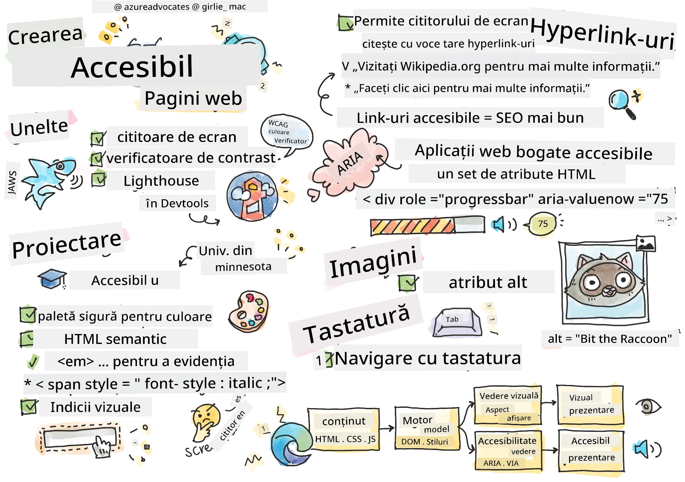
> Sketchnote de [Tomomi Imura](https://twitter.com/girlie_mac)

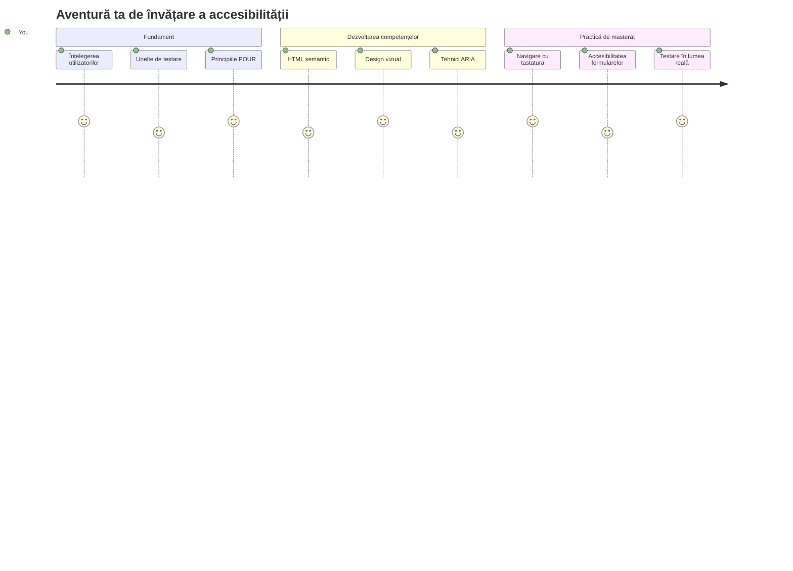
## Test Pregătitor Pre-Lecție
[Test pregătitor pre-lecție](https://ff-quizzes.netlify.app/web/)

> Puterea webului constă în universalitatea sa. Accesul pentru toată lumea, indiferent de dizabilitate, este un aspect esențial.
>
> \- Sir Timothy Berners-Lee, director W3C și inventatorul World Wide Web

Iată ceva care s-ar putea să te surprindă: când construiești site-uri web accesibile, nu ajuți doar persoanele cu dizabilități—de fapt faci webul mai bun pentru toată lumea!

Ai observat vreodată acele rampe de bordură de la colțurile străzilor? Inițial au fost proiectate pentru scaune cu rotile, dar acum ajută și persoanele cu cărucioare pentru copii, lucrătorii în livrări cu cărucioare, călătorii cu bagaje cu roți și chiar bicicliștii. Exact așa funcționează designul web accesibil—soluțiile care ajută un grup ajung adesea să beneficieze pe toată lumea. Destul de tare, nu?

În această lecție, vom explora cum să creăm site-uri web care funcționează cu adevărat pentru toată lumea, indiferent de modul în care navighează pe web. Vei descoperi tehnici practice deja integrate în standardele web, vei exersa cu instrumente de testare și vei vedea cum accesibilitatea face site-urile tale mai ușor de utilizat pentru toți utilizatorii.

La finalul acestei lecții, vei avea încrederea să faci accesibilitatea o parte naturală a fluxului tău de dezvoltare. Pregătit să explorezi cum alegerile de design atent gândite pot deschide webul pentru miliarde de utilizatori? Hai să începem!

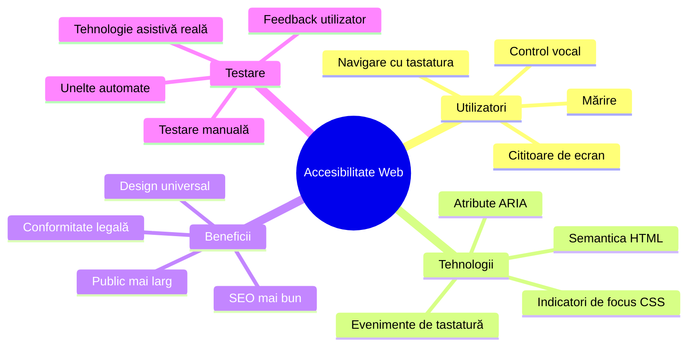
> Poți parcurge această lecție pe [Microsoft Learn](https://docs.microsoft.com/learn/modules/web-development-101/accessibility/?WT.mc_id=academic-77807-sagibbon)!

## Înțelegerea Tehnologiilor Assistive

Înainte să începem să codăm, hai să luăm un moment să înțelegem cum experimentează persoanele cu abilități diferite webul. Nu e doar teorie—înțelegerea acestor modele reale de navigare te va face un dezvoltator mult mai bun!

Tehnologiile assistive sunt unelte uimitoare care ajută persoanele cu dizabilități să interacționeze cu site-urile web în moduri care te-ar putea surprinde. Odată ce înțelegi cum funcționează aceste tehnologii, crearea de experiențe web accesibile devine mult mai intuitivă. E ca și cum ai învăța să vezi codul prin ochii altcuiva.

### Citiitoare de ecran

[Citiitoarele de ecran](https://en.wikipedia.org/wiki/Screen_reader) sunt dispozitive sofisticate care transformă textul digital în vorbire sau în ieșire pentru braille. Deși sunt folosite în principal de persoanele cu deficiențe de vedere, sunt foarte utile și pentru utilizatorii cu dizabilități de învățare, cum ar fi dislexia.

Îmi place să mă gândesc la un cititor de ecran ca fiind un narator foarte deștept care îți citește o carte. Citește conținutul cu voce tare în ordine logică, anunță elementele interactive precum „buton” sau „legătură” și oferă scurtături de tastatură pentru a sari prin pagină. Dar adevărul este că cititoarele de ecran pot face magie doar dacă construim site-uri web cu structură corectă și conținut relevant. Aici intervin tu, ca dezvoltator!

**Citiitoare de ecran populare pe platforme:**
- **Windows**: [NVDA](https://www.nvaccess.org/about-nvda/) (gratuit și cel mai popular), [JAWS](https://webaim.org/articles/jaws/), [Narrator](https://support.microsoft.com/windows/complete-guide-to-narrator-e4397a0d-ef4f-b386-d8ae-c172f109bdb1/?WT.mc_id=academic-77807-sagibbon) (integrat)
- **macOS/iOS**: [VoiceOver](https://support.apple.com/guide/voiceover/welcome/10) (integrat și foarte capabil)
- **Android**: [TalkBack](https://support.google.com/accessibility/android/answer/6283677) (integrat)
- **Linux**: [Orca](https://wiki.gnome.org/Projects/Orca) (gratuit și open-source)

**Cum navighează cititoarele de ecran conținutul web:**

Citiitoarele de ecran oferă multiple metode de navigare care fac explorarea rapidă pentru utilizatorii experimentați:
- **Citire secvențială**: Citește conținut de sus în jos, ca o carte
- **Navigare după repere**: Sare între secțiuni ale paginii (header, nav, main, footer)
- **Navigare după titluri**: Sare între titluri pentru a înțelege structura paginii
- **Liste de linkuri**: Generează o listă cu toate linkurile pentru acces rapid
- **Controlul formularelor**: Navighează direct între câmpurile de input și butoane

> 💡 **Ceva care m-a uimit**: 68% dintre utilizatorii de cititoare de ecran navighează preponderent folosind titlurile ([WebAIM Survey](https://webaim.org/projects/screenreadersurvey9/#finding)). Asta înseamnă că structura titlurilor este ca o hartă pentru utilizatori—când o faci corect, îi ajuți literalmente să se orienteze mai rapid prin conținutul tău!

### Construirea fluxului tău de testare

Am o veste bună—testarea eficientă a accesibilității nu trebuie să fie copleșitoare! Vei dori să combini unelte automate (sunt fantastice pentru a prinde problemele evidente) cu teste practice. Iată o abordare sistematică care, după experiența mea, prinde cele mai multe probleme fără să-ți ocupe tot timpul din zi:

**Flux esențial de testare manuală:**

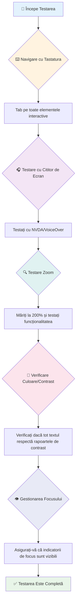
**Listă de verificare pas cu pas:**
1. **Navigare cu tastatura**: Folosește doar Tab, Shift+Tab, Enter, Space și săgețile
2. **Testare cu cititoare de ecran**: Activează NVDA, VoiceOver sau Narrator și navighează cu ochii închiși
3. **Testare zoom**: Testează la niveluri de zoom 200% și 400%
4. **Verificare contrast culori**: Verifică toate textele și componentele UI
5. **Testare indicator de focus**: Asigură-te că toate elementele interactive au stări de focus vizibile

✅ **Începe cu Lighthouse**: Deschide DevTools în browser, rulează un audit de accesibilitate Lighthouse și folosește rezultatele pentru a-ți ghida zonele de testare manuală.

### Zoom și unelte de mărire

Știi cum uneori faci pinch-to-zoom pe telefon când textul e prea mic sau te ferești să-ți încrunți sprâncenele la laptop în lumina puternică a soarelui? Mulți utilizatori se bazează zilnic pe unelte de mărire ca să facă conținutul lizibil. Asta include persoane cu vedere slabă, adulți în vârstă și oricine a încercat să citească un site afară.

Tehnologiile moderne de zoom au evoluat dincolo de a face lucrurile doar mai mari. Înțelegerea modului în care funcționează aceste unelte te va ajuta să creezi designuri responsive care rămân funcționale și atractive la orice nivel de mărire.

**Capabilități moderne de zoom în browsere:**
- **Zoom pagină**: Scalează conținutul proporțional (text, imagini, layout) - aceasta este metoda preferată
- **Zoom doar text**: Mărește dimensiunea fontului păstrând layoutul original
- **Pinch-to-zoom**: Gest mobil pentru mărire temporară
- **Suport browser**: Toate browserele moderne acceptă zoom până la 500% fără a strica funcționalitatea

**Software specializat de mărire:**
- **Windows**: [Magnifier](https://support.microsoft.com/windows/use-magnifier-to-make-things-on-the-screen-easier-to-see-414948ba-8b1c-d3bd-8615-0e5e32204198) (integrat), [ZoomText](https://www.freedomscientific.com/training/zoomtext/getting-started/)
- **macOS/iOS**: [Zoom](https://www.apple.com/accessibility/mac/vision/) (integrat cu funcții avansate)

> ⚠️ **Considerație de design**: WCAG cere ca conținutul să rămână funcțional la zoom 200%. La acest nivel, derularea orizontală ar trebui să fie minimă, iar toate elementele interactive să rămână accesibile.

✅ **Testează designul responsive**: Dă zoom browserului la 200% și 400%. Se adaptează layoutul elegant? Mai poți accesa toată funcționalitatea fără să derulezi excesiv?

## Instrumente Moderne pentru Testarea Accesibilității

Acum că ai înțeles cum navighează oamenii pe web folosind tehnologii assistive, să explorăm uneltele care te ajută să construiești și să testezi site-uri accesibile.

Gândește-te la asta așa: uneltele automate sunt excelent de bune pentru a prinde probleme evidente (cum ar fi lipsa textului alternativ), iar testarea practică te ajută să te asiguri că site-ul se simte bine în lumea reală. Împreună îți oferă încrederea că site-urile tale funcționează pentru toată lumea.

### Testarea contrastului culorilor

Veste bună: contrastul de culoare este una dintre problemele de accesibilitate cele mai frecvente, dar este și una dintre cele mai ușor de reparat. Un contrast bun ajută pe toată lumea—de la utilizatorii cu dizabilități de vedere până la cei care încearcă să citească telefoanele pe plajă.

**Cerinte WCAG privind contrastul:**

| Tip Text | WCAG AA (Minim) | WCAG AAA (Îmbunătățit) |
|-----------|-------------------|---------------------|
| **Text normal** (sub 18pt) | Raport de contrast 4.5:1 | Raport de contrast 7:1 |
| **Text mare** (18pt+ sau 14pt+ bold) | Raport de contrast 3:1 | Raport de contrast 4.5:1 |
| **Componente UI** (butoane, margini formulare) | Raport de contrast 3:1 | Raport de contrast 3:1 |

**Unelte esențiale de testare:**
- [Colour Contrast Analyser](https://www.tpgi.com/color-contrast-checker/) - Aplicație desktop cu selector de culori
- [WebAIM Contrast Checker](https://webaim.org/resources/contrastchecker/) - Web cu feedback instant
- [Stark](https://www.getstark.co/) - Plugin design pentru Figma, Sketch, Adobe XD
- [Accessible Colors](https://accessible-colors.com/) - Găsește palete de culori accesibile

✅ **Construiește palete coloristice mai bune**: Pornește de la culorile brandului tău și folosește verificatoare de contrast pentru a crea variante accesibile. Documentează-le ca tokeni de culoare accesibili în sistemul tău de design.

### Audit complet de accesibilitate

Testarea cea mai eficientă combină mai multe metode. Nici o unealtă singură nu prinde totul, deci construirea unei rutine de testare cu metode variate asigură o acoperire completă.

**Testare în browser (integrată în DevTools):**
- **Chrome/Edge**: audit accesibilitate Lighthouse + panoul Accessibility
- **Firefox**: Inspector accesibilitate cu vedere detaliată a arborelui
- **Safari**: tab audit în Web Inspector cu simulare VoiceOver

**Extensii profesionale de testare:**
- [axe DevTools](https://www.deque.com/axe/devtools/) - Standard în industrie pentru testare automată
- [WAVE](https://wave.webaim.org/extension/) - Feedback vizual cu evidențiere erori
- [Accessibility Insights](https://accessibilityinsights.io/) - Suită completă de testare Microsoft

**Linie de comandă și integrare CI/CD:**
- [axe-core](https://github.com/dequelabs/axe-core) - Bibliotecă JavaScript pentru testare automată
- [Pa11y](https://pa11y.org/) - Unealtă de testare accesibilitate în linie de comandă
- [Lighthouse CI](https://github.com/GoogleChrome/lighthouse-ci) - Scor automatizat accesibilitate

> 🎯 **Obiectiv de testare**: Țintește un scor Lighthouse de accesibilitate de peste 95 ca punct de bază. Amintește-ți, uneltele automate prind doar 30-40% dintre problemele de accesibilitate—testarea manuală rămâne esențială!

### 🧠 **Verificarea cunoștințelor de testare: Pregătit să găsești probleme?**

**Hai să vedem cum te simți legat de testarea accesibilității:**
- Care metodă de testare ți se pare cea mai accesibilă acum?
- Îți poți imagina să folosești doar tastatura pentru o zi întreagă?
- Care este o barieră de accesibilitate pe care ai întâlnit-o personal online?

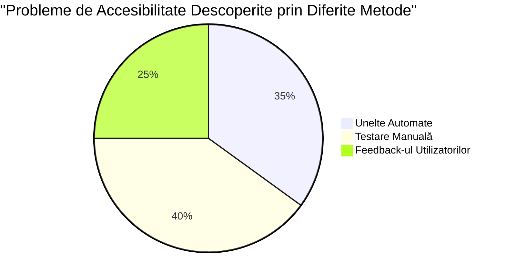
> **Întărire de încredere**: Testatorii profesioniști de accesibilitate folosesc exact această combinație de metode. Înveți practicile standard din industrie!

## Construind Accesibilitatea de la Fundament

Cheia succesului în accesibilitate este să o integrezi din prima zi. Știu că e tentant să spui „Voi adăuga accesibilitate mai târziu,” dar asta e ca și cum ai încerca să adaugi o rampă la o casă deja construită. Posibil? Da. Ușor? Nu chiar.

Gândește-te la accesibilitate ca la planificarea unei case—e mult mai ușor să incluzi accesibilitatea pentru scaune cu rotile în planurile arhitecturale inițiale decât să schimbi totul ulterior.

### Principiile POUR: Fundamentul accesibilității tale

Ghidurile de Accesibilitate pentru Conținut Web (WCAG) se bazează pe patru principii fundamentale care formează acronimul POUR. Nu-ți face griji—nu sunt concepte academice plictisitoare! Sunt de fapt sfaturi practice pentru a face conținut care funcționează pentru toată lumea.

Odată ce înțelegi POUR, luarea deciziilor legate de accesibilitate devine mult mai intuitivă. E ca și cum ai avea o listă mentală care îți ghidează alegerile de design. Hai să le descompunem:

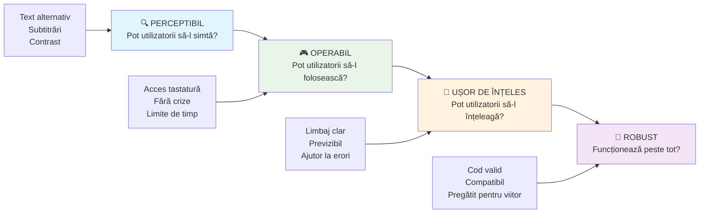
**🔍 Perceptibil**: Informațiile trebuie prezentate în moduri pe care utilizatorii să le poată percepe prin simțurile disponibile

- Oferă alternative textuale pentru conținut non-text (imagini, clipuri video, audio)
- Asigură contrast de culoare suficient pentru toate textele și componentele UI
- Oferă subtitrări și transcrieri pentru conținut multimedia
- Proiectează conținut care rămâne funcțional când este redimensionat până la 200%
- Folosește caracteristici senzoriale multiple (nu doar culoarea) pentru a transmite informații

**🎮 Operabil**: Toate componentele interfeței trebuie să poată fi operate prin metodele de input disponibile

- Fă toată funcționalitatea accesibilă prin navigare cu tastatura
- Oferă utilizatorilor suficient timp să citească și să interacționeze cu conținutul
- Evită conținut care poate provoca crize sau tulburări vestibulare
- Ajută utilizatorii să navigheze eficient cu structură clară și repere
- Asigură dimensiuni adecvate ale țintelor interactive (minimum 44px)

**📖 Ușor de înțeles**: Informațiile și funcționarea interfeței trebuie să fie clare și inteligibile

- Folosește un limbaj clar, simplu, potrivit pentru audiența ta
- Asigură-te că conținutul apare și funcționează în moduri previzibile și consistente
- Oferă instrucțiuni clare și mesaje de eroare pentru input-ul utilizatorilor
- Ajută utilizatorii să înțeleagă și să corecteze greșelile în formulare
- Organizează conținutul cu ordine logică de citire și ierarhie a informației

**💪 Robust**: Conținutul trebuie să funcționeze fiabil pe diferite tehnologii și dispozitive assistive

- **Folosește HTML valid și semantic ca fundament**
- **Asigură compatibilitatea cu tehnologiile assistive actuale și viitoare**
- **Urmează standardele web și bunele practici de markup**
- **Testează pe diferite browsere, dispozitive și instrumente asistive**
- **Structura conținutul astfel încât să degradeze grațios când funcțiile avansate nu sunt suportate**

### 🎯 **Verificarea principiilor POUR: Cum să rămână**

**Reflecție rapidă pe fundamente:**
- Poți să te gândești la o funcționalitate a unui site care încalcă fiecare principiu POUR?
- Care principiu ți se pare cel mai natural ca dezvoltator?
- Cum ar putea aceste principii să îmbunătățească designul pentru toți, nu doar pentru utilizatorii cu dizabilități?

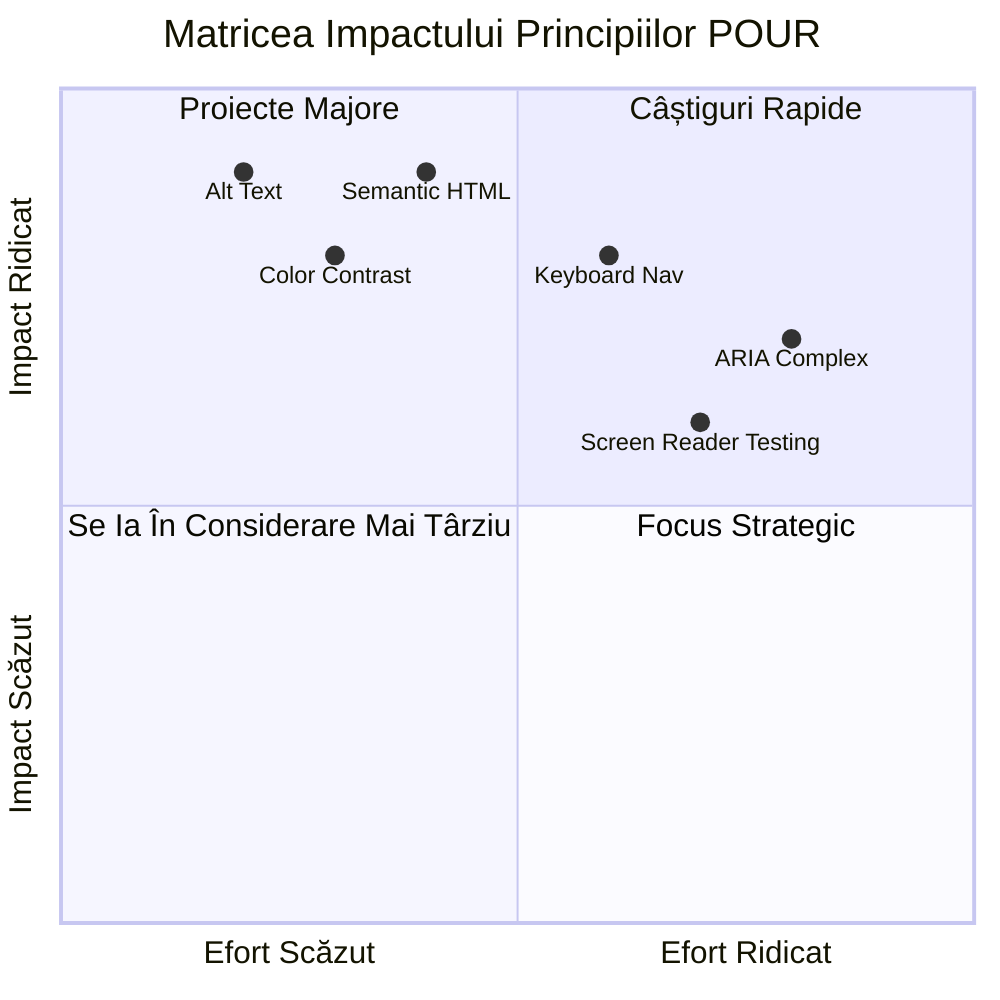
> **Amintește-ți**: Începe cu îmbunătățiri cu impact mare și efort mic. HTML semantic și textul alternativ oferă cel mai mare impuls accesibilității cu cel mai mic efort!

## Crearea unui design vizual accesibil

Un design vizual bun și accesibilitatea merg mână în mână. Când proiectezi având în vedere accesibilitatea, descoperi adesea că aceste constrângeri conduc la soluții mai curate, mai elegante, care avantajează toți utilizatorii.

Să explorăm cum să creezi designuri vizual atractive care funcționează pentru toată lumea, indiferent de abilitatea vizuală sau condițiile în care privesc conținutul tău.

### Strategii de culoare și accesibilitate vizuală

Culoarea este puternică pentru comunicare, dar nu ar trebui niciodată să fie singurul mod în care transmiți informații importante. Proiectarea dincolo de culoare creează experiențe mai robuste, incluzive, care funcționează în mai multe situații.

**Proiectează pentru diferențele de percepție a culorilor:**

Aproximativ 8% dintre bărbați și 0,5% dintre femei au unele forme de diferență în percepția culorilor (adesea numită "daltonism"). Cele mai comune tipuri sunt:
- **Deuteranopie**: Dificultate în a distinge roșul de verde
- **Protanopie**: Roșu pare mai estompat
- **Tritanopie**: Dificultăți cu albastrul și galbenul (rar)

**Strategii incluzive de culoare:**

```css
/* ❌ Bad: Using only color to indicate status */
.error { color: red; }
.success { color: green; }

/* ✅ Good: Color plus icons and context */
.error {
  color: #d32f2f;
  border-left: 4px solid #d32f2f;
}
.error::before {
  content: "⚠️";
  margin-right: 8px;
}

.success {
  color: #2e7d32;
  border-left: 4px solid #2e7d32;
}
.success::before {
  content: "✅";
  margin-right: 8px;
}
```

**Dincolo de cerințele de bază privind contrastul:**
- Testează alegerile de culoare cu simulatoare de daltonism
- Folosește modele, texturi sau forme în paralel cu codarea prin culoare
- Asigură-te că stările interactive rămân distincte fără culoare
- Ia în considerare cum arată designul tău în modul de contrast ridicat

✅ **Testează accesibilitatea culorii**: Folosește unelte precum [Coblis](https://www.color-blindness.com/coblis-color-blindness-simulator/) pentru a vedea cum apare site-ul tău pentru utilizatorii cu diferite tipuri de vedere a culorilor.

### Indicatori de focalizare și designul interacțiunii

Indicatorii de focalizare sunt echivalentul digital al cursorului — arată utilizatorilor de tastatură unde se află pe pagină. Indicatorii de focalizare bine proiectați îmbunătățesc experiența pentru toată lumea, făcând interacțiunile clare și previzibile.

**Cele mai bune practici moderne pentru indicatorii de focalizare:**

```css
/* Enhanced focus styles that work across browsers */
button:focus-visible {
  outline: 2px solid #0066cc;
  outline-offset: 2px;
  box-shadow: 0 0 0 4px rgba(0, 102, 204, 0.25);
}

/* Remove focus outline for mouse users, preserve for keyboard users */
button:focus:not(:focus-visible) {
  outline: none;
}

/* Focus-within for complex components */
.card:focus-within {
  box-shadow: 0 0 0 3px rgba(74, 144, 164, 0.5);
  border-color: #4A90A4;
}

/* Ensure focus indicators meet contrast requirements */
.custom-focus:focus-visible {
  outline: 3px solid #ffffff;
  outline-offset: 2px;
  box-shadow: 0 0 0 6px #000000;
}
```

**Cerințe pentru indicatorii de focalizare:**
- **Vizibilitate**: Trebuie să aibă un raport de contrast de cel puțin 3:1 cu elementele înconjurătoare
- **Lățime**: Minim 2px grosime pe toată marginea elementului
- **Persistență**: Trebuie să rămână vizibil până când focalizarea se mută în altă parte
- **Distincție**: Trebuie să fie vizual diferit de alte stări UI

> 💡 **Sfat de design**: Indicatorii de focalizare buni folosesc adesea o combinație de contur, umbre de cutie și schimbări de culoare pentru a asigura vizibilitatea pe diferite fundaluri și contexte.

✅ **Auditează indicatorii de focalizare**: Parcurge site-ul tău cu tabul și observă ce elemente au indicatori clari de focalizare. Sunt unele greu de văzut sau lipsesc complet?

### HTML semantic: Fundamentul accesibilității

HTML semantic este ca și cum ai da tehnologiilor asistive un sistem GPS pentru site-ul tău web. Când folosești elementele HTML potrivite pentru scopul lor, oferi practic cititoarelor de ecran, tastaturilor și altor instrumente o hartă detaliată care ajută utilizatorii să navigheze eficient.

Iată o analogie care mi-a plăcut foarte mult: HTML semantic este diferența dintre o bibliotecă bine organizată cu categorii clare și indicatoare utile, față de un depozit unde cărțile sunt împrăștiate aleatoriu. Ambele locuri au aceleași cărți, dar în care ai prefera să cauți ceva? Exact!

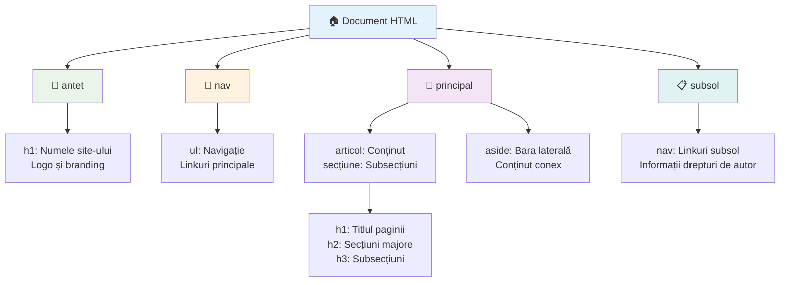
**Blocuri de construcție ale structurii accesibile a paginii:**

```html
<!-- Landmark elements provide page navigation structure -->
<header>
  <h1>Your Site Name</h1>
  <nav aria-label="Main navigation">
    <ul>
      <li><a href="/home">Home</a></li>
      <li><a href="/about">About</a></li>
      <li><a href="/services">Services</a></li>
    </ul>
  </nav>
</header>

<main>
  <article>
    <header>
      <h1>Article Title</h1>
      <p>Published on <time datetime="2024-10-14">October 14, 2024</time></p>
    </header>
    
    <section>
      <h2>First Section</h2>
      <p>Content that relates to this section...</p>
    </section>
    
    <section>
      <h2>Second Section</h2>
      <p>More related content...</p>
    </section>
  </article>
  
  <aside>
    <h2>Related Links</h2>
    <nav aria-label="Related articles">
      <ul>
        <li><a href="/related-1">First related article</a></li>
        <li><a href="/related-2">Second related article</a></li>
      </ul>
    </nav>
  </aside>
</main>

<footer>
  <p>&copy; 2024 Your Site Name. All rights reserved.</p>
  <nav aria-label="Footer links">
    <ul>
      <li><a href="/privacy">Privacy Policy</a></li>
      <li><a href="/contact">Contact Us</a></li>
    </ul>
  </nav>
</footer>
```

**De ce HTML semantic transformă accesibilitatea:**

| Element semantic | Scop | Beneficiu pentru cititorul de ecran |
|------------------|------|------------------------------------|
| `<header>` | Antetul paginii sau secțiunii | "Punct de reper banner" - navigare rapidă în sus |
| `<nav>` | Linkuri de navigare | "Punct de reper navigație" - listă de secțiuni de navigare |
| `<main>` | Conținutul principal al paginii | "Punct de reper principal" - salt direct la conținut |
| `<article>` | Conținut autonom | Anunță limitele articolului |
| `<section>` | Grupuri tematice de conținut | Oferă structură conținutului |
| `<aside>` | Conținut lateral conex | "Punct de reper complementar" |
| `<footer>` | Subsolul paginii sau secțiunii | "Punct de reper conținut informații" |

**Superputeri pentru cititoarele de ecran cu HTML semantic:**
- **Navigare prin puncte de reper**: Sări rapid între secțiunile majore ale paginii
- **Structuri de titluri**: Generează un cuprins din structura titlurilor
- **Liste de elemente**: Creează liste cu toate linkurile, butoanele sau controalele de formular
- **Conștientizare contextuală**: Înțelege relațiile dintre secțiunile de conținut

> 🎯 **Test rapid**: Încearcă să navighezi site-ul tău cu un cititor de ecran folosind scurtăturile pentru punctele de reper (D pentru reper, H pentru titlu, K pentru link în NVDA/JAWS). Are sens navigarea?

### 🏗️ **Verificarea măiestriei HTML semantic: Construirea unor fundații solide**

**Să evaluăm înțelegerea semantică:**
- Poți identifica punctele de reper pe o pagină doar uitându-te la HTML?
- Cum ai explica diferența dintre `<section>` și `<div>` unui prieten?
- Care este primul lucru pe care îl verifici dacă un utilizator de cititor de ecran raportează probleme de navigație?

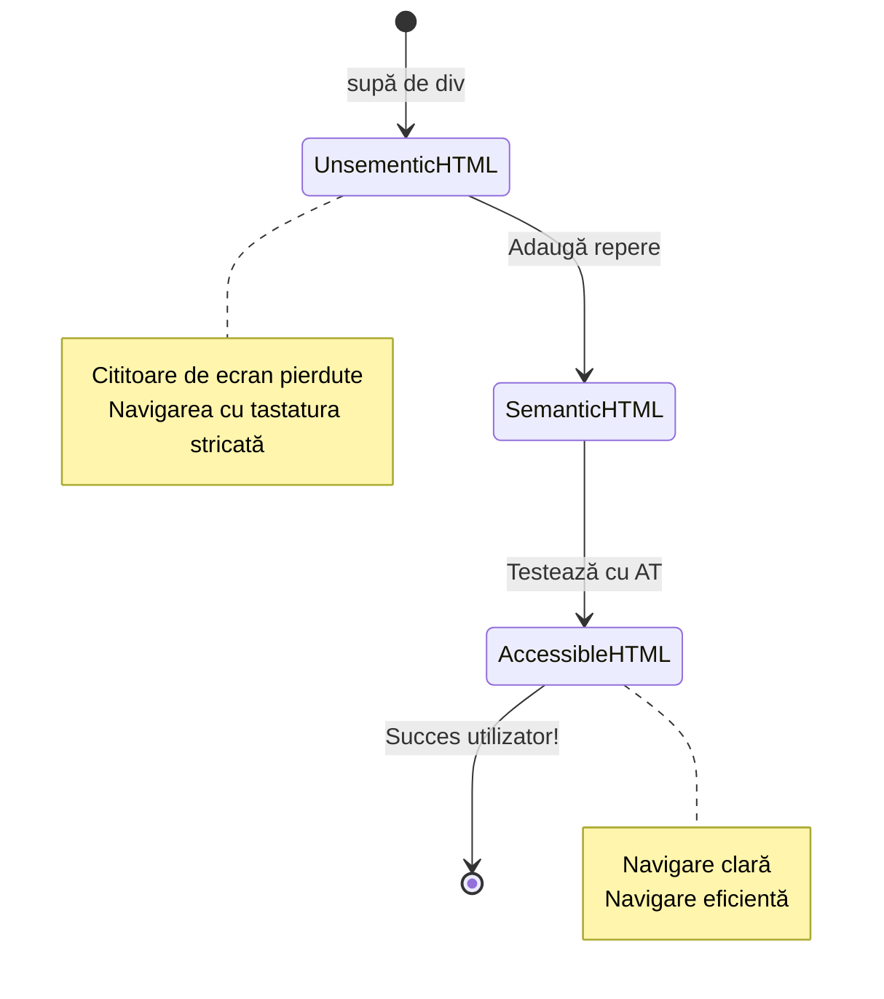
> **Sfat profesionist**: HTML-ul semantic bun rezolvă automat aproximativ 70% din problemele de accesibilitate. Stăpânește această fundație și ești pe drumul cel bun!

✅ **Auditează structura semantică**: Folosește panoul de Accesibilitate din DevTools al browserului tău pentru a vedea arborele de accesibilitate și a te asigura că markup-ul tău creează o structură logică.

### Ierarhia titlurilor: Crearea unui contur logic al conținutului

Titlurile sunt absolut cruciale pentru conținutul accesibil — sunt ca coloana vertebrală care ține totul împreună. Utilizatorii de cititoare de ecran se bazează foarte mult pe titluri pentru a înțelege și naviga conținutul tău. Gândește-te la ele ca și cum ai oferi un cuprins pentru pagina ta.

**Iată regula de aur pentru titluri:**
Niciodată să nu sări peste niveluri. Progresează întotdeauna logic de la `<h1>` la `<h2>`, la `<h3>`, și așa mai departe. Îți amintești când făceai contururi la școală? Este exact același principiu — nu ai sări de la „I. Punct principal” direct la „C. Sub-sub-punct” fără un „A. Sub-punct” între ele, corect?

**Exemplu de structură perfectă de titluri:**

```html
<!-- ✅ Excellent: Logical, hierarchical progression -->
<main>
  <h1>Complete Guide to Web Accessibility</h1>
  
  <section>
    <h2>Understanding Screen Readers</h2>
    <p>Introduction to screen reader technology...</p>
    
    <h3>Popular Screen Reader Software</h3>
    <p>NVDA, JAWS, and VoiceOver comparison...</p>
    
    <h3>Testing with Screen Readers</h3>
    <p>Step-by-step testing instructions...</p>
  </section>
  
  <section>
    <h2>Color and Contrast Guidelines</h2>
    <p>Designing with sufficient contrast...</p>
    
    <h3>WCAG Contrast Requirements</h3>
    <p>Understanding the different contrast levels...</p>
    
    <h3>Testing Tools and Techniques</h3>
    <p>Tools for verifying contrast ratios...</p>
  </section>
</main>
```

```html
<!-- ❌ Problematic: Skipping levels, inconsistent structure -->
<h1>Page Title</h1>
<h3>Subsection</h3> <!-- Skipped h2 -->
<h2>This should come before h3</h2>
<h1>Another main heading?</h1> <!-- Multiple h1s -->
```

**Cele mai bune practici pentru titluri:**
- **Un singur `<h1>` pe pagină**: De obicei titlul principal al paginii sau al conținutului primar
- **Progresie logică**: Niciodată să nu sari niveluri (h1 → h2 → h3, nu h1 → h3)
- **Conținut descriptiv**: Fă titlurile semnificative când sunt citite fără context
- **Stilizare vizuală cu CSS**: Folosește CSS pentru aspect, nivelele HTML pentru structură

**Statistici despre navigarea cu cititoare de ecran:**
- 68% dintre utilizatorii de cititoare de ecran navighează folosind titlurile ([Sondaj WebAIM](https://webaim.org/projects/screenreadersurvey9/#finding))
- Utilizatorii se așteaptă să găsească un contur logic al titlurilor
- Titlurile oferă cea mai rapidă modalitate de a înțelege structura paginii

> 💡 **Sfat profesionist**: Folosește extensii de browser precum "HeadingsMap" pentru a vizualiza structura titlurilor tale. Ar trebui să arate ca un cuprins bine organizat.

✅ **Testează structura titlurilor**: Folosește navigarea prin titluri a unui cititor de ecran (tasta H în NVDA) pentru a sări prin titlurile tale. Progresia spune povestea conținutului tău logic?

### Tehnici avansate de accesibilitate vizuală

Dincolo de elementele de bază asupra contrastului și culorii, există tehnici sofisticate care ajută la crearea unor experiențe vizuale cu adevărat incluzive. Aceste metode asigură că conținutul tău funcționează în diverse condiții de vizualizare și cu tehnologii asistive.

**Strategii esențiale de comunicare vizuală:**

- **Feedback multimodal**: Combină indicii vizuale, textuale și uneori audio
- **Dezvăluire progresivă**: Prezintă informații în bucăți digerabile
- **Tipare de interacțiune consistente**: Folosește convenții UI familiare
- **Tipografie responsive**: Scalează textul corespunzător pe diferite dispozitive
- **Stări de încărcare și eroare**: Oferă feedback clar pentru toate acțiunile utilizatorului

**Utilitare CSS pentru accesibilitate îmbunătățită:**

```css
/* Screen reader only text - visually hidden but accessible */
.sr-only {
  position: absolute;
  width: 1px;
  height: 1px;
  padding: 0;
  margin: -1px;
  overflow: hidden;
  clip: rect(0, 0, 0, 0);
  white-space: nowrap;
  border: 0;
}

/* Skip link for keyboard navigation */
.skip-link {
  position: absolute;
  top: -40px;
  left: 6px;
  background: #000000;
  color: #ffffff;
  padding: 8px 16px;
  text-decoration: none;
  border-radius: 4px;
  font-weight: bold;
  transition: top 0.3s ease;
  z-index: 1000;
}

.skip-link:focus {
  top: 6px;
}

/* Reduced motion respect */
@media (prefers-reduced-motion: reduce) {
  .skip-link {
    transition: none;
  }
  
  * {
    animation-duration: 0.01ms !important;
    animation-iteration-count: 1 !important;
    transition-duration: 0.01ms !important;
  }
}

/* High contrast mode support */
@media (prefers-contrast: high) {
  .button {
    border: 2px solid;
  }
}
```

> 🎯 **Model de accesibilitate**: „Linkul de sărit” este esențial pentru utilizatorii de tastatură. Ar trebui să fie primul element focusabil de pe pagină și sări direct la zona de conținut principal.

✅ **Implementează navigarea de sărit**: Adaugă linkuri „skip” pe paginile tale și testează-le apăsând Tab imediat după încărcarea paginii. Ele ar trebui să apară și să permită săritul la conținut principal.

## Crearea unui text semnificativ pentru linkuri

Linkurile sunt practic autostrăzile web-ului, dar un text de link scris prost este ca niște indicatoare rutiere care spun doar „Loc” în loc de „Centrul orașului Chicago.” Nu prea ajută, nu?

Iată ceva care m-a uimit când am învățat: cititoarele de ecran pot extrage toate linkurile de pe o pagină și le pot afișa ca o listă mare. Imaginează-ți că cineva ți-ar da un director cu toate linkurile de pe pagina ta. Ar avea fiecare sens de unul singur? Asta trebuie să treacă textul tău de link!

### Înțelegerea tiparelor de navigare prin linkuri

Cititoarele de ecran oferă funcții puternice de navigare prin linkuri care se bazează pe texte de link bine scrise:

**Metode de navigare prin linkuri:**
- **Citire secvențială**: Linkurile sunt citite în context ca parte a fluxului de conținut
- **Generare listă de linkuri**: Toate linkurile paginii compilate într-un director căutabil
- **Navigare rapidă**: Sarituri între linkuri cu scurtături de tastatură (K în NVDA)
- **Funcționalitatea de căutare**: Găsește linkuri specifice tastând text parțial

**De ce contează contextul:**
Când utilizatorii de cititoare de ecran generează o listă de linkuri, văd ceva de genul:
- „Descarcă raportul”
- „Află mai multe”
- „Click aici”
- „Politica de confidențialitate”
- „Click aici”

Doar două dintre aceste linkuri oferă informații utile când sunt citite în afara contextului!

> 📊 **Impact pentru utilizator**: Utilizatorii de cititoare de ecran scanează listele de linkuri pentru a înțelege rapid conținutul paginii. Textul generic al linkului îi forțează să se întoarcă la fiecare context, încetinindu-le semnificativ navigarea.

### Greșeli comune la textul linkurilor de evitat

Înțelegerea a ceea ce nu funcționează te ajută să recunoști și să corectezi problemele de accesibilitate în conținutul existent.

**❌ Text generic de link care nu oferă context:**

```html
<!-- Meaningless when read from a link list -->
<p>Our sustainability efforts are detailed in our recent report. 
   <a href="/sustainability-2024.pdf">Click here</a> to view it.</p>

<!-- Repeated generic text throughout the page -->
<div class="article-card">
  <h3>Web Accessibility Guide</h3>
  <p>Learn the fundamentals...</p>
  <a href="/accessibility-guide">Read more</a>
</div>
<div class="article-card">
  <h3>Color Contrast Tips</h3>
  <p>Improve your design...</p>
  <a href="/color-contrast">Read more</a>
</div>

<!-- URLs as link text (difficult for screen readers to announce) -->
<p>Visit https://www.w3.org/WAI/WCAG21/quickref/ for WCAG guidelines.</p>

<!-- Vague action words -->
<a href="/contact">Go</a> | <a href="/about">See</a> | <a href="/help">View</a>
```

**De ce aceste tipare dau greș:**
- **„Click aici”** nu spune nimic despre destinație
- **„Citește mai mult”** repetat de mai multe ori creează confuzie
- **URL-urile brute** sunt greu de pronunțat clar de cititoarele de ecran
- **Cuvintele singulare** precum „Mergi” sau „Vezi” lipsesc de context descriptiv

### Scrierea unui text excelent pentru linkuri

Textul descriptiv pentru linkuri avantajează pe toată lumea — utilizatorii văzători pot scana rapid linkurile, iar utilizatorii de cititoare de ecran înțeleg imediat destinațiile.

**✅ Exemple clare, descriptive de text pentru link:**

```html
<!-- Descriptive text that explains the destination -->
<p>Our comprehensive <a href="/sustainability-2024.pdf">2024 sustainability report (PDF, 2.1MB)</a> details our environmental initiatives.</p>

<!-- Specific, unique link text for each card -->
<div class="article-card">
  <h3>Web Accessibility Guide</h3>
  <p>Learn the fundamentals of inclusive design...</p>
  <a href="/accessibility-guide">Read our complete web accessibility guide</a>
</div>
<div class="article-card">
  <h3>Color Contrast Tips</h3>
  <p>Improve your design with better color choices...</p>
  <a href="/color-contrast">Explore color contrast best practices</a>
</div>

<!-- Meaningful text instead of raw URLs -->
<p>The <a href="https://www.w3.org/WAI/WCAG21/quickref/">WCAG 2.1 Quick Reference guide</a> provides comprehensive accessibility guidelines.</p>

<!-- Descriptive action links -->
<a href="/contact">Contact our support team</a> | 
<a href="/about">About our company</a> | 
<a href="/help">Get help with your account</a>
```

**Cele mai bune practici pentru textul linkurilor:**
- **Fii specific**: „Descarcă raportul financiar trimestrial” față de „Descarcă”
- **Include tipul și dimensiunea fișierului**: „(PDF, 1,2MB)” pentru fișiere de descărcat
- **Menționează dacă linkurile se deschid extern**: „(se deschide într-o fereastră nouă)” când este cazul
- **Folosește limbaj activ**: „Contactează-ne” față de „Pagina de contact”
- **Păstrează textul concis**: Caută să fie între 2-8 cuvinte, dacă se poate

### Tipare avansate de accesibilitate pentru linkuri

Uneori constrângerile de design vizual sau cerințele tehnice necesită soluții speciale. Iată tehnici sofisticate pentru scenarii comune provocatoare:

**Folosirea ARIA pentru context suplimentar:**

```html
<!-- When button text must be short but needs more context -->
<a href="/report.pdf" 
   aria-label="Download 2024 annual financial report, PDF format, 2.3MB">
  Download Report
</a>

<!-- When the full context comes from surrounding content -->
<h3 id="sustainability-heading">Sustainability Initiative</h3>
<p>Our efforts to reduce environmental impact...</p>
<a href="/sustainability-details" 
   aria-labelledby="sustainability-heading"
   aria-describedby="sustainability-summary">
  Learn more
</a>
<p id="sustainability-summary">Detailed breakdown of our 2024 environmental goals and achievements</p>
```

**Indicarea tipurilor de fișiere și destinațiilor externe:**

```html
<!-- Method 1: Include information in visible link text -->
<a href="/annual-report.pdf">
  Download our 2024 annual report (PDF, 2.3MB)
</a>

<!-- Method 2: Use screen reader-only text for file details -->
<a href="/annual-report.pdf">
  Download our 2024 annual report
  <span class="sr-only">(PDF format, 2.3MB)</span>
</a>

<!-- Method 3: External link indication -->
<a href="https://example.com" 
   target="_blank" 
   aria-describedby="external-link-warning">
  Visit external resource
</a>
<span id="external-link-warning" class="sr-only">
  (opens in new window)
</span>

<!-- Method 4: Using CSS for visual indicators -->
<a href="https://example.com" class="external-link">
  External resource
</a>
```

```css
/* Visual indicator for external links */
.external-link::after {
  content: " ↗";
  font-size: 0.8em;
  color: #666;
}

/* Screen reader announcement for external links */
.external-link::before {
  content: "External link: ";
  position: absolute;
  left: -10000px;
  width: 1px;
  height: 1px;
  overflow: hidden;
}
```

> ⚠️ **Important**: Când folosești `target="_blank"`, informează întotdeauna utilizatorii că linkul se deschide într-o fereastră sau filă nouă. Schimbările neașteptate de navigare pot fi derutante.

✅ **Testează contextul linkurilor tale**: Folosește uneltele pentru dezvoltatori ale browserului pentru a genera o listă a tuturor linkurilor de pe pagina ta. Înțelegi scopul fiecărui link fără niciun context suplimentar?

## ARIA: Superputerea accesibilității HTML

[Aplicațiile bogate accesibile pe Internet (ARIA)](https://developer.mozilla.org/docs/Web/Accessibility/ARIA) sunt ca un traducător universal între aplicațiile tale web complexe și tehnologiile asistive. Când HTML-ul singur nu poate exprima tot ce fac componentele tale interactive, ARIA intervine pentru a umfla aceste goluri.

Îmi place să privesc ARIA ca pe niște adnotări utile adăugate la HTML — cam ca indicațiile de regie dintr-un script de teatru care ajută actorii să înțeleagă rolurile și relațiile lor.

**Regula cea mai importantă despre ARIA**: Folosește întotdeauna mai întâi HTML semantic, apoi adaugă ARIA pentru a-l îmbunătăți. Gândește-te la ARIA ca la un condiment, nu ca la felul principal. Trebuie să clarifice și să îmbunătățească structura HTML, niciodată să o înlocuiască. Stăpânește mai întâi acea fundație!

### Implementarea strategică a ARIA

ARIA este puternic, dar cu puterea vine și responsabilitatea. ARIA incorectă poate face accesibilitatea mai dificilă decât absența ARIA. Iată când și cum să o folosești eficient:

**✅ Folosește ARIA când:**
- Creezi widgeturi interactive personalizate (acordeoane, taburi, carusele)
- Construiești conținut dinamic care se schimbă fără reîncărcarea paginii
- Oferi context suplimentar pentru relații UI complexe
- Indici stările de încărcare sau actualizările conținutului live
- Creezi interfețe de tip aplicație cu controale personalizate

**❌ Evită ARIA când:**
- Elementele HTML standard oferă deja semantica necesară
- Nu ești sigur cum să o implementezi corect
- Duplica informații furnizate deja de HTML semantic
- Nu ai testat cu tehnologie asistivă reală

> 🎯 **Regula de aur ARIA**: „Nu schimba semanticile decât dacă este absolut necesar, asigură accesibilitatea tastaturii întotdeauna și testează cu tehnologie asistivă reală.”
**Cele cinci categorii ARIA:**

1. **Roluri**: Ce este acest element? (`button`, `tab`, `dialog`)
2. **Proprietăți**: Care sunt caracteristicile sale? (`aria-required`, `aria-haspopup`)
3. **Stări**: Care este condiția sa curentă? (`aria-expanded`, `aria-checked`)
4. **Repere**: Unde se află în structura paginii? (`banner`, `navigation`, `main`)
5. **Regiuni live**: Cum ar trebui anunțate schimbările? (`aria-live`, `aria-atomic`)

### Modele ARIA esențiale pentru aplicații web moderne

Aceste modele rezolvă cele mai comune provocări de accesibilitate în aplicațiile web interactive:

**Denumirea și descrierea elementelor:**

```html
<!-- aria-label: Provides accessible name when visible text isn't sufficient -->
<button aria-label="Close newsletter subscription dialog">×</button>

<!-- aria-labelledby: References existing text as the accessible name -->
<section aria-labelledby="news-heading">
  <h2 id="news-heading">Latest News</h2>
  <!-- news content -->
</section>

<!-- aria-describedby: Links to additional descriptive text -->
<input type="password" 
       aria-describedby="pwd-requirements pwd-strength"
       required>
<div id="pwd-requirements">
  Password must contain at least 8 characters, including uppercase, lowercase, and numbers.
</div>
<div id="pwd-strength" aria-live="polite">
  <!-- Dynamic password strength indicator -->
</div>
```
  
**Regiuni live pentru conținut dinamic:**

```html
<!-- Polite announcements (don't interrupt current speech) -->
<div aria-live="polite" id="status-updates">
  <!-- Status messages appear here -->
</div>

<!-- Assertive announcements (interrupt and announce immediately) -->
<div aria-live="assertive" id="urgent-alerts">
  <!-- Error messages and critical alerts -->
</div>

<!-- Loading states with live regions -->
<button id="submit-btn" aria-describedby="loading-status">
  Submit Application
</button>
<div id="loading-status" aria-live="polite" aria-atomic="true">
  <!-- "Processing your application..." appears here -->
</div>
```
  
**Exemplu widget interactiv (acordeon):**

```html
<div class="accordion">
  <h3>
    <button aria-expanded="false" 
            aria-controls="panel-1" 
            id="accordion-trigger-1"
            class="accordion-trigger">
      Accessibility Guidelines
    </button>
  </h3>
  <div id="panel-1" 
       role="region"
       aria-labelledby="accordion-trigger-1" 
       hidden>
    <p>WCAG 2.1 provides comprehensive guidelines...</p>
  </div>
</div>
```
  
```javascript
// JavaScript pentru a gestiona starea acordeonului
function toggleAccordion(trigger) {
  const panel = document.getElementById(trigger.getAttribute('aria-controls'));
  const isExpanded = trigger.getAttribute('aria-expanded') === 'true';
  
  // Comutare stări
  trigger.setAttribute('aria-expanded', !isExpanded);
  panel.hidden = isExpanded;
  
  // Anunță schimbarea pentru cititoarele de ecran
  const status = document.getElementById('status-updates');
  status.textContent = isExpanded ? 'Section collapsed' : 'Section expanded';
}
```
  
### Cele mai bune practici pentru implementarea ARIA

ARIA este puternic, dar necesită implementare atentă. Urmarea acestor linii directoare ajută să te asiguri că ARIA îmbunătățește, nu împiedică accesibilitatea:

**🛡️ Principii fundamentale:**

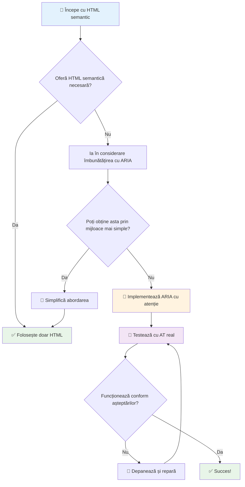
1. **HTML semantic primul**: Preferă întotdeauna `<button>` față de `<div role="button">`  
2. **Nu sparge semantica**: Nu suprascrie niciodată sensul existent al HTML (evită `<h1 role="button">`)  
3. **Menține accesibilitatea la tastatură**: Toate elementele interactive ARIA trebuie să fie complet accesibile prin tastatură  
4. **Testează cu utilizatori reali**: Suportul ARIA variază semnificativ între tehnologiile asistive  
5. **Pornește simplu**: Implementările ARIA complexe sunt mai predispuse la erori  

**🔍 Fluxul de testare:**

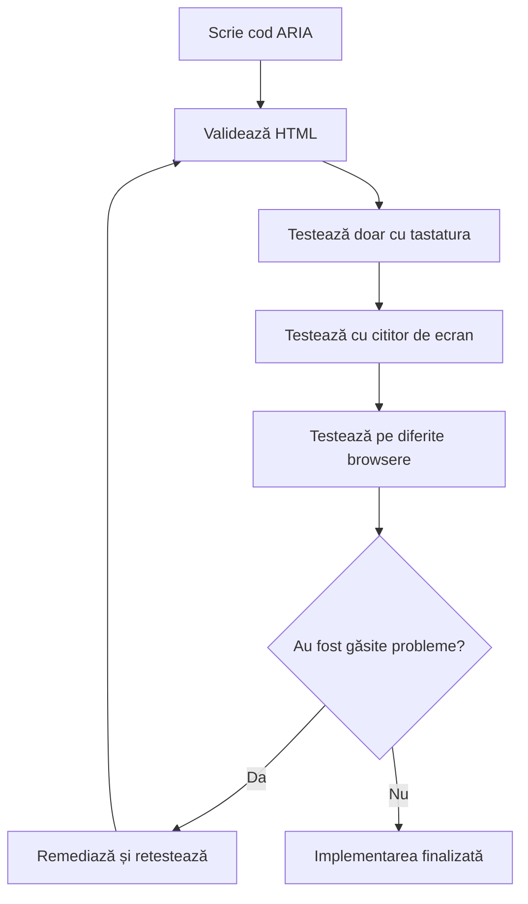
**🚫 Greșeli comune ARIA de evitat:**

- **Informații contradictorii**: Nu contrazice semantica HTML  
- **Supracolarea**: Prea multe informații ARIA copleșesc utilizatorii  
- **ARIA statică**: Uitarea actualizării stărilor ARIA când conținutul se schimbă  
- **Implementări netestate**: ARIA care funcționează în teorie, dar eșuează în practică  
- **Lipsa suportului pentru tastatură**: Roluri ARIA fără interacțiuni corespunzătoare la tastatură  

> 💡 **Resurse de testare**: Folosește unelte precum [accessibility-checker](https://www.npmjs.com/package/accessibility-checker) pentru validarea automată ARIA, dar testează întotdeauna cu cititoare de ecran reale pentru o experiență completă.

### 🎭 **Verificarea competențelor ARIA: Ești pregătit pentru interacțiuni complexe?**

**Evaluează-ți încrederea în ARIA:**  
- Când ai alege ARIA în locul HTML semantic? (Sugestie: aproape niciodată!)  
- Poți explica de ce `<div role="button">` este de obicei mai rău decât `<button>`?  
- Care este cel mai important aspect de reținut despre testarea ARIA?  

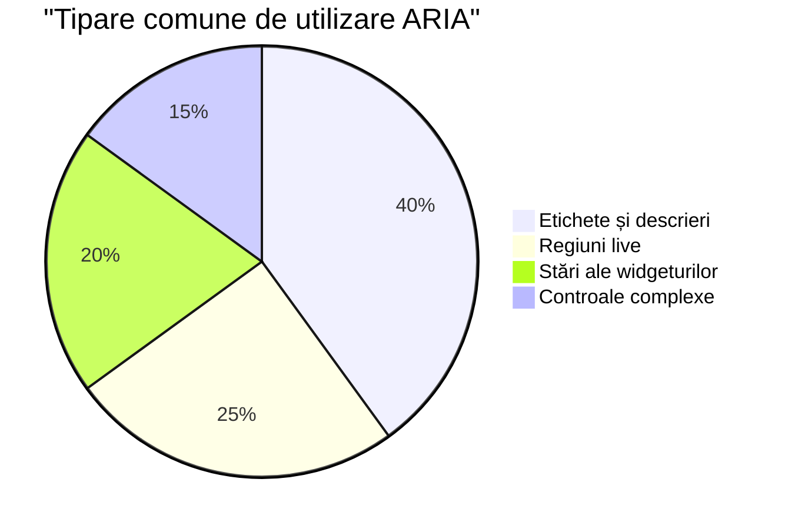
> **Insight cheie**: Majoritatea utilizărilor ARIA sunt pentru etichetarea și descrierea elementelor. Modelele complexe de widgeturi sunt mult mai puțin comune decât ai crede!

✅ **Învață de la experți**: Studiază [ARIA Authoring Practices Guide](https://w3c.github.io/aria-practices/) pentru modele și implementări testate ale widgeturilor interactive complexe.

## Fă imagini și media accesibile

Conținutul vizual și audio sunt părți esențiale ale experiențelor web moderne, dar pot crea bariere dacă nu sunt implementate cu grijă. Scopul este să te asiguri că informația și impactul emoțional al mediilor tale ajung la fiecare utilizator. Odată ce te prinzi, devine ceva firesc.

Diferitele tipuri de media necesită abordări diferite de accesibilitate. E ca gătitul – nu tratezi un pește delicat la fel cum tratezi o friptură consistentă. Înțelegerea acestor diferențe te ajută să alegi soluția potrivită pentru fiecare situație.

### Accesibilitatea strategică a imaginilor

Fiecare imagine de pe site-ul tău are un scop. Înțelegerea acestui scop te ajută să scrii texte alternative mai bune și să creezi experiențe mai incluzive.

**Cele patru tipuri de imagini și strategiile lor pentru text alternativ:**

**Imagini informative** – transmit informații importante:  
```html

```
  
**Imagini decorative** – doar vizuale, fără valoare informativă:  
```html

```
  
**Imagini funcționale** – servesc ca butoane sau controale:  
```html
<button>
  
</button>
```
  
**Imagini complexe** – grafice, diagrame, infografice:  
```html

<div id="chart-description">
  <p>Detailed description: Sales data shows a steady increase across all quarters...</p>
</div>
```
  
### Accesibilitatea video și audio

**Cerințe video:**  
- **Subtitrări**: versiune text a conținutului vorbit și efectelor sonore  
- **Descrieri audio**: narațiunea elementelor vizuale pentru utilizatorii nevăzători  
- **Transcrieri**: versiune text completă a conținutului audio și vizual  

```html
<video controls>
  <source src="video.mp4" type="video/mp4">
  <track kind="captions" src="captions.vtt" srclang="en" label="English">
  <track kind="descriptions" src="descriptions.vtt" srclang="en" label="Audio descriptions">
</video>
```
  
**Cerințe audio:**  
- **Transcrieri**: versiune text a tot conținutul vorbit  
- **Indicatoare vizuale**: pentru conținut audio, oferă indicii vizuale  

### Tehnici moderne pentru imagini

**Folosirea CSS pentru imagini decorative:**  
```css
.hero-section {
  background-image: url('decorative-hero.jpg');
  /* Decorative images in CSS don't need alt text */
}
```
  
**Imagini responsive cu accesibilitate:**  
```html
<picture>
  <source media="(min-width: 800px)" srcset="large-chart.png">
  <source media="(min-width: 400px)" srcset="medium-chart.png">
  
</picture>
```
  
✅ **Testează accesibilitatea imaginilor**: Folosește un cititor de ecran pentru a naviga o pagină cu imagini. Primești suficiente informații pentru a înțelege conținutul?

## Navigare la tastatură și managementul focusului

Mulți utilizatori navighează pe web exclusiv cu tastatura. Aceasta include persoane cu dizabilități motorii, utilizatori avansați care găsesc tastatura mai rapidă decât mouse-ul și oricine al cărui mouse nu funcționează. Asigurarea faptului că site-ul tău funcționează bine cu inputul de la tastatură este esențială și adesea face site-ul mai eficient pentru toată lumea.

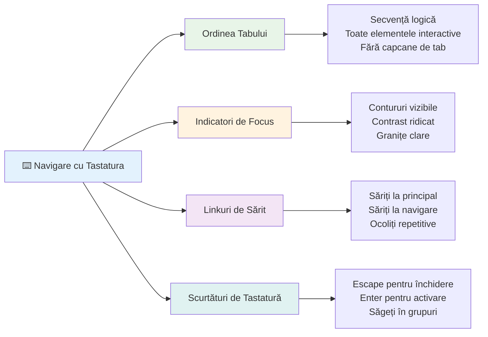
### Modele esențiale de navigare la tastatură

**Interacțiuni standard la tastatură:**  
- **Tab**: Mută focusul înainte prin elementele interactive  
- **Shift + Tab**: Mută focusul înapoi  
- **Enter**: Activează butoane și linkuri  
- **Space**: Activează butoane, bifează casete  
- **Taste săgeți**: Navighează în grupurile de componente (butoni radio, meniuri)  
- **Escape**: Închide modale, dropdown-uri sau anulează operațiuni  

### Cele mai bune practici pentru managementul focusului

**Indicatori vizibili pentru focus:**  
```css
/* Ensure focus is always visible */
button:focus-visible {
  outline: 2px solid #4A90A4;
  outline-offset: 2px;
}

/* Custom focus styles for different components */
.card:focus-within {
  box-shadow: 0 0 0 3px rgba(74, 144, 164, 0.5);
}
```
  
**Linkuri de sărit pentru navigare eficientă:**  
```html
<a href="#main-content" class="skip-link">Skip to main content</a>
<a href="#navigation" class="skip-link">Skip to navigation</a>

<nav id="navigation">
  <!-- navigation content -->
</nav>
<main id="main-content">
  <!-- main content -->
</main>
```
  
**Ordine corectă a tab-urilor:**  
```html
<!-- Use semantic HTML for natural tab order -->
<form>
  <label for="name">Name:</label>
  <input type="text" id="name" tabindex="0">
  
  <label for="email">Email:</label>
  <input type="email" id="email" tabindex="0">
  
  <button type="submit" tabindex="0">Submit</button>
</form>
```
  
### Blocarea focusului în modaluri

La deschiderea dialogurilor modale, focusul trebuie blocat în interiorul modalului:

```javascript
// Implementare modernă a capcanei de focalizare
function trapFocus(element) {
  const focusableElements = element.querySelectorAll(
    'button, [href], input, select, textarea, [tabindex]:not([tabindex="-1"])'
  );
  
  const firstElement = focusableElements[0];
  const lastElement = focusableElements[focusableElements.length - 1];

  element.addEventListener('keydown', (e) => {
    if (e.key === 'Tab') {
      if (e.shiftKey && document.activeElement === firstElement) {
        e.preventDefault();
        lastElement.focus();
      } else if (!e.shiftKey && document.activeElement === lastElement) {
        e.preventDefault();
        firstElement.focus();
      }
    }
    
    if (e.key === 'Escape') {
      closeModal();
    }
  });
  
  // Focalizează primul element când se deschide modalul
  firstElement.focus();
}
```
  
✅ **Testează navigarea la tastatură**: Încearcă să navighezi site-ul folosind doar tasta Tab. Poți ajunge la toate elementele interactive? Ordinea focusului este logică? Indicatorii focusului sunt clar vizibili?

## Accesibilitatea formularelor

Formularele sunt critice pentru interacțiunea utilizatorilor și necesită atenție specială la accesibilitate.

### Asocierea etichetelor și controalelor formularului

**Fiecare control de formular are nevoie de o etichetă:**  
```html
<!-- Explicit labeling (preferred) -->
<label for="username">Username:</label>
<input type="text" id="username" name="username" required>

<!-- Implicit labeling -->
<label>
  Password:
  <input type="password" name="password" required>
</label>

<!-- Using aria-label when visual label isn't desired -->
<input type="search" aria-label="Search products" placeholder="Search...">
```
  
### Gestionarea erorilor și validarea

**Mesaje de eroare accesibile:**  
```html
<label for="email">Email Address:</label>
<input type="email" id="email" name="email" 
       aria-describedby="email-error" 
       aria-invalid="true" required>
<div id="email-error" role="alert">
  Please enter a valid email address
</div>
```
  
**Cele mai bune practici pentru validarea formularelor:**  
- Folosește `aria-invalid` pentru a indica câmpuri invalide  
- Oferă mesaje de eroare clare și specifice  
- Folosește `role="alert"` pentru anunțuri importante de eroare  
- Afișează erorile atât imediat, cât și la trimiterea formularului  

### Gruparea câmpurilor cu fieldset-uri

**Grupează controalele de formular asociate:**  
```html
<fieldset>
  <legend>Shipping Address</legend>
  <label for="street">Street Address:</label>
  <input type="text" id="street" name="street">
  
  <label for="city">City:</label>
  <input type="text" id="city" name="city">
</fieldset>

<fieldset>
  <legend>Preferred Contact Method</legend>
  <input type="radio" id="contact-email" name="contact" value="email">
  <label for="contact-email">Email</label>
  
  <input type="radio" id="contact-phone" name="contact" value="phone">
  <label for="contact-phone">Phone</label>
</fieldset>
```
  
## Călătoria ta în accesibilitate: Concluzii cheie

Felicitări! Tocmai ai dobândit cunoștințele fundamentale pentru a crea experiențe web cu adevărat incluzive. Este ceva foarte interesant! Accesibilitatea web nu este doar despre bifarea cerințelor – este despre recunoașterea modurilor diverse în care oamenii interacționează cu conținutul digital și proiectarea pentru această complexitate uimitoare.

Acum faci parte dintr-o comunitate în creștere de dezvoltatori care înțeleg că un design grozav funcționează pentru toată lumea. Bine ai venit în club!

**🎯 Trusa ta de instrumente pentru accesibilitate include acum:**

| Principiu de bază             | Implementare                                   | Impact                                                    |
|------------------------------|-----------------------------------------------|-----------------------------------------------------------|
| **Fundamentul HTML semantic**| Folosește elemente HTML corespunzătoare       | Cititoarele de ecran navighează eficient, tastaturile funcționează automat |
| **Design vizual incluziv**    | Contrast suficient, utilizare semnificativă a culorilor, indicatori vizibili de focus | Clar pentru toată lumea în orice condiție de iluminare    |
| **Conținut descriptiv**       | Text de link semnificativ, alt text, titluri  | Utilizatorii înțeleg conținutul fără context vizual       |
| **Accesibilitate la tastatură**| Ordine tab, scurtături tastatură, managementul focusului | Accesibilitate motrică și eficiență pentru utilizatorii avansați |
| **Îmbunătățire ARIA**         | Utilizare strategică pentru a completa golurile semantice | Aplicații complexe funcționează cu tehnologii asistive    |
| **Testare cuprinzătoare**     | Unelte automate + verificare manuală + testare cu utilizatori reali | Depistează problemele înainte să afecteze utilizatorii    |

**🚀 Pașii următori:**

1. **Integrează accesibilitatea în fluxul tău de lucru**: Fă testarea parte naturală a procesului de dezvoltare  
2. **Învață de la utilizatori reali**: Caută feedback de la persoanele care folosesc tehnologii asistive  
3. **Rămâi la curent**: Tehnicile de accesibilitate evoluează odată cu noile tehnologii și standarde  
4. **Fii avocat pentru incluziune**: Împărtășește-ți cunoștințele și fă din accesibilitate o prioritate în echipă  

> 💡 **Amintește-ți**: Constrângerile accesibilității conduc adesea la soluții inovatoare și elegante care beneficiază pe toată lumea. Rampe pentru scări, subtitrări și comenzi vocale au început toate ca funcții de accesibilitate și au devenit îmbunătățiri mainstream.

**Argumentul de business este clar ca lumina zilei**: Site-urile accesibile ajung la mai mulți utilizatori, se clasează mai bine în motoarele de căutare, au costuri de întreținere mai mici și evită riscurile legale. Dar, sincer? Motivul real pentru care să-ți pese de accesibilitate este mult mai profund. Site-urile accesibile întruchipează cele mai bune valori ale webului – deschiderea, incluziunea și ideea că toată lumea merită acces egal la informație.

Ești acum echipat să construiești webul incluziv al viitorului. Fiecare site accesibil pe care îl creezi face internetul un loc mai primitor pentru toată lumea. Asta e chiar impresionant dacă te gândești!

## Resurse suplimentare

Continuă-ți călătoria de învățare a accesibilității cu aceste resurse esențiale:

**📚 Standarde și Ghiduri Oficiale:**  
- [WCAG 2.1 Guidelines](https://www.w3.org/WAI/WCAG21/quickref/) - Standardul oficial de accesibilitate cu referință rapidă  
- [ARIA Authoring Practices Guide](https://w3c.github.io/aria-practices/) - Modele cuprinzătoare pentru widgeturi interactive  
- [WebAIM Guidelines](https://webaim.org/) - Ghiduri practice și prietenoase pentru începători  

**🛠️ Unelte și Resurse de Testare:**  
- [axe DevTools](https://www.deque.com/axe/devtools/) - Testare accesibilitate standard industrie  
- [A11y Project Checklist](https://www.a11yproject.com/checklist/) - Verificare accesibilitate pas cu pas  
- [Accessibility Insights](https://accessibilityinsights.io/) - Suită completă de testare Microsoft  
- [Color Oracle](https://colororacle.org/) - Simulator pentru daltonism în testarea designului  

**🎓 Învățare și Comunitate:**  
- [WebAIM Screen Reader Survey](https://webaim.org/projects/screenreadersurvey9/) - Preferințe și comportamente ale utilizatorilor reali  
- [Inclusive Components](https://inclusive-components.design/) - Modele moderne de componente accesibile  
- [A11y Coffee](https://a11y.coffee/) - Sfaturi rapide și insight-uri în accesibilitate  
- [Web Accessibility Initiative (WAI)](https://www.w3.org/WAI/) - Resurse cuprinzătoare de accesibilitate de la W3C  

**🎥 Învățare practică:**  
- [Accessibility Developer Guide](https://www.accessibility-developer-guide.com/) - Ghid practic de implementare  
- [Deque University](https://dequeuniversity.com/) - Cursuri profesionale de accesibilitate  

## Provocarea GitHub Copilot Agent 🚀

Folosește modul Agent pentru a finaliza următoarea provocare:

**Descriere:** Creează un component dialog modal accesibil care să demonstreze management corect al focusului, atribute ARIA și modele de navigare la tastatură.

**Prompt:** Construiește un component complet de dialog modal cu HTML, CSS și JavaScript care să includă: blocarea corectă a focusului, tasta ESC pentru închidere, clic în afara modalei pentru închidere, atribute ARIA pentru cititoare de ecran și indicatori vizibili de focus. Modalul trebuie să conțină un formular cu etichete corecte și gestionarea erorilor. Asigură-te că componenta respectă standardele WCAG 2.1 AA.


## 🚀 Provocare

Ia acest HTML și rescrie-l pentru a fi cât mai accesibil posibil, aplicând strategiile învățate.

```html
<!DOCTYPE html>
<html lang="en">
  <head>
    <meta charset="UTF-8">
    <meta name="viewport" content="width=device-width, initial-scale=1.0">
    <title>Turtle Ipsum - The World's Premier Turtle Fan Club</title>
    <link href='../assets/style.css' rel='stylesheet' type='text/css'>
  </head>
  <body>
    <header class="site-header">
      <h1 class="site-title">Turtle Ipsum</h1>
      <p class="site-subtitle">The World's Premier Turtle Fan Club</p>
    </header>
    
    <nav class="main-nav" aria-label="Main navigation">
      <h2 class="nav-header">Resources</h2>
      <ul class="nav-list">
        <li><a href="https://www.youtube.com/watch?v=CMNry4PE93Y">"I like turtles" video</a></li>
        <li><a href="https://en.wikipedia.org/wiki/Turtle">Basic turtle information</a></li>
        <li><a href="https://en.wikipedia.org/wiki/Turtles_(chocolate)">Chocolate turtles candy</a></li>
      </ul>
    </nav>
    
    <main class="main-content">
      <article>
        <h1>Welcome to Turtle Ipsum</h1>
        <p class="intro">
          <a href="/about">Learn more about our turtle community</a> and discover fascinating facts about these amazing creatures.
        </p>
        <p class="article-text">
          Turtle ipsum dolor sit amet, consectetur adipiscing elit, sed do eiusmod tempor incididunt ut labore et dolore magna aliqua. Ut enim ad minim veniam, quis nostrud exercitation ullamco laboris nisi ut aliquip ex ea commodo consequat. Duis aute irure dolor in reprehenderit in voluptate velit esse cillum dolore eu fugiat nulla pariatur. Excepteur sint occaecat cupidatat non proident, sunt in culpa qui officia deserunt mollit anim id est laborum.
        </p>
      </article>
    </main>
    
    <footer class="footer">
      <section class="newsletter-signup">
        <h2>Stay Updated</h2>
        <button type="button" onclick="showNewsletterForm()">Sign up for turtle news</button>
      </section>
      
      <nav class="footer-nav" aria-label="Footer navigation">
        <h2>Site Pages</h2>
        <ul>
          <li><a href="../">Home</a></li>
          <li><a href="../semantic">Semantic HTML example</a></li>
        </ul>
      </nav>
      
      <p class="footer-copyright">&copy; 2024 Instrument. All rights reserved.</p>
    </footer>
  </body>
</html>
```
  
**Îmbunătățirile cheie realizate:**  
- Adăugarea unei structuri semantice HTML corecte  
- Corectarea ierarhiei titlurilor (un singur h1, progresie logică)  
- Text de link semnificativ în loc de „click aici”  
- Etichete ARIA adecvate pentru navigație  
- Adăugarea atributului lang și meta tag-urilor corecte  
- Folosirea elementului button pentru elementele interactive  
- Structurarea conținutului footer-ului cu repere adecvate  

## Test post-lectură  
[Chestionar post-lectură](https://ff-quizzes.netlify.app/web/en/)

## Recapitulare & Auto-studiu

Multe guverne au legi privind cerințele de accesibilitate. Citește despre legile de accesibilitate din țara ta. Ce acoperă și ce nu? Un exemplu este [acest site guvernamental](https://accessibility.blog.gov.uk/).

## Tema

[Analizează un site web neaccesibil](assignment.md)

Credite: [Turtle Ipsum](https://github.com/Instrument/semantic-html-sample) de Instrument

---

## 🚀 Cronologia ta pentru stăpânirea accesibilității

### ⚡ **Ce poți face în următoarele 5 minute**  
- [ ] Instalează extensia axe DevTools în browser  
- [ ] Rulează un audit de accesibilitate Lighthouse pe site-ul tău preferat  
- [ ] Încearcă să navighezi pe orice site folosind doar tasta Tab  
- [ ] Testează cititorul de ecran integrat al browserului tău (Narrator/VoiceOver)  

### 🎯 **Ce poți realiza în această oră**  
- [ ] Completează chestionarul post-lectură și reflectă asupra insight-urilor despre accesibilitate  
- [ ] Exersează scrierea de text alternativ semnificativ pentru 10 imagini diferite  
- [ ] Auditează structura titlurilor unui site folosind extensia HeadingsMap  
- [ ] Corectează problemele de accesibilitate găsite în HTML-ul provocării  
- [ ] Testează contrastul culorilor în proiectul tău curent cu unelte WebAIM  

### 📅 **Călătoria ta săptămânală în accesibilitate**  
- [ ] Finalizează tema analizând un site neaccesibil  
- [ ] Configurează-ți mediul de dezvoltare cu unelte pentru testarea accesibilității  
- [ ] Exersează navigarea cu tastatura pe 5 site-uri complexe diferite  
- [ ] Construiește un formular simplu cu etichete corecte, gestionarea erorilor și ARIA  
- [ ] Alătură-te unei comunități de accesibilitate (A11y Slack, forum WebAIM)  
- [ ] Urmărește utilizatori reali cu dizabilități care navighează pe site-uri (YouTube are exemple grozave)  

### 🌟 **Transformarea ta pe parcursul unei luni**  
- [ ] Integrează testarea accesibilității în fluxul tău de dezvoltare  
- [ ] Contribuie la un proiect open source remediind probleme de accesibilitate  
- [ ] Realizează teste de utilizabilitate cu o persoană care folosește tehnologie asistivă  
- [ ] Creează o bibliotecă de componente accesibile pentru echipa ta  
- [ ] Fă advocacy pentru accesibilitate la locul de muncă sau în comunitatea ta  
- [ ] Fii mentor pentru cineva nou în conceptele de accesibilitate  

### 🏆 **Verificarea finală pentru Campionul Accesibilității**  

**Sărbătorește-ți călătoria în accesibilitate:**  
- Care este cel mai surprinzător lucru pe care l-ai aflat despre modul în care oamenii folosesc webul?  
- Care principiu de accesibilitate rezonează cel mai mult cu stilul tău de dezvoltare?  
- Cum ți-a schimbat perspectiva asupra designului învățarea despre accesibilitate?  
- Care este prima îmbunătățire de accesibilitate pe care vrei să o faci într-un proiect real?  

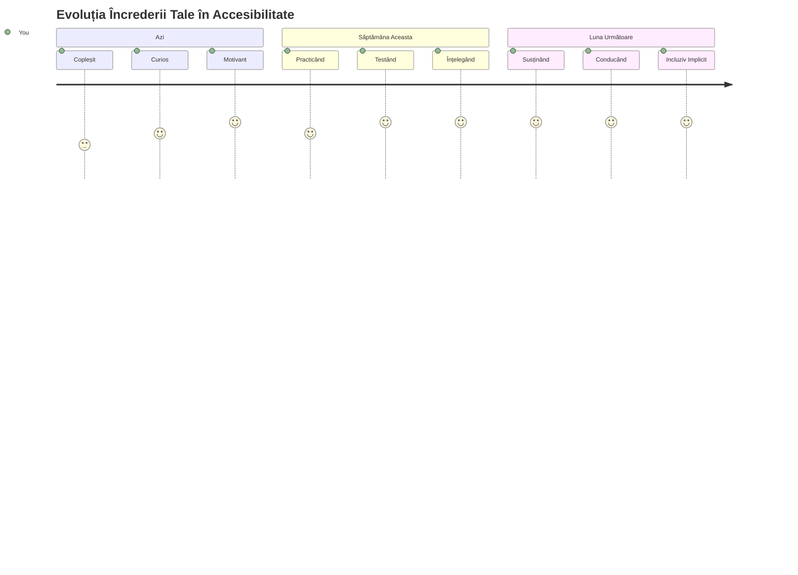
> 🌍 **Acum ești un campion al accesibilității!** Înțelegi că experiențele web excelente funcționează pentru toată lumea, indiferent de modul în care accesează webul. Fiecare caracteristică accesibilă pe care o construiești face internetul mai incluziv. Webul are nevoie de dezvoltatori ca tine, care văd accesibilitatea nu ca pe o constrângere, ci ca pe o oportunitate de a crea experiențe mai bune pentru toți utilizatorii. Bine ai venit în mișcare! 🎉

---

<!-- CO-OP TRANSLATOR DISCLAIMER START -->
**Declinare de responsabilitate**:  
Acest document a fost tradus folosind serviciul de traducere automată AI [Co-op Translator](https://github.com/Azure/co-op-translator). Deși ne străduim pentru acuratețe, vă rugăm să rețineți că traducerile automate pot conține erori sau inexactități. Documentul original, în limba sa nativă, trebuie considerat sursa autorizată. Pentru informații critice, se recomandă traducerea profesională realizată de un traducător uman. Nu ne asumăm răspunderea pentru eventualele neînțelegeri sau interpretări greșite rezultate din utilizarea acestei traduceri.
<!-- CO-OP TRANSLATOR DISCLAIMER END -->