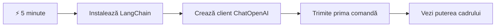
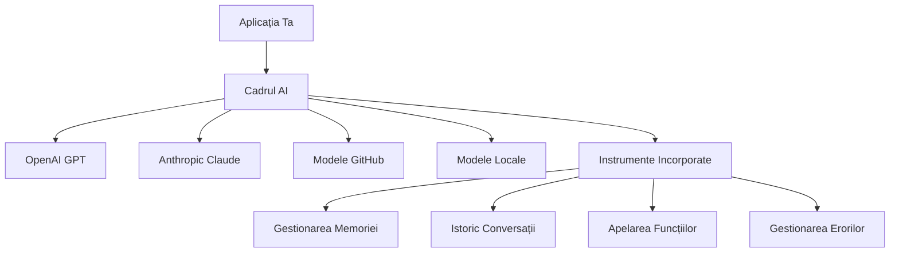
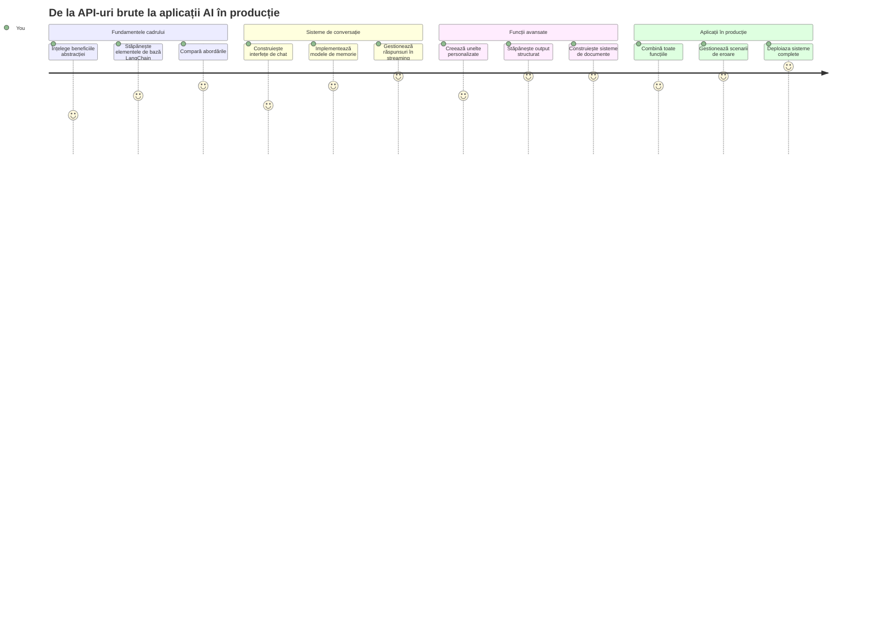
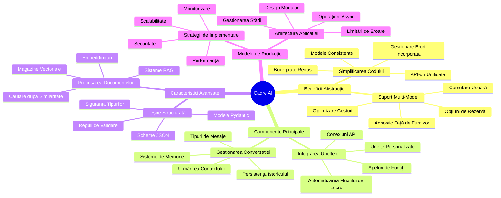
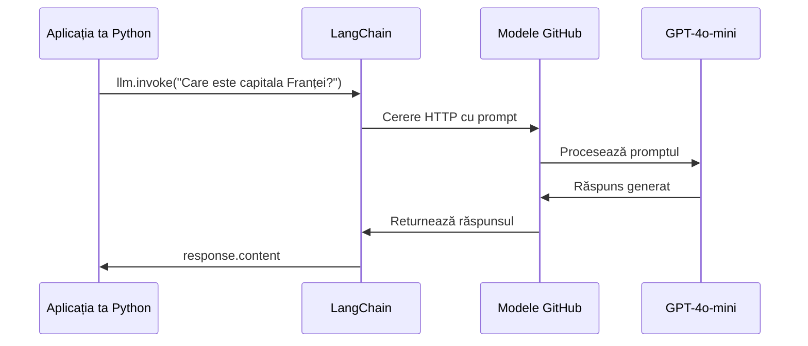
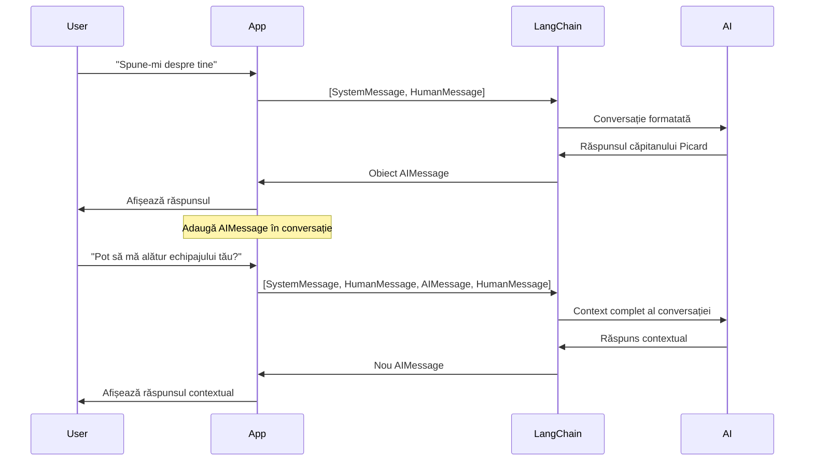
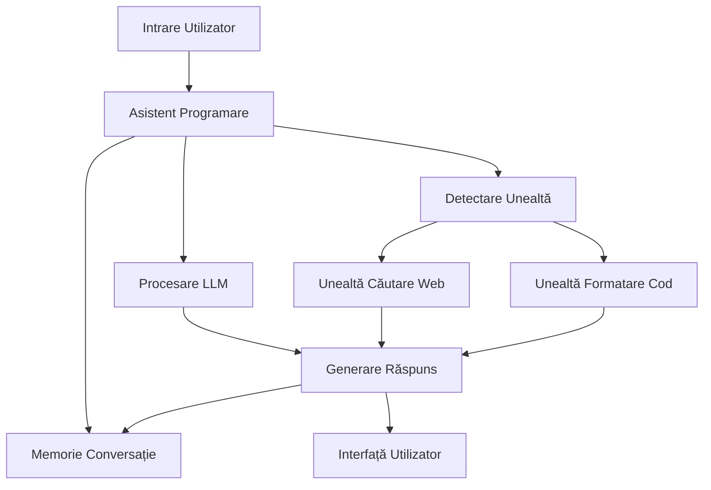
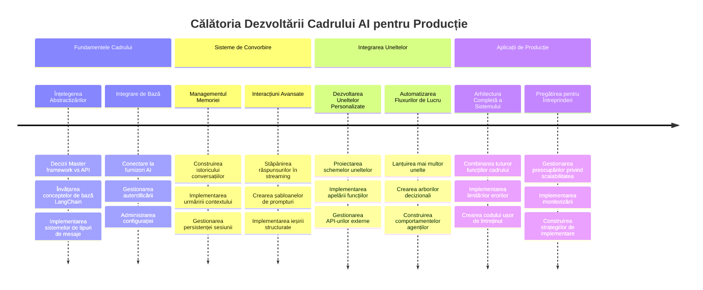
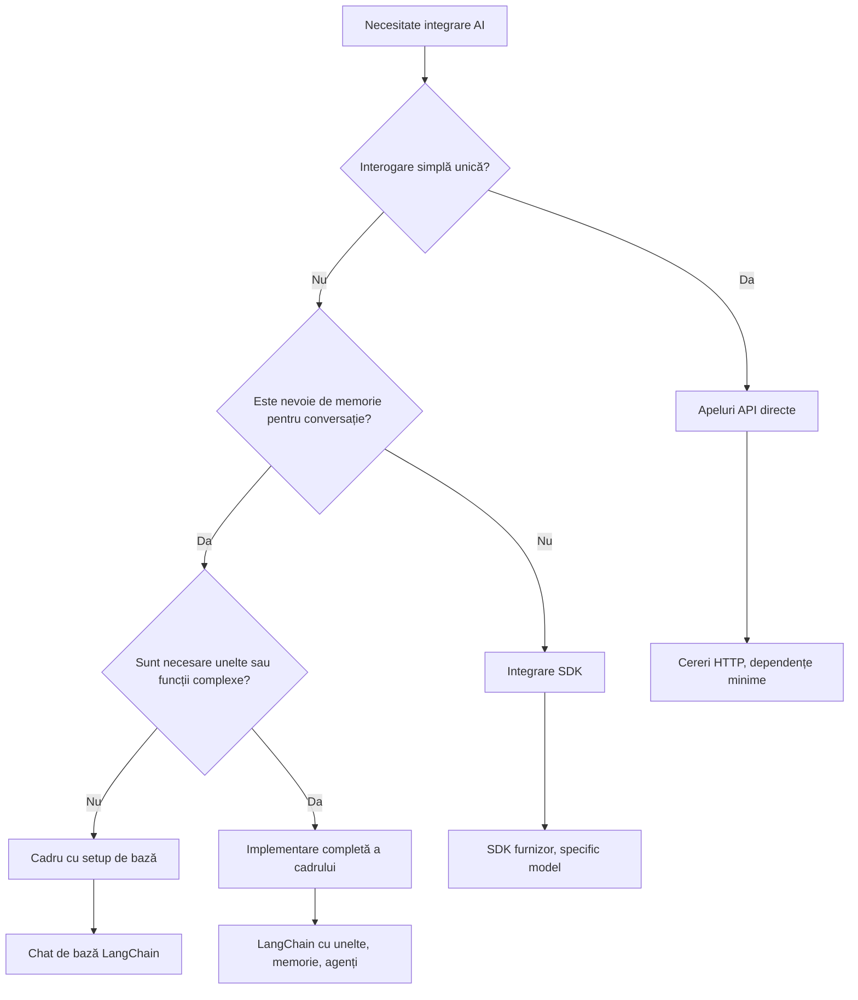

<!--
CO_OP_TRANSLATOR_METADATA:
{
  "original_hash": "3925b6a1c31c60755eaae4d578232c25",
  "translation_date": "2026-01-07T05:23:15+00:00",
  "source_file": "10-ai-framework-project/README.md",
  "language_code": "ro"
}
-->
# Cadru AI

Ți s-a întâmplat vreodată să te simți copleșit încercând să construiești aplicații AI de la zero? Nu ești singur! Cadrele AI sunt ca un cuțit elvețian pentru dezvoltarea AI-ului - sunt instrumente puternice care îți pot economisi timp și dureri de cap când construiești aplicații inteligente. Gândește-te la un cadru AI ca la o bibliotecă bine organizată: oferă componente pre-construite, API-uri standardizate și abstracții inteligente, astfel încât să te poți concentra pe rezolvarea problemelor în loc să te lupți cu detaliile implementării.

În această lecție, vom explora cum cadre ca LangChain pot transforma ceea ce înainte erau sarcini complexe de integrare AI în cod curat și ușor de citit. Vei descoperi cum să abordezi provocări reale, cum ar fi menținerea urmăririi conversațiilor, implementarea apelării de instrumente și gestionarea diferitelor modele AI printr-o interfață unificată.

Până la final, vei ști când să folosești cadre în loc de apeluri API brute, cum să folosești efectiv abstracțiile lor și cum să construiești aplicații AI pregătite pentru utilizare în lumea reală. Hai să explorăm ce pot face cadrele AI pentru proiectele tale.

## ⚡ Ce poți face în următoarele 5 minute

**Ghid rapid pentru dezvoltatori ocupați**


- **Minutul 1**: Instalează LangChain: `pip install langchain langchain-openai`
- **Minutul 2**: Configurează token-ul GitHub și importă clientul ChatOpenAI
- **Minutul 3**: Creează o conversație simplă cu mesaje sistem și umane
- **Minutul 4**: Adaugă un instrument de bază (ca o funcție add) și vezi cum AI apelează instrumentele
- **Minutul 5**: Experimentează diferența dintre apeluri API brute și abstracția cadrului

**Cod test rapid**:
```python
from langchain_openai import ChatOpenAI
from langchain_core.messages import SystemMessage, HumanMessage

llm = ChatOpenAI(
    api_key=os.environ["GITHUB_TOKEN"],
    base_url="https://models.github.ai/inference",
    model="openai/gpt-4o-mini"
)

response = llm.invoke([
    SystemMessage(content="You are a helpful coding assistant"),
    HumanMessage(content="Explain Python functions briefly")
])
print(response.content)
```

**De ce contează asta**: În 5 minute, vei vedea cum cadrele AI transformă integrarea complexă AI în apeluri simple de metode. Aceasta este fundația pentru aplicațiile AI de producție.

## De ce să alegi un cadru?

Deci ești gata să construiești o aplicație AI - grozav! Dar iată chestia: ai mai multe căi pe care le poți urma, și fiecare are avantajele și dezavantajele ei. E ca atunci când alegi între a merge pe jos, cu bicicleta sau cu mașina - toate te duc la destinație, dar experiența (și efortul) sunt complet diferite.

Hai să descompunem cele trei metode principale prin care poți integra AI în proiectele tale:

| Abordare | Avantaje | Cel mai potrivit pentru | Considerații |
|----------|------------|----------|--------------|
| **Solicitări HTTP directe** | Control total, fără dependențe | Interogări simple, învățarea elementelor de bază | Cod mai detaliat, gestionare manuală a erorilor |
| **Integrare SDK** | Mai puțin cod de rutină, optimizare specifică modelului | Aplicații cu un singur model | Limitat la furnizori specifici |
| **Cadre AI** | API unificat, abstracții încorporate | Aplicații multi-model, fluxuri de lucru complexe | Curba de învățare, posibilă supra-abstracție |

### Beneficiile cadrului în practică


**De ce sunt importante cadrele:**
- **Unifică** mai mulți furnizori AI sub o singură interfață
- **Gestionează** automat memoria conversației
- **Oferă** instrumente gata făcute pentru sarcini comune precum embeddings și apelarea funcțiilor
- **Administrează** gestionarea erorilor și logica de reîncercare
- **Transformă** fluxurile complexe în apeluri de metode ușor de citit

> 💡 **Sfat util**: Folosește cadrele când schimbi între diferite modele AI sau construiești funcții complexe precum agenți, memorie sau apelarea instrumentelor. Folosește API-uri directe când înveți noțiunile de bază sau construiești aplicații simple, concentrate.

**Concluzie**: Ca atunci când alegi între instrumentele specializate ale unui meșter și un atelier complet, este vorba de potrivirea instrumentului cu sarcina. Cadrele excelează pentru aplicații complexe, bogate în funcții, în timp ce API-urile directe funcționează bine pentru cazuri simple.

## 🗺️ Călătoria ta de învățare prin stăpânirea cadrelor AI


**Destinația călătoriei tale**: La finalul acestei lecții, vei fi stăpânit dezvoltarea cu cadre AI și vei putea construi aplicații AI sofisticate, pregătite pentru producție, care concurează cu asistenții AI comerciali.

## Introducere

În această lecție vom învăța să:

- Folosim un cadru comun AI.
- Abordăm probleme comune cum ar fi conversațiile de chat, utilizarea instrumentelor, memorie și context.
- Folosim tot acest lucru pentru a construi aplicații AI.

## 🧠 Ecosistemul dezvoltării cadrelor AI


**Principiul de bază**: Cadrele AI abstractizează complexitatea în timp ce oferă abstracții puternice pentru gestionarea conversațiilor, integrarea instrumentelor și procesarea documentelor, permițând dezvoltatorilor să construiască aplicații AI sofisticate cu cod curat și întreținut.

## Prima ta solicitare AI

Să începem cu elementele fundamentale creând prima ta aplicație AI care trimite o întrebare și primește un răspuns. Ca Arhimede descoperind principiul deplasării în cada lui, uneori cele mai simple observații conduc la cele mai puternice insight-uri - iar cadrele fac aceste insight-uri accesibile.

### Setarea LangChain cu modelele GitHub

Vom folosi LangChain pentru a ne conecta la modelele GitHub, ceea ce este foarte tare pentru că îți oferă acces gratuit la diferite modele AI. Partea cea mai bună? Ai nevoie doar de câțiva parametri simpli de configurare pentru a începe:

```python
from langchain_openai import ChatOpenAI
import os

llm = ChatOpenAI(
    api_key=os.environ["GITHUB_TOKEN"],
    base_url="https://models.github.ai/inference",
    model="openai/gpt-4o-mini",
)

# Trimite un mesaj simplu
response = llm.invoke("What's the capital of France?")
print(response.content)
```

**Să descompunem ce se întâmplă aici:**
- **Creează** un client LangChain folosind clasa `ChatOpenAI` - aceasta este poarta ta către AI!
- **Configurează** conexiunea la Modelele GitHub cu token-ul tău de autentificare
- **Specifica** modelul AI de folosit (`gpt-4o-mini`) - gândește-te la asta ca alegerea asistentului AI
- **Trimite** întrebarea ta folosind metoda `invoke()` - aici se întâmplă magia
- **Extrage** și afișează răspunsul - și voila, vorbești cu AI!

> 🔧 **Notă de configurare**: Dacă folosești GitHub Codespaces, ești norocos - `GITHUB_TOKEN` este deja configurat pentru tine! Lucrezi local? Nicio problemă, trebuie doar să creezi un token personal de acces cu permisiunile necesare.

**Rezultat așteptat:**
```text
The capital of France is Paris.
```


## Construirea AI-ului conversațional

Primul exemplu demonstrează elementele de bază, dar este doar un schimb simplu - pui o întrebare, primești un răspuns și gata. În aplicațiile reale, vrei ca AI-ul tău să-și amintească despre ce ați discutat, așa cum Watson și Holmes și-au construit conversațiile investigative în timp.

Aici LangChain devine cu adevărat util. Oferă tipuri diferite de mesaje care ajută la structurarea conversațiilor și îți permit să dai AI-ului o personalitate. Vei construi experiențe de chat care mențin contextul și caracterul.

### Înțelegerea tipurilor de mesaje

Gândește-te la aceste tipuri de mesaje ca la „pălăriile” diferite pe care participanții le poartă într-o conversație. LangChain folosește clase diferite de mesaje pentru a ține evidența cine spune ce:

| Tip mesaj | Scop | Exemplu de utilizare |
|--------------|---------|------------------|
| `SystemMessage` | Definește personalitatea și comportamentul AI-ului | "Ești un asistent de programare util" |
| `HumanMessage` | Reprezintă input-ul utilizatorului | "Explică cum funcționează funcțiile" |
| `AIMessage` | Stochează răspunsurile AI | Răspunsuri AI anterioare în conversație |

### Crearea primei conversații

Să creăm o conversație în care AI-ul nostru își asumă un rol specific. Îl vom face să întruchipeze pe Căpitanul Picard - un personaj cunoscut pentru înțelepciunea sa diplomatică și leadership:

```python
messages = [
    SystemMessage(content="You are Captain Picard of the Starship Enterprise"),
    HumanMessage(content="Tell me about you"),
]
```

**Descompunerea acestei configurații a conversației:**
- **Stabilește** rolul și personalitatea AI-ului prin `SystemMessage`
- **Oferă** interogarea inițială a utilizatorului prin `HumanMessage`
- **Creează** o bază pentru conversații cu mai multe replici

Codul complet pentru acest exemplu arată astfel:

```python
from langchain_core.messages import HumanMessage, SystemMessage
from langchain_openai import ChatOpenAI
import os

llm = ChatOpenAI(
    api_key=os.environ["GITHUB_TOKEN"],
    base_url="https://models.github.ai/inference",
    model="openai/gpt-4o-mini",
)

messages = [
    SystemMessage(content="You are Captain Picard of the Starship Enterprise"),
    HumanMessage(content="Tell me about you"),
]


# funcționează
response  = llm.invoke(messages)
print(response.content)
```

Ar trebui să vezi un rezultat similar cu:

```text
I am Captain Jean-Luc Picard, the commanding officer of the USS Enterprise (NCC-1701-D), a starship in the United Federation of Planets. My primary mission is to explore new worlds, seek out new life and new civilizations, and boldly go where no one has gone before. 

I believe in the importance of diplomacy, reason, and the pursuit of knowledge. My crew is diverse and skilled, and we often face challenges that test our resolve, ethics, and ingenuity. Throughout my career, I have encountered numerous species, grappled with complex moral dilemmas, and have consistently sought peaceful solutions to conflicts.

I hold the ideals of the Federation close to my heart, believing in the importance of cooperation, understanding, and respect for all sentient beings. My experiences have shaped my leadership style, and I strive to be a thoughtful and just captain. How may I assist you further?
```

Pentru a menține continuitatea conversației (în loc să resetezi contextul de fiecare dată), trebuie să continui să adaugi răspunsurile în lista ta de mesaje. La fel ca tradițiile orale care au păstrat povești de-a lungul generațiilor, această abordare construiește o memorie de durată:

```python
from langchain_core.messages import HumanMessage, SystemMessage
from langchain_openai import ChatOpenAI
import os

llm = ChatOpenAI(
    api_key=os.environ["GITHUB_TOKEN"],
    base_url="https://models.github.ai/inference",
    model="openai/gpt-4o-mini",
)

messages = [
    SystemMessage(content="You are Captain Picard of the Starship Enterprise"),
    HumanMessage(content="Tell me about you"),
]


# funcționează
response  = llm.invoke(messages)

print(response.content)

print("---- Next ----")

messages.append(response)
messages.append(HumanMessage(content="Now that I know about you, I'm Chris, can I be in your crew?"))

response  = llm.invoke(messages)

print(response.content)

```

Destul de tare, nu-i așa? Ce se întâmplă aici este că apelăm LLM-ul de două ori - mai întâi cu doar primele două mesaje, apoi din nou cu istoricul complet al conversației. E ca și cum AI-ul chiar ar urmări discuția noastră!

Când rulezi acest cod, vei primi un al doilea răspuns care sună cam așa:

```text
Welcome aboard, Chris! It's always a pleasure to meet those who share a passion for exploration and discovery. While I cannot formally offer you a position on the Enterprise right now, I encourage you to pursue your aspirations. We are always in need of talented individuals with diverse skills and backgrounds. 

If you are interested in space exploration, consider education and training in the sciences, engineering, or diplomacy. The values of curiosity, resilience, and teamwork are crucial in Starfleet. Should you ever find yourself on a starship, remember to uphold the principles of the Federation: peace, understanding, and respect for all beings. Your journey can lead you to remarkable adventures, whether in the stars or on the ground. Engage!
```


Ia să zicem că asta e un „poate” ;)

## Răspunsuri în streaming

Ai observat vreodată cum ChatGPT pare să „tasteze” răspunsurile în timp real? Asta este streaming în acțiune. Ca atunci când urmărești un caligraf priceput lucrând - vezi caracterele apărând trăsătură cu trăsătură, nu instantaneu - streaming-ul face ca interacțiunea să pară mai naturală și oferă feedback imediat.

### Implementarea streaming-ului cu LangChain

```python
from langchain_openai import ChatOpenAI
import os

llm = ChatOpenAI(
    api_key=os.environ["GITHUB_TOKEN"],
    base_url="https://models.github.ai/inference",
    model="openai/gpt-4o-mini",
    streaming=True
)

# Transmite răspunsul în flux
for chunk in llm.stream("Write a short story about a robot learning to code"):
    print(chunk.content, end="", flush=True)
```

**De ce este grozav streaming-ul:**
- **Arată** conținutul în timp ce e creat - gata cu așteptarea incomodă!
- **Face** utilizatorii să simtă că ceva chiar se întâmplă
- **Pare** mai rapid, chiar dacă tehnic poate nu este
- **Permite** utilizatorilor să înceapă să citească în timp ce AI-ul încă „gândește”

> 💡 **Sfat UX**: Streaming-ul strălucește cu adevărat când ai de-a face cu răspunsuri mai lungi, ca explicații de cod, scriere creativă sau tutoriale detaliate. Utilizatorii tăi vor iubi să vadă progresul în loc să se uite la un ecran gol!

### 🎯 Verificare pedagogică: Beneficiile abstracției în cadrul AI

**Pauză și Reflecție**: Tocmai ai experimentat puterea abstracțiilor cadrului AI. Compară ce ai învățat cu apelurile API brute din lecțiile anterioare.

**Autoevaluare rapidă:**
- Poți explica cum LangChain simplifică gestionarea conversațiilor comparativ cu urmărirea manuală a mesajelor?
- Care este diferența dintre metodele `invoke()` și `stream()`, și când ai folosi fiecare?
- Cum îmbunătățește sistemul de tipuri de mesaje al cadrului organizarea codului?

**Conexiune cu lumea reală**: Modelele de abstractizare pe care le-ai învățat (tipuri de mesaje, interfețe streaming, memorie conversațională) sunt folosite în fiecare aplicație majoră AI - de la interfața ChatGPT la asistența de cod GitHub Copilot. Stăpânești aceleași modele arhitecturale folosite de echipele profesionale de dezvoltare AI.

**Întrebare provocatoare**: Cum ai proiecta o abstracție de cadru pentru gestionarea diferiților furnizori de modele AI (OpenAI, Anthropic, Google) cu o singură interfață? Ia în considerare avantajele și compromisurile.

## Șabloane de prompturi

Șabloanele de prompturi funcționează ca structurile retorice folosite în oratoria clasică - gândește-te cum Cicero își adapta tiparele discursului pentru audiențe diferite păstrând același cadru persuasiv. Ele îți permit să creezi prompturi reutilizabile unde poți înlocui diferite bucăți de informație fără să rescrii totul de la zero. Odată configurat șablonul, completezi doar variabilele cu valorile de care ai nevoie.

### Crearea prompturilor reutilizabile

```python
from langchain_core.prompts import ChatPromptTemplate

# Definește un șablon pentru explicațiile codului
template = ChatPromptTemplate.from_messages([
    ("system", "You are an expert programming instructor. Explain concepts clearly with examples."),
    ("human", "Explain {concept} in {language} with a practical example for {skill_level} developers")
])

# Folosește șablonul cu valori diferite
questions = [
    {"concept": "functions", "language": "JavaScript", "skill_level": "beginner"},
    {"concept": "classes", "language": "Python", "skill_level": "intermediate"},
    {"concept": "async/await", "language": "JavaScript", "skill_level": "advanced"}
]

for question in questions:
    prompt = template.format_messages(**question)
    response = llm.invoke(prompt)
    print(f"Topic: {question['concept']}\n{response.content}\n---\n")
```

**De ce o să-ți placă să folosești șabloane:**
- **Păstrează** prompturile constante în întreaga aplicație
- **Fără** concatenări haotice de șiruri - doar variabile curate și simple
- **AI-ul** tău se comportă previzibil pentru că structura rămâne aceeași
- **Actualizările** sunt floare la ureche - schimbi șablonul o singură dată, și e corect peste tot

## Ieșire structurată

Te-ai enervat vreodată încercând să parsezi răspunsuri AI care vin ca text neformatat? Ieșirea structurată e ca și cum ai învăța AI-ul tău să urmeze metoda sistematică folosită de Linnaeus pentru clasificarea biologică - organizată, previzibilă și ușor de folosit. Poți cere JSON, structuri de date specifice sau orice format ai nevoie.

### Definirea schemelor de ieșire

```python
from langchain_core.prompts import ChatPromptTemplate
from langchain_core.output_parsers import JsonOutputParser
from pydantic import BaseModel, Field

class CodeReview(BaseModel):
    score: int = Field(description="Code quality score from 1-10")
    strengths: list[str] = Field(description="List of code strengths")
    improvements: list[str] = Field(description="List of suggested improvements")
    overall_feedback: str = Field(description="Summary feedback")

# Configurează parser-ul
parser = JsonOutputParser(pydantic_object=CodeReview)

# Creează promptul cu instrucțiuni de format
prompt = ChatPromptTemplate.from_messages([
    ("system", "You are a code reviewer. {format_instructions}"),
    ("human", "Review this code: {code}")
])

# Formatează promptul cu instrucțiunile
chain = prompt | llm | parser

# Obține răspunsul structurat
code_sample = """
def calculate_average(numbers):
    return sum(numbers) / len(numbers)
"""

result = chain.invoke({
    "code": code_sample,
    "format_instructions": parser.get_format_instructions()
})

print(f"Score: {result['score']}")
print(f"Strengths: {', '.join(result['strengths'])}")
```

**De ce ieșirea structurată schimbă regulile jocului:**
- **Fără** ghicit ce format vei primi înapoi - e constant de fiecare dată
- **Se integrează** direct în baze de date și API-uri fără efort suplimentar
- **Prinde** răspunsuri AI ciudate înainte să strice aplicația
- **Face** codul mai curat deoarece știi exact cu ce lucrezi

## Apelarea instrumentelor

Ajungem acum la una dintre cele mai puternice caracteristici: instrumentele. Așa îți oferi AI-ului tău capacități practice dincolo de conversație. La fel cum breaslele medievale dezvoltau unelte specializate pentru meșteșuguri anume, poți echipa AI-ul cu instrumente concentrate. Descrii ce instrumente sunt disponibile, iar când cineva solicită ceva care se potrivește, AI-ul tău poate acționa.

### Folosind Python

Să adăugăm câteva instrumente astfel:

```python
from typing_extensions import Annotated, TypedDict

class add(TypedDict):
    """Add two integers."""

    # Anotările trebuie să aibă tipul și pot include opțional o valoare implicită și o descriere (în această ordine).
    a: Annotated[int, ..., "First integer"]
    b: Annotated[int, ..., "Second integer"]

tools = [add]

functions = {
    "add": lambda a, b: a + b
}
```

Deci ce se întâmplă aici? Creăm un șablon pentru un instrument numit `add`. Prin moștenirea de la `TypedDict` și folosirea acelorași tipuri `Annotated` pentru `a` și `b`, îi oferim LLM-ului o imagine clară despre ce face acest instrument și ce are nevoie. Dicționarul `functions` este ca trusa noastră de unelte - spune codului nostru exact ce să facă când AI-ul decide să folosească un anumit instrument.

Hai să vedem cum apelăm LLM-ul cu acest instrument următor:

```python
llm = ChatOpenAI(
    api_key=os.environ["GITHUB_TOKEN"],
    base_url="https://models.github.ai/inference",
    model="openai/gpt-4o-mini",
)

llm_with_tools = llm.bind_tools(tools)
```

Aici apelăm `bind_tools` cu array-ul nostru de `tools` și astfel LLM-ul `llm_with_tools` are acum cunoștința acestui instrument.

Ca să folosim acest nou LLM, putem tasta următorul cod:

```python
query = "What is 3 + 12?"

res = llm_with_tools.invoke(query)
if(res.tool_calls):
    for tool in res.tool_calls:
        print("TOOL CALL: ", functions[tool["name"]](../../../10-ai-framework-project/**tool["args"]))
print("CONTENT: ",res.content)
```

Acum că apelăm `invoke` pe acest nou llm, care are instrumente, este posibil să avem proprietatea `tool_calls` populată. Dacă da, orice instrument identificat are o proprietate `name` și `args` care indică ce instrument trebuie apelat și cu ce argumente. Codul complet arată astfel:

```python
from langchain_core.messages import HumanMessage, SystemMessage
from langchain_openai import ChatOpenAI
import os
from typing_extensions import Annotated, TypedDict

class add(TypedDict):
    """Add two integers."""

    # Anotările trebuie să aibă tipul și pot include opțional o valoare implicită și o descriere (în această ordine).
    a: Annotated[int, ..., "First integer"]
    b: Annotated[int, ..., "Second integer"]

tools = [add]

functions = {
    "add": lambda a, b: a + b
}

llm = ChatOpenAI(
    api_key=os.environ["GITHUB_TOKEN"],
    base_url="https://models.github.ai/inference",
    model="openai/gpt-4o-mini",
)

llm_with_tools = llm.bind_tools(tools)

query = "What is 3 + 12?"

res = llm_with_tools.invoke(query)
if(res.tool_calls):
    for tool in res.tool_calls:
        print("TOOL CALL: ", functions[tool["name"]](../../../10-ai-framework-project/**tool["args"]))
print("CONTENT: ",res.content)
```

Rulând acest cod, ar trebui să vezi un output similar cu:

```text
TOOL CALL:  15
CONTENT: 
```

AI-ul a analizat „Ce este 3 + 12” și a recunoscut aceasta ca o sarcină pentru instrumentul `add`. Așa cum un bibliotecar abil știe ce referință să consulte în funcție de tipul întrebării, a făcut această determinare pe baza numelui instrumentului, descrierii și specificațiilor câmpului. Rezultatul de 15 vine din execuția instrumentului prin dicționarul nostru `functions`:

```python
print("TOOL CALL: ", functions[tool["name"]](../../../10-ai-framework-project/**tool["args"]))
```

### Un instrument mai interesant care apelează o API web


Adăugarea numerelor demonstrează conceptul, dar uneltele reale efectuează de obicei operații mai complexe, cum ar fi apelarea API-urilor web. Să extindem exemplul nostru astfel încât AI-ul să preia conținut de pe internet - similar cu modul în care operatorii de telegraf conectau odinioară locații îndepărtate:

```python
class joke(TypedDict):
    """Tell a joke."""

    # Anotările trebuie să aibă tipul și pot include opțional o valoare implicită și o descriere (în această ordine).
    category: Annotated[str, ..., "The joke category"]

def get_joke(category: str) -> str:
    response = requests.get(f"https://api.chucknorris.io/jokes/random?category={category}", headers={"Accept": "application/json"})
    if response.status_code == 200:
        return response.json().get("value", f"Here's a {category} joke!")
    return f"Here's a {category} joke!"

functions = {
    "add": lambda a, b: a + b,
    "joke": lambda category: get_joke(category)
}

query = "Tell me a joke about animals"

# restul codului este la fel
```

Acum, dacă vei rula acest cod, vei primi un răspuns care spune ceva de genul:

```text
TOOL CALL:  Chuck Norris once rode a nine foot grizzly bear through an automatic car wash, instead of taking a shower.
CONTENT:  
```

```mermaid
flowchart TD
    A[Interogare utilizator: "Spune-mi o glumă despre animale"] --> B[Analiză LangChain]
    B --> C{Instrument disponibil?}
    C -->|Da| D[Selectează instrumentul pentru glume]
    C -->|Nu| E[Generează răspuns direct]
    
    D --> F[Extrage parametrii]
    F --> G[Apelează gluma(categorie="animale")]
    G --> H[Cerere API către chucknorris.io]
    H --> I[Returnează conținutul glumei]
    I --> J[Afișează utilizatorului]
    
    E --> K[Răspuns generat de AI]
    K --> J
    
    subgraph "Stratul de definiție al instrumentului"
        L[Schema TypedDict]
        M[Implementarea funcției]
        N[Validarea parametrilor]
    end
    
    D --> L
    F --> N
    G --> M
```
Iată codul în întregime:

```python
from langchain_openai import ChatOpenAI
import requests
import os
from typing_extensions import Annotated, TypedDict

class add(TypedDict):
    """Add two integers."""

    # Anotațiile trebuie să aibă tipul și pot include opțional o valoare implicită și o descriere (în această ordine).
    a: Annotated[int, ..., "First integer"]
    b: Annotated[int, ..., "Second integer"]

class joke(TypedDict):
    """Tell a joke."""

    # Anotațiile trebuie să aibă tipul și pot include opțional o valoare implicită și o descriere (în această ordine).
    category: Annotated[str, ..., "The joke category"]

tools = [add, joke]

def get_joke(category: str) -> str:
    response = requests.get(f"https://api.chucknorris.io/jokes/random?category={category}", headers={"Accept": "application/json"})
    if response.status_code == 200:
        return response.json().get("value", f"Here's a {category} joke!")
    return f"Here's a {category} joke!"

functions = {
    "add": lambda a, b: a + b,
    "joke": lambda category: get_joke(category)
}

llm = ChatOpenAI(
    api_key=os.environ["GITHUB_TOKEN"],
    base_url="https://models.github.ai/inference",
    model="openai/gpt-4o-mini",
)

llm_with_tools = llm.bind_tools(tools)

query = "Tell me a joke about animals"

res = llm_with_tools.invoke(query)
if(res.tool_calls):
    for tool in res.tool_calls:
        # print("APEL INSTRUMENT: ", tool)
        print("TOOL CALL: ", functions[tool["name"]](../../../10-ai-framework-project/**tool["args"]))
print("CONTENT: ",res.content)
```

## Embeddings și procesarea documentelor

Embeddings reprezintă una dintre cele mai elegante soluții din AI-ul modern. Imaginează-ți că ai putea lua orice fragment de text și să îl convertești în coordonate numerice care capturează semnificația sa. Exact asta fac embeddings - transformă textul în puncte într-un spațiu multidimensional unde conceptele similare se grupează împreună. E ca și cum ai avea un sistem de coordonate pentru idei, asemănător modului în care Mendeleev a organizat tabelul periodic după proprietăți atomice.

### Crearea și utilizarea embeddings

```python
from langchain_openai import OpenAIEmbeddings
from langchain_community.vectorstores import FAISS
from langchain_community.document_loaders import TextLoader
from langchain.text_splitter import CharacterTextSplitter

# Inițializează încorporările
embeddings = OpenAIEmbeddings(
    api_key=os.environ["GITHUB_TOKEN"],
    base_url="https://models.github.ai/inference",
    model="text-embedding-3-small"
)

# Încarcă și împarte documentele
loader = TextLoader("documentation.txt")
documents = loader.load()

text_splitter = CharacterTextSplitter(chunk_size=1000, chunk_overlap=0)
texts = text_splitter.split_documents(documents)

# Creează un depozit vectorial
vectorstore = FAISS.from_documents(texts, embeddings)

# Efectuează căutare după similaritate
query = "How do I handle user authentication?"
similar_docs = vectorstore.similarity_search(query, k=3)

for doc in similar_docs:
    print(f"Relevant content: {doc.page_content[:200]}...")
```

### Loader-e de documente pentru diverse formate

```python
from langchain_community.document_loaders import (
    PyPDFLoader,
    CSVLoader,
    JSONLoader,
    WebBaseLoader
)

# Încarcă diferite tipuri de documente
pdf_loader = PyPDFLoader("manual.pdf")
csv_loader = CSVLoader("data.csv")
json_loader = JSONLoader("config.json")
web_loader = WebBaseLoader("https://example.com/docs")

# Procesează toate documentele
all_documents = []
for loader in [pdf_loader, csv_loader, json_loader, web_loader]:
    docs = loader.load()
    all_documents.extend(docs)
```

**Ce poți face cu embeddings:**
- **Construi** căutări care înțeleg cu adevărat ce vrei să spui, nu doar potrivire de cuvinte-cheie
- **Crea** AI care poate răspunde la întrebări despre documentele tale
- **Realiza** sisteme de recomandări care sugerează conținut cu adevărat relevant
- **Organiza** și **categoria** automat conținutul tău

```mermaid
flowchart LR
    A[Documente] --> B[Segmentator de text]
    B --> C[Creare de încorporări]
    C --> D[Magazin vectorial]
    
    E[Interogare utilizator] --> F[Încorporare interogare]
    F --> G[Căutare similaritate]
    G --> D
    D --> H[Documente relevante]
    H --> I[Răspuns AI]
    
    subgraph "Spațiu vectorial"
        J[Document A: [0.1, 0.8, 0.3...]]
        K[Document B: [0.2, 0.7, 0.4...]]
        L[Interogare: [0.15, 0.75, 0.35...]]
    end
    
    C --> J
    C --> K
    F --> L
    G --> J
    G --> K
```
## Construirea unei aplicații AI complete

Acum vom integra tot ce ai învățat într-o aplicație cuprinzătoare - un asistent de programare care poate răspunde la întrebări, folosește unelte și păstrează memoria conversației. Asemenea felului în care presa de tipar a combinat tehnologii existente (tipar mobil, cerneală, hârtie și presiune) într-un ceva transformator, vom combina componentele noastre AI într-un ceva practic și util.

### Exemplu de aplicație completă

```python
from langchain_openai import ChatOpenAI, OpenAIEmbeddings
from langchain_core.prompts import ChatPromptTemplate
from langchain_core.messages import HumanMessage, SystemMessage, AIMessage
from langchain_community.vectorstores import FAISS
from typing_extensions import Annotated, TypedDict
import os
import requests

class CodingAssistant:
    def __init__(self):
        self.llm = ChatOpenAI(
            api_key=os.environ["GITHUB_TOKEN"],
            base_url="https://models.github.ai/inference",
            model="openai/gpt-4o-mini"
        )
        
        self.conversation_history = [
            SystemMessage(content="""You are an expert coding assistant. 
            Help users learn programming concepts, debug code, and write better software.
            Use tools when needed and maintain a helpful, encouraging tone.""")
        ]
        
        # Definește uneltele
        self.setup_tools()
    
    def setup_tools(self):
        class web_search(TypedDict):
            """Search for programming documentation or examples."""
            query: Annotated[str, "Search query for programming help"]
        
        class code_formatter(TypedDict):
            """Format and validate code snippets."""
            code: Annotated[str, "Code to format"]
            language: Annotated[str, "Programming language"]
        
        self.tools = [web_search, code_formatter]
        self.llm_with_tools = self.llm.bind_tools(self.tools)
    
    def chat(self, user_input: str):
        # Adaugă mesajul utilizatorului la conversație
        self.conversation_history.append(HumanMessage(content=user_input))
        
        # Obține răspunsul AI
        response = self.llm_with_tools.invoke(self.conversation_history)
        
        # Gestionează apelurile instrumentelor, dacă există
        if response.tool_calls:
            for tool_call in response.tool_calls:
                tool_result = self.execute_tool(tool_call)
                print(f"🔧 Tool used: {tool_call['name']}")
                print(f"📊 Result: {tool_result}")
        
        # Adaugă răspunsul AI la conversație
        self.conversation_history.append(response)
        
        return response.content
    
    def execute_tool(self, tool_call):
        tool_name = tool_call['name']
        args = tool_call['args']
        
        if tool_name == 'web_search':
            return f"Found documentation for: {args['query']}"
        elif tool_name == 'code_formatter':
            return f"Formatted {args['language']} code: {args['code'][:50]}..."
        
        return "Tool execution completed"

# Exemplu de utilizare
assistant = CodingAssistant()

print("🤖 Coding Assistant Ready! Type 'quit' to exit.\n")

while True:
    user_input = input("You: ")
    if user_input.lower() == 'quit':
        break
    
    response = assistant.chat(user_input)
    print(f"🤖 Assistant: {response}\n")
```

**Arhitectura aplicației:**


**Caracteristici cheie implementate:**
- **Păstrează** întreaga conversație pentru continuitatea contextului
- **Execută acțiuni** prin apelarea uneltelor, nu doar conversație
- **Urmărește** tipare previzibile de interacțiune
- **Gestionează** automat tratarea erorilor și fluxuri de lucru complexe

### 🎯 Verificare pedagogică: Arhitectura AI de producție

**Înțelegerea arhitecturii**: Ai construit o aplicație AI completă care combină managementul conversației, apelarea uneltelor și fluxuri de lucru structurate. Aceasta reprezintă dezvoltarea unei aplicații AI la nivel de producție.

**Concepte cheie stăpânite**:
- **Arhitectură bazată pe clase**: structură organizată și ușor de întreținut pentru aplicații AI
- **Integrarea uneltelor**: funcționalitate personalizată dincolo de conversație
- **Managementul memoriei**: context persistent al conversației
- **Tratamentul erorilor**: comportament robust al aplicației

**Conexiune cu industria**: Modelele arhitecturale pe care le-ai implementat (clase de conversație, sisteme de unelte, managementul memoriei) sunt aceleași utilizate în aplicațiile AI ale corporațiilor precum asistentul AI Slack, GitHub Copilot și Microsoft Copilot. Construiești cu o gândire arhitecturală profesională.

**Întrebare de reflecție**: Cum ai extinde această aplicație pentru a gestiona utilizatori multipli, stocare persistentă sau integrare cu baze de date externe? Ia în considerare provocările scalabilității și gestionării stării.

## Tema: Construiește-ți propriul asistent de studiu alimentat de AI

**Obiectiv**: Creează o aplicație AI care să ajute studenții să învețe concepte de programare oferind explicații, exemple de cod și quiz-uri interactive.

### Cerințe

**Funcționalități de bază (obligatorii):**
1. **Interfață conversațională**: implementează un sistem de chat care păstrează contextul pe mai multe întrebări
2. **Unelte educaționale**: creează cel puțin două unelte care ajută la învățare:
   - unealtă de explicare a codului
   - generator de quiz-uri despre concepte
3. **Învățare personalizată**: folosește mesaje de sistem pentru a adapta răspunsurile la niveluri diferite de abilitate
4. **Formatare a răspunsului**: implementează un output structurat pentru întrebările de quiz

### Pași pentru implementare

**Pasul 1: Configurarea mediului**
```bash
pip install langchain langchain-openai
```

**Pasul 2: Funcționalitate de bază chat**
- Creează o clasă `StudyAssistant`
- Implementează memoria conversației
- Adaugă configurare de personalitate pentru suport educațional

**Pasul 3: Adaugă unelte educaționale**
- **Explicator de cod**: descompune codul în părți ușor de înțeles
- **Generator de quiz**: creează întrebări despre concepte de programare
- **Urmăritor de progres**: ține evidența subiectelor abordate

**Pasul 4: Funcționalități îmbunătățite (opțional)**
- Implementează streaming al răspunsurilor pentru o experiență mai bună
- Adaugă încărcarea documentelor pentru a integra materiale de curs
- Creează embeddings pentru recuperarea conținutului bazată pe similaritate

### Criterii de evaluare

| Funcționalitate | Excelent (4) | Bun (3) | Satisfăcător (2) | Necesită îmbunătățiri (1) |
|-----------------|--------------|---------|------------------|---------------------------|
| **Flux conversațional** | Răspunsuri naturale, conștiente de context | Păstrează bine contextul | Conversație de bază | Fără memorie între schimburi |
| **Integrare unelte** | Multe unelte utile care funcționează perfect | 2+ unelte implementate corect | 1-2 unelte de bază | Uneltele nu funcționează |
| **Calitatea codului** | Curat, bine documentat, tratare erori | Structură bună, ceva documentație | Funcționalitate de bază | Structură slabă, fără tratare erori |
| **Valoare educațională** | Cu adevărat util pentru învățare, adaptiv | Suport bun pentru învățare | Explicații de bază | Beneficiu educațional limitat |

### Structură exemplu de cod

```python
class StudyAssistant:
    def __init__(self, skill_level="beginner"):
        # Inițializează LLM, uneltele și memoria conversației
        pass
    
    def explain_code(self, code, language):
        # Unealtă: Explică cum funcționează codul
        pass
    
    def generate_quiz(self, topic, difficulty):
        # Unealtă: Creează întrebări de practică
        pass
    
    def chat(self, user_input):
        # Interfața principală a conversației
        pass

# Exemplu de utilizare
assistant = StudyAssistant(skill_level="intermediate")
response = assistant.chat("Explain how Python functions work")
```

**Provocări bonus:**
- Adaugă capabilități voce input/output
- Implementează o interfață web folosind Streamlit sau Flask
- Creează o bază de cunoștințe din materiale de curs cu embeddings
- Adaugă urmărirea progresului și căi personalizate de învățare

## 📈 Cronologia stăpânirii dezvoltării framework-ului AI


**🎓 Punct de absolvire**: Ai stăpânit cu succes dezvoltarea framework-ului AI folosind aceleași unelte și modele care animă aplicațiile AI moderne. Aceste competențe reprezintă vârful dezvoltării aplicațiilor AI și te pregătesc pentru a construi sisteme inteligente la nivel enterprise.

**🔄 Capacități următor nivel**:
- Ești gata să explorezi arhitecturi AI avansate (agenți, sisteme multi-agent)
- Pregătit să construiești sisteme RAG cu baze de date vectoriale
- Echipat să creezi aplicații AI multimodale
- Fundament pus pentru scalarea și optimizarea aplicațiilor AI

## Rezumat

🎉 Acum ai stăpânit fundamentele dezvoltării framework-ului AI și ai învățat să construiești aplicații AI sofisticate folosind LangChain. Ca și cum ai termina un stagiu complet, ai dobândit o trusă de unelte substanțială. Să recapitulezi ce ai realizat.

### Ce ai învățat

**Concepte fundamentale ale framework-ului:**
- **Avantajele framework-urilor**: când să alegi framework-uri în locul apelurilor directe la API-uri
- **Bazele LangChain**: configurarea și conectarea modelelor AI
- **Tipuri de mesaje**: folosirea `SystemMessage`, `HumanMessage` și `AIMessage` pentru conversații structurate

**Funcționalități avansate:**
- **Apelarea uneltelor**: crearea și integrarea uneltelor personalizate pentru capabilități AI extinse
- **Memoria conversației**: menținerea contextului pe mai multe schimburi de conversație
- **Răspunsuri în streaming**: implementarea livrării răspunsurilor în timp real
- **Șabloane de prompturi**: construirea prompturilor reutilizabile și dinamice
- **Output structurat**: asigurarea unor răspunsuri AI consistente și parsabile
- **Embeddings**: crearea de capacități de căutare semantică și procesare documentară

**Aplicații practice:**
- **Construirea aplicațiilor complete**: combinarea mai multor funcțiile pentru aplicații gata de producție
- **Gestionarea erorilor**: implementarea unui management robust al erorilor și validării
- **Integrarea uneltelor**: crearea de unelte personalizate care extind capabilitățile AI

### Concluzii cheie

> 🎯 **Amintește-ți**: Framework-urile AI precum LangChain sunt practic prietenii tăi cei mai buni care ascund complexitatea și oferă multe funcționalități. Sunt perfecte când ai nevoie de memorie a conversației, apelarea uneltelor sau vrei să lucrezi cu mai multe modele AI fără să îți pierzi mințile.

**Cadru decizional pentru integrarea AI:**


### Ce urmează?

**Începe să construiești acum:**
- Ia aceste concepte și construiește ceva ce te entuziasmează PE TINE!
- Experimentează cu diverse modele AI prin LangChain - e ca și cum ai avea un teren de joacă pentru modele AI
- Creează unelte care rezolvă probleme reale cu care te confrunți în munca sau proiectele tale

**Pregătit pentru următorul nivel?**
- **Agenți AI**: Construiește sisteme AI care pot planifica și executa sarcini complexe singure
- **RAG (Generare Augmentată cu Recuperare)**: Combină AI cu bazele tale de cunoștințe pentru aplicații superputernice
- **AI multimodal**: Lucrează cu text, imagini și audio împreună - posibilitățile sunt nelimitate!
- **Implementare în producție**: Învață cum să scalezi aplicațiile tale AI și să le monitorizezi în lumea reală

**Alătură-te comunității:**
- Comunitatea LangChain este excelentă pentru a rămâne la curent și a învăța cele mai bune practici
- GitHub Models îți oferă acces la capabilități AI de ultimă oră - perfect pentru experimentare
- Continuă să exersezi cu diferite cazuri de utilizare - fiecare proiect îți va învăța ceva nou

Acum ai cunoștințele necesare să construiești aplicații inteligente, conversaționale care pot ajuta oamenii să rezolve probleme reale. Ca meșterii Renașterii care îmbinau viziunea artistică cu priceperea tehnică, poți acum să combini capabilitățile AI cu aplicabilitatea practică. Întrebarea este: ce vei crea? 🚀

## Provocarea Agentului GitHub Copilot 🚀

Folosește modul Agent pentru a finaliza următoarea provocare:

**Descriere:** Construiește un asistent avansat de revizuire de cod alimentat de AI care combină multiple funcționalități LangChain, inclusiv apelarea uneltelor, output structurat și memorie conversațională pentru a oferi feedback detaliat asupra trimiterilor de cod.

**Prompt:** Creează o clasă CodeReviewAssistant care implementează:
1. O unealtă pentru analizarea complexității codului și sugestii de îmbunătățiri
2. O unealtă pentru verificarea codului în raport cu cele mai bune practici
3. Output structurat folosind modele Pydantic pentru un format de revizuire consistent
4. Memorie conversațională pentru urmărirea sesiunilor de revizuire
5. O interfață principală de chat care poate prelua trimiteri de cod și oferă feedback detaliat, acționabil

Asistentul trebuie să poată revizui cod în mai multe limbaje de programare, să păstreze contextul pe mai multe trimiteri de cod într-o sesiune și să ofere atât scoruri sumare, cât și sugestii detaliate de îmbunătățire.

Află mai multe despre [agent mode](https://code.visualstudio.com/blogs/2025/02/24/introducing-copilot-agent-mode) aici.

---

<!-- CO-OP TRANSLATOR DISCLAIMER START -->
**Declinarea răspunderii**:  
Acest document a fost tradus folosind serviciul de traducere automată AI [Co-op Translator](https://github.com/Azure/co-op-translator). Deși ne străduim pentru acuratețe, vă rugăm să aveți în vedere că traducerile automate pot conține erori sau inexactități. Documentul original, în limba sa nativă, trebuie considerat sursa autoritară. Pentru informații critice, se recomandă o traducere profesională realizată de un traducător uman. Nu ne asumăm responsabilitatea pentru eventualele neînțelegeri sau interpretări greșite ce pot rezulta din utilizarea acestei traduceri.
<!-- CO-OP TRANSLATOR DISCLAIMER END -->