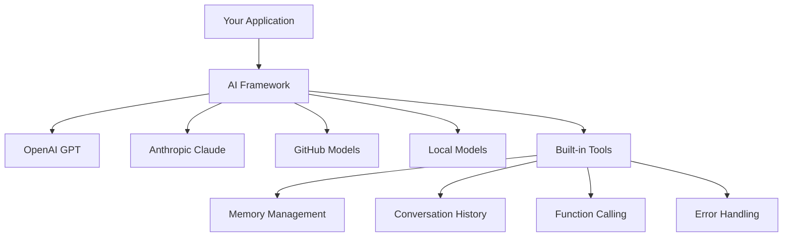
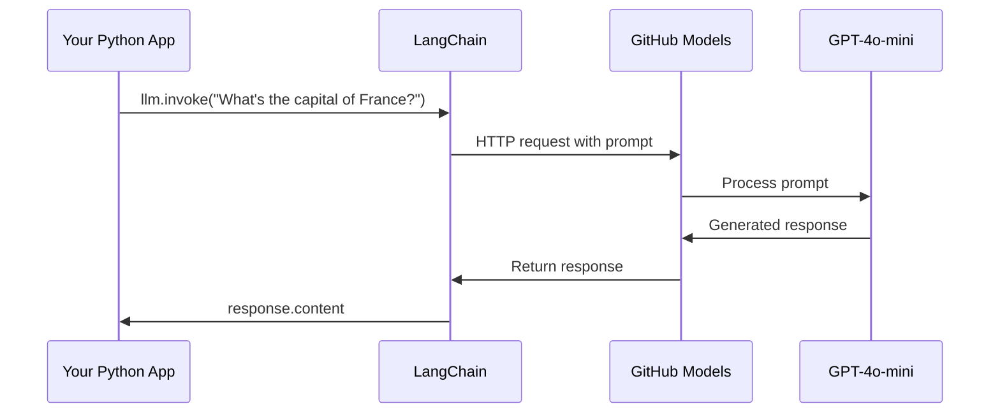
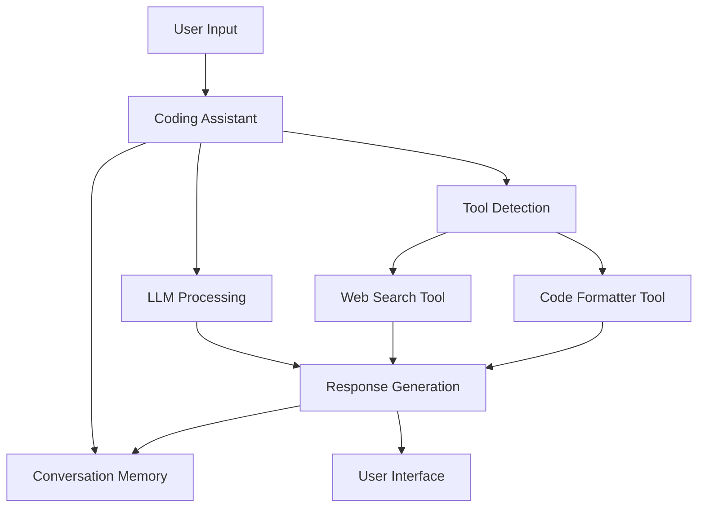
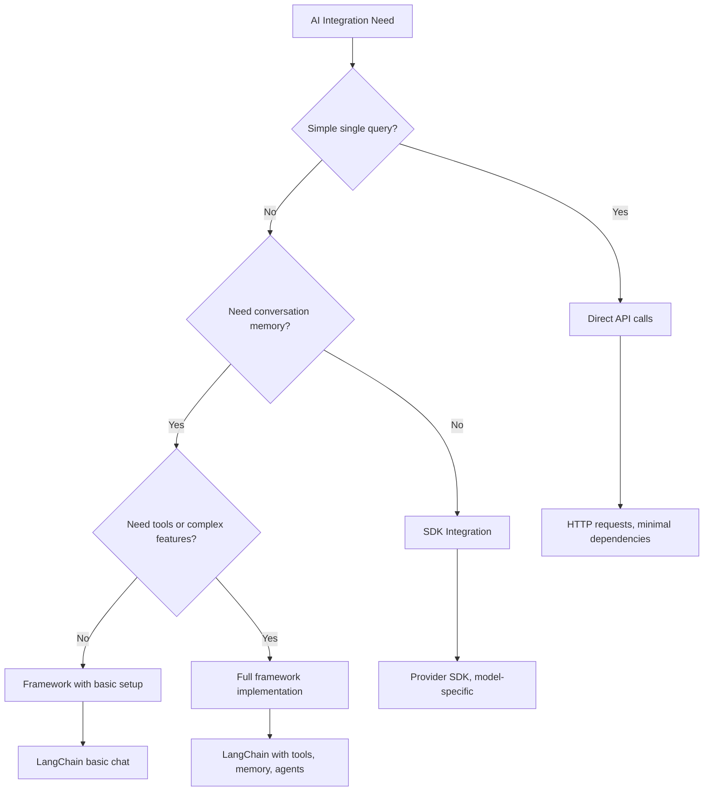

<!--
CO_OP_TRANSLATOR_METADATA:
{
  "original_hash": "e2c4ae5688e34b4b8b09d52aec56c79e",
  "translation_date": "2025-10-24T22:02:45+00:00",
  "source_file": "10-ai-framework-project/README.md",
  "language_code": "ro"
}
-->
# Cadru AI

Te-ai simțit vreodată copleșit încercând să construiești aplicații AI de la zero? Nu ești singur! Cadrele AI sunt ca un briceag elvețian pentru dezvoltarea AI - sunt instrumente puternice care te pot salva de timp și dureri de cap atunci când construiești aplicații inteligente. Gândește-te la un cadru AI ca la o bibliotecă bine organizată: oferă componente predefinite, API-uri standardizate și abstracții inteligente, astfel încât să te poți concentra pe rezolvarea problemelor, în loc să te lupți cu detaliile implementării.

În această lecție, vom explora cum cadrele precum LangChain pot transforma sarcinile complexe de integrare AI în cod curat și ușor de citit. Vei descoperi cum să abordezi provocări reale, cum ar fi urmărirea conversațiilor, implementarea apelurilor de instrumente și gestionarea diferitelor modele AI printr-o interfață unificată.

Până la final, vei ști când să alegi cadrele în locul apelurilor API brute, cum să folosești eficient abstracțiile lor și cum să construiești aplicații AI pregătite pentru utilizarea în lumea reală. Haide să explorăm ce pot face cadrele AI pentru proiectele tale.

## De ce să alegi un cadru?

Ești gata să construiești o aplicație AI - grozav! Dar iată problema: ai mai multe căi pe care le poți urma, iar fiecare are propriile avantaje și dezavantaje. E ca și cum ai alege între a merge pe jos, a merge cu bicicleta sau a conduce pentru a ajunge undeva - toate te vor duce acolo, dar experiența (și efortul) vor fi complet diferite.

Să analizăm cele trei moduri principale prin care poți integra AI în proiectele tale:

| Abordare | Avantaje | Cel mai potrivit pentru | Considerații |
|----------|----------|--------------------------|--------------|
| **Cereri HTTP directe** | Control total, fără dependențe | Interogări simple, învățarea fundamentelor | Cod mai detaliat, gestionarea manuală a erorilor |
| **Integrarea SDK** | Mai puțin cod redundant, optimizare specifică modelului | Aplicații cu un singur model | Limitat la furnizori specifici |
| **Cadre AI** | API unificat, abstracții integrate | Aplicații multi-model, fluxuri de lucru complexe | Curbă de învățare, posibilă supra-abstracție |

### Beneficiile cadrelor în practică



**De ce contează cadrele:**
- **Unifică** mai mulți furnizori AI sub o singură interfață
- **Gestionează** automat memoria conversației
- **Oferă** instrumente gata făcute pentru sarcini comune, cum ar fi încorporările și apelurile funcțiilor
- **Administrează** gestionarea erorilor și logica de reîncercare
- **Transformă** fluxurile de lucru complexe în apeluri de metode ușor de citit

> 💡 **Sfat Pro**: Folosește cadrele atunci când treci între diferite modele AI sau construiești funcții complexe, cum ar fi agenți, memorie sau apeluri de instrumente. Rămâi la API-uri directe când înveți bazele sau construiești aplicații simple și concentrate.

**Concluzie**: La fel ca alegerea între unelte specializate ale unui meșteșugar și un atelier complet, este vorba despre potrivirea instrumentului cu sarcina. Cadrele excelează pentru aplicații complexe și bogate în funcții, în timp ce API-urile directe funcționează bine pentru cazuri de utilizare simple.

## Introducere

În această lecție, vom învăța să:

- Folosim un cadru AI comun.
- Abordăm probleme comune, cum ar fi conversațiile de chat, utilizarea instrumentelor, memoria și contextul.
- Folosim aceste cunoștințe pentru a construi aplicații AI.

## Primul tău prompt AI

Să începem cu elementele fundamentale, creând prima ta aplicație AI care trimite o întrebare și primește un răspuns. La fel cum Arhimede a descoperit principiul deplasării în baie, uneori cele mai simple observații duc la cele mai puternice perspective - iar cadrele fac aceste perspective accesibile.

### Configurarea LangChain cu Modele GitHub

Vom folosi LangChain pentru a ne conecta la Modele GitHub, ceea ce este grozav, deoarece îți oferă acces gratuit la diverse modele AI. Partea cea mai bună? Ai nevoie doar de câțiva parametri de configurare simpli pentru a începe:

```python
from langchain_openai import ChatOpenAI
import os

llm = ChatOpenAI(
    api_key=os.environ["GITHUB_TOKEN"],
    base_url="https://models.github.ai/inference",
    model="openai/gpt-4o-mini",
)

# Send a simple prompt
response = llm.invoke("What's the capital of France?")
print(response.content)
```

**Să descompunem ce se întâmplă aici:**
- **Creează** un client LangChain folosind clasa `ChatOpenAI` - aceasta este poarta ta către AI!
- **Configurează** conexiunea la Modele GitHub cu tokenul tău de autentificare
- **Specifică** ce model AI să folosești (`gpt-4o-mini`) - gândește-te la asta ca la alegerea asistentului tău AI
- **Trimite** întrebarea ta folosind metoda `invoke()` - aici se întâmplă magia
- **Extrage** și afișează răspunsul - și voilà, vorbești cu AI!

> 🔧 **Notă de configurare**: Dacă folosești GitHub Codespaces, ești norocos - `GITHUB_TOKEN` este deja configurat pentru tine! Lucrezi local? Nicio problemă, va trebui doar să creezi un token de acces personal cu permisiunile corespunzătoare.

**Rezultatul așteptat:**
```text
The capital of France is Paris.
```



## Construirea unui AI conversațional

Primul exemplu demonstrează elementele de bază, dar este doar un schimb unic - pui o întrebare, primești un răspuns și atât. În aplicațiile reale, vrei ca AI-ul tău să-și amintească ce ați discutat, la fel cum Watson și Holmes își construiau conversațiile investigative de-a lungul timpului.

Aici LangChain devine deosebit de util. Oferă diferite tipuri de mesaje care ajută la structurarea conversațiilor și îți permit să dai personalitate AI-ului tău. Vei construi experiențe de chat care mențin contextul și caracterul.

### Înțelegerea tipurilor de mesaje

Gândește-te la aceste tipuri de mesaje ca la diferite "pălării" pe care participanții le poartă într-o conversație. LangChain folosește diferite clase de mesaje pentru a ține evidența cine spune ce:

| Tip de mesaj | Scop | Exemplu de utilizare |
|--------------|------|----------------------|
| `SystemMessage` | Definește personalitatea și comportamentul AI | "Ești un asistent de codare util" |
| `HumanMessage` | Reprezintă inputul utilizatorului | "Explică cum funcționează funcțiile" |
| `AIMessage` | Stochează răspunsurile AI | Răspunsurile anterioare ale AI în conversație |

### Crearea primei tale conversații

Să creăm o conversație în care AI-ul nostru își asumă un rol specific. Îl vom face să întruchipeze pe Căpitanul Picard - un personaj cunoscut pentru înțelepciunea sa diplomatică și leadership:

```python
messages = [
    SystemMessage(content="You are Captain Picard of the Starship Enterprise"),
    HumanMessage(content="Tell me about you"),
]
```

**Descompunerea configurării acestei conversații:**
- **Stabilește** rolul și personalitatea AI-ului prin `SystemMessage`
- **Oferă** interogarea inițială a utilizatorului prin `HumanMessage`
- **Creează** o fundație pentru conversații pe mai multe runde

Codul complet pentru acest exemplu arată astfel:

```python
from langchain_core.messages import HumanMessage, SystemMessage
from langchain_openai import ChatOpenAI
import os

llm = ChatOpenAI(
    api_key=os.environ["GITHUB_TOKEN"],
    base_url="https://models.github.ai/inference",
    model="openai/gpt-4o-mini",
)

messages = [
    SystemMessage(content="You are Captain Picard of the Starship Enterprise"),
    HumanMessage(content="Tell me about you"),
]


# works
response  = llm.invoke(messages)
print(response.content)
```

Ar trebui să vezi un rezultat similar cu:

```text
I am Captain Jean-Luc Picard, the commanding officer of the USS Enterprise (NCC-1701-D), a starship in the United Federation of Planets. My primary mission is to explore new worlds, seek out new life and new civilizations, and boldly go where no one has gone before. 

I believe in the importance of diplomacy, reason, and the pursuit of knowledge. My crew is diverse and skilled, and we often face challenges that test our resolve, ethics, and ingenuity. Throughout my career, I have encountered numerous species, grappled with complex moral dilemmas, and have consistently sought peaceful solutions to conflicts.

I hold the ideals of the Federation close to my heart, believing in the importance of cooperation, understanding, and respect for all sentient beings. My experiences have shaped my leadership style, and I strive to be a thoughtful and just captain. How may I assist you further?
```

Pentru a menține continuitatea conversației (în loc să resetezi contextul de fiecare dată), trebuie să continui să adaugi răspunsuri la lista ta de mesaje. La fel ca tradițiile orale care au păstrat poveștile de-a lungul generațiilor, această abordare construiește o memorie durabilă:

```python
from langchain_core.messages import HumanMessage, SystemMessage
from langchain_openai import ChatOpenAI
import os

llm = ChatOpenAI(
    api_key=os.environ["GITHUB_TOKEN"],
    base_url="https://models.github.ai/inference",
    model="openai/gpt-4o-mini",
)

messages = [
    SystemMessage(content="You are Captain Picard of the Starship Enterprise"),
    HumanMessage(content="Tell me about you"),
]


# works
response  = llm.invoke(messages)

print(response.content)

print("---- Next ----")

messages.append(response)
messages.append(HumanMessage(content="Now that I know about you, I'm Chris, can I be in your crew?"))

response  = llm.invoke(messages)

print(response.content)

```

Destul de interesant, nu-i așa? Ce se întâmplă aici este că apelăm LLM de două ori - mai întâi doar cu primele două mesaje, dar apoi din nou cu întreaga istorie a conversației. Este ca și cum AI-ul ar urmări cu adevărat conversația noastră!

Când rulezi acest cod, vei obține un al doilea răspuns care sună ceva de genul:

```text
Welcome aboard, Chris! It's always a pleasure to meet those who share a passion for exploration and discovery. While I cannot formally offer you a position on the Enterprise right now, I encourage you to pursue your aspirations. We are always in need of talented individuals with diverse skills and backgrounds. 

If you are interested in space exploration, consider education and training in the sciences, engineering, or diplomacy. The values of curiosity, resilience, and teamwork are crucial in Starfleet. Should you ever find yourself on a starship, remember to uphold the principles of the Federation: peace, understanding, and respect for all beings. Your journey can lead you to remarkable adventures, whether in the stars or on the ground. Engage!
```

O să iau asta ca pe un poate ;)

## Răspunsuri în flux

Ai observat vreodată cum ChatGPT pare să "scrie" răspunsurile sale în timp real? Asta este fluxul în acțiune. La fel ca atunci când privești un caligraf priceput lucrând - văzând cum apar caracterele trăsătură cu trăsătură, mai degrabă decât materializându-se instantaneu - fluxul face interacțiunea să pară mai naturală și oferă feedback imediat.

### Implementarea fluxului cu LangChain

```python
from langchain_openai import ChatOpenAI
import os

llm = ChatOpenAI(
    api_key=os.environ["GITHUB_TOKEN"],
    base_url="https://models.github.ai/inference",
    model="openai/gpt-4o-mini",
    streaming=True
)

# Stream the response
for chunk in llm.stream("Write a short story about a robot learning to code"):
    print(chunk.content, end="", flush=True)
```

**De ce fluxul este grozav:**
- **Arată** conținutul pe măsură ce este creat - nu mai trebuie să aștepți stânjenitor!
- **Face** utilizatorii să simtă că se întâmplă ceva
- **Pare** mai rapid, chiar dacă tehnic nu este
- **Permite** utilizatorilor să înceapă să citească în timp ce AI-ul încă "gândește"

> 💡 **Sfat pentru experiența utilizatorului**: Fluxul strălucește cu adevărat atunci când ai de-a face cu răspunsuri mai lungi, cum ar fi explicații de cod, scriere creativă sau tutoriale detaliate. Utilizatorii tăi vor iubi să vadă progresul în loc să privească un ecran gol!

## Șabloane de prompturi

Șabloanele de prompturi funcționează ca structurile retorice utilizate în oratoria clasică - gândește-te cum Cicero își adapta modelele de discurs pentru diferite audiențe, menținând în același timp același cadru persuasiv. Ele îți permit să creezi prompturi reutilizabile în care poți înlocui diferite piese de informație fără să rescrii totul de la zero. Odată ce ai configurat șablonul, doar completezi variabilele cu valorile necesare.

### Crearea de prompturi reutilizabile

```python
from langchain_core.prompts import ChatPromptTemplate

# Define a template for code explanations
template = ChatPromptTemplate.from_messages([
    ("system", "You are an expert programming instructor. Explain concepts clearly with examples."),
    ("human", "Explain {concept} in {language} with a practical example for {skill_level} developers")
])

# Use the template with different values
questions = [
    {"concept": "functions", "language": "JavaScript", "skill_level": "beginner"},
    {"concept": "classes", "language": "Python", "skill_level": "intermediate"},
    {"concept": "async/await", "language": "JavaScript", "skill_level": "advanced"}
]

for question in questions:
    prompt = template.format_messages(**question)
    response = llm.invoke(prompt)
    print(f"Topic: {question['concept']}\n{response.content}\n---\n")
```

**De ce vei iubi utilizarea șabloanelor:**
- **Menține** prompturile consistente în întreaga aplicație
- **Fără mai mult** concatenare dezordonată de șiruri - doar variabile curate și simple
- **AI-ul tău** se comportă previzibil deoarece structura rămâne aceeași
- **Actualizările** sunt simple - modifici șablonul o dată și este rezolvat peste tot

## Output structurat

Te-ai frustrat vreodată încercând să analizezi răspunsuri AI care vin sub formă de text nestructurat? Outputul structurat este ca și cum ai învăța AI-ul să urmeze abordarea sistematică pe care Linnaeus a folosit-o pentru clasificarea biologică - organizat, previzibil și ușor de lucrat. Poți solicita JSON, structuri de date specifice sau orice format de care ai nevoie.

### Definirea schemelor de output

```python
from langchain_core.prompts import ChatPromptTemplate
from langchain_core.output_parsers import JsonOutputParser
from pydantic import BaseModel, Field

class CodeReview(BaseModel):
    score: int = Field(description="Code quality score from 1-10")
    strengths: list[str] = Field(description="List of code strengths")
    improvements: list[str] = Field(description="List of suggested improvements")
    overall_feedback: str = Field(description="Summary feedback")

# Set up the parser
parser = JsonOutputParser(pydantic_object=CodeReview)

# Create prompt with format instructions
prompt = ChatPromptTemplate.from_messages([
    ("system", "You are a code reviewer. {format_instructions}"),
    ("human", "Review this code: {code}")
])

# Format the prompt with instructions
chain = prompt | llm | parser

# Get structured response
code_sample = """
def calculate_average(numbers):
    return sum(numbers) / len(numbers)
"""

result = chain.invoke({
    "code": code_sample,
    "format_instructions": parser.get_format_instructions()
})

print(f"Score: {result['score']}")
print(f"Strengths: {', '.join(result['strengths'])}")
```

**De ce outputul structurat este revoluționar:**
- **Nu mai trebuie** să ghicești ce format vei primi - este consistent de fiecare dată
- **Se integrează** direct în bazele tale de date și API-uri fără muncă suplimentară
- **Detectează** răspunsuri ciudate ale AI înainte să îți strice aplicația
- **Face** codul tău mai curat, deoarece știi exact cu ce lucrezi

## Apelarea instrumentelor

Acum ajungem la una dintre cele mai puternice funcții: instrumentele. Așa îi oferi AI-ului tău capacități practice dincolo de conversație. La fel cum breslele medievale au dezvoltat instrumente specializate pentru meserii specifice, poți echipa AI-ul tău cu instrumente focalizate. Descrii ce instrumente sunt disponibile, iar când cineva solicită ceva care se potrivește, AI-ul tău poate acționa.

### Utilizarea Python

Să adăugăm câteva instrumente astfel:

```python
from typing_extensions import Annotated, TypedDict

class add(TypedDict):
    """Add two integers."""

    # Annotations must have the type and can optionally include a default value and description (in that order).
    a: Annotated[int, ..., "First integer"]
    b: Annotated[int, ..., "Second integer"]

tools = [add]

functions = {
    "add": lambda a, b: a + b
}
```

Ce se întâmplă aici? Creăm un plan pentru un instrument numit `add`. Prin moștenirea de la `TypedDict` și utilizarea acelor tipuri elegante `Annotated` pentru `a` și `b`, oferim LLM-ului o imagine clară despre ce face acest instrument și de ce are nevoie. Dicționarul `functions` este ca o cutie de unelte - spune codului nostru exact ce să facă atunci când AI-ul decide să folosească un instrument specific.

Să vedem cum apelăm LLM-ul cu acest instrument:

```python
llm = ChatOpenAI(
    api_key=os.environ["GITHUB_TOKEN"],
    base_url="https://models.github.ai/inference",
    model="openai/gpt-4o-mini",
)

llm_with_tools = llm.bind_tools(tools)
```

Aici apelăm `bind_tools` cu array-ul nostru `tools`, iar astfel LLM-ul `llm_with_tools` are acum cunoștință despre acest instrument.

Pentru a folosi acest nou LLM, putem scrie următorul cod:

```python
query = "What is 3 + 12?"

res = llm_with_tools.invoke(query)
if(res.tool_calls):
    for tool in res.tool_calls:
        print("TOOL CALL: ", functions[tool["name"]](../../../10-ai-framework-project/**tool["args"]))
print("CONTENT: ",res.content)
```

Acum, când apelăm `invoke` pe acest nou LLM, care are instrumente, proprietatea `tool_calls` poate fi populată. Dacă da, orice instrument identificat are o proprietate `name` și `args` care identifică ce instrument ar trebui să fie apelat și cu ce argumente. Codul complet arată astfel:

```python
from langchain_core.messages import HumanMessage, SystemMessage
from langchain_openai import ChatOpenAI
import os
from typing_extensions import Annotated, TypedDict

class add(TypedDict):
    """Add two integers."""

    # Annotations must have the type and can optionally include a default value and description (in that order).
    a: Annotated[int, ..., "First integer"]
    b: Annotated[int, ..., "Second integer"]

tools = [add]

functions = {
    "add": lambda a, b: a + b
}

llm = ChatOpenAI(
    api_key=os.environ["GITHUB_TOKEN"],
    base_url="https://models.github.ai/inference",
    model="openai/gpt-4o-mini",
)

llm_with_tools = llm.bind_tools(tools)

query = "What is 3 + 12?"

res = llm_with_tools.invoke(query)
if(res.tool_calls):
    for tool in res.tool_calls:
        print("TOOL CALL: ", functions[tool["name"]](../../../10-ai-framework-project/**tool["args"]))
print("CONTENT: ",res.content)
```

Rulând acest cod, ar trebui să vezi un output similar cu:

```text
TOOL CALL:  15
CONTENT: 
```

AI-ul a examinat "Ce este 3 + 12" și a recunoscut aceasta ca o sarcină pentru instrumentul `add`. La fel cum un bibliotecar priceput știe la ce referință să consulte în funcție de tipul întrebării, AI-ul a făcut această determinare pe baza numelui instrumentului, descrierii și specificațiilor câmpului. Rezultatul de 15 provine din dicționarul nostru `functions` care execută instrumentul:

```python
print("TOOL CALL: ", functions[tool["name"]](../../../10-ai-framework-project/**tool["args"]))
```

### Un instrument mai interesant care apelează un API web

Adăugarea numerelor demonstrează conceptul, dar instrumentele reale efectuează de obicei operațiuni mai complexe, cum ar fi apelarea API-urilor web. Să extindem exemplul nostru pentru ca AI-ul să preia conținut de pe internet - similar cu modul în care operatorii de telegraf conectau locații îndepărtate:

```python
class joke(TypedDict):
    """Tell a joke."""

    # Annotations must have the type and can optionally include a default value and description (in that order).
    category: Annotated[str, ..., "The joke category"]

def get_joke(category: str) -> str:
    response = requests.get(f"https://api.chucknorris.io/jokes/random?category={category}", headers={"Accept": "application/json"})
    if response.status_code == 200:
        return response.json().get("value", f"Here's a {category} joke!")
    return f"Here's a {category} joke!"

functions = {
    "add": lambda a, b: a + b,
    "joke": lambda category: get_joke(category)
}

query = "Tell me a joke about animals"

# the rest of the code is the same
```

Acum, dacă rulezi acest cod, vei primi un răspuns care spune ceva de genul:

```text
TOOL CALL:  Chuck Norris once rode a nine foot grizzly bear through an automatic car wash, instead of taking a shower.
CONTENT:  
```

Iată codul în întregime:

```python
from langchain_openai import ChatOpenAI
import requests
import os
from typing_extensions import Annotated, TypedDict

class add(TypedDict):
    """Add two integers."""

    # Annotations must have the type and can optionally include a default value and description (in that order).
    a: Annotated[int, ..., "First integer"]
    b: Annotated[int, ..., "Second integer"]

class joke(TypedDict):
    """Tell a joke."""

    # Annotations must have the type and can optionally include a default value and description (in that order).
    category: Annotated[str, ..., "The joke category"]

tools = [add, joke]

def get_joke(category: str) -> str:
    response = requests.get(f"https://api.chucknorris.io/jokes/random?category={category}", headers={"Accept": "application/json"})
    if response.status_code == 200:
        return response.json().get("value", f"Here's a {category} joke!")
    return f"Here's a {category} joke!"

functions = {
    "add": lambda a, b: a + b,
    "joke": lambda category: get_joke(category)
}

llm = ChatOpenAI(
    api_key=os.environ["GITHUB_TOKEN"],
    base_url="https://models.github.ai/inference",
    model="openai/gpt-4o-mini",
)

llm_with_tools = llm.bind_tools(tools)

query = "Tell me a joke about animals"

res = llm_with_tools.invoke(query)
if(res.tool_calls):
    for tool in res.tool_calls:
        # print("TOOL CALL: ", tool)
        print("TOOL CALL: ", functions[tool["name"]](../../../10-ai-framework-project/**tool["args"]))
print("CONTENT: ",res.content)
```

## Încorporări și procesarea documentelor

Încorporările reprezintă una dintre cele mai elegante soluții în AI-ul modern. Imaginează-ți că poți lua orice bucată de text și să o transformi în coordonate numerice care să-i capteze semnificația. Exact asta fac încorporările - transformă textul în puncte într-un spațiu multidimensional unde conceptele similare se grupează împreună. Este ca și cum ai avea un sistem de coordonate pentru idei, asemănător modului în care Mendeleev a organizat tabelul periodic după proprietățile atomice.

### Crearea și utilizarea încorporărilor

```python
from langchain_openai import OpenAIEmbeddings
from langchain_community.vectorstores import FAISS
from langchain_community.document_loaders import TextLoader
from langchain.text_splitter import CharacterTextSplitter

# Initialize embeddings
embeddings = OpenAIEmbeddings(
    api_key=os.environ["GITHUB_TOKEN"],
    base_url="https://models.github.ai/inference",
    model="text-embedding-3-small"
)

# Load and split documents
loader = TextLoader("documentation.txt")
documents = loader.load()

text_splitter = CharacterTextSplitter(chunk_size=1000, chunk_overlap=0)
texts = text_splitter.split_documents(documents)

# Create vector store
vectorstore = FAISS.from_documents(texts, embeddings)

# Perform similarity search
query = "How do I handle user authentication?"
similar_docs = vectorstore.similarity_search(query, k=3)

for doc in similar_docs:
    print(f"Relevant content: {doc.page_content[:200]}...")
```

### Încărcătoare de documente pentru diverse formate

```python
from langchain_community.document_loaders import (
    PyPDFLoader,
    CSVLoader,
    JSONLoader,
    WebBaseLoader
)

# Load different document types
pdf_loader = PyPDFLoader("manual.pdf")
csv_loader = CSVLoader("data.csv")
json_loader = JSONLoader("config.json")
web_loader = WebBaseLoader("https://example.com/docs")

# Process all documents
all_documents = []
for loader in [pdf_loader, csv_loader, json_loader, web_loader]:
    docs = loader.load()
    all_documents.extend(docs)
```

**Ce poți face cu încorporările:**
- **Construiește** căutări care înțeleg cu adevărat ce vrei să spui, nu doar potrivirea cuvintelor cheie
- **Creează** AI care poate răspunde la întrebări despre documentele tale
- **Construiește** sisteme de recomandare care sugerează conținut cu adevărat relevant
- **Organizează** și categorizează automat conținutul tău

## Construirea unei aplicații AI complete

Acum vom integra tot ce ai învățat într-o aplicație cuprinzătoare - un asistent de codare care poate răspunde la întrebări, folosi instrumente și menține memoria conversației. La fel cum presa tipografică a combinat tehnologii existente (tipar mobil, cerneală, hârtie și presiune) într-un ceva transformator, vom combina componentele AI într-un ceva practic și util.

### Exemplu de aplicație completă

```python
from langchain_openai import ChatOpenAI, OpenAIEmbeddings
from langchain_core.prompts import ChatPromptTemplate
from langchain_core.messages import HumanMessage, SystemMessage, AIMessage
from langchain_community.vectorstores import FAISS
from typing_extensions import Annotated, TypedDict
import os
import requests

class CodingAssistant:
    def __init__(self):
        self.llm = ChatOpenAI(
            api_key=os.environ["GITHUB_TOKEN"],
            base_url="https://models.github.ai/inference",
            model="openai/gpt-4o-mini"
        )
        
        self.conversation_history = [
            SystemMessage(content="""You are an expert coding assistant. 
            Help users learn programming concepts, debug code, and write better software.
            Use tools when needed and maintain a helpful, encouraging tone.""")
        ]
        
        # Define tools
        self.setup_tools()
    
    def setup_tools(self):
        class web_search(TypedDict):
            """Search for programming documentation or examples."""
            query: Annotated[str, "Search query for programming help"]
        
        class code_formatter(TypedDict):
            """Format and validate code snippets."""
            code: Annotated[str, "Code to format"]
            language: Annotated[str, "Programming language"]
        
        self.tools = [web_search, code_formatter]
        self.llm_with_tools = self.llm.bind_tools(self.tools)
    
    def chat(self, user_input: str):
        # Add user message to conversation
        self.conversation_history.append(HumanMessage(content=user_input))
        
        # Get AI response
        response = self.llm_with_tools.invoke(self.conversation_history)
        
        # Handle tool calls if any
        if response.tool_calls:
            for tool_call in response.tool_calls:
                tool_result = self.execute_tool(tool_call)
                print(f"🔧 Tool used: {tool_call['name']}")
                print(f"📊 Result: {tool_result}")
        
        # Add AI response to conversation
        self.conversation_history.append(response)
        
        return response.content
    
    def execute_tool(self, tool_call):
        tool_name = tool_call['name']
        args = tool_call['args']
        
        if tool_name == 'web_search':
            return f"Found documentation for: {args['query']}"
        elif tool_name == 'code_formatter':
            return f"Formatted {args['language']} code: {args['code'][:50]}..."
        
        return "Tool execution completed"

# Usage example
assistant = CodingAssistant()

print("🤖 Coding Assistant Ready! Type 'quit' to exit.\n")

while True:
    user_input = input("You: ")
    if user_input.lower() == 'quit':
        break
    
    response = assistant.chat(user_input)
    print(f"🤖 Assistant: {response}\n")
```

**Arhitectura aplicației:**



**Funcții cheie pe care le-am implementat:**
- **Își amintește** întreaga conversație pentru continuitatea contextului
- **Execută acțiuni** prin apelarea instrumentelor, nu doar conversație
- **Urmează** modele de interacțiune previzibile
- **Gestionează** automat erorile și fluxurile de lucru complexe

## Temă: Construiește propriul tău asistent de studiu bazat pe AI

**Obiectiv**: Creează o aplicație AI care să aj
3. **Învățare personalizată**: Folosește mesaje de sistem pentru a adapta răspunsurile la diferite niveluri de competență  
4. **Formatarea răspunsurilor**: Implementează ieșiri structurate pentru întrebările de tip quiz  

### Pași de implementare  

**Pasul 1: Configurarea mediului de lucru**  
```bash
pip install langchain langchain-openai
```
  
**Pasul 2: Funcționalitate de bază pentru chat**  
- Creează o clasă `StudyAssistant`  
- Implementează memoria conversației  
- Adaugă configurarea personalității pentru suport educațional  

**Pasul 3: Adaugă instrumente educaționale**  
- **Explicator de cod**: Descompune codul în părți ușor de înțeles  
- **Generator de quiz-uri**: Creează întrebări despre concepte de programare  
- **Tracker de progres**: Urmărește subiectele acoperite  

**Pasul 4: Funcționalități avansate (Opțional)**  
- Implementează răspunsuri în flux pentru o experiență mai bună a utilizatorului  
- Adaugă încărcarea documentelor pentru a încorpora materiale de curs  
- Creează embeddings pentru recuperarea conținutului bazată pe similaritate  

### Criterii de evaluare  

| Funcționalitate | Excelent (4) | Bun (3) | Satisfăcător (2) | Necesită îmbunătățiri (1) |  
|------------------|--------------|---------|-------------------|---------------------------|  
| **Fluxul conversației** | Răspunsuri naturale, conștiente de context | Retenție bună a contextului | Conversație de bază | Fără memorie între schimburi |  
| **Integrarea instrumentelor** | Mai multe instrumente utile care funcționează perfect | 2+ instrumente implementate corect | 1-2 instrumente de bază | Instrumentele nu sunt funcționale |  
| **Calitatea codului** | Curat, bine documentat, gestionare a erorilor | Structură bună, ceva documentație | Funcționalitate de bază | Structură slabă, fără gestionare a erorilor |  
| **Valoarea educațională** | Foarte util pentru învățare, adaptiv | Suport bun pentru învățare | Explicații de bază | Beneficiu educațional limitat |  

### Structura exemplului de cod  

```python
class StudyAssistant:
    def __init__(self, skill_level="beginner"):
        # Initialize LLM, tools, and conversation memory
        pass
    
    def explain_code(self, code, language):
        # Tool: Explain how code works
        pass
    
    def generate_quiz(self, topic, difficulty):
        # Tool: Create practice questions
        pass
    
    def chat(self, user_input):
        # Main conversation interface
        pass

# Example usage
assistant = StudyAssistant(skill_level="intermediate")
response = assistant.chat("Explain how Python functions work")
```
  
**Provocări bonus:**  
- Adaugă capabilități de intrare/ieșire vocală  
- Implementează o interfață web folosind Streamlit sau Flask  
- Creează o bază de cunoștințe din materialele de curs folosind embeddings  
- Adaugă urmărirea progresului și trasee de învățare personalizate  

## Rezumat  

🎉 Acum ai stăpânit fundamentele dezvoltării unui cadru AI și ai învățat cum să construiești aplicații AI sofisticate folosind LangChain. La fel ca finalizarea unei ucenicii complete, ai dobândit un set substanțial de abilități. Să revizuim ce ai realizat.  

### Ce ai învățat  

**Concepte de bază ale cadrului:**  
- **Beneficiile cadrului**: Înțelegerea momentului potrivit pentru a alege cadrele în locul apelurilor directe API  
- **Bazele LangChain**: Configurarea și configurarea conexiunilor modelului AI  
- **Tipuri de mesaje**: Utilizarea `SystemMessage`, `HumanMessage` și `AIMessage` pentru conversații structurate  

**Funcționalități avansate:**  
- **Apelarea instrumentelor**: Crearea și integrarea instrumentelor personalizate pentru capabilități AI îmbunătățite  
- **Memoria conversației**: Menținerea contextului pe parcursul mai multor schimburi de conversație  
- **Răspunsuri în flux**: Implementarea livrării răspunsurilor în timp real  
- **Șabloane de prompt**: Construirea de prompturi reutilizabile și dinamice  
- **Ieșire structurată**: Asigurarea răspunsurilor AI consistente și ușor de analizat  
- **Embeddings**: Crearea de căutări semantice și capabilități de procesare a documentelor  

**Aplicații practice:**  
- **Construirea aplicațiilor complete**: Combinarea mai multor funcționalități în aplicații gata de producție  
- **Gestionarea erorilor**: Implementarea unei gestionări robuste a erorilor și validării  
- **Integrarea instrumentelor**: Crearea de instrumente personalizate care extind capabilitățile AI  

### Concluzii cheie  

> 🎯 **Amintește-ți**: Cadrele AI precum LangChain sunt practic prietenii tăi care ascund complexitatea și sunt pline de funcționalități. Sunt perfecte atunci când ai nevoie de memorie conversațională, apelarea instrumentelor sau vrei să lucrezi cu mai multe modele AI fără să-ți pierzi mințile.  

**Cadru decizional pentru integrarea AI:**  


  
### Ce urmează?  

**Începe să construiești chiar acum:**  
- Ia aceste concepte și construiește ceva care te entuziasmează!  
- Joacă-te cu diferite modele AI prin LangChain - e ca un teren de joacă al modelelor AI  
- Creează instrumente care rezolvă probleme reale cu care te confrunți în muncă sau proiecte  

**Pregătit pentru nivelul următor?**  
- **Agenți AI**: Construiește sisteme AI care pot planifica și executa sarcini complexe pe cont propriu  
- **RAG (Generare augmentată prin recuperare)**: Combină AI cu propriile baze de cunoștințe pentru aplicații super-puternice  
- **AI multi-modal**: Lucrează cu text, imagini și audio împreună - posibilitățile sunt nelimitate!  
- **Implementare în producție**: Învață cum să scalezi aplicațiile AI și să le monitorizezi în lumea reală  

**Alătură-te comunității:**  
- Comunitatea LangChain este fantastică pentru a rămâne la curent și a învăța cele mai bune practici  
- Modelele GitHub îți oferă acces la capabilități AI de ultimă generație - perfect pentru experimentare  
- Continuă să exersezi cu diferite cazuri de utilizare - fiecare proiect te va învăța ceva nou  

Acum ai cunoștințele necesare pentru a construi aplicații conversaționale inteligente care pot ajuta oamenii să rezolve probleme reale. La fel ca meșteșugarii Renașterii care combinau viziunea artistică cu abilitățile tehnice, acum poți îmbina capabilitățile AI cu aplicațiile practice. Întrebarea este: ce vei crea? 🚀  

## Provocarea Agentului GitHub Copilot 🚀  

Folosește modul Agent pentru a finaliza următoarea provocare:  

**Descriere:** Construiește un asistent avansat de revizuire a codului, alimentat de AI, care combină multiple funcționalități LangChain, inclusiv apelarea instrumentelor, ieșirea structurată și memoria conversației, pentru a oferi feedback cuprinzător asupra codului trimis.  

**Prompt:** Creează o clasă CodeReviewAssistant care implementează:  
1. Un instrument pentru analizarea complexității codului și sugerarea îmbunătățirilor  
2. Un instrument pentru verificarea codului conform celor mai bune practici  
3. Ieșire structurată folosind modele Pydantic pentru un format consistent de revizuire  
4. Memoria conversației pentru a urmări sesiunile de revizuire  
5. O interfață principală de chat care poate gestiona trimiterea codului și oferi feedback detaliat și acționabil  

Asistentul ar trebui să poată revizui codul în mai multe limbaje de programare, să mențină contextul pe parcursul mai multor trimiteri de cod într-o sesiune și să ofere atât scoruri sumare, cât și sugestii detaliate de îmbunătățire.  

Află mai multe despre [modul agent](https://code.visualstudio.com/blogs/2025/02/24/introducing-copilot-agent-mode) aici.  

---

**Declinare de responsabilitate**:  
Acest document a fost tradus folosind serviciul de traducere AI [Co-op Translator](https://github.com/Azure/co-op-translator). Deși ne străduim să asigurăm acuratețea, vă rugăm să fiți conștienți că traducerile automate pot conține erori sau inexactități. Documentul original în limba sa natală ar trebui considerat sursa autoritară. Pentru informații critice, se recomandă traducerea profesională realizată de oameni. Nu ne asumăm responsabilitatea pentru neînțelegerile sau interpretările greșite care pot apărea din utilizarea acestei traduceri.