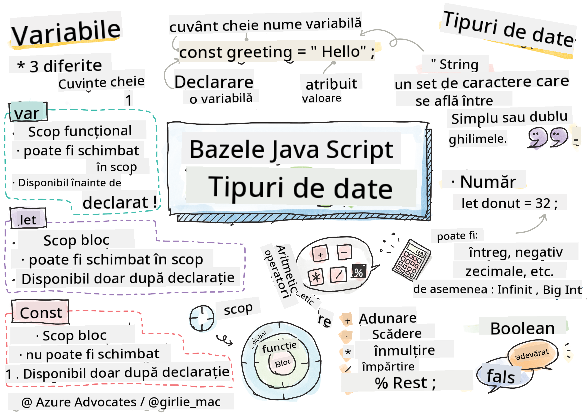

<!--
CO_OP_TRANSLATOR_METADATA:
{
  "original_hash": "fc6aef8ecfdd5b0ad2afa6e6ba52bfde",
  "translation_date": "2025-08-28T08:06:13+00:00",
  "source_file": "2-js-basics/1-data-types/README.md",
  "language_code": "ro"
}
-->
# Bazele JavaScript: Tipuri de Date


> Sketchnote de [Tomomi Imura](https://twitter.com/girlie_mac)

## Chestionar Pre-Lecție
[Chestionar pre-lecție](https://ff-quizzes.netlify.app/web/quiz/7)

Această lecție acoperă bazele JavaScript, limbajul care oferă interactivitate pe web.

> Poți parcurge această lecție pe [Microsoft Learn](https://docs.microsoft.com/learn/modules/web-development-101-variables/?WT.mc_id=academic-77807-sagibbon)!

[](https://youtube.com/watch?v=JNIXfGiDWM8 "Variabile în JavaScript")

[](https://youtube.com/watch?v=AWfA95eLdq8 "Tipuri de Date în JavaScript")

> 🎥 Fă clic pe imaginile de mai sus pentru videoclipuri despre variabile și tipuri de date

Să începem cu variabilele și tipurile de date care le populează!
## Variabile

Variabilele stochează valori care pot fi utilizate și modificate pe parcursul codului tău.

Crearea și **declararea** unei variabile are următoarea sintaxă **[cuvânt cheie] [nume]**. Este alcătuită din două părți:

- **Cuvânt cheie**. Cuvintele cheie pot fi `let` sau `var`.  

✅ Cuvântul cheie `let` a fost introdus în ES6 și oferă variabilei tale un așa-numit _block scope_. Este recomandat să folosești `let` în loc de `var`. Vom acoperi mai în detaliu block scopes în părțile viitoare.
- **Numele variabilei**, acesta este un nume ales de tine.

### Sarcină - lucrul cu variabile

1. **Declară o variabilă**. Să declarăm o variabilă folosind cuvântul cheie `let`:

    ```javascript
    let myVariable;
    ```

   `myVariable` a fost acum declarată folosind cuvântul cheie `let`. În prezent nu are o valoare.

1. **Atribuie o valoare**. Stochează o valoare într-o variabilă folosind operatorul `=`, urmat de valoarea dorită.

    ```javascript
    myVariable = 123;
    ```

   > Notă: utilizarea lui `=` în această lecție înseamnă că folosim un "operator de atribuire", utilizat pentru a seta o valoare unei variabile. Nu denotă egalitate.

   `myVariable` a fost acum *inițializată* cu valoarea 123.

1. **Refactorizează**. Înlocuiește codul tău cu următoarea instrucțiune.

    ```javascript
    let myVariable = 123;
    ```

    De mai sus este numită o _inițializare explicită_ atunci când o variabilă este declarată și i se atribuie o valoare în același timp.

1. **Schimbă valoarea variabilei**. Schimbă valoarea variabilei în următorul mod:

   ```javascript
   myVariable = 321;
   ```

   Odată ce o variabilă este declarată, îi poți schimba valoarea în orice moment în codul tău folosind operatorul `=` și noua valoare.

   ✅ Încearcă! Poți scrie JavaScript direct în browserul tău. Deschide o fereastră de browser și navighează la Instrumentele pentru Dezvoltatori. În consolă, vei găsi un prompt; tastează `let myVariable = 123`, apasă Enter, apoi tastează `myVariable`. Ce se întâmplă? Notă, vei învăța mai multe despre aceste concepte în lecțiile următoare.

## Constante

Declararea și inițializarea unei constante urmează aceleași concepte ca o variabilă, cu excepția cuvântului cheie `const`. Constantele sunt de obicei declarate cu litere mari.

```javascript
const MY_VARIABLE = 123;
```

Constantele sunt similare cu variabilele, cu două excepții:

- **Trebuie să aibă o valoare**. Constantele trebuie să fie inițializate, altfel va apărea o eroare la rularea codului.
- **Referința nu poate fi schimbată**. Referința unei constante nu poate fi schimbată odată ce a fost inițializată, altfel va apărea o eroare la rularea codului. Să analizăm două exemple:
   - **Valoare simplă**. Următorul NU este permis:
   
      ```javascript
      const PI = 3;
      PI = 4; // not allowed
      ```
 
   - **Referința obiectului este protejată**. Următorul NU este permis.
   
      ```javascript
      const obj = { a: 3 };
      obj = { b: 5 } // not allowed
      ```

    - **Valoarea obiectului nu este protejată**. Următorul ESTE permis:
    
      ```javascript
      const obj = { a: 3 };
      obj.a = 5;  // allowed
      ```

      De mai sus, schimbi valoarea obiectului, dar nu referința în sine, ceea ce face ca acest lucru să fie permis.

   > Notă, un `const` înseamnă că referința este protejată de reasignare. Totuși, valoarea nu este _imutabilă_ și poate fi schimbată, mai ales dacă este o construcție complexă precum un obiect.

## Tipuri de Date

Variabilele pot stoca multe tipuri diferite de valori, cum ar fi numere și text. Aceste tipuri variate de valori sunt cunoscute sub numele de **tipuri de date**. Tipurile de date sunt o parte importantă a dezvoltării software-ului, deoarece ajută dezvoltatorii să ia decizii despre cum ar trebui să fie scris codul și cum ar trebui să ruleze software-ul. Mai mult, unele tipuri de date au caracteristici unice care ajută la transformarea sau extragerea de informații suplimentare dintr-o valoare.

✅ Tipurile de date sunt, de asemenea, denumite primitive de date JavaScript, deoarece sunt cele mai de bază tipuri de date oferite de limbaj. Există 7 tipuri de date primitive: string, number, bigint, boolean, undefined, null și symbol. Gândește-te un minut la ce ar putea reprezenta fiecare dintre aceste primitive. Ce este un `zebra`? Dar `0`? `true`?

### Numere

În secțiunea anterioară, valoarea lui `myVariable` era un tip de date număr.

`let myVariable = 123;`

Variabilele pot stoca toate tipurile de numere, inclusiv zecimale sau numere negative. Numerele pot fi, de asemenea, utilizate cu operatori aritmetici, acoperiți în [secțiunea următoare](../../../../2-js-basics/1-data-types).

### Operatorii Aritmetici

Există mai multe tipuri de operatori pentru a efectua funcții aritmetice, iar câțiva sunt enumerați aici:

| Simbol | Descriere                                                              | Exemplu                          |
| ------ | ---------------------------------------------------------------------- | -------------------------------- |
| `+`    | **Adunare**: Calculează suma a două numere                             | `1 + 2 //răspunsul așteptat este 3`   |
| `-`    | **Scădere**: Calculează diferența dintre două numere                   | `1 - 2 //răspunsul așteptat este -1`  |
| `*`    | **Înmulțire**: Calculează produsul a două numere                       | `1 * 2 //răspunsul așteptat este 2`   |
| `/`    | **Împărțire**: Calculează câtul a două numere                          | `1 / 2 //răspunsul așteptat este 0.5` |
| `%`    | **Rest**: Calculează restul împărțirii a două numere                   | `1 % 2 //răspunsul așteptat este 1`   |

✅ Încearcă! Încearcă o operație aritmetică în consola browserului tău. Te surprind rezultatele?

### Șiruri de caractere

Șirurile de caractere sunt seturi de caractere care se află între ghilimele simple sau duble.

- `'Acesta este un șir de caractere'`
- `"Acesta este și un șir de caractere"`
- `let myString = 'Aceasta este o valoare de șir stocată într-o variabilă';`

Amintește-ți să folosești ghilimele atunci când scrii un șir, altfel JavaScript va presupune că este un nume de variabilă.

### Formatarea Șirurilor

Șirurile sunt textuale și vor necesita formatare din când în când.

Pentru a **concatena** două sau mai multe șiruri, sau pentru a le uni, folosește operatorul `+`.

```javascript
let myString1 = "Hello";
let myString2 = "World";

myString1 + myString2 + "!"; //HelloWorld!
myString1 + " " + myString2 + "!"; //Hello World!
myString1 + ", " + myString2 + "!"; //Hello, World!

```

✅ De ce `1 + 1 = 2` în JavaScript, dar `'1' + '1' = 11?` Gândește-te la asta. Dar `'1' + 1`?

**Șabloanele literale** sunt o altă modalitate de a formata șirurile, cu excepția faptului că în loc de ghilimele, se folosește backtick-ul. Orice nu este text simplu trebuie plasat în placeholder-ul `${ }`. Acest lucru include orice variabile care pot fi șiruri.

```javascript
let myString1 = "Hello";
let myString2 = "World";

`${myString1} ${myString2}!` //Hello World!
`${myString1}, ${myString2}!` //Hello, World!
```

Poți atinge obiectivele tale de formatare cu oricare metodă, dar șabloanele literale vor respecta orice spații și linii noi.

✅ Când ai folosi un șablon literal în loc de un șir simplu?

### Booleeni

Booleenii pot avea doar două valori: `true` sau `false`. Booleenii pot ajuta la luarea deciziilor despre ce linii de cod ar trebui să ruleze atunci când anumite condiții sunt îndeplinite. În multe cazuri, [operatorii](../../../../2-js-basics/1-data-types) ajută la setarea valorii unui booleean și vei observa adesea variabile fiind inițializate sau valorile lor fiind actualizate cu un operator.

- `let myTrueBool = true`
- `let myFalseBool = false`

✅ O variabilă poate fi considerată 'truthy' dacă evaluează la un booleean `true`. Interesant, în JavaScript, [toate valorile sunt truthy, cu excepția celor definite ca falsy](https://developer.mozilla.org/docs/Glossary/Truthy).

---

## 🚀 Provocare

JavaScript este cunoscut pentru modurile sale surprinzătoare de a gestiona tipurile de date uneori. Fă puțină cercetare despre aceste 'capcane'. De exemplu: sensibilitatea la majuscule poate fi problematică! Încearcă asta în consola ta: `let age = 1; let Age = 2; age == Age` (rezultă `false` -- de ce?). Ce alte capcane poți găsi?

## Chestionar Post-Lecție
[Chestionar post-lecție](https://ff-quizzes.netlify.app/web/quiz/8)

## Recapitulare & Studiu Individual

Aruncă o privire la [această listă de exerciții JavaScript](https://css-tricks.com/snippets/javascript/) și încearcă unul. Ce ai învățat?

## Temă

[Exerciții de Practică cu Tipuri de Date](assignment.md)

---

**Declinarea responsabilității**:  
Acest document a fost tradus folosind serviciul de traducere AI [Co-op Translator](https://github.com/Azure/co-op-translator). Deși depunem eforturi pentru a asigura acuratețea, vă rugăm să rețineți că traducerile automate pot conține erori sau inexactități. Documentul original în limba sa nativă ar trebui considerat sursa autoritară. Pentru informații critice, se recomandă traducerea profesională realizată de un specialist uman. Nu ne asumăm răspunderea pentru eventualele neînțelegeri sau interpretări greșite care pot apărea din utilizarea acestei traduceri.