<!--
CO_OP_TRANSLATOR_METADATA:
{
  "original_hash": "672b0bb6e8b431075f3bdb7130590d2d",
  "translation_date": "2026-01-07T05:33:06+00:00",
  "source_file": "2-js-basics/1-data-types/README.md",
  "language_code": "ro"
}
-->
# Bazele JavaScript: Tipuri de date

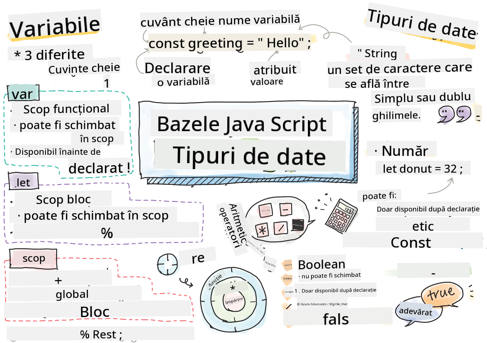
> Sketchnote realizat de [Tomomi Imura](https://twitter.com/girlie_mac)

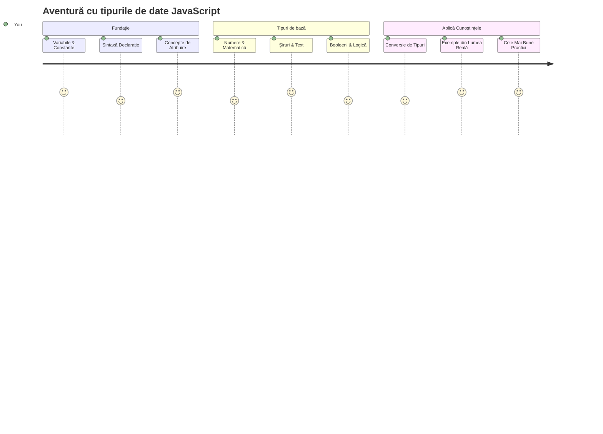
Tipurile de date sunt unul dintre conceptele fundamentale în JavaScript pe care le vei întâlni în fiecare program pe care îl scrii. Gândește-te la tipurile de date ca la sistemul de arhivare folosit de bibliotecarii antici din Alexandria – aveau locuri specifice pentru sulurile care conțineau poezie, matematică și înregistrări istorice. JavaScript organizează informațiile într-un mod similar, cu categorii diferite pentru diferite tipuri de date.

În această lecție, vom explora tipurile de date de bază care fac JavaScript să funcționeze. Vei învăța cum să gestionezi numerele, textele, valorile adevărat/fals și vei înțelege de ce alegerea tipului corect este esențială pentru programele tale. Aceste concepte pot părea abstracte la început, dar cu practică, vor deveni ceva natural.

Înțelegerea tipurilor de date va face totul în JavaScript mult mai clar. Așa cum arhitecții trebuie să înțeleagă diferite materiale de construcție înainte de a ridica o catedrală, aceste fundamente vor susține tot ceea ce construiești de acum înainte.

## Test pre-lectură
[Test pre-lectură](https://ff-quizzes.netlify.app/web/)

Această lecție acoperă elementele de bază ale JavaScript-ului, limbajul care oferă interactivitate pe web.

> Poți parcurge această lecție pe [Microsoft Learn](https://docs.microsoft.com/learn/modules/web-development-101-variables/?WT.mc_id=academic-77807-sagibbon)!

[](https://youtube.com/watch?v=JNIXfGiDWM8 "Variables in JavaScript")

[](https://youtube.com/watch?v=AWfA95eLdq8 "Data Types in JavaScript")

> 🎥 Apasă pe imaginile de mai sus pentru videoclipuri despre variabile și tipuri de date

Să începem cu variabilele și tipurile de date care le populează!

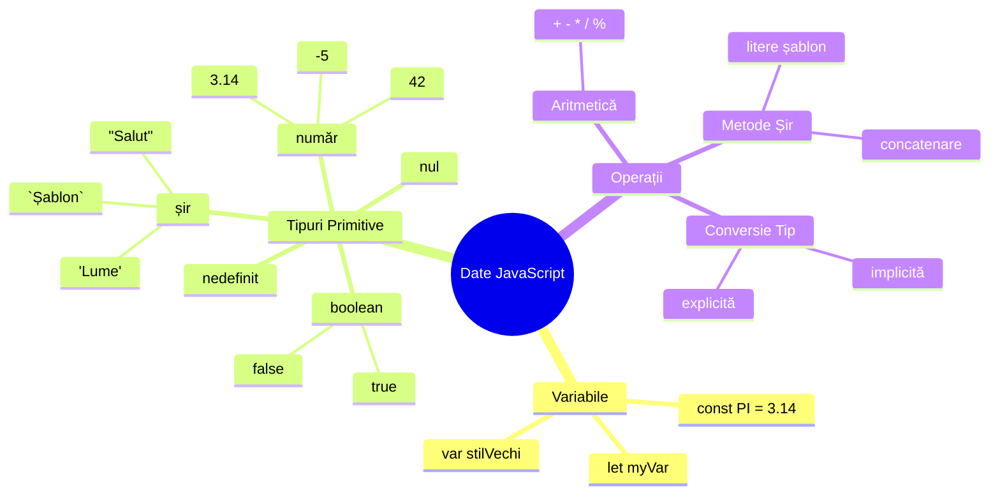
## Variabile

Variabilele sunt blocuri fundamentale în programare. Ca borcanele etichetate pe care alchimiștii medievali le foloseau pentru a păstra diferite substanțe, variabilele îți permit să stochezi informații și să le dai un nume descriptiv astfel încât să le poți referi mai târziu. Trebuie să ții minte vârsta cuiva? Stocheaz-o într-o variabilă numită `age`. Vrei să urmărești numele unui utilizator? Păstrează-l într-o variabilă numită `userName`.

Ne vom concentra pe metoda modernă de a crea variabile în JavaScript. Tehnicile pe care le vei învăța aici reprezintă ani de evoluție a limbajului și bune practici dezvoltate de comunitatea programatorilor.

Crearea și **declararea** unei variabile are următoarea sintaxă **[cuvânt cheie] [nume]**. Este compusă din două părți:

- **Cuvânt cheie**. Folosește `let` pentru variabile care pot fi modificate sau `const` pentru valori care rămân aceleași.
- **Numele variabilei**, un nume descriptiv pe care îl alegi tu.

✅ Cuvântul cheie `let` a fost introdus în ES6 și oferă variabilei tale ceea ce se numește _block scope_. Este recomandat să folosești `let` sau `const` în locul cuvântului cheie mai vechi `var`. Vom discuta mai pe larg despre block scope în părțile viitoare.

### Sarcină - lucrul cu variabilele

1. **Declară o variabilă**. Să începem prin a crea prima noastră variabilă:

    ```javascript
    let myVariable;
    ```

   **Ce realizează acest pas:**
   - Spune JavaScript să creeze un spațiu de stocare numit `myVariable`
   - JavaScript alocă spațiu în memorie pentru această variabilă
   - Variabila momentan nu are o valoare (undefined)

2. **Dă-i o valoare**. Acum pune ceva în variabila noastră:

    ```javascript
    myVariable = 123;
    ```

   **Cum funcționează atribuirea:**
   - Operatorul `=` atribuie valoarea 123 variabilei noastre
   - Variabila conține acum această valoare în loc să fie undefined
   - Poți face referire la această valoare în tot codul folosind `myVariable`

   > Notă: folosirea lui `=` în această lecție înseamnă că folosim un „operator de atribuire”, folosit pentru a seta o valoare unei variabile. Nu indică egalitate.

3. **Fă-o într-un mod inteligent**. De fapt, să combinăm cele două etape:

    ```javascript
    let myVariable = 123;
    ```

    **Această abordare este mai eficientă:**
    - Declari variabila și îi atribui o valoare într-o singură instrucțiune
    - Este o practică standard în rândul dezvoltatorilor
    - Reduce lungimea codului păstrând claritatea

4. **Schimbă-ți părerea**. Ce faci dacă vrei să stochezi un alt număr?

   ```javascript
   myVariable = 321;
   ```

   **Înțelegerea reatribuirii:**
   - Variabila conține acum 321 în loc de 123
   - Valoarea anterioară este înlocuită – variabilele stochează o singură valoare la un moment dat
   - Această mutabilitate este caracteristica cheie a variabilelor declarate cu `let`

   ✅ Încearcă! Poți scrie JavaScript direct în browserul tău. Deschide o fereastră de browser și navighează la Instrumentele dezvoltatorului (Developer Tools). În consolă, vei găsi un prompt; tastează `let myVariable = 123`, apasă Enter, apoi tastează `myVariable`. Ce se întâmplă? Vei învăța mai multe despre aceste concepte în lecțiile următoare.

### 🧠 **Verificare de stăpânire a variabilelor: Devino confortabil**

**Să vedem cum te simți cu variabilele:**
- Poți explica diferența dintre declararea și atribuirea unei variabile?
- Ce se întâmplă dacă încerci să folosești o variabilă înainte să o declari?
- Când ai alege `let` în loc de `const` pentru o variabilă?

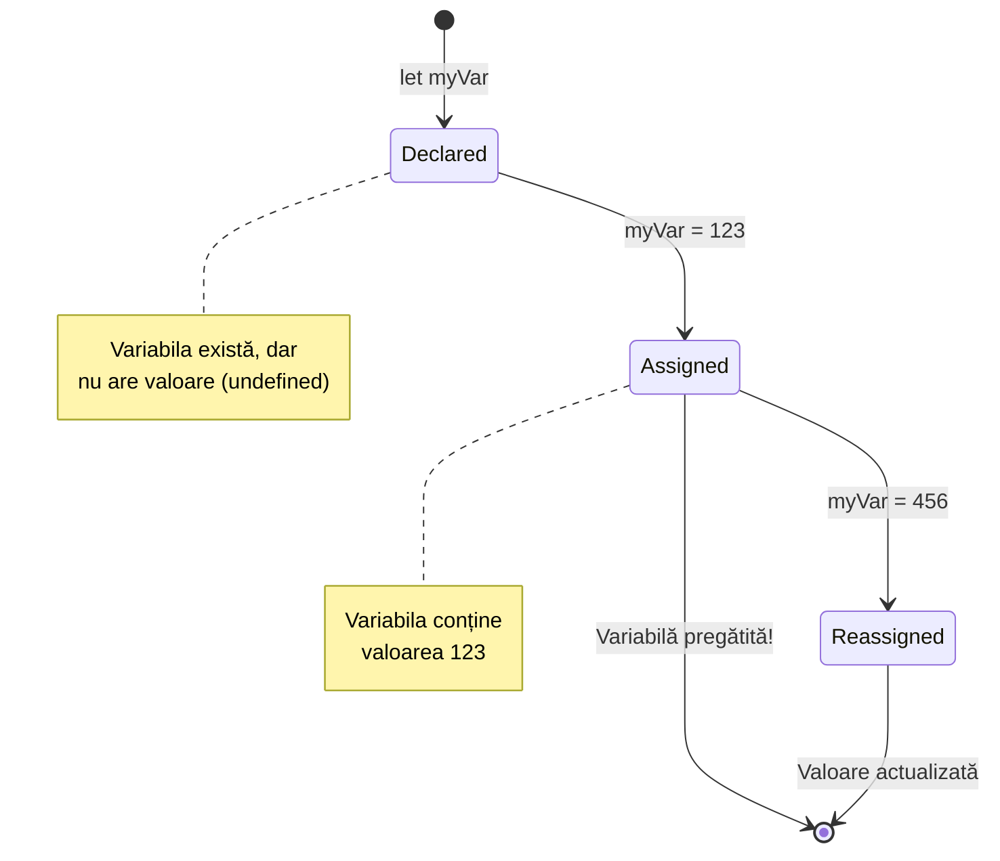
> **Sfat rapid**: Gândește-te la variabile ca la cutii de depozitare etichetate. Creezi cutia (`let`), pui ceva în ea (`=`), și poți înlocui conținutul mai târziu dacă este nevoie!

## Constante

Uneori ai nevoie să stochezi informații care nu ar trebui să se schimbe niciodată pe durata execuției programului. Gândește-te la constante ca la principiile matematice stabilite de Euclid în Grecia antică – odată demonstrate și documentate, au rămas fixe pentru toate referințele viitoare.

Constantele funcționează similar cu variabilele, dar cu o restricție importantă: odată ce le atribui o valoare, aceasta nu poate fi schimbată. Această imutabilitate ajută la prevenirea modificărilor accidentale ale valorilor critice din programul tău.

Declararea și inițializarea unei constante urmează aceleași concepte ca o variabilă, cu excepția cuvântului cheie `const`. Constantele sunt de obicei declarate cu litere mari.

```javascript
const MY_VARIABLE = 123;
```

**Iată ce face acest cod:**
- **Creează** o constantă numită `MY_VARIABLE` cu valoarea 123
- **Folosește** convenția de numire cu majuscule pentru constante
- **Previne** orice modificare ulterioară a acestei valori

Constantele au două reguli principale:

- **Trebuie să le atribui o valoare imediat** – nu sunt permise constante goale!
- **Nu poți schimba niciodată acea valoare** – JavaScript va arunca o eroare dacă încerci. Să vedem ce vreau să spun:

   **Valoare simplă** - Următorul cod NU este permis:
   
      ```javascript
      const PI = 3;
      PI = 4; // nu este permis
      ```

   **Ce trebuie să reții:**
   - **Încercările** de reatribuire a constantei vor cauza o eroare
   - **Protejează** valorile importante de modificări accidentale
   - **Asigură** că valoarea rămâne consistentă pe tot parcursul programului

   **Referința obiectului este protejată** - Următorul cod NU este permis:
   
      ```javascript
      const obj = { a: 3 };
      obj = { b: 5 } // nu este permis
      ```

   **Înțelegerea acestor concepte:**
   - **Previne** înlocuirea întregului obiect cu unul nou
   - **Protejează** referința către obiectul original
   - **Menține** identitatea obiectului în memorie

    **Valoarea obiectului nu este protejată** - Următorul cod ESTE permis:
    
      ```javascript
      const obj = { a: 3 };
      obj.a = 5;  // permis
      ```

      **Descompunând ce se întâmplă aici:**
      - **Modifică** valoarea proprietății din obiect
      - **Păstrează** aceeași referință a obiectului
      - **Demonstrează** că conținutul obiectului poate să se schimbe în timp ce referința rămâne constantă

   > Notă, `const` înseamnă că referința este protejată de reatribuire. Valoarea nu este _imutabilă_ și poate să se schimbe, în special dacă este un construct complex cum este un obiect.

## Tipuri de date

JavaScript organizează informațiile în categorii diferite, numite tipuri de date. Acest concept reflectă modul în care savanții antici au clasificat cunoașterea – Aristotel a făcut distincție între tipuri diferite de raționament, știind că principiile logice nu pot fi aplicate uniform poeziei, matematicii și filosofiei naturale.

Tipurile de date contează deoarece operațiile diferite funcționează cu tipuri diferite de informații. La fel cum nu poți face operații aritmetice pe numele unei persoane sau nu poți ordona alfabetic o ecuație matematică, JavaScript necesită tipul de date corespunzător pentru fiecare operație. Înțelegerea asta previne erorile și face codul tău mai fiabil.

Variabilele pot stoca multe tipuri diferite de valori, precum numere și texte. Aceste tipuri variate de valori sunt cunoscute ca **tipurile de date**. Tipurile de date sunt o parte importantă a dezvoltării software, pentru că ajută dezvoltatorii să ia decizii despre cum ar trebui scris codul și cum ar trebui să ruleze software-ul. Mai mult, unele tipuri de date au caracteristici unice care ajută la transformarea sau extragerea de informații suplimentare într-o valoare.

✅ Tipurile de date sunt de asemenea denumite primitive de date JavaScript, deoarece sunt tipurile de date la cel mai jos nivel oferite de limbaj. Există 7 tipuri primitive de date: string, number, bigint, boolean, undefined, null și symbol. Ia un minut să vizualizezi ce ar putea reprezenta fiecare dintre aceste primitive. Ce este un `zebra`? Dar `0`? `true`?

### Numere

Numerele sunt cel mai simplu tip de date în JavaScript. Fie că lucrezi cu numere întregi ca 42, cu zecimale ca 3.14, sau numere negative ca -5, JavaScript le tratează uniform.

Ține minte variabila noastră de mai devreme? Acei 123 pe care i-am stocat erau de fapt de tip număr:

```javascript
let myVariable = 123;
```

**Caracteristici esențiale:**
- JavaScript recunoaște automat valorile numerice
- Poți face operații matematice cu aceste variabile
- Nu este necesară declararea explicită a tipului

Variabilele pot stoca toate tipurile de numere, inclusiv zecimale sau numere negative. Numerele pot fi folosite și cu operatorii aritmetici, care vor fi acoperiți în [secțiunea următoare](../../../../2-js-basics/1-data-types).

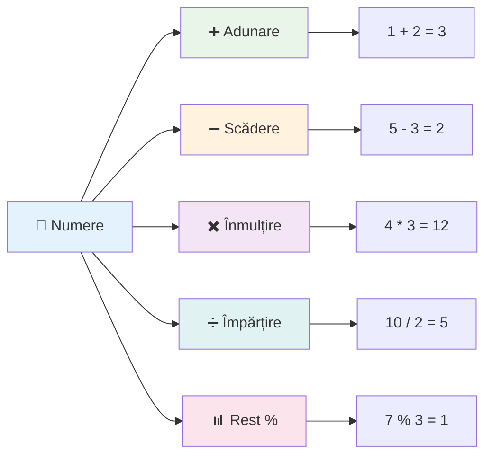
### Operatorii aritmetici

Operatorii aritmetici îți permit să faci calcule matematice în JavaScript. Acești operatori urmează aceleași principii pe care le-au folosit matematicienii de secole – aceleași simboluri care au apărut în lucrările savanților ca Al-Khwarizmi, care a dezvoltat notația algebrică.

Operatorii funcționează cum te-ai aștepta din matematică tradițională: plus pentru adunare, minus pentru scădere și așa mai departe.

Există mai multe tipuri de operatori pentru funcții aritmetice, câțiva fiind enumerați mai jos:

| Simbol | Descriere                                                                | Exemplu                          |
| ------ | ------------------------------------------------------------------------ | -------------------------------- |
| `+`    | **Adunare**: Calculează suma a două numere                               | `1 + 2 //răspunsul așteptat este 3`   |
| `-`    | **Scădere**: Calculează diferența a două numere                         | `1 - 2 //răspunsul așteptat este -1`  |
| `*`    | **Înmulțire**: Calculează produsul a două numere                        | `1 * 2 //răspunsul așteptat este 2`   |
| `/`    | **Împărțire**: Calculează câtul împărțirii a două numere                | `1 / 2 //răspunsul așteptat este 0.5` |
| `%`    | **Rest**: Calculează restul împărțirii a două numere                    | `1 % 2 //răspunsul așteptat este 1`   |

✅ Încearcă! Încearcă o operație aritmetică în consola browserului tău. Te surprind rezultatele?

### 🧮 **Verificare a abilităților matematice: Calculați cu încredere**

**Testează-ți înțelegerea aritmeticii:**
- Care este diferența dintre `/` (împărțire) și `%` (rest)?
- Poți prezice cât este `10 % 3`? (Indiciu: nu este 3.33...)
- De ce ar putea fi operatorul rest util în programare?

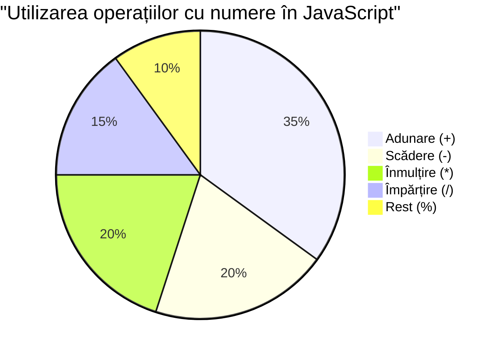
> **Observație din lumea reală**: Operatorul rest (%) este foarte util pentru a verifica dacă numerele sunt pare/impare, pentru a crea modele sau pentru a parcurge ciclurile în array-uri!

### Șiruri de caractere (Strings)

În JavaScript, datele textuale sunt reprezentate ca șiruri de caractere. Termenul „string” vine din conceptul de caractere legate într-o secvență, asemănător modului în care scribii din mănăstirile medievale combinau litere pentru a forma cuvinte și propoziții în manuscrisele lor.

Stringurile sunt fundamentale pentru dezvoltarea web. Fiecare bucată de text afișată pe un site – nume de utilizator, etichete de butoane, mesaje de eroare, conținut – este tratată ca date de tip string. Înțelegerea stringurilor este esențială pentru crearea interfețelor funcționale ale utilizatorului.

Stringurile sunt seturi de caractere care stau între ghilimele simple sau duble.

```javascript
'This is a string'
"This is also a string"
let myString = 'This is a string value stored in a variable';
```

**Înțelegerea acestor concepte:**
- **Folosește** ghilimele simple `'` sau duble `"` pentru a defini stringuri
- **Stochează** date textuale care pot include litere, numere și simboluri
- **Atribuie** valori string variabilelor pentru utilizare ulterioară
- **Necesită** ghilimele pentru a distinge textul de numele variabilelor

Amintește-ți să folosești ghilimele când scrii un string, altfel JavaScript va presupune că este numele unei variabile.

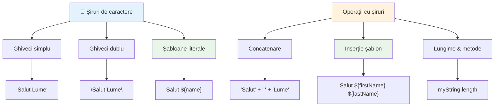
### Formatarea stringurilor

Manipularea stringurilor îți permite să combini elemente de text, să încorporezi variabile și să creezi conținut dinamic care răspunde la starea programului. Această tehnică îți permite să construiești text programatic.

Adesea ai nevoie să unești mai multe stringuri împreună – acest proces se numește concatenare.
Pentru a **concatena** două sau mai multe șiruri, sau a le uni, folosește operatorul `+`.

```javascript
let myString1 = "Hello";
let myString2 = "World";

myString1 + myString2 + "!"; //SalutLume!
myString1 + " " + myString2 + "!"; //Salut Lume!
myString1 + ", " + myString2 + "!"; //Salut, Lume!
```

**Pas cu pas, iată ce se întâmplă:**
- **Combină** mai multe șiruri folosind operatorul `+`
- **Unește** șirurile direct fără spații în primul exemplu
- **Adaugă** caractere spațiu `" "` între șiruri pentru lizibilitate
- **Introduce** semne de punctuație precum virgule pentru o formatare corectă

✅ De ce `1 + 1 = 2` în JavaScript, dar `'1' + '1' = 11`? Gândește-te puțin. Ce se întâmplă cu `'1' + 1`?

**Șabloanele literale** sunt o altă modalitate de a formata șiruri, cu diferența că în loc de ghilimele se folosesc backtick-uri. Tot ce nu este text simplu trebuie plasat în interiorul placeholder-elor `${ }`. Aceasta include orice variabile care pot fi șiruri.

```javascript
let myString1 = "Hello";
let myString2 = "World";

`${myString1} ${myString2}!` //Salut, Lume!
`${myString1}, ${myString2}!` //Salut, Lume!
```

**Să înțelegem fiecare parte:**
- **Folosește** backtick-uri `` ` `` în loc de ghilimele obișnuite pentru a crea șabloane literale
- **Încorporează** variabile direct folosind sintaxa placeholder `${}`
- **Păstrează** spațiile și formatarea exact așa cum este scrisă
- **Oferă** o modalitate mai curată de a crea șiruri complexe cu variabile

Poți realiza obiectivele de formatare oricare dintre aceste metode, însă șabloanele literale vor respecta orice spații și întreruperi de linie.

✅ Când ai folosi un șablon literal în locul unui șir simplu?

### 🔤 **Verificare Măiestrie Șiruri: Încredere în Manipularea Textului**

**Evaluează-ți abilitățile cu șirurile:**
- Poți explica de ce `'1' + '1'` este `'11'` în loc de `2`?
- Care metodă pentru șiruri o găsești mai ușor de citit: concatenarea sau șabloanele literale?
- Ce se întâmplă dacă uiți ghilimelele în jurul unui șir?

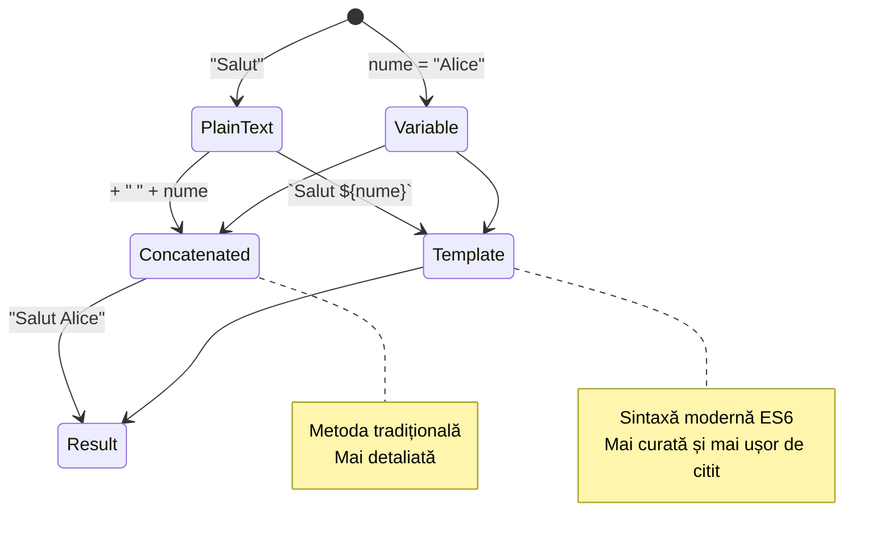
> **Sfat expert**: Șabloanele literale sunt în general preferate pentru construirea complexă a șirurilor deoarece sunt mai lizibile și gestionează frumos șirurile pe mai multe linii!

### Booleeni

Booleenii reprezintă forma cea mai simplă de date: pot avea doar două valori – `true` sau `false`. Acest sistem de logică binară provine din munca lui George Boole, un matematician din secolul XIX care a dezvoltat algebra booleană.

În ciuda simplității lor, booleenii sunt esențiali pentru logica programelor. Ei permit codului tău să ia decizii bazate pe condiții – dacă un utilizator este autentificat, dacă un buton a fost apăsat sau dacă anumite criterii sunt îndeplinite.

Booleenii pot fi doar două valori: `true` sau `false`. Booleenii pot ajuta la luarea deciziilor privind care linii de cod să se execute când anumite condiții sunt îndeplinite. În multe cazuri, [operatorii](../../../../2-js-basics/1-data-types) ajută la setarea valorii unui boolean și vei observa frecvent inițializarea variabilelor sau actualizarea valorilor acestora cu un operator.

```javascript
let myTrueBool = true;
let myFalseBool = false;
```

**În exemplul de mai sus am:**
- **Creat** o variabilă care stochează valoarea booleană `true`
- **Demonstrat** cum să stochezi valoarea booleană `false`
- **Folosind** cuvintele cheie exacte `true` și `false` (fără ghilimele)
- **Pregătit** aceste variabile pentru utilizarea în instrucțiuni condiționale

✅ O variabilă poate fi considerată 'truthy' dacă evaluează la booleanul `true`. Interesant este că în JavaScript, [toate valorile sunt truthy dacă nu sunt definite ca falsy](https://developer.mozilla.org/docs/Glossary/Truthy).

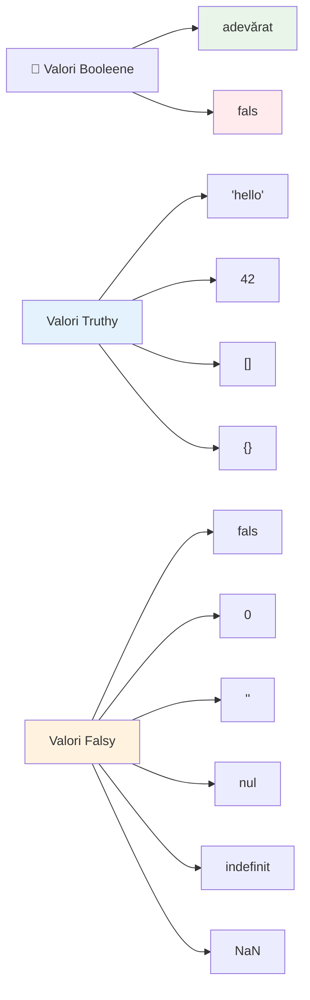
### 🎯 **Verificare Logică Booleană: Abilități de Luare a Deciziilor**

**Testează-ți înțelegerea booleană:**
- De ce crezi că JavaScript are valori „truthy” și „falsy” dincolo de `true` și `false`?
- Poți prezice care dintre acestea este falsy: `0`, `"0"`, `[]`, `"false"`?
- Cum pot fi booleenii utili în controlul fluxului unui program?

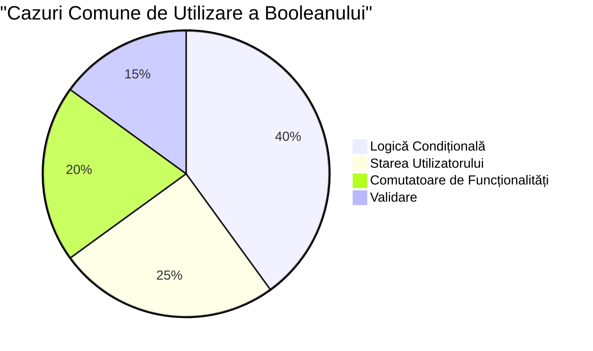
> **Amintește-ți**: În JavaScript, doar 6 valori sunt falsy: `false`, `0`, `""`, `null`, `undefined` și `NaN`. Tot restul sunt truthy!

---

## 📊 **Rezumatul Trusei Tale de Tipuri de Date**

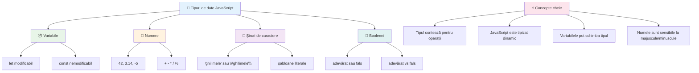
## Provocarea Agentului GitHub Copilot 🚀

Folosește modul Agent pentru a completa următoarea provocare:

**Descriere:** Creează un manager de informații personale care demonstrează toate tipurile de date JavaScript învățate în această lecție, gestionând scenarii reale de date.

**Cerere:** Construiește un program JavaScript care creează un obiect profil utilizator ce conține: numele persoanei (șir), vârsta (număr), statutul de student (boolean), culori favorite ca tablou și un obiect adresă cu proprietăți stradă, oraș și cod poștal. Include funcții pentru afișarea informațiilor profilului și actualizarea câmpurilor individuale. Asigură-te că demonstrezi concatenarea șirurilor, șabloanele literale, operații aritmetice cu vârsta și logica booleană pentru statutul de student.

Află mai multe despre [modul agent](https://code.visualstudio.com/blogs/2025/02/24/introducing-copilot-agent-mode) aici.

## 🚀 Provocare

JavaScript are unele comportamente care pot lua dezvoltatorii prin surprindere. Iată un exemplu clasic de explorat: încearcă să tastezi în consola browserului: `let age = 1; let Age = 2; age == Age` și observă rezultatul. Returnează `false` – poți determina de ce?

Aceasta este una din multele comportamente JavaScript care merită înțelese. Familiarizarea cu aceste particularități te va ajuta să scrii cod mai fiabil și să depanezi probleme mai eficient.

## Test după lecție
[Test după lecție](https://ff-quizzes.netlify.app)

## Recapitulare & Autostudiu

Aruncă o privire la [această listă de exerciții JavaScript](https://css-tricks.com/snippets/javascript/) și încearcă unul. Ce ai învățat?

## Temă

[Exerciții Tipuri de Date](assignment.md)

## 🚀 Planul Tău de Măiestrie în Tipuri de Date JavaScript

### ⚡ **Ce poți face în următoarele 5 minute**
- [ ] Deschide consola browserului și creează 3 variabile cu diferite tipuri de date
- [ ] Încearcă provocarea: `let age = 1; let Age = 2; age == Age` și află de ce este falsă
- [ ] Exersează concatenarea șirurilor cu numele tău și numărul tău preferat
- [ ] Testează ce se întâmplă când adaugi un număr la un șir

### 🎯 **Ce poți realiza în această oră**
- [ ] Completează testul după lecție și revizuiește conceptele confuze
- [ ] Creează un mini calculator care adună, scade, înmulțește și împarte două numere
- [ ] Construiește un formator simplu de nume folosind șabloane literale
- [ ] Explorează diferențele dintre operatorii de comparație `==` și `===`
- [ ] Exersează conversia între diferite tipuri de date

### 📅 **Fundația ta JavaScript pe o săptămână**
- [ ] Finalizează tema cu încredere și creativitate
- [ ] Creează un obiect profil personal folosind toate tipurile de date învățate
- [ ] Exersează cu [exerciții JavaScript de pe CSS-Tricks](https://css-tricks.com/snippets/javascript/)
- [ ] Construiește un validator simplu de formular folosind logica booleană
- [ ] Experimentează cu tipurile de date array și obiect (previzualizare lecții viitoare)
- [ ] Alătură-te unei comunități JavaScript și pune întrebări despre tipuri de date

### 🌟 **Transformarea ta pe o lună**
- [ ] Integrează cunoștințele despre tipuri de date în proiecte mai mari
- [ ] Înțelege când și de ce să folosești fiecare tip de date în aplicații reale
- [ ] Ajută alți începători să înțeleagă fundamentele JavaScript
- [ ] Construiește o aplicație mică care gestionează diferite tipuri de date ale utilizatorilor
- [ ] Explorează concepte avansate legate de tipuri de date precum conversia de tip și egalitatea strictă
- [ ] Contribuie la proiecte open source JavaScript cu îmbunătățiri în documentație

### 🧠 **Verificarea finală a măiestriei în tipuri de date**

**Sărbătorește-i fundația JavaScript:**
- Care tip de date ți-a surprins cel mai mult comportamentul?
- Cât de confortabil te simți explicând variabilele vs constantele unui prieten?
- Care este cel mai interesant lucru descoperit despre sistemul de tipuri al JavaScript?
- Ce aplicație reală îți imaginezi că poți construi cu aceste fundamente?

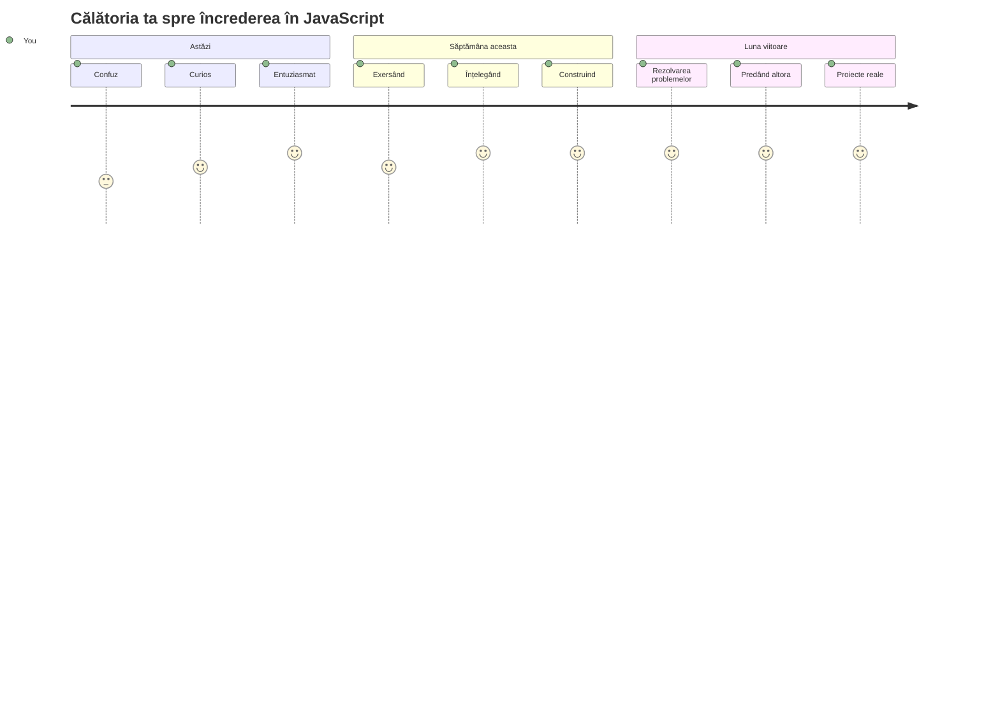
> 💡 **Ai construit fundația!** Înțelegerea tipurilor de date este ca învățarea alfabetului înainte de a scrie povești. Orice program JavaScript pe care îl vei scrie va folosi aceste concepte fundamentale. Acum ai blocurile de construcție pentru a crea site-uri interactive, aplicații dinamice și pentru a rezolva probleme reale cu cod. Bine ai venit în minunata lume a JavaScript! 🎉

---

<!-- CO-OP TRANSLATOR DISCLAIMER START -->
**Declinare de responsabilitate**:  
Acest document a fost tradus folosind serviciul de traducere AI [Co-op Translator](https://github.com/Azure/co-op-translator). Deși ne străduim pentru acuratețe, vă rugăm să rețineți că traducerile automate pot conține erori sau inexactități. Documentul original, în limba sa de origine, trebuie considerat sursa autorizată. Pentru informații critice, se recomandă traducerea profesională realizată de un specialist uman. Nu ne asumăm răspunderea pentru eventualele neînțelegeri sau interpretări greșite rezultate din utilizarea acestei traduceri.
<!-- CO-OP TRANSLATOR DISCLAIMER END -->