<!--
CO_OP_TRANSLATOR_METADATA:
{
  "original_hash": "71f7d7dafa1c7194d79ddac87f669ff9",
  "translation_date": "2026-01-07T05:31:26+00:00",
  "source_file": "2-js-basics/2-functions-methods/README.md",
  "language_code": "ro"
}
-->
# Noțiuni de bază JavaScript: Metode și Funcții


> Sketchnote de [Tomomi Imura](https://twitter.com/girlie_mac)

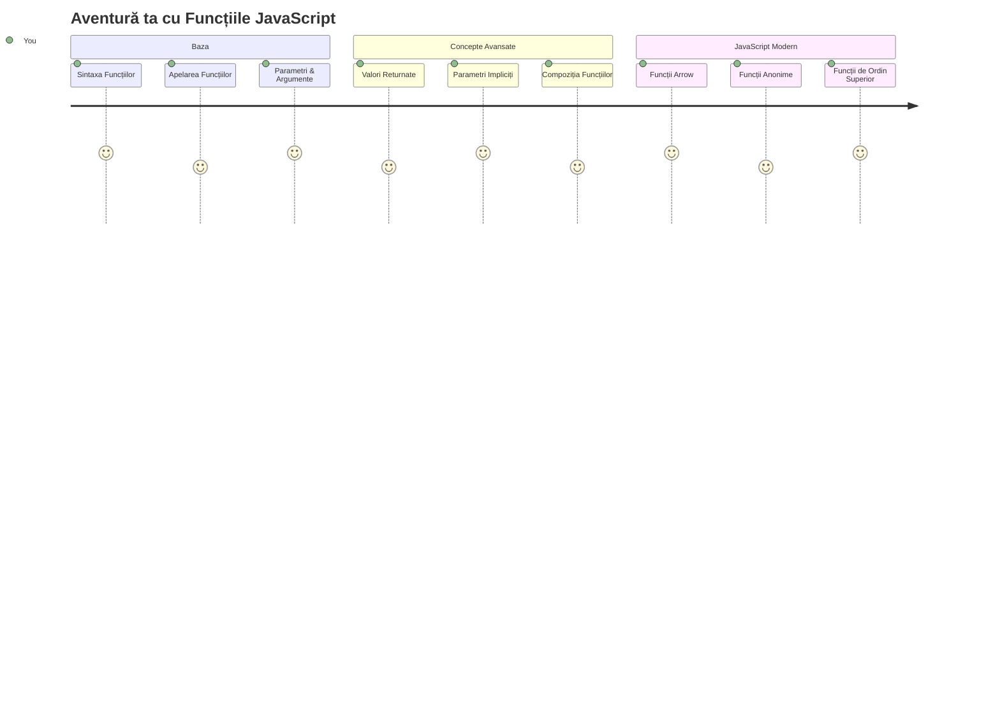
## Test preliminar
[Test preliminar](https://ff-quizzes.netlify.app)

Să scrii același cod în mod repetat este una dintre cele mai comune frustări în programare. Funcțiile rezolvă această problemă permițându-ți să împachetezi cod în blocuri reutilizabile. Gândește-te la funcții ca la părțile standardizate care au făcut linia de asamblare a lui Henry Ford revoluționară – odată ce creezi o componentă fiabilă, o poți folosi oriunde fără să o reconstruiești de la zero.

Funcțiile îți permit să grupezi bucăți de cod astfel încât să le poți reutiliza pe tot parcursul programului tău. În loc să copiezi și să inserezi aceeași logică peste tot, poți crea o funcție o singură dată și să o apelezi ori de câte ori ai nevoie. Această abordare menține codul organizat și face actualizările mult mai ușoare.

În această lecție, vei învăța cum să creezi propriile funcții, să le transmiți informații și să primești în schimb rezultate utile. Vei descoperi diferența dintre funcții și metode, vei învăța abordări moderne ale sintaxei și vei vedea cum funcțiile pot lucra împreună cu alte funcții. Vom construi aceste concepte pas cu pas.

[](https://youtube.com/watch?v=XgKsD6Zwvlc "Metode și Funcții")

> 🎥 Apasă imaginea de mai sus pentru un videoclip despre metode și funcții.

> Poți susține această lecție pe [Microsoft Learn](https://docs.microsoft.com/learn/modules/web-development-101-functions/?WT.mc_id=academic-77807-sagibbon)!

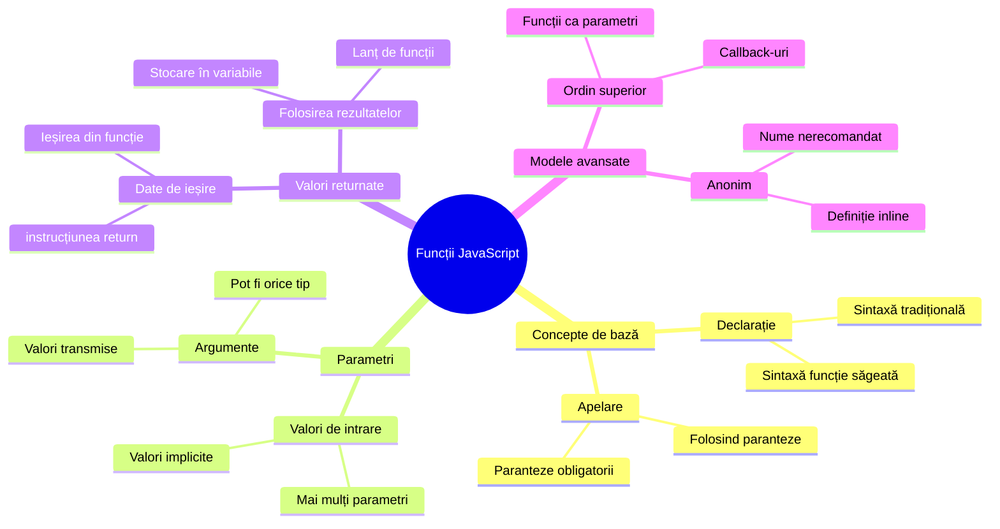
## Funcții

O funcție este un bloc de cod autonom care realizează o sarcină specifică. Ea încapsulează o logică pe care o poți executa ori de câte ori este necesar.

În loc să scrii același cod de mai multe ori în cadrul programului, îl poți împacheta într-o funcție și apela ori de câte ori ai nevoie. Această metodă menține codul curat și face actualizările mult mai simple. Gândește-te la provocarea de întreținere dacă ar fi trebuit să schimbi logica răspândită în 20 de locații diferite ale codului tău.

Este esențial să dai funcțiilor tale nume descriptive. O funcție bine denumită comunică clar scopul său – când vezi `cancelTimer()`, înțelegi imediat ce face, la fel cum un buton clar etichetat îți spune exact ce se întâmplă când îl apeși.

## Crearea și apelarea unei funcții

Să vedem cum să creăm o funcție. Sintaxa urmează un tipar consecvent:

```javascript
function nameOfFunction() { // definiția funcției
 // definiția/corpul funcției
}
```

Să descompunem:
- Cuvântul cheie `function` spune JavaScript: "Hei, creez o funcție!"
- `nameOfFunction` este locul unde dai funcției tale un nume descriptiv
- Parantezele `()` sunt unde poți adăuga parametri (vom discuta despre asta în curând)
- Parantezele acolade `{}` conțin codul efectiv care se rulează când apelezi funcția

Să creăm o funcție simplă de salut pentru a vedea asta în acțiune:

```javascript
function displayGreeting() {
  console.log('Hello, world!');
}
```

Această funcție afișează "Hello, world!" în consolă. Odată definită, o poți folosi de câte ori ai nevoie.

Pentru a executa (sau "apela") funcția ta, scrie numele ei urmat de paranteze. JavaScript îți permite să definești funcția înainte sau după apel – motorul JavaScript va gestiona ordinea execuției.

```javascript
// apelând funcția noastră
displayGreeting();
```

Când rulezi această linie, execută tot codul din funcția `displayGreeting`, afișând "Hello, world!" în consola browserului tău. Poți apela funcția de multe ori.

### 🧠 **Verificare Fundamente Funcții: Construirea primelor tale funcții**

**Să vedem cât ai învățat despre funcțiile de bază:**
- Poți explica de ce folosim acolade `{}` în definițiile funcțiilor?
- Ce se întâmplă dacă scrii doar `displayGreeting` fără paranteze?
- De ce ai vrea să apelezi aceeași funcție de mai multe ori?

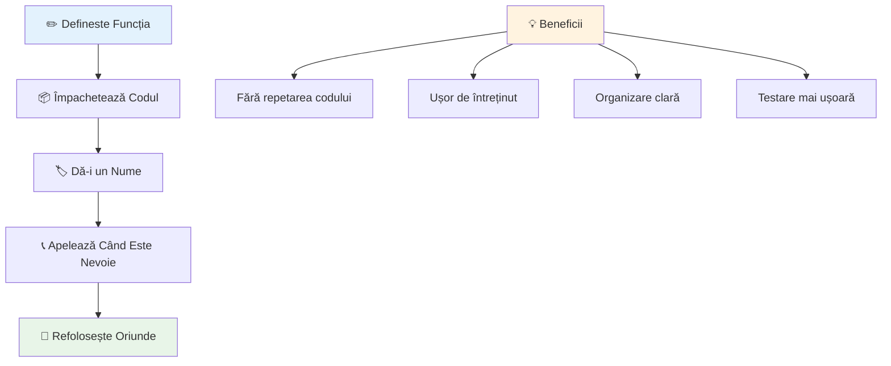
> **Notă:** Ai folosit **metode** pe parcursul acestor lecții. `console.log()` este o metodă – practic o funcție care aparține obiectului `console`. Diferența cheie este că metodele sunt atașate obiectelor, în timp ce funcțiile sunt independente. Mulți dezvoltatori folosesc acești termeni interschimbabil în conversațiile casual.

### Cele mai bune practici pentru funcții

Iată câteva sfaturi care te vor ajuta să scrii funcții bune:

- Dă funcțiilor nume clare și descriptive – viitorul tău te va mulțumi!
- Folosește **camelCase** pentru nume compuse (de exemplu `calculateTotal` în loc de `calculate_total`)
- Menține fiecare funcție concentrată pe o singură sarcină bine făcută

## Transmiterea informațiilor către o funcție

Funcția noastră `displayGreeting` este limitată – poate afișa doar "Hello, world!" pentru toată lumea. Parametrii ne permit să facem funcțiile mai flexibile și utile.

**Parametrii** funcționează ca niște locuri rezervate unde poți introduce valori diferite de fiecare dată când folosești funcția. În acest fel, aceeași funcție poate funcționa cu informații diferite la fiecare apel.

Listezi parametrii între paranteze când definești funcția, separând mai mulți parametri cu virgule:

```javascript
function name(param, param2, param3) {

}
```

Fiecare parametru funcționează ca un loc rezervat – când cineva apelează funcția ta, va furniza valori reale care sunt plasate în aceste locuri.

Să actualizăm funcția de salut ca să primească un nume:

```javascript
function displayGreeting(name) {
  const message = `Hello, ${name}!`;
  console.log(message);
}
```

Observă cum folosim backtick-urile (`` ` ``) și `${}` pentru a introduce direct numele în mesaj – aceasta se numește șablon literal și este o metodă foarte utilă de a construi șiruri de caractere cu variabile incluse.

Acum, când apelăm funcția, putem transmite orice nume:

```javascript
displayGreeting('Christopher');
// afișează "Hello, Christopher!" când este rulat
```

JavaScript ia șirul `'Christopher'`, îl alocă parametrului `name` și creează mesajul personalizat "Hello, Christopher!"

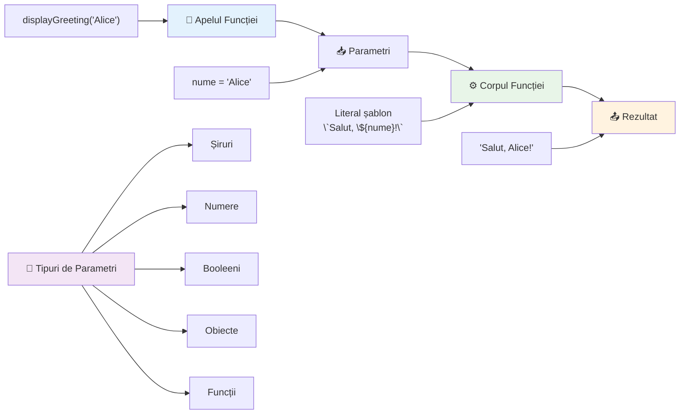
## Valori implicite

Ce se întâmplă dacă vrem să facem unii parametri opționali? Aici vin în ajutor valorile implicite!

Să presupunem că vrem să permitem oamenilor să personalizeze cuvântul de salut, dar dacă nu specifică niciunul, folosim "Hello" ca valoare de rezervă. Poți seta valori implicite folosind semnul egal, ca la declararea unei variabile:

```javascript
function displayGreeting(name, salutation='Hello') {
  console.log(`${salutation}, ${name}`);
}
```

Aici, `name` este încă obligatoriu, dar `salutation` are o valoare implicită `'Hello'` dacă nimeni nu oferă un alt salut.

Acum putem apela funcția în două moduri diferite:

```javascript
displayGreeting('Christopher');
// afișează "Hello, Christopher"

displayGreeting('Christopher', 'Hi');
// afișează "Hi, Christopher"
```

În primul apel, JavaScript folosește "Hello" implicit deoarece nu am specificat un salut. În al doilea apel, folosește salutul nostru personalizat "Hi". Această flexibilitate face funcțiile adaptabile pentru situații diferite.

### 🎛️ **Verificare Stăpânire Parametri: Cum să faci funcțiile flexibile**

**Testează-ți înțelegerea parametrilor:**
- Care este diferența dintre un parametru și un argument?
- De ce sunt utile valorile implicite în programarea reală?
- Poți prezice ce se întâmplă dacă transmiți mai mulți argumente decât parametri?

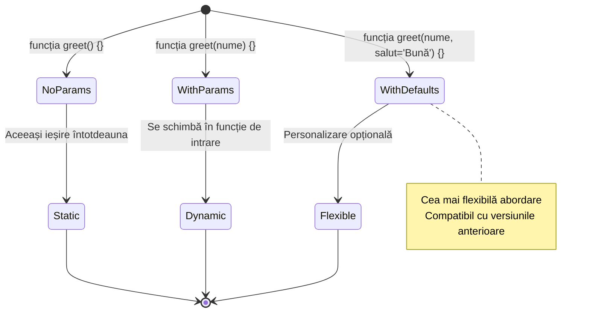
> **Sfat de expert**: Parametrii impliciți fac funcțiile mai prietenoase pentru utilizatori. Utilizatorii pot începe rapid cu valori implicite rezonabile, dar pot personaliza când este nevoie!

## Valori returnate

Funcțiile noastre până acum doar afișau mesaje în consolă, dar ce faci dacă vrei ca o funcție să calculeze ceva și să-ți returneze rezultatul?

Aici intră în scenă **valorile returnate**. În loc să afișeze ceva, o funcție poate să-ți întoarcă o valoare pe care o poți stoca într-o variabilă sau folosi în alte părți ale codului.

Pentru a trimite o valoare înapoi, folosești cuvântul cheie `return` urmat de orice vrei să returnezi:

```javascript
return myVariable;
```

Un lucru important: când o funcție întâlnește o instrucțiune `return`, se oprește imediat și trimite această valoare către apelant.

Să modificăm funcția noastră de salut ca să returneze mesajul în loc să-l afișeze:

```javascript
function createGreetingMessage(name) {
  const message = `Hello, ${name}`;
  return message;
}
```

Acum, în loc să afișeze mesajul, această funcție îl creează și îl trimite înapoi.

Pentru a folosi valoarea returnată, o putem stoca într-o variabilă precum orice altă valoare:

```javascript
const greetingMessage = createGreetingMessage('Christopher');
```

Acum `greetingMessage` conține "Hello, Christopher" și o putem folosi oriunde în cod – să o afișăm pe o pagină web, să o includem într-un email sau să o trimitem unei alte funcții.

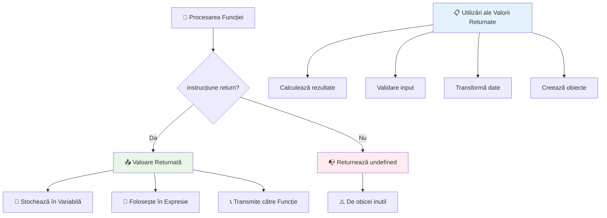
### 🔄 **Verificare Valori Returnate: Obținerea rezultatelor**

**Evaluează-ți înțelegerea valorilor returnate:**
- Ce se întâmplă cu codul după o instrucțiune `return` într-o funcție?
- De ce este uneori mai bine să returnezi valori decât să afișezi în consolă?
- O funcție poate returna diferite tipuri de valori (șir de caractere, număr, boolean)?

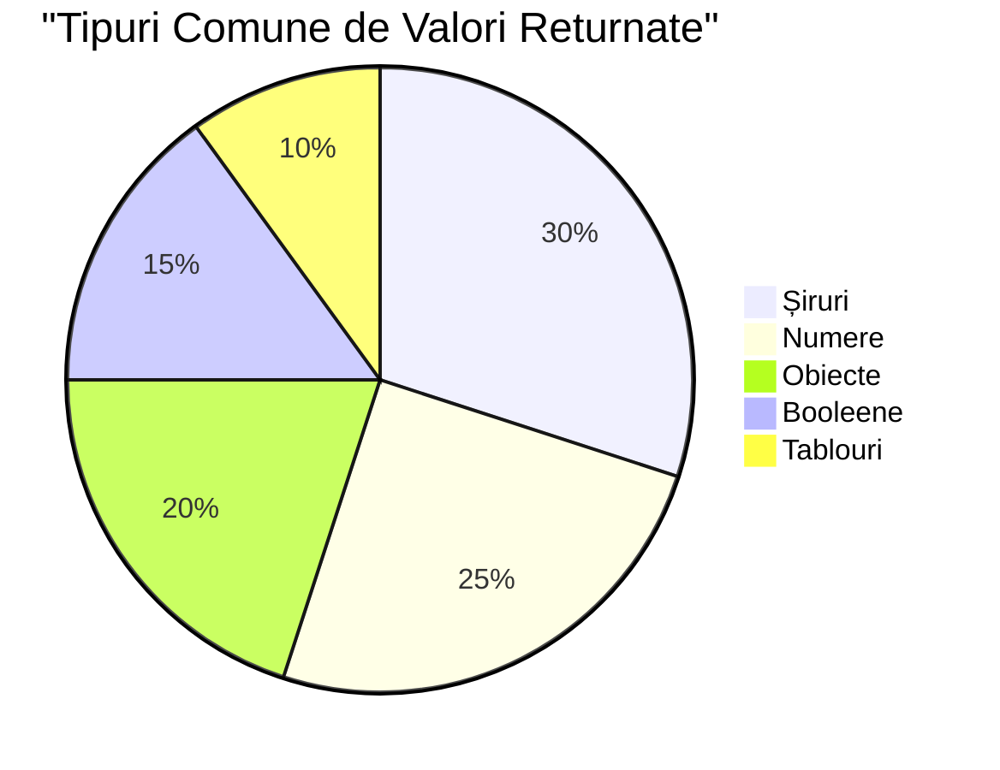
> **Insight cheie**: Funcțiile care returnează valori sunt mai versatile deoarece apelantul decide ce să facă cu rezultatul. Aceasta face codul mai modular și reutilizabil!

## Funcții ca parametri pentru alte funcții

Funcțiile pot fi transmise ca parametri către alte funcții. Deși acest concept poate părea complex la început, este o caracteristică puternică ce permite modele de programare flexibile.

Acest model este foarte folosit când vrei să spui "când se întâmplă ceva, fă acest alt lucru." De exemplu, "când timerul se termină, execută acest cod" sau "când utilizatorul apasă butonul, apelează această funcție."

Să analizăm `setTimeout`, care este o funcție încorporată ce așteaptă o anumită perioadă de timp și apoi rulează un cod. Trebuie să-i spunem ce cod să execute – un caz perfect pentru a transmite o funcție!

Încearcă acest cod – după 3 secunde, vei vedea un mesaj:

```javascript
function displayDone() {
  console.log('3 seconds has elapsed');
}
// valoarea temporizatorului este în milisecunde
setTimeout(displayDone, 3000);
```

Observă cum transmitem `displayDone` (fără paranteze) către `setTimeout`. Nu apelăm funcția noi înșine – o oferim lui `setTimeout` și spunem "apelează asta peste 3 secunde."

### Funcții anonime

Uneori ai nevoie de o funcție pentru un singur scop și nu vrei să-i dai un nume. Gândește-te – dacă folosești o funcție o singură dată, de ce să-ți aglomerezi codul cu un nume în plus?

JavaScript permite să creezi **funcții anonime** – funcții fără nume, pe care le poți defini direct unde ai nevoie.

Iată cum putem rescrie exemplul nostru cu timer folosind o funcție anonimă:

```javascript
setTimeout(function() {
  console.log('3 seconds has elapsed');
}, 3000);
```

Acesta are același rezultat, dar funcția este definită direct în apelul `setTimeout`, eliminând necesitatea unei declarații separate.

### Funcții săgeată

JavaScript modern are o metodă și mai scurtă de a scrie funcții numită **funcții săgeată**. Ele folosesc `=>` (care arată ca o săgeată – inspirat, nu?) și sunt foarte populare în rândul dezvoltatorilor.

Funcțiile săgeată îți permit să sari peste cuvântul cheie `function` și să scrii cod mai concis.

Iată exemplul nostru cu timer folosind o funcție săgeată:

```javascript
setTimeout(() => {
  console.log('3 seconds has elapsed');
}, 3000);
```

`()` este locul pentru parametri (gol în acest caz), apoi urmează săgeata `=>` și în final corpul funcției între acolade. Aceasta oferă aceeași funcționalitate cu o sintaxă mai compactă.

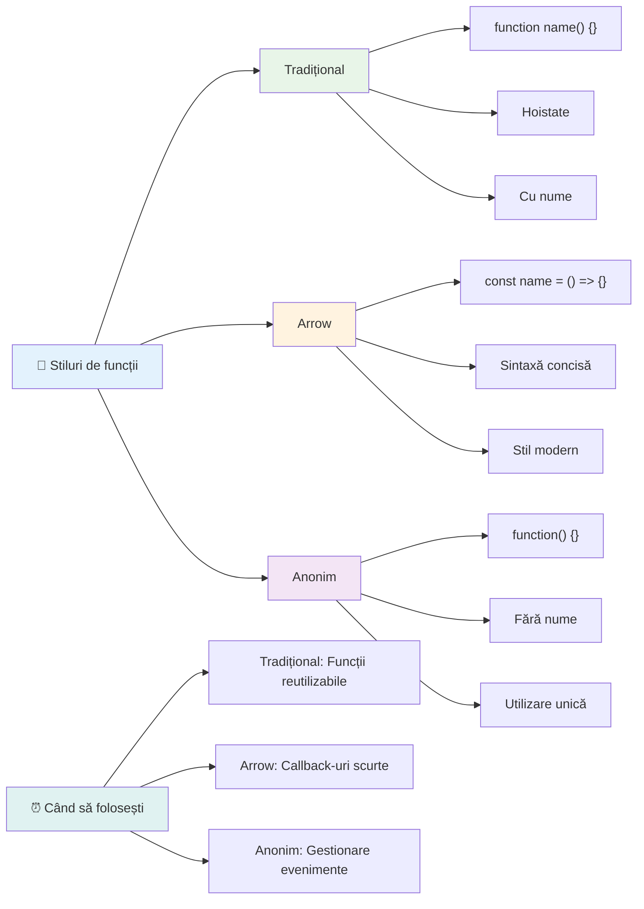
### Când să folosești fiecare strategie

Când ar trebui să folosești fiecare abordare? Un ghid practic: dacă vei folosi funcția de mai multe ori, dă-i un nume și definește-o separat. Dacă este pentru un scop specific o singură dată, consideră o funcție anonimă. Atât funcțiile săgeată, cât și cele tradiționale sunt abordări valide, deși funcțiile săgeată sunt predominante în codurile JavaScript moderne.

### 🎨 **Verificare Stăpânire Stiluri Funcții: Alegerea sintaxei corecte**

**Testează-ți înțelegerea sintaxei:**
- Când ai prefera funcțiile săgeată în locul sintaxei tradiționale?
- Care este avantajul principal al funcțiilor anonime?
- Poți găsi o situație în care o funcție denumită este mai bună decât una anonimă?

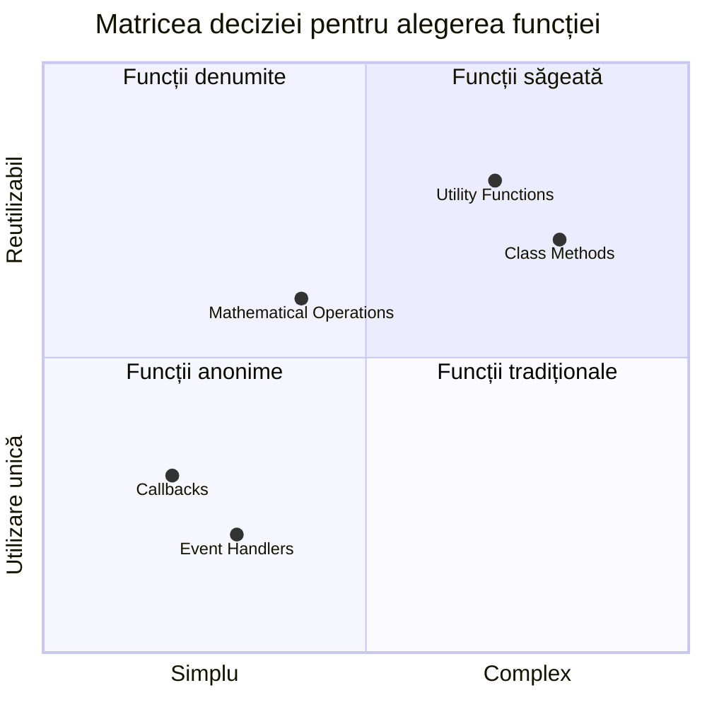
> **Tendință modernă**: Funcțiile săgeată devin alegerea implicită pentru mulți dezvoltatori datorită sintaxei lor concise, dar funcțiile tradiționale încă au rostul lor!

---


## 🚀 Provocare

Poți să exprimi într-o propoziție diferența dintre funcții și metode? Încearcă!

## Provocare Agent GitHub Copilot 🚀

Folosește modul Agent pentru a completa următoarea provocare:

**Descriere:** Creează o bibliotecă utilitară de funcții matematice care să demonstreze diferite concepte de funcții acoperite în această lecție, inclusiv parametri, valori implicite, valori returnate și funcții săgeată.

**Prompt:** Creează un fișier JavaScript numit `mathUtils.js` care să conțină următoarele funcții:
1. O funcție `add` care primește doi parametri și returnează suma lor
2. O funcție `multiply` cu valori implicite pentru parametri (al doilea parametru implicit 1)
3. O funcție săgeată `square` care primește un număr și returnează pătratul său
4. O funcție `calculate` care acceptă o altă funcție ca parametru și doi numere, apoi aplică funcția asupra acelor numere
5. Demonstrează apelarea fiecărei funcții cu cazuri de test adecvate

Află mai multe despre [modul agent](https://code.visualstudio.com/blogs/2025/02/24/introducing-copilot-agent-mode) aici.

## Test post-lectură
[Test post-lectură](https://ff-quizzes.netlify.app)

## Recapitulare & Studiu individual

Merită să [citești puțin mai mult despre funcțiile săgeată](https://developer.mozilla.org/docs/Web/JavaScript/Reference/Functions/Arrow_functions), deoarece acestea sunt tot mai folosite în codurile reale. Exersează scrierea unei funcții, apoi rescrierea acesteia folosind această sintaxă.

## Temă

[Distracție cu Funcții](assignment.md)

---

## 🧰 **Rezumatul trusei tale de funcții JavaScript**

```mermaid
graph TD
    A["🎯 Funcții JavaScript"] --> B["📋 Declarație Funcție"]
    A --> C["📥 Parametri"]
    A --> D["📤 Valori Returnate"]
    A --> E["🎨 Sintaxă Modernă"]
    
    B --> B1["function name() {}"]
    B --> B2["Nume descriptive"]
    B --> B3["Blocuri de cod reutilizabile"]
    
    C --> C1["Date de intrare"]
    C --> C2["Valori implicite"]
    C --> C3["Parametri multipli"]
    
    D --> D1["instrucțiunea return"]
    D --> D2["Ieșirea din funcție"]
    D --> D3["Transmiterea datelor înapoi"]
    
    E --> E1["Funcții săgeată: () =>"]
    E --> E2["Funcții anonime"]
    E --> E3["Funcții de ordin superior"]
    
    F["⚡ Beneficii Cheie"] --> F1["Reutilizarea codului"]
    F --> F2["Organizare mai bună"]
    F --> F3["Testare mai ușoară"]
    F --> F4["Design modular"]
    
    style A fill:#e3f2fd
    style B fill:#e8f5e8
    style C fill:#fff3e0
    style D fill:#f3e5f5
    style E fill:#e0f2f1
    style F fill:#fce4ec
```
---

## 🚀 Cronologia ta pentru stăpânirea funcțiilor JavaScript

### ⚡ **Ce poți face în următoarele 5 minute**
- [ ] Scrie o funcție simplă care returnează numărul tău favorit
- [ ] Creează o funcție cu doi parametri care îi adună împreună
- [ ] Încearcă să convertești o funcție tradițională în sintaxa funcției arrow
- [ ] Exersează provocarea: explică diferența dintre funcții și metode

### 🎯 **Ce poți realiza în această oră**
- [ ] Finalizează quiz-ul post-lecție și revizuiește orice concepte confuze
- [ ] Construiește biblioteca de utilitare matematice din provocarea GitHub Copilot
- [ ] Creează o funcție care folosește o altă funcție ca parametru
- [ ] Exersează scrierea funcțiilor cu parametri impliciți
- [ ] Experimentează cu template literals în valorile returnate de funcții

### 📅 **Stăpânirea funcțiilor pe durata unei săptămâni**
- [ ] Finalizează tema "Distracție cu funcții" cu creativitate
- [ ] Refactorizează un cod repetitiv pe care l-ai scris în funcții reutilizabile
- [ ] Construiește un mic calculator folosind doar funcții (fără variabile globale)
- [ ] Exersează funcțiile arrow cu metode de array precum `map()` și `filter()`
- [ ] Creează o colecție de funcții utilitare pentru sarcini comune
- [ ] Studiază funcțiile de ordin superior și conceptele programării funcționale

### 🌟 **Transformarea ta pe parcursul unei luni**
- [ ] Stăpânește concepte avansate ale funcțiilor precum closures și scope
- [ ] Construiește un proiect care folosește intens compoziția funcțiilor
- [ ] Contribuie la open source prin îmbunătățirea documentației funcțiilor
- [ ] Învăță pe altcineva despre funcții și stiluri diferite de sintaxă
- [ ] Explorează paradigmele programării funcționale în JavaScript
- [ ] Creează o bibliotecă personală de funcții reutilizabile pentru proiecte viitoare

### 🏆 **Controlul campionului final pentru funcții**

**Sărbătorește-ți stăpânirea funcțiilor:**
- Care este cea mai utilă funcție pe care ai creat-o până acum?
- Cum ți-a schimbat modul de a gândi despre organizarea codului învățarea despre funcții?
- Ce sintaxă a funcțiilor preferi și de ce?
- Ce problemă din lumea reală ai rezolva scriind o funcție?

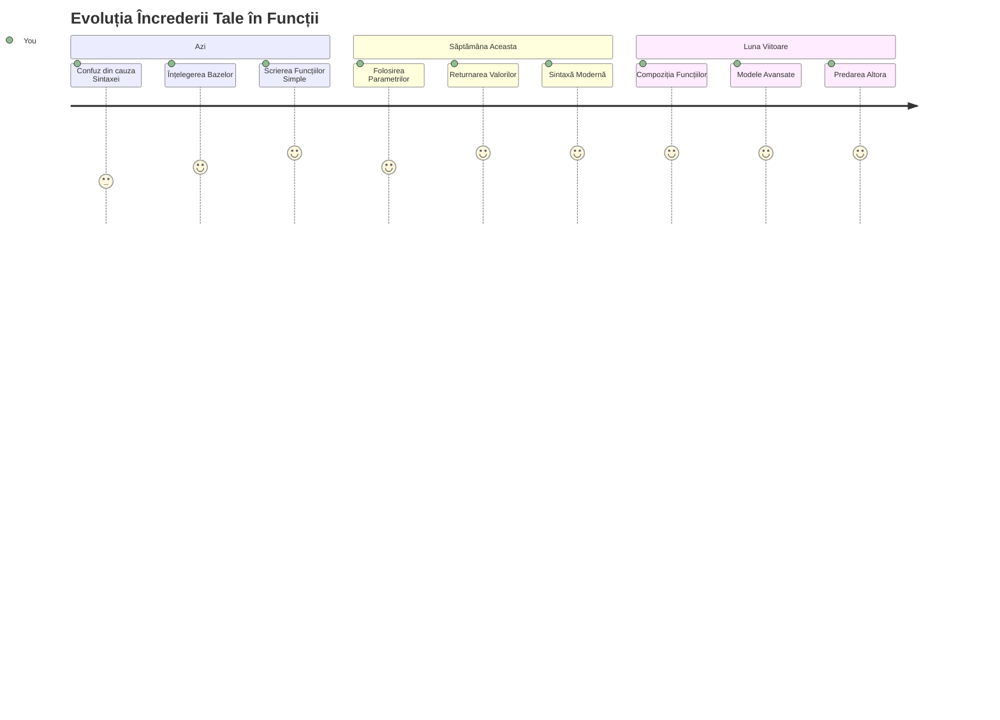
> 🎉 **Ai stăpânit unul dintre cele mai puternice concepte din programare!** Funcțiile sunt elementele de bază ale programelor mai mari. Fiecare aplicație pe care o vei crea va folosi funcții pentru a organiza, reutiliza și structura codul. Acum înțelegi cum să împachetezi logica în componente reutilizabile, făcându-te un programator mai eficient și mai productiv. Bine ai venit în lumea programării modulare! 🚀

---

<!-- CO-OP TRANSLATOR DISCLAIMER START -->
**Declinare de responsabilitate**:  
Acest document a fost tradus utilizând serviciul de traducere AI [Co-op Translator](https://github.com/Azure/co-op-translator). Deși ne străduim pentru acuratețe, vă rugăm să rețineți că traducerile automate pot conține erori sau inexactități. Documentul original, în limba sa nativă, trebuie considerat sursa autoritară. Pentru informații critice, se recomandă traducerea profesională realizată de un specialist uman. Nu ne asumăm răspunderea pentru orice neînțelegeri sau interpretări greșite rezultate din utilizarea acestei traduceri.
<!-- CO-OP TRANSLATOR DISCLAIMER END -->