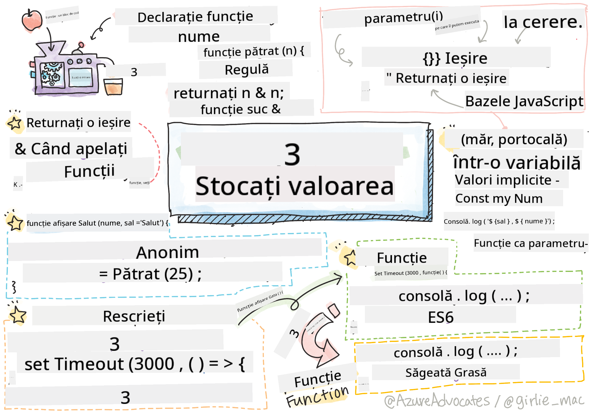

<!--
CO_OP_TRANSLATOR_METADATA:
{
  "original_hash": "92e136090efc4341b1d51c37924c1802",
  "translation_date": "2025-08-29T11:33:25+00:00",
  "source_file": "2-js-basics/2-functions-methods/README.md",
  "language_code": "ro"
}
-->
# Bazele JavaScript: Metode și Funcții


> Sketchnote de [Tomomi Imura](https://twitter.com/girlie_mac)

## Chestionar înainte de curs
[Chestionar înainte de curs](https://ff-quizzes.netlify.app)

Când ne gândim la scrierea codului, dorim întotdeauna să ne asigurăm că acesta este ușor de citit. Deși poate suna contraintuitiv, codul este citit de multe ori mai des decât este scris. Un instrument esențial în trusa unui dezvoltator pentru a asigura un cod ușor de întreținut este **funcția**.

[](https://youtube.com/watch?v=XgKsD6Zwvlc "Metode și Funcții")

> 🎥 Fă clic pe imaginea de mai sus pentru un videoclip despre metode și funcții.

> Poți parcurge această lecție pe [Microsoft Learn](https://docs.microsoft.com/learn/modules/web-development-101-functions/?WT.mc_id=academic-77807-sagibbon)!

## Funcții

În esență, o funcție este un bloc de cod pe care îl putem executa la cerere. Acest lucru este perfect pentru scenariile în care trebuie să efectuăm aceeași sarcină de mai multe ori; în loc să duplicăm logica în mai multe locuri (ceea ce ar face dificilă actualizarea ulterioară), o putem centraliza într-un singur loc și o putem apela ori de câte ori avem nevoie să efectuăm operația - poți chiar să apelezi funcții din alte funcții!

La fel de importantă este și abilitatea de a da un nume unei funcții. Deși poate părea banal, numele oferă o modalitate rapidă de a documenta o secțiune de cod. Poți să te gândești la aceasta ca la o etichetă pe un buton. Dacă fac clic pe un buton pe care scrie „Anulează temporizatorul”, știu că va opri ceasul.

## Crearea și apelarea unei funcții

Sintaxa pentru o funcție arată astfel:

```javascript
function nameOfFunction() { // function definition
 // function definition/body
}
```

Dacă aș dori să creez o funcție pentru a afișa un mesaj de salut, ar putea arăta astfel:

```javascript
function displayGreeting() {
  console.log('Hello, world!');
}
```

Ori de câte ori dorim să apelăm (sau să invocăm) funcția noastră, folosim numele funcției urmat de `()`. Merită menționat faptul că funcția noastră poate fi definită înainte sau după ce decidem să o apelăm; compilatorul JavaScript o va găsi pentru tine.

```javascript
// calling our function
displayGreeting();
```

> **NOTE:** Există un tip special de funcție cunoscut sub numele de **metodă**, pe care l-ai folosit deja! De fapt, am văzut acest lucru în demonstrația noastră de mai sus când am folosit `console.log`. Ceea ce face o metodă diferită de o funcție este faptul că o metodă este atașată unui obiect (`console` în exemplul nostru), în timp ce o funcție este independentă. Vei auzi mulți dezvoltatori folosind acești termeni interschimbabil.

### Cele mai bune practici pentru funcții

Există câteva bune practici de reținut atunci când creezi funcții:

- Ca întotdeauna, folosește nume descriptive pentru a ști ce va face funcția.
- Folosește **camelCasing** pentru a combina cuvintele.
- Păstrează funcțiile concentrate pe o sarcină specifică.

## Transmiterea informațiilor către o funcție

Pentru a face o funcție mai reutilizabilă, vei dori adesea să îi transmiți informații. Dacă luăm în considerare exemplul nostru `displayGreeting` de mai sus, acesta va afișa doar **Hello, world!**. Nu este cea mai utilă funcție pe care ai putea să o creezi. Dacă dorim să o facem puțin mai flexibilă, cum ar fi să permitem cuiva să specifice numele persoanei pe care o salutăm, putem adăuga un **parametru**. Un parametru (uneori numit și **argument**) este o informație suplimentară trimisă unei funcții.

Parametrii sunt listați în partea de definiție între paranteze și sunt separați prin virgulă astfel:

```javascript
function name(param, param2, param3) {

}
```

Putem actualiza funcția `displayGreeting` pentru a accepta un nume și a-l afișa.

```javascript
function displayGreeting(name) {
  const message = `Hello, ${name}!`;
  console.log(message);
}
```

Când dorim să apelăm funcția noastră și să transmitem parametrul, îl specificăm între paranteze.

```javascript
displayGreeting('Christopher');
// displays "Hello, Christopher!" when run
```

## Valori implicite

Putem face funcția noastră și mai flexibilă adăugând mai mulți parametri. Dar ce se întâmplă dacă nu dorim să fie necesar să specificăm fiecare valoare? Continuând cu exemplul nostru de salut, am putea lăsa numele ca fiind obligatoriu (trebuie să știm pe cine salutăm), dar dorim să permitem personalizarea salutului, dacă se dorește. Dacă cineva nu dorește să-l personalizeze, oferim o valoare implicită. Pentru a oferi o valoare implicită unui parametru, o setăm în același mod în care setăm o valoare pentru o variabilă - `parameterName = 'defaultValue'`. Pentru a vedea un exemplu complet:

```javascript
function displayGreeting(name, salutation='Hello') {
  console.log(`${salutation}, ${name}`);
}
```

Când apelăm funcția, putem decide dacă dorim să setăm o valoare pentru `salutation`.

```javascript
displayGreeting('Christopher');
// displays "Hello, Christopher"

displayGreeting('Christopher', 'Hi');
// displays "Hi, Christopher"
```

## Valori returnate

Până acum, funcția pe care am construit-o va afișa întotdeauna rezultatul în [consolă](https://developer.mozilla.org/docs/Web/API/console). Uneori, acest lucru poate fi exact ceea ce căutăm, mai ales când creăm funcții care vor apela alte servicii. Dar ce se întâmplă dacă vreau să creez o funcție ajutătoare pentru a efectua un calcul și să returnez valoarea astfel încât să o pot folosi în altă parte?

Putem face acest lucru folosind o **valoare returnată**. O valoare returnată este oferită de funcție și poate fi stocată într-o variabilă la fel cum am putea stoca o valoare literală, cum ar fi un șir sau un număr.

Dacă o funcție returnează ceva, atunci se folosește cuvântul cheie `return`. Cuvântul cheie `return` așteaptă o valoare sau o referință a ceea ce este returnat astfel:

```javascript
return myVariable;
```  

Am putea crea o funcție pentru a crea un mesaj de salut și a returna valoarea apelantului.

```javascript
function createGreetingMessage(name) {
  const message = `Hello, ${name}`;
  return message;
}
```

Când apelăm această funcție, vom stoca valoarea într-o variabilă. Acest lucru este foarte asemănător cu modul în care am seta o variabilă la o valoare statică (cum ar fi `const name = 'Christopher'`).

```javascript
const greetingMessage = createGreetingMessage('Christopher');
```

## Funcții ca parametri pentru alte funcții

Pe măsură ce avansezi în cariera ta de programator, vei întâlni funcții care acceptă alte funcții ca parametri. Acest truc util este folosit frecvent atunci când nu știm când ceva se va întâmpla sau se va finaliza, dar știm că trebuie să efectuăm o operație ca răspuns.

De exemplu, consideră [setTimeout](https://developer.mozilla.org/docs/Web/API/WindowOrWorkerGlobalScope/setTimeout), care pornește un temporizator și va executa codul când acesta se finalizează. Trebuie să îi spunem ce cod dorim să executăm. Sună ca o sarcină perfectă pentru o funcție!

Dacă rulezi codul de mai jos, după 3 secunde vei vedea mesajul **3 seconds has elapsed**.

```javascript
function displayDone() {
  console.log('3 seconds has elapsed');
}
// timer value is in milliseconds
setTimeout(displayDone, 3000);
```

### Funcții anonime

Să analizăm din nou ce am construit. Creăm o funcție cu un nume care va fi folosit o singură dată. Pe măsură ce aplicația noastră devine mai complexă, ne putem imagina că vom crea multe funcții care vor fi apelate doar o dată. Acest lucru nu este ideal. După cum se dovedește, nu trebuie întotdeauna să oferim un nume!

Când transmitem o funcție ca parametru, putem evita să o creăm în avans și, în schimb, să o construim ca parte a parametrului. Folosim același cuvânt cheie `function`, dar o construim direct ca parametru.

Să rescriem codul de mai sus pentru a folosi o funcție anonimă:

```javascript
setTimeout(function() {
  console.log('3 seconds has elapsed');
}, 3000);
```

Dacă rulezi noul nostru cod, vei observa că obținem aceleași rezultate. Am creat o funcție, dar nu a trebuit să îi dăm un nume!

### Funcții săgeată (Fat arrow functions)

Un scurtcircuit comun în multe limbaje de programare (inclusiv JavaScript) este abilitatea de a folosi ceea ce se numește o funcție **săgeată** sau **fat arrow**. Aceasta folosește un indicator special `=>`, care arată ca o săgeată - de aici și numele! Prin utilizarea `=>`, putem sărim peste cuvântul cheie `function`.

Să rescriem codul nostru încă o dată pentru a folosi o funcție săgeată:

```javascript
setTimeout(() => {
  console.log('3 seconds has elapsed');
}, 3000);
```

### Când să folosești fiecare strategie

Acum ai văzut că avem trei moduri de a transmite o funcție ca parametru și te-ai putea întreba când să folosești fiecare. Dacă știi că vei folosi funcția de mai multe ori, creeaz-o în mod normal. Dacă o vei folosi doar într-o singură locație, în general este mai bine să folosești o funcție anonimă. Dacă folosești o funcție săgeată sau sintaxa mai tradițională `function` depinde de tine, dar vei observa că majoritatea dezvoltatorilor moderni preferă `=>`.

---

## 🚀 Provocare

Poți explica într-o singură propoziție diferența dintre funcții și metode? Încearcă!

## Chestionar după curs
[Chestionar după curs](https://ff-quizzes.netlify.app)

## Recapitulare și Studiu Individual

Merită să [citești mai multe despre funcțiile săgeată](https://developer.mozilla.org/docs/Web/JavaScript/Reference/Functions/Arrow_functions), deoarece sunt din ce în ce mai utilizate în codurile existente. Exersează scrierea unei funcții, apoi rescrierea acesteia folosind această sintaxă.

## Temă

[Distracție cu Funcții](assignment.md)

---

**Declinarea responsabilității**:  
Acest document a fost tradus folosind serviciul de traducere AI [Co-op Translator](https://github.com/Azure/co-op-translator). Deși depunem eforturi pentru a asigura acuratețea, vă rugăm să rețineți că traducerile automate pot conține erori sau inexactități. Documentul original în limba sa nativă ar trebui considerat sursa autoritară. Pentru informații critice, se recomandă traducerea profesională realizată de un specialist uman. Nu ne asumăm răspunderea pentru eventualele neînțelegeri sau interpretări greșite care pot apărea din utilizarea acestei traduceri.