# Bazele JavaScript: Luarea Deciziilor

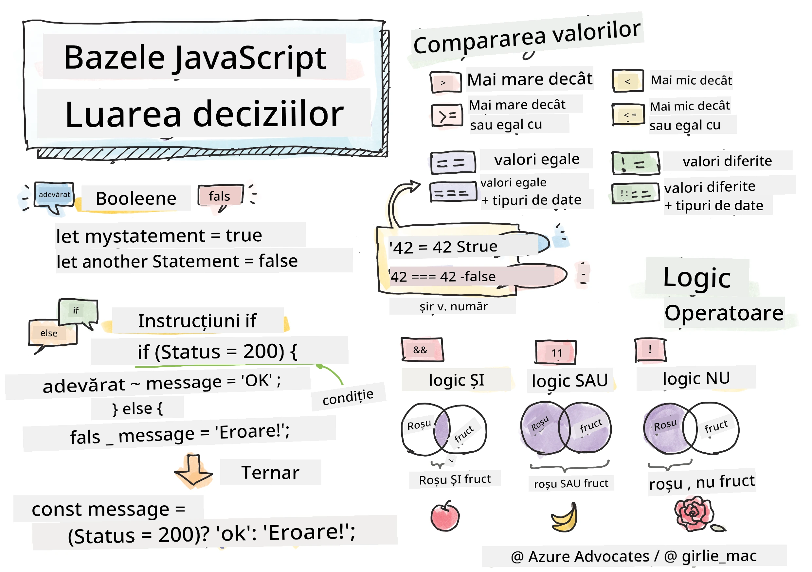

> Sketchnote de [Tomomi Imura](https://twitter.com/girlie_mac)

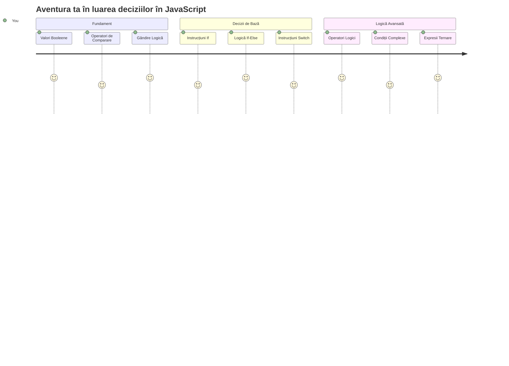
Te-ai întrebat vreodată cum iau aplicațiile decizii inteligente? Cum alege un sistem de navigație cea mai rapidă rută sau cum decide un termostat când să pornească căldura? Acesta este conceptul fundamental al luării deciziilor în programare.

Așa cum Motorul Analitic al lui Charles Babbage a fost proiectat să urmeze diferite secvențe de operații în funcție de condiții, programele moderne JavaScript trebuie să ia alegeri bazate pe circumstanțe variate. Această abilitate de a ramifica și lua decizii este ceea ce transformă codul static în aplicații inteligente și responsive.

În această lecție vei învăța cum să implementezi logica condițională în programele tale. Vom explora instrucțiunile condiționale, operatorii de comparație și expresiile logice care permit codului tău să evalueze situațiile și să răspundă corespunzător.

## Chestionar pre-lectură

[Pre-lecture quiz](https://ff-quizzes.netlify.app/web/quiz/11)

Abilitatea de a lua decizii și controlul fluxului programului sunt aspecte fundamentale ale programării. Această secțiune acoperă modul de control al traseului de execuție al programelor tale JavaScript folosind valori Booleene și logica condițională.

[](https://youtube.com/watch?v=SxTp8j-fMMY "Making Decisions")

> 🎥 Dă clic pe imaginea de mai sus pentru un video despre luarea deciziilor.

> Poți urma această lecție pe [Microsoft Learn](https://docs.microsoft.com/learn/modules/web-development-101-if-else/?WT.mc_id=academic-77807-sagibbon)!

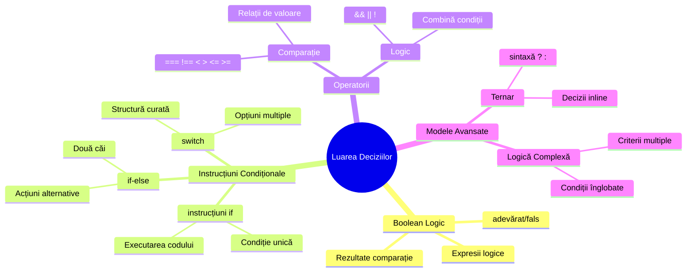
## O scurtă recapitulare despre Booleeni

Înainte de a explora luarea deciziilor, să revedem valorile Booleene din lecția noastră anterioară. Denumite după matematicianul George Boole, aceste valori reprezintă stări binare – fie `true` sau `false`. Nu există ambiguitate, nici jumătate de măsură.

Aceste valori binare formează baza întregii logici computaționale. Fiecare decizie pe care o ia programul tău reduce în final la o evaluare Booleană.

Crearea variabilelor Booleene este simplă:

```javascript
let myTrueBool = true;
let myFalseBool = false;
```

Aceasta creează două variabile cu valori Booleene explicite.

✅ Booleenii poartă numele matematicianului, filosofului și logicianului englez George Boole (1815–1864).

## Operatori de comparație și Booleeni

În practică, rareori vei seta manual valorile Booleene. În schimb, le vei genera evaluând condiții: „Este acest număr mai mare decât acela?” sau „Sunt aceste valori egale?”

Operatorii de comparație permit aceste evaluări. Ei compară valorile și întorc rezultate Booleene pe baza relației dintre operanzi.

| Simbol | Descriere                                                                                                           | Exemplu            |
| ------ | ------------------------------------------------------------------------------------------------------------------ | ------------------ |
| `<`    | **Mai mic decât**: Compară două valori și returnează `true` dacă valoarea din partea stângă este mai mică decât cea din dreapta               | `5 < 6 // true`    |
| `<=`   | **Mai mic sau egal cu**: Compară două valori și returnează `true` dacă valoarea din stânga este mai mică sau egală cu cea din dreapta            | `5 <= 6 // true`   |
| `>`    | **Mai mare decât**: Compară două valori și returnează `true` dacă valoarea din stânga este mai mare decât cea din dreapta                          | `5 > 6 // false`   |
| `>=`   | **Mai mare sau egal cu**: Compară două valori și returnează `true` dacă valoarea din stânga este mai mare sau egală cu cea din dreapta             | `5 >= 6 // false`  |
| `===`  | **Egalitate strictă**: Compară două valori și returnează `true` dacă valorile din stânga și dreapta sunt egale ȘI de același tip de date           | `5 === 6 // false` |
| `!==`  | **Inegaliate**: Compară două valori și returnează valoarea Boolean inversă a ceea ce ar întoarce operatorul de egalitate strictă                  | `5 !== 6 // true`  |

✅ Verifică-ți cunoștințele scriind câteva comparații în consola browserului tău. Te surprinde vreun rezultat obținut?

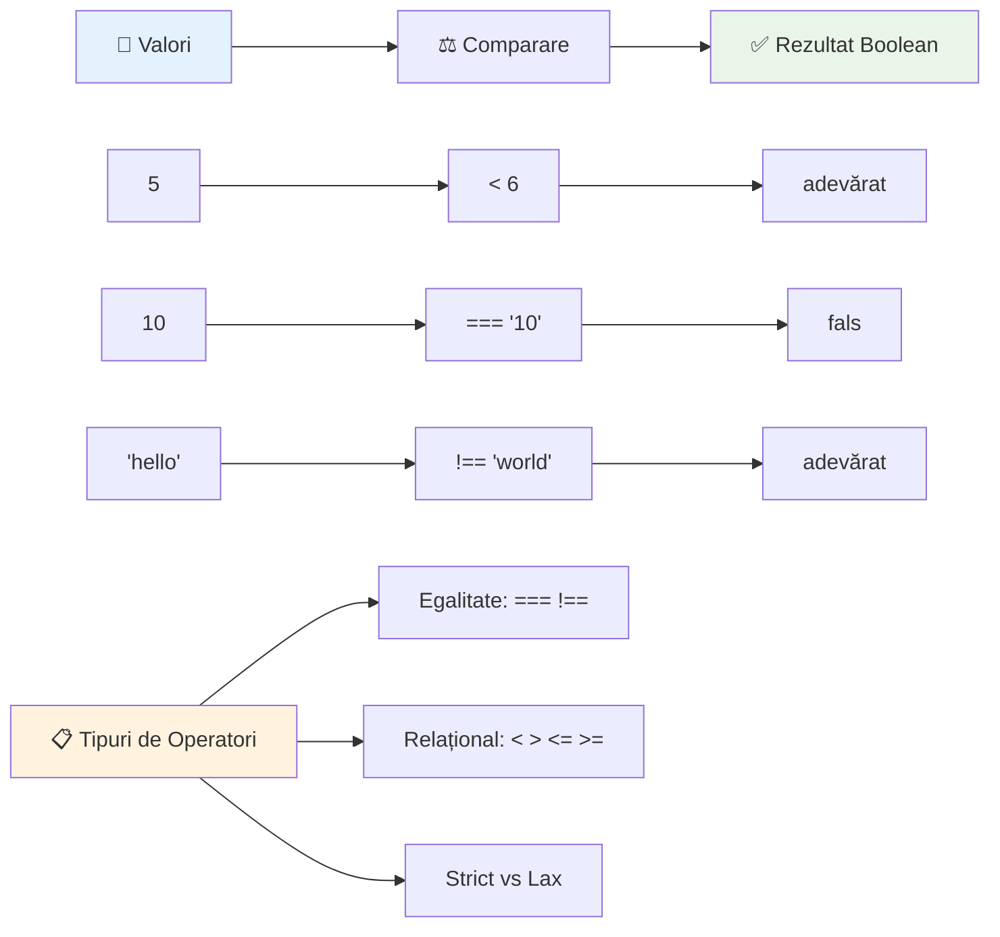
### 🧠 **Test de stăpânire a comparațiilor: Înțelegerea logicii Booleene**

**Testează-ți înțelegerea comparațiilor:**
- De ce crezi că `===` (egalitatea strictă) este în general preferat față de `==` (egalitatea laxă)?
- Poți prezice ce întoarce `5 === '5'`? Dar `5 == '5'`?
- Care este diferența dintre `!==` și `!=`?

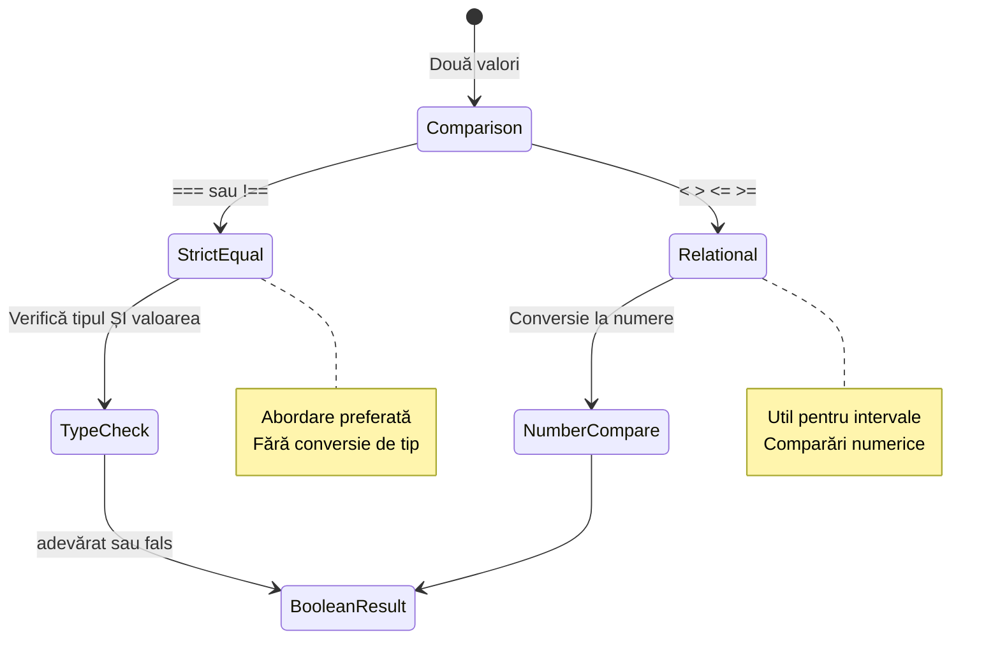
> **Sfat profesionist**: Folosește întotdeauna `===` și `!==` pentru verificările de egalitate, cu excepția cazului când ai nevoie explicită de conversie de tip. Acest lucru previne comportamentul neașteptat!

## Instrucțiunea If

Instrucțiunea `if` este ca o întrebare în codul tău. „Dacă această condiție este adevărată, atunci fă acest lucru.” Probabil că este cel mai important instrument pe care îl vei folosi pentru a lua decizii în JavaScript.

Iată cum funcționează:

```javascript
if (condition) {
  // Condiția este adevărată. Codul din acest bloc va rula.
}
```

Condiția se plasează între paranteze, iar dacă este `true`, JavaScript rulează codul din acolade. Dacă este `false`, JavaScript pur și simplu sare peste acel bloc.

De multe ori vei folosi operatori de comparație pentru a crea aceste condiții. Hai să vedem un exemplu practic:

```javascript
let currentMoney = 1000;
let laptopPrice = 800;

if (currentMoney >= laptopPrice) {
  // Condiția este adevărată. Codul din acest bloc va fi executat.
  console.log("Getting a new laptop!");
}
```

Deoarece `1000 >= 800` evaluează la `true`, codul din bloc se execută, afișând în consolă „Getting a new laptop!”.

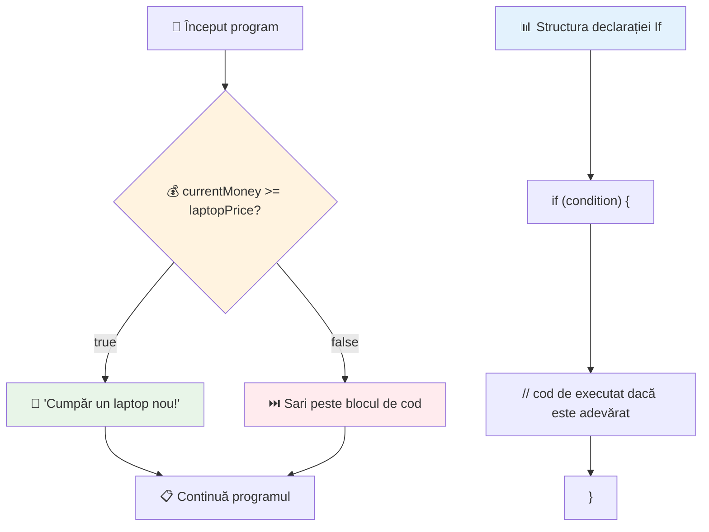
## Instrucțiunea If..Else

Dar ce faci dacă vrei ca programul tău să facă ceva diferit când condiția este falsă? Aici intervine `else` – este ca un plan de rezervă.

Instrucțiunea `else` îți oferă o modalitate de a spune „dacă această condiție nu este adevărată, fă acest alt lucru în schimb.”

```javascript
let currentMoney = 500;
let laptopPrice = 800;

if (currentMoney >= laptopPrice) {
  // Condiția este adevărată. Codul din acest bloc va rula.
  console.log("Getting a new laptop!");
} else {
  // Condiția este falsă. Codul din acest bloc va rula.
  console.log("Can't afford a new laptop, yet!");
}
```

Acum, deoarece `500 >= 800` este `false`, JavaScript sare peste primul bloc și rulează blocul `else`. Vei vedea în consolă mesajul „Can't afford a new laptop, yet!”.

✅ Testează înțelegerea acestei bucăți de cod și a celei următoare rulând-o în consola browserului. Modifică valorile variabilelor currentMoney și laptopPrice pentru a schimba mesajul returnat de `console.log()`.

### 🎯 **Test de logică If-Else: Ramificații**

**Evaluează-ți înțelegerea logicii condiționale:**
- Ce se întâmplă dacă `currentMoney` este exact egal cu `laptopPrice`?
- Poți să te gândești la un scenariu real în care logica if-else ar fi utilă?
- Cum ai putea extinde această logică pentru a gestiona mai multe intervale de preț?

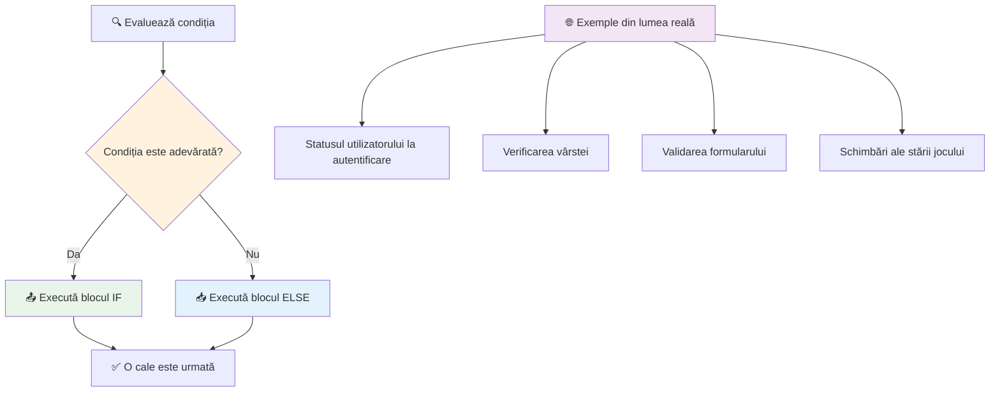
> **Insight cheie**: If-else garantează că se ia exact o cale. Astfel, programul tău are întotdeauna un răspuns la orice condiție!

## Instrucțiunea Switch

Uneori trebuie să compari o valoare cu mai multe opțiuni. Deși ai putea lega mai multe instrucțiuni `if..else`, această abordare devine greu de gestionat. Instrucțiunea `switch` oferă o structură mai curată pentru a gestiona mai multe valori discrete.

Conceptul seamănă cu sistemele mecanice de comutare folosite în primele centrale telefonice – o valoare de intrare decide calea specifică pe care o urmează execuția.

```javascript
switch (expression) {
  case x:
    // bloc de cod
    break;
  case y:
    // bloc de cod
    break;
  default:
    // bloc de cod
}
```

Iată cum este structurat:
- JavaScript evaluează expresia o singură dată
- Caută fiecare `case` pentru o potrivire
- Când găsește o potrivire, execută acel bloc de cod
- `break` îi spune lui JavaScript să oprească căutarea și să iasă din switch
- Dacă niciun caz nu se potrivește, execută blocul `default` (dacă există)

```javascript
// Program care utilizează instrucțiunea switch pentru ziua săptămânii
let dayNumber = 2;
let dayName;

switch (dayNumber) {
  case 1:
    dayName = "Monday";
    break;
  case 2:
    dayName = "Tuesday";
    break;
  case 3:
    dayName = "Wednesday";
    break;
  default:
    dayName = "Unknown day";
    break;
}
console.log(`Today is ${dayName}`);
```

În acest exemplu, JavaScript vede că `dayNumber` este `2`, găsește `case 2` corespunzător, setează `dayName` la „Tuesday” și apoi iese din switch. Rezultatul? „Today is Tuesday” este afișat în consolă.

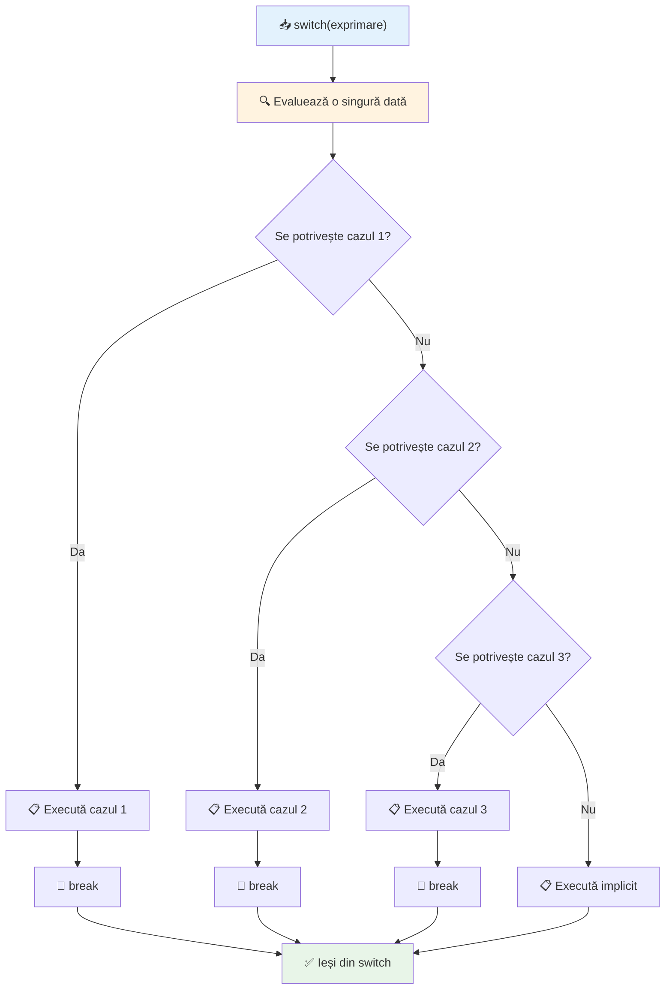
✅ Testează-ți înțelegerea acestui cod și a următorului rulându-l în consola browserului. Modifică valoarea variabilei a pentru a schimba mesajul returnat de `console.log()`.

### 🔄 **Test de stăpânire a instrucțiunii Switch: Multiple opțiuni**

**Testează-ți înțelegerea switch-ului:**
- Ce se întâmplă dacă uiți un `break`?
- Când ai folosi `switch` în loc de mai multe instrucțiuni if-else?
- De ce este util cazul `default` chiar dacă crezi că ai acoperit toate posibilitățile?

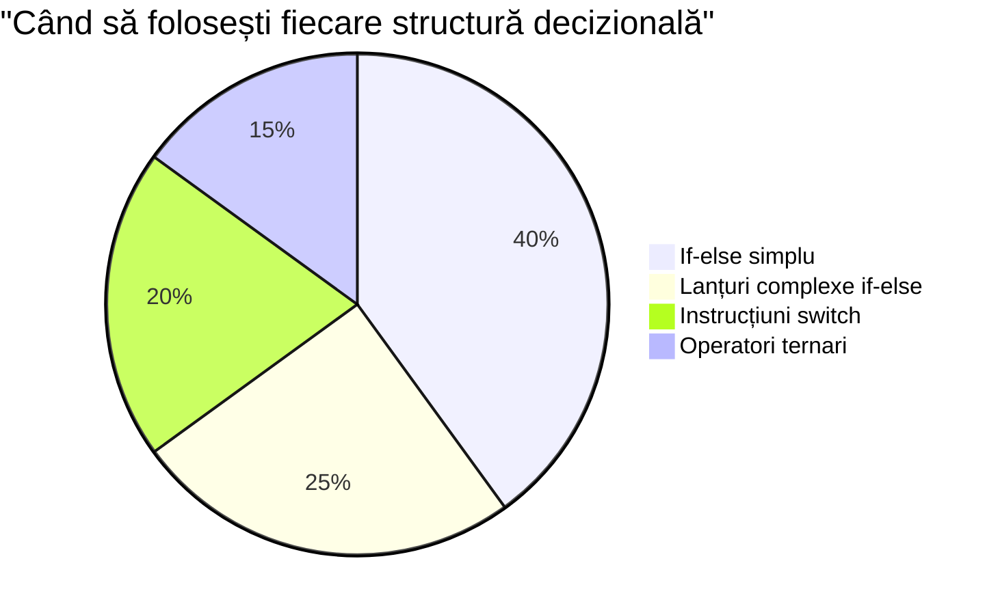
> **Cel mai bun sfat**: Folosește `switch` când compari o variabilă cu mai multe valori specifice. Folosește `if-else` pentru verificarea de intervale sau condiții complexe!

## Operatorii Logici și Booleenii

Deciziile complexe necesită adesea evaluarea mai multor condiții simultan. Așa cum algebra Booleană permite matematicienilor să combine expresii logice, programarea oferă operatori logici pentru a conecta mai multe condiții Booleene.

Acești operatori permit logică condițională sofisticată prin combinarea unor evaluări simple adevărat/fals.

| Simbol | Descriere                                                                                                   | Exemplu                                                                   |
| ------ | ----------------------------------------------------------------------------------------------------------- | ------------------------------------------------------------------------- |
| `&&`   | **AND logic**: Compară două expresii Booleene. Returnează true **doar** dacă ambele părți sunt adevărate    | `(5 > 3) && (5 < 10) // Ambele părți sunt adevărate. Returnează true`     |
| `\|\|` | **OR logic**: Compară două expresii Booleene. Returnează true dacă cel puțin o parte este adevărată          | `(5 > 10) \|\| (5 < 10) // O parte este falsă, cealaltă adevărată. Returnează true` |
| `!`    | **NOT logic**: Returnează valoarea opusă a unei expresii Booleene                                            | `!(5 > 10) // 5 nu este mai mare decât 10, deci "!" îl face adevărat`     |

Acești operatori îți permit să combini condiții în moduri utile:
- AND (`&&`) înseamnă că ambele condiții trebuie să fie adevărate
- OR (`||`) înseamnă că cel puțin o condiție trebuie să fie adevărată  
- NOT (`!`) inversează true în false (și invers)

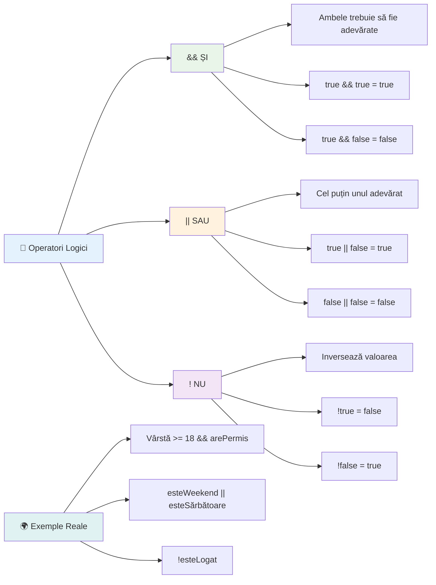
## Condiții și Decizii cu Operatorii Logici

Hai să vedem acești operatori logici în acțiune cu un exemplu mai realist:

```javascript
let currentMoney = 600;
let laptopPrice = 800;
let laptopDiscountPrice = laptopPrice - (laptopPrice * 0.2); // Prețul laptopului cu 20% reducere

if (currentMoney >= laptopPrice || currentMoney >= laptopDiscountPrice) {
  // Condiția este adevărată. Codul din acest bloc va rula.
  console.log("Getting a new laptop!");
} else {
  // Condiția este falsă. Codul din acest bloc va rula.
  console.log("Can't afford a new laptop, yet!");
}
```

În acest exemplu: calculăm un preț cu reducere de 20% (640), apoi evaluăm dacă fondurile noastre disponibile acoperă fie prețul întreg SAU prețul redus. Deoarece 600 este sub pragul prețului redus de 640, condiția evaluează la false.

### 🧮 **Test Operatorii Logici: Combinarea condițiilor**

**Testează-ți înțelegerea operatorilor logici:**
- În expresia `A && B`, ce se întâmplă dacă A este fals? Se evaluează oare B?
- Te poți gândi la o situație în care ai avea nevoie de toți trei operatorii (&&, ||, !) simultan?
- Care este diferența dintre `!user.isActive` și `user.isActive !== true`?

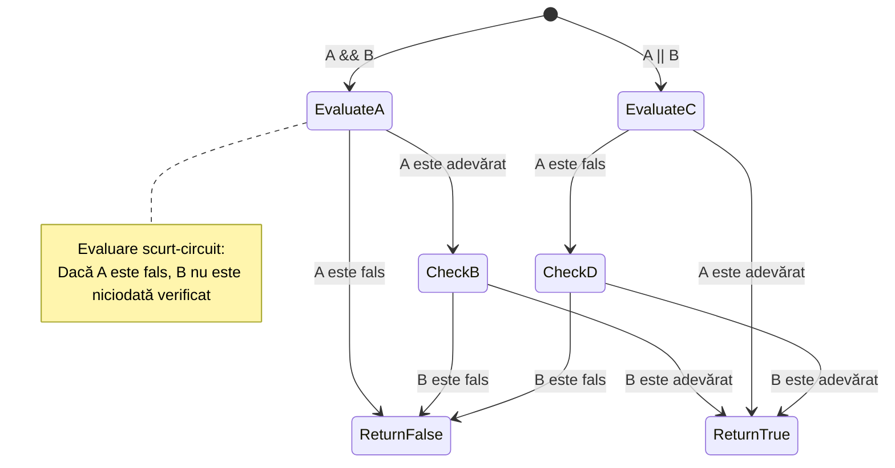
> **Sfat de performanță**: JavaScript folosește „evaluare cu scurtcircuit” - în `A && B`, dacă A e fals, B nici măcar nu se evaluează. Folosește asta în avantajul tău!

### Operatorul de Negare

Uneori este mai ușor să gândești când ceva NU este adevărat. De exemplu, în loc să întrebi „Este utilizatorul autentificat?”, poți întreba „Nu este utilizatorul autentificat?” Operatorul semnului exclamării (`!`) inversează logica pentru tine.

```javascript
if (!condition) {
  // rulează dacă condiția este falsă
} else {
  // rulează dacă condiția este adevărată
}
```

Operatorul `!` este ca și cum ai spune „opusul lui...” – dacă ceva este `true`, `!` îl face `false`, și invers.

### Expresii Ternare

Pentru atribuiri condiționale simple, JavaScript oferă operatorul **ternar**. Această sintaxă concisă îți permite să scrii o expresie condițională într-o singură linie, utilă atunci când trebuie să atribui una din două valori bazat pe o condiție.

```javascript
let variable = condition ? returnThisIfTrue : returnThisIfFalse;
```

Se citește ca o întrebare: „Este această condiție adevărată? Dacă da, folosește această valoare. Dacă nu, folosește cealaltă valoare.”

Mai jos este un exemplu mai concret:

```javascript
let firstNumber = 20;
let secondNumber = 10;
let biggestNumber = firstNumber > secondNumber ? firstNumber : secondNumber;
```

✅ Ia-ți un moment să citești acest cod de câteva ori. Înțelegi cum funcționează acești operatori?

Linia spune: „Este `firstNumber` mai mare decât `secondNumber`? Dacă da, pune `firstNumber` în `biggestNumber`. Dacă nu, pune `secondNumber` în `biggestNumber`.”

Operatorul ternar este doar o modalitate mai scurtă de a scrie această instrucțiune tradițională `if..else`:

```javascript
let biggestNumber;
if (firstNumber > secondNumber) {
  biggestNumber = firstNumber;
} else {
  biggestNumber = secondNumber;
}
```

Ambele metode produc rezultate identice. Operatorul ternar oferă concizie, pe când structura tradițională if-else poate fi mai ușor de citit pentru condiții complexe.

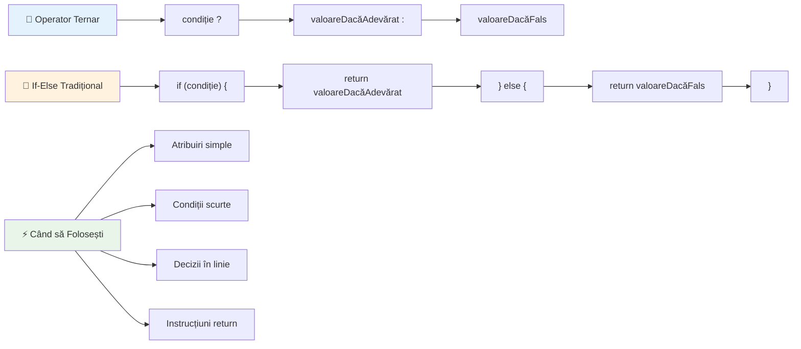
---


## 🚀 Provocare

Creează un program scris mai întâi cu operatori logici, apoi rescrie-l folosind expresia ternară. Care sintaxă o preferi?

---

## Provocare GitHub Copilot Agent 🚀

Folosește modul Agent pentru a finaliza următoarea provocare:

**Descriere:** Creează un calculator complet de note care demonstrează mai multe concepte de luare a deciziilor din această lecție, inclusiv instrucțiuni if-else, switch, operatori logici și expresii ternare.

**Prompt:** Scrie un program JavaScript care primește nota numerică a unui student (0-100) și determină nota literară conform criteriilor:
- A: 90-100
- B: 80-89  
- C: 70-79
- D: 60-69
- F: sub 60

Cerințe:
1. Folosește o instrucțiune if-else pentru a determina nota literară
2. Folosește operatori logici pentru a verifica dacă studentul trece (nota >= 60) ȘI are onoruri (nota >= 90)  
3. Folosește o declarație switch pentru a oferi feedback specific pentru fiecare literă de notă  
4. Folosește un operator ternar pentru a determina dacă studentul este eligibil pentru cursul următor (nota >= 70)  
5. Include validarea intrării pentru a te asigura că scorul este între 0 și 100  

Testează programul cu diverse scoruri, inclusiv cazuri limită precum 59, 60, 89, 90 și intrări invalide.  

Află mai multe despre [agent mode](https://code.visualstudio.com/blogs/2025/02/24/introducing-copilot-agent-mode) aici.  


## Post-Lecture Quiz

[Post-lecture quiz](https://ff-quizzes.netlify.app/web/quiz/12)

## Review & Self Study

Citește mai multe despre numeroșii operatori disponibili utilizatorului [pe MDN](https://developer.mozilla.org/docs/Web/JavaScript/Reference/Operators).  

Parcurge minunatul [operator lookup](https://joshwcomeau.com/operator-lookup/) al lui Josh Comeau!  

## Assignment

[Operators](assignment.md)

---

## 🧠 **Sumarul trusei tale de instrumente pentru luarea deciziilor**

```mermaid
graph TD
    A["🎯 Decizii JavaScript"] --> B["🔍 Logica Booleană"]
    A --> C["📊 Instrucțiuni Condiționale"]
    A --> D["🔗 Operatorii Logici"]
    A --> E["⚡ Tipare Avansate"]
    
    B --> B1["valori true/false"]
    B --> B2["Operatori de comparație"]
    B --> B3["Concepte de adevăr"]
    
    C --> C1["instrucțiuni if"]
    C --> C2["lanțuri if-else"]
    C --> C3["instrucțiuni switch"]
    
    D --> D1["&& (ȘI)"]
    D --> D2["|| (SAU)"]
    D --> D3["! (NU)"]
    
    E --> E1["Operator terțiar"]
    E --> E2["Evaluare scurtcircuit"]
    E --> E3["Condiții complexe"]
    
    F["💡 Principii Cheie"] --> F1["Condiții clare și lizibile"]
    F --> F2["Stil consistent de comparare"]
    F --> F3["Precedența corectă a operatorilor"]
    F --> F4["Ordine eficientă de evaluare"]
    
    style A fill:#e3f2fd
    style B fill:#e8f5e8
    style C fill:#fff3e0
    style D fill:#f3e5f5
    style E fill:#e0f2f1
    style F fill:#fce4ec
```
---

## 🚀 Cronologia stăpânirii tale în luarea deciziilor cu JavaScript

### ⚡ **Ce poți face în următoarele 5 minute**
- [ ] Exersează operatorii de comparație în consola browserului tău  
- [ ] Scrie o simplă declarație if-else care verifică vârsta ta  
- [ ] Încearcă provocarea: rescrie un if-else folosind un operator ternar  
- [ ] Testează ce se întâmplă cu diferite valori „truthy” și „falsy”  

### 🎯 **Ce poți realiza în această oră**
- [ ] Completează testul post-lecție și revizuiește orice concepte confuze  
- [ ] Construiește calculatorul cuprinzător de note din provocarea GitHub Copilot  
- [ ] Creează un arbore decizional simplu pentru un scenariu real (ex: alegerea hainelor)  
- [ ] Exersează combinarea mai multor condiții cu operatori logici  
- [ ] Experimentează cu declarații switch pentru diverse cazuri de utilizare  

### 📅 **Stăpânirea logicii pe o săptămână**
- [ ] Completează tema despre operatori cu exemple creative  
- [ ] Construiește o aplicație mini quiz folosind structuri condiționale variate  
- [ ] Creează un validator de formulare care verifică multiple condiții de intrare  
- [ ] Exersează exercițiile lui Josh Comeau din [operator lookup](https://joshwcomeau.com/operator-lookup/)  
- [ ] Refactorizează codul existent pentru a folosi structuri condiționale mai potrivite  
- [ ] Studiază evaluarea short-circuit și implicațiile de performanță  

### 🌟 **Transformarea ta pe o lună**
- [ ] Stăpânește condițiile complexe imbricate și menține lizibilitatea codului  
- [ ] Construiește o aplicație cu logică de luare a deciziilor sofisticată  
- [ ] Contribuie la open source îmbunătățind logica condițională din proiecte existente  
- [ ] Învăță pe altcineva despre diferitele structuri condiționale și când să le folosească  
- [ ] Explorează abordări de programare funcțională pentru logica condițională  
- [ ] Creează un ghid personal de referință pentru cele mai bune practici condiționale  

### 🏆 **Verificarea campionului final în luarea deciziilor**

**Sărbătorește-ți măiestria în gândirea logică:**  
- Care este cea mai complexă logică decizională pe care ai implementat-o cu succes?  
- Care structură condițională ți se pare cea mai naturală și de ce?  
- Cum ți-a schimbat învățarea despre operatorii logici abordarea în rezolvarea problemelor?  
- Ce aplicație din viața reală ar beneficia de o logică decizională sofisticată?  

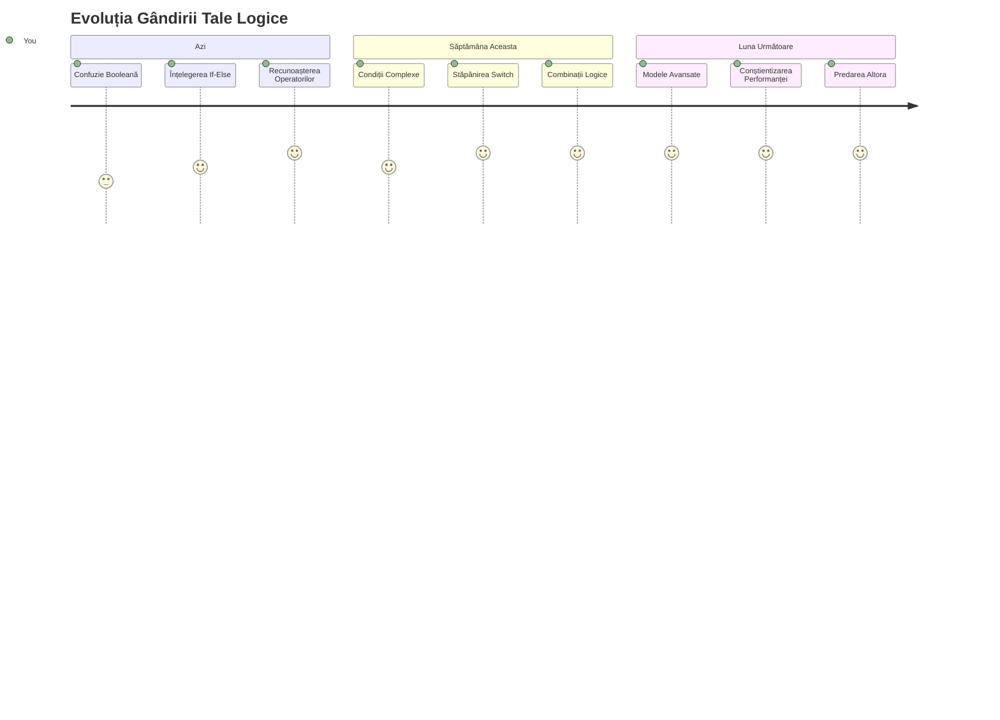
> 🧠 **Ai stăpânit arta luării deciziilor digitale!** Fiecare aplicație interactivă se bazează pe logica condițională pentru a răspunde inteligent la acțiunile utilizatorului și la condiții schimbătoare. Acum înțelegi cum să faci ca programele tale să gândească, să evalueze și să aleagă răspunsurile potrivite. Această fundație logică va alimenta fiecare aplicație dinamică pe care o construiești! 🎉

---

<!-- CO-OP TRANSLATOR DISCLAIMER START -->
**Declinare a responsabilității**:  
Acest document a fost tradus folosind serviciul de traducere AI [Co-op Translator](https://github.com/Azure/co-op-translator). Deși ne străduim pentru acuratețe, vă rugăm să rețineți că traducerile automate pot conține erori sau inexactități. Documentul original, în limba sa nativă, trebuie considerat sursa autorizată. Pentru informații critice, se recomandă traducerea profesională realizată de un specialist uman. Nu ne asumăm răspunderea pentru eventuale neînțelegeri sau interpretări greșite rezultate din utilizarea acestei traduceri.
<!-- CO-OP TRANSLATOR DISCLAIMER END -->