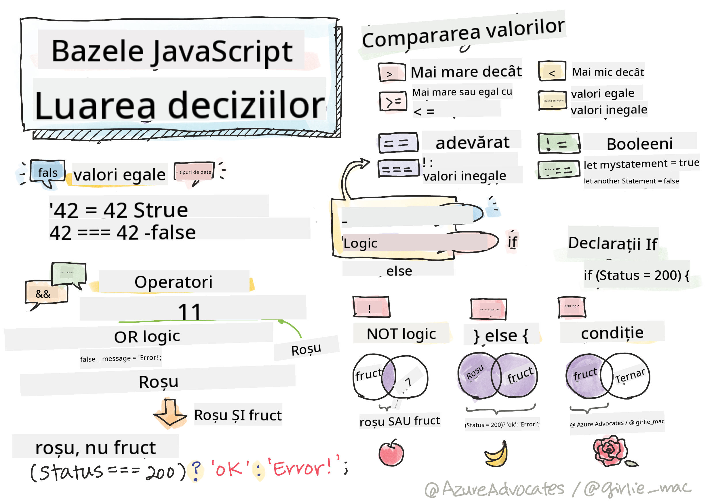

<!--
CO_OP_TRANSLATOR_METADATA:
{
  "original_hash": "888609c48329c280ca2477d2df40f2e5",
  "translation_date": "2025-08-27T22:07:01+00:00",
  "source_file": "2-js-basics/3-making-decisions/README.md",
  "language_code": "ro"
}
-->
# Elementele de bază ale JavaScript: Luarea deciziilor



> Sketchnote de [Tomomi Imura](https://twitter.com/girlie_mac)

## Test înainte de lecție

[Test înainte de lecție](https://ashy-river-0debb7803.1.azurestaticapps.net/quiz/11)

Luarea deciziilor și controlul ordinii în care rulează codul tău fac ca acesta să fie reutilizabil și robust. Această secțiune acoperă sintaxa pentru controlul fluxului de date în JavaScript și semnificația sa atunci când este utilizată cu tipurile de date Boolean.

[](https://youtube.com/watch?v=SxTp8j-fMMY "Luarea deciziilor")

> 🎥 Fă clic pe imaginea de mai sus pentru un videoclip despre luarea deciziilor.

> Poți parcurge această lecție pe [Microsoft Learn](https://docs.microsoft.com/learn/modules/web-development-101-if-else/?WT.mc_id=academic-77807-sagibbon)!

## O recapitulare rapidă despre Booleans

Booleans pot avea doar două valori: `true` sau `false`. Booleans ajută la luarea deciziilor despre ce linii de cod ar trebui să ruleze atunci când anumite condiții sunt îndeplinite.

Setează un boolean să fie true sau false astfel:

`let myTrueBool = true`  
`let myFalseBool = false`

✅ Booleans sunt denumite după matematicianul, filosoful și logicianul englez George Boole (1815–1864).

## Operatori de comparație și Booleans

Operatorii sunt utilizați pentru a evalua condiții prin realizarea de comparații care vor genera o valoare Boolean. Mai jos este o listă de operatori frecvent utilizați.

| Simbol | Descriere                                                                                                                                                   | Exemplu            |
| ------ | ----------------------------------------------------------------------------------------------------------------------------------------------------------- | ------------------ |
| `<`    | **Mai mic decât**: Compară două valori și returnează tipul de date Boolean `true` dacă valoarea din partea stângă este mai mică decât cea din dreapta        | `5 < 6 // true`    |
| `<=`   | **Mai mic sau egal cu**: Compară două valori și returnează tipul de date Boolean `true` dacă valoarea din partea stângă este mai mică sau egală cu cea din dreapta | `5 <= 6 // true`   |
| `>`    | **Mai mare decât**: Compară două valori și returnează tipul de date Boolean `true` dacă valoarea din partea stângă este mai mare decât cea din dreapta       | `5 > 6 // false`   |
| `>=`   | **Mai mare sau egal cu**: Compară două valori și returnează tipul de date Boolean `true` dacă valoarea din partea stângă este mai mare sau egală cu cea din dreapta | `5 >= 6 // false`  |
| `===`  | **Egalitate strictă**: Compară două valori și returnează tipul de date Boolean `true` dacă valorile din dreapta și stânga sunt egale ȘI sunt de același tip de date | `5 === 6 // false` |
| `!==`  | **Inegalitate**: Compară două valori și returnează valoarea Boolean opusă celei pe care ar returna-o un operator de egalitate strictă                        | `5 !== 6 // true`  |

✅ Verifică-ți cunoștințele scriind câteva comparații în consola browserului tău. Te surprinde vreun rezultat returnat?

## Instrucțiunea If

Instrucțiunea if va rula codul dintre blocurile sale dacă condiția este adevărată.

```javascript
if (condition) {
  //Condition is true. Code in this block will run.
}
```

Operatorii logici sunt adesea utilizați pentru a forma condiția.

```javascript
let currentMoney;
let laptopPrice;

if (currentMoney >= laptopPrice) {
  //Condition is true. Code in this block will run.
  console.log("Getting a new laptop!");
}
```

## Instrucțiunea If..Else

Instrucțiunea `else` va rula codul dintre blocurile sale atunci când condiția este falsă. Este opțională cu o instrucțiune `if`.

```javascript
let currentMoney;
let laptopPrice;

if (currentMoney >= laptopPrice) {
  //Condition is true. Code in this block will run.
  console.log("Getting a new laptop!");
} else {
  //Condition is false. Code in this block will run.
  console.log("Can't afford a new laptop, yet!");
}
```

✅ Testează-ți înțelegerea acestui cod și a codului următor rulându-l în consola browserului. Schimbă valorile variabilelor currentMoney și laptopPrice pentru a modifica rezultatul `console.log()`.

## Instrucțiunea Switch

Instrucțiunea `switch` este utilizată pentru a efectua acțiuni diferite pe baza unor condiții diferite. Folosește instrucțiunea `switch` pentru a selecta unul dintre mai multe blocuri de cod care urmează să fie executate.

```javascript
switch (expression) {
  case x:
    // code block
    break;
  case y:
    // code block
    break;
  default:
  // code block
}
```

```javascript
// program using switch statement
let a = 2;

switch (a) {
  case 1:
    a = "one";
    break;
  case 2:
    a = "two";
    break;
  default:
    a = "not found";
    break;
}
console.log(`The value is ${a}`);
```

✅ Testează-ți înțelegerea acestui cod și a codului următor rulându-l în consola browserului. Schimbă valorile variabilei a pentru a modifica rezultatul `console.log()`.

## Operatori logici și Booleans

Deciziile pot necesita mai mult de o comparație și pot fi legate între ele cu operatori logici pentru a produce o valoare Boolean.

| Simbol | Descriere                                                                                     | Exemplu                                                                 |
| ------ | --------------------------------------------------------------------------------------------- | ----------------------------------------------------------------------- |
| `&&`   | **Logic AND**: Compară două expresii Boolean. Returnează true **doar** dacă ambele părți sunt true | `(5 > 6) && (5 < 6 ) //O parte este falsă, cealaltă este adevărată. Returnează false` |
| `\|\|` | **Logic OR**: Compară două expresii Boolean. Returnează true dacă cel puțin o parte este true     | `(5 > 6) \|\| (5 < 6) //O parte este falsă, cealaltă este adevărată. Returnează true` |
| `!`    | **Logic NOT**: Returnează valoarea opusă unei expresii Boolean                                 | `!(5 > 6) // 5 nu este mai mare decât 6, dar "!" va returna true`       |

## Condiții și decizii cu operatori logici

Operatorii logici pot fi utilizați pentru a forma condiții în instrucțiuni if..else.

```javascript
let currentMoney;
let laptopPrice;
let laptopDiscountPrice = laptopPrice - laptopPrice * 0.2; //Laptop price at 20 percent off

if (currentMoney >= laptopPrice || currentMoney >= laptopDiscountPrice) {
  //Condition is true. Code in this block will run.
  console.log("Getting a new laptop!");
} else {
  //Condition is true. Code in this block will run.
  console.log("Can't afford a new laptop, yet!");
}
```

### Operatorul de negație

Până acum ai văzut cum poți folosi o instrucțiune `if...else` pentru a crea logică condițională. Orice intră într-un `if` trebuie să evalueze la true/false. Prin utilizarea operatorului `!` poți _nega_ expresia. Ar arăta astfel:

```javascript
if (!condition) {
  // runs if condition is false
} else {
  // runs if condition is true
}
```

### Expresii ternare

`if...else` nu este singura modalitate de a exprima logica decizională. Poți folosi și ceva numit operator ternar. Sintaxa arată astfel:

```javascript
let variable = condition ? <return this if true> : <return this if false>
```

Mai jos este un exemplu mai concret:

```javascript
let firstNumber = 20;
let secondNumber = 10;
let biggestNumber = firstNumber > secondNumber ? firstNumber : secondNumber;
```

✅ Ia un minut să citești acest cod de câteva ori. Înțelegi cum funcționează acești operatori?

Codul de mai sus afirmă că:

- dacă `firstNumber` este mai mare decât `secondNumber`
- atunci atribuie `firstNumber` lui `biggestNumber`
- altfel atribuie `secondNumber`.

Expresia ternară este doar o modalitate compactă de a scrie codul de mai jos:

```javascript
let biggestNumber;
if (firstNumber > secondNumber) {
  biggestNumber = firstNumber;
} else {
  biggestNumber = secondNumber;
}
```

---

## 🚀 Provocare

Creează un program care este scris mai întâi cu operatori logici, apoi rescrie-l folosind o expresie ternară. Care este sintaxa ta preferată?

---

## Test după lecție

[Test după lecție](https://ashy-river-0debb7803.1.azurestaticapps.net/quiz/12)

## Recapitulare și studiu individual

Citește mai multe despre numeroșii operatori disponibili utilizatorului [pe MDN](https://developer.mozilla.org/docs/Web/JavaScript/Reference/Operators).

Parcurge minunatul [operator lookup](https://joshwcomeau.com/operator-lookup/) al lui Josh Comeau!

## Temă

[Operatori](assignment.md)

---

**Declinare de responsabilitate**:  
Acest document a fost tradus folosind serviciul de traducere AI [Co-op Translator](https://github.com/Azure/co-op-translator). Deși ne străduim să asigurăm acuratețea, vă rugăm să fiți conștienți că traducerile automate pot conține erori sau inexactități. Documentul original în limba sa natală ar trebui considerat sursa autoritară. Pentru informații critice, se recomandă traducerea profesională realizată de un specialist uman. Nu ne asumăm responsabilitatea pentru eventualele neînțelegeri sau interpretări greșite care pot apărea din utilizarea acestei traduceri.