<!--
CO_OP_TRANSLATOR_METADATA:
{
  "original_hash": "1710a50a519a6e4a1b40a5638783018d",
  "translation_date": "2026-01-07T05:36:56+00:00",
  "source_file": "2-js-basics/4-arrays-loops/README.md",
  "language_code": "ro"
}
-->
# Bazele JavaScript: Array-uri și Bucla


> Sketchnote de [Tomomi Imura](https://twitter.com/girlie_mac)

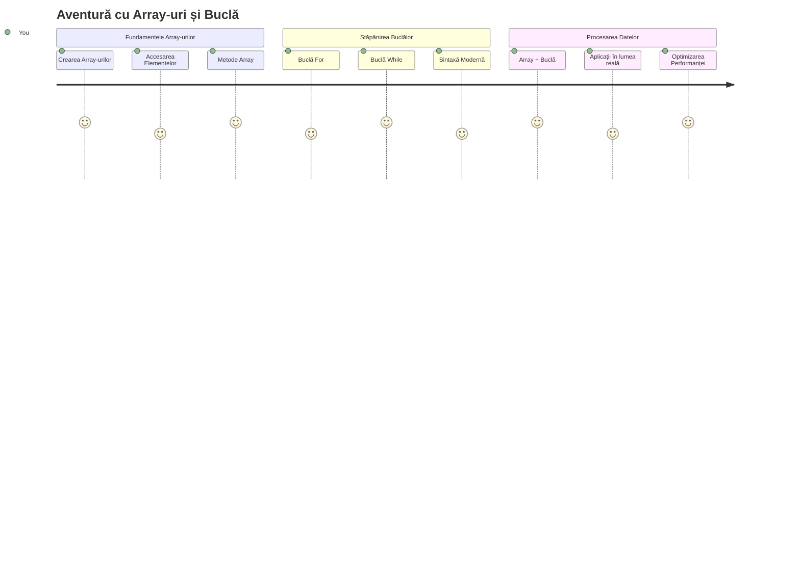
## Chestionar înainte de lecție
[Chestionar înainte de lecție](https://ff-quizzes.netlify.app/web/quiz/13)

Te-ai întrebat vreodată cum site-urile țin evidența articolelor din coșul de cumpărături sau cum afișează lista ta de prieteni? Aici intervin array-urile și buclele. Array-urile sunt ca niște containere digitale care păstrează multiple informații, în timp ce buclele îți permit să lucrezi cu toate aceste date eficient, fără cod repetitiv.

Împreună, aceste două concepte formează baza pentru gestionarea informațiilor în programele tale. Vei învăța cum să treci de la a scrie manual fiecare pas, la a crea cod inteligent și eficient care poate procesa sute sau chiar mii de articole rapid.

La finalul acestei lecții, vei înțelege cum să realizezi sarcini complexe cu date folosind doar câteva linii de cod. Hai să explorăm aceste concepte esențiale de programare.

[](https://youtube.com/watch?v=1U4qTyq02Xw "Arrays")

[](https://www.youtube.com/watch?v=Eeh7pxtTZ3k "Loops")

> 🎥 Apasă pe imaginile de mai sus pentru videoclipuri despre array-uri și bucle.

> Poți urma această lecție pe [Microsoft Learn](https://docs.microsoft.com/learn/modules/web-development-101-arrays/?WT.mc_id=academic-77807-sagibbon)!

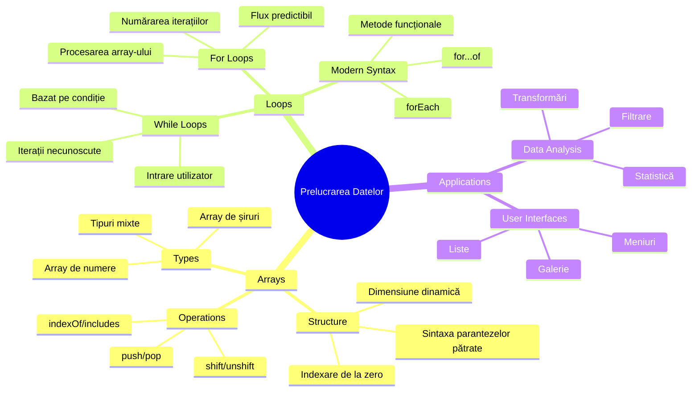
## Array-uri

Gândește-te la array-uri ca la un dulap digital de dosare - în loc să stochezi un document pe sertar, poți organiza mai multe elemente înrudiți într-un singur container structurat. În termeni de programare, array-urile îți permit să păstrezi mai multe bucăți de informație într-un singur pachet organizat.

Fie că construiești o galerie foto, gestionezi o listă de sarcini sau ții evidența scorurilor maxime într-un joc, array-urile oferă fundația pentru organizarea datelor. Hai să vedem cum funcționează.

✅ Array-urile sunt peste tot în jurul nostru! Poți să te gândești la un exemplu real de array, cum ar fi o matrice de panouri solare?

### Crearea Array-urilor

Crearea unui array este foarte simplă - folosește doar paranteze pătrate!

```javascript
// Array gol - ca un coș de cumpărături gol care așteaptă articole
const myArray = [];
```

**Ce se întâmplă aici?**
Tocmai ai creat un container gol folosind acele paranteze pătrate `[]`. Gândește-te la el ca la un raft gol în bibliotecă - este pregătit să țină orice cărți vrei să organizezi acolo.

Poți, de asemenea, să îți umpli array-ul cu valori inițiale chiar de la început:

```javascript
// Meniul de arome al magazinului tău de înghețată
const iceCreamFlavors = ["Chocolate", "Strawberry", "Vanilla", "Pistachio", "Rocky Road"];

// Informațiile profilului unui utilizator (combinând diferite tipuri de date)
const userData = ["John", 25, true, "developer"];

// Notele de test pentru clasa ta preferată
const scores = [95, 87, 92, 78, 85];
```

**Lucruri interesante de observat:**
- Poți stoca text, numere sau chiar valori de adevărat/fals în același array
- Doar separă fiecare element cu virgulă - simplu!
- Array-urile sunt perfecte pentru a ține informații înrudite împreună

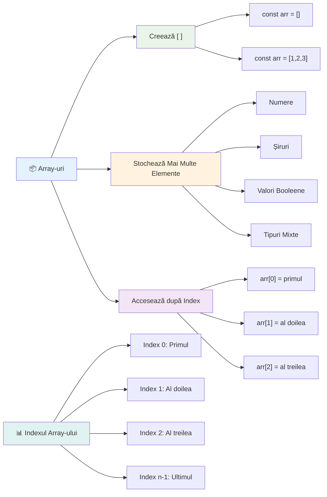
### Indexarea în Array

Iată ceva ce poate părea neobișnuit la început: array-urile își numerotează elementele începând de la 0, nu de la 1. Această indexare de la zero are rădăcini în modul în care funcționează memoria computerului - este o convenție de programare încă din primele zile ale limbajelor de calcul, cum ar fi C. Fiecare poziție în array primește propriul număr de adresă numit **index**.

| Index | Valoare | Descriere |
|-------|---------|-----------|
| 0 | "Ciocolată" | Primul element |
| 1 | "Căpșuni" | Al doilea element |
| 2 | "Vanilie" | Al treilea element |
| 3 | "Pistachio" | Al patrulea element |
| 4 | "Rocky Road" | Al cincilea element |

✅ Te surprinde că array-urile încep de la indexul zero? În unele limbaje de programare, indexarea începe de la 1. Există o istorie interesantă în legătură cu aceasta, pe care o poți [citi pe Wikipedia](https://en.wikipedia.org/wiki/Zero-based_numbering).

**Accesarea Elementelor din Array:**

```javascript
const iceCreamFlavors = ["Chocolate", "Strawberry", "Vanilla", "Pistachio", "Rocky Road"];

// Accesați elementele individuale folosind notația cu paranteze drepte
console.log(iceCreamFlavors[0]); // "Ciocolată" - primul element
console.log(iceCreamFlavors[2]); // "Vanilie" - al treilea element
console.log(iceCreamFlavors[4]); // "Rocky Road" - ultimul element
```

**Explicație a ceea ce se întâmplă aici:**
- **Folosește** notația cu paranteze pătrate și numărul indexului pentru a accesa elementele
- **Returnează** valoarea stocată în poziția specifică din array
- **Începe** să numere de la 0, făcând ca primul element să aibă indexul 0

**Modificarea Elementelor din Array:**

```javascript
// Schimbă o valoare existentă
iceCreamFlavors[4] = "Butter Pecan";
console.log(iceCreamFlavors[4]); // "Nucă de Pecan cu unt"

// Adaugă un element nou la sfârșit
iceCreamFlavors[5] = "Cookie Dough";
console.log(iceCreamFlavors[5]); // "Aluat de prăjitură"
```

**În exemplul de mai sus, am:**
- **Modificat** elementul de la indexul 4 de la "Rocky Road" la "Butter Pecan"
- **Adăugat** un nou element "Cookie Dough" la indexul 5
- **Extins** lungimea array-ului automat când am adăugat dincolo de limitele curente

### Lungimea Array-ului și Metode Comune

Array-urile vin cu proprietăți și metode încorporate care fac lucrul cu datele mult mai ușor.

**Găsirea lungimii unui Array:**

```javascript
const iceCreamFlavors = ["Chocolate", "Strawberry", "Vanilla", "Pistachio", "Rocky Road"];
console.log(iceCreamFlavors.length); // 5

// Lungimea se actualizează automat pe măsură ce array-ul se modifică
iceCreamFlavors.push("Mint Chip");
console.log(iceCreamFlavors.length); // 6
```

**Puncte cheie de reținut:**
- **Returnează** numărul total de elemente din array
- **Se actualizează** automat când elemente sunt adăugate sau eliminate
- **Oferă** un număr dinamic util pentru bucle și validare

**Metode esențiale pentru Array:**

```javascript
const fruits = ["apple", "banana", "orange"];

// Adaugă elemente
fruits.push("grape");           // Adaugă la sfârșit: ["măr", "banană", "portocală", "strugure"]
fruits.unshift("strawberry");   // Adaugă la început: ["căpșună", "măr", "banană", "portocală", "strugure"]

// Elimină elemente
const lastFruit = fruits.pop();        // Elimină și returnează "strugure"
const firstFruit = fruits.shift();     // Elimină și returnează "căpșună"

// Găsește elemente
const index = fruits.indexOf("banana"); // Returnează 1 (poziția "banană")
const hasApple = fruits.includes("apple"); // Returnează adevărat
```

**Înțelegerea acestor metode:**
- **Adaugă** elemente cu `push()` (la sfârșit) și `unshift()` (la început)
- **Înlătură** elemente cu `pop()` (la sfârșit) și `shift()` (la început)
- **Localizează** elemente cu `indexOf()` și verifică existența cu `includes()`
- **Returnează** valori utile precum elemente eliminate sau poziții index

✅ Încearcă singur! Folosește consola browser-ului pentru a crea și manipula un array creat de tine.

### 🧠 **Verificare de bază a array-urilor: Organizarea Datelor Tale**

**Testează-ți înțelegerea array-urilor:**
- De ce crezi că array-urile încep să numere de la 0 în loc de 1?
- Ce se întâmplă dacă încerci să accesezi un index care nu există (exemplu: `arr[100]` într-un array de 5 elemente)?
- Poți să te gândești la trei scenarii din viața reală unde array-urile ar fi utile?

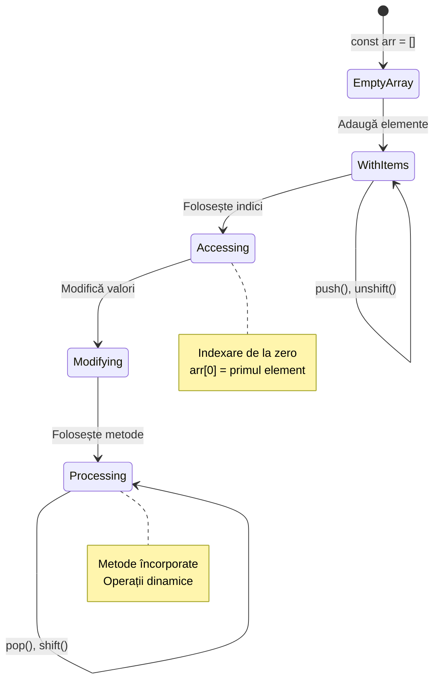
> **Insight din lumea reală**: Array-urile sunt peste tot în programare! Fluxuri de social media, coșuri de cumpărături, galerii foto, piese de pe playlist - toate sunt array-uri în spate!

## Bucles

Gândește-te la pedeapsa celebră din romanele lui Charles Dickens în care elevii trebuiau să scrie rânduri în mod repetat pe o tablă. Imaginează-ți dacă ai putea pur și simplu să spui cuiva „scrie această propoziție de 100 de ori” și aceasta să se întâmple automat. Exact asta fac buclele pentru codul tău.

Buclele sunt ca un asistent neobosit care poate repeta sarcini fără greșeală. Fie că trebuie să verifici fiecare articol dintr-un coș de cumpărături sau să afișezi toate fotografiile dintr-un album, buclele gestionează eficient această repetiție.

JavaScript oferă mai multe tipuri de bucle din care poți alege. Hai să examinăm fiecare și să înțelegem când să le folosești.

```mermaid
flowchart TD
    A["🔄 Tipuri de bucle"] --> B["Bucle For"]
    A --> C["Bucle While"]
    A --> D["Buclă For...of"]
    A --> E["Metoda forEach"]
    
    B --> B1["Iterații cunoscute"]
    B --> B2["Bazat pe contor"]
    B --> B3["for(init; condiție; incrementare)"]
    
    C --> C1["Iterații necunoscute"]
    C --> C2["Bazat pe condiție"]
    C --> C3["while(condiție)"]
    
    D --> D1["Modern ES6+"]
    D --> D2["Iterare array"]
    D --> D3["for(item of array)"]
    
    E --> E1["Stil funcțional"]
    E --> E2["Metodă array"]
    E --> E3["array.forEach(callback)"]
    
    F["⏰ Când să folosești"] --> F1["For: Numărare, indici"]
    F --> F2["While: Input utilizator, căutare"]
    F --> F3["For...of: Iterare simplă"]
    F --> F4["forEach: Programare funcțională"]
    
    style A fill:#e3f2fd
    style B fill:#e8f5e8
    style C fill:#fff3e0
    style D fill:#f3e5f5
    style E fill:#e0f2f1
    style F fill:#fce4ec
```
### Bucla For

Bucla `for` e ca și cum ai seta un cronometru - știi exact de câte ori vrei să se întâmple ceva. Este foarte organizată și predictibilă, ceea ce o face perfectă atunci când lucrezi cu array-uri sau ai nevoie să numeri lucruri.

**Structura buclei For:**

| Componentă | Scop | Exemplu |
|------------|-------|---------|
| **Inițializare** | Setează punctul de start | `let i = 0` |
| **Condiție** | Când să continue | `i < 10` |
| **Increment** | Cum să actualizeze | `i++` |

```javascript
// Numărarea de la 0 la 9
for (let i = 0; i < 10; i++) {
  console.log(`Count: ${i}`);
}

// Exemplu mai practic: procesarea scorurilor
const testScores = [85, 92, 78, 96, 88];
for (let i = 0; i < testScores.length; i++) {
  console.log(`Student ${i + 1}: ${testScores[i]}%`);
}
```

**Pas cu pas, iată ce se întâmplă:**
- **Inițializează** variabila contor `i` la 0 la început
- **Verifică** condiția `i < 10` înainte de fiecare iterație
- **Execută** blocul de cod când condiția este adevărată
- **Crește** `i` cu 1 după fiecare iterație folosind `i++`
- **Se oprește** când condiția devine falsă (când `i` ajunge la 10)

✅ Rulează acest cod în consola browser-ului. Ce se întâmplă dacă faci mici modificări la contor, condiție sau expresia de iterare? Poți să faci să funcționeze invers, creând o numărătoare inversă?

### 🗓️ **Verificare competențe buclă For: Repetiție controlată**

**Evaluează-ți înțelegerea buclei for:**
- Care sunt cele trei părți ale unei bucle for și ce face fiecare?
- Cum ai itera printr-un array înapoi?
- Ce se întâmplă dacă uiți partea de incrementare (`i++`)?

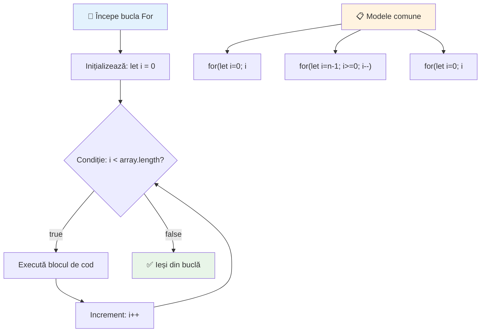
> **Înțelepciune despre bucle**: Bucla for este perfectă când știi exact de câte ori trebuie să repeți ceva. Este cea mai comună alegere pentru procesarea array-urilor!

### Bucla While

Bucla `while` este ca și cum ai spune „continuă să faci asta până când...” - poate nu știi exact de câte ori va rula, dar știi când să te oprești. Este perfectă pentru lucruri precum solicitarea unei intrări de la utilizator până când oferă ceea ce ai nevoie sau căutarea într-un set de date până găsești ce cauți.

**Caracteristici buclă While:**
- **Continuă** să execute atâta timp cât condiția este adevărată
- **Necesită** gestionarea manuală a variabilelor contor
- **Verifică** condiția înainte de fiecare iterație
- **Are riscul** unor bucle infinite dacă condiția nu devine niciodată falsă

```javascript
// Exemplu de numărare de bază
let i = 0;
while (i < 10) {
  console.log(`While count: ${i}`);
  i++; // Nu uita să incrementezi!
}

// Exemplu mai practic: procesarea intrării utilizatorului
let userInput = "";
let attempts = 0;
const maxAttempts = 3;

while (userInput !== "quit" && attempts < maxAttempts) {
  userInput = prompt(`Enter 'quit' to exit (attempt ${attempts + 1}):`);
  attempts++;
}

if (attempts >= maxAttempts) {
  console.log("Maximum attempts reached!");
}
```

**Înțelegerea acestor exemple:**
- **Gestionează** variabila contor `i` manual în interiorul corpului buclei
- **Crește** contorul pentru a preveni bucle infinite
- **Demonstrează** un caz practic cu input de utilizator și limită de încercări
- **Include** mecanisme de siguranță care previn execuția nesfârșită

### ♾️ **Verificare înțelepciune buclă While: Repetiție bazată pe condiție**

**Testează-ți înțelegerea buclei while:**
- Care este principalul pericol când folosești bucle while?
- Când ai alege bucla while în loc de for?
- Cum poți preveni buclele infinite?

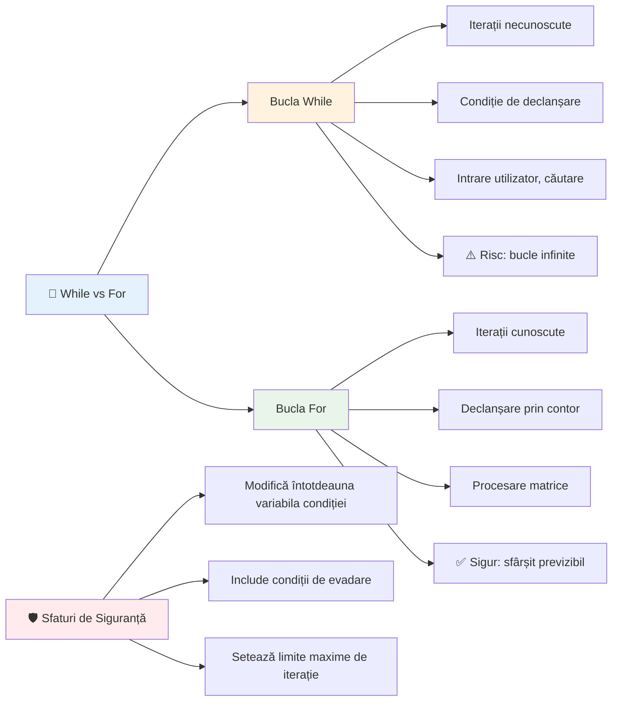
> **Siguranță mai întâi**: Bucla while este puternică dar necesită gestionarea atentă a condiției. Asigură-te întotdeauna că condiția buclei va deveni falsă la un moment dat!

### Alternative moderne pentru bucle

JavaScript oferă sintaxă modernă pentru bucle care poate face codul tău mai lizibil și mai puțin predispus la erori.

**Bucla For...of (ES6+):**

```javascript
const colors = ["red", "green", "blue", "yellow"];

// Abordare modernă - mai curată și mai sigură
for (const color of colors) {
  console.log(`Color: ${color}`);
}

// Compară cu bucla for tradițională
for (let i = 0; i < colors.length; i++) {
  console.log(`Color: ${colors[i]}`);
}
```

**Avantajele cheie ale for...of:**
- **Elimină** gestionarea indexului și erorile posibile de tip off-by-one
- **Oferă** acces direct la elementele array-ului
- **Îmbunătățește** lizibilitatea codului și reduce complexitatea sintaxei

**Metoda forEach:**

```javascript
const prices = [9.99, 15.50, 22.75, 8.25];

// Folosind forEach pentru stilul de programare funcțională
prices.forEach((price, index) => {
  console.log(`Item ${index + 1}: $${price.toFixed(2)}`);
});

// forEach cu funcții arrow pentru operații simple
prices.forEach(price => console.log(`Price: $${price}`));
```

**Ce trebuie să știi despre forEach:**
- **Execută** o funcție pentru fiecare element din array
- **Oferă** atât valoarea elementului cât și indexul ca parametri
- **Nu poate** fi oprită anticipat (spre deosebire de buclele clasice)
- **Returnează** undefined (nu creează un array nou)

✅ De ce ai alege o buclă for versus o buclă while? 17K de vizualizatori au avut aceeași întrebare pe StackOverflow, iar unele opinii [pot fi interesante pentru tine](https://stackoverflow.com/questions/39969145/while-loops-vs-for-loops-in-javascript).

### 🎨 **Verificare sintaxă modernă pentru bucle: Adoptarea ES6+**

**Evaluează înțelegerea ta despre JavaScript modern:**
- Care sunt avantajele lui `for...of` față de buclele for tradiționale?
- Când ai prefera buclele for tradiționale?
- Care este diferența dintre `forEach` și `map`?

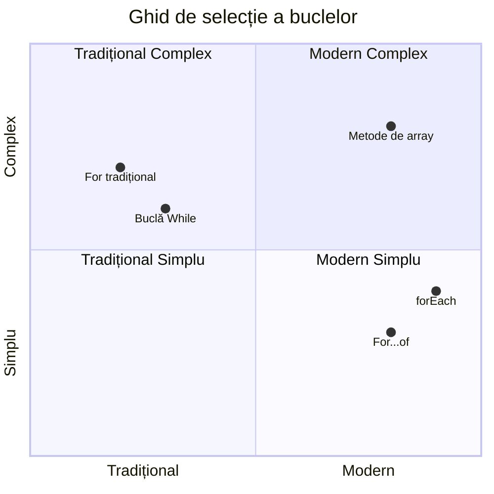
> **Tendința modernă**: Sintaxa ES6+ precum `for...of` și `forEach` devin abordarea preferată pentru iterarea array-urilor deoarece este mai curată și mai puțin predispusă la erori!

## Bucle și Array-uri

Combinarea array-urilor cu bucle creează capacități puternice de procesare a datelor. Această asociere este fundamentală pentru multe sarcini de programare, de la afișarea listelor până la calcularea statisticilor.

**Procesarea tradițională a array-urilor:**

```javascript
const iceCreamFlavors = ["Chocolate", "Strawberry", "Vanilla", "Pistachio", "Rocky Road"];

// Abordare clasică cu bucla for
for (let i = 0; i < iceCreamFlavors.length; i++) {
  console.log(`Flavor ${i + 1}: ${iceCreamFlavors[i]}`);
}

// Abordare modernă cu for...of
for (const flavor of iceCreamFlavors) {
  console.log(`Available flavor: ${flavor}`);
}
```

**Să înțelegem fiecare abordare:**
- **Folosește** proprietatea lungime a array-ului pentru a determina limita buclei
- **Accesează** elementele după index în buclele for tradiționale
- **Oferă** acces direct la elemente în buclele for...of
- **Procesează** fiecare element o singură dată

**Exemplu practic de procesare a datelor:**

```javascript
const studentGrades = [85, 92, 78, 96, 88, 73, 89];
let total = 0;
let highestGrade = studentGrades[0];
let lowestGrade = studentGrades[0];

// Procesează toate notele cu un singur ciclu
for (let i = 0; i < studentGrades.length; i++) {
  const grade = studentGrades[i];
  total += grade;
  
  if (grade > highestGrade) {
    highestGrade = grade;
  }
  
  if (grade < lowestGrade) {
    lowestGrade = grade;
  }
}

const average = total / studentGrades.length;
console.log(`Average: ${average.toFixed(1)}`);
console.log(`Highest: ${highestGrade}`);
console.log(`Lowest: ${lowestGrade}`);
```

**Iată cum funcționează acest cod:**
- **Inițializează** variabile de urmărire pentru suma și extreme
- **Procesează** fiecare notă cu o singură buclă eficientă
- **Acumulează** totalul pentru calculul mediei
- **Urmărește** valorile maxime și minime în timpul iterației
- **Calculează** statisticile finale după terminarea buclei

✅ Experimentează iterând un array creat de tine în consola browser-ului.

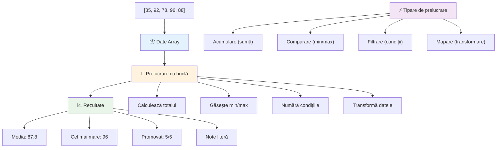
---

## Provocarea Agentului GitHub Copilot 🚀

Folosește modul Agent pentru a rezolva următoarea provocare:

**Descriere:** Construiește o funcție completă de procesare a datelor care combină array-uri și bucle pentru a analiza un set de date și a genera informații relevante.

**Prompt:** Creează o funcție numită `analyzeGrades` care ia un array de obiecte note studenți (fiecare conținând proprietăți nume și scor) și returnează un obiect cu statistici incluzând cel mai mare scor, cel mai mic scor, scorul mediu, numărul de studenți care au trecut (scor >= 70) și un array cu numele studenților care au obținut peste media generală. Folosește cel puțin două tipuri diferite de bucle în soluția ta.

Află mai multe despre [modul agent](https://code.visualstudio.com/blogs/2025/02/24/introducing-copilot-agent-mode) aici.

## 🚀 Provocare
JavaScript oferă mai multe metode moderne pentru array-uri care pot înlocui buclele tradiționale pentru sarcini specifice. Explorează [forEach](https://developer.mozilla.org/docs/Web/JavaScript/Reference/Global_Objects/Array/forEach), [for-of](https://developer.mozilla.org/docs/Web/JavaScript/Reference/Statements/for...of), [map](https://developer.mozilla.org/docs/Web/JavaScript/Reference/Global_Objects/Array/map), [filter](https://developer.mozilla.org/docs/Web/JavaScript/Reference/Global_Objects/Array/filter) și [reduce](https://developer.mozilla.org/docs/Web/JavaScript/Reference/Global_Objects/Array/reduce).

**Provocarea ta:** Refactorizează exemplul cu notele studenților folosind cel puțin trei metode diferite pentru array-uri. Observă cât de mult mai curat și mai lizibil devine codul cu sintaxa modernă JavaScript.

## Test post-lectură
[Test post-lectură](https://ff-quizzes.netlify.app/web/quiz/14)


## Recapitulare & Auto-studiu

Array-urile în JavaScript au multe metode atașate, care sunt extrem de utile pentru manipularea datelor. [Citește despre aceste metode](https://developer.mozilla.org/docs/Web/JavaScript/Reference/Global_Objects/Array) și încearcă unele dintre ele (precum push, pop, slice și splice) pe un array creat de tine.

## Tema

[Loop an Array](assignment.md)

---

## 📊 **Rezumatul trusei tale de unelte pentru Array-uri & Bucle**

```mermaid
graph TD
    A["🎯 Stăpânirea Array-urilor & Buclelor"] --> B["📦 Fundamentele Array-urilor"]
    A --> C["🔄 Tipuri de Buclă"]
    A --> D["🔗 Procesarea Datelor"]
    A --> E["🎨 Tehnici Moderne"]
    
    B --> B1["Creare: [ ]"]
    B --> B2["Indexare: arr[0]"]
    B --> B3["Metode: push, pop"]
    B --> B4["Proprietăți: length"]
    
    C --> C1["For: Iterații cunoscute"]
    C --> C2["While: Bazat pe condiție"]
    C --> C3["For...of: Acces direct"]
    C --> C4["forEach: Funcțional"]
    
    D --> D1["Calcul statistic"]
    D --> D2["Transformarea datelor"]
    D --> D3["Filtrare & căutare"]
    D --> D4["Procesare în timp real"]
    
    E --> E1["Funcții săgeată"]
    E --> E2["Înlănțuire metode"]
    E --> E3["Destructurare"]
    E --> E4["Șabloane literale"]
    
    F["💡 Beneficii cheie"] --> F1["Manipulare eficientă a datelor"]
    F --> F2["Reducerea repetării codului"]
    F --> F3["Soluții scalabile"]
    F --> F4["Sintaxă mai curată"]
    
    style A fill:#e3f2fd
    style B fill:#e8f5e8
    style C fill:#fff3e0
    style D fill:#f3e5f5
    style E fill:#e0f2f1
    style F fill:#fce4ec
```
---

## 🚀 Cronologia stăpânirii Array-urilor & Buclurilor tale

### ⚡ **Ce poți face în următoarele 5 minute**
- [ ] Creează un array cu filmele tale preferate și accesează elemente specifice
- [ ] Scrie o buclă for care numără de la 1 la 10
- [ ] Încearcă provocarea cu metode moderne pentru array-uri din lecție
- [ ] Exersează indexarea array-urilor în consola browserului tău

### 🎯 **Ce poți realiza în această oră**
- [ ] Finalizează testul post-lectură și revizuiește orice concepte dificile
- [ ] Construiește analizatorul complet de note din provocarea GitHub Copilot
- [ ] Creează un coș de cumpărături simplu care adaugă și elimină produse
- [ ] Exersează conversia între diferite tipuri de bucle
- [ ] Experimentează cu metode de array precum `push`, `pop`, `slice` și `splice`

### 📅 **Parcursul tău de procesare a datelor pe o săptămână**
- [ ] Finalizează tema "Loop an Array" cu îmbunătățiri creative
- [ ] Construiește o aplicație de listă de sarcini folosind array-uri și bucle
- [ ] Creează un calculator simplu de statistici pentru date numerice
- [ ] Exersează cu [metodele array de la MDN](https://developer.mozilla.org/docs/Web/JavaScript/Reference/Global_Objects/Array)
- [ ] Construiește o galerie foto sau o interfață pentru playlist muzical
- [ ] Explorează programarea funcțională cu `map`, `filter` și `reduce`

### 🌟 **Transformarea ta pe o lună**
- [ ] Stăpânește operațiuni avansate pe array-uri și optimizarea performanței
- [ ] Construiește un dashboard complet de vizualizare a datelor
- [ ] Contribuie la proiecte open source care implică procesarea datelor
- [ ] Predă altora despre array-uri și bucle folosind exemple practice
- [ ] Creează o bibliotecă personală de funcții reutilizabile pentru procesarea datelor
- [ ] Explorează algoritmi și structuri de date bazate pe array-uri

### 🏆 **Verificarea finală a campionului în procesarea datelor**

**Sărbătorește stăpânirea ta asupra array-urilor și buclelor:**
- Care este cea mai utilă operațiune cu array pe care ai învățat-o pentru aplicații reale?
- Ce tip de buclă ți se pare cel mai natural și de ce?
- Cum ți-a schimbat înțelegerea array-urilor și buclelor abordarea în organizarea datelor?
- Ce sarcină complexă de procesare a datelor ai dori să abordezi în continuare?

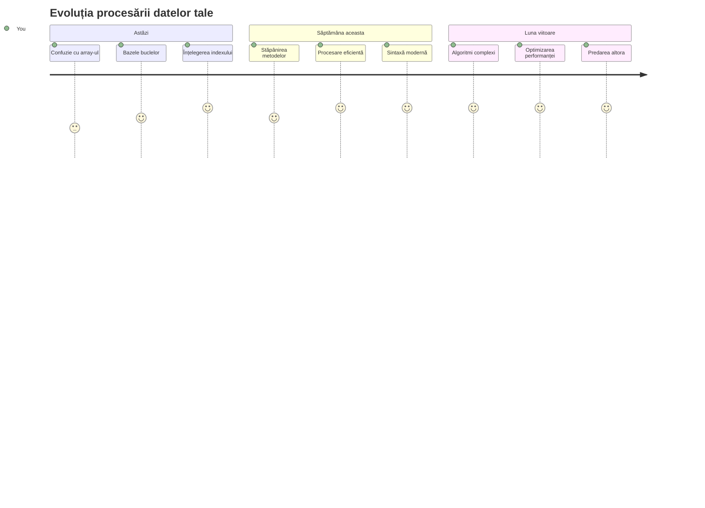
> 📦 **Ai deblocat puterea organizării și procesării datelor!** Array-urile și buclele sunt fundamentul aproape fiecărei aplicații pe care o vei construi vreodată. De la liste simple la analize complexe de date, acum ai uneltele pentru a gestiona informațiile eficient și elegant. Fiecare site dinamic, aplicație mobilă și aplicație bazată pe date se bazează pe aceste concepte fundamentale. Bine ai venit în lumea procesării scalabile a datelor! 🎉

---

<!-- CO-OP TRANSLATOR DISCLAIMER START -->
**Declinare a răspunderii**:
Acest document a fost tradus folosind serviciul de traducere AI [Co-op Translator](https://github.com/Azure/co-op-translator). Deși ne străduim pentru acuratețe, vă rugăm să țineți cont că traducerile automate pot conține erori sau inexactități. Documentul original în limba sa nativă trebuie considerat sursa autorizată. Pentru informații critice, se recomandă traducerea profesională realizată de un specialist uman. Nu ne asumăm răspunderea pentru eventualele neînțelegeri sau interpretări greșite rezultate din utilizarea acestei traduceri.
<!-- CO-OP TRANSLATOR DISCLAIMER END -->