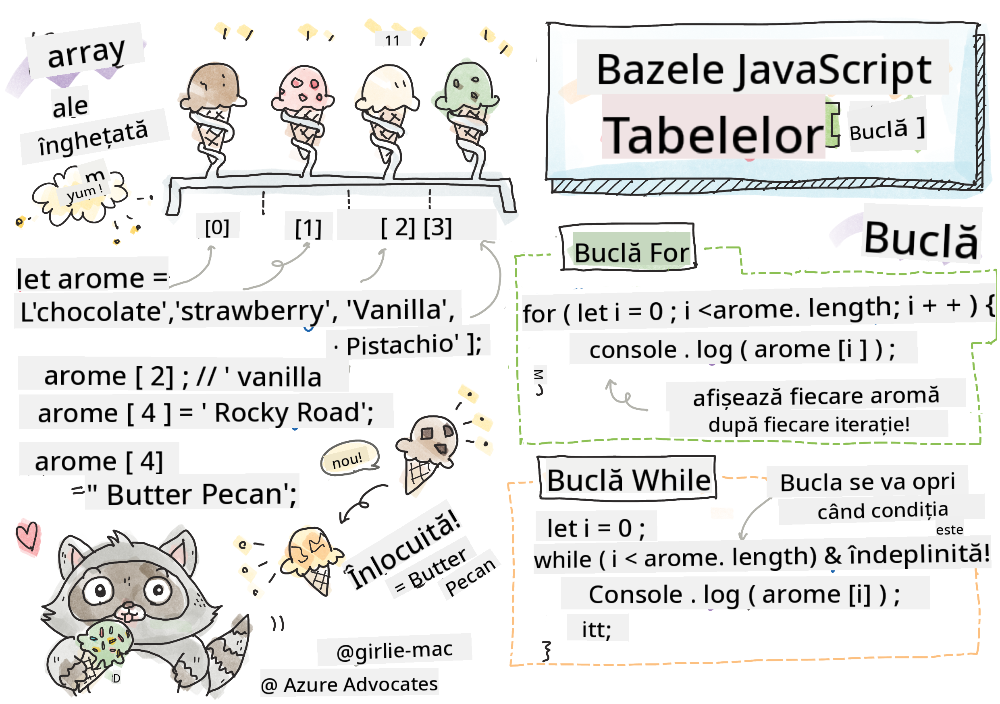

<!--
CO_OP_TRANSLATOR_METADATA:
{
  "original_hash": "3f7f87871312cf6cc12662da7d973182",
  "translation_date": "2025-08-28T08:08:41+00:00",
  "source_file": "2-js-basics/4-arrays-loops/README.md",
  "language_code": "ro"
}
-->
# Bazele JavaScript: Tablouri și Bucle


> Sketchnote de [Tomomi Imura](https://twitter.com/girlie_mac)

## Chestionar înainte de curs
[Chestionar înainte de curs](https://ashy-river-0debb7803.1.azurestaticapps.net/quiz/13)

Această lecție acoperă elementele de bază ale JavaScript, limbajul care oferă interactivitate pe web. În această lecție, vei învăța despre tablouri și bucle, care sunt utilizate pentru a manipula datele.

[](https://youtube.com/watch?v=1U4qTyq02Xw "Tablouri")

[](https://www.youtube.com/watch?v=Eeh7pxtTZ3k "Bucle")

> 🎥 Fă clic pe imaginile de mai sus pentru videoclipuri despre tablouri și bucle.

> Poți parcurge această lecție pe [Microsoft Learn](https://docs.microsoft.com/learn/modules/web-development-101-arrays/?WT.mc_id=academic-77807-sagibbon)!

## Tablouri

Lucrul cu date este o sarcină comună în orice limbaj, iar aceasta devine mult mai ușoară atunci când datele sunt organizate într-un format structurat, cum ar fi tablourile. Cu tablourile, datele sunt stocate într-o structură similară unei liste. Un mare avantaj al tablourilor este că poți stoca diferite tipuri de date într-un singur tablou.

✅ Tablourile sunt peste tot în jurul nostru! Poți să te gândești la un exemplu din viața reală al unui tablou, cum ar fi un ansamblu de panouri solare?

Sintaxa pentru un tablou este o pereche de paranteze pătrate.

```javascript
let myArray = [];
```

Acesta este un tablou gol, dar tablourile pot fi declarate deja populate cu date. Valorile multiple dintr-un tablou sunt separate printr-o virgulă.

```javascript
let iceCreamFlavors = ["Chocolate", "Strawberry", "Vanilla", "Pistachio", "Rocky Road"];
```

Valorile din tablou primesc o valoare unică numită **index**, un număr întreg care este atribuit pe baza distanței față de începutul tabloului. În exemplul de mai sus, valoarea de tip șir "Chocolate" are indexul 0, iar indexul pentru "Rocky Road" este 4. Folosește indexul împreună cu parantezele pătrate pentru a prelua, schimba sau insera valori în tablou.

✅ Te surprinde faptul că indexurile încep de la zero? În unele limbaje de programare, indexurile încep de la 1. Există o istorie interesantă în spatele acestui lucru, pe care o poți [citi pe Wikipedia](https://en.wikipedia.org/wiki/Zero-based_numbering).

```javascript
let iceCreamFlavors = ["Chocolate", "Strawberry", "Vanilla", "Pistachio", "Rocky Road"];
iceCreamFlavors[2]; //"Vanilla"
```

Poți folosi indexul pentru a schimba o valoare, astfel:

```javascript
iceCreamFlavors[4] = "Butter Pecan"; //Changed "Rocky Road" to "Butter Pecan"
```

Și poți insera o valoare nouă la un anumit index astfel:

```javascript
iceCreamFlavors[5] = "Cookie Dough"; //Added "Cookie Dough"
```

✅ O metodă mai comună de a adăuga valori într-un tablou este utilizarea operatorilor de tablou, cum ar fi array.push().

Pentru a afla câte elemente sunt într-un tablou, folosește proprietatea `length`.

```javascript
let iceCreamFlavors = ["Chocolate", "Strawberry", "Vanilla", "Pistachio", "Rocky Road"];
iceCreamFlavors.length; //5
```

✅ Încearcă singur! Folosește consola browserului pentru a crea și manipula un tablou propriu.

## Bucle

Buclele ne permit să efectuăm sarcini repetitive sau **iterative** și pot economisi mult timp și cod. Fiecare iterație poate varia în ceea ce privește variabilele, valorile și condițiile. Există diferite tipuri de bucle în JavaScript, iar acestea au mici diferențe, dar în esență fac același lucru: parcurg datele.

### Bucle For

Buclele `for` necesită 3 părți pentru a itera:
- `counter` O variabilă care este de obicei inițializată cu un număr ce contorizează numărul de iterații
- `condition` O expresie care folosește operatori de comparație pentru a opri bucla atunci când devine `false`
- `iteration-expression` Se execută la sfârșitul fiecărei iterații, de obicei folosită pentru a schimba valoarea contorului
  
```javascript
// Counting up to 10
for (let i = 0; i < 10; i++) {
  console.log(i);
}
```

✅ Rulează acest cod în consola browserului. Ce se întâmplă când faci mici modificări la contor, condiție sau expresia de iterație? Poți face să ruleze invers, creând un numărătoare inversă?

### Bucle While

Spre deosebire de sintaxa buclei `for`, buclele `while` necesită doar o condiție care va opri bucla atunci când condiția devine `false`. Condițiile din bucle se bazează de obicei pe alte valori, cum ar fi contoarele, și trebuie gestionate în timpul buclei. Valorile inițiale pentru contoare trebuie create în afara buclei, iar orice expresii pentru a îndeplini o condiție, inclusiv schimbarea contorului, trebuie menținute în interiorul buclei.

```javascript
//Counting up to 10
let i = 0;
while (i < 10) {
 console.log(i);
 i++;
}
```

✅ De ce ai alege o buclă for în loc de o buclă while? 17.000 de utilizatori au avut aceeași întrebare pe StackOverflow, iar unele dintre opinii [ar putea fi interesante pentru tine](https://stackoverflow.com/questions/39969145/while-loops-vs-for-loops-in-javascript).

## Bucle și Tablouri

Tablourile sunt adesea utilizate împreună cu buclele, deoarece majoritatea condițiilor necesită lungimea tabloului pentru a opri bucla, iar indexul poate fi și valoarea contorului.

```javascript
let iceCreamFlavors = ["Chocolate", "Strawberry", "Vanilla", "Pistachio", "Rocky Road"];

for (let i = 0; i < iceCreamFlavors.length; i++) {
  console.log(iceCreamFlavors[i]);
} //Ends when all flavors are printed
```

✅ Experimentează cu parcurgerea unui tablou propriu în consola browserului.

---

## 🚀 Provocare

Există și alte moduri de a parcurge tablourile, în afară de buclele for și while. Există [forEach](https://developer.mozilla.org/docs/Web/JavaScript/Reference/Global_Objects/Array/forEach), [for-of](https://developer.mozilla.org/docs/Web/JavaScript/Reference/Statements/for...of) și [map](https://developer.mozilla.org/docs/Web/JavaScript/Reference/Global_Objects/Array/map). Rescrie bucla tabloului tău folosind una dintre aceste tehnici.

## Chestionar după curs
[Chestionar după curs](https://ashy-river-0debb7803.1.azurestaticapps.net/quiz/14)

## Recapitulare și Studiu Individual

Tablourile în JavaScript au multe metode atașate, care sunt extrem de utile pentru manipularea datelor. [Citește despre aceste metode](https://developer.mozilla.org/docs/Web/JavaScript/Reference/Global_Objects/Array) și încearcă câteva dintre ele (cum ar fi push, pop, slice și splice) pe un tablou creat de tine.

## Temă

[Parcurge un Tablou](assignment.md)

---

**Declinarea responsabilității**:  
Acest document a fost tradus utilizând serviciul de traducere AI [Co-op Translator](https://github.com/Azure/co-op-translator). Deși depunem eforturi pentru a asigura acuratețea, vă rugăm să aveți în vedere că traducerile automate pot conține erori sau inexactități. Documentul original în limba sa nativă ar trebui considerat sursa autoritară. Pentru informații critice, se recomandă traducerea profesională realizată de un specialist uman. Nu ne asumăm răspunderea pentru eventualele neînțelegeri sau interpretări greșite care pot apărea din utilizarea acestei traduceri.