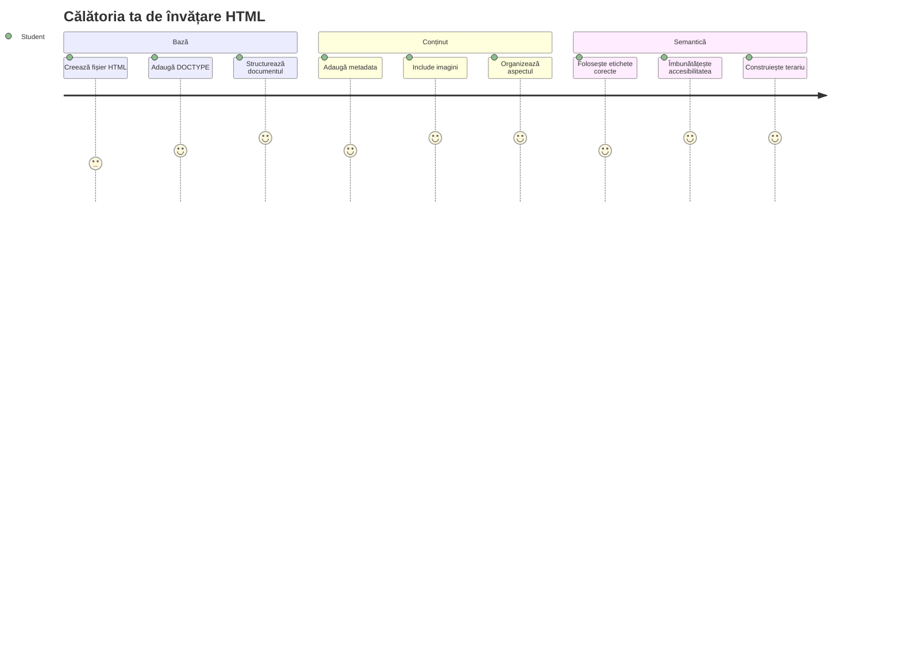
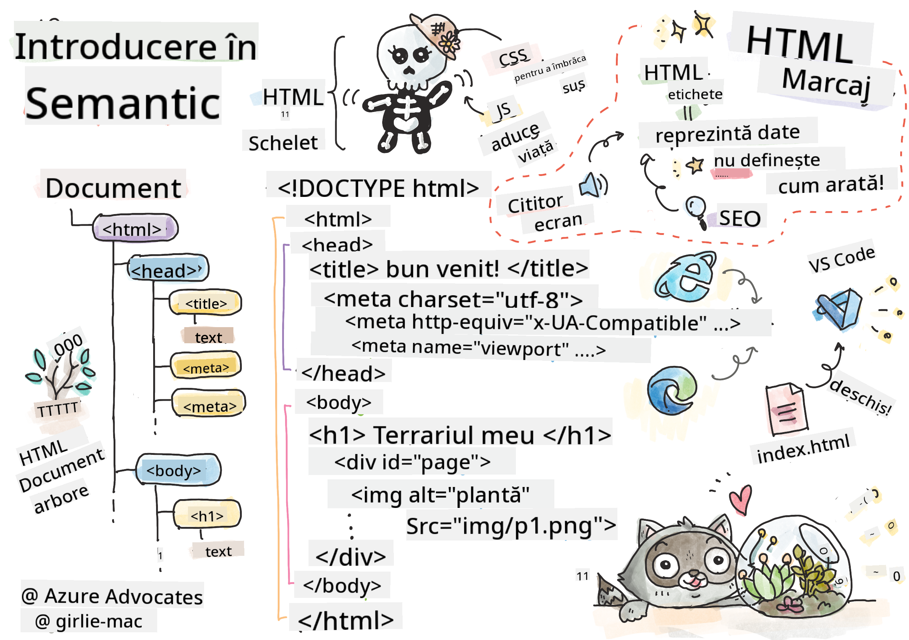
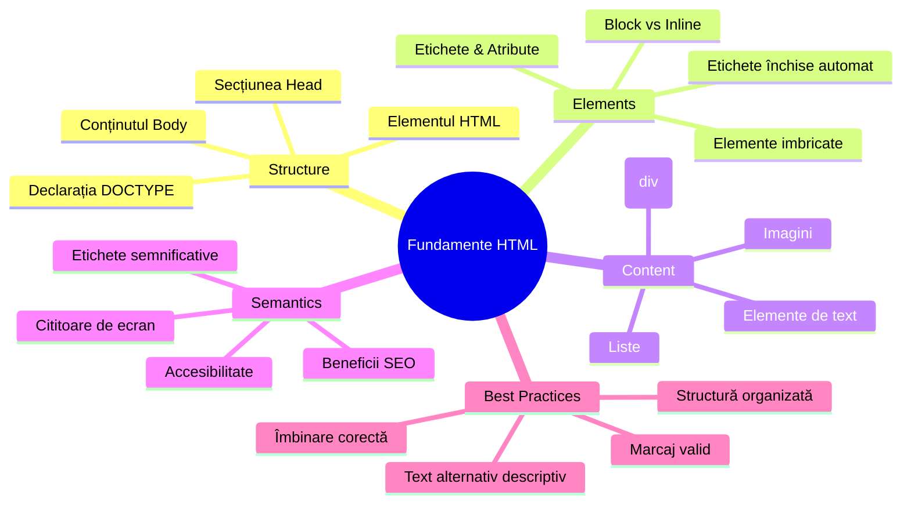
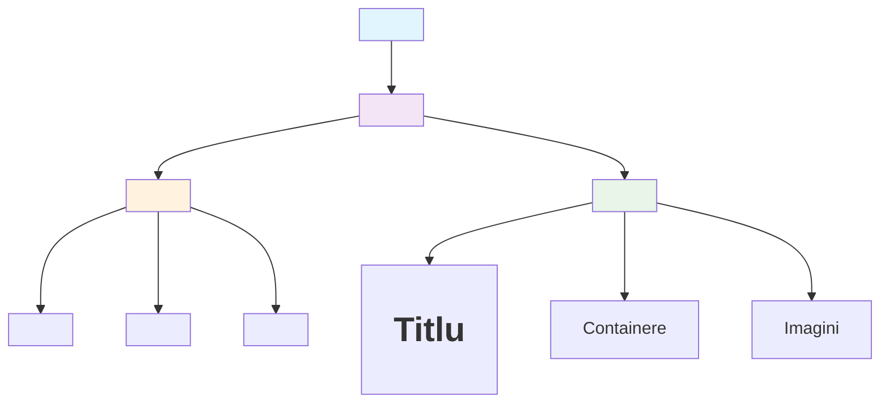
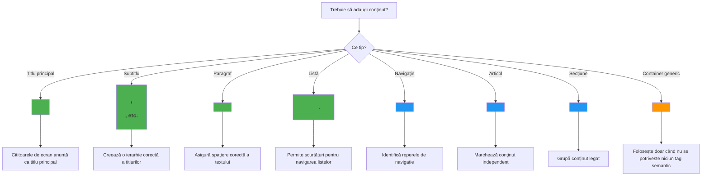
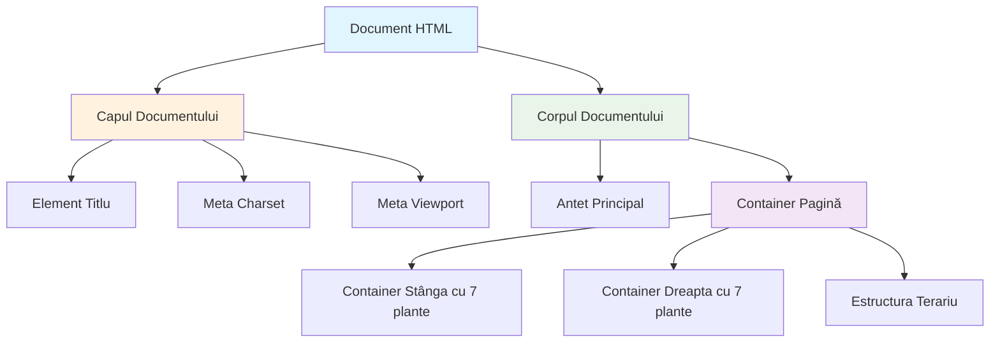
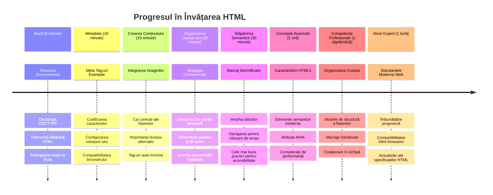

<!--
CO_OP_TRANSLATOR_METADATA:
{
  "original_hash": "3fcfa99c4897e051b558b5eaf1e8cc74",
  "translation_date": "2026-01-07T06:09:17+00:00",
  "source_file": "3-terrarium/1-intro-to-html/README.md",
  "language_code": "ro"
}
-->
# Proiectul Terrarium Partea 1: Introducere în HTML



> Sketchnote de [Tomomi Imura](https://twitter.com/girlie_mac)

HTML, sau HyperText Markup Language, este fundația fiecărui site web pe care l-ai vizitat vreodată. Gândește-te la HTML ca scheletul care oferă structură paginilor web – definește unde merge conținutul, cum este organizat și ce reprezintă fiecare element. În timp ce CSS va „îmbrăca” mai târziu HTML-ul tău cu culori și layout-uri, iar JavaScript îl va anima cu interactivitate, HTML oferă structura esențială care face tot restul posibil.

În această lecție, vei crea structura HTML pentru o interfață virtuală de terrariu. Acest proiect practic te va învăța conceptele fundamentale de HTML în timp ce construiești ceva vizual atractiv. Vei învăța cum să organizezi conținutul folosind elemente semantice, să lucrezi cu imagini și să creezi baza pentru o aplicație web interactivă.

La sfârșitul acestei lecții, vei avea o pagină HTML funcțională care afișează imagini cu plante în coloane organizate, gata pentru stilizare în lecția următoare. Nu-ți face griji dacă arată simplu la început – asta face exact HTML-ul înainte ca CSS să adauge rafinamentul vizual.


## Chestionar Pre-Lecție

[Chestionar pre-lectură](https://ff-quizzes.netlify.app/web/quiz/15)

> 📺 **Urmărește și învață**: Vizualizează acest videoclip util de prezentare
> 
> [](https://www.youtube.com/watch?v=1TvxJKBzhyQ)

## Configurarea Proiectului Tău

Înainte să intrăm în codul HTML, să configurăm un spațiu de lucru adecvat pentru proiectul tău de terrarium. Crearea unei structuri organizate de fișiere de la început este un obicei crucial care te va ajuta pe tot parcursul călătoriei tale în dezvoltarea web.

### Sarcină: Creează Structura Proiectului Tău

Vei crea un folder dedicat pentru proiectul terrarium și vei adăuga primul tău fișier HTML. Iată două abordări pe care le poți folosi:

**Opțiunea 1: Folosind Visual Studio Code**  
1. Deschide Visual Studio Code  
2. Apasă pe "File" → "Open Folder" sau folosește `Ctrl+K, Ctrl+O` (Windows/Linux) sau `Cmd+K, Cmd+O` (Mac)  
3. Creează un folder nou numit `terrarium` și selectează-l  
4. În panoul Explorer, apasă pe pictograma "New File"  
5. Denumește fișierul `index.html`  


**Opțiunea 2: Folosind Comenzi în Terminal**  
```bash
mkdir terrarium
cd terrarium
touch index.html
code index.html
```
  
**Iată ce realizează aceste comenzi:**  
- **Creează** un director nou numit `terrarium` pentru proiectul tău  
- **Navighează** în directorul terrarium  
- **Creează** un fișier gol `index.html`  
- **Deschide** fișierul în Visual Studio Code pentru editare  

> 💡 **Sfat Pro**: Numele fișierului `index.html` este special în dezvoltarea web. Când cineva vizitează un site, browserele caută automat `index.html` ca pagină implicită de afișare. Asta înseamnă că o adresă URL ca `https://mysite.com/projects/` va servi automat fișierul `index.html` din folderul `projects` fără a fi nevoie să specifici numele fișierului în URL.

## Înțelegerea Structurii Documentului HTML

Fiecare document HTML urmează o structură specifică pe care browserele trebuie să o înțeleagă și să o afișeze corect. Gândește-te la această structură ca la o scrisoare formală – are elemente obligatorii într-o ordine anume care ajută destinatarul (în acest caz, browserul) să proceseze conținutul corect.


Să începem prin a adăuga fundația esențială de care are nevoie orice document HTML.

### Declarația DOCTYPE și Elementul Rădăcină

Primele două linii din orice fișier HTML servesc ca „introducere” a documentului pentru browser:

```html
<!DOCTYPE html>
<html></html>
```
  
**Ce face acest cod:**  
- **Declară** tipul documentului ca HTML5 folosind `<!DOCTYPE html>`  
- **Creează** elementul rădăcină `<html>` care va conține tot conținutul paginii  
- **Stabilește** standarde web moderne pentru redare corectă în browser  
- **Asigură** afișare consistentă în diferite browsere și dispozitive  

> 💡 **Sfat VS Code**: Plasează mouse-ul peste orice etichetă HTML în VS Code pentru a vedea informații utile din MDN Web Docs, inclusiv exemple de utilizare și detalii despre compatibilitatea browserelor.

> 📚 **Află mai multe**: Declarația DOCTYPE împiedică browserele să intre în „mod quirks,” folosit pentru a susține site-uri foarte vechi. Dezvoltarea web modernă folosește simpla declarație `<!DOCTYPE html>` pentru a asigura [redare conformă cu standardele](https://developer.mozilla.org/docs/Web/HTML/Quirks_Mode_and_Standards_Mode).

### 🔄 **Verificare Pedagogică**  
**Pauză și Reflectare**: Înainte să continui, asigură-te că înțelegi:  
- ✅ De ce fiecare document HTML are nevoie de declarația DOCTYPE  
- ✅ Ce conține elementul rădăcină `<html>`  
- ✅ Cum ajută această structură browserele să redea paginile corect  

**Autotest Rapid**: Poți explica în propriile cuvinte ce înseamnă „redare conformă cu standardele”?

## Adăugarea Metadatelor Esențiale Documentului

Secțiunea `<head>` a unui document HTML conține informații cruciale de care au nevoie browserele și motoarele de căutare, dar pe care vizitatorii nu le văd direct pe pagină. Gândește-te la ea ca la informațiile „din culise” care ajută pagina ta să funcționeze corect și să apară corespunzător pe diverse dispozitive și platforme.

Aceste metadate spun browserelor cum să afișeze pagina ta, ce codare a caracterelor să folosească și cum să gestioneze diferitele dimensiuni ale ecranului – toate esențiale pentru a crea pagini web profesionale și accesibile.

### Sarcină: Adaugă Secțiunea Head a Documentului

Inserează această secțiune `<head>` între etichetele tale de deschidere și închidere `<html>`:

```html
<head>
	<title>Welcome to my Virtual Terrarium</title>
	<meta charset="utf-8" />
	<meta http-equiv="X-UA-Compatible" content="IE=edge" />
	<meta name="viewport" content="width=device-width, initial-scale=1" />
</head>
```
  
**Ce realizează fiecare element:**  
- **Setează** titlul paginii care apare în tab-urile browserului și în rezultatele căutărilor  
- **Specifică** codarea caracterelor UTF-8 pentru afișarea corectă a textului la nivel mondial  
- **Asigură** compatibilitatea cu versiunile moderne de Internet Explorer  
- **Configurează** designul responsiv prin setarea viewport-ului care se potrivește cu lățimea dispozitivului  
- **Controlează** nivelul inițial de zoom pentru a afișa conținutul la dimensiunea naturală  

> 🤔 **Gândește-te la asta**: Ce s-ar întâmpla dacă setezi meta tag-ul viewport astfel: `<meta name="viewport" content="width=600">`? Aceasta ar forța pagina să aibă întotdeauna 600 pixeli lățime, stricând designul responsiv! Află mai multe despre [configurarea corectă a viewport-ului](https://developer.mozilla.org/docs/Web/HTML/Viewport_meta_tag).

## Construirea Corpului Documentului

Elementul `<body>` conține tot conținutul vizibil al paginii tale web – tot ce utilizatorii vor vedea și cu ce vor interacționa. În timp ce secțiunea `<head>` oferă instrucțiuni browserului, secțiunea `<body>` conține conținutul propriu-zis: text, imagini, butoane și alte elemente care creează interfața ta.

Să adăugăm structura corpului și să înțelegem cum funcționează etichetele HTML împreună pentru a crea conținut semnificativ.

### Înțelegerea Structurii Etichetelor HTML

HTML folosește etichete pereche pentru a defini elemente. Majoritatea etichetelor au o etichetă de deschidere, ca `<p>`, și o etichetă de închidere, ca `</p>`, cu conținut între ele: `<p>Bună, lume!</p>`. Aceasta creează un element paragraf care conține textul „Bună, lume!”.

### Sarcină: Adaugă Elementul Body

Actualizează fișierul tău HTML pentru a include elementul `<body>`:

```html
<!DOCTYPE html>
<html>
	<head>
		<title>Welcome to my Virtual Terrarium</title>
		<meta charset="utf-8" />
		<meta http-equiv="X-UA-Compatible" content="IE=edge" />
		<meta name="viewport" content="width=device-width, initial-scale=1" />
	</head>
	<body></body>
</html>
```
  
**Ce oferă această structură completă:**  
- **Stabilește** cadrul de bază al documentului HTML5  
- **Include** metadate esențiale pentru redare corectă în browser  
- **Creează** un corp gol pregătit pentru conținutul vizibil  
- **Urmează** cele mai bune practici moderne de dezvoltare web  

Acum ești gata să adaugi elementele vizibile ale terrariumului tău. Vom folosi elemente `<div>` ca containere pentru a organiza diferitele secțiuni de conținut și elemente `` pentru a afișa imaginile plantelor.

### Lucrul cu Imagini și Containere pentru Layout

Imaginile sunt speciale în HTML pentru că folosesc etichete „self-closing”. Spre deosebire de elemente ca `<p></p>` care înconjoară conținut, eticheta `` conține toate informațiile de care are nevoie în interiorul etichetei folosind atribute precum `src` pentru calea fișierului imaginii și `alt` pentru accesibilitate.

Înainte să adaugi imagini în HTML, trebuie să organizezi corect fișierele proiectului tău, creând un folder de imagini și adăugând graficele cu plante.

**Mai întâi, pregătește imaginile:**  
1. Creează un folder numit `images` în interiorul folderului proiectului terrarium  
2. Descarcă imaginile cu plante din [folderul soluției](../../../../3-terrarium/solution/images) (14 imagini cu plante în total)  
3. Copiază toate imaginile cu plante în noul folder `images`  

### Sarcină: Creează Layout-ul pentru Afișarea Plantelor

Adaugă acum imaginile plantelor organizate în două coloane între etichetele tale `<body></body>`:

```html
<div id="page">
	<div id="left-container" class="container">
		<div class="plant-holder">
			
		</div>
		<div class="plant-holder">
			
		</div>
		<div class="plant-holder">
			
		</div>
		<div class="plant-holder">
			
		</div>
		<div class="plant-holder">
			
		</div>
		<div class="plant-holder">
			
		</div>
		<div class="plant-holder">
			
		</div>
	</div>
	<div id="right-container" class="container">
		<div class="plant-holder">
			
		</div>
		<div class="plant-holder">
			
		</div>
		<div class="plant-holder">
			
		</div>
		<div class="plant-holder">
			
		</div>
		<div class="plant-holder">
			
		</div>
		<div class="plant-holder">
			
		</div>
		<div class="plant-holder">
			
		</div>
	</div>
</div>
```
  
**Pas cu pas, iată ce face acest cod:**  
- **Creează** un container principal al paginii cu `id="page"` care ține tot conținutul  
- **Stabilește** două containere coloane: `left-container` și `right-container`  
- **Organizează** 7 plante în coloana stângă și 7 plante în coloana dreaptă  
- **Încapsulează** fiecare imagine de plantă într-un `<div>` numit `plant-holder` pentru poziționare individuală  
- **Aplică** clase consistente pentru stilizarea CSS din lecția următoare  
- **Atribuie** ID-uri unice fiecărei imagini pentru interacțiuni JavaScript ulterioare  
- **Include** căi corecte către folderul de imagini  

> 🤔 **Gândește-te la asta**: Observă că toate imaginile au în prezent același text alt „plant”. Aceasta nu este ideal pentru accesibilitate. Utilizatorii de cititoare de ecran ar auzi „plantă” repetat de 14 ori fără a ști ce plantă specifică arată fiecare imagine. Poți să te gândești la texte alt mai bune și mai descriptive pentru fiecare imagine?

> 📝 **Tipuri de Elemente HTML**: Elementele `<div>` sunt „block-level” și ocupă lățimea completă, în timp ce elementele `<span>` sunt „inline” și ocupă doar lățimea necesară. Ce crezi că s-ar întâmpla dacă ai schimba toate aceste etichete `<div>` în `<span>`?

### 🔄 **Verificare Pedagogică**  
**Înțelegerea Structurii**: Ia un moment să revizuiești structura HTML:  
- ✅ Poți identifica containerele principale din layout?  
- ✅ Înțelegi de ce fiecare imagine are un ID unic?  
- ✅ Cum ai descrie scopul div-urilor `plant-holder`?  

**Inspecție Vizuală**: Deschide fișierul tău HTML într-un browser. Ar trebui să vezi:  
- O listă simplă de imagini cu plante  
- Imaginile organizate în două coloane  
- Un layout simplu, fără stilizare  

**Amintește-ți**: Această aparență simplă este exact ce ar trebui să arate HTML-ul înainte de stilizarea CSS!

Cu acest markup adăugat, plantele vor apărea pe ecran, deși încă nu vor arăta finisate – acest lucru îl face CSS în lecția următoare! Pentru moment, ai o fundație solidă HTML care organizează corect conținutul și respectă bunele practici pentru accesibilitate.

## Utilizarea HTML-ului Semantic pentru Accesibilitate

HTML semantic înseamnă alegerea elementelor HTML bazată pe semnificația și scopul lor, nu doar pe aspectul lor. Când folosești markup semantic, comunici structura și sensul conținutului tău către browsere, motoarele de căutare și tehnologiile asistive precum cititoarele de ecran.


Această abordare face site-urile tale mai accesibile pentru utilizatorii cu dizabilități și ajută motoarele de căutare să înțeleagă mai bine conținutul. Este un principiu fundamental al dezvoltării web moderne care creează experiențe mai bune pentru toată lumea.

### Adăugarea unui Titlu Semantic pentru Pagină

Să adăugăm un titlu corespunzător paginii tale de terrarium. Inserează această linie imediat după eticheta ta de deschidere `<body>`:

```html
<h1>My Terrarium</h1>
```
  
**De ce contează markup-ul semantic:**  
- **Ajută** cititoarele de ecran să navigheze și să înțeleagă structura paginii  
- **Îmbunătățește** optimizarea pentru motoarele de căutare (SEO) prin clarificarea ierarhiei conținutului  
- **Crește** accesibilitatea pentru utilizatorii cu deficiențe vizuale sau diferențe cognitive  
- **Oferă** experiențe mai bune utilizatorilor pe toate dispozitivele și platformele  
- **Respectă** standardele web și cele mai bune practici pentru dezvoltare profesională

**Exemple de alegeri semantice vs. non-semantice:**

| Scop       | ✅ Alegere Semantică          | ❌ Alegere Non-Semantică                |
|------------|------------------------------|---------------------------------------|
| Titlu principal | `<h1>Title</h1>`          | `<div class="big-text">Title</div>`   |
| Navigație  | `<nav><ul><li></li></ul></nav>`| `<div class="menu"><div></div></div>` |
| Buton      | `<button>Click me</button>`   | `<span onclick="...">Click me</span>` |
| Conținut articol | `<article><p></p></article>` | `<div class="content"><div></div></div>` |

> 🎥 **Vezi în acțiune**: Urmărește [cum interacționează cititoarele de ecran cu paginile web](https://www.youtube.com/watch?v=OUDV1gqs9GA) pentru a înțelege de ce markup-ul semantic este vital pentru accesibilitate. Observă cum structura corectă HTML ajută utilizatorii să navigheze eficient.

## Crearea Containerului Terrariumului

Acum să adăugăm structura HTML pentru terrariumul propriu-zis – recipientul de sticlă unde plantele vor fi plasate în cele din urmă. Această secțiune demonstrează un concept important: HTML oferă structură, dar fără stilizare CSS, aceste elemente nu vor fi încă vizibile.

Markup-ul terrariumului folosește nume de clase descriptive care vor face stilizarea CSS intuitivă și ușor de întreținut în lecția următoare.

### Sarcină: Adaugă Structura Terrariumului

Inserează acest markup deasupra ultimei etichete `</div>` (înainte de închiderea containerului paginii):

```html
<div id="terrarium">
	<div class="jar-top"></div>
	<div class="jar-walls">
		<div class="jar-glossy-long"></div>
		<div class="jar-glossy-short"></div>
	</div>
	<div class="dirt"></div>
	<div class="jar-bottom"></div>
</div>
```
  
**Ce realizează această structură pentru terrarium:**  
- **Creează** un container principal pentru terrarium cu un ID unic pentru stilizare  
- **Definește** elemente separate pentru fiecare componentă vizuală (sus, pereți, pământ, jos)
- **Include** elemente imbricate pentru efectele de reflexie a sticlei (elemente lucioase)
- **Folosește** nume descriptive pentru clase care indică clar scopul fiecărui element
- **Pregătește** structura pentru stilizarea CSS care va crea aspectul terariului de sticlă

> 🤔 **Observi ceva?**: Chiar dacă ai adăugat acest markup, nu vezi nimic nou pe pagină! Aceasta ilustrează perfect cum HTML oferă structură în timp ce CSS furnizează aspectul vizual. Aceste elemente `<div>` există, dar încă nu au stilizare vizuală – asta va veni în lecția următoare!


### 🔄 **Verificare Pedagogică**
**Stăpânirea Structurii HTML**: Înainte de a continua, asigură-te că poți:
- ✅ Explica diferența dintre structura HTML și aspectul vizual
- ✅ Identifica elementele HTML semantice vs. non-semantice
- ✅ Descrie cum markup-ul corect ajută accesibilitatea
- ✅ Recunoaște structura completă a arborelui documentului

**Testarea Înțelegerii Tale**: Încearcă să deschizi fișierul tău HTML într-un browser cu JavaScript dezactivat și CSS eliminat. Astfel vezi structura pur semantică pe care ai creat-o!

---

## Provocarea Agent GitHub Copilot

Folosește modul Agent pentru a completa următoarea provocare:

**Descriere:** Creează o structură semantică HTML pentru o secțiune ghid de îngrijire a plantelor care să poată fi adăugată proiectului terariu.

**Cerere:** Creează o secțiune semantică HTML care să includă un titlu principal "Ghid de Îngrijire a Plantelor", trei subsecțiuni cu titluri „Udare”, „Cerințe de Lumină” și „Îngrijirea Solului”, fiecare conținând un paragraf cu informații despre îngrijirea plantelor. Folosește etichete HTML semantice corecte, precum `<section>`, `<h2>`, `<h3>` și `<p>` pentru a structura conținutul corespunzător.

Află mai multe despre [modul agent](https://code.visualstudio.com/blogs/2025/02/24/introducing-copilot-agent-mode).

## Provocarea Istoriei HTML

**Învață Despre Evoluția Web-ului**

HTML a evoluat semnificativ de când Tim Berners-Lee a creat primul browser web la CERN în 1990. Unele etichete mai vechi, precum `<marquee>`, sunt acum învechite deoarece nu funcționează bine cu standardele moderne de accesibilitate și principiile designului responsiv.

**Încearcă Experimentul:**
1. Înfășoară temporar titlul tău `<h1>` într-o etichetă `<marquee>`: `<marquee><h1>My Terrarium</h1></marquee>`
2. Deschide pagina în browser și observă efectul de derulare
3. Gândește-te de ce această etichetă a fost dezaprobata (indiciu: ia în considerare experiența utilizatorului și accesibilitatea)
4. Elimină eticheta `<marquee>` și revino la markup semantic

**Întrebări de Reflectare:**
- Cum ar putea afecta un titlu care derulează utilizatorii cu deficiențe vizuale sau sensibilitate la mișcare?
- Ce tehnici CSS moderne ar putea obține efecte vizuale similare, dar mai accesibile?
- De ce este important să folosești standardele web actuale în locul elementelor învechite?

Explorează mai multe despre [elementele HTML învechite și dezaprobate](https://developer.mozilla.org/docs/Web/HTML/Element#Obsolete_and_deprecated_elements) pentru a înțelege cum evoluează standardele web pentru a îmbunătăți experiența utilizatorului.


## Quiz Post-Lecție

[Quiz post-lectură](https://ff-quizzes.netlify.app/web/quiz/16)

## Recapitulare & Auto-studiu

**Adâncește-ți Cunoștințele HTML**

HTML a fost fundamentul web-ului de peste 30 de ani, evoluând de la un simplu limbaj de marcare documentară la o platformă sofisticată pentru construirea aplicațiilor interactive. Înțelegerea acestei evoluții te ajută să apreciezi standardele web moderne și să iei decizii mai bune în dezvoltare.

**Căi Recomandate de Învățare:**

1. **Istoria și Evoluția HTML**
   - Cercetează cronologia de la HTML 1.0 la HTML5
   - Explorează de ce anumite etichete au fost dezaprobate (accesibilitate, compatibilitate mobilă, întreținere)
   - Investigă caracteristici emergente și propuneri HTML

2. **HTML Semantic în Profunzime**
   - Studiază lista completă a [elementelor semantice HTML5](https://developer.mozilla.org/docs/Web/HTML/Element)
   - Exersează identificarea momentelor când să folosești `<article>`, `<section>`, `<aside>` și `<main>`
   - Învață despre atributele ARIA pentru accesibilitate sporită

3. **Dezvoltare Web Modernă**
   - Explorează [construirea site-urilor responsive](https://docs.microsoft.com/learn/modules/build-simple-website/?WT.mc_id=academic-77807-sagibbon) pe Microsoft Learn
   - Înțelege cum HTML se integrează cu CSS și JavaScript
   - Află despre performanța web și cele mai bune practici SEO

**Întrebări de Reflectare:**
- Ce etichete HTML dezaprobate ai descoperit și de ce au fost eliminate?
- Ce noi caracteristici HTML se propun pentru versiunile viitoare?
- Cum contribuie HTML semantic la accesibilitatea web și SEO?

### ⚡ **Ce Poți Face în Următoarele 5 Minute**
- [ ] Deschide DevTools (F12) și inspectează structura HTML a site-ului tău preferat
- [ ] Creează un fișier HTML simplu cu tag-uri de bază: `<h1>`, `<p>`, și ``
- [ ] Validează-ți HTML-ul folosind validatorul online W3C
- [ ] Încearcă să adaugi un comentariu în HTML folosind `<!-- comment -->`

### 🎯 **Ce Poți Realiza în Această Oră**
- [ ] Finalizează quizul post-lectură și revizuiește conceptele HTML semantice
- [ ] Construiește o pagină simplă despre tine, folosind structura corectă HTML
- [ ] Experimentează cu diferite niveluri de titluri și tag-uri de formatare a textului
- [ ] Adaugă imagini și linkuri pentru a exersa integrarea multimedia
- [ ] Cercetează caracteristici HTML5 pe care încă nu le-ai încercat

### 📅 **Călătoria Ta de O Săptămână în HTML**
- [ ] Finalizează tema proiectului terariu cu markup semantic
- [ ] Creează o pagină accesibilă folosind etichete și roluri ARIA
- [ ] Exersează crearea formularelor cu diverse tipuri de input
- [ ] Explorează API-urile HTML5 precum localStorage sau geolocație
- [ ] Studiază pattern-uri HTML responsive și design mobile-first
- [ ] Revizuiește codul HTML al altor dezvoltatori pentru bune practici

### 🌟 **Fundamentele Tale Web de O Lună**
- [ ] Construiește un site de portofoliu care să-ți arate competența în HTML
- [ ] Învață template-uri HTML cu un framework precum Handlebars
- [ ] Contribuie la proiecte open source prin îmbunătățirea documentației HTML
- [ ] Stăpânește concepte avansate HTML precum elemente personalizate
- [ ] Integrează HTML cu framework-uri CSS și biblioteci JavaScript
- [ ] Devino mentor pentru alții care învață fundamentele HTML

## 🎯 Timeline-ul Tău de Stăpânire a HTML


### 🛠️ Rezumatul Trusei Tale de Scule HTML

După finalizarea acestei lecții, ai acum:
- **Structura Documentului**: Fundament complet HTML5 cu DOCTYPE corect
- **Markup Semantic**: Tag-uri semnificative care îmbunătățesc accesibilitatea și SEO
- **Integrarea Imaginilor**: Organizare corectă a fișierelor și bune practici pentru textul alternativ
- **Containere de Layout**: Folosirea strategică a div-urilor cu clase descriptive
- **Conștientizare a Accesibilității**: Înțelegerea navigării cu cititoare de ecran
- **Standardele Moderne**: Practici actuale HTML5 și cunoașterea tag-urilor dezaprobate
- **Baza Proiectului**: Fundament solid pentru stilizarea CSS și interactivitate JavaScript

**Pașii Următori**: Structura ta HTML este pregătită pentru stilizarea CSS! Fundamentul semantic creat va face lecția următoare mult mai ușor de înțeles.


## Temă

[Exersează-ți HTML-ul: Construiește o simulare de blog](assignment.md)

---

<!-- CO-OP TRANSLATOR DISCLAIMER START -->
**Declinare de responsabilitate**:  
Acest document a fost tradus folosind serviciul de traducere AI [Co-op Translator](https://github.com/Azure/co-op-translator). Deși ne străduim pentru acuratețe, vă rugăm să aveți în vedere că traducerile automate pot conține erori sau inexactități. Documentul original în limba sa nativă trebuie considerat sursa autoritară. Pentru informații critice, se recomandă traducerea profesională realizată de un specialist uman. Nu ne asumăm răspunderea pentru eventualele neînțelegeri sau interpretări greșite care pot apărea ca urmare a utilizării acestei traduceri.
<!-- CO-OP TRANSLATOR DISCLAIMER END -->