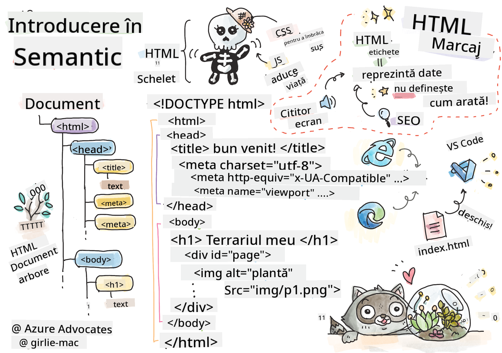
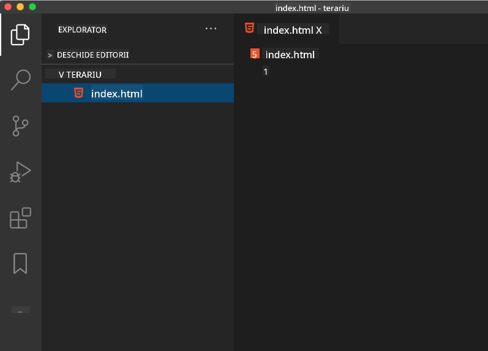

<!--
CO_OP_TRANSLATOR_METADATA:
{
  "original_hash": "46a0639e719b9cf1dfd062aa24cad639",
  "translation_date": "2025-08-28T08:11:36+00:00",
  "source_file": "3-terrarium/1-intro-to-html/README.md",
  "language_code": "ro"
}
-->
# Proiect Terrarium Partea 1: Introducere în HTML


> Sketchnote de [Tomomi Imura](https://twitter.com/girlie_mac)

## Test înainte de lecție

[Test înainte de lecție](https://ff-quizzes.netlify.app/web/quiz/15)

> Vizionați videoclipul

> 
> [](https://www.youtube.com/watch?v=1TvxJKBzhyQ)

### Introducere

HTML, sau HyperText Markup Language, este „scheletul” web-ului. Dacă CSS „îmbracă” HTML-ul și JavaScript îi dă viață, HTML este corpul aplicației tale web. Sintaxa HTML reflectă chiar această idee, incluzând taguri precum „head”, „body” și „footer”.

În această lecție, vom folosi HTML pentru a crea „scheletul” interfeței virtuale a terrariumului nostru. Va avea un titlu și trei coloane: o coloană dreaptă și una stângă unde vor fi plasate plantele care pot fi mutate, și o zonă centrală care va fi terrariumul propriu-zis, cu aspect de sticlă. Până la sfârșitul acestei lecții, vei putea vedea plantele în coloane, dar interfața va arăta puțin ciudat; nu te îngrijora, în secțiunea următoare vei adăuga stiluri CSS pentru a îmbunătăți aspectul interfeței.

### Sarcină

Pe computerul tău, creează un folder numit 'terrarium' și, în interiorul acestuia, un fișier numit 'index.html'. Poți face acest lucru în Visual Studio Code după ce creezi folderul terrarium, deschizând o fereastră nouă în VS Code, făcând clic pe 'open folder' și navigând la noul tău folder. Apasă pe butonul mic 'file' din panoul Explorer și creează noul fișier:



Sau

Folosește aceste comenzi în git bash:
* `mkdir terrarium`
* `cd terrarium`
* `touch index.html`
* `code index.html` sau `nano index.html`

> Fișierele index.html indică unui browser că acesta este fișierul implicit dintr-un folder; URL-uri precum `https://anysite.com/test` ar putea fi construite folosind o structură de folder care include un folder numit `test` cu `index.html` în interior; `index.html` nu trebuie să apară în URL.

---

## DocType și tagurile html

Prima linie a unui fișier HTML este doctype-ul său. Este puțin surprinzător că trebuie să ai această linie chiar în partea de sus a fișierului, dar aceasta spune browserelor mai vechi că pagina trebuie să fie redată în modul standard, conform specificației actuale HTML.

> Sfat: în VS Code, poți trece cursorul peste un tag și obține informații despre utilizarea sa din ghidurile de referință MDN.

A doua linie ar trebui să fie tagul de deschidere `<html>`, urmat imediat de tagul său de închidere `</html>`. Aceste taguri sunt elementele rădăcină ale interfeței tale.

### Sarcină

Adaugă aceste linii în partea de sus a fișierului tău `index.html`:

```HTML
<!DOCTYPE html>
<html></html>
```

✅ Există câteva moduri diferite care pot fi determinate prin setarea DocType-ului cu un șir de interogare: [Modul Quirks și Modul Standard](https://developer.mozilla.org/docs/Web/HTML/Quirks_Mode_and_Standards_Mode). Aceste moduri erau folosite pentru a sprijini browsere foarte vechi care nu mai sunt utilizate în mod obișnuit (Netscape Navigator 4 și Internet Explorer 5). Poți rămâne la declarația standard a doctype-ului.

---

## 'Head'-ul documentului

Zona 'head' a documentului HTML include informații esențiale despre pagina ta web, cunoscute și sub numele de [metadata](https://developer.mozilla.org/docs/Web/HTML/Element/meta). În cazul nostru, spunem serverului web către care va fi trimisă această pagină să fie redată următoarele patru lucruri:

-   titlul paginii
-   metadatele paginii, inclusiv:
    -   'setul de caractere', care indică ce codificare de caractere este utilizată în pagină
    -   informații despre browser, inclusiv `x-ua-compatible`, care indică faptul că browserul IE=edge este suportat
    -   informații despre cum ar trebui să se comporte viewport-ul atunci când este încărcat. Setarea viewport-ului cu o scală inițială de 1 controlează nivelul de zoom atunci când pagina este încărcată pentru prima dată.

### Sarcină

Adaugă un bloc 'head' în documentul tău între tagurile de deschidere și închidere `<html>`.

```html
<head>
	<title>Welcome to my Virtual Terrarium</title>
	<meta charset="utf-8" />
	<meta http-equiv="X-UA-Compatible" content="IE=edge" />
	<meta name="viewport" content="width=device-width, initial-scale=1" />
</head>
```

✅ Ce s-ar întâmpla dacă ai seta un tag meta pentru viewport astfel: `<meta name="viewport" content="width=600">`? Citește mai multe despre [viewport](https://developer.mozilla.org/docs/Web/HTML/Viewport_meta_tag).

---

## 'Body'-ul documentului

### Taguri HTML

În HTML, adaugi taguri în fișierul .html pentru a crea elemente ale unei pagini web. Fiecare tag are de obicei un tag de deschidere și unul de închidere, cum ar fi: `<p>hello</p>` pentru a indica un paragraf. Creează corpul interfeței tale adăugând un set de taguri `<body>` în interiorul perechii de taguri `<html>`; acum, markup-ul tău arată astfel:

### Sarcină

```html
<!DOCTYPE html>
<html>
	<head>
		<title>Welcome to my Virtual Terrarium</title>
		<meta charset="utf-8" />
		<meta http-equiv="X-UA-Compatible" content="IE=edge" />
		<meta name="viewport" content="width=device-width, initial-scale=1" />
	</head>
	<body></body>
</html>
```

Acum poți începe să construiești pagina ta. De obicei, folosești taguri `<div>` pentru a crea elementele separate ale unei pagini. Vom crea o serie de elemente `<div>` care vor conține imagini.

### Imagini

Un tag HTML care nu necesită un tag de închidere este ``, deoarece are un element `src` care conține toate informațiile necesare pentru ca pagina să redea elementul.

Creează un folder în aplicația ta numit `images` și, în acesta, adaugă toate imaginile din [folderul sursă](../../../../3-terrarium/solution/images); (există 14 imagini cu plante).

### Sarcină

Adaugă acele imagini ale plantelor în două coloane între tagurile `<body></body>`:

```html
<div id="page">
	<div id="left-container" class="container">
		<div class="plant-holder">
			
		</div>
		<div class="plant-holder">
			
		</div>
		<div class="plant-holder">
			
		</div>
		<div class="plant-holder">
			
		</div>
		<div class="plant-holder">
			
		</div>
		<div class="plant-holder">
			
		</div>
		<div class="plant-holder">
			
		</div>
	</div>
	<div id="right-container" class="container">
		<div class="plant-holder">
			
		</div>
		<div class="plant-holder">
			
		</div>
		<div class="plant-holder">
			
		</div>
		<div class="plant-holder">
			
		</div>
		<div class="plant-holder">
			
		</div>
		<div class="plant-holder">
			
		</div>
		<div class="plant-holder">
			
		</div>
	</div>
</div>
```

> Notă: Spans vs. Divs. Divs sunt considerate elemente 'block', iar Spans sunt 'inline'. Ce s-ar întâmpla dacă ai transforma aceste div-uri în span-uri?

Cu acest markup, plantele apar acum pe ecran. Arată destul de rău, deoarece nu sunt încă stilizate folosind CSS, și vom face acest lucru în lecția următoare.

Fiecare imagine are un text alternativ care va apărea chiar dacă nu poți vedea sau reda o imagine. Acesta este un atribut important de inclus pentru accesibilitate. Vei învăța mai multe despre accesibilitate în lecțiile viitoare; pentru moment, amintește-ți că atributul alt oferă informații alternative pentru o imagine dacă un utilizator, dintr-un motiv oarecare, nu o poate vizualiza (din cauza unei conexiuni lente, a unei erori în atributul src sau dacă utilizatorul folosește un cititor de ecran).

✅ Ai observat că fiecare imagine are același tag alt? Este aceasta o practică bună? De ce sau de ce nu? Poți îmbunătăți acest cod?

---

## Markup semantic

În general, este preferabil să folosești 'semantica' semnificativă atunci când scrii HTML. Ce înseamnă asta? Înseamnă să folosești taguri HTML pentru a reprezenta tipul de date sau interacțiune pentru care au fost concepute. De exemplu, textul principal al unui titlu pe o pagină ar trebui să folosească un tag `<h1>`.

Adaugă următoarea linie chiar sub tagul de deschidere `<body>`:

```html
<h1>My Terrarium</h1>
```

Folosirea markup-ului semantic, cum ar fi utilizarea titlurilor `<h1>` și a listelor neordonate `<ul>`, ajută cititoarele de ecran să navigheze printr-o pagină. În general, butoanele ar trebui să fie scrise ca `<button>` și listele ca `<li>`. Deși este _posibil_ să folosești elemente `<span>` stilizate special cu gestionare de clicuri pentru a imita butoanele, este mai bine pentru utilizatorii cu dizabilități să folosească tehnologii pentru a determina unde se află un buton pe o pagină și să interacționeze cu acesta, dacă elementul apare ca un buton. Din acest motiv, încearcă să folosești markup semantic cât mai mult posibil.

✅ Aruncă o privire la un cititor de ecran și [cum interacționează cu o pagină web](https://www.youtube.com/watch?v=OUDV1gqs9GA). Poți vedea de ce markup-ul nesemantic ar putea frustra utilizatorul?

## Terrariumul

Ultima parte a acestei interfețe implică crearea unui markup care va fi stilizat pentru a crea un terrarium.

### Sarcină:

Adaugă acest markup deasupra ultimului tag `</div>`:

```html
<div id="terrarium">
	<div class="jar-top"></div>
	<div class="jar-walls">
		<div class="jar-glossy-long"></div>
		<div class="jar-glossy-short"></div>
	</div>
	<div class="dirt"></div>
	<div class="jar-bottom"></div>
</div>
```

✅ Deși ai adăugat acest markup pe ecran, nu vezi absolut nimic redat. De ce?

---

## 🚀Provocare

Există câteva taguri 'mai vechi' în HTML care sunt încă distractive de utilizat, deși nu ar trebui să folosești taguri depreciate precum [aceste taguri](https://developer.mozilla.org/docs/Web/HTML/Element#Obsolete_and_deprecated_elements) în markup-ul tău. Totuși, poți folosi vechiul tag `<marquee>` pentru a face titlul h1 să se deruleze orizontal? (dacă o faci, nu uita să-l elimini ulterior)

## Test după lecție

[Test după lecție](https://ff-quizzes.netlify.app/web/quiz/16)

## Recapitulare și studiu individual

HTML este sistemul de construcție „testat și adevărat” care a ajutat la construirea web-ului așa cum îl cunoaștem astăzi. Învață puțin despre istoria sa studiind unele taguri vechi și noi. Poți să-ți dai seama de ce unele taguri au fost depreciate și altele adăugate? Ce taguri ar putea fi introduse în viitor?

Află mai multe despre construirea site-urilor pentru web și dispozitive mobile la [Microsoft Learn](https://docs.microsoft.com/learn/modules/build-simple-website/?WT.mc_id=academic-77807-sagibbon).

## Temă

[Exersează HTML-ul: Construiește un mockup de blog](assignment.md)

---

**Declinarea responsabilității**:  
Acest document a fost tradus folosind serviciul de traducere AI [Co-op Translator](https://github.com/Azure/co-op-translator). Deși depunem eforturi pentru a asigura acuratețea, vă rugăm să rețineți că traducerile automate pot conține erori sau inexactități. Documentul original în limba sa nativă ar trebui considerat sursa autoritară. Pentru informații critice, se recomandă traducerea profesională realizată de un specialist uman. Nu ne asumăm răspunderea pentru eventualele neînțelegeri sau interpretări greșite care pot apărea din utilizarea acestei traduceri.