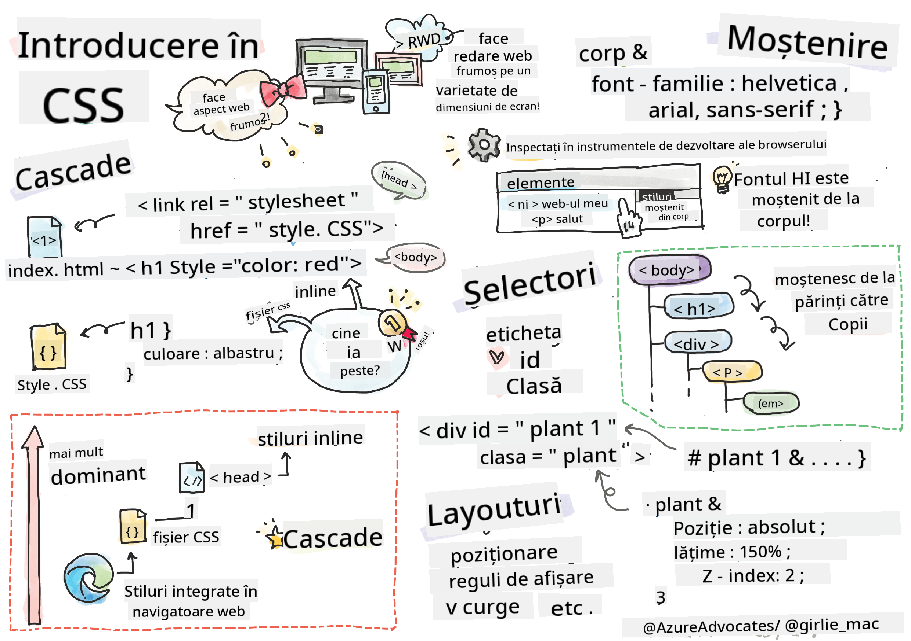
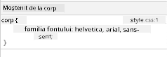
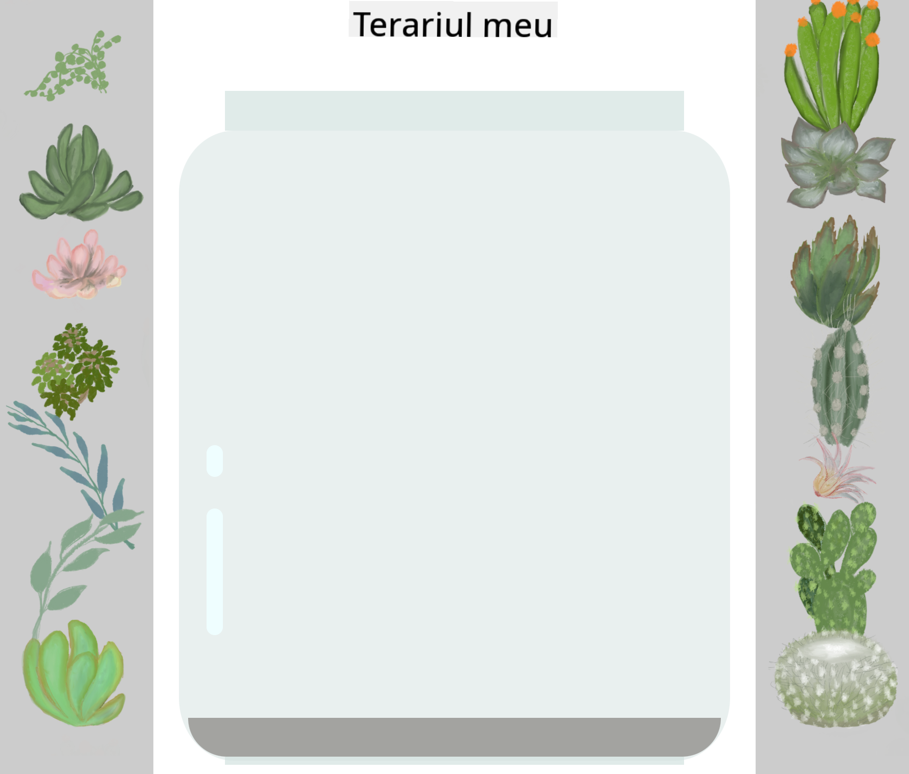

<!--
CO_OP_TRANSLATOR_METADATA:
{
  "original_hash": "acb5ae00cde004304296bb97da8ff4c3",
  "translation_date": "2025-08-29T11:35:52+00:00",
  "source_file": "3-terrarium/2-intro-to-css/README.md",
  "language_code": "ro"
}
-->
# Proiect Terrarium Partea 2: Introducere în CSS


> Sketchnote de [Tomomi Imura](https://twitter.com/girlie_mac)

## Test înainte de lecție

[Test înainte de lecție](https://ff-quizzes.netlify.app/web/quiz/17)

### Introducere

CSS, sau Cascading Style Sheets, rezolvă o problemă importantă în dezvoltarea web: cum să faci ca site-ul tău să arate bine. Stilizarea aplicațiilor le face mai ușor de utilizat și mai plăcute vizual; de asemenea, poți folosi CSS pentru a crea Design Web Responsiv (RWD) - permițând aplicațiilor tale să arate bine indiferent de dimensiunea ecranului pe care sunt afișate. CSS nu este doar despre aspect; specificațiile sale includ animații și transformări care pot permite interacțiuni sofisticate pentru aplicațiile tale. Grupul de Lucru CSS ajută la menținerea specificațiilor CSS actuale; poți urmări activitatea lor pe [site-ul World Wide Web Consortium](https://www.w3.org/Style/CSS/members).

> Notă, CSS este o limbă care evoluează, la fel ca tot ce ține de web, și nu toate browserele suportă cele mai noi părți ale specificației. Verifică întotdeauna implementările consultând [CanIUse.com](https://caniuse.com).

În această lecție, vom adăuga stiluri la terrarium-ul nostru online și vom învăța mai multe despre câteva concepte CSS: cascada, moștenirea, utilizarea selectorilor, poziționarea și utilizarea CSS pentru a construi layout-uri. În proces, vom crea layout-ul terrarium-ului și vom construi efectiv terrarium-ul.

### Prerechizite

Ar trebui să ai HTML-ul pentru terrarium-ul tău construit și pregătit pentru a fi stilizat.

> Vezi videoclipul

> 
> [](https://www.youtube.com/watch?v=6yIdOIV9p1I)

### Sarcină

În folderul terrarium-ului tău, creează un fișier nou numit `style.css`. Importă acel fișier în secțiunea `<head>`:

```html
<link rel="stylesheet" href="./style.css" />
```

---

## Cascada

Cascading Style Sheets încorporează ideea că stilurile 'cascadă', astfel încât aplicarea unui stil este ghidată de prioritatea sa. Stilurile setate de autorul unui site web au prioritate față de cele setate de un browser. Stilurile setate 'inline' au prioritate față de cele setate într-un fișier de stil extern.

### Sarcină

Adaugă stilul inline "color: red" la tag-ul `<h1>`:

```HTML
<h1 style="color: red">My Terrarium</h1>
```

Apoi, adaugă următorul cod în fișierul tău `style.css`:

```CSS
h1 {
 color: blue;
}
```

✅ Ce culoare se afișează în aplicația ta web? De ce? Poți găsi o modalitate de a suprascrie stilurile? Când ai vrea să faci asta sau de ce nu?

---

## Moștenirea

Stilurile sunt moștenite de la un stil al unui strămoș la un descendent, astfel încât elementele imbricate moștenesc stilurile părinților lor.

### Sarcină

Setează fontul corpului la un font dat și verifică fontul unui element imbricat:

```CSS
body {
	font-family: helvetica, arial, sans-serif;
}
```

Deschide consola browserului la tab-ul 'Elements' și observă fontul H1. Acesta moștenește fontul de la body, așa cum este indicat în browser:



✅ Poți face ca un stil imbricat să moștenească o proprietate diferită?

---

## Selectori CSS

### Tag-uri

Până acum, fișierul tău `style.css` are doar câteva tag-uri stilizate, iar aplicația arată destul de ciudat:

```CSS
body {
	font-family: helvetica, arial, sans-serif;
}

h1 {
	color: #3a241d;
	text-align: center;
}
```

Acest mod de a stiliza un tag îți oferă control asupra elementelor unice, dar ai nevoie să controlezi stilurile multor plante din terrarium-ul tău. Pentru a face asta, trebuie să folosești selectorii CSS.

### Id-uri

Adaugă un stil pentru a aranja containerele din stânga și dreapta. Deoarece există doar un container stânga și doar un container dreapta, acestea au primit id-uri în markup. Pentru a le stiliza, folosește `#`:

```CSS
#left-container {
	background-color: #eee;
	width: 15%;
	left: 0px;
	top: 0px;
	position: absolute;
	height: 100%;
	padding: 10px;
}

#right-container {
	background-color: #eee;
	width: 15%;
	right: 0px;
	top: 0px;
	position: absolute;
	height: 100%;
	padding: 10px;
}
```

Aici, ai plasat aceste containere cu poziționare absolută la extremitățile stânga și dreapta ale ecranului și ai folosit procente pentru lățimea lor astfel încât să se poată adapta la ecrane mici de mobil.

✅ Acest cod este destul de repetitiv, deci nu este "DRY" (Don't Repeat Yourself); poți găsi o modalitate mai bună de a stiliza aceste id-uri, poate cu un id și o clasă? Ar trebui să schimbi markup-ul și să refactorizezi CSS-ul:

```html
<div id="left-container" class="container"></div>
```

### Clase

În exemplul de mai sus, ai stilizat două elemente unice pe ecran. Dacă vrei ca stilurile să se aplice la mai multe elemente pe ecran, poți folosi clase CSS. Fă asta pentru a aranja plantele în containerele din stânga și dreapta.

Observă că fiecare plantă din markup-ul HTML are o combinație de id-uri și clase. Id-urile aici sunt folosite de JavaScript-ul pe care îl vei adăuga mai târziu pentru a manipula plasarea plantelor în terrarium. Clasele, însă, oferă tuturor plantelor un stil dat.

```html
<div class="plant-holder">
	
</div>
```

Adaugă următorul cod în fișierul tău `style.css`:

```CSS
.plant-holder {
	position: relative;
	height: 13%;
	left: -10px;
}

.plant {
	position: absolute;
	max-width: 150%;
	max-height: 150%;
	z-index: 2;
}
```

Notabil în acest fragment este amestecul de poziționare relativă și absolută, pe care îl vom acoperi în secțiunea următoare. Uită-te la modul în care înălțimile sunt gestionate prin procente:

Ai setat înălțimea suportului pentru plante la 13%, un număr bun pentru a te asigura că toate plantele sunt afișate în fiecare container vertical fără a fi nevoie de scroll.

Ai setat suportul pentru plante să se deplaseze spre stânga pentru a permite plantelor să fie mai centrate în containerul lor. Imaginile au o cantitate mare de fundal transparent pentru a le face mai ușor de mutat, așa că trebuie împinse spre stânga pentru a se potrivi mai bine pe ecran.

Apoi, planta în sine a primit o lățime maximă de 150%. Acest lucru îi permite să se micșoreze pe măsură ce browserul se micșorează. Încearcă să redimensionezi browserul; plantele rămân în containerele lor, dar se micșorează pentru a se potrivi.

De asemenea, este notabilă utilizarea z-index, care controlează altitudinea relativă a unui element (astfel încât plantele să stea deasupra containerului și să pară că sunt în interiorul terrarium-ului).

✅ De ce ai nevoie atât de un selector CSS pentru suportul plantei, cât și pentru plantă?

## Poziționarea CSS

Amestecarea proprietăților de poziționare (există poziții statice, relative, fixe, absolute și sticky) poate fi puțin complicată, dar atunci când este făcută corect îți oferă un control bun asupra elementelor de pe paginile tale.

Elementele poziționate absolut sunt poziționate relativ față de cei mai apropiați strămoși poziționați, iar dacă nu există niciunul, sunt poziționate conform corpului documentului.

Elementele poziționate relativ sunt poziționate pe baza direcțiilor CSS pentru a ajusta plasarea lor față de poziția inițială.

În exemplul nostru, `plant-holder` este un element poziționat relativ care este poziționat în interiorul unui container poziționat absolut. Comportamentul rezultat este că barele laterale sunt fixate la stânga și dreapta, iar `plant-holder` este imbricat, ajustându-se în interiorul barelor laterale, oferind spațiu pentru ca plantele să fie plasate într-un rând vertical.

> Planta în sine are, de asemenea, poziționare absolută, necesară pentru a o face mutabilă, așa cum vei descoperi în lecția următoare.

✅ Experimentează cu schimbarea tipurilor de poziționare ale containerelor laterale și ale `plant-holder`. Ce se întâmplă?

## Layout-uri CSS

Acum vei folosi ceea ce ai învățat pentru a construi terrarium-ul propriu-zis, totul folosind CSS!

Mai întâi, stilizează copiii div-ului `.terrarium` ca un dreptunghi rotunjit folosind CSS:

```CSS
.jar-walls {
	height: 80%;
	width: 60%;
	background: #d1e1df;
	border-radius: 1rem;
	position: absolute;
	bottom: 0.5%;
	left: 20%;
	opacity: 0.5;
	z-index: 1;
}

.jar-top {
	width: 50%;
	height: 5%;
	background: #d1e1df;
	position: absolute;
	bottom: 80.5%;
	left: 25%;
	opacity: 0.7;
	z-index: 1;
}

.jar-bottom {
	width: 50%;
	height: 1%;
	background: #d1e1df;
	position: absolute;
	bottom: 0%;
	left: 25%;
	opacity: 0.7;
}

.dirt {
	width: 60%;
	height: 5%;
	background: #3a241d;
	position: absolute;
	border-radius: 0 0 1rem 1rem;
	bottom: 1%;
	left: 20%;
	opacity: 0.7;
	z-index: -1;
}
```

Observă utilizarea procentelor aici. Dacă micșorezi browserul, poți vedea cum borcanul se adaptează. De asemenea, observă procentele pentru lățimile și înălțimile elementelor borcanului și modul în care fiecare element este poziționat absolut în centru, fixat la partea de jos a viewport-ului.

Folosim și `rem` pentru border-radius, o lungime relativă la font. Citește mai multe despre acest tip de măsurare relativă în [specificația CSS](https://www.w3.org/TR/css-values-3/#font-relative-lengths).

✅ Încearcă să schimbi culorile borcanului și opacitatea față de cele ale pământului. Ce se întâmplă? De ce?

---

## 🚀Provocare

Adaugă o strălucire 'bubble' în zona din stânga jos a borcanului pentru a-l face să arate mai asemănător cu sticla. Vei stiliza `.jar-glossy-long` și `.jar-glossy-short` pentru a arăta ca o strălucire reflectată. Iată cum ar arăta:



Pentru a finaliza testul de după lecție, parcurge acest modul Learn: [Stilizează aplicația ta HTML cu CSS](https://docs.microsoft.com/learn/modules/build-simple-website/4-css-basics/?WT.mc_id=academic-77807-sagibbon)

## Test după lecție

[Test după lecție](https://ff-quizzes.netlify.app/web/quiz/18)

## Recapitulare și Studiu Individual

CSS pare înșelător de simplu, dar există multe provocări atunci când încerci să stilizezi o aplicație perfect pentru toate browserele și toate dimensiunile ecranului. CSS-Grid și Flexbox sunt instrumente care au fost dezvoltate pentru a face munca puțin mai structurată și mai fiabilă. Învață despre aceste instrumente jucând [Flexbox Froggy](https://flexboxfroggy.com/) și [Grid Garden](https://codepip.com/games/grid-garden/).

## Temă

[Refactorizare CSS](assignment.md)

---

**Declinarea responsabilității**:  
Acest document a fost tradus folosind serviciul de traducere AI [Co-op Translator](https://github.com/Azure/co-op-translator). Deși depunem eforturi pentru a asigura acuratețea, vă rugăm să rețineți că traducerile automate pot conține erori sau inexactități. Documentul original în limba sa nativă ar trebui considerat sursa autoritară. Pentru informații critice, se recomandă traducerea profesională realizată de un specialist uman. Nu ne asumăm răspunderea pentru eventualele neînțelegeri sau interpretări greșite care pot apărea din utilizarea acestei traduceri.