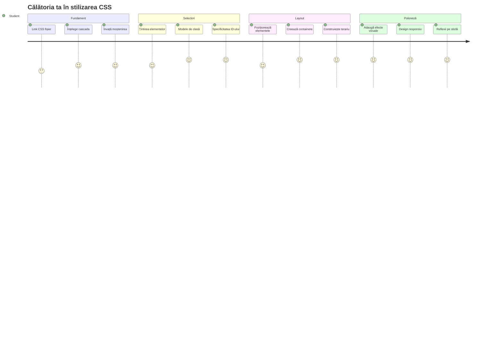
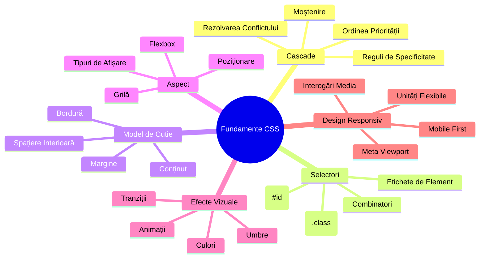
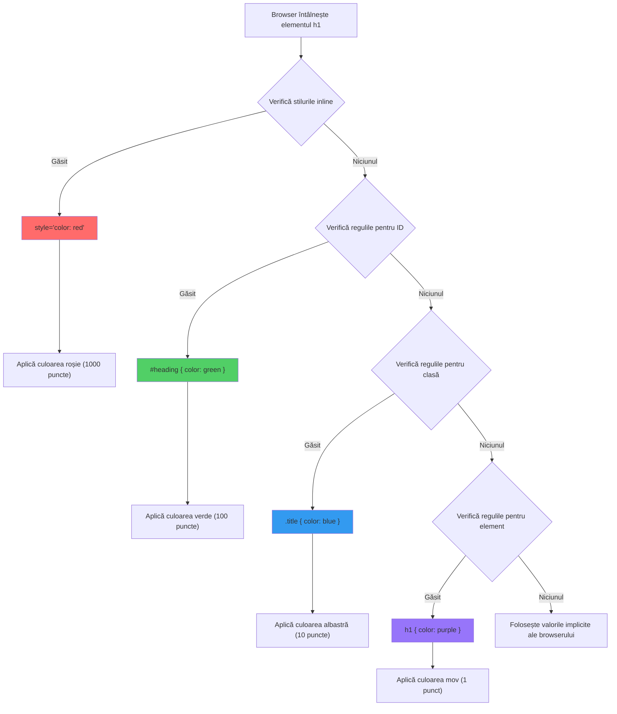
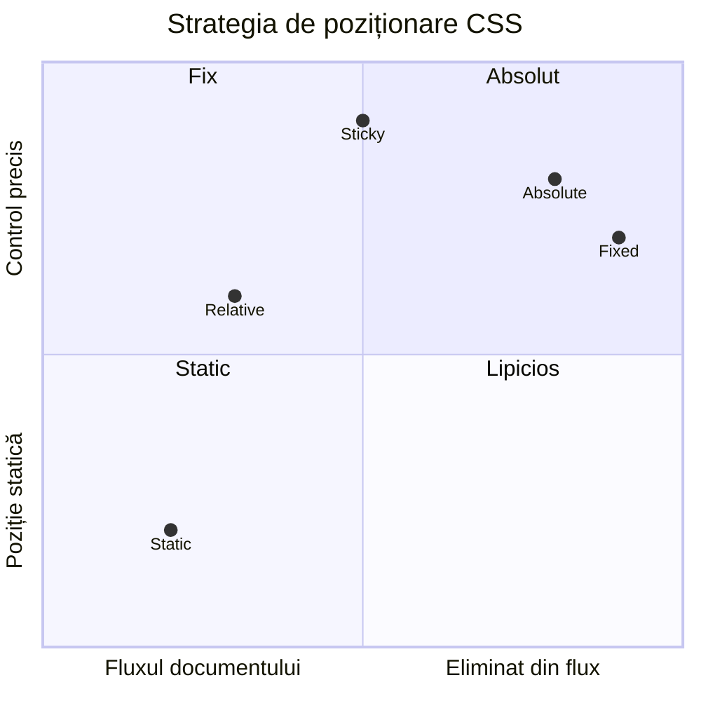
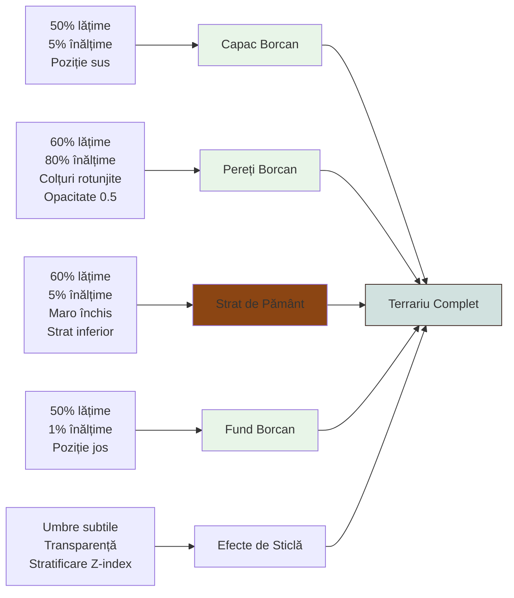
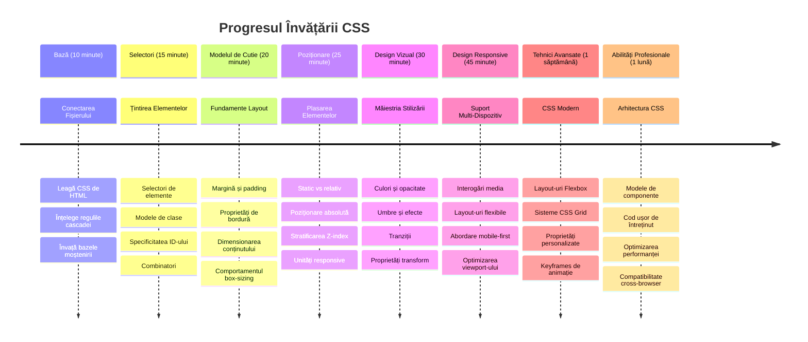

<!--
CO_OP_TRANSLATOR_METADATA:
{
  "original_hash": "e39f3a4e3bcccf94639e3af1248f8a4d",
  "translation_date": "2026-01-07T06:13:30+00:00",
  "source_file": "3-terrarium/2-intro-to-css/README.md",
  "language_code": "ro"
}
-->
# Proiectul Terrarium Partea 2: Introducere în CSS



> Sketchnote realizat de [Tomomi Imura](https://twitter.com/girlie_mac)

Îți amintești cum arăta terrariul tău HTML destul de simplu? CSS este locul unde transformăm acea structură simplă într-un ceva atrăgător vizual.

Dacă HTML este ca și construcția structurii unei case, atunci CSS este tot ceea ce o face să se simtă ca acasă - culorile vopselei, aranjamentul mobilei, iluminatul și cum se îmbină încăperile între ele. Gândește-te cum Palatul de la Versailles a început ca o cabană simplă de vânătoare, dar atenția atentă asupra decorului și a aranjamentului l-a transformat într-una dintre cele mai magnifice clădiri din lume.

Astăzi, vom transforma terrariul tău din funcțional în finisat. Vei învăța cum să poziționezi elementele precis, să faci ca layout-urile să răspundă la diferite dimensiuni ale ecranului și să creezi un farmec vizual care face site-urile captivante.

La finalul acestei lecții, vei vedea cum stilizarea strategică CSS poate îmbunătăți dramatic proiectul tău. Hai să adăugăm puțin stil terrariului tău.


## Test Preliminar înainte de Lecție

[Test pre-lectură](https://ff-quizzes.netlify.app/web/quiz/17)

## Începând cu CSS

CSS este adesea considerat doar „a face lucrurile frumoase,” dar servește unui scop mult mai larg. CSS este ca și cum ai fi regizorul unui film - controlezi nu doar cum arată totul, ci și cum se mișcă, răspunde la interacțiuni și se adaptează la diferite situații.

CSS-ul modern este remarcabil de capabil. Poți scrie cod care ajustează automat layout-urile pentru telefoane, tablete și computere desktop. Poți crea animații fluide care ghidează atenția utilizatorilor acolo unde este nevoie. Rezultatele pot fi foarte impresionante când totul funcționează împreună.

> 💡 **Sfat Pro**: CSS evoluează constant cu funcționalități și capacități noi. Verifică întotdeauna [CanIUse.com](https://caniuse.com) pentru a verifica suportul browserelor pentru caracteristicile CSS mai noi înainte de a le folosi în proiecte de producție.

**Iată ce vom realiza în această lecție:**
- **Creăm** un design vizual complet pentru terrariul tău folosind tehnici CSS moderne
- **Explorăm** concepte fundamentale precum cascadele, moștenirea și selectoarele CSS
- **Implementăm** poziționare și strategii de layout responsive
- **Construim** containerul terrariului folosind forme și stilizare CSS

### Prerechizită

Ar trebui să fi finalizat structura HTML pentru terrariul tău din lecția anterioară și să o ai gata pentru stilizare.

> 📺 **Resursă Video**: Urmărește acest tutorial video util  
>  
> [](https://www.youtube.com/watch?v=6yIdOIV9p1I)

### Configurarea Fișierului tău CSS

Înainte să începem să stilizăm, trebuie să conectăm CSS la HTML-ul nostru. Această conexiune spune browserului unde să găsească instrucțiunile de stilizare pentru terrariul nostru.

În folderul terrariului, creează un fișier nou numit `style.css`, apoi leagă-l în secțiunea `<head>` a documentului tău HTML:

```html
<link rel="stylesheet" href="./style.css" />
```

**Ce face acest cod:**
- **Creează** o conexiune între fișierele tale HTML și CSS
- **Spune** browserului să încarce și să aplice stilurile din `style.css`
- **Folosește** atributul `rel="stylesheet"` pentru a specifica că este un fișier CSS
- **Face referire** la calea fișierului cu `href="./style.css"`

## Înțelegerea Cascadei CSS

Te-ai întrebat vreodată de ce CSS se numește „foi de stil cascade”? Stilurile se cascadesc ca o cascadă, și uneori intră în conflict unele cu altele.

Gândește-te la cum funcționează structurile militare de comanda - o ordine generală poate spune „toți soldații să poarte verde,” dar o ordine specifică unității tale poate spune „purtați uniforma albastră pentru ceremonie.” Instrucțiunea mai specifică are prioritate. CSS urmează o logică similară, iar înțelegerea acestei ierarhii face debugging-ul mult mai ușor.

### Experimentând Prioritatea Cascadei

Hai să vedem cascada în acțiune prin crearea unui conflict de stiluri. Mai întâi, adaugă un stil inline la tag-ul tău `<h1>`:

```html
<h1 style="color: red">My Terrarium</h1>
```

**Ce face acest cod:**
- **Aplică** culoarea roșie direct elementului `<h1>` folosind stilare inline 
- **Folosește** atributul `style` pentru a introduce CSS direct în HTML
- **Creează** regula de stil cu cea mai înaltă prioritate pentru acest element specific

Apoi, adaugă această regulă în fișierul `style.css`:

```css
h1 {
  color: blue;
}
```

**În exemplul de mai sus, am:**
- **Definit** o regulă CSS care vizează toate elementele `<h1>`
- **Setat** culoarea textului pe albastru folosind o foaie de stil externă
- **Creat** o regulă cu prioritate mai mică față de stilurile inline

✅ **Verificare Cunoștințe**: Ce culoare se afișează în aplicația ta web? De ce câștigă acea culoare? Poți să te gândești la scenarii în care ai dori să suprascrii stiluri?


> 💡 **Ordinea Priorității CSS (de la cea mai înaltă la cea mai joasă):**
> 1. **Stilurile inline** (atributul style)
> 2. **ID-urile** (#myId)
> 3. **Clasele** (.myClass) și atributele
> 4. **Selectorii de elemente** (h1, div, p)
> 5. **Valorile implicite ale browserului**

## Moștenirea CSS în Acțiune

Moștenirea CSS funcționează ca genetica - elementele moștenesc anumite proprietăți de la elementele părinte. Dacă setezi familia fontului pe elementul body, tot textul din interior folosește automat acel font. Este similar cu modul în care linia maxilarului distinctivă a familiei Habsburg a apărut peste generații fără a fi specificată pentru fiecare individ.

Totuși, nu totul este moștenit. Stilurile textului precum fonturile și culorile se moștenesc, dar proprietățile de layout precum marginile și bordurile nu. Asemenea copiilor care moștenesc trăsături fizice, dar nu alegerile vestimentare ale părinților.

### Observarea Moștenirii Fontului

Hai să vedem moștenirea în acțiune setând o familie de fonturi pe elementul `<body>`:

```css
body {
  font-family: 'Segoe UI', Tahoma, Geneva, Verdana, sans-serif;
}
```

**Ce se întâmplă aici:**
- **Setează** familia fontului pentru întreaga pagină prin targetarea elementului `<body>`
- **Folosește** un șir de fonturi cu opțiuni de fallback pentru o compatibilitate mai bună a browserului
- **Aplică** fonturile moderne de sistem care arată bine pe diferite sisteme de operare
- **Asigură** că toate elementele copil moștenesc acest font, cu excepția cazului în care este suprascris special

Deschide unelte pentru dezvoltatori în browserul tău (F12), navighează la fila Elements, și inspectează elementul `<h1>`. Vei vedea că acesta moștenește familia fontului de la body:


✅ **Experiment**: Încearcă să setezi alte proprietăți moștenitoare pe `<body>` precum `color`, `line-height` sau `text-align`. Ce se întâmplă cu titlul și celelalte elemente?

> 📝 **Proprietăți Moștenibile includ**: `color`, `font-family`, `font-size`, `line-height`, `text-align`, `visibility`  
>  
> **Proprietăți NEMOȘTENIBILE includ**: `margin`, `padding`, `border`, `width`, `height`, `position`

### 🔄 **Verificare Pedagogică**  
**Înțelegerea Bazelor CSS**: Înainte să treci la selectori, asigură-te că poți:  
- ✅ Explica diferența dintre cascade și moștenire  
- ✅ Prezice care stil va câștiga într-un conflict de specificitate  
- ✅ Identifica proprietățile ce se moștenesc de la elementele părinte  
- ✅ Conecta corect fișierele CSS cu HTML

**Test rapid**: Dacă ai aceste stiluri, ce culoare va avea un `<h1>` într-un `<div class="special">`?  
```css
div { color: blue; }
.special { color: green; }
h1 { color: red; }
```
*Răspuns: Roșu (selectorul de element țintește direct h1)*

## Stăpânirea Selectoarelor CSS

Selectoarele CSS sunt modul tău de a viza elemente specifice pentru stilizare. Funcționează ca și cum ai da indicații precise - în loc să spui „casa,” ai putea spune „casa albastră cu ușa roșie de pe strada Maple.”

CSS oferă diferite moduri de a fi specific, iar alegerea selectorului potrivit este ca alegerea uneltei potrivite pentru sarcină. Uneori trebuie să stilizezi toate ușile din cartier, alteori doar o ușă specifică.

### Selectori de Elemente (Tag-uri)

Selectorii de elemente vizează elementele HTML după numele tag-ului lor. Sunt perfecți pentru a seta stiluri de bază care se aplică pe scară largă pe pagina ta:

```css
body {
  font-family: 'Segoe UI', Tahoma, Geneva, Verdana, sans-serif;
  margin: 0;
  padding: 0;
}

h1 {
  color: #3a241d;
  text-align: center;
  font-size: 2.5rem;
  margin-bottom: 1rem;
}
```

**Înțelegerea acestor stiluri:**
- **Setează** o tipografie consistentă pe întreaga pagină cu selectorul `body`
- **Înlătură** marginile implicite și padding-ul browserului pentru un control mai bun
- **Stilizează** toate elementele de titlu cu culoare, aliniere și spațiere
- **Folosește** unități `rem` pentru redimensionarea scalabilă și accesibilă a fontului

Deși selectorii de elemente sunt buni pentru stilizarea generală, vei avea nevoie de selectori mai specifici pentru a stiliza componente individuale precum plantele din terrariul tău.

### Selectori ID pentru Elemente Unice

Selectorii ID folosesc simbolul `#` și țintesc elemente cu atribute `id` specifice. Deoarece ID-urile trebuie să fie unice pe o pagină, sunt perfecți pentru stilizarea elementelor individuale, speciale, cum ar fi containerele laterale stânga și dreapta pentru plantele noastre.

Hai să creăm stilul pentru containerele laterale ale terrariului unde vor locui plantele:

```css
#left-container {
  background-color: #f5f5f5;
  width: 15%;
  left: 0;
  top: 0;
  position: absolute;
  height: 100vh;
  padding: 1rem;
  box-sizing: border-box;
}

#right-container {
  background-color: #f5f5f5;
  width: 15%;
  right: 0;
  top: 0;
  position: absolute;
  height: 100vh;
  padding: 1rem;
  box-sizing: border-box;
}
```

**Ce realizează acest cod:**
- **Poziționează** containerele la marginea foarte stângă și cea dreaptă folosind poziționarea `absolute`
- **Folosește** unități `vh` (înălțimea viewport-ului) pentru înălțime responsive care se adaptează la dimensiunea ecranului
- **Aplică** `box-sizing: border-box` astfel încât padding-ul este inclus în lățimea totală
- **Elimină** unitățile `px` inutile de la valorile zero pentru un cod mai curat
- **Setează** o culoare de fundal subtilă mai prietenoasă cu ochii în comparație cu griul aprins

✅ **Provocare Calitate Cod**: Observă cum acest CSS încalcă principiul DRY (Don't Repeat Yourself). Poți să îl refaci folosind atât un ID cât și o clasă?

**Abordare îmbunătățită:**  
```html
<div id="left-container" class="container"></div>
<div id="right-container" class="container"></div>
```
  
```css
.container {
  background-color: #f5f5f5;
  width: 15%;
  top: 0;
  position: absolute;
  height: 100vh;
  padding: 1rem;
  box-sizing: border-box;
}

#left-container {
  left: 0;
}

#right-container {
  right: 0;
}
```
  
### Selectori Clase pentru Stiluri Reutilizabile

Selectorii de clase folosesc simbolul `.` și sunt perfecți când vrei să aplici aceleași stiluri la mai multe elemente. Spre deosebire de ID-uri, clasele pot fi refolosite în tot HTML-ul, făcându-le ideale pentru modele consistente de stilizare.

În terrariul nostru, fiecare plantă necesită stiluri similare dar și poziționare individuală. Vom folosi o combinație de clase pentru stiluri comune și ID-uri pentru poziționare unică.

**Iată structura HTML pentru fiecare plantă:**  
```html
<div class="plant-holder">
  
</div>
```
  
**Elementele-cheie explicate:**  
- **Folosește** `class="plant-holder"` pentru un stil container consistent pentru toate plantele  
- **Aplică** `class="plant"` pentru stilizarea și comportamentul imaginii comune  
- **Include** `id="plant1"` unic pentru poziționare individuală și interacțiune JavaScript  
- **Oferă** text alternativ descriptiv pentru accesibilitatea cititorilor de ecran  

Acum adaugă aceste stiluri în fișierul tău `style.css`:  

```css
.plant-holder {
  position: relative;
  height: 13%;
  left: -0.6rem;
}

.plant {
  position: absolute;
  max-width: 150%;
  max-height: 150%;
  z-index: 2;
  transition: transform 0.3s ease;
}

.plant:hover {
  transform: scale(1.05);
}
```
  
**Ce fac aceste stiluri:**  
- **Creează** poziționare relativă pentru containerul plantelor pentru a stabili un context de poziționare  
- **Setează** fiecare container al plantei la 13% înălțime, asigurând că toate plantele încape vertical fără scroll  
- **Deplasează** containerele ușor spre stânga pentru a centra mai bine plantele în interior  
- **Permite** plantelor să se scaleze responsive cu proprietățile `max-width` și `max-height`  
- **Folosește** `z-index` pentru a suprapune plantele peste alte elemente din terrariu  
- **Adaugă** un efect subtil la hover cu tranziții CSS pentru o interacțiune mai plăcută  

✅ **Gândire Critică**: De ce avem nevoie atât de selectorii `.plant-holder`, cât și de `.plant`? Ce s-ar întâmpla dacă am folosi doar unul singur?

> 💡 **Model de Design**: Containerul (`.plant-holder`) controlează layout-ul și poziționarea, în timp ce conținutul (`.plant`) controlează aspectul și scalarea. Această separare face codul mai întreținut și flexibil.

## Înțelegerea Poziționării CSS

Poziționarea CSS este ca un regizor de scenă pentru o piesă de teatru - indici unde stă fiecare actor și cum se mișcă pe scenă. Unii actori urmează formația standard, în timp ce alții necesită poziționare specifică pentru efect dramatic.

Odată ce înțelegi poziționarea, multe provocări de layout devin gestionabile. Ai nevoie de o bară de navigare care să rămână în partea de sus în timp ce utilizatorii derulează? Poziționarea se ocupă de asta. Vrei un tooltip care apare într-un loc anume? Asta este tot poziționarea.

### Cele Cinci Valori de Poziționare


| Valoare Poziționare | Comportament | Caz de utilizare |
|---------------------|--------------|------------------|
| `static` | Fluxul implicit, ignoră top/left/right/bottom | Layout normal al documentului |
| `relative` | Poziționat relativ față de poziția sa normală | Ajustări mici, crearea contextului de poziționare |
| `absolute` | Poziționat relativ față de cel mai apropiat strămoș poziționat | Poziționare precisă, suprapuneri |
| `fixed` | Poziționat relativ față de fereastra de vizualizare (viewport) | Bare de navigare, elemente plutitoare |
| `sticky` | Comută între relative și fixed în funcție de derulare | Headere care rămân fixe la derulare |

### Poziționarea în Terrariul Nostru

Terrariul nostru folosește o combinație strategică de tipuri de poziționare pentru a crea layout-ul dorit:

```css
/* Container positioning */
.container {
  position: absolute; /* Removes from normal flow */
  /* ... other styles ... */
}

/* Plant holder positioning */
.plant-holder {
  position: relative; /* Creates positioning context */
  /* ... other styles ... */
}

/* Plant positioning */
.plant {
  position: absolute; /* Allows precise placement within holder */
  /* ... other styles ... */
}
```

**Înțelegerea strategiei de poziționare:**  
- **Containere absolute** sunt eliminate din fluxul normal al documentului și lipite de marginile ecranului  
- **Containerele relative pentru plante** creează un context de poziționare, rămânând totuși în fluxul documentului  
- **Plantele absolute** pot fi poziționate precis în interiorul containerelor relative  
- **Această combinație** permite plantelor să se suprapună vertical și să fie poziționate individual

> 🎯 **De ce contează asta**: Elementele `plant` au nevoie de poziționare absolută pentru a deveni dragabile în lecția următoare. Poziționarea absolută le scoate din fluxul normal, făcând posibile interacțiunile drag-and-drop.

✅ **Timp pentru experiment**: Încearcă să schimbi valorile poziționării și observă rezultatele:  
- Ce se întâmplă dacă schimbi `.container` din `absolute` în `relative`?
- Cum se modifică aspectul dacă `.plant-holder` folosește `absolute` în loc de `relative`?
- Ce se întâmplă când schimbi poziționarea `.plant` la `relative`?

### 🔄 **Verificare Pedagogică**
**Stăpânirea poziționării CSS**: Oprește-te să verifici înțelegerea ta:
- ✅ Poți explica de ce plantele au nevoie de poziționare absolută pentru drag-and-drop?
- ✅ Înțelegi cum containerele relative creează un context de poziționare?
- ✅ De ce folosesc containerele laterale poziționare absolută?
- ✅ Ce s-ar întâmpla dacă ai elimina complet declarațiile de poziționare?

**Conexiune cu lumea reală**: Gândește-te cum poziționarea CSS reflectă aspectele din lumea reală:
- **Static**: Cărți pe un raft (ordinea naturală)
- **Relative**: Mutând ușor o carte, dar păstrând locul ei
- **Absolute**: Punând un semn de carte la o pagină exactă
- **Fixed**: O notă lipicioasă care rămâne vizibilă când răsfoiești paginile

## Construirea Terrariului cu CSS

Acum vom construi un borcan de sticlă folosind doar CSS - fără imagini sau software grafic.

Crearea unui efect realist de sticlă, umbre și adâncime folosind poziționarea și transparența demonstrează capacitățile vizuale ale CSS. Această tehnică reflectă modul în care arhitecții din mișcarea Bauhaus foloseau forme geometrice simple pentru a crea structuri complexe și frumoase. Odată ce înțelegi aceste principii, vei recunoaște tehnicile CSS din multe designuri web.


### Crearea componentelor borcanului de sticlă

Să construim borcanul terrariului bucățică cu bucățică. Fiecare parte folosește poziționare absolută și dimensiuni procentuale pentru design responsive:

```css
.jar-walls {
  height: 80%;
  width: 60%;
  background: #d1e1df;
  border-radius: 1rem;
  position: absolute;
  bottom: 0.5%;
  left: 20%;
  opacity: 0.5;
  z-index: 1;
  box-shadow: inset 0 0 2rem rgba(0, 0, 0, 0.1);
}

.jar-top {
  width: 50%;
  height: 5%;
  background: #d1e1df;
  position: absolute;
  bottom: 80.5%;
  left: 25%;
  opacity: 0.7;
  z-index: 1;
  border-radius: 0.5rem 0.5rem 0 0;
}

.jar-bottom {
  width: 50%;
  height: 1%;
  background: #d1e1df;
  position: absolute;
  bottom: 0;
  left: 25%;
  opacity: 0.7;
  border-radius: 0 0 0.5rem 0.5rem;
}

.dirt {
  width: 60%;
  height: 5%;
  background: #3a241d;
  position: absolute;
  border-radius: 0 0 1rem 1rem;
  bottom: 1%;
  left: 20%;
  opacity: 0.7;
  z-index: -1;
}
```

**Înțelegerea construcției terrariului:**
- **Folosește** dimensiuni procentuale pentru scalarea responsive pe toate dimensiunile de ecran
- **Poziționează** elementele absolut pentru a le suprapune și alinia precis
- **Aplică** valori diferite de opacitate pentru a crea efectul de transparență a sticlei
- **Implementează** stratificarea cu `z-index` astfel încât plantele să apară în interiorul borcanului
- **Adaugă** umbre subtile și raze de colț rafinate pentru un aspect mai realist

### Design Responsive cu procente

Observă cum toate dimensiunile folosesc procente în loc de valori fixe în pixeli:

**De ce este important:**
- **Asigură** că terrariul se scalează proporțional pe orice dimensiune de ecran
- **Menține** relațiile vizuale dintre componentele borcanului
- **Oferă** o experiență consecventă de la telefoane mobile până la monitoare desktop mari
- **Permite** designului să se adapteze fără a rupe aspectul vizual

### Unități CSS în acțiune

Folosim unități `rem` pentru border-radius, care se scalează în funcție de dimensiunea fontului rădăcină. Acest lucru creează designuri accesibile care respectă preferințele utilizatorului privind fonturile. Află mai multe despre [unitățile relative CSS](https://www.w3.org/TR/css-values-3/#font-relative-lengths) în specificația oficială.

✅ **Experimentare Vizuală**: Încearcă să modifici aceste valori și observă efectele:
- Schimbă opacitatea borcanului de la 0.5 la 0.8 – cum afectează acest lucru aspectul sticlei?
- Ajustează culoarea pământului de la `#3a241d` la `#8B4513` – ce impact vizual are?
- Modifică `z-index` al pământului la 2 – ce se întâmplă cu stratificarea?

### 🔄 **Verificare Pedagogică**
**Înțelegerea designului vizual CSS**: Confirmă-ți înțelegerea designului CSS vizual:
- ✅ Cum creează dimensiunile procentuale un design responsive?
- ✅ De ce creează opacitatea efectul de transparență a sticlei?
- ✅ Ce rol are z-index în stratificarea elementelor?
- ✅ Cum creează valorile border-radius forma borcanului?

**Principiul Designului**: Observă cum construim imagini complexe din forme simple:
1. **Dreptunghiuri** → **Dreptunghiuri rotunjite** → **Componente borcan**
2. **Culori plate** → **Opacitate** → **Efect de sticlă**
3. **Elemente individuale** → **Compoziție stratificată** → **Aspect 3D**

---

## Provocarea Agentului GitHub Copilot 🚀

Folosește modul Agent pentru a realiza următoarea provocare:

**Descriere:** Creează o animație CSS care face ca plantele din terrariu să se legene ușor dintr-o parte în alta, simulând un efect natural de adiere. Aceasta te va ajuta să practici animațiile CSS, transformările și keyframe-urile, în timp ce îmbunătățești aspectul vizual al terrariului.

**Prompt:** Adaugă animații CSS keyframe pentru a face plantele din terrariu să se leagene ușor dintr-o parte în alta. Creează o animație de legănare care rotește fiecare plantă ușor (2-3 grade) la stânga și dreapta, cu o durată de 3-4 secunde, și aplic-o clasei `.plant`. Asigură-te că animația se repetă infinit și are o funcție easing pentru un mișcare naturală.

Află mai multe despre [modul agent](https://code.visualstudio.com/blogs/2025/02/24/introducing-copilot-agent-mode) aici.

## 🚀 Provocare: Adăugarea reflexiilor de sticlă

Ești gata să îmbunătățești terrariul cu reflecții realiste de sticlă? Această tehnică va adăuga adâncime și realism designului.

Vei crea accente subtile care simulează modul în care lumina se reflectă pe suprafețele de sticlă. Această abordare este similară cu modul în care pictorii Renașterii, precum Jan van Eyck, foloseau lumina și reflectarea pentru a face sticla pictată să pară tridimensională. Iată ce vizezi:


**Provocarea ta:**
- **Creează** forme ovale albe sau deschise la culoare pentru reflexiile sticlei
- **Poziționează-le** strategic pe partea stângă a borcanului
- **Aplică** opacitate și efecte de blur adecvate pentru un reflectare realistă a luminii
- **Folosește** `border-radius` pentru a crea forme organice, asemănătoare bulelor
- **Experimentează** cu degradeuri sau umbre pentru un realism sporit

## Test post-lectură

[Test post-lectură](https://ff-quizzes.netlify.app/web/quiz/18)

## Extinde-ți cunoștințele CSS

CSS poate părea complex la început, dar înțelegerea acestor concepte de bază oferă o fundație solidă pentru tehnici mai avansate.

**Următoarele domenii CSS de învățat:**
- **Flexbox** - simplifică alinierea și distribuția elementelor
- **CSS Grid** - oferă unelte puternice pentru crearea layout-urilor complexe
- **Variabile CSS** - reduc repetiția și îmbunătățesc mentenabilitatea
- **Design responsive** - asigură funcționarea site-urilor pe diverse dimensiuni de ecran

### Resurse interactive de învățare

Exersează aceste concepte cu jocuri interactive și captivante:
- 🐸 [Flexbox Froggy](https://flexboxfroggy.com/) - Stăpânește Flexbox prin provocări distractive
- 🌱 [Grid Garden](https://codepip.com/games/grid-garden/) - Învață CSS Grid crescând morcovi virtuali
- 🎯 [CSS Battle](https://cssbattle.dev/) - Testează-ți abilitățile CSS cu provocări de codare

### Învățare suplimentară

Pentru fundamente CSS complete, finalizează acest modul Microsoft Learn: [Style your HTML app with CSS](https://docs.microsoft.com/learn/modules/build-simple-website/4-css-basics/?WT.mc_id=academic-77807-sagibbon)

### ⚡ **Ce poți face în următoarele 5 minute**
- [ ] Deschide DevTools și inspectează stilurile CSS pe orice site folosind panoul Elements
- [ ] Creează un fișier CSS simplu și leagă-l de o pagină HTML
- [ ] Încearcă să schimbi culorile folosind metode diferite: hex, RGB și nume de culori
- [ ] Exersează modelul box prin adăugarea de padding și margină unui div

### 🎯 **Ce poți realiza în această oră**
- [ ] Finalizează testul post-lectură și revizuiește fundamentele CSS
- [ ] Stilizează pagina ta HTML cu fonturi, culori și spațieri
- [ ] Creează un layout simplu folosind flexbox sau grid
- [ ] Experimentează cu tranzițiile CSS pentru efecte fluide
- [ ] Exersează designul responsive cu media queries

### 📅 **Aventura ta CSS pe o săptămână**
- [ ] Finalizează tema stilizării terrariului cu creativitate
- [ ] Stăpânește CSS Grid construind un layout pentru galerie foto
- [ ] Învață animațiile CSS pentru a aduce viață designurilor tale
- [ ] Explorează preprocessori CSS precum Sass sau Less
- [ ] Studiază principii de design și aplică-le în CSS
- [ ] Analizează și recreează designuri interesante găsite online

### 🌟 **Maestria ta în design pe o lună**
- [ ] Construiește un sistem complet de design responsive pentru website
- [ ] Învață CSS-in-JS sau framework-uri utility-first precum Tailwind
- [ ] Contribuie la proiecte open source cu îmbunătățiri CSS
- [ ] Stăpânește concepte avansate CSS ca proprietăți personalizate și containment
- [ ] Creează biblioteci reutilizabile de componente cu CSS modular
- [ ] Mentorizează alți învățăcei CSS și împărtășește-ți cunoștințele de design

## 🎯 Cronologia ta pentru Maestria CSS


### 🛠️ Rezumatul trusei tale CSS

După ce ai terminat această lecție, ai acum:
- **Înțelegerea cascadei**: Cum stilurile se moștenesc și suprascriu reciproc
- **Stăpânirea selectorilor**: Țintire precisă cu elemente, clase și ID-uri
- **Abilități de poziționare**: Plasarea și stratificarea strategică a elementelor
- **Design vizual**: Crearea efectelor de sticlă, umbre și transparență
- **Tehnici responsive**: Layout-uri procentuale care se adaptează la orice ecran
- **Organizarea codului**: Structură CSS curată și ușor de întreținut
- **Practici moderne**: Folosirea unităților relative și modele de design accesibile

**Pașii următori**: Terrariul tău are acum structură (HTML) și stil (CSS). Lecția finală va adăuga interactivitate cu JavaScript!

## Tema

[Refactorizarea CSS](assignment.md)

---

<!-- CO-OP TRANSLATOR DISCLAIMER START -->
**Disclaimer**:  
Acest document a fost tradus folosind serviciul de traducere AI [Co-op Translator](https://github.com/Azure/co-op-translator). Deși ne străduim pentru acuratețe, vă rugăm să rețineți că traducerile automate pot conține erori sau inexactități. Documentul original, în limba sa nativă, trebuie considerat sursa autorizată. Pentru informații critice, se recomandă traducerea profesională realizată de un specialist uman. Nu ne asumăm responsabilitatea pentru eventuale neînțelegeri sau interpretări greșite rezultate din utilizarea acestei traduceri.
<!-- CO-OP TRANSLATOR DISCLAIMER END -->