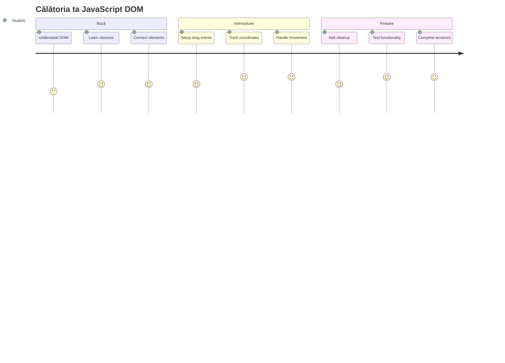
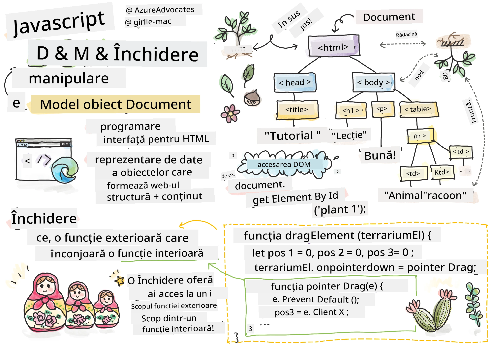
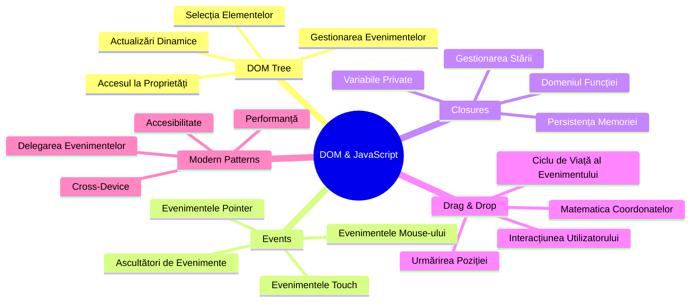
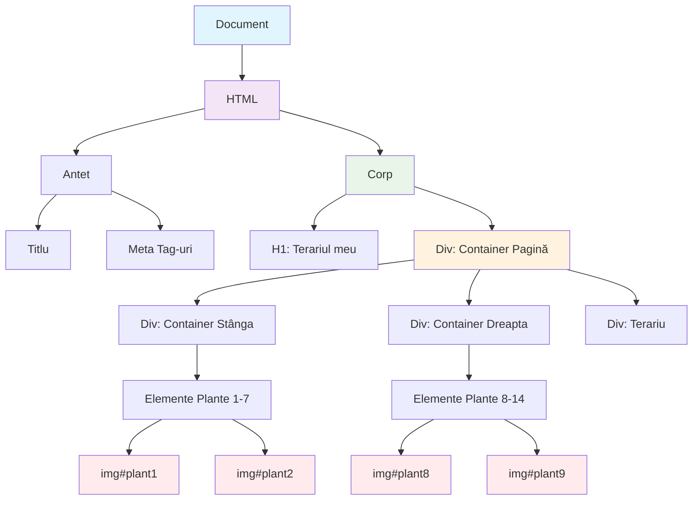
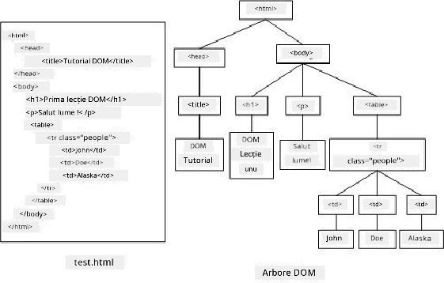
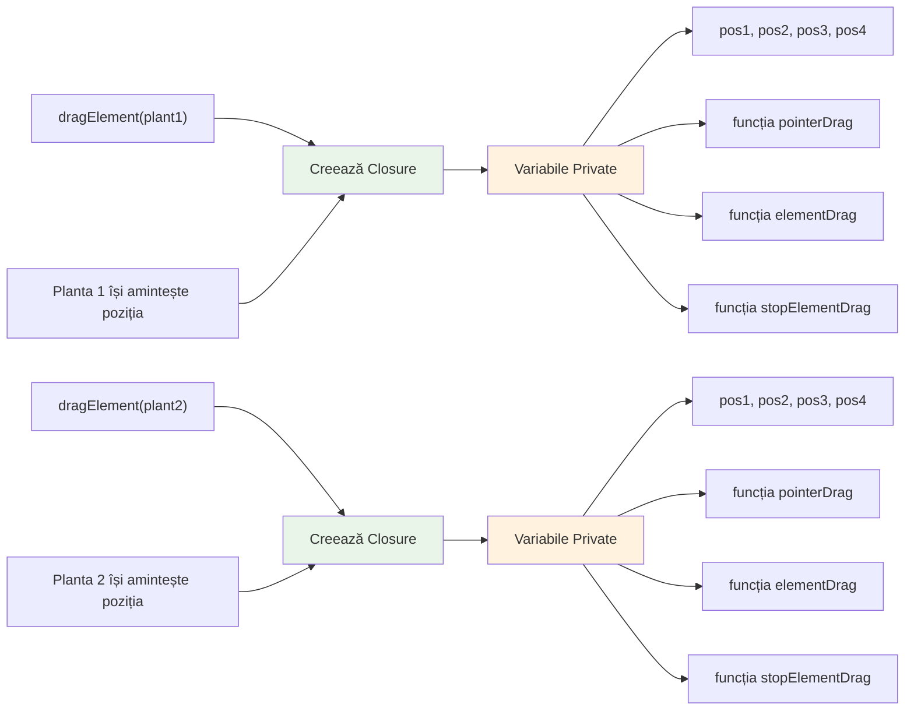
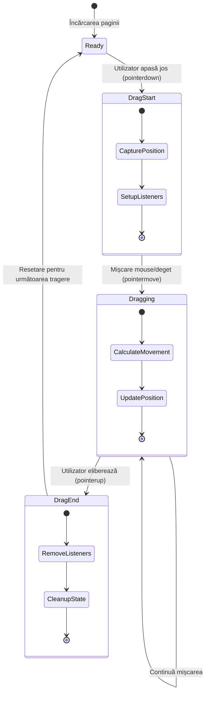
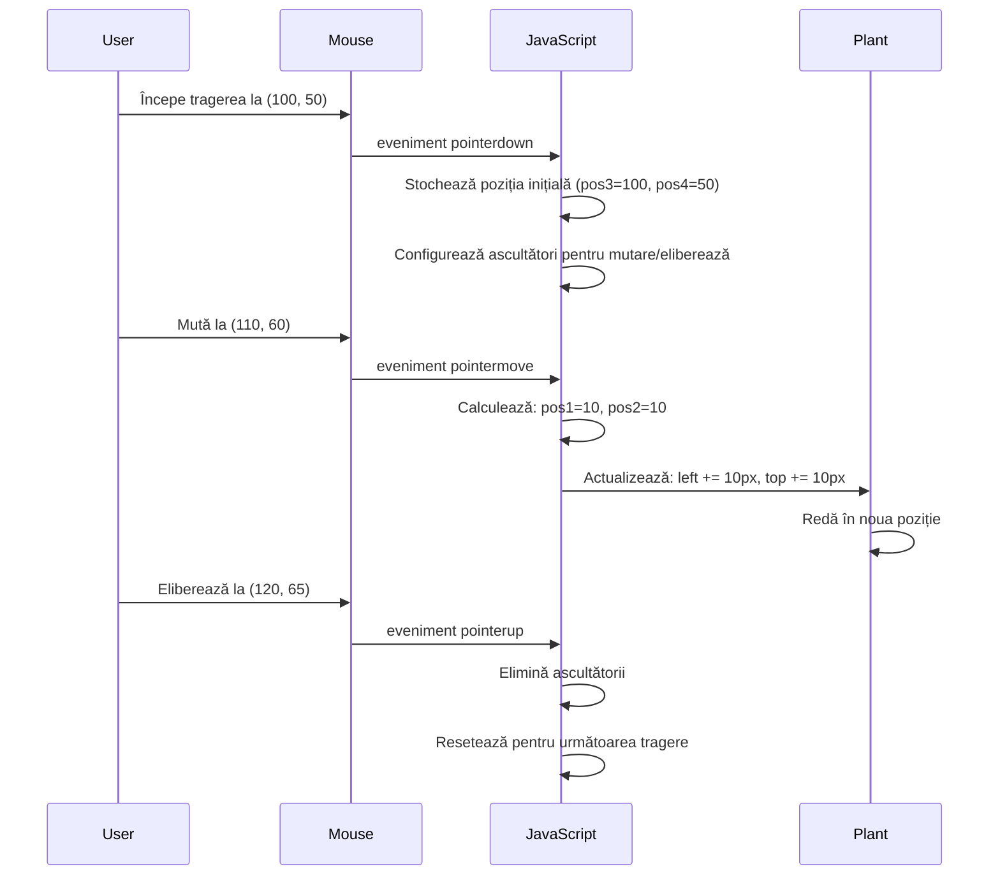
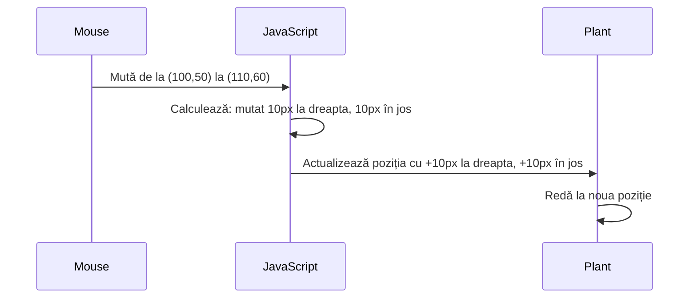
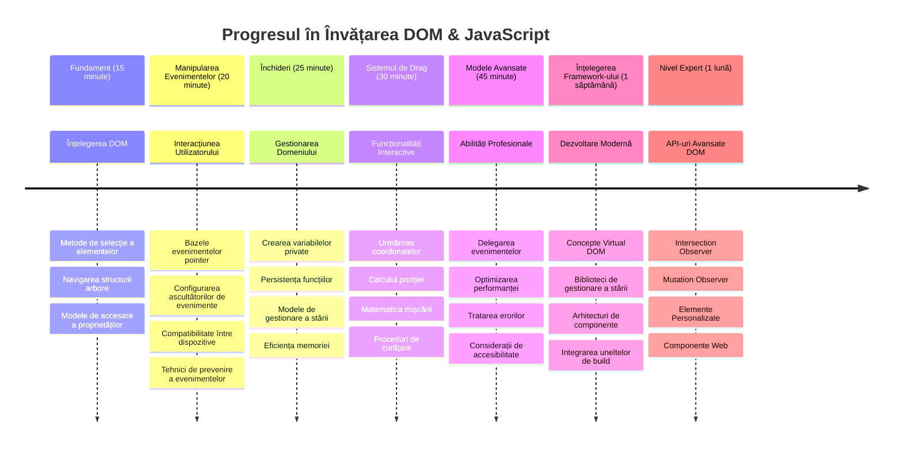

<!--
CO_OP_TRANSLATOR_METADATA:
{
  "original_hash": "973e48ad87d67bf5bb819746c9f8e302",
  "translation_date": "2026-01-07T06:11:00+00:00",
  "source_file": "3-terrarium/3-intro-to-DOM-and-closures/README.md",
  "language_code": "ro"
}
-->
# Proiectul Terariu Partea 3: Manipularea DOM și Închideri în JavaScript



> Sketchnote de [Tomomi Imura](https://twitter.com/girlie_mac)

Bine ați venit la unul dintre cele mai atractive aspecte ale dezvoltării web - a face lucrurile interactive! Document Object Model (DOM) este ca un pod între HTML-ul tău și JavaScript, iar astăzi îl vom folosi pentru a da viață terariului tău. Când Tim Berners-Lee a creat primul browser web, și-a imaginat o web unde documentele pot fi dinamice și interactive - DOM face această viziune posibilă.

Vom explora, de asemenea, închiderile JavaScript, care la început pot părea intimidante. Gândește-te la închideri ca la crearea unor „buzunare de memorie” unde funcțiile tale pot reține informații importante. Este ca și cum fiecare plantă din terariul tău ar avea propriul său registru de date pentru a-și urmări poziția. Până la finalul acestei lecții, vei înțelege cât de naturale și utile sunt ele.

Iată ce construim: un terariu în care utilizatorii pot trage și plasa plante oriunde doresc. Vei învăța tehnicile de manipulare a DOM care stau la baza a tot, de la încărcarea fișierelor prin drag-and-drop până la jocuri interactive. Haide să dăm viață terariului tău.


## Test Prealabil Lecției

[Test prealabil lecției](https://ff-quizzes.netlify.app/web/quiz/19)

## Înțelegerea DOM: Poarta ta către pagini web interactive

Document Object Model (DOM) este modul în care JavaScript comunică cu elementele tale HTML. Când browserul tău încarcă o pagină HTML, creează o reprezentare structurată a acelei pagini în memorie - asta este DOM-ul. Gândește-te la el ca la un arbore genealogic unde fiecare element HTML este un membru al familiei pe care JavaScript îl poate accesa, modifica sau rearanja.

Manipularea DOM transformă paginile statice în site-uri interactive. De fiecare dată când vezi un buton care își schimbă culoarea la trecerea mouse-ului, un conținut care se actualizează fără reîmprospătarea paginii, sau elemente pe care le poți trage în jur, asta este manipularea DOM în acțiune.




> O reprezentare a DOM și a marcajului HTML care îl referențiază. De la [Olfa Nasraoui](https://www.researchgate.net/publication/221417012_Profile-Based_Focused_Crawler_for_Social_Media-Sharing_Websites)

**Iată ce face DOM-ul puternic:**
- **Oferă** o modalitate structurată de a accesa orice element de pe pagina ta
- **Permite** actualizări dinamice ale conținutului fără reîmprospătarea paginii
- **Îngăduie** răspuns în timp real la interacțiunile utilizatorilor ca clicurile și tragerea
- **Creează** fundamentul pentru aplicații web moderne și interactive

## Închideri în JavaScript: Crearea de cod organizat și puternic

O [închidere JavaScript](https://developer.mozilla.org/docs/Web/JavaScript/Closures) este ca și cum ai da unei funcții propriul său spațiu de lucru privat cu memorie persistentă. Gândește-te cum finchii lui Darwin de pe Insulele Galápagos și-au dezvoltat fiecare ciocuri specializate în funcție de mediul lor specific - închiderile funcționează similar, creând funcții specializate care „își amintesc” contextul lor specific chiar și după ce funcția părinte s-a încheiat.

În terariul nostru, închiderile ajută fiecare plantă să-și amintească poziția în mod independent. Acest model apare frecvent în dezvoltarea profesională JavaScript, ceea ce îl face un concept valoros de înțeles.


> 💡 **Înțelegerea închiderilor**: Închiderile sunt un subiect important în JavaScript, iar mulți dezvoltatori le folosesc ani de zile înainte să înțeleagă pe deplin toate aspectele teoretice. Astăzi ne concentrăm pe aplicația practică - vei vedea cum închiderile apar natural pe măsură ce construim caracteristicile noastre interactive. Înțelegerea va crește pe măsură ce vezi cum rezolvă probleme reale.


> O reprezentare a DOM și a marcajului HTML care îl referențiază. De la [Olfa Nasraoui](https://www.researchgate.net/publication/221417012_Profile-Based_Focused_Crawler_for_Social_Media-Sharing_Websites)

În această lecție, vom finaliza proiectul nostru interactiv de terariu prin crearea codului JavaScript care va permite unui utilizator să manipuleze plantele de pe pagină.

## Înainte să începem: Pregătirea pentru succes

Ai nevoie de fișierele tale HTML și CSS din lecțiile anterioare despre terariu - suntem pe cale să facem designul static interactiv. Dacă vii pentru prima dată, parcurgerea acelor lecții mai întâi îți va oferi un context important.

Iată ce vom construi:
- **Tragere și plasare liniară** pentru toate plantele din terariu
- **Urmărirea coordonatelor** astfel încât plantele să-și amintească pozițiile
- **O interfață complet interactivă** utilizând JavaScript simplu (vanilla)
- **Cod curat și organizat** folosind modele de închidere

## Configurarea fișierului JavaScript

Hai să creăm fișierul JavaScript care va face terariul tău interactiv.

**Pasul 1: Creează fișierul script**

În folderul terariului tău, creează un fișier nou numit `script.js`.

**Pasul 2: Leagă JavaScript-ul de HTML-ul tău**

Adaugă acest tag script în secțiunea `<head>` a fișierului `index.html`:

```html
<script src="./script.js" defer></script>
```

**De ce este important atributul `defer`:**
- **Asigură** că JavaScript-ul tău așteaptă până când tot HTML-ul este încărcat
- **Previne** erorile când JavaScript caută elemente care încă nu sunt gata
- **Garantează** că toate elementele tale de plante sunt disponibile pentru interacțiune
- **Oferă** performanțe mai bune decât plasarea scripturilor la finalul paginii

> ⚠️ **Notă importantă**: Atributul `defer` previne probleme comune de sincronizare. Fără el, JavaScript-ul poate încerca să acceseze elemente HTML înainte să fie încărcate, cauzând erori.

---

## Conectarea JavaScript la elementele tale HTML

Înainte să putem face elementele de tras, JavaScript trebuie să le localizeze în DOM. Gândește-te la asta ca la un sistem de catalogare a unei biblioteci - odată ce ai numărul de catalog, poți găsi exact cartea de care ai nevoie și accesa tot conținutul ei.

Vom folosi metoda `document.getElementById()` pentru a face aceste conexiuni. Este ca un sistem precis de arhivare - dai un ID și el găsește exact elementul de care ai nevoie în HTML-ul tău.

### Activarea funcționalității de tragere pentru toate plantele

Adaugă acest cod în fișierul tău `script.js`:

```javascript
// Activează funcționalitatea de drag pentru toate cele 14 plante
dragElement(document.getElementById('plant1'));
dragElement(document.getElementById('plant2'));
dragElement(document.getElementById('plant3'));
dragElement(document.getElementById('plant4'));
dragElement(document.getElementById('plant5'));
dragElement(document.getElementById('plant6'));
dragElement(document.getElementById('plant7'));
dragElement(document.getElementById('plant8'));
dragElement(document.getElementById('plant9'));
dragElement(document.getElementById('plant10'));
dragElement(document.getElementById('plant11'));
dragElement(document.getElementById('plant12'));
dragElement(document.getElementById('plant13'));
dragElement(document.getElementById('plant14'));
```

**Iată ce face acest cod:**
- **Localizează** fiecare element plantă în DOM folosind ID-ul său unic
- **Recuperează** o referință JavaScript către fiecare element HTML
- **Trimite** fiecare element către o funcție `dragElement` (pe care o vom crea în continuare)
- **Pregătește** fiecare plantă pentru interacțiunea de tragere și plasare
- **Leagă** structura ta HTML de funcționalitatea JavaScript

> 🎯 **De ce folosim ID-uri în loc de clase?** ID-urile oferă identificatori unici pentru elementele specifice, în timp ce clasele CSS sunt gândite pentru a stiliza grupuri de elemente. Când JavaScript trebuie să manipuleze elemente individuale, ID-urile oferă precizia și performanța de care avem nevoie.

> 💡 **Sfat profesionist**: Observă cum apelăm `dragElement()` pentru fiecare plantă în parte. Această abordare asigură ca fiecare plantă să aibă comportamentul de tragere independent, esențial pentru o interacțiune lină cu utilizatorul.

### 🔄 **Verificare pedagogică**
**Înțelegerea conexiunii DOM**: Înainte de a trece la funcționalitatea de tragere, verifică dacă poți:
- ✅ Explica cum localizează `document.getElementById()` elementele HTML
- ✅ Înțelege de ce folosim ID-uri unice pentru fiecare plantă
- ✅ Descrie scopul atributului `defer` în tagurile script
- ✅ Recunoaște cum se conectează JavaScript-ul și HTML-ul prin DOM

**Test rapid**: Ce s-ar întâmpla dacă două elemente ar avea același ID? De ce `getElementById()` returnează doar un element?
*Răspuns: ID-urile trebuie să fie unice; dacă sunt duplicate, este returnat doar primul element*

---

## Construirea închiderii dragElement

Acum vom crea inima funcționalității noastre de tragere: o închidere care gestionează comportamentul de tras pentru fiecare plantă. Această închidere va conține mai multe funcții interne care lucrează împreună pentru a urmări mișcările mouse-ului și a actualiza pozițiile elementelor.

Închiderile sunt perfecte pentru această sarcină deoarece ne permit să creăm variabile „private” care persistă între apelurile funcțiilor, oferind fiecărei plante propriul sistem independent de urmărire a coordonatelor.

### Înțelegerea închiderilor printr-un exemplu simplu

Hai să demonstrăm închiderile cu un exemplu simplu care ilustrează conceptul:

```javascript
function createCounter() {
    let count = 0; // Acesta este ca o variabilă privată
    
    function increment() {
        count++; // Funcția internă își amintește variabila exterioară
        return count;
    }
    
    return increment; // Returnăm funcția internă
}

const myCounter = createCounter();
console.log(myCounter()); // 1
console.log(myCounter()); // 2
```

**Ce se întâmplă în acest model de închidere:**
- **Creează** o variabilă privată `count` care există doar în cadrul acestei închideri
- **Funcția internă** poate accesa și modifica acea variabilă externă (mecanismul închiderii)
- **Când returnăm** funcția internă, ea își păstrează conexiunea cu acele date private
- **Chiar și după** ce `createCounter()` se termină, `count` persistă și își amintește valoarea

### De ce închiderile sunt perfecte pentru funcționalitatea de tragere

Pentru terariul nostru, fiecare plantă trebuie să-și amintească coordonatele poziției curente. Închiderile oferă soluția perfectă:

**Beneficiile cheie pentru proiectul nostru:**
- **Menține** variabile private de poziție pentru fiecare plantă în mod independent
- **Păstrează** datele coordonatelor între evenimentele de tragere
- **Previne** conflictele de variabile între elemente diferite tragabile
- **Creează** un cod curat și organizat

> 🎯 **Obiectiv de învățare**: Nu trebuie să stăpânești fiecare detaliu al închiderilor acum. Concentrează-te pe a vedea cum ne ajută să organizăm codul și să menținem starea pentru funcționalitatea de tragere.


### Crearea funcției dragElement

Acum să construim funcția principală care va gestiona întreaga logică de tragere. Adaugă această funcție sub declarațiile elementelor plantelor:

```javascript
function dragElement(terrariumElement) {
    // Inițializează variabilele de urmărire a poziției
    let pos1 = 0,  // Poziția anterioară a mouse-ului pe axa X
        pos2 = 0,  // Poziția anterioară a mouse-ului pe axa Y
        pos3 = 0,  // Poziția curentă a mouse-ului pe axa X
        pos4 = 0;  // Poziția curentă a mouse-ului pe axa Y
    
    // Configurează ascultătorul de evenimente de drag inițial
    terrariumElement.onpointerdown = pointerDrag;
}
```

**Înțelegerea sistemului de urmărire a poziției:**
- **`pos1` și `pos2`**: Stochează diferența dintre pozițiile vechi și noi ale mouse-ului
- **`pos3` și `pos4`**: Urmăresc coordonatele curente ale mouse-ului
- **`terrariumElement`**: Elementul specific al plantei pe care îl facem tragabil
- **`onpointerdown`**: Evenimentul care declanșează când utilizatorul începe să tragă

**Cum funcționează tiparul închiderii:**
- **Creează** variabile private de poziție pentru fiecare element plantă
- **Menține** aceste variabile pe tot parcursul ciclului de viață al tragerii
- **Asigură** că fiecare plantă își urmărește coordonatele independent
- **Oferă** o interfață curată prin funcția `dragElement`

### De ce folosim evenimentele pointer?

Te-ai putea întreba de ce folosim `onpointerdown` în loc de mai familiarul `onclick`. Iată raționamentul:

| Tip Eveniment | Cel Mai Potrivit Pentru | Partea Negativă |
|---------------|------------------------|-----------------|
| `onclick`     | Clicuri simple pe butoane | Nu poate gestiona tragerea (doar clicuri și eliberări) |
| `onpointerdown` | Mouse și touch | Nou, dar bine suportat în zilele noastre |
| `onmousedown` | Doar mouse desktop | Exclude utilizatorii de pe mobil |

**De ce evenimentele pointer sunt perfecte pentru ce construim:**
- **Funcționează bine** indiferent dacă cineva folosește mouse, deget sau chiar un stylus
- **Se simte la fel** pe laptop, tabletă sau telefon mobil
- **Gestionează** mișcarea efectivă de tragere (nu doar clic și gata)
- **Creează** o experiență lină pe care utilizatorii o așteaptă de la aplicațiile web moderne

> 💡 **Pregătire pentru viitor**: Evenimentele pointer sunt modul modern de a gestiona interacțiunile utilizatorilor. În loc să scrii cod separat pentru mouse și touch, le obții pe ambele gratuit. Destul de tare, nu?

### 🔄 **Verificare pedagogică**
**Înțelegerea gestionării evenimentelor**: Fă o pauză să confirmi dacă ai înțeles:
- ✅ De ce folosim evenimente pointer în loc de evenimente mouse?
- ✅ Cum persistă variabilele închiderii între apelurile funcțiilor?
- ✅ Ce rol joacă `preventDefault()` pentru tragerea lină?
- ✅ De ce atașăm ascultători la document în loc de elemente individuale?

**Conexiune cu lumea reală**: Gândește-te la interfețele drag-and-drop pe care le folosești zilnic:
- **Încărcări fișiere**: Tragerea fișierelor într-o fereastră de browser
- **Table Kanban**: Mutarea sarcinilor între coloane
- **Galerii foto**: Reordonarea pozelor
- **Interfețe mobile**: Glisarea și tragerea pe ecranele tactile

---

## Funcția pointerDrag: Capturarea începerii unei trageri

Când un utilizator apasă pe o plantă (fie cu clic de mouse sau atingere cu degetul), funcția `pointerDrag` intră în acțiune. Această funcție capturează coordonatele inițiale și configurează sistemul de tras.

Adaugă această funcție în interiorul închiderii `dragElement`, imediat după linia `terrariumElement.onpointerdown = pointerDrag;`:

```javascript
function pointerDrag(e) {
    // Previne comportamentul implicit al browserului (precum selecția textului)
    e.preventDefault();
    
    // Capturează poziția inițială a mouse-ului/touch-ului
    pos3 = e.clientX;  // Coordonata X unde a început tragerea
    pos4 = e.clientY;  // Coordonata Y unde a început tragerea
    
    // Configurează ascultători de evenimente pentru procesul de tragere
    document.onpointermove = elementDrag;
    document.onpointerup = stopElementDrag;
}
```

**Pas cu pas, ce se întâmplă aici:**
- **Previne** comportamentele implicite ale browserului care s-ar putea interfera cu tragerea
- **Înregistrează** coordonatele exacte unde utilizatorul a început gestul de tragere
- **Stabilește** ascultători de evenimente pentru mișcarea continuă a tragerii
- **Pregătește** sistemul pentru a urmări mișcarea mouse-ului/degetului peste întreg documentul

### Înțelegerea prevenirii evenimentelor

Linia `e.preventDefault()` este crucială pentru o tragere lină:

**Fără prevenire, browserele ar putea:**
- **Selecta** textul când se trage peste pagină
- **Declanșa** meniuri contextuale la tragere cu clic dreapta
- **Interfera** cu comportamentul personalizat de tragere
- **Crea** artefacte vizuale în timpul operației de tragere

> 🔍 **Experiment**: După ce termini această lecție, încearcă să elimini `e.preventDefault()` și vezi cum afectează experiența de tragere. Vei înțelege rapid de ce această linie este esențială!

### Sistemul de urmărire a coordonatelor

Proprietățile `e.clientX` și `e.clientY` ne oferă coordonatele precise ale mouse-ului/atingerii:

| Proprietate | Ce măsoară | Utilizare |
|-------------|------------|-----------|
| `clientX`   | Poziția orizontală relativă la fereastra vizuală | Urmărirea mișcării stânga-dreapta |
| `clientY`   | Poziția verticală relativă la fereastra vizuală | Urmărirea mișcării sus-jos |
**Înțelegerea acestor coordonate:**
- **Oferă** informații de poziționare pixel-perfect
- **Se actualizează** în timp real pe măsură ce utilizatorul își mișcă cursorul
- **Rămâne** consecvent pe diferite dimensiuni de ecran și niveluri de zoom
- **Permite** interacțiuni de drag lineare și responsive

### Configurarea ascultătorilor de evenimente la nivel de document

Observă cum atașăm evenimentele de mișcare și oprire întregului `document`, nu doar elementului plantei:

```javascript
document.onpointermove = elementDrag;
document.onpointerup = stopElementDrag;
```

**De ce facem atașarea la document:**
- **Continuă** urmărirea chiar și când mouse-ul părăsește elementul plantei
- **Previne** întreruperea tragerii dacă utilizatorul se mișcă rapid
- **Oferă** o tragere fluidă pe întreg ecranul
- **Gestionează** cazurile speciale în care cursorul iese în afara ferestrei browserului

> ⚡ **Notă despre performanță**: Vom curăța acești ascultători la nivel de document când tragerea se oprește pentru a evita scurgerile de memorie și probleme de performanță.

## Completarea sistemului de tragere: Mișcare și curățare

Acum vom adăuga cele două funcții rămase care se ocupă de mișcarea efectivă a tragerii și de curățarea când tragerea încetează. Aceste funcții lucrează împreună pentru a crea o mișcare fluidă și responsive a plantei prin terrariul tău.

### Funcția elementDrag: Urmărirea mișcării

Adaugă funcția `elementDrag` imediat după acolada de închidere a funcției `pointerDrag`:

```javascript
function elementDrag(e) {
    // Calculează distanța parcursă de la ultimul eveniment
    pos1 = pos3 - e.clientX;  // Distanța orizontală parcursă
    pos2 = pos4 - e.clientY;  // Distanța verticală parcurse
    
    // Actualizează urmărirea poziției curente
    pos3 = e.clientX;  // Noua poziție curentă pe axa X
    pos4 = e.clientY;  // Noua poziție curentă pe axa Y
    
    // Aplică mișcarea la poziția elementului
    terrariumElement.style.top = (terrariumElement.offsetTop - pos2) + 'px';
    terrariumElement.style.left = (terrariumElement.offsetLeft - pos1) + 'px';
}
```

**Înțelegerea matematicii coordonatelor:**
- **`pos1` și `pos2`**: Calculează cât de mult s-a mișcat mouse-ul de la ultima actualizare
- **`pos3` și `pos4`**: Stochează poziția curentă a mouse-ului pentru următorul calcul
- **`offsetTop` și `offsetLeft`**: Obțin poziția curentă a elementului în pagină
- **Logica scăderii**: Mută elementul cu aceeași distanță cu care s-a mișcat mouse-ul


**Iată o defalcare a calculelor de mișcare:**
1. **Măsoară** diferența între vechile și noile poziții ale mouse-ului
2. **Calculează** cât trebuie mutat elementul pe baza mișcării mouse-ului
3. **Actualizează** proprietățile CSS de poziționare ale elementului în timp real
4. **Stochează** noua poziție ca referință pentru următorul calcul de mișcare

### Reprezentare vizuală a matematicii


### Funcția stopElementDrag: Curățarea

Adaugă funcția de curățare după acolada de închidere a funcției `elementDrag`:

```javascript
function stopElementDrag() {
    // Elimină ascultătorii de evenimente la nivel de document
    document.onpointerup = null;
    document.onpointermove = null;
}
```

**De ce este esențială curățarea:**
- **Previne** scurgerile de memorie cauzate de ascultătorii de evenimente rămași
- **Oprește** comportamentul de tragere când utilizatorul eliberează planta
- **Permite** altor elemente să fie trase independent
- **Resetează** sistemul pentru următoarea operațiune de tragere

**Ce se întâmplă fără curățare:**
- Ascultătorii de evenimente continuă să ruleze după ce tragerea se oprește
- Performanța degradează pe măsură ce ascultătorii nefolosiți se acumulează
- Comportament neașteptat la interacțiunea cu alte elemente
- Resursele browserului sunt risipite pe gestionarea evenimentelor inutile

### Înțelegerea proprietăților CSS de poziționare

Sistemul nostru de tragere manipulează două proprietăți CSS cheie:

| Proprietate | La ce controlează | Cum o folosim |
|------------|--------------------|--------------|
| `top` | Distanță față de marginea de sus | Poziționare verticală în timpul tragerii |
| `left` | Distanță față de marginea din stânga | Poziționare orizontală în timpul tragerii |

**Informații cheie despre proprietățile offset:**
- **`offsetTop`**: Distanța curentă față de partea de sus a elementului părinte poziționat
- **`offsetLeft`**: Distanța curentă față de partea stângă a elementului părinte poziționat
- **Contextul poziționării**: Aceste valori sunt relative la cel mai apropiat strămoș poziționat
- **Actualizări în timp real**: Se schimbă imediat ce modificăm proprietățile CSS

> 🎯 **Filosofia designului**: Acest sistem de tragere este intenționat flexibil – nu există „zone de plasare” sau restricții. Utilizatorii pot așeza plante oriunde, având control creativ complet asupra designului terariului.

## Punând totul cap la cap: Sistemul tău complet de tragere

Felicitări! Tocmai ai construit un sistem sofisticat de drag-and-drop folosind JavaScript simplu. Funcția ta completă `dragElement` conține acum un closure puternic care gestionează:

**Ce realizează closure-ul tău:**
- **Menține** variabile private de poziție pentru fiecare plantă independent
- **Gestionează** întreg ciclul de viață al tragerii de la început la sfârșit
- **Oferă** o mișcare fluidă și responsive pe întreg ecranul
- **Curăță** resursele corespunzător pentru a preveni scurgeri de memorie
- **Creează** o interfață intuitivă și creativă pentru designul terariului

### Testarea terariului tău interactiv

Acum testează-ți terariul interactiv! Deschide fișierul `index.html` într-un browser web și încearcă funcționalitățile:

1. **Fă click și ține apăsat** pe orice plantă pentru a începe tragerea
2. **Mişcă mouse-ul sau degetul** și urmărește cum planta urmează fluid mișcarea
3. **Eliberează** pentru a plasa planta în noua poziție
4. **Experimentează** cu diferite aranjamente pentru a explora interfața

🥇 **Realizare**: Ai creat o aplicație web complet interactivă folosind concepte de bază pe care dezvoltatorii profesioniști le folosesc zilnic. Funcționalitatea de drag-and-drop utilizează aceleași principii din spatele upload-urilor de fișiere, tablourilor kanban și multor alte interfețe interactive.

### 🔄 **Verificare pedagogică**
**Înțelegerea completă a sistemului**: Verifică-ți stăpânirea asupra întregului sistem de tragere:
- ✅ Cum mențin closure-urile un stat independent pentru fiecare plantă?
- ✅ De ce este necesar calculul matematic al coordonatelor pentru o mișcare fluidă?
- ✅ Ce se întâmplă dacă uităm să curățăm ascultătorii de evenimente?
- ✅ Cum se poate scala acest model pentru interacțiuni mai complexe?

**Reflecție asupra calității codului**: Revizuiește soluția ta completă:
- **Design modular**: Fiecare plantă are propria instanță de closure
- **Eficiență a evenimentelor**: Configurare și curățare corectă a ascultătorilor
- **Suport cross-device**: Funcționează pe desktop și pe mobil
- **Conștientizare a performanței**: Fără scurgeri de memorie sau calcule redundante


---

## Provocarea GitHub Copilot Agent 🚀

Folosește modul Agent pentru a completa următoarea provocare:

**Descriere:** Extinde proiectul terrariului adăugând o funcție de resetare care readuce toate plantele la pozițiile lor inițiale cu animații line.

**Prompt:** Creează un buton de reset care, la clic, animează toate plantele înapoi la pozițiile lor inițiale din bara laterală folosind tranziții CSS. Funcția ar trebui să stocheze pozițiile inițiale când se încarcă pagina și să tranziționeze lin plantele înapoi la acele poziții în decurs de 1 secundă când butonul de reset este apăsat.

Află mai multe despre [modul agent](https://code.visualstudio.com/blogs/2025/02/24/introducing-copilot-agent-mode) aici.

## 🚀 Provocare suplimentară: Extinde-ți abilitățile

Ești gata să duci terrariul tău la un nou nivel? Încearcă să implementezi aceste îmbunătățiri:

**Extensii creative:**
- **Dublu click** pe o plantă pentru a o aduce în față (manipulare z-index)
- **Adaugă feedback vizual** precum o strălucire subtilă când plasezi cursorul peste plante
- **Implementează limite** pentru a preveni tragerea plantelor în afara terariului
- **Creează o funcție de salvare** care reține pozițiile plantelor folosind localStorage
- **Adaugă efecte sonore** pentru ridicarea și plasarea plantelor

> 💡 **Oportunitate de învățare**: Fiecare dintre aceste provocări te va învăța noi aspecte ale manipulării DOM, gestionării evenimentelor și designului experienței utilizatorului.

## Test post-lectură

[Test post-lectură](https://ff-quizzes.netlify.app/web/quiz/20)

## Recapitulare & Studiu individual: Adâncirea înțelegerii

Ai stăpânit fundamentele manipulării DOM și closures, dar întotdeauna există mai mult de explorat! Iată câteva căi pentru a-ți extinde cunoștințele și abilitățile.

### Alternative pentru Drag and Drop

Am folosit evenimentele pointer pentru flexibilitate maximă, dar web development oferă multiple abordări:

| Abordare | Potrivit pentru | Valoare educațională |
|----------|-----------------|---------------------|
| [API-ul HTML Drag and Drop](https://developer.mozilla.org/docs/Web/API/HTML_Drag_and_Drop_API) | Upload-uri de fișiere, zone formale de drag | Înțelegerea capacităților native ale browserului |
| [Evenimente Touch](https://developer.mozilla.org/docs/Web/API/Touch_events) | Interacțiuni specifice pe mobil | Modele de dezvoltare mobile-first |
| Proprietăți CSS `transform` | Animații fluide | Tehnici de optimizare a performanței |

### Subiecte avansate de manipulare DOM

**Pașii următori în călătoria ta de învățare:**
- **Delegare de evenimente**: Gestionarea eficientă a evenimentelor pentru multiple elemente
- **Intersection Observer**: Detectarea când elementele intră sau ies din viewport
- **Mutation Observer**: Monitorizarea schimbărilor în structura DOM
- **Componente Web**: Crearea de elemente UI reutilizabile și încapsulate
- **Concepte Virtual DOM**: Înțelegerea modului în care framework-urile optimizează actualizările DOM

### Resurse esențiale pentru învățare continuă

**Documentație tehnică:**
- [Ghid MDN pentru Pointer Events](https://developer.mozilla.org/docs/Web/API/Pointer_events) - Referință completă pentru pointer events
- [Specificația W3C pentru Pointer Events](https://www.w3.org/TR/pointerevents1/) - Documentație oficială a standardelor
- [Înțelegere profundă a closure-urilor JavaScript](https://developer.mozilla.org/docs/Web/JavaScript/Closures) - Modele avansate de closure

**Compatibilitatea browserelor:**
- [CanIUse.com](https://caniuse.com/) - Verifică suportul caracteristicilor în browsere
- [Date de compatibilitate MDN Browser](https://github.com/mdn/browser-compat-data) - Informații detaliate despre compatibilitate

**Oportunități practice:**
- **Construiește** un joc puzzle folosind mecanisme similare de tragere
- **Creează** un panou kanban cu gestionare drag-and-drop a sarcinilor
- **Design** o galerie foto cu aranjamente dragabile
- **Experimentează** gesturile touch pentru interfețele mobile

> 🎯 **Strategie de învățare**: Cea mai bună metodă de a fixa aceste concepte este prin practică. Încearcă să construiești variații de interfețe dragabile – fiecare proiect îți va arăta ceva nou despre interacțiunea utilizatorului și manipularea DOM.

### ⚡ **Ce poți face în următoarele 5 minute**
- [ ] Deschide DevTools în browser și tastează `document.querySelector('body')` în consolă
- [ ] Încearcă să schimbi textul unei pagini folosind `innerHTML` sau `textContent`
- [ ] Adaugă un ascultător pentru evenimentul click pe orice buton sau link de pe o pagină web
- [ ] Inspectează structura DOM folosind panoul Elements

### 🎯 **Ce poți realiza în această oră**
- [ ] Completează quiz-ul post-lectură și recapitulează conceptele manipulării DOM
- [ ] Creează o pagină web interactivă care răspunde la click-uri
- [ ] Exersează gestionarea evenimentelor cu tipuri diferite (click, mouseover, keypress)
- [ ] Construiește o listă simplă de sarcini sau un contor folosind manipularea DOM
- [ ] Explorează relația dintre elementele HTML și obiectele JavaScript

### 📅 **Călătoria ta JavaScript săptămânală**
- [ ] Completează proiectul terrarium interactiv cu funcționalitate drag-and-drop
- [ ] Stăpânește delegarea evenimentelor pentru o gestionare eficientă
- [ ] Învață despre event loop și JavaScript asincron
- [ ] Exersează closures construind module cu stare privată
- [ ] Explorează API-uri moderne DOM precum Intersection Observer
- [ ] Construiește componente interactive fără a utiliza framework-uri

### 🌟 **Maestria ta JavaScript lunară**
- [ ] Creează o aplicație complexă SPA folosind JavaScript pur
- [ ] Învață un framework modern (React, Vue, sau Angular) și compară-l cu manipularea DOM vanilla
- [ ] Contribuie la proiecte open source JavaScript
- [ ] Stăpânește concepte avansate precum web components și elemente customizate
- [ ] Construiește aplicații web performante cu modele DOM optime
- [ ] Predă altora despre manipularea DOM și fundamentele JavaScript

## 🎯 Cronologia ta pentru stăpânirea DOM în JavaScript


### 🛠️ Rezumatul trusei tale de instrumente JavaScript

După completarea acestei lecții, ai acum:
- **Stăpânire DOM**: Selecția elementelor, manipularea proprietăților și navigarea în arbore
- **Experiență cu evenimente**: Gestionarea interacțiunilor cross-device folosind pointer events
- **Înțelegere a closure-urilor**: Administrarea stării private și persistența funcțiilor
- **Sisteme interactive**: Implementarea completă a drag-and-drop de la zero
- **Conștientizare a performanței**: Curățare corectă a evenimentelor și managementul memoriei
- **Modele moderne**: Tehnici de organizare a codului folosite în dezvoltarea profesională
- **Experiență utilizator**: Crearea de interfețe intuitive și responsive

**Abilități profesionale dobândite**: Ai construit funcționalități folosind aceleași tehnici ca:
- **Trello/tablouri Kanban**: Tragerea cardurilor între coloane
- **Sisteme de upload fișiere**: Manipulare drag-and-drop a fișierelor
- **Galerii foto**: Interfețe de aranjare a fotografiilor
- **Aplicații mobile**: Modele de interacțiune bazate pe touch

**Nivel următor**: Ești pregătit să explorezi framework-uri moderne precum React, Vue sau Angular care se bazează pe aceste concepte fundamentale de manipulare DOM!

## Temă

[Lucrează puțin mai mult cu DOM-ul](assignment.md)

---

<!-- CO-OP TRANSLATOR DISCLAIMER START -->
**Declinarea răspunderii**:
Acest document a fost tradus folosind serviciul de traducere AI [Co-op Translator](https://github.com/Azure/co-op-translator). Deși ne străduim pentru acuratețe, vă rugăm să țineți cont că traducerile automate pot conține erori sau inexactități. Documentul original în limba sa nativă trebuie considerat sursa autorizată. Pentru informații critice, se recomandă traducerea profesională realizată de un specialist uman. Nu ne asumăm responsabilitatea pentru eventualele neînțelegeri sau interpretări greșite cauzate de utilizarea acestei traduceri.
<!-- CO-OP TRANSLATOR DISCLAIMER END -->